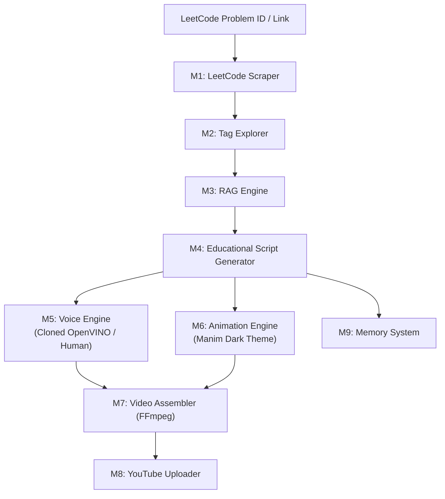

# Context: Architecture Overview & Module Schemas (`architecture.md`)

The pipeline automates educational YouTube video creation for LeetCode / DSA problems using an end-to-end local architecture.

---

## 1. System Module Flow



---

## 2. Module Specifications

1. **M1: LeetCode Scraper:** GraphQL API client extracting accepted C++ solutions, constraints, and problem text.
2. **M2: Tag Explorer:** Identifies technique tags (Fast & Slow Pointers, DP, Graphs) for targeted retrieval.
3. **M3: RAG Knowledge Engine:** LlamaIndex + ChromaDB hybrid search providing intuition and edge cases.
4. **M4: Script Generator:** Gemini 2.5 Flash synthesis producing structured 10-section JSON scripts.
5. **M5: Voice Engine:** Hybrid Kokoro-82M OpenVINO synthesis or guided human teleprompter.
6. **M6: Animation Engine:** Dark-themed Manim visual scenes including C++ typing animations.
7. **M7: Video Assembler:** FFmpeg stitching of audio WAVs, Manim MP4 clips, and background audio.
8. **M8: YouTube Uploader:** Private upload via YouTube API v3 with auto-generated metadata.
9. **M9: Memory System:** Local JSON knowledge graph persisting processed problem states.

---

## 3. Module 9 (Memory System) JSON Schema

Processed problems are saved under `data/memory/{problem_id}_{title_slug}.json` for future Q&A retrieval and automated playlist creation.

```json
{
  "$schema": "http://json-schema.org/draft-07/schema#",
  "title": "ProblemMemoryRecord",
  "type": "object",
  "required": [
    "problem_id",
    "title",
    "title_slug",
    "difficulty",
    "tags",
    "cpp_solution",
    "complexity",
    "video_metadata",
    "processed_at"
  ],
  "properties": {
    "problem_id": { "type": "integer", "example": 143 },
    "title": { "type": "string", "example": "Reorder List" },
    "title_slug": { "type": "string", "example": "reorder-list" },
    "difficulty": { "type": "string", "enum": ["Easy", "Medium", "Hard"] },
    "tags": {
      "type": "array",
      "items": { "type": "string" },
      "example": ["Linked List", "Two Pointers"]
    },
    "cpp_solution": {
      "type": "string",
      "description": "User's accepted C++ code solution"
    },
    "complexity": {
      "type": "object",
      "required": ["time", "space"],
      "properties": {
        "time": { "type": "string", "example": "O(N)" },
        "space": { "type": "string", "example": "O(1)" }
      }
    },
    "edge_cases": {
      "type": "array",
      "items": { "type": "string" },
      "example": ["Empty list (head == nullptr)", "Single node (head->next == nullptr)", "Odd vs Even length lists"]
    },
    "video_metadata": {
      "type": "object",
      "required": ["youtube_video_id", "youtube_url", "privacy_status"],
      "properties": {
        "youtube_video_id": { "type": "string", "example": "dQw4w9WgXcQ" },
        "youtube_url": { "type": "string", "example": "https://youtu.be/dQw4w9WgXcQ" },
        "privacy_status": { "type": "string", "example": "private" }
      }
    },
    "processed_at": { "type": "string", "format": "date-time", "example": "2026-07-21T12:00:00Z" }
  }
}
```
