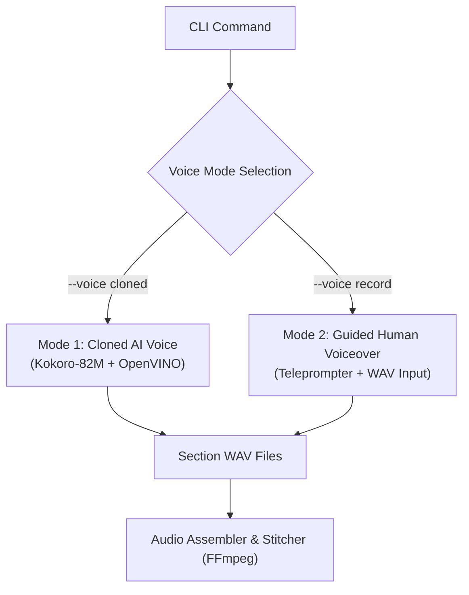

# Context: Hybrid Voice Modes (`voice_modes.md`)

This document details the hybrid voice architecture, CLI options, local Kokoro-82M synthesis, guided human recording teleprompter flow, and audio stitching pipeline.

---

## 1. Voice Architecture Overview

The pipeline supports two distinct voice modes to balance automated daily video production with high-touch flagship content:



---

## 2. CLI Interface & Selection

The user selects the voice mode at CLI invocation:

```bash
# Mode 1: Fully Automated Cloned Voice (Default)
python src/pipeline.py --problem 143 --voice cloned

# Mode 2: Guided Human Voiceover
python src/pipeline.py --problem 143 --voice record
```

---

## 3. Mode 1: Automated Cloned Voice (`--voice cloned`)

- **Engine:** Kokoro-82M TTS model running locally via OpenVINO runtime on Intel Core Ultra CPU/NPU.
- **Input:** Script JSON text sections + 256-dimensional speaker vector extracted from user's `voice_samples/reference.wav`.
- **Output:** Synthesized audio WAV files for each of the 10 video sections in ~2-3 minutes total.

---

## 4. Mode 2: Guided Human Recording (`--voice record`)

- **Interactive Teleprompter:** Terminal displays section text with target pacing durations:
  ```
  =======================================================
  SECTION 3/10: INTUITION (Target Duration: 60s)
  -------------------------------------------------------
  "Think of a linked list like a deck of cards. To reorder
  the list, we split the deck in half..."
  =======================================================
  Press ENTER when ready to record, or save file to data/audio/section_03.wav
  ```
- **WAV Ingestion:** System reads recorded `.wav` files from `data/audio/section_XX.wav`.

---

## 5. Audio Stitching & Synchronization

- **Normalizing:** Audio files pass through FFmpeg loudnorm filter (`-af loudnorm`) for consistent -14 LUFS YouTube volume.
- **Section Alignment:** Video animation scenes in Manim are automatically timed to match exact section WAV audio durations (`ffprobe`).
- **Concatenation:** Final audio tracks are merged with a subtle background track (-25dB) into the final MP4 container.
