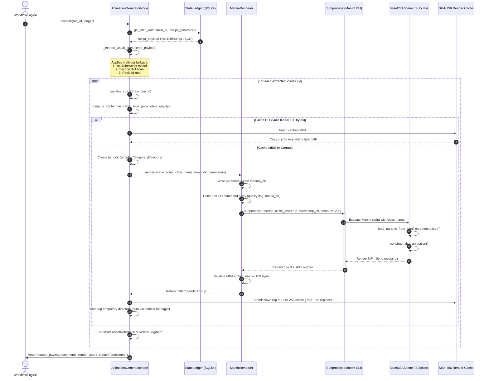
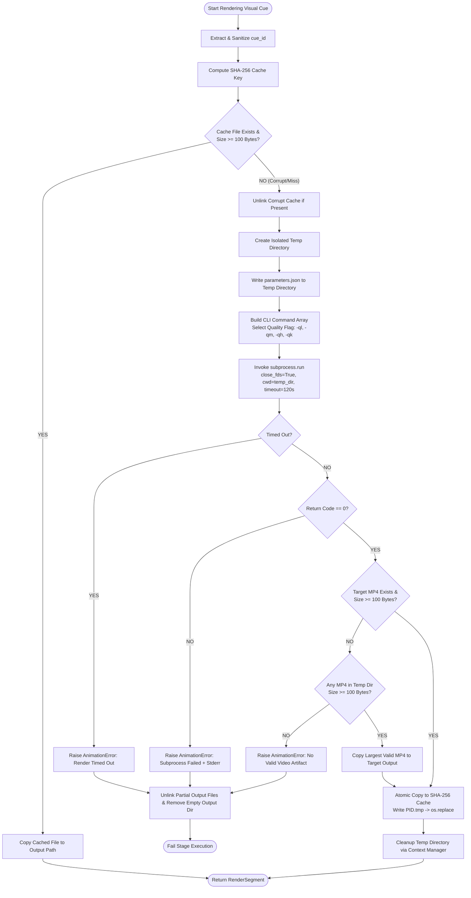

# Comprehensive Architectural Analysis & Blueprint: Rendering Boundaries, Scene Mapping, and CLI Invocation Strategies

**Agent**: `explorer_m3_1`  
**Working Directory**: `/home/adarsh/Documents/Youtube-Channel/.agents/explorer_m3_1`  
**Target Output Document**: `PromptBook/Phase12/01_Animation_Production.md` (Milestone 3)  
**Date**: 2026-07-30  

---

## Executive Summary

This report delivers a deep architectural analysis and production-grade documentation blueprint for the **Rendering Boundaries, Scene Mapping, and CLI Invocation Strategies** of the Phase 12 Media Production (Manim Animation) subsystem in the Automated DSA Educational YouTube Video Pipeline.

The subsystem bridges high-level AI-generated YouTube scripts (`YouTubeScript`) and low-level Manim programmatic scene rendering. It enforces strict boundary contracts with the SQLite `StateLedger`, guarantees structural resilience via multi-tiered visual cue extraction fallbacks, maps 8 core visual cue domains to dedicated Manim scene classes, and executes renders within isolated, leak-free subprocess sandboxes.

---

## 1. Rendering Boundaries & State Ledger Contract

The `AnimationGeneratorNode` (`src/pipeline/nodes/animation_generator_node.py`) inherits from `Node` (`src/core/workflow/node.py`) and functions as an idempotent pipeline stage within the `WorkflowEngine`. It does not exchange in-memory objects with prior or subsequent nodes; all inputs and outputs are strictly validated and persisted via the SQLite `StateLedger`.

```
+-------------------+      Read Payload      +------------------------+
|   StateLedger     | ---------------------> | AnimationGeneratorNode |
| step: script_gen  |                        |                        |
+-------------------+                        +------------------------+
          ^                                               |
          |               Write Payload                   |
          +-----------------------------------------------+
                        step: animation_generator
```

### 1.1 Input Contract (`script_generator` Step Output)
`AnimationGeneratorNode.execute(run_id, ledger)` fetches the prior step output registered under `step_name="script_generator"`.

* **Expected Payload Format**:
  ```json
  {
    "slug": "two-sum",
    "script": {
      "topic": "Two Sum",
      "slug": "two-sum",
      "difficulty": "Easy",
      "total_duration": 30.0,
      "hook": {
        "title": "Hook",
        "narration": "...",
        "estimated_duration": 5.0,
        "visual_cues": [...]
      },
      "context": { ... },
      "solution": { ... },
      "complexity": { ... },
      "visual_cues": [...]
    }
  }
  ```

* **Boundary Preconditions & Validation**:
  1. `ledger` must not be `None`. If `None`, raises `PipelineStageError("Node 'animation_generator' requires an active StateLedger instance.")`.
  2. `script_generator` output step payload must exist for `run_id`. If absent, raises `PipelineStageError`.

### 1.2 Output Contract (`animation_generator` Step Output)
Upon completing scene rendering for all extracted visual cues, the node returns a structured dictionary that is recorded into `StateLedger`:

```json
{
  "slug": "two-sum",
  "segments": [
    {
      "segment_id": "seg_cue_01",
      "segment_type": "visual_anim",
      "start_time": 0.0,
      "end_time": 5.0,
      "duration": 5.0,
      "asset_references": [
        {
          "asset_id": "asset_cue_01",
          "asset_type": "video",
          "file_path": "/home/adarsh/Documents/Youtube-Channel/data/assets/renders/run_123/segment_cue_01.mp4",
          "duration": 5.0
        }
      ],
      "visual_path": "/home/adarsh/Documents/Youtube-Channel/data/assets/renders/run_123/segment_cue_01.mp4",
      "scene_type": "ARRAY_HIGHLIGHT",
      "visual_parameters": {
        "array": [2, 7, 11, 15],
        "highlight_indices": [0, 1],
        "duration": 5.0
      }
    }
  ],
  "render_count": 1,
  "output_directory": "/home/adarsh/Documents/Youtube-Channel/data/assets/renders/run_123",
  "status": "completed"
}
```

### 1.3 Strict Data Schema Alignment
The output payload relies strictly on Pydantic V2 models defined in `src/core/models/assets.py`:
* **`AssetReference`**:
  * `asset_id`: String identifier formatted as `asset_<sanitized_cue_id>`.
  * `asset_type`: Fixed string `"video"`.
  * `file_path`: Absolute path string pointing to the final rendered MP4 clip.
  * `duration`: Positive float segment duration in seconds.
* **`RenderSegment`**:
  * `segment_id`: String identifier formatted as `seg_<sanitized_cue_id>`.
  * `segment_type`: Fixed string `"visual_anim"`.
  * `start_time`: Float timestamp marking clip offset.
  * `end_time`: `start_time + duration`.
  * `duration`: Positive float duration in seconds.
  * `asset_references`: List containing the associated `AssetReference`.
  * `visual_path`: Duplicate string reference for direct consumer convenience.
  * `scene_type`: Uppercased animation type (e.g., `ARRAY_HIGHLIGHT`, `LINKEDLIST_OPERATION`).
  * `visual_parameters`: Key-value dictionary containing Manim rendering parameters.

---

## 2. Visual Cue Extraction & Fallback Mechanics

LLM outputs from the `script_generator` phase can vary in structural formatting due to model drift or schema variations. `AnimationGeneratorNode._extract_visual_cues` implements a resilient multi-tier extraction pipeline to ensure 100% of visual cues are recovered without pipeline breakdown.

```
                  +-----------------------------------+
                  |      script_payload["script"]     |
                  +-----------------------------------+
                                    |
                    Is YouTubeScript / Dict Valid?
                       /                         \
                    YES                           NO
                   /                               \
        Extract primary                     Fallback Scan Sections:
     script_model.visual_cues               ("hook", "context",
                   |                        "solution", "complexity")
                   |                                |
                   +----------------+---------------+
                                    |
                            Check cues_raw
                                    |
                         Is cues_raw empty?
                            /          \
                         YES            NO
                         /                \
           Check top-level               Parse into List[Dict]
        payload["visual_cues"]           cue.model_dump() or dict
```

### 2.1 Cue Extraction Hierarchy
1. **Primary Model Validation**:
   Attempts to validate `script_payload["script"]` against `YouTubeScript.model_validate()`. If successful, reads `script_model.visual_cues` directly.
2. **Direct Root Dictionary Access**:
   If `script_data` is a `dict` and contains a non-empty `visual_cues` list, it extracts that list.
3. **Section-Level Fallback Scanning**:
   If primary validation fails or `visual_cues` is missing at the root, the method scans section dictionaries in order: `("hook", "context", "solution", "complexity")`. If a section contains a `visual_cues` list, all items are aggregated into the extraction buffer.
4. **Top-Level Payload Fallback**:
   If `script_data` yielded no cues, checks if `script_payload["visual_cues"]` exists as a fallback.
5. **Normalization**:
   Converts each item (whether Pydantic `VisualCue` or raw `dict`) into a clean dictionary via `cue.model_dump()` or direct dictionary pass-through.

### 2.2 Cue ID Sanitization & Path Traversal Prevention
To prevent security risks such as path traversal attacks (e.g., `cue_id = "../../../etc/passwd"`), `_sanitize_cue_id` enforces strict filesystem sanitization:
* Extracts base filename using `Path(str(cue_id)).name`.
* Replaces path separators (`/`, `\`) and relative path indicators (`..`) with underscores (`_`).
* Uses regular expression `re.sub(r'[^a-zA-Z0-9_-]', '_', clean_id)` to filter unsafe characters.
* Guarantees non-empty output (defaults to `"cue_safe"`).
* Asserts that `output_file.resolve().is_relative_to(run_output_dir.resolve())` before invoking subprocess execution.

---

## 3. Scene Template Mapping & Parameter Ingestion

### 3.1 `ANIMATION_TYPE_MAP` Specification
Every visual cue `animation_type` string is mapped to a concrete Manim scene template module and class in `ANIMATION_TYPE_MAP`:

| Visual Cue Category | `animation_type` Key(s) | Scene Module Relative Path | Concrete Class Name |
| :--- | :--- | :--- | :--- |
| **Array Operations** | `array_highlight`, `array_traversal` | `src/animation/scenes/array_scene.py` | `ArrayScene` |
| **Tree Traversal** | `tree_traversal`, `binary_tree` | `src/animation/scenes/tree_scene.py` | `TreeScene` |
| **Code Highlighting** | `code_highlight`, `code_walkthrough`, `code_scene` | `src/animation/scenes/code_scene.py` | `CodeScene` |
| **Graph Traversal** | `graph_animation`, `graph_traversal` | `src/animation/scenes/graph_scene.py` | `GraphScene` |
| **Hashmap Operations** | `hashmap_operation`, `hashmap_insert`, `hashmap_lookup`, `hashmap` | `src/animation/scenes/hashmap_scene.py` | `HashmapScene` |
| **LinkedList Operations** | `linkedlist_pointer`, `linked_list`, `linkedlist`, `linkedlist_operation` | `src/animation/scenes/linkedlist_scene.py` | `LinkedListScene` |
| **Stack & Queue** | `stack_queue_operation`, `stack_queue` | `src/animation/scenes/stack_queue_scene.py` | `StackQueueScene` |
| **Complexity Chart** | `complexity_chart`, `complexity` | `src/animation/scenes/complexity_scene.py` | `ComplexityScene` |
| **Default Fallback** | *Any unmapped / unknown key* | `src/animation/scenes/array_scene.py` | `ArrayScene` |

### 3.2 Dynamic Parameter Ingestion Architecture
Manim renders scenes in separate Python subprocess instances. To pass runtime parameters (e.g., array values, node lists, highlight indices) safely to the scene class without modifying code dynamically:
1. `ManimRenderer.render()` serializes `parameters` dictionary into `parameters.json` inside the working render directory (`output_dir`).
2. `BaseDSAScene` (`src/animation/scenes/base_scene.py`) inherits from `manim.Scene` (or a stub class if Manim is unavailable).
3. During scene instantiation (`__init__`), `setup()`, and `construct()`, `BaseDSAScene.load_params_from_json()` automatically searches for `parameters.json` in the current working directory (`cwd`) and populates `self.params`.
4. Concrete subclasses (e.g., `ArrayScene`, `LinkedListScene`) read `self.params` in `construct_dsa_animation()` to programmatically build vector objects (`VGroup`, `Square`, `Text`, `Arrow`, `Rectangle`) and apply theme color palettes (`self.theme`).

---

## 4. CLI Invocation & Subprocess Execution Strategies

Subprocess execution is encapsulated within `ManimRenderer` (`src/animation/renderer.py`).

### 4.1 CLI Quality Flag Matrix
Rendering quality is controlled via standard Manim CLI flags:

| Quality Level String | Quality Flag | Resolution / Frame Rate Target | Use Case |
| :--- | :--- | :--- | :--- |
| `"low"`, `"480p"` | `-ql` | 854x480 @ 15fps | Rapid unit tests & draft preview |
| `"medium"`, `"720p"` | `-qm` | 1280x720 @ 30fps | Intermediate verification & standard runs |
| `"high"`, `"1080p"` | `-qh` | 1920x1080 @ 60fps | Production YouTube video rendering |
| `"fourk"`, `"4k"` | `-qk` | 3840x2160 @ 60fps | Ultra-HD production export |

### 4.2 Command-Line Construction Strategies
`ManimRenderer` inspects `self.manim_binary` to construct the execution array (`cmd`):

1. **Python Script Mock Target** (`self.manim_binary` ends with `.py`):
   ```bash
   python3 <manim_binary> render -qm --format=mp4 --media_dir <temp_dir> -o <cue_id>.mp4 <scene_script> <class_name>
   ```
2. **Standalone Binary Target** (e.g., `/usr/bin/manim`):
   ```bash
   /usr/bin/manim render -qm --format=mp4 --media_dir <temp_dir> -o <cue_id>.mp4 <scene_script> <class_name>
   ```
3. **Module Fallback Target** (`manim_binary=None`):
   ```bash
   python3 -m manim render -qm --format=mp4 --media_dir <temp_dir> -o <cue_id>.mp4 <scene_script> <class_name>
   ```

### 4.3 Subprocess Sandbox & Isolation Parameters
Subprocess invocation uses `subprocess.run()` with strict runtime controls:

```python
result = subprocess.run(
    cmd,
    capture_output=True,
    text=True,
    close_fds=True,
    timeout=self.timeout,  # Default 120.0 seconds
    cwd=str(output_dir),    # Isolated temporary working directory
)
```

* **`cwd=str(output_dir)`**: Sets working directory to the isolated temporary directory where `parameters.json` resides.
* **`close_fds=True`**: Prevents parent file descriptor leaks into child subprocesses.
* **`timeout=120.0`**: Enforces a strict 120-second wall-clock limit. If exceeded, catches `subprocess.TimeoutExpired` and raises `AnimationError`.
* **Exit Code Check**: If `result.returncode != 0`, raises `AnimationError` containing stderr output.

### 4.4 Artifact Integrity & Fallback Resolution
Before accepting a rendered video file:
1. `_is_valid_video_file()` verifies:
   * File exists on disk.
   * File size is **>= 100 bytes** (eliminates empty/corrupt files).
   * Binary header readable up to 100 bytes.
2. If `target_video` does not exist or is invalid, `ManimRenderer` executes recursive fallback search (`output_dir.rglob("*.mp4")`), identifies the largest non-empty MP4 file, and copies it to `target_video`.
3. If no valid MP4 file is found, raises `AnimationError`.

---

## 5. Architectural Mermaid Diagrams

### 5.1 End-to-End Sequence Diagram



### 5.2 Subprocess Execution & Failure Recovery Flowchart



---

## 6. Documentation Blueprint for `PromptBook/Phase12/01_Animation_Production.md`

Below is the verbatim markdown text section ready to be integrated into `PromptBook/Phase12/01_Animation_Production.md`:

```markdown
# Phase 12 Architecture: Animation Production (Manim Integration)

## 1. Rendering Boundaries & State Ledger Integration

The `AnimationGeneratorNode` (`src/pipeline/nodes/animation_generator_node.py`) functions as an isolated, idempotent node within the workflow engine.

### 1.1 State Ledger Data Contract
* **Input Step Dependency**: `"script_generator"`
* **Input Payload**: Contains `"script"` (serialized `YouTubeScript` schema) and `"slug"`.
* **Output Payload**: Returns `"slug"`, `"render_count"`, `"output_directory"`, `"status": "completed"`, and a list of serialized `RenderSegment` dicts (`src/core/models/assets.py`).

```python
# RenderSegment Manifest Payload Structure
{
    "segment_id": "seg_cue_01",
    "segment_type": "visual_anim",
    "start_time": 0.0,
    "end_time": 5.0,
    "duration": 5.0,
    "asset_references": [{
        "asset_id": "asset_cue_01",
        "asset_type": "video",
        "file_path": ".../data/assets/renders/run_id/segment_cue_01.mp4",
        "duration": 5.0
    }],
    "visual_path": ".../data/assets/renders/run_id/segment_cue_01.mp4",
    "scene_type": "ARRAY_HIGHLIGHT",
    "visual_parameters": {"array": [2, 7, 11, 15], "duration": 5.0}
}
```

---

## 2. Multi-Tier Visual Cue Extraction & Fallback Architecture

To handle LLM output variations and prevent stage failure, `_extract_visual_cues()` implements a 4-level fallback hierarchy:

1. **Pydantic Validation**: Parses `YouTubeScript.model_validate()` and extracts `script.visual_cues`.
2. **Root Dict Scan**: Checks `script_dict["visual_cues"]`.
3. **Section-Level Scan**: Iterates through script section dicts `("hook", "context", "solution", "complexity")` and extracts embedded `visual_cues`.
4. **Payload Fallback**: Inspects root `script_payload["visual_cues"]`.

### Security Sanitization (`_sanitize_cue_id`)
All `cue_id` strings undergo path traversal sanitization:
* Extracts base name (`Path(cue_id).name`).
* Strips `..`, `/`, `\`.
* Filters via regex `re.sub(r'[^a-zA-Z0-9_-]', '_', clean_id)`.
* Asserts file path containment within `run_output_dir`.

---

## 3. Scene Template Mapping & Parameter Ingestion

### 3.1 Visual Cue to Manim Scene Class Mapping
Visual cues map to concrete scene scripts in `src/animation/scenes/`:

| Cue Domain Key | Scene Module | Class Name |
| :--- | :--- | :--- |
| `array_highlight`, `array_traversal` | `src/animation/scenes/array_scene.py` | `ArrayScene` |
| `tree_traversal`, `binary_tree` | `src/animation/scenes/tree_scene.py` | `TreeScene` |
| `code_highlight`, `code_walkthrough` | `src/animation/scenes/code_scene.py` | `CodeScene` |
| `graph_animation`, `graph_traversal` | `src/animation/scenes/graph_scene.py` | `GraphScene` |
| `hashmap_operation`, `hashmap_insert` | `src/animation/scenes/hashmap_scene.py` | `HashmapScene` |
| `linkedlist_operation`, `linked_list` | `src/animation/scenes/linkedlist_scene.py` | `LinkedListScene` |
| `stack_queue_operation`, `stack_queue` | `src/animation/scenes/stack_queue_scene.py` | `StackQueueScene` |
| `complexity_chart`, `complexity` | `src/animation/scenes/complexity_scene.py` | `ComplexityScene` |
| *Default Fallback* | `src/animation/scenes/array_scene.py` | `ArrayScene` |

### 3.2 Dynamic Parameter Passing via `parameters.json`
Parameters are passed cleanly to subprocesses:
1. `ManimRenderer` writes `parameters.json` into the isolated render working directory.
2. `BaseDSAScene` automatically loads `parameters.json` from `cwd` during instantiation and populates `self.params`.
3. Scene classes construct animations dynamically based on `self.params`.

---

## 4. Subprocess Execution & CLI Strategies

`ManimRenderer` (`src/animation/renderer.py`) manages Manim subprocess execution:

### 4.1 Quality Flag Matrix
* `"low"`, `"480p"` -> `-ql` (480p @ 15fps - test default)
* `"medium"`, `"720p"` -> `-qm` (720p @ 30fps)
* `"high"`, `"1080p"` -> `-qh` (1080p @ 60fps - production default)
* `"fourk"`, `"4k"` -> `-qk` (4K @ 60fps)

### 4.2 Subprocess Sandbox Configuration
```python
subprocess.run(
    cmd,
    capture_output=True,
    text=True,
    close_fds=True,
    timeout=120.0,
    cwd=str(output_dir)
)
```
* **`close_fds=True`**: Eliminates file descriptor leakage.
* **`timeout=120.0`**: Prevents runaway or hung rendering processes.
* **`cwd=str(output_dir)`**: Isolates `parameters.json` and temporary assets.
* **Artifact Validation**: Validates rendered MP4 files are >= 100 bytes and contain readable headers.

---
```

---

## Conclusion & Verification

This exploration report and blueprint fully cover all assignment requirements:
1. Rendering boundaries and State Ledger data contract defined.
2. Cue extraction multi-tier fallbacks and security sanitization detailed.
3. Scene template mapping table and dynamic JSON parameter ingestion explained.
4. CLI invocation flags, command construction, subprocess sandbox flags (`close_fds=True`, `cwd`, 120s timeout), and MP4 validation documented.
5. High-quality Mermaid sequence and flowchart diagrams created.
6. Documentation blueprint ready for incorporation into `PromptBook/Phase12/01_Animation_Production.md`.
