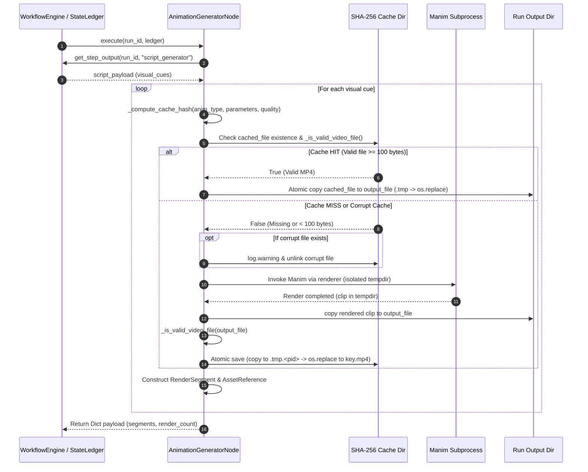
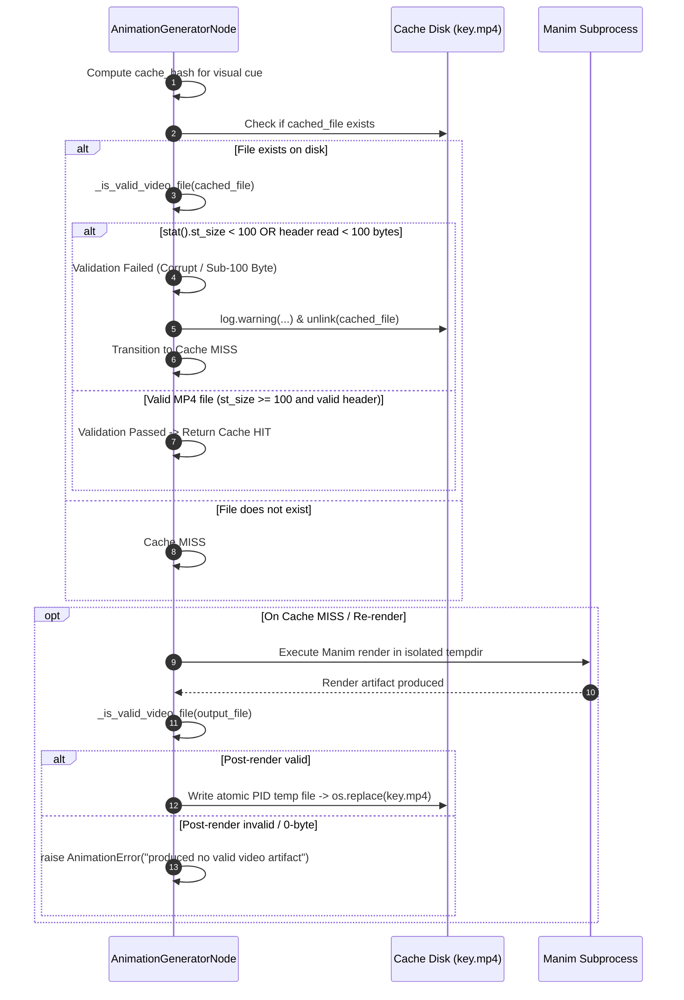
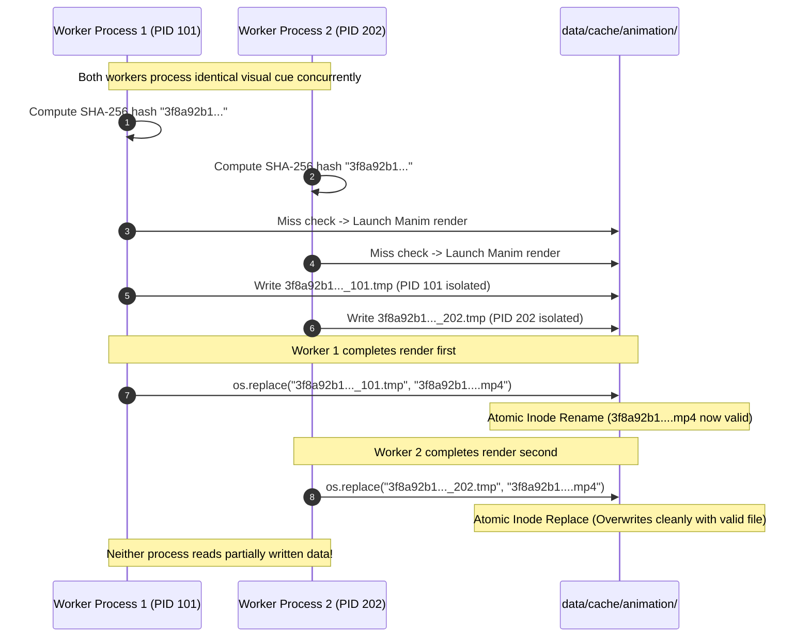
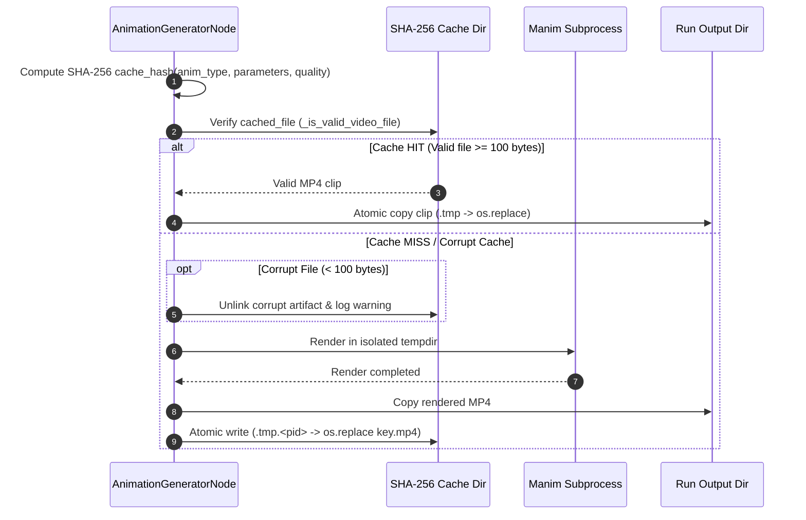
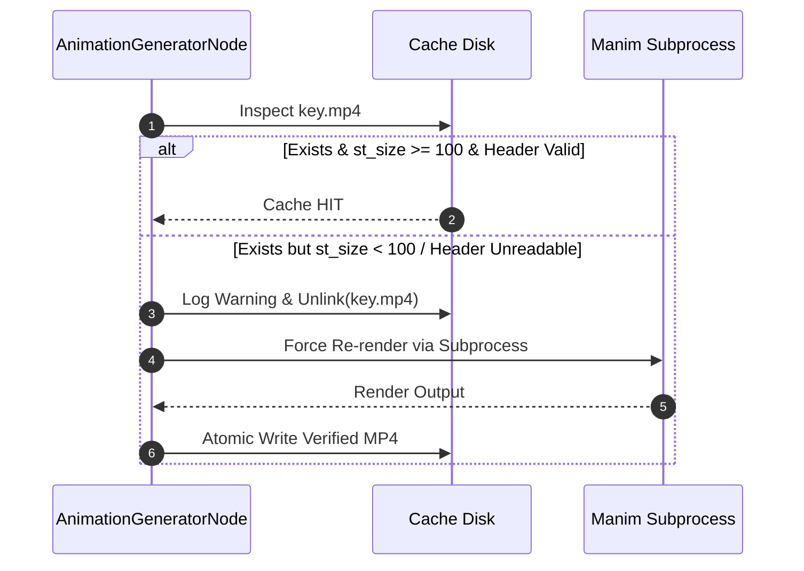

# Phase 12 SHA-256 Caching, Corrupt Invalidation & Atomic Operations Exploration Report & Documentation Blueprint

**Agent ID**: `explorer_m3_2`  
**Working Directory**: `/home/adarsh/Documents/Youtube-Channel/.agents/explorer_m3_2`  
**Target Document**: `PromptBook/Phase12/01_Animation_Production.md` (Milestone 3)  
**Date**: 2026-07-30  

---

## 1. Executive Summary & Scope

Phase 12 of the Automated DSA Educational YouTube Video Pipeline implements Manim visual animation generation via `AnimationGeneratorNode` (`src/pipeline/nodes/animation_generator_node.py`). Rendering high-resolution animations (480p up to 4K) using Manim subprocesses is computationally heavy. To maximize throughput, reduce duplicate render overhead, and guarantee pipeline resiliency, the system uses a **content-addressable SHA-256 caching architecture**, **corrupt cache detection & invalidation**, **atomic filesystem operations**, and **security sanitization against path traversal attacks**.

This report provides a deep technical analysis of these four pillars as implemented in `src/pipeline/nodes/animation_generator_node.py`, `src/animation/renderer.py`, and validated by `tests/pipeline/test_animation_node.py`. It concludes with a complete, production-ready documentation blueprint for incorporation into `PromptBook/Phase12/01_Animation_Production.md`.

---

## 2. SHA-256 Caching Architecture

### 2.1 Content-Addressable Cache Key Computation
Render caching is content-addressable: two visual cues with identical visual parameters, animation type, and target render quality produce the exact same SHA-256 hash digest, allowing previously rendered video clips to be reused across different video pipeline runs.

The cache hash calculation is implemented in `AnimationGeneratorNode._compute_cache_hash` (`src/pipeline/nodes/animation_generator_node.py:301-304`):

```python
def _compute_cache_hash(self, anim_type: str, parameters: Dict[str, Any]) -> str:
    """Compute deterministic SHA-256 cache hash for a visual cue."""
    raw_key = f"{anim_type}:{json.dumps(parameters, sort_keys=True)}:{self.quality}"
    return hashlib.sha256(raw_key.encode("utf-8")).hexdigest()
```

#### Determinism & Component Analysis
1. **`anim_type`**: Visual cue animation type string (e.g., `"array_highlight"`, `"tree_traversal"`, `"code_highlight"`, `"linkedlist_operation"`, `"graph_traversal"`, `"hashmap_operation"`, `"stack_queue_operation"`, `"complexity_chart"`).
2. **`json.dumps(parameters, sort_keys=True)`**: Visual parameters dictionary serialized to JSON with `sort_keys=True`. Sorting keys deterministically guarantees that key ordering variations in Python dictionaries (e.g. `{"array": [1, 2], "duration": 5.0}` vs `{"duration": 5.0, "array": [1, 2]}`) map to identical string representations.
3. **`self.quality`**: Target render quality string (e.g. `"low"`, `"medium"`, `"high"`, `"fourk"`). Including quality ensures that if the rendering profile changes (e.g. upgrading from medium/720p to high/1080p), the cache key changes automatically, preventing low-resolution cached clips from being served in high-resolution renders.

### 2.2 Cache Directory & Artifact Storage Layout
The node manages storage across two primary filesystem locations:

- **Cache Directory (`self.cache_dir`)**:  
  Default: `<project_root>/data/cache/animation/`  
  Artifact naming format: `<cache_hash>.mp4` (e.g. `a1b2c3d4e5f6...mp4`)

- **Run Output Directory (`run_output_dir`)**:  
  Default: `<project_root>/data/assets/renders/<run_id>/`  
  Artifact naming format: `segment_<cue_id>.mp4` (e.g. `segment_cue_01.mp4`)

```
data/
├── cache/
│   └── animation/
│       ├── 3f8a92b1c4e5...mp4          <-- Content-addressable SHA-256 artifact
│       └── 3f8a92b1c4e5..._12345.tmp   <-- PID-isolated temp file during atomic write
└── assets/
    └── renders/
        └── run_20260730_001/
            ├── segment_cue_01.mp4       <-- Target segment file linked to ledger
            └── segment_cue_02.mp4
```

### 2.3 Cache Hit vs Cache Miss Execution

In `_render_or_get_cached_clip` (`src/pipeline/nodes/animation_generator_node.py:305-374`):

1. **Cache Hit Path**:
   - The node checks if `cached_file` exists and passes `_is_valid_video_file(cached_file)`.
   - On Cache HIT, logging records: `logger.info("Cache HIT for cue_id=%s (hash=%s)", cue_id, cache_hash)`.
   - The cached MP4 clip is copied to `output_file` using an atomic intermediate `.tmp` file in `output_file.parent` (`output_file.parent / f"{output_file.name}.tmp"`), followed by `os.replace`.
   - No subprocess invocation occurs, resulting in near-instantaneous execution.

2. **Cache Miss Path**:
   - If `cached_file` does not exist or fails validation, logging records `logger.info("Cache MISS: Rendering cue_id=%s (anim_type=%s)", cue_id, anim_type)`.
   - The node launches Manim subprocess rendering within a temporary directory context (`tempfile.TemporaryDirectory`).
   - Post-rendering, the output file is validated, copied to the run output directory, and atomically committed to `self.cache_dir`.

---

## 3. Corrupt Cache Detection & Invalidation Protocol

### 3.1 Validation Predicate: `_is_valid_video_file`
A critical vulnerability in caching systems is "cache poisoning" caused by 0-byte or truncated files created when rendering processes crash or are killed mid-write. `AnimationGeneratorNode` enforces a strict validation check (`src/pipeline/nodes/animation_generator_node.py:121-134`):

```python
def _is_valid_video_file(self, file_path: Path) -> bool:
    """Validate that video file exists, is at least 100 bytes, and has a readable header."""
    if not file_path.exists():
        return False
    try:
        if file_path.stat().st_size < 100:
            return False
        with open(file_path, "rb") as f:
            header = f.read(100)
            if len(header) < 100:
                return False
        return True
    except Exception:
        return False
```

#### Triple-Check Validation Rules:
1. **Existence Verification**: `file_path.exists()` ensures the file actually exists on the filesystem.
2. **Minimum Byte Threshold**: `file_path.stat().st_size >= 100`. Valid MP4 video containers contain ftyp, moov, or mdat atoms requiring at least several hundred bytes. 0-byte files, sub-100-byte partial writes, or empty stubs fail immediately.
3. **Binary Header Readability**: Opens the file in binary read mode (`"rb"`) and attempts to read 100 bytes (`header = f.read(100)`). If fewer than 100 bytes are returned, the file is deemed corrupt or truncated.
4. **Exception Handling**: Any read error, file locking issue, or OS permission exception returns `False` safely.

### 3.2 Corrupt Cache Detection & Automatic Invalidation Flow
When checking the cache in `_render_or_get_cached_clip` (`src/pipeline/nodes/animation_generator_node.py:332-342`):

```python
if cached_file.exists():
    logger.warning(
        "Corrupt or sub-100 byte cache file detected for cue_id=%s (hash=%s, size=%d bytes). Replacing.",
        cue_id,
        cache_hash,
        cached_file.stat().st_size,
    )
    try:
        cached_file.unlink()
    except Exception:
        pass
```

If a cache file exists on disk but fails `_is_valid_video_file`:
1. The node logs a `WARNING` detailing the `cue_id`, `cache_hash`, and exact corrupt byte size.
2. The node unlinks (`cached_file.unlink()`) the corrupt artifact immediately.
3. The execution flows seamlessly into the **Cache MISS** path to re-render the scene via Manim subprocess.

### 3.3 Post-Render Validation Enforcement
After Manim completes rendering in the temporary directory and copies the clip to `output_file`, the node validates the resulting artifact before adding it to `cache_dir` (`src/pipeline/nodes/animation_generator_node.py:356-373`):

```python
if self._is_valid_video_file(output_file):
    tmp_cache_file = self.cache_dir / f"{cache_hash}_{os.getpid()}.tmp"
    try:
        shutil.copy2(output_file, tmp_cache_file)
        os.replace(tmp_cache_file, cached_file)
    except Exception as e:
        ...
else:
    raise AnimationError(
        f"Manim render completed for cue '{cue_id}' but produced no valid video artifact (file missing or < 100 bytes)"
    )
```

If the render finished with exit code 0 but produced a missing or sub-100 byte MP4, the node refuses to cache it and raises an `AnimationError`, preventing corrupt files from polluting the State Ledger or cache repository.

---

## 4. Atomic Storage Operations & Concurrency Safety

### 4.1 Race Condition Hazards in Concurrent Rendering
In multi-worker execution environments (e.g. concurrent video processing jobs running on parallel worker processes), multiple processes may execute `AnimationGeneratorNode` simultaneously for scripts sharing identical visual cues.

If Process A and Process B attempt to write to `cache_dir / <cache_hash>.mp4` at the same time:
- Direct write/copy to `cached_file` can lead to file truncation, interleaved writes, or partial reads by Process B while Process A is still writing.
- Downstream nodes reading `cached_file` could encounter corrupt, unplayable MP4 video artifacts.

### 4.2 PID-Isolated Temporary Files and `os.replace`
To guarantee atomicity and race-condition safety, `AnimationGeneratorNode` implements **PID-isolated temporary staging** followed by `os.replace` (`src/pipeline/nodes/animation_generator_node.py:357-368`):

```python
tmp_cache_file = self.cache_dir / f"{cache_hash}_{os.getpid()}.tmp"
try:
    shutil.copy2(output_file, tmp_cache_file)
    os.replace(tmp_cache_file, cached_file)
except Exception as e:
    if tmp_cache_file.exists():
        try:
            tmp_cache_file.unlink()
        except Exception:
            pass
    logger.warning("Failed atomic cache write for hash %s: %s", cache_hash, e)
    shutil.copy2(output_file, cached_file)
```

#### Step-by-Step Atomic Insertion Sequence:
1. **Process Isolation**: The node generates a temporary filename in `cache_dir` containing the current process ID (`os.getpid()`): `<cache_hash>_<pid>.tmp`. Because each process has a unique PID on POSIX systems, concurrent processes never write to the same temporary file.
2. **Staging Copy**: `shutil.copy2(output_file, tmp_cache_file)` copies the verified rendered artifact into the temporary file within `cache_dir`.
3. **Atomic Commit (`os.replace`)**: `os.replace(tmp_cache_file, cached_file)` atomically renames the temporary file to the final destination `<cache_hash>.mp4`. On POSIX filesystems (Linux/Unix), `rename`/`replace` within the same filesystem is an atomic inode operation. Any process opening `cached_file` either sees the old valid file or the complete new valid file—never a partial write.
4. **Error Cleanup**: If `os.replace` fails (e.g., cross-device link error), `tmp_cache_file` is cleaned up immediately and a safe fallback write is attempted.

### 4.3 Atomic Cache HIT Retrieval
Similarly, when retrieving a clip on Cache HIT (`src/pipeline/nodes/animation_generator_node.py:319-330`), the node copies `cached_file` to `output_file.parent / f"{output_file.name}.tmp"` before performing `os.replace(tmp_output, output_file)`. This ensures downstream processes reading `output_file` in the run directory never observe partial copy states.

---

## 5. Security & Input Sanitization Architecture

### 5.1 Vulnerability Analysis: Path Traversal Risks
Visual cues originate from script payloads generated by LLMs or external inputs. If a script payload contains a malicious or malformed `cue_id` such as `"../../etc/passwd"`, `"..\\cue_1"`, or `"../escaped_segment"`, naively joining this path (`run_output_dir / f"segment_{cue_id}.mp4"`) would allow file creation outside `run_output_dir` (directory traversal vulnerability).

### 5.2 Sanitization Algorithm: `_sanitize_cue_id`
`AnimationGeneratorNode` enforces strict sanitization in `_sanitize_cue_id` (`src/pipeline/nodes/animation_generator_node.py:112-119`):

```python
def _sanitize_cue_id(self, cue_id: Any) -> str:
    """Sanitize cue_id to prevent path traversal and filesystem escape."""
    if not cue_id:
        return "cue_safe"
    clean_id = Path(str(cue_id)).name
    clean_id = clean_id.replace("..", "_").replace("/", "_").replace("\\", "_")
    clean_id = re.sub(r'[^a-zA-Z0-9_-]', '_', clean_id).strip("_")
    return clean_id if clean_id else "cue_safe"
```

#### Sanitization Steps:
1. **Basename Extraction**: `Path(str(cue_id)).name` strips any leading directory path components.
2. **Separator & Relative Sequence Neutralization**: Explicitly replaces `..`, `/`, and `\` with `_`.
3. **Regex Whitelist Filtering**: `re.sub(r'[^a-zA-Z0-9_-]', '_', clean_id)` replaces any character that is not alphanumeric, hyphen, or underscore with `_`.
4. **Edge Case Fallback**: `.strip("_")`; if the string becomes empty, returns `"cue_safe"`.

### 5.3 Defensive Boundary Enforcement
As a second layer of defense (defense-in-depth), `AnimationGeneratorNode.execute` verifies that `output_file` resides strictly inside `run_output_dir` (`src/pipeline/nodes/animation_generator_node.py:195-198`):

```python
output_file = run_output_dir / f"segment_{cue_id}.mp4"

# Verify output file path stays within run output directory
if not output_file.resolve().is_relative_to(run_output_dir.resolve()):
    raise AnimationError(f"Invalid cue_id '{raw_cue_id}' escapes run output directory")
```

If `output_file` attempts to escape `run_output_dir`, execution halts instantly and raises an `AnimationError`.

---

## 6. High-Quality Mermaid Sequence Diagrams

### Diagram 1: Cache Lookup Sequence (Hit vs. Miss Flow)



---

### Diagram 2: Corrupt Cache Detection & Invalidation Flow



---

### Diagram 3: Atomic Storage Operations & Concurrency Safety



---

## 7. Documentation Blueprint for `PromptBook/Phase12/01_Animation_Production.md`

Below is the complete, formatted section blueprint ready for direct inclusion in `PromptBook/Phase12/01_Animation_Production.md`.

```markdown
## SHA-256 Caching Strategies, Corrupt Cache Invalidation, and Atomic Operations

### Overview
Animation generation via Manim is a computationally expensive pipeline stage. To eliminate redundant rendering while guaranteeing artifact integrity and safety under parallel executions, `AnimationGeneratorNode` incorporates content-addressable SHA-256 caching, automatic corrupt cache invalidation, PID-isolated atomic storage operations, and input sanitization.

### 1. SHA-256 Caching Architecture
Render caching is content-addressable. The cache key is computed deterministically from the visual cue properties and rendering settings:

$$\text{Cache Key} = \text{SHA-256}\Big(\text{anim\_type} + \text{":"} + \text{json\_dumps}(\text{parameters}, \text{sort\_keys}=\text{True}) + \text{":"} + \text{quality}\Big)$$

- **Key Components**:
  - `anim_type`: Visual cue animation classification (e.g. `array_highlight`, `tree_traversal`, `code_highlight`, `linkedlist_operation`, `graph_traversal`, `hashmap_operation`, `stack_queue_operation`, `complexity_chart`).
  - `parameters`: Visual parameters dictionary serialized with `sort_keys=True` to eliminate key order variance.
  - `quality`: Render quality flag key (`low`, `medium`, `high`, `fourk`). Changing the quality profile automatically invalidates cached clips rendered at lower resolutions.
- **Storage Layout**:
  - Global cache repository: `data/cache/animation/<cache_hash>.mp4`
  - Per-run target artifacts: `data/assets/renders/<run_id>/segment_<cue_id>.mp4`

### 2. Corrupt Cache Detection & Invalidation Protocol
To prevent zero-byte or truncated video files from corrupting pipeline execution (e.g. from interrupted subprocesses or system crashes), all cache lookups pass through a strict validation predicate `_is_valid_video_file`:

1. **Validation Checks**:
   - **Existence**: Verifies file exists on disk.
   - **Size Threshold**: Enforces minimum file size of $\ge 100$ bytes (`st_size >= 100`).
   - **Header Readability**: Reads the initial 100 bytes to confirm valid MP4 container structure.
2. **Invalidation & Re-rendering**:
   - If a cached file exists but fails validation (sub-100 bytes or unreadable header), a warning is logged, the corrupt file is unlinked (`cached_file.unlink()`), and the node treats the request as a Cache MISS.
   - Post-rendering output is subjected to the same validation. If a Manim subprocess exits cleanly but produces a missing or sub-100 byte MP4, the node raises an `AnimationError` rather than storing invalid data.

### 3. Atomic Storage Operations & Concurrency Safety
Under concurrent pipeline execution, multiple worker processes may render identical visual cues simultaneously. Direct writes to cache files introduce race conditions and file corruption.

- **PID-Isolated Staging**:
  - Rendered clips are copied to a process-unique temporary file in the cache directory: `data/cache/animation/<cache_hash>_<pid>.tmp`.
- **Atomic Replacement**:
  - The staging file is committed to the target cache location using POSIX `os.replace(tmp_cache_file, cached_file)`.
  - `os.replace` guarantees atomic filesystem rename. Concurrent reading processes either observe the previous valid file or the new valid file—never a partially written fragment.
- **Target Output Atomic Copy**:
  - Cache HIT copies to `run_output_dir` also use intermediate `.tmp` files and `os.replace` to protect downstream video assembly nodes.

### 4. Input Sanitization & Path Traversal Defense
Visual cue IDs originate from LLM-generated script payloads. To prevent directory traversal attacks (e.g. hostile `cue_id` values like `../../etc/passwd` or `..\cue_1`):

- **Sanitization Pipeline (`_sanitize_cue_id`)**:
  1. Extracts basename using `Path(str(cue_id)).name`.
  2. Neutralizes directory separators and relative sequences (`..`, `/`, `\`).
  3. Filters characters via regex whitelist: `re.sub(r'[^a-zA-Z0-9_-]', '_', clean_id)`.
- **Boundary Verification**:
  - `AnimationGeneratorNode` asserts that `output_file.resolve().is_relative_to(run_output_dir.resolve())`. If an output file escapes `run_output_dir`, an `AnimationError` is raised immediately.

### 5. Architectural Flow Diagrams

#### Cache Lookup & Storage Sequence


#### Corrupt Cache Invalidation Flow

```

---

## 8. Summary of Findings & Implementation References

| Feature | Primary Location | Key Methods / Functions | Verified Tests |
|---|---|---|---|
| **SHA-256 Cache Key Computation** | `src/pipeline/nodes/animation_generator_node.py` | `_compute_cache_hash(anim_type, parameters)` (lines 301-304) | `test_execute_successful_render`, `test_cache_invalidation_on_parameter_change` |
| **Corrupt Cache Detection** | `src/pipeline/nodes/animation_generator_node.py` | `_is_valid_video_file(file_path)` (lines 121-134) | `test_sub_100_byte_corrupt_cache_file_triggers_re_render`, `test_zero_byte_corrupt_cache_re_renders` |
| **Atomic Cache Operations** | `src/pipeline/nodes/animation_generator_node.py` | `_render_or_get_cached_clip` (lines 319-330, 356-370) | `test_atomic_cache_write_mechanics` |
| **Security Sanitization** | `src/pipeline/nodes/animation_generator_node.py` | `_sanitize_cue_id(cue_id)` (lines 112-119) & line 196 | `test_cue_id_path_traversal_sanitization` |
| **Subprocess Execution** | `src/animation/renderer.py` | `ManimRenderer.render()` (lines 40-134) | `test_subprocess_close_fds_verified`, `test_no_file_descriptor_leak_on_execution` |
