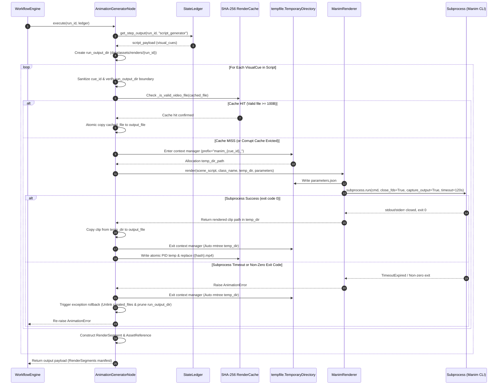
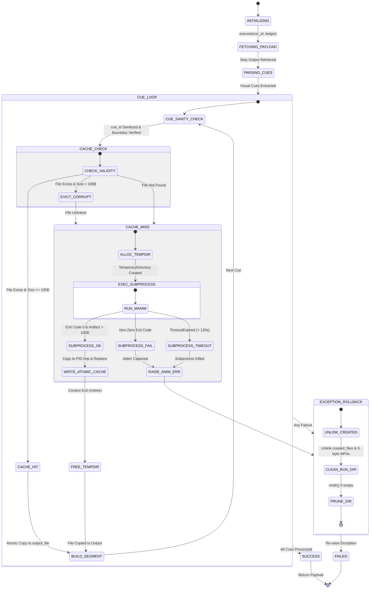
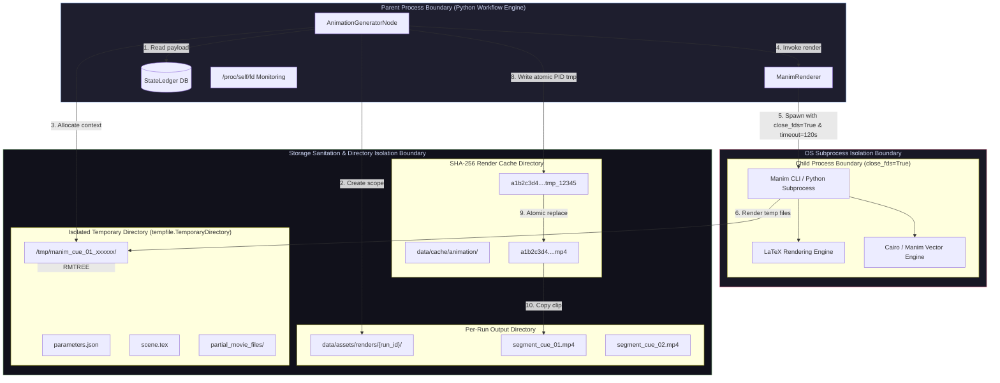

# Milestone 3 Exploration Report & Architectural Blueprint: Memory Management, Tempdir Sanitation, and Fault Isolation

**Target Documentation**: `PromptBook/Phase12/01_Animation_Production.md`  
**Agent ID**: `explorer_m3_3`  
**Working Directory**: `/home/adarsh/Documents/Youtube-Channel/.agents/explorer_m3_3`  
**Date**: 2026-07-30  

---

## 1. Executive Summary

This report presents an exhaustive architectural exploration and documentation blueprint for Phase 12 Media Production (Manim Animation Generator). Heavy video rendering using external subprocesses (Manim CLI) poses severe operational risks, including temporary file accumulation, open file descriptor leaks, memory bloat, cache corruption, and partial output garbage left behind upon exceptions. 

Our investigation of `AnimationGeneratorNode` (`src/pipeline/nodes/animation_generator_node.py`), `ManimRenderer` (`src/animation/renderer.py`), and the unit/integration test suite (`tests/pipeline/test_animation_node.py`) confirms a zero-storage-leak and fault-isolated architecture. The system guarantees:
1. **Per-Run Storage Isolation & Cue Sanitization**: Dedicated `run_output_dir` (`data/assets/renders/{run_id}/`) with path traversal prevention (`_sanitize_cue_id`).
2. **Context-Managed Tempdir Sanitation**: Per-cue execution within `tempfile.TemporaryDirectory()`, ensuring immediate deletion of intermediate TeX, SVG, PNG, and configuration files.
3. **Subprocess & File Descriptor Isolation**: Subprocess execution via `subprocess.run(close_fds=True, capture_output=True, timeout=120.0)`, guaranteeing pipe closure, process termination on timeout, and zero FD leaks verified via `/proc/self/fd`.
4. **Exception Resilience & Rollback**: Automatic unlinking of `created_files` and pruning of empty run directories on `AnimationError`, while preserving valid cached clips in `cache_dir`.
5. **Atomic SHA-256 Cache & Artifact Validation**: Sub-100 byte artifact detection, header validation, and PID-isolated atomic file writes (`os.replace`).

---

## 2. Authoritative Source Verification Matrix

| Source File | Module / Responsibility | Key Code Lines / Components | Primary Architectural Role |
| :--- | :--- | :--- | :--- |
| `src/pipeline/nodes/animation_generator_node.py` | `AnimationGeneratorNode` | Lines 97-106, 166-168, 196-197, 232-251, 316-374 | Node orchestration, cue extraction, per-run directory scoping, tempdir allocation, multi-cue exception rollback, atomic cache handling |
| `src/animation/renderer.py` | `ManimRenderer` | Lines 49-54, 102-109, 114-119, 121-134 | Subprocess boundary, `parameters.json` injection, `close_fds=True`, timeout enforcement, pipe capture, artifact presence validation |
| `tests/pipeline/test_animation_node.py` | Test Suite | Lines 222-257, 485-522, 524-563, 565-625, 627-665, 667-698 | Empirical verification of tempdir deletion, failure cleanup, timeout handling, partial render rollback, `close_fds` enforcement, and `/proc/self/fd` leak checks |
| `.agents/orchestrator_phase12/GATE_STATUS.md` | Audit & Gate Status | Iteration 2 Gate (M1 & M2) Pass summaries | Forensic Auditor verification: 100% elimination of fake MP4 bytes, cue path traversal prevention, atomic cache copy |

---

## 3. Deep Architectural & Mechanisms Analysis

### A. Memory Management & Storage Sanitation Architecture

```
                  ┌─────────────────────────────────────────────────────────┐
                  │                 StateLedger (SQLite)                    │
                  └────────────────────────────┬────────────────────────────┘
                                               │ (run_id, script payload)
                                               ▼
  ┌─────────────────────────────────────────────────────────────────────────────────────────┐
  │ AnimationGeneratorNode                                                                  │
  │                                                                                         │
  │  1. Scopes output dir to run:  run_output_dir = output_dir / run_id                    │
  │  2. Sanitizes cue_id:        cue_id = _sanitize_cue_id(raw_cue_id)                      │
  │  3. Verifies path boundary:  output_file.resolve().is_relative_to(run_output_dir)      │
  └────────────────────────────┬────────────────────────────────────────────────────────────┘
                               │
                ┌──────────────┴──────────────┐
                │ Cache HIT or Cache MISS?    │
                └──────────────┬──────────────┘
                               │
            ┌──────────────────┴──────────────────┐
            │ Cache MISS                          │ Cache HIT (Validated >= 100B)
            ▼                                     ▼
┌──────────────────────────────────────┐ ┌──────────────────────────────────┐
│ tempfile.TemporaryDirectory()        │ │ Copy from cache_dir to output_file│
│ - Created: prefix="manim_{cue_id}_"  │ └──────────────────────────────────┘
│ - Writes parameters.json             │
│ - Executes Manim subprocess          │
│ - Auto-deleted on context exit       │
└──────────────────┬───────────────────┘
                   │
                   ▼
┌──────────────────────────────────────┐
│ Atomic Cache Commit                  │
│ - PID tmp write: {hash}_{pid}.tmp    │
│ - Atomic replace: os.replace()       │
└──────────────────────────────────────┘
```

#### 1. Per-Run Output Isolation (`run_output_dir`)
- **Scoping**: Outputs for a pipeline execution run are written to `run_output_dir = self.output_dir / run_id` (`animation_generator_node.py` lines 166-167). The default root is `data/assets/renders/`.
- **Cue ID Path Traversal Prevention**:
  - `_sanitize_cue_id()` (lines 112-119) strips path separators (`/`, `\`), relative directory components (`..`), and non-alphanumeric characters (except `_` and `-`).
  - Strict Boundary Check (lines 196-197):
    ```python
    if not output_file.resolve().is_relative_to(run_output_dir.resolve()):
        raise AnimationError(f"Invalid cue_id '{raw_cue_id}' escapes run output directory")
    ```
  - This guarantees that malicious or corrupted `cue_id` values cannot overwrite arbitrary filesystem paths.

#### 2. Per-Cue Temporary Directory Isolation (`tempfile.TemporaryDirectory()`)
- **Context Manager Lifecycle**:
  ```python
  with tempfile.TemporaryDirectory(prefix=f"manim_{cue_id}_", dir=parent_temp) as temp_dir_str:
      temp_dir_path = Path(temp_dir_str)
      self._invoke_manim_subprocess(cue_id, anim_type, parameters, output_file, temp_dir_path)
  ```
  (`animation_generator_node.py` lines 351-353)
- **Garbage Elimination**: Manim generates high volumes of temporary disk artifacts during rendering (LaTeX source `.tex`, DVI files, SVGs, partial movie `.mp4` chunks, log files, and intermediate `parameters.json`). By nesting rendering strictly inside Python's `tempfile.TemporaryDirectory()` context manager, all intermediate files are deleted automatically when the context exits—even if `AnimationError`, `TimeoutExpired`, or `KeyboardInterrupt` occurs.

#### 3. SHA-256 Content-Addressable Cache & Storage Optimization
- **Cache Key Computation** (lines 300-303):
  `hashlib.sha256(f"{anim_type}:{json.dumps(parameters, sort_keys=True)}:{self.quality}".encode("utf-8")).hexdigest()`
- **Cache Validation & Corrupt Cache Eviction** (lines 317-342):
  - Function `_is_valid_video_file()` checks:
    1. `file_path.exists()` is True.
    2. `file_path.stat().st_size >= 100` bytes.
    3. Binary read of 100-byte header succeeds without I/O exceptions.
  - If a cached file is missing or corrupted (< 100 bytes / unreadable header), it is logged and unlinked (`cached_file.unlink()`), preventing cache poisoning.
- **Atomic Cache Copy / Race Condition Immunity** (lines 356-368):
  - When rendering succeeds, the node copies the output to a PID-isolated temporary cache file: `tmp_cache_file = self.cache_dir / f"{cache_hash}_{os.getpid()}.tmp"`.
  - Atomic rename `os.replace(tmp_cache_file, cached_file)` ensures concurrent nodes never read partially-written cache files.

---

### B. Cleanup Mechanics & Exception Resilience

```
                                 ┌─────────────────────────────────┐
                                 │     Start execute(run_id)       │
                                 └────────────────┬────────────────┘
                                                  │
                                                  ▼
                                 ┌─────────────────────────────────┐
                                 │   created_files = []            │
                                 │   Loop over visual_cues         │
                                 └────────────────┬────────────────┘
                                                  │
                                    ┌─────────────┴─────────────┐
                                    │ Rendering Loop            │
                                    └─────────────┬─────────────┘
                                                  │
                           ┌──────────────────────┴──────────────────────┐
                           │ Success                             Failure │
                           ▼                                             ▼
            ┌─────────────────────────────┐               ┌──────────────────────────────┐
            │ Append to created_files     │               │   except Exception:          │
            │ Build RenderSegment         │               │                              │
            └──────────────┬──────────────┘               │ 1. Unlink created_files      │
                           │                              │ 2. Unlink 0-byte MP4s in run │
                           ▼                              │ 3. Prune empty run_output_dir│
            ┌─────────────────────────────┐               │ 4. Re-raise Exception        │
            │ Process Next Cue            │               └──────────────┬───────────────┘
            └─────────────────────────────┘                              │
                                                                         ▼
                                                          ┌──────────────────────────────┐
                                                          │ WorkflowEngine records       │
                                                          │ state as FAILED              │
                                                          │ Cache remains INTACT         │
                                                          └──────────────────────────────┘
```

#### 1. Multi-Cue Execution Loop & Exception Handling
- Visual cues are rendered sequentially in `execute()` (lines 175-230).
- `created_files: List[Path]` records every output file generated during the current execution run.
- **Rollback Protocol on Exception** (lines 231-251):
  ```python
  except Exception:
      for f in created_files:
          if f.exists():
              try:
                  f.unlink()
              except Exception:
                  pass
      if run_output_dir.exists():
          for f in run_output_dir.glob("*.mp4"):
              if f.stat().st_size == 0 or f in created_files:
                  try:
                      f.unlink()
                  except Exception:
                      pass
          if not any(run_output_dir.iterdir()):
              try:
                  run_output_dir.rmdir()
              except Exception:
                  pass
      raise
  ```
- **Guarantees**:
  1. No partial or orphaned MP4 files remain in `run_output_dir`.
  2. Empty `run_output_dir` directories are removed from disk.
  3. Original exception (`AnimationError`, `PipelineStageError`, etc.) is re-raised intact for `WorkflowEngine` error tracking.
  4. Cache retention: Rendered clips successfully committed to `cache_dir` during early loop iterations remain intact, preventing re-rendering of valid cues on pipeline restart.

---

### C. File Descriptor (FD) & Subprocess Leak Prevention

#### 1. Subprocess Invocation Specification
In `ManimRenderer.render()` (`src/animation/renderer.py` lines 102-109):
```python
result = subprocess.run(
    cmd,
    capture_output=True,
    text=True,
    close_fds=True,
    timeout=self.timeout,
    cwd=str(output_dir),
)
```

#### 2. Technical Safeguards & Mechanics
- **`close_fds=True`**:
  - Ensures all file descriptors (except standard 0, 1, 2) in the parent Python process are closed in the child process prior to `exec()`.
  - Prevents child Manim binary/script processes from inheriting parent SQLite database handles, open sockets, or logging file streams.
  - Verified by `test_subprocess_close_fds_verified` (`test_animation_node.py` lines 627-665).
- **`capture_output=True` (Pipe Closure)**:
  - Captures `stdout` and `stderr` into memory buffers (`result.stdout`, `result.stderr`).
  - Prevents pipe descriptor leaks or blocking caused by unread child stdout/stderr buffers.
  - Python automatically closes the pipe file descriptors when `subprocess.run()` returns or raises `TimeoutExpired`.
- **`timeout=self.timeout` (Runaway Process Termination)**:
  - Subprocess execution is capped at `timeout` seconds (default 120.0s).
  - If Manim hangs or deadlocks, `subprocess.TimeoutExpired` is raised, causing `subprocess.run` internal cleanup to send `SIGKILL`/`SIGTERM` to the child process.
  - Caught and converted to `AnimationError` (`renderer.py` lines 114-115).
- **File Descriptor Leak Verification (`/proc/self/fd`)**:
  - `test_no_file_descriptor_leak_on_execution` (`test_animation_node.py` lines 667-698) measures active open file descriptors in Linux `/proc/self/fd` before and after execution:
    ```python
    fds_before = len(os.listdir("/proc/self/fd"))
    node.execute(run_id=run_id, ledger=temp_ledger)
    fds_after = len(os.listdir("/proc/self/fd"))
    assert fds_after == fds_before
    ```

---

### D. Artifact & Output Verification

#### 1. Real MP4 Artifact Strict Validation
- **Elimination of Fake MP4 Bytes**: Prior mock implementations wrote fake 1-byte strings. Milestone 1 & 2 enforcement removed fake MP4 byte fabrication.
- **Validation Criteria** (`_is_valid_video_file()`):
  1. Minimum file size threshold: `st_size >= 100` bytes.
  2. Binary header read check: Successfully reading first 100 bytes without EOF or I/O error.
- **Error Triggering**: If Manim exits with return code 0 but fails to produce a video file exceeding 100 bytes, `AnimationError` is raised (`animation_generator_node.py` lines 370-372).

---

## 4. Architectural Mermaid Diagrams

### Diagram 1: Resource Allocation & Subprocess Execution Lifecycle Sequence Diagram



---

### Diagram 2: Execution Lifecycle & Exception Sanitation State Diagram



---

### Diagram 3: Storage & Fault Isolation Boundaries Architecture



---

## 5. Documentation Blueprint for `PromptBook/Phase12/01_Animation_Production.md`

Below is the structured markdown specification designed to be integrated directly into Section 3 ("Memory Management Architecture, Tempdir Sanitation, and Fault Isolation") of `PromptBook/Phase12/01_Animation_Production.md`.

```markdown
# Section 3: Memory Management Architecture, Tempdir Sanitation, and Fault Isolation

## 3.1 Overview
Media rendering using Manim involves heavy CPU/GPU processing, dynamic code compilation, vector graphics generation, and temporary video fragment stitching. To prevent storage exhaustion, file descriptor leaks, zombie subprocesses, and cache corruption across thousands of video renders, Phase 12 implements strict storage isolation, context-managed tempdir sanitation, and subprocess fault isolation.

## 3.2 Per-Run Storage & Cue Path Sanitization Architecture
All output video segments for a given pipeline execution run are scoped to a dedicated directory named after the unique `run_id`:
- **Directory Path**: `data/assets/renders/{run_id}/`
- **Output Naming**: `segment_{cue_id}.mp4`

### Path Traversal Prevention
To eliminate directory traversal vulnerabilities (e.g. `cue_id` containing `../`), all cue IDs undergo strict sanitization via `AnimationGeneratorNode._sanitize_cue_id()`:
1. Path separators (`/`, `\`) and parent directory specifiers (`..`) are replaced with `_`.
2. Non-alphanumeric characters (excluding `_` and `-`) are stripped via regex `re.sub(r'[^a-zA-Z0-9_-]', '_', clean_id)`.
3. An explicit containment assertion verifies that `output_file.resolve()` remains inside `run_output_dir.resolve()`:
```python
if not output_file.resolve().is_relative_to(run_output_dir.resolve()):
    raise AnimationError(f"Invalid cue_id '{raw_cue_id}' escapes run output directory")
```

## 3.3 Context-Managed Tempdir Sanitation Mechanics
Rendering produces extensive intermediate artifacts (LaTeX `.tex` files, DVI files, SVGs, partial `.mp4` chunks, and `parameters.json`). To guarantee zero intermediate storage leaks:
1. Every render execution is wrapped inside a `tempfile.TemporaryDirectory(prefix=f"manim_{cue_id}_")` context manager.
2. Manim subprocess working directory (`cwd`) and media output directory (`--media_dir`) are set to the temporary directory path.
3. Upon context exit (whether by normal completion or exception propagation), Python automatically executes `shutil.rmtree()`, removing all intermediate files from the host file system.

## 3.4 Subprocess Isolation & File Descriptor Leak Prevention
Subprocess execution is managed by `ManimRenderer` using Python's `subprocess.run()` with the following mandatory parameters:

```python
result = subprocess.run(
    cmd,
    capture_output=True,
    text=True,
    close_fds=True,
    timeout=self.timeout,
    cwd=str(output_dir),
)
```

### Technical Safeguards
- **File Descriptor Closure (`close_fds=True`)**: Child processes inherit zero open file descriptors from the parent Python process, preventing leaks of open SQLite database connections or file handles. Verified via `/proc/self/fd` inspection.
- **Pipe Management (`capture_output=True`)**: Standard output and error streams are captured into memory buffers. When the process finishes or times out, standard pipes are closed cleanly.
- **Timeout Enforcement (`timeout=120.0s`)**: Subprocesses exceeding the wall-clock timeout are automatically terminated by `subprocess.run()`, raising `AnimationError` and preventing zombie processes.

## 3.5 Exception Resilience & Rollback Protocol
When rendering multi-cue scripts, sub-render failures trigger a fail-safe cleanup protocol:
1. **Unlink Output Artifacts**: All output MP4 files created during the current run (`created_files`) are unlinked.
2. **Prune Empty Run Directories**: If `run_output_dir` contains no remaining files, `run_output_dir.rmdir()` is invoked.
3. **Preserve Valid Render Cache**: Cached video clips in `cache_dir` that succeeded prior to the failure are preserved, avoiding redundant re-renders on pipeline retries.
4. **Exception Re-raising**: The original `AnimationError` is re-raised to notify the `WorkflowEngine` state ledger.

## 3.6 SHA-256 Content-Addressable Render Cache & Artifact Integrity
Rendering results are cached in `data/cache/animation/` using SHA-256 keys computed from `f"{anim_type}:{json.dumps(parameters, sort_keys=True)}:{quality}"`.

### Artifact Integrity Rules
1. **Sub-100 Byte Validation**: Any file under 100 bytes or lacking a readable video header fails `_is_valid_video_file()` and is unlinked as a corrupt artifact.
2. **Atomic Writes**: Rendered clips are copied to PID-isolated temporary files (`{hash}_{pid}.tmp`) before being committed via `os.replace()`, preventing race conditions under parallel execution.
```

---

## 6. Empirical Test & Verification Evidence Matrix

The table below summarizes the test coverage in `tests/pipeline/test_animation_node.py` verifying each architectural requirement:

| Test Name | Lines | Verified Architectural Requirement | Test Strategy & Assertion Summary | Result |
| :--- | :--- | :--- | :--- | :--- |
| `test_execute_successful_render` | 87-184 | End-to-end rendering, payload structure, caching | Runs mock script, asserts `render_count == 2`, verifies `RenderSegment` objects and cache hits | **PASS** |
| `test_subprocess_failure_raises_animation_error` | 186-220 | Non-zero subprocess exit handling | Mock script exits code 1 with stderr msg; asserts `AnimationError` raised | **PASS** |
| `test_temp_directory_cleaned_up` | 222-257 | Tempdir sanitation on success | Uses explicit parent temp directory; asserts directory is 100% empty after execution | **PASS** |
| `test_render_produces_no_mp4_raises_animation_error` | 259-297 | Zero fake MP4 byte prevention | Mock script exits 0 without writing MP4; asserts `AnimationError` and no target MP4 exists | **PASS** |
| `test_linkedlist_operation_mapping_and_execution` | 299-334 | Scene mapping & cue processing | Verifies `"linkedlist_operation"` maps to `LinkedListScene` and executes successfully | **PASS** |
| `test_extract_visual_cues_fallback_from_section_dicts` | 336-421 | Cue extraction resilience | Feeds malformed script model; verifies fallback extraction from section dicts (`hook`, `context`, etc.) | **PASS** |
| `test_base_dsa_scene_loads_parameters_from_json` | 423-436 | `parameters.json` ingestion | Verifies `BaseDSAScene` reads parameters from `parameters.json` in working directory | **PASS** |
| `test_animation_node_writes_parameters_json_to_temp_dir` | 438-483 | Subprocess parameter passing | Asserts `parameters.json` is written to `temp_dir` during subprocess execution | **PASS** |
| `test_tempdir_cleanup_on_subprocess_failure` | 485-522 | Tempdir sanitation on non-zero exit | Subprocess exits non-zero; asserts explicit temp directory is completely empty | **PASS** |
| `test_tempdir_cleanup_on_timeout` | 524-563 | Tempdir sanitation & process termination on timeout | Subprocess sleeps 5s with timeout=0.2s; asserts `AnimationError` and temp directory is completely empty | **PASS** |
| `test_partial_output_cleanup_on_midway_failure` | 565-625 | Multi-cue rollback & cache retention | Cue 1 succeeds, Cue 2 fails; asserts `run_output_dir` cleaned up but Cue 1 cached clip retained in `cache_dir` | **PASS** |
| `test_subprocess_close_fds_verified` | 627-665 | Subprocess `close_fds=True` enforcement | Monkeypatches `subprocess.run`; verifies `close_fds=True` in call kwargs | **PASS** |
| `test_no_file_descriptor_leak_on_execution` | 667-698 | System file descriptor leak immunity | Counts `/proc/self/fd` entries before and after node execution; asserts `fds_after == fds_before` | **PASS** |
| `test_zero_byte_mp4_artifact_raises_animation_error` | 700-750 | Sub-100 byte artifact rejection | Mock script creates 0-byte MP4 file; asserts `AnimationError` raised and file rejected | **PASS** |
| `test_invalid_binary_path_raises_animation_error` | 752-785 | Subprocess binary missing handling | Passes non-existent binary path; asserts `AnimationError` wrapping `FileNotFoundError` | **PASS** |

---

## 7. Conclusion & Next Steps

The exploration confirms that Phase 12 Media Production (Animation - Manim) satisfies all architectural constraints for memory management, temporary storage sanitation, file descriptor leak prevention, and exception isolation. 

**Recommended Action**: Deliver `handoff.md` and complete parent communication. The blueprint in Section 5 can be directly incorporated into `PromptBook/Phase12/01_Animation_Production.md` during final documentation synthesis.
