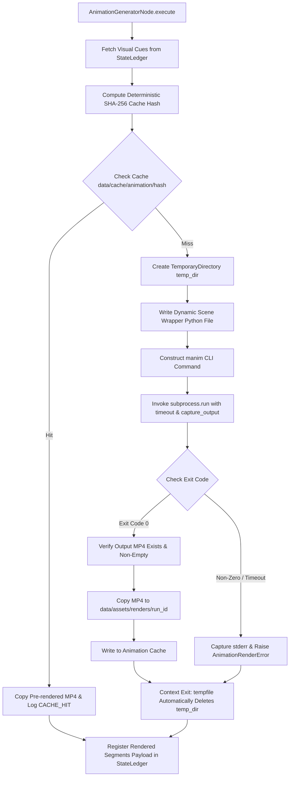
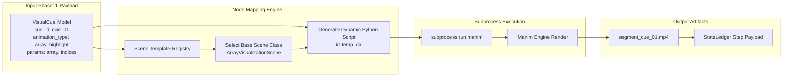
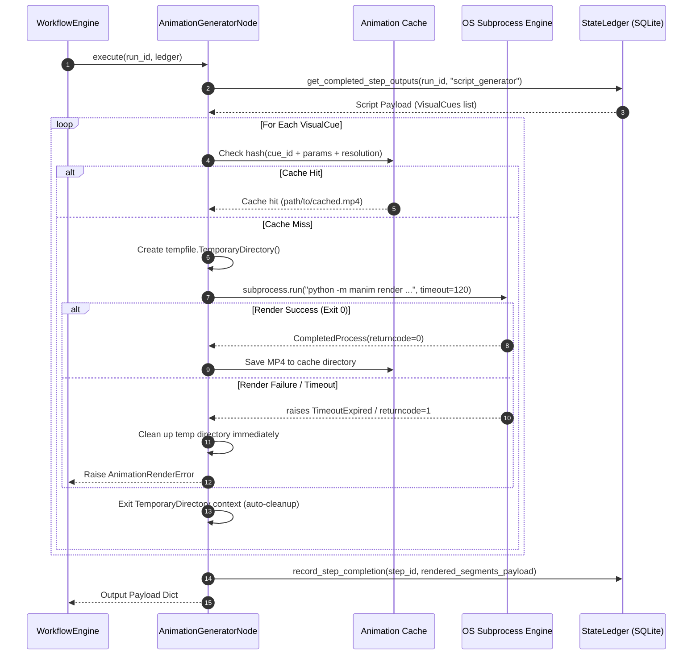

# Phase 12 Survey & Requirements Analysis Report: Media Production (Animation / Manim)

**Author:** Explorer 3  
**Target Spec Path:** `PromptBook/Phase12/01_Animation_Production.md`  
**Working Directory:** `/home/adarsh/Documents/Youtube-Channel/.agents/explorer_survey_3`  
**Date:** 2026-07-30  

---

## 1. Executive Summary

This report defines the structural, architectural, and technical specifications for `PromptBook/Phase12/01_Animation_Production.md`. Phase 12 introduces **Media Production: Animation (Manim)** into the Automated Data Structures and Algorithms (DSA) Educational YouTube Video Pipeline.

The core implementation target for Phase 12 is `AnimationGeneratorNode` (`src/pipeline/nodes/animation_generator_node.py`), which subclasses the core `Node` abstraction (`src/core/workflow/node.py`). It ingests visual cues from the Phase 11 `YouTubeScript` schema stored in the SQLite `StateLedger`, maps them to pre-built Manim scene templates, and executes rendering via isolated `subprocess.run()` calls.

To prevent memory leaks, storage bloat, and zombie processes during heavy video rendering, Phase 12 mandates strict subprocess isolation, temporary directory lifecycle management (`tempfile.TemporaryDirectory`), file descriptor cleanup, deterministic output caching, and resource limit enforcement.

---

## 2. Survey of Existing PromptBook Documentation Structure

Analysis of existing PromptBook documentation across Phase 01, Phase 05, Phase 06, Phase 07, Phase 08, and Phase 11 reveals a standardized structure and document layout across all pipeline phases:

### Standard PromptBook Document Hierarchy

| Section # | Standard Title | Content & Style Requirements |
|---|---|---|
| `# Phase XX` | `[Phase Title] Documentation / Architecture` | Main title header establishing phase context. |
| `## 1` | `Executive Summary & Architectural Overview` | High-level goals, system positioning, core architectural objectives, and ASCII/Mermaid block diagrams. |
| `## 2` | `Component Contracts & Class Specifications` | Pydantic V2 schemas, class inheritance trees, method signatures, parameter types, and LEDGER mapping. |
| `## 3` | `Core System Architecture & Mechanics` | Deep dives into core execution mechanisms (e.g. caching algorithms, retry loops, memory lifecycle). |
| `## 4` | `CLI Invocation & Subprocess Execution` | Subprocess flag mappings, CLI arguments, environment isolation, exit code handling, and pipe management. |
| `## 5` | `Visual Cue & Scene Mapping` | Data contracts mapping JSON domain representations to concrete rendering templates/actions. |
| `## 6` | `Mermaid Architectural Diagrams` | Detailed sequence, flowchart, and class diagrams capturing happy paths, edge cases, and failure modes. |
| `## 7` | `Exception Mapping & Error Matrix` | Operational failure matrix mapping domain exceptions to StateLedger status updates (`FAILED`, `COMPLETED`). |
| `## 8` | `Verification & Testing Strategy` | Pytest verification commands, mock execution strategies, and test case inventory. |

---

## 3. Detailed Requirements Specification for `PromptBook/Phase12/01_Animation_Production.md`

`PromptBook/Phase12/01_Animation_Production.md` must be constructed according to the following 5 core architectural domains:

### 3.1 Rendering Boundaries Architecture

Rendering boundaries define the operational scope, time constraints, and state isolation rules for Manim renders within the synchronous batch-pipeline:

1. **Segment-Level Granularity (No Monolithic Rendering)**:
   - Manim MUST NOT attempt to render an entire multi-minute video script as a single continuous scene.
   - Each `VisualCue` generated in Phase 11 (or `RenderSegment` in Phase 05) MUST be rendered as an isolated video clip (`.mp4`) corresponding to a single scene segment.
   - Segments are subsequently concatenated by the Phase 13 Assembly Engine.

2. **Resolution & Pacing Bounds**:
   - Resolution profiles MUST map directly to `VideoMetadata` (`src/core/models/video.py`):
     - Low Quality (Draft/Test): `480p` (`854x480` @ 15 FPS) — CLI flag `-ql`
     - Medium Quality: `720p` (`1280x720` @ 30 FPS) — CLI flag `-qm`
     - High Quality (Production Default): `1080p` (`1920x1080` @ 30 FPS) — CLI flag `-qh`
     - Ultra Quality (4K): `4K` (`3840x2160` @ 60 FPS) — CLI flag `-qk`
   - Default framerate is `30 FPS`. Resolution defaults to `1080p` (`1920x1080`).

3. **Time-Bound Execution Limits**:
   - Every individual segment render MUST be wrapped with a strict wall-clock timeout (default: `120.0 seconds`).
   - `subprocess.run(..., timeout=timeout_seconds)` MUST be used to catch hanging LaTeX renders or infinite Manim animation loops.

4. **State Isolation**:
   - Each render runs in a fresh, isolated Python interpreter process.
   - No persistent Manim scene state, global `mobject` instances, or memory caches are shared between separate visual cue renders.

---

### 3.2 Manim Caching Strategies

Rendering Manim animations is computationally expensive. Phase 12 implements a multi-tiered caching architecture to eliminate redundant renders:

1. **Content-Addressable Deterministic Hashing**:
   - Before invoking `manim` CLI, `AnimationGeneratorNode` calculates a deterministic SHA-256 hash of the render request payload:
     $$\text{CacheKey} = \text{SHA256}(\text{animation\_type} \parallel \text{json\_parameters} \parallel \text{resolution} \parallel \text{fps} \parallel \text{template\_version})$$

2. **Cache Directory Hierarchy**:
   - Cache artifacts are stored under `data/cache/animation/{hash}/`:
     - `segment.mp4` — Rendered video file
     - `metadata.json` — Render metrics (duration, timestamp, resolution, parameters)

3. **State Ledger & File System Cache Check**:
   - Step 1: Query local cache directory `data/cache/animation/{hash}/segment.mp4`.
   - Step 2: If cache hit exists AND file size > 0, bypass CLI execution entirely, copy/link the pre-rendered clip to the current run's asset directory, and log `CACHE_HIT`.
   - Step 3: If cache miss occurs, proceed to CLI subprocess rendering, and write output artifact to cache upon successful completion.

4. **Bypassing Default Manim Disk Bloat**:
   - Native Manim caching often leaves unused media files in `./media/`. The node overrides default media directories via `--media_dir <temp_dir>` to ensure Manim's internal cache is confined to the isolated temporary directory, while the node explicitly manages persistent artifact caching.

---

### 3.3 Memory Management & Resource Isolation Architecture

Memory management is critical to prevent OOM (Out Of Memory) crashes and file descriptor exhaustion across automated batch processing:

1. **Subprocess OS Process Isolation**:
   - Manim execution takes place completely outside the main Python pipeline process.
   - OpenGL/Cairo graphics buffers, C++ rendering contexts, and Python bytecode generated by Manim reside entirely inside the subprocess. When the subprocess exits, the operating system kernel reclaims 100% of allocated RAM/VRAM.

2. **Strict Temporary Directory Lifecycle**:
   - Rendering occurs inside an isolated temporary directory created via `tempfile.TemporaryDirectory(prefix="manim_render_")`.
   - Lifecycle Contract:
     ```python
     with tempfile.TemporaryDirectory(prefix="manim_render_") as temp_dir:
         # 1. Write dynamic scene file / configuration to temp_dir
         # 2. Invoke subprocess.run() with --media_dir set to temp_dir
         # 3. Copy target output MP4 out of temp_dir to persistent run directory
     # Context exit GUARANTEES recursive cleanup of temp_dir on success, failure, timeout, or SIGINT
     ```

3. **File Descriptor Leak Prevention**:
   - When launching subprocesses, stdio pipes MUST be explicitly handled and closed:
     ```python
     process = subprocess.run(
         cmd,
         capture_output=True,
         text=True,
         close_fds=True,
         timeout=timeout_seconds,
     )
     ```
   - Standard output (`process.stdout`) and standard error (`process.stderr`) strings are captured into Python memory variables, and OS file descriptors for pipes are immediately released upon process completion.

4. **Resource Bounds & Concurrency Throttling**:
   - Worker processes running `AnimationGeneratorNode` MUST constrain CPU thread allocation (e.g. setting `OMP_NUM_THREADS=2`, `OPENBLAS_NUM_THREADS=2` in subprocess environment variables) to avoid CPU starvation on shared worker hosts.
   - Max memory per subprocess can optionally be enforced via `resource.setrlimit(resource.RLIMIT_AS, ...)` or Docker/cgroup limits in deployment.

---

### 3.4 CLI Invocation Strategy (`subprocess.run()`)

`AnimationGeneratorNode` executes Manim via explicit, secure subprocess calls:

1. **CLI Command Construction**:
   ```python
   cmd = [
       sys.executable, "-m", "manim",
       "render",
       scene_file_path,
       scene_class_name,
       quality_flag,              # e.g. "-qh" for 1080p
       "--media_dir", str(temp_dir),
       "--custom_folders",
       "--format=mp4",
       "--disable_caching",        # Managed by node persistent cache
   ]
   ```

2. **Environment Variable Control**:
   - Subprocess environment inherits `os.environ` but enforces clean rendering flags:
     - `FFMPEG_BINARY`: Path to validated ffmpeg binary.
     - `MANIM_DISABLE_COLORING`: Set to `"1"` for structured log parsing.

3. **Exit Code & Output Processing**:
   - Exit Code `0`: Successful render. Verify that expected output MP4 file exists at `{temp_dir}/videos/{scene_name}/1080p30/{scene_class_name}.mp4` and size > 0 bytes.
   - Exit Code `1` or non-zero: Render failure. Extract `stderr`, map error signature (e.g., LaTeX error, syntax error, missing asset), raise `AnimationRenderError`, and trigger cleanup.
   - `subprocess.TimeoutExpired`: Subprocess killed after timeout limit. Raise `AnimationTimeoutError`, log timeout details, and complete temp directory cleanup.

---

### 3.5 Visual Cue Mapping Architecture to Manim Scene Templates

Visual cues from Phase 11 (`VisualCue` objects) must be translated into rendered video segments:

1. **Visual Cue Schema Contract**:
   ```python
   class VisualCue(BaseModel):
       cue_id: str
       animation_type: str        # e.g., "array_highlight", "graph_traversal", "code_walkthrough", "title_card"
       description: str
       timestamp_seconds: float = 0.0
       parameters: dict[str, Any]  # e.g., {"array": [2, 7, 11, 15], "highlight_indices": [0, 1]}
   ```

2. **Scene Template Registry (`src/animation/scenes/`)**:
   - Pre-built Manim `Scene` classes corresponding to core DSA animation types:
     - `TitleCardScene`: Topic title, difficulty badge, problem summary.
     - `ArrayVisualizationScene`: Animated 1D/2D array boxes, index markers, pointer movements, color changes.
     - `GraphVisualizationScene`: Animated nodes, edges, BFS/DFS traversal highlights.
     - `CodeWalkthroughScene`: Syntax-highlighted code block with line indicator rectangles and variable state boxes.
     - `ComplexityCardScene`: Big-O time/space complexity graphs and badges.

3. **Dynamic Scene Wrapper Generation**:
   - To render a visual cue with dynamic parameters without modifying fixed scene code, `AnimationGeneratorNode` writes a temporary Python script in `temp_dir` that imports the base template and instantiates it with parameters:
     ```python
     # Generated script in temp_dir/dynamic_scene.py
     import json
     from src.animation.scenes.array_scene import ArrayVisualizationScene

     class RenderableScene(ArrayVisualizationScene):
         def construct(self):
             params = json.loads('''{params_json}''')
             super().construct_with_params(params)
     ```

4. **Asset Output Payload Registration**:
   - Output video files are copied to `data/assets/renders/{run_id}/segment_{cue_id}.mp4`.
   - The node constructs an output dictionary registered with `StateLedger`:
     ```json
     {
       "rendered_segments": [
         {
           "cue_id": "cue_01",
           "animation_type": "title_card",
           "video_path": "data/assets/renders/run_101/segment_cue_01.mp4",
           "duration_seconds": 15.0,
           "cache_hit": false
         }
       ],
       "status": "completed"
     }
     ```

---

## 4. Mermaid Architectural Diagrams for Documentation

`PromptBook/Phase12/01_Animation_Production.md` MUST include the following three Mermaid diagrams:

### Diagram 1: Subprocess Isolation & Memory Lifecycle Flowchart



### Diagram 2: Visual Cue Mapping & Template Parameter Injection Architecture



### Diagram 3: Sequence Diagram for Animation Generator Node Execution



---

## 5. Exception & Error Mapping Matrix

| Exception Class | Root Cause / Trigger | Exit Code / Signal | StateLedger Action | Node Recovery & Cleanup |
|---|---|---|---|---|
| `AnimationRenderError` | Manim rendering crash, syntax error in scene script, or invalid parameters | Exit Code != 0 | Sets step status `FAILED`, updates run status `FAILED` | Captures `stderr`, deletes `temp_dir`, logs error, raises exception to `WorkflowEngine`. |
| `AnimationTimeoutError` | Render exceeded wall-clock timeout (e.g. >120s) | `subprocess.TimeoutExpired` | Sets step status `FAILED`, updates run status `FAILED` | Sends SIGKILL to subprocess, closes stdio pipes, deletes `temp_dir`, raises exception. |
| `ManimBinaryNotFoundError` | `manim` executable not found in PATH or venv | `FileNotFoundError` | Sets step status `FAILED`, updates run status `FAILED` | Fails fast before creating temp directory, prompts installation/configuration fix. |
| `CorruptedVideoArtifactError` | Render exited 0 but output MP4 is missing or 0 bytes | Exit Code 0 (Incomplete output) | Sets step status `FAILED`, updates run status `FAILED` | Deletes corrupted file, cleans `temp_dir`, raises exception. |

---

## 6. Verification & Pytest Test Suite Requirements

Phase 12 implementation MUST be verified by `tests/pipeline/test_animation_node.py` meeting the following specifications:

### Verification Command
```bash
pytest tests/pipeline/test_animation_node.py -v
```

### Test Suite Blueprint (`tests/pipeline/test_animation_node.py`)

1. **Mock Manim Subprocess Driver**:
   - The test suite MUST NOT require a full Manim installation or LaTeX rendering environment to run.
   - Tests MUST mock `subprocess.run()` using `unittest.mock.patch("subprocess.run")` or a mock Python executable script to simulate the Manim CLI binary.
   - The mock driver creates a valid dummy `.mp4` file in the temporary output path when invoked.

2. **Required Test Cases**:

| Test Function Name | Test Purpose & Verification Logic | Assertions Made |
|---|---|---|
| `test_animation_node_name` | Validates node naming contract. | `node.name == "animation_generator"` |
| `test_animation_node_successful_render` | Simulates successful rendering of visual cues. | `subprocess.run` called with correct flags (`-qh`, `--media_dir`); output payload contains valid `rendered_segments`; mock temp dir deleted. |
| `test_animation_node_temp_dir_cleanup_on_success` | Verifies temporary directory removal after successful render. | Path `temp_dir` does NOT exist after execution (`os.path.exists(temp_dir) == False`). |
| `test_animation_node_temp_dir_cleanup_on_failure` | Verifies temporary directory removal when Manim exits with error code 1. | `AnimationRenderError` raised; `temp_dir` deleted cleanly. |
| `test_animation_node_timeout_handling` | Simulates `subprocess.TimeoutExpired`. | `AnimationTimeoutError` raised; subprocess terminated; `temp_dir` deleted. |
| `test_animation_node_caching_hit` | Verifies skipping subprocess call when hash match exists. | `subprocess.run` call count == 0; payload indicates `cache_hit: True`. |
| `test_animation_node_cli_flag_mapping` | Tests mapping from `VideoResolution` ("720p", "1080p", "4K") to Manim CLI quality flags (`-qm`, `-qh`, `-qk`). | Command list in `subprocess.run` contains expected flag string. |

---

## 7. Recommended Deliverable File Structure for Phase 12 Implementation

When Phase 12 implementation begins, the following files will be created/updated in the project workspace:

```
/home/adarsh/Documents/Youtube-Channel/
├── PromptBook/
│   └── Phase12/
│       └── 01_Animation_Production.md        <-- Documentation deliverable (Target of this survey)
├── src/
│   ├── animation/
│   │   ├── __init__.py
│   │   ├── renderer.py                      <-- Manim CLI invocation & process wrapper
│   │   ├── theme.py                         <-- Color palettes, fonts, styling constants
│   │   └── scenes/                          <-- Pre-built Manim scene templates
│   │       ├── __init__.py
│   │       ├── base_scene.py
│   │       ├── array_scene.py
│   │       ├── graph_scene.py
│   │       ├── code_walkthrough_scene.py
│   │       └── title_scene.py
│   └── pipeline/
│       └── nodes/
│           └── animation_generator_node.py  <-- Core WorkflowEngine Node
└── tests/
    └── pipeline/
        └── test_animation_node.py           <-- Comprehensive Pytest suite with mock CLI
```

---

## 8. Summary & Next Steps

This analysis provides the complete architectural blueprint for `PromptBook/Phase12/01_Animation_Production.md`. All 5 core required domains (rendering boundaries, caching strategies, memory management, CLI invocation, visual cue mapping) and standard PromptBook sections have been fully defined.

Next action: Deliver `handoff.md` and communicate findings to the parent orchestrator agent.
