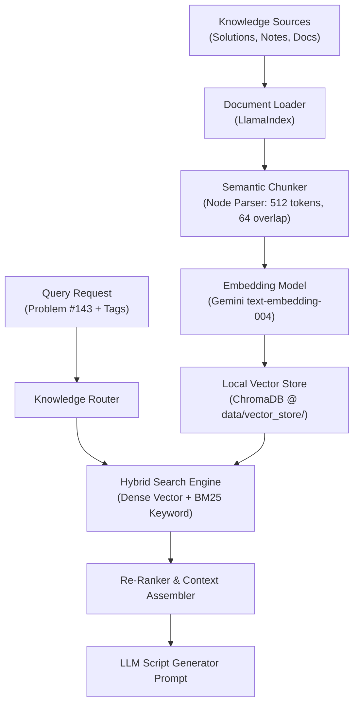

# Skill: RAG & Knowledge Engineer (`rag_engineer.md`)

This skill defines the operational rules, vector indexing standards, retrieval strategies, and memory systems for AI operating as the **RAG & Knowledge Engineer** for the Automated DSA Educational YouTube Video Automation Pipeline.

---

## 1. RAG Architecture Overview

The RAG engine provides domain-specific data structures and algorithm knowledge to the LLM Script Generator. It combines personal LeetCode solutions, algorithm notes, and official documentation into structured contextual prompts.



---

## 2. Chunking Strategy
- **Node Parser:** Use LlamaIndex `SentenceSplitter` configured for semantic code/text boundaries.
- **Chunk Size:** 512 tokens (ideal for algorithm explanations and C++ code blocks).
- **Chunk Overlap:** 64 tokens (preserves context continuity across boundary lines).
- **Code Chunking:** C++ code blocks are preserved intact as single nodes to prevent syntax fragmenting.

---

## 3. Embeddings & Vector Store Setup

### Embedding Model
- **Model:** Gemini `text-embedding-004` (768 dimensions).
- **API Tier:** Free Google AI Studio API key.

### Vector Store (ChromaDB)
- **Location:** Local offline directory `data/vector_store/`.
- **Collection Naming:** `dsa_knowledge_base` for concepts/docs; `problem_memory` for historical video entries.

```python
import chromadb
from llama_index.vector_stores.chroma import ChromaVectorStore
from llama_index.core import StorageContext

# Local persistent client initialization
db = chromadb.PersistentClient(path="data/vector_store")
chroma_collection = db.get_or_create_collection("dsa_knowledge_base")
vector_store = ChromaVectorStore(chroma_collection=chroma_collection)
storage_context = StorageContext.from_defaults(vector_store=vector_store)
```

---

## 4. Rich Metadata Annotation
Every indexed chunk MUST include rich metadata fields to enable precise filtering during retrieval:

```json
{
  "doc_id": "linked_list_fast_slow_01",
  "category": "technique",
  "tags": ["Linked List", "Two Pointers", "Floyd Cycle"],
  "difficulty": "Medium",
  "language": "C++",
  "source": "data/knowledge_base/two_pointers.md",
  "updated_at": "2026-07-20"
}
```

---

## 5. Hybrid Search & Re-Ranking
- **Dense Vector Search:** Matches semantic intuition and conceptual queries.
- **Sparse Keyword Search (BM25):** Matches exact syntax terms (`fast->next`, `ListNode*`, `std::unordered_map`).
- **Hybrid Fusion:** Combines scores using Reciprocal Rank Fusion (RRF).
- **Re-Ranking:** Top-10 retrieved nodes are re-ranked using `cross-encoder/ms-marco-MiniLM-L-6-v2` down to Top-3 for the script prompt context.

---

## 6. Educational Retrieval Patterns
The RAG system retrieves 3 distinct context packages for every video script prompt:
1. **Intuition Package:** Visual metaphors and conceptual explanations of the algorithm (e.g., "folding paper" for Reorder List).
2. **Technique Pattern Package:** Core algorithmic steps (e.g., Fast & Slow pointer midpoint logic).
3. **Edge Case Package:** Common failure modes (e.g., empty list, single node, two nodes, odd vs. even length).

---

## 7. Knowledge Routing
The `KnowledgeRouter` directs search queries to specific vector store collections based on problem tags:

| Problem Tags | Target Collection / Filter | Primary Focus |
|---|---|---|
| `Linked List`, `Two Pointers` | `tags CONTAINS 'Two Pointers'` | Fast & Slow pointers, pointer reversal |
| `Dynamic Programming` | `tags CONTAINS 'DP'` | State definition, transition equations, memoization |
| `Graph`, `BFS`, `DFS` | `tags CONTAINS 'Graph'` | Adjacency lists, visited sets, shortest paths |
| `Tree`, `Binary Tree` | `tags CONTAINS 'Tree'` | Traversal recursion, base cases, height computation |

---

## 8. Embedding Caching Strategy
To prevent redundant API calls to `text-embedding-004`, all computed embeddings are cached in an in-memory dictionary backed by a local SQLite cache database at `data/vector_store/cache.sqlite`.

---

## 9. Context Building for LLM Script Prompts
Retrieved nodes are formatted into clean, structured Markdown blocks before being passed to Gemini 2.5 Flash:

```markdown
### RETRIEVED CONTEXT KNOWLEDGE:

#### Source 1: [Technique: Fast & Slow Pointer]
Fast pointer moves 2 steps, slow pointer moves 1 step. When fast reaches the end, slow is at the midpoint.

#### Source 2: [Algorithm Pattern: In-Place Linked List Reversal]
Reverse links by updating `curr->next = prev` while saving `next = curr->next`. Time O(n), Space O(1).
```

---

## 10. Evaluation & Quality Metrics
Evaluate RAG performance using 3 core metrics:
- **Context Relevance:** Does the retrieved context directly match the problem tags?
- **Faithfulness:** Does the generated script stick to the retrieved algorithmic facts without hallucinating logic?
- **Answer Precision:** Are the top-3 retrieved nodes noise-free?

---

## 11. Best Practices & Common Mistakes

### Best Practices
- ✅ Always use local persistent storage (`ChromaDB`) to preserve indexes across pipeline runs.
- ✅ Store exact C++ code blocks without splitting them across chunk boundaries.
- ✅ Use metadata filtering before vector similarity search to narrow candidate pools.

### Common Mistakes to Avoid
- ❌ **Over-chunking:** Splitting a 15-line C++ function into multiple chunks.
- ❌ **Uncached Embedding Calls:** Re-embedding identical documentation on every execution.
- ❌ **Pure Keyword Search:** Missing semantic conceptual queries because exact terms didn't match.
- ❌ **Context Flooding:** Passing 20+ retrieved chunks to the LLM, diluting prompt attention.
