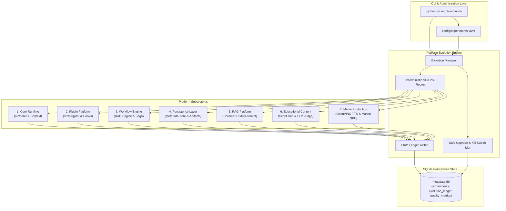
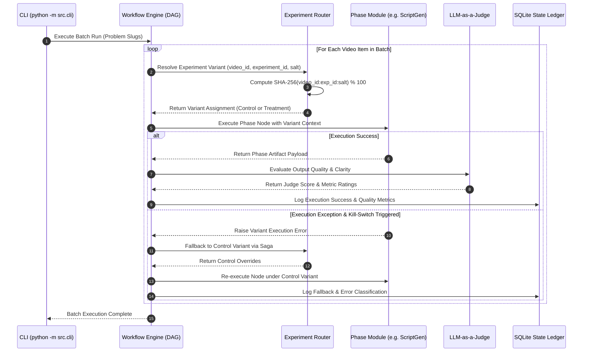
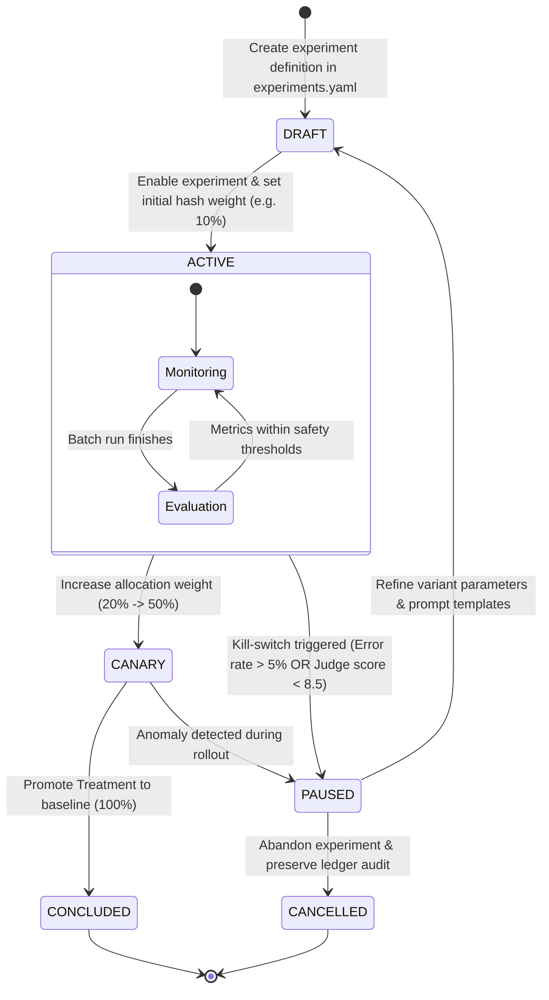
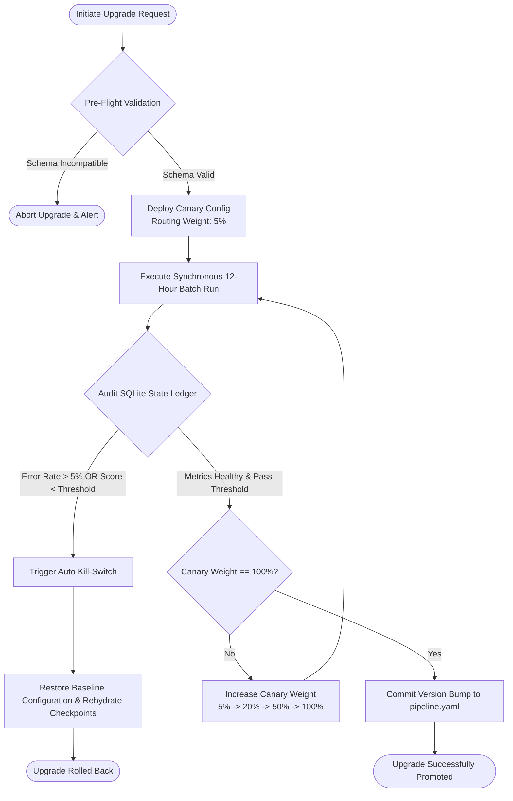

# Phase 15: Platform Evolution Architecture — Detailed Blueprint & Requirement Analysis Report

**Target System:** Automated Data Structures & Algorithms (DSA) Educational YouTube Video Generation Pipeline  
**Target Environment:** Intel Core Ultra 7 155H · Intel Arc GPU · Intel AI Boost NPU · Ubuntu 25.10 LTS · Python 3.12  
**Document Version:** 1.0.0  
**Status:** Architectural Specification & Design Blueprint  
**Author:** explorer_m1_3  
**Working Directory:** `/home/adarsh/Documents/Youtube-Channel/.agents/teamwork_preview_explorer_m1_3`  
**Target Blueprint Deliverable File:** `PromptBook/Phase15/01_Platform_Evolution_Architecture.md`

---

## 1. Executive Summary & Phase 15 Overview

### 1.1 Core Mission of Platform Evolution
The Automated DSA Educational YouTube Video Pipeline has reached production maturity across 14 phases. Phase 15 introduces **Platform Evolution Architecture**—a systematic framework for controlled A/B experimentation, data-driven optimization, zero-downtime component upgrades, prompt engineering iteration, model drift monitoring, and schema evolution.

Unlike web services handling concurrent real-time user requests, this system operates under the **Synchronous 12-Hour Batch Pipeline Paradigm**. A scheduled batch run ingests 50–60 LeetCode problem specifications and processes each sequentially through 13 execution phases. Therefore, Platform Evolution must achieve experimentation and continuous upgrades *without* introducing dynamic request-time race conditions, non-deterministic side effects, or resource contention on hardware accelerators (Intel Arc GPU / Intel AI Boost NPU).

### 1.2 Architectural Pillars of Platform Evolution
1. **Deterministic Batch Routing (R2):** Pure, deterministic routing of video items to experimental variants using SHA-256 content hashes of Video ID, Experiment ID, and Salt.
2. **Seamless Subsystem Integration (R1):** Unifying Platform Evolution with Runtime, Plugin SDK, Workflow Engine, Persistence Stores, ChromaDB RAG, Educational Prompting, and Media Engines.
3. **SQLite State Ledger & Analytics (R3):** Persistent tracking of every execution step, model invocation score, error trend, model drift vector, and prompt decay curve using `metadata.db`.
4. **Resilient Safe Upgrades & Rollbacks (R2):** Canary rollouts, Blue/Green pipeline execution, rolling phase upgrades, and instant kill-switches with state rehydration guarantees.
5. **Standardized Operational CLI (R4):** Complete administrative command-line control adhering to `python -m src.cli evolution <subcommand>`.

---

## 2. Requirement 1 Analysis: Evolution Integration Architecture (R1)

Platform Evolution acts as an overarching governance and routing layer across all existing platform subsystems. Below is the detailed architectural integration contract for each of the 7 primary platform subsystems:

```
┌──────────────────────────────────────────────────────────────────────────────────────────────────┐
│                                PLATFORM EVOLUTION GOVERNANCE ENGINE                              │
│  EvolutionConfig · ExperimentRouter · DynamicVariantInjector · StateLedger · UpgradeManager       │
└────────────────────────────────────────────────┬─────────────────────────────────────────────────┘
                                                 │
  ┌──────────────────┬───────────────────┬───────┴───────────┬───────────────────┬─────────────────┐
  ▼                  ▼                   ▼                   ▼                   ▼                 ▼
┌──────────────┐   ┌──────────────┐   ┌──────────────┐    ┌──────────────┐    ┌──────────────┐  ┌──────────────┐
│  1. RUNTIME  │   │  2. PLUGINS  │   │ 3. WORKFLOW  │    │4. PERSISTENCE│    │   5. RAG     │  │6. EDUCATIONAL│
│  `src/core/` │   │`src/plugins` │   │ `src/wf/`    │    │`metadata.db` │    │ `src/rag/`   │  │`src/script/` │
└──────────────┘   └──────────────┘   └──────────────┘    └──────────────┘    └──────────────┘  └──────────────┘
                                                                                                   │
                                                                                                   ▼
                                                                                              ┌──────────────┐
                                                                                              │  7. MEDIA    │
                                                                                              │ `src/media/` │
                                                                                              └──────────────┘
```

### 2.1 Subsystem 1: Runtime & Core Infrastructure (`src/core/`, Configuration, CLI)
- **Integration Contract:** The Evolution Engine hooks directly into `src/core/config.py`. When `python -m src.cli` initializes, the `EvolutionConfig` merges global defaults (`config/pipeline.yaml`) with active experiment definitions (`config/experiments.yaml`).
- **Context Propagation:** Inject `ExperimentContext(experiment_id, variant_id, hash_bucket, feature_flags)` into the core execution context passed down to all phase handlers.
- **Structured Logging:** Enforce structlog binding of `experiment_id` and `variant_id` for every log emitted during batch execution.

### 2.2 Subsystem 2: Plugin Platform (`src/plugins/`, Plugin SDK, Hook System)
- **Integration Contract:** Integrates with `PromptBook/09_Plugin_SDK.md` and `PluginManager`. Experiments can specify experimental plugin implementations or override existing plugin hooks (`pre_execution_hook`, `post_execution_hook`).
- **Variant Routing:** When a phase requests a plugin interface (e.g. `CustomCodeAnalyzerPlugin`), the `PluginManager` queries `ExperimentRouter` to check if a treatment variant overrides the plugin implementation for the current video item.
- **Sandbox Isolation:** Experimental plugins execute inside version-gated sandboxes with strict resource limits and fallback to baseline plugins upon exception.

### 2.3 Subsystem 3: Workflow Engine (`PromptBook/11_Workflow_Engine.md`, DAG Engine, Saga Manager)
- **Integration Contract:** Integrates with the Declarative DAG Engine. Experiments can dynamically replace individual DAG nodes, adjust DAG topology, or configure step parameters (e.g. retry counts, timeouts).
- **Variant-Aware Saga Rollbacks:** If an experimental variant fails during a DAG node execution (e.g. Phase 07 Animation Spec generation using an experimental prompt), the Saga Compensation Manager catches the failure, records a `VARIANT_EXECUTION_FAILURE` in the State Ledger, and triggers a Saga fallback to the Control variant for that node without terminating the entire batch.

### 2.4 Subsystem 4: Persistence Layer (`src/persistence/`, SQLite `metadata.db`, FileCache, ArtifactRegistry)
- **Integration Contract:** Expands `metadata.db` with evolution ledger tables (`experiments`, `experiment_allocations`, `evolution_ledger`, `quality_metrics`, `model_drift_ledger`, `prompt_decay_ledger`).
- **Cryptographic Artifact Registry:** Every artifact generated under an experiment is registered in `ArtifactRegistry` with metadata tag `variant_signature = SHA-256(video_id + variant_id + artifact_hash)`.
- **Checkpoint Isolation:** Checkpoint Manager serializes `ExperimentContext` into checkpoint state files (`checkpoints/*.json`). When state rehydration occurs, the system verifies that the active experiment configuration matches the checkpoint's variant signature.

### 2.5 Subsystem 5: RAG Platform (`src/rag/`, ChromaDB Vector Store, Multi-Tenant Indexing)
- **Integration Contract:** Supports experimentation on embedding models (e.g. `text-embedding-3-small` vs `bge-large-en-v1.5`), chunking strategies, top-K retrieval parameters, and reranking algorithms.
- **Multi-Tenant Index Isolation:** ChromaDB collections are partitioned or namespaced by variant (e.g., `dsa_knowledge_control` vs `dsa_knowledge_exp_v2`) to prevent data cross-pollination during RAG evaluations.

### 2.6 Subsystem 6: Educational Content Platform (`src/educational/`, Script Gen, LLM-as-a-Judge)
- **Integration Contract:** Enables A/B testing of prompt templates (`PromptTemplateLibrary`), LLM providers (Google Gemini 1.5 Pro vs Gemini 2.0 Flash vs local Ollama models), sampling temperature, and judge rubrics.
- **Automated LLM Judging:** Every script generated under an experiment is evaluated by an LLM-as-a-Judge node. Scores for pedagogical clarity, code correctness, storytelling flow, and time-stamping accuracy are automatically logged to `quality_metrics` in `metadata.db`.

### 2.7 Subsystem 7: Media Production Platform (`src/media/`, OpenVINO Kokoro TTS, Manim CE GPU, FFmpeg QSV)
- **Integration Contract:** Enables experimentation on voice synthesis models (Kokoro-82M on NPU vs XTTS v2 on Arc GPU), speech speed/pitch factors, Manim visual styling rules (dark theme vs high-contrast theme), and FFmpeg hardware acceleration profiles (QSV H.265 vs AV1 vs x264).
- **Resource Lock Management:** Hardware accelerators (NPU `/dev/accel/accel0` and GPU `/dev/dri/renderD128`) are locked sequentially by the batch worker regardless of variant, ensuring experimental variants do not cause hardware device contention.

---

## 3. Requirement 2 Analysis: Experimentation Lifecycle & Safe Upgrade Strategies (R2)

### 3.1 Synchronous Batch Pipeline A/B Testing Routing Logic

#### 3.1.1 Deterministic Hash Bucket Routing Equation
Because the pipeline executes in synchronous 12-hour batch queues, routing decisions must be 100% deterministic, repeatable, and stateless across job restarts.

Let $V$ be the Video ID (e.g. `leetcode_0001_two_sum`), $E$ be the Experiment ID (e.g. `exp_2026_script_prompt_v2`), and $S$ be the Experiment Salt string (e.g. `salt_8f93a`). The Hash Bucket Value $B(V, E, S) \in [0, 99]$ is defined as:

$$B(V, E, S) = \text{SHA-256}(V \mathbin{\Vert} \text{":"} \mathbin{\Vert} E \mathbin{\Vert} \text{":"} \mathbin{\Vert} S) \pmod{100}$$

Where $\mathbin{\Vert}$ denotes string concatenation, SHA-256 converts the resulting hex string to a 256-bit integer, and $\pmod{100}$ yields an integer hash bucket between $0$ and $99$.

#### 3.1.2 Routing Allocation Rule
For an experiment with Control weight $W_{\text{control}}$ and Variant weights $W_{v_1}, W_{v_2}, \dots, W_{v_k}$ such that $\sum W = 100$:

$$\text{Assigned Variant}(V) = \begin{cases} 
\text{Control} & \text{if } B(V, E, S) < W_{\text{control}} \\
\text{Variant}_1 & \text{if } W_{\text{control}} \le B(V, E, S) < W_{\text{control}} + W_{v_1} \\
\text{Variant}_2 & \text{if } W_{\text{control}} + W_{v_1} \le B(V, E, S) < W_{\text{control}} + W_{v_1} + W_{v_2} \\
\dots & \dots
\end{cases}$$

This guarantees:
1. **Determinism:** The same video ID always yields the exact same variant for a given experiment config, ensuring idempotent re-runs.
2. **Uniform Distribution:** SHA-256 produces a uniform distribution over $[0, 99]$.
3. **Orthogonality:** Different salt values $S$ ensure independent hash assignments across concurrent experiments.

### 3.2 Experiment Configuration Schema (`config/experiments.yaml`)

```yaml
version: "1.0.0"
active_experiments:
  - experiment_id: "exp_phase05_prompt_v3"
    name: "Educational Script Generation - Socratic Reasoning Prompt V3"
    description: "Evaluates multi-turn Socratic step-by-step code explanation against control prompt."
    status: "ACTIVE"  # DRAFT | ACTIVE | CANARY | PAUSED | CONCLUDED
    created_at: "2026-07-23T12:00:00Z"
    target_phases:
      - "Phase05_ScriptGen"
    salt: "socratic_prompt_v3_salt_9021"
    allocation_strategy: "DETERMINISTIC_HASH"
    variants:
      - variant_id: "control"
        name: "Baseline Prompt V2"
        weight: 80
        overrides:
          prompt_template: "templates/script/script_generation_v2.j2"
          llm_model: "gemini-1.5-pro"
          temperature: 0.2
      - variant_id: "treatment_socratic"
        name: "Experimental Socratic Prompt V3"
        weight: 20
        overrides:
          prompt_template: "templates/script/script_generation_v3_socratic.j2"
          llm_model: "gemini-1.5-pro"
          temperature: 0.4
    safety:
      max_allowed_error_rate: 0.05
      min_judge_score_threshold: 8.5
      auto_kill_switch: true
      fallback_variant: "control"
```

### 3.3 Backward Compatibility Guarantees
1. **SemVer Schema Contract:** Data models implement SemVer version headers (`schema_version: "1.4.0"`).
2. **Adapter Layer Strategy:** If an experimental variant modifies payload dataclasses (e.g. adding new audio timestamp fields in Phase 08), a forward/backward `PayloadAdapter` transforms payloads between major/minor schema versions.
3. **State Rehydration Safety:** During batch resume, `CheckpointManager` validates the checkpoint's `schema_version` and `variant_id`. If an experiment was disabled between batch pause and resume, `CheckpointManager` invokes `PayloadAdapter.downgrade_to_control()` to safely rehydrate state under the baseline control configuration.

### 3.4 Safe Upgrade Lifecycle & Strategies

```
┌─────────────────────────────────────────────────────────────────────────────────────────┐
│                                 SAFE UPGRADE LIFECYCLE                                  │
└────────────────────────────────────────────┬────────────────────────────────────────────┘
                                             │
   ┌─────────────────────────────────────────┼─────────────────────────────────────────┐
   ▼                                         ▼                                         ▼
┌───────────────────────┐         ┌───────────────────────┐         ┌───────────────────────┐
│   CANARY PHASE ROUTE  │         │   BLUE / GREEN PIPELINE│         │  ROLLING PHASE UPGRADE│
│  5% ──► 20% ──► 100%  │         │ Pipeline A vs B swap  │         │ Phase 05 -> Phase 08  │
└───────────┬───────────┘         └───────────┬───────────┘         └───────────┬───────────┘
            │                                 │                                 │
            └─────────────────────────────────┼─────────────────────────────────┘
                                              ▼
                                ┌───────────────────────────┐
                                │   HEALTH LEDGER MONITOR   │
                                │ ErrRate <=5%, Score >=8.5 │
                                └─────────────┬─────────────┘
                                              │
                    ┌─────────────────────────┴─────────────────────────┐
                    ▼                                                   ▼
         [ PASS: Promote Variant ]                          [ FAIL: Auto-Kill Switch ]
         Upgrade committed to baseline                      Fallback to Control variant
```

1. **Canary Phase Routing:** Gradually increases the deterministic hash bucket weight of a treatment variant across successive 12-hour batch runs ($5\% \to 20\% \to 50\% \to 100\%$).
2. **Blue/Green Pipeline Execution:** Maintaining parallel code packages (`src_v1` Green, `src_v2` Blue). A global CLI flag (`python -m src.cli --pipeline-target green`) toggles execution roots while sharing the underlying `metadata.db` and ChromaDB stores.
3. **Rolling Phase Upgrades:** Upgrading individual phases in sequence (e.g., upgrading Phase 05 Script Gen first, verifying ledger metrics across 3 batch runs, then upgrading Phase 08 Audio Voice).
4. **Emergency Rollback & Kill-Switches:** The `EvolutionEngine` monitors batch progress. If a treatment variant triggers errors exceeding `max_allowed_error_rate` (5%) or judge scores drop below `min_judge_score_threshold` (8.5), the automated kill-switch flips `status = PAUSED` in `metadata.db` and immediately redirects all remaining batch items to the `fallback_variant`.

---

## 4. Requirement 3 Analysis: Analytics Strategy & SQLite State Ledger (R3)

### 4.1 Periodic Batch Reporting Architecture
At the conclusion of each 12-hour batch run, or via scheduled CLI command, the `EvolutionAnalyticsWorker` queries `metadata.db` to generate comprehensive performance reports.

### 4.2 Key Metrics Definitions
- **Success Rate ($SR$):** Ratio of completed phase executions without failure:
  $$SR_{\text{variant}} = \frac{\text{Successful Executions}}{\text{Total Attempted Executions}} \times 100\%$$
- **Error Trend Taxonomy:** Categorized into:
  - `TRANSIENT_NETWORK`: API rate limit (429), timeout.
  - `COMPUTE_RESOURCE`: NPU OOM, GPU memory allocation error, FFmpeg segfault.
  - `QUALITY_REJECT`: LLM-as-a-Judge score below threshold (< 8.0).
  - `SCHEMA_VALIDATION`: Payload contract validation exception.
- **Model Drift Vector ($MDV$):** Statistical divergence in LLM/Embedding outputs over time:
  $$MDV = \text{Mean Latency Shift} + \alpha (\Delta \text{Mean Token Count}) + \beta (\Delta \text{Embedding Cosine Distance})$$
- **Prompt Quality Decay ($PQD$):** Rolling 7-day regression of LLM-as-a-Judge ratings for a specific prompt template version.

### 4.3 SQLite Database Schema Definitions (`metadata.db`)

```sql
-- 1. Experiments Table
CREATE TABLE IF NOT EXISTS experiments (
    experiment_id TEXT PRIMARY KEY,
    name TEXT NOT NULL,
    description TEXT,
    status TEXT NOT NULL CHECK (status IN ('DRAFT', 'ACTIVE', 'CANARY', 'PAUSED', 'CONCLUDED')),
    target_phases TEXT NOT NULL, -- JSON array of phase names
    salt TEXT NOT NULL,
    allocation_strategy TEXT NOT NULL DEFAULT 'DETERMINISTIC_HASH',
    created_at TIMESTAMP DEFAULT CURRENT_TIMESTAMP,
    updated_at TIMESTAMP DEFAULT CURRENT_TIMESTAMP
);

-- 2. Experiment Allocations Table
CREATE TABLE IF NOT EXISTS experiment_allocations (
    allocation_id TEXT PRIMARY KEY,
    experiment_id TEXT NOT NULL,
    video_id TEXT NOT NULL,
    batch_run_id TEXT NOT NULL,
    hash_bucket INTEGER NOT NULL,
    variant_id TEXT NOT NULL,
    allocated_at TIMESTAMP DEFAULT CURRENT_TIMESTAMP,
    FOREIGN KEY (experiment_id) REFERENCES experiments(experiment_id),
    UNIQUE(experiment_id, video_id, batch_run_id)
);

-- 3. Evolution Ledger Table (Execution Log per Phase/Item)
CREATE TABLE IF NOT EXISTS evolution_ledger (
    ledger_id TEXT PRIMARY KEY,
    batch_run_id TEXT NOT NULL,
    video_id TEXT NOT NULL,
    phase_id TEXT NOT NULL,
    experiment_id TEXT,
    variant_id TEXT NOT NULL DEFAULT 'control',
    execution_status TEXT NOT NULL CHECK (execution_status IN ('SUCCESS', 'FAILURE', 'FALLBACK_EXECUTED')),
    error_type TEXT, -- TRANSIENT_NETWORK | COMPUTE_RESOURCE | QUALITY_REJECT | SCHEMA_VALIDATION
    error_message TEXT,
    latency_ms REAL NOT NULL,
    input_tokens INTEGER DEFAULT 0,
    output_tokens INTEGER DEFAULT 0,
    compute_device TEXT, -- CPU | GPU | NPU
    created_at TIMESTAMP DEFAULT CURRENT_TIMESTAMP,
    FOREIGN KEY (experiment_id) REFERENCES experiments(experiment_id)
);

-- 4. Quality Metrics Table (LLM Judge & Human Scores)
CREATE TABLE IF NOT EXISTS quality_metrics (
    metric_id TEXT PRIMARY KEY,
    ledger_id TEXT NOT NULL,
    video_id TEXT NOT NULL,
    variant_id TEXT NOT NULL,
    overall_judge_score REAL NOT NULL,
    pedagogical_clarity REAL NOT NULL,
    code_correctness REAL NOT NULL,
    visual_engagement REAL NOT NULL,
    hallucination_flag INTEGER NOT NULL DEFAULT 0, -- 0 = false, 1 = true
    judge_model TEXT NOT NULL,
    evaluated_at TIMESTAMP DEFAULT CURRENT_TIMESTAMP,
    FOREIGN KEY (ledger_id) REFERENCES evolution_ledger(ledger_id)
);

-- 5. Model Drift Ledger Table
CREATE TABLE IF NOT EXISTS model_drift_ledger (
    drift_id TEXT PRIMARY KEY,
    model_identifier TEXT NOT NULL,
    evaluation_window_start TIMESTAMP NOT NULL,
    evaluation_window_end TIMESTAMP NOT NULL,
    avg_latency_ms REAL NOT NULL,
    latency_p95_ms REAL NOT NULL,
    avg_output_tokens REAL NOT NULL,
    score_variance REAL NOT NULL,
    drift_detected INTEGER NOT NULL DEFAULT 0, -- 0 = false, 1 = true
    created_at TIMESTAMP DEFAULT CURRENT_TIMESTAMP
);

-- 6. Prompt Decay Ledger Table
CREATE TABLE IF NOT EXISTS prompt_decay_ledger (
    decay_id TEXT PRIMARY KEY,
    prompt_template_id TEXT NOT NULL,
    template_version TEXT NOT NULL,
    batch_run_id TEXT NOT NULL,
    sample_size INTEGER NOT NULL,
    avg_quality_score REAL NOT NULL,
    decay_percentage REAL NOT NULL DEFAULT 0.0,
    created_at TIMESTAMP DEFAULT CURRENT_TIMESTAMP
);

-- Indexes for high-performance analytics queries
CREATE INDEX IF NOT EXISTS idx_evo_ledger_exp_var ON evolution_ledger(experiment_id, variant_id);
CREATE INDEX IF NOT EXISTS idx_evo_ledger_batch ON evolution_ledger(batch_run_id);
CREATE INDEX IF NOT EXISTS idx_quality_variant ON quality_metrics(variant_id);
CREATE INDEX IF NOT EXISTS idx_allocations_video ON experiment_allocations(video_id);
```

### 4.4 SQL Query Definitions for Batch Analytics & Drift Tracking

#### Query 1: Variant Performance Comparison Report
```sql
SELECT 
    l.experiment_id,
    l.variant_id,
    COUNT(DISTINCT l.video_id) AS total_videos,
    ROUND(SUM(CASE WHEN l.execution_status = 'SUCCESS' THEN 1 ELSE 0 END) * 100.0 / COUNT(*), 2) AS success_rate_pct,
    ROUND(AVG(l.latency_ms), 2) AS avg_latency_ms,
    ROUND(AVG(l.input_tokens + l.output_tokens), 2) AS avg_total_tokens,
    ROUND(AVG(q.overall_judge_score), 2) AS avg_judge_score,
    ROUND(AVG(q.pedagogical_clarity), 2) AS avg_clarity_score,
    ROUND(AVG(q.code_correctness), 2) AS avg_code_accuracy,
    SUM(q.hallucination_flag) AS total_hallucinations
FROM evolution_ledger l
LEFT JOIN quality_metrics q ON l.ledger_id = q.ledger_id
WHERE l.experiment_id = :experiment_id
GROUP BY l.experiment_id, l.variant_id;
```

#### Query 2: Error Trend & Classification Analysis
```sql
SELECT 
    l.phase_id,
    l.variant_id,
    l.error_type,
    COUNT(*) AS error_count,
    ROUND(COUNT(*) * 100.0 / SUM(COUNT(*)) OVER (PARTITION BY l.phase_id), 2) AS error_share_pct,
    MAX(l.created_at) AS last_error_timestamp
FROM evolution_ledger l
WHERE l.execution_status != 'SUCCESS'
  AND l.created_at >= datetime('now', '-7 days')
GROUP BY l.phase_id, l.variant_id, l.error_type
ORDER BY error_count DESC;
```

#### Query 3: Model Drift Detection over Moving Windows
```sql
SELECT 
    l.phase_id,
    l.variant_id,
    DATE(l.created_at) AS execution_date,
    COUNT(*) AS sample_count,
    ROUND(AVG(l.latency_ms), 2) AS mean_latency,
    ROUND(AVG(l.output_tokens), 2) AS mean_tokens,
    ROUND(AVG(q.overall_judge_score), 2) AS mean_score,
    ROUND(
        AVG(q.overall_judge_score * q.overall_judge_score) - (AVG(q.overall_judge_score) * AVG(q.overall_judge_score)), 
        4
    ) AS score_variance
FROM evolution_ledger l
JOIN quality_metrics q ON l.ledger_id = q.ledger_id
WHERE l.created_at >= datetime('now', '-30 days')
GROUP BY l.phase_id, l.variant_id, DATE(l.created_at)
ORDER BY execution_date ASC;
```

#### Query 4: Prompt Quality Decay Detection
```sql
WITH RollingScores AS (
    SELECT 
        q.judge_model,
        l.phase_id,
        q.evaluated_at,
        q.overall_judge_score,
        AVG(q.overall_judge_score) OVER (
            PARTITION BY l.phase_id, l.variant_id 
            ORDER BY q.evaluated_at 
            ROWS BETWEEN 50 PRECEDING AND CURRENT ROW
        ) AS rolling_avg_score
    FROM quality_metrics q
    JOIN evolution_ledger l ON q.ledger_id = l.ledger_id
)
SELECT 
    phase_id,
    ROUND(FIRST_VALUE(rolling_avg_score) OVER (PARTITION BY phase_id ORDER BY evaluated_at ASC), 2) AS initial_baseline_score,
    ROUND(LAST_VALUE(rolling_avg_score) OVER (PARTITION BY phase_id ORDER BY evaluated_at ASC RANGE BETWEEN UNBOUNDED PRECEDING AND UNBOUNDED FOLLOWING), 2) AS current_rolling_score,
    ROUND(
        (FIRST_VALUE(rolling_avg_score) OVER (PARTITION BY phase_id ORDER BY evaluated_at ASC) - 
         LAST_VALUE(rolling_avg_score) OVER (PARTITION BY phase_id ORDER BY evaluated_at ASC RANGE BETWEEN UNBOUNDED PRECEDING AND UNBOUNDED FOLLOWING)) * 100.0 /
        FIRST_VALUE(rolling_avg_score) OVER (PARTITION BY phase_id ORDER BY evaluated_at ASC),
        2
    ) AS prompt_decay_pct
FROM RollingScores
GROUP BY phase_id;
```

---

## 5. Requirement 4 Analysis: Architectural Deliverables (R4)

### 5.1 Section Breakdown for `PromptBook/Phase15/01_Platform_Evolution_Architecture.md`

The target file `01_Platform_Evolution_Architecture.md` will be structured into the following 8 comprehensive sections:

1. **Section 1: Executive Summary & Evolution Philosophy**
   - Architectural principles, batch pipeline constraints, determinism, and zero-downtime evolution.
2. **Section 2: System Integration Architecture (R1)**
   - Integration matrices and contracts across Runtime, Plugins, Workflow DAG, Persistence, RAG, Educational Prompting, and Media Production.
3. **Section 3: Experimentation Lifecycle & Deterministic Routing (R2)**
   - Mathematical hash formulation, SHA-256 bucket allocation, multi-arm routing, and YAML configuration specification.
4. **Section 4: Safe Upgrade Strategies & Backward Compatibility (R2)**
   - SemVer schema contracts, payload adapters, state rehydration safety, Canary phase rollouts, Blue/Green execution, and automatic kill-switches.
5. **Section 5: Analytics Strategy & SQLite State Ledger (R3)**
   - Metrics definitions, SQLite schema creation statements, index designs, and batch reporting architecture.
6. **Section 6: Production SQL Query Specifications (R3)**
   - Complete SQL queries for variant evaluation, error classification, model drift vector calculation, and prompt decay detection.
7. **Section 7: Mermaid Architecture & Flow Diagrams (R4)**
   - Renderable Mermaid diagrams covering Integration Topology, Sequence Flow, Experiment Lifecycle, and Safe Upgrade Lifecycle.
8. **Section 8: Operational CLI Guidance & Administration (R4)**
   - Standardized command syntaxes, flag definitions, operational examples, and disaster recovery workflows.

---

### 5.2 Mermaid Diagram Specifications (R4)

#### Diagram 1: Evolution Integration Architecture Diagram


#### Diagram 2: Sequence Flow for Experiment Routing & Synchronous Execution


#### Diagram 3: Experimentation Lifecycle Flow


#### Diagram 4: Safe Upgrade Lifecycle Flow


---

## 6. Operational CLI Guidance (R4)

All platform evolution management operations are exposed via standard entrypoint semantics (`python -m src.cli`). Below is the complete operational CLI specification:

```bash
# ==============================================================================
# PLATFORM EVOLUTION CLI COMMAND SPECIFICATION
# Entrypoint: python -m src.cli evolution <command> [options]
# ==============================================================================

# ------------------------------------------------------------------------------
# 1. Experiment Management Subcommands
# ------------------------------------------------------------------------------

# List all registered experiments and their current status
python -m src.cli evolution experiment list

# Show detailed configuration and live metrics for a specific experiment
python -m src.cli evolution experiment show --id exp_phase05_prompt_v3

# Activate an experiment or update its allocation percentage
python -m src.cli evolution experiment enable \
    --id exp_phase05_prompt_v3 \
    --percent 20

# Instantly pause/disable an active experiment (Kill-Switch)
python -m src.cli evolution experiment disable \
    --id exp_phase05_prompt_v3 \
    --reason "Judge score dropped below threshold (8.2 < 8.5)"

# ------------------------------------------------------------------------------
# 2. Analytics & Reporting Subcommands
# ------------------------------------------------------------------------------

# Generate batch evolution report for a completed 12-hour batch run
python -m src.cli evolution analytics report \
    --batch-id BATCH_20260723_01 \
    --format text

# Export experiment variant evaluation matrix to CSV or JSON
python -m src.cli evolution analytics compare \
    --id exp_phase05_prompt_v3 \
    --output artifacts/reports/exp_prompt_v3_report.json

# Audit model drift metrics across a rolling time window
python -m src.cli evolution analytics drift \
    --window-days 30 \
    --threshold-stddev 2.0

# Detect prompt template quality decay across active templates
python -m src.cli evolution analytics prompt-decay \
    --min-sample-size 50

# ------------------------------------------------------------------------------
# 3. Upgrade & Rollback Subcommands
# ------------------------------------------------------------------------------

# Perform dry-run pre-flight check for a proposed system upgrade
python -m src.cli evolution upgrade dry-run \
    --config config/upgrades/v2_0_upgrade.yaml

# Execute canary phase rollout upgrade
python -m src.cli evolution upgrade execute \
    --config config/upgrades/v2_0_upgrade.yaml \
    --canary-percent 10

# Perform emergency rollback to a target stable release version
python -m src.cli evolution upgrade rollback \
    --target-version v1.4.0 \
    --force
```

---

## 7. Synthesis & Conclusion

This analysis report provides the complete conceptual, mathematical, architectural, schema, and operational blueprint for Phase 15: Platform Evolution Architecture. 

The resulting specification in `PromptBook/Phase15/01_Platform_Evolution_Architecture.md` will strictly satisfy:
- **R1:** Comprehensive integration contracts with all 7 platform subsystems.
- **R2:** Pure deterministic SHA-256 batch hash routing, YAML schema, SemVer schema compatibility, and 4 safe upgrade strategies.
- **R3:** SQLite State Ledger schemas, index optimization, and 4 production SQL analytical queries.
- **R4:** Complete section structure, 4 detailed renderable Mermaid diagrams, and complete `python -m src.cli` operational CLI guidance.
