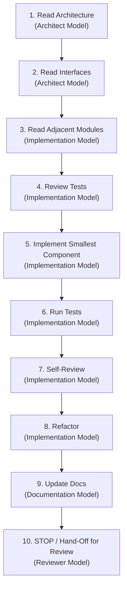

# Workflow: Module Implementation (`implement.md`)

This workflow defines the mandatory 10-step execution sequence that every AI developer and model MUST follow when implementing any component or module in this project.

---

## The 10-Step Implementation Sequence

---

## Step-by-Step Execution Protocol

### Step 1: Read Architecture (`Architect Model`)
Before writing a single line of code, read:
- `.ai/context/architecture.md`
- `PromptBook/02_Project_Architecture.md`

### Step 2: Read Interfaces (`Architect Model`)
Inspect abstract protocols, base classes, and dataclass schemas governing the target module:
- Protocols under `src/` (e.g., `VoiceEngineProtocol`, `BaseSceneRenderer`)

### Step 3: Read Adjacent Modules (`Implementation Model`)
Read upstream inputs and downstream outputs connected to the target module to prevent interface mismatches.

### Step 4: Review Tests (`Implementation Model`)
Read existing test cases under `tests/` matching the target component to understand expected behaviors and mock setups.

### Step 5: Implement Smallest Component (`Implementation Model`)
Write the minimal, fully-typed, production-grade Python code for the single smallest target component (zero placeholders, zero `TODO`s).

### Step 6: Run Tests (`Implementation Model`)
Execute `pytest tests/test_<module>.py` to verify unit correctness and zero regressions.

### Step 7: Self-Review (`Implementation Model`)
Perform internal quality check against PEP8, `mypy --strict` typing, file size (<400 lines), and SOLID principles.

### Step 8: Refactor (`Implementation Model`)
Clean up variable names, extract sub-methods, remove redundancy, and optimize without changing public contracts.

### Step 9: Update Docs (`Documentation Model`)
Update corresponding documentation artifacts under `PromptBook/` or `.ai/context/`.

### Step 10: STOP (`Reviewer Model`)
Cease modifications. Hand off output for independent cross-model code review.
