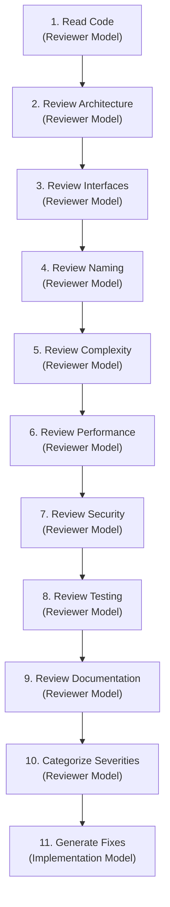

# Workflow: Code Review & Quality Audit (`review.md`)

This workflow defines the mandatory 11-step code review procedure and severity classification system for auditing code implementations.

---

## The 11-Step Code Review Execution Protocol

---

## Detailed Audit Dimensions

1. **Read Code:** Perform line-by-line inspection of the implementation file.
2. **Review Architecture:** Verify clean separation of layers and file size (<400 lines).
3. **Review Interfaces:** Check that types use Protocols / ABCs and dataclasses instead of generic dicts.
4. **Review Naming:** Confirm `snake_case`, `PascalCase`, and `UPPER_SNAKE_CASE` standards.
5. **Review Complexity:** Identify nested loops, cyclomatic complexity (>10), or monolith methods.
6. **Review Performance:** Check generator memory usage, `pathlib.Path`, and thread allocation.
7. **Review Security:** Verify zero exposed secrets/tokens and safe sub-process arguments.
8. **Review Testing:** Confirm matching pytest file with mock assertions.
9. **Review Documentation:** Check Google-style docstrings and 100% type hints.
10. **Categorize Findings:** Classify every issue by severity (`Critical`, `High`, `Medium`, `Low`).
11. **Generate Fixes:** Provide explicit replacement code blocks for Critical and High issues.
