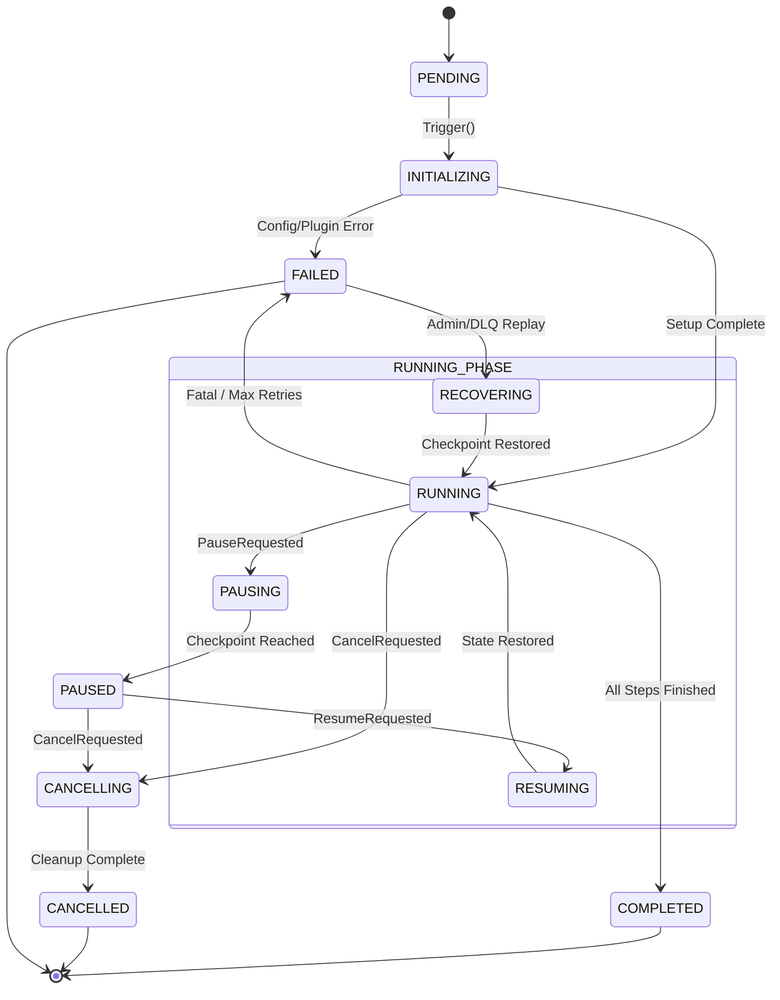
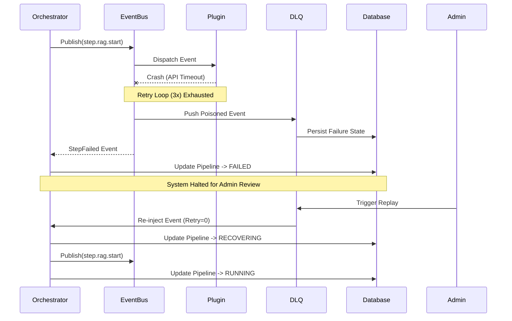

# 12. Pipeline State Model Architecture

**Author:** Principal Software Architect  
**Target System:** Automated DSA Educational YouTube Video Pipeline  
**Document Version:** 1.0.0  
**Status:** Approved for Implementation

---

## 1. Executive Summary

This document defines the **Master Pipeline State Model**. As the pipeline orchestrates complex, long-running workflows (Scraping, RAG, Voice Synthesis, Video Rendering, and Uploading), it must maintain a mathematically provable state across process boundaries, asynchronous threads, and potential hardware failures.

This State Model acts as the universal source of truth, dictating how the Workflow Engine interacts with Plugins, how the Event Bus manages backpressure, and how crash-recovery checkpoints are persisted to disk.

---

## 2. Pipeline Identity & Context

### 2.1 Identity and Versioning
Every pipeline execution is uniquely identifiable to prevent state collisions and enable precise distributed tracking.
*   **Pipeline ID (UUIDv4):** The universal identifier for the entire run (e.g., `pipeline_5f3a...`).
*   **Workflow ID (String):** Defines the structural template being executed (e.g., `leetcode-daily-v1`).
*   **Trace ID (UUIDv4):** Used by the Event Bus to track OpenTelemetry spans across micro-components.
*   **State Version (Int):** An optimistic locking mechanism. Every state mutation increments the version. If two threads attempt to mutate `Version 4`, the second thread is rejected (Concurrent Modification Protection).

### 2.2 Pipeline Context
The Context is an immutable-by-default, append-only dictionary passed down the hierarchy. 
*   **Read-Only Inputs:** Configuration parameters passed at boot (e.g., `{"target_url": "leetcode.com"}`).
*   **State Artifacts:** Outputs generated by steps (e.g., `{"script_path": "/tmp/script.md"}`).
*   **Isolation:** Plugins cannot overwrite existing context keys, preventing the Video Renderer from accidentally deleting the Script generated by the RAG step.

---

## 3. The State Machine (FSM)

The Pipeline operates on a strict, unidirectional Finite State Machine. Invalid state transitions (e.g., `COMPLETED` -> `RUNNING`) will raise an immediate fatal `StateTransitionError`.

### 3.1 Pipeline Lifecycle Diagram

### 3.2 State Transition Table

| Current State | Event Trigger | Next State | Allowed Action |
| :--- | :--- | :--- | :--- |
| `PENDING` | StartPipeline | `INITIALIZING` | Boot Plugins, load context |
| `INITIALIZING` | SetupSuccess | `RUNNING` | Dispatch first step event |
| `RUNNING` | StepCompleted | `RUNNING` | Move to next Step |
| `RUNNING` | PauseSignal | `PAUSING` | Wait for current step to finish |
| `PAUSING` | StepCheckpointed | `PAUSED` | Halt execution loop |
| `RUNNING` | ErrorThrown | `FAILED` | Trigger DLQ routing |
| `FAILED` | ReplayTriggered | `RECOVERING` | Load last checkpoint |
| `RECOVERING` | StateLoaded | `RUNNING` | Dispatch resumed step event |

---

## 4. Sub-State Models

The Pipeline is a hierarchical system. The Master Pipeline State contains sub-states for discrete components.

### 4.1 Step & Workflow State
Workflows are composed of discrete "Steps" (e.g., `1. Scrape`, `2. RAG`).
*   **PENDING:** Step is in the queue.
*   **RUNNING:** Step is currently held by a Plugin.
*   **RETRYING:** Step failed, currently executing exponential backoff.
*   **SKIPPED:** Conditional execution resolved to false (e.g., skip upload if dry-run).
*   **COMPLETED:** Artifacts safely written to Context.
*   **FAILED:** Step exhausted retries. Halts the master Pipeline.

### 4.2 Event & Retry State
Managed by the Event Bus and Dead Letter Queue (DLQ).
*   **Retry Count (Int):** Tracks how many times an event has failed.
*   **Retry Boundary:** If `Retry Count > Max Retries`, the Event transitions to `DLQ` and triggers a `FAILED` state on the parent Step.

### 4.3 Plugin State
Managed by the `PluginLifecycleSupervisor`. 
*(Note: Plugins operate on `UNLOADED -> LOADED -> STARTING -> RUNNING -> STOPPING -> STOPPED`, independent of the Pipeline state, but a failed Plugin will freeze associated Pipeline Steps).*

---

## 5. Control Flow Mechanics

### 5.1 Pause & Resume (Checkpoints)
When an administrator issues a Pause command, the pipeline does **not** terminate active threads (which could corrupt video renders). 
1.  Pipeline state shifts to `PAUSING`.
2.  The engine awaits the completion of the *currently executing* Step.
3.  The engine writes the Context to the SQLite Persistence Layer (Checkpointing).
4.  State shifts to `PAUSED`. All future scheduled events are suspended.
5.  On `RESUME`, the engine loads the Checkpoint, rebuilds the Context, and transitions to `RUNNING`.

### 5.2 Failure, DLQ, and Recovery Sequence

---

## 6. Advanced Concepts

### 6.1 State Persistence and Audit History
Every state transition (e.g., `RUNNING` -> `FAILED`) must emit a synchronous `pipeline.state_changed` event. The SQLite `EventPersistence` layer tracks these changes, constructing a fully auditable timeline (Event Sourcing). This guarantees that we can retroactively calculate Step durations and bottleneck metrics.

### 6.2 Progress Reporting & Metrics
*   **Progress Math:** `(Steps Completed / Total Steps) * 100`.
*   **Metrics Injection:** Transition times between Steps are logged to the `MetricsRegistry` as `pipeline.step.duration.<step_name>`, providing real-time telemetry on Pipeline velocity.

### 6.3 Future Distributed Execution
While currently confined to a monolithic async loop, the State Model is fundamentally decoupled via Event IDs and UUIDs. If we eventually migrate to a distributed Kubernetes architecture (e.g., Celery/Kafka), this State Model requires zero modifications. The master Orchestrator simply persists the state to a distributed Redis/PostgreSQL store instead of local SQLite, utilizing the `State Version` integer for strict concurrency locking.

---

## 7. Best Practices & Anti-Patterns

### ✅ Best Practices
1.  **Append-Only Context:** Treat the Pipeline Context as an immutable append-only log. Never mutate a previous step's variables.
2.  **Idempotent Recovery:** Design all plugins so that recovering from a Checkpoint (e.g., re-running a video render that crashed at 99%) does not duplicate database entries or upload partial files.
3.  **Strict State Guarding:** Always verify the current state before triggering an action. (e.g., `if state != PAUSED: raise InvalidAction`).

### ❌ Anti-Patterns
1.  **State Bypassing:** Never manually edit the Pipeline State dictionary. All state changes must flow through the central Orchestrator State Machine function to ensure Audit Events are published.
2.  **Hard Kills (SIGKILL):** Never forcefully kill a `RUNNING` pipeline. Always trigger a `CancelRequested` event, shifting it to `CANCELLING`, allowing plugins to gracefully close DB connections and flush partial files.
3.  **Local Variables:** Never store critical step artifacts in local variables. If the pipeline crashes, local variables are wiped from RAM, rendering Checkpoint Recovery impossible. Always write artifacts directly to the `PipelineContext`.
