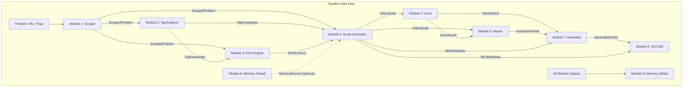

# 02_Project_Architecture.md — Master Architecture Specification

**Author:** Principal Software Architect  
**Target System:** Automated DSA Educational YouTube Video Pipeline  
**Target Environment:** Intel Core Ultra 7 155H · Ubuntu 25.10 LTS · Python 3.12 · Intel Arc GPU  
**Document Version:** 1.0.0  
**Last Updated:** July 2026  
**Status:** Canonical — All implementation MUST conform to this specification.

---

## Table of Contents

1. [Executive Summary](#1-executive-summary)
2. [Overall System Architecture](#2-overall-system-architecture)
3. [Module Responsibilities](#3-module-responsibilities)
4. [Module Dependency Graph](#4-module-dependency-graph)
5. [Data Flow](#5-data-flow)
6. [Folder Responsibilities](#6-folder-responsibilities)
7. [Interface Philosophy](#7-interface-philosophy)
8. [Configuration Strategy](#8-configuration-strategy)
9. [Logging Strategy](#9-logging-strategy)
10. [Error Handling Strategy](#10-error-handling-strategy)
11. [Dependency Injection Strategy](#11-dependency-injection-strategy)
12. [Scalability Strategy](#12-scalability-strategy)
13. [Performance Considerations](#13-performance-considerations)
14. [Future Extensions](#14-future-extensions)
15. [Design Decisions](#15-design-decisions)
16. [Architectural Principles](#16-architectural-principles)
17. [Things Explicitly Avoided](#17-things-explicitly-avoided)

---

## 1. Executive Summary

This document defines the complete architecture for a **fully automated, offline-first pipeline** that transforms LeetCode problem URLs into production-quality educational YouTube videos covering Data Structures and Algorithms.

### System Identity

The system is a **sequential processing pipeline** composed of nine independent modules. Each module:

- Owns a single, well-defined responsibility.
- Communicates with adjacent modules exclusively through **typed dataclass contracts**.
- Can be developed, tested, and replaced in isolation.
- Persists its outputs to disk for crash recovery and cacheability.

### Hardware Contract

| Resource | Specification | Pipeline Role |
|---|---|---|
| CPU | Intel Core Ultra 7 155H (16C/22T) | Orchestration, FFmpeg encoding, general compute |
| NPU | Intel AI Boost NPU | OpenVINO inference acceleration (Kokoro TTS) |
| GPU | Intel Arc (Integrated) | Manim rendering, optional OpenVINO offload |
| RAM | System Memory | Embedding index, ChromaDB, concurrent processing |
| Storage | Local SSD | Knowledge base, vector store, rendered media cache |
| Network | On-demand only | LeetCode scraping, Gemini API calls, YouTube upload |

### Operational Model

The pipeline is designed to run **end-to-end for a single problem** in a single invocation, but also supports **resuming from any intermediate checkpoint** if a prior run partially completed. The orchestrator drives the pipeline; modules never call each other directly.

---

## 2. Overall System Architecture

### 2.1 High-Level Pipeline

```
┌──────────────────────────────────────────────────────────────────────────┐
│                          PIPELINE ORCHESTRATOR                          │
│                    (Sequential Dispatch · Checkpoint)                    │
└──────┬──────┬──────┬──────┬──────┬──────┬──────┬──────┬──────┬─────────┘
       │      │      │      │      │      │      │      │      │
       ▼      │      │      │      │      │      │      │      │
  ┌─────────┐ │      │      │      │      │      │      │      │
  │ SCRAPER │ │      │      │      │      │      │      │      │
  └────┬────┘ │      │      │      │      │      │      │      │
       │      ▼      │      │      │      │      │      │      │
       │ ┌─────────┐ │      │      │      │      │      │      │
       │ │  TAGS   │ │      │      │      │      │      │      │
       │ └────┬────┘ │      │      │      │      │      │      │
       │      │      ▼      │      │      │      │      │      │
       │      │ ┌─────────┐ │      │      │      │      │      │
       │      │ │   RAG   │ │      │      │      │      │      │
       │      │ └────┬────┘ │      │      │      │      │      │
       │      │      │      ▼      │      │      │      │      │
       │      │      │ ┌─────────┐ │      │      │      │      │
       │      │      │ │ SCRIPT  │ │      │      │      │      │
       │      │      │ └────┬────┘ │      │      │      │      │
       │      │      │      │      ▼      │      │      │      │
       │      │      │      │ ┌─────────┐ │      │      │      │
       │      │      │      │ │  VOICE  │ │      │      │      │
       │      │      │      │ └────┬────┘ │      │      │      │
       │      │      │      │      │      ▼      │      │      │
       │      │      │      │      │ ┌─────────┐ │      │      │
       │      │      │      │      │ │  MANIM  │ │      │      │
       │      │      │      │      │ └────┬────┘ │      │      │
       │      │      │      │      │      │      ▼      │      │
       │      │      │      │      │      │ ┌─────────┐ │      │
       │      │      │      │      │      │ │ASSEMBLY │ │      │
       │      │      │      │      │      │ └────┬────┘ │      │
       │      │      │      │      │      │      │      ▼      │
       │      │      │      │      │      │      │ ┌─────────┐ │
       │      │      │      │      │      │      │ │ YOUTUBE │ │
       │      │      │      │      │      │      │ └────┬────┘ │
       │      │      │      │      │      │      │      │      ▼
       │      │      │      │      │      │      │      │ ┌─────────┐
       │      │      │      │      │      │      │      │ │ MEMORY  │
       │      │      │      │      │      │      │      │ └─────────┘
       ▼      ▼      ▼      ▼      ▼      ▼      ▼      ▼      ▼
  ┌──────────────────────────────────────────────────────────────────────┐
  │                       SHARED INFRASTRUCTURE                         │
  │          Config · Logging · Persistence · Error Recovery            │
  └──────────────────────────────────────────────────────────────────────┘
```

### 2.2 Architectural Pattern

The system follows a **Pipes and Filters** architecture with a centralized **Orchestrator** acting as the pipeline controller:

- **Pipes:** Typed dataclass objects serialized to disk between stages.
- **Filters:** Independent processing modules, each transforming input data to output data.
- **Orchestrator:** A top-level coordinator that invokes modules in sequence, manages checkpoints, and handles retry logic.

This is deliberately NOT a microservice architecture, event-driven system, or actor model. It is a **batch processing pipeline** optimized for single-machine throughput.

### 2.3 Architectural Layers

```
┌─────────────────────────────────────────────────────┐
│  Layer 4: ENTRY POINTS                              │
│  CLI · Orchestrator · Scheduled Runner              │
├─────────────────────────────────────────────────────┤
│  Layer 3: PIPELINE MODULES                          │
│  Scraper · Tags · RAG · Script · Voice ·            │
│  Manim · Assembly · YouTube · Memory                │
├─────────────────────────────────────────────────────┤
│  Layer 2: SHARED SERVICES                           │
│  Config · Logging · Cache · Persistence ·           │
│  Error Handling · External API Clients              │
├─────────────────────────────────────────────────────┤
│  Layer 1: DOMAIN MODELS                             │
│  Dataclasses · Enums · Type Aliases · Protocols     │
└─────────────────────────────────────────────────────┘
```

**Dependency rule:** Each layer may only depend on layers below it. No lateral dependencies between modules in the same layer. No upward dependencies.

---

## 3. Module Responsibilities

### 3.1 Module 1 — Problem Scraper (`src/scraper/`)

**Purpose:** Extract complete problem metadata and the user's accepted C++ solution from LeetCode.

| Attribute | Detail |
|---|---|
| **Input** | LeetCode problem URL or slug (e.g., `two-sum` or `https://leetcode.com/problems/two-sum/`) |
| **Output** | `ScrapedProblem` dataclass |
| **External Dependencies** | LeetCode GraphQL API (via session cookie) |
| **Offline Fallback** | Returns cached `ScrapedProblem` from `data/scraped/` if available |

**Responsibilities:**

1. Parse the problem URL/slug into a canonical LeetCode slug.
2. Query LeetCode's GraphQL API for:
   - Problem title, difficulty, description (HTML → cleaned Markdown).
   - Tags (e.g., `Array`, `Two Pointers`, `Linked List`).
   - Constraints and examples.
   - The user's most recent accepted C++ submission.
3. Normalize and sanitize all text (strip HTML entities, fix encoding).
4. Persist the `ScrapedProblem` to `data/scraped/{slug}.json`.
5. Implement rate limiting (minimum 2-second delay between requests).
6. Handle authentication failures (expired session cookie) with actionable error messages.

**Output Contract — `ScrapedProblem`:**

```python
@dataclass(frozen=True)
class ScrapedProblem:
    slug: str                    # "two-sum"
    title: str                   # "1. Two Sum"
    number: int                  # 1
    difficulty: Difficulty        # Difficulty.EASY
    description: str             # Cleaned markdown
    constraints: list[str]       # ["2 <= nums.length <= 10^4", ...]
    examples: list[Example]      # Structured input/output examples
    tags: list[str]              # ["Array", "Hash Table"]
    accepted_code: str           # User's accepted C++ solution
    code_language: str           # "cpp"
    scraped_at: datetime         # UTC timestamp
```

---

### 3.2 Module 2 — Tag Explorer (`src/tags/`)

**Purpose:** Enrich raw LeetCode tags with deep algorithmic knowledge: pattern families, related problems, prerequisite concepts, and difficulty progressions.

| Attribute | Detail |
|---|---|
| **Input** | `ScrapedProblem.tags` (list of tag strings) |
| **Output** | `TagKnowledge` dataclass |
| **External Dependencies** | Gemini API (for tag expansion and pattern classification) |
| **Offline Fallback** | Returns cached `TagKnowledge` from `data/tags/` if available |

**Responsibilities:**

1. Map each raw tag to a **pattern family** (e.g., `"Two Pointers"` → `Pointer Manipulation Family`).
2. Identify the **primary algorithmic technique** for the problem based on tag combination.
3. Determine **prerequisite concepts** a viewer should know before watching.
4. Suggest **related problems** by difficulty progression (Easier → Same → Harder).
5. Classify the **visual animation style** suited for this tag combination (e.g., `array_traversal`, `tree_recursion`, `graph_bfs`).
6. Persist to `data/tags/{slug}_tags.json`.

**Output Contract — `TagKnowledge`:**

```python
@dataclass(frozen=True)
class TagKnowledge:
    slug: str
    primary_pattern: str              # "Hash Map Lookup"
    pattern_family: str               # "Hashing Patterns"
    all_tags: list[str]               # Original tags
    prerequisites: list[str]          # ["Arrays", "Hash Tables"]
    related_problems: list[RelatedProblem]
    animation_style: AnimationStyle   # AnimationStyle.ARRAY_TRAVERSAL
    difficulty_context: str           # "Entry-level hash map problem"
    explored_at: datetime
```

---

### 3.3 Module 3 — RAG Knowledge Engine (`src/rag/`)

**Purpose:** Retrieve pedagogically relevant context from a local knowledge base to ground the script generator in factually accurate, curriculum-aligned explanations.

| Attribute | Detail |
|---|---|
| **Input** | `ScrapedProblem` + `TagKnowledge` |
| **Output** | `RAGContext` dataclass |
| **External Dependencies** | Gemini API (embeddings), ChromaDB (local vector store) |
| **Offline Fallback** | Fully offline after initial index build |

**Responsibilities:**

1. **Index Management:**
   - Ingest educational content from `data/knowledge_base/` (Markdown files covering DSA topics, textbook excerpts, algorithm explanations).
   - Chunk documents using a topic-aware splitter (not naive character splitting).
   - Generate embeddings via Gemini's embedding model (`text-embedding-004` or successor).
   - Store embeddings in a persistent ChromaDB collection at `data/vector_store/`.

2. **Retrieval:**
   - Construct a composite query from the problem's description, tags, pattern family, and accepted code.
   - Retrieve top-k (default k=8) most relevant chunks.
   - Re-rank results by pedagogical relevance (prefer explanations over raw code).
   - Deduplicate overlapping chunks.

3. **Context Assembly:**
   - Package retrieved chunks into a structured `RAGContext` with source attribution.
   - Include a relevance score for each chunk to allow downstream filtering.

**Output Contract — `RAGContext`:**

```python
@dataclass(frozen=True)
class RAGContext:
    slug: str
    chunks: list[RetrievedChunk]       # Ranked, deduplicated chunks
    query_used: str                    # The composite query string
    total_chunks_searched: int
    retrieval_time_ms: float
    retrieved_at: datetime

@dataclass(frozen=True)
class RetrievedChunk:
    content: str                       # The text content
    source_file: str                   # "data/knowledge_base/hashing.md"
    relevance_score: float             # 0.0 to 1.0
    chunk_index: int                   # Position within source document
```

---

### 3.4 Module 4 — Educational Script Generator (`src/script/`)

**Purpose:** Synthesize a structured, narration-ready JSON video script that drives both the voice and animation modules.

| Attribute | Detail |
|---|---|
| **Input** | `ScrapedProblem` + `TagKnowledge` + `RAGContext` + `MemoryRecord` (optional) |
| **Output** | `VideoScript` dataclass |
| **External Dependencies** | Gemini API (LLM generation) |
| **Offline Fallback** | Returns cached script from `data/scripts/` if available |

**Responsibilities:**

1. Construct a structured prompt incorporating:
   - Problem metadata (title, difficulty, description, constraints, examples).
   - Tag knowledge (pattern, prerequisites, related problems).
   - RAG-retrieved educational context.
   - Memory feedback from prior video generations (if any).
2. Generate a **10-section video script** in a strict JSON schema:
   - Hook / Attention Grab
   - Problem Statement
   - Constraints Analysis
   - Brute Force Intuition
   - Optimized Approach Intuition
   - Visual Algorithm Walkthrough
   - Dry Run with Example
   - C++ Code Walkthrough
   - Complexity Analysis
   - Closing / Call to Action
3. Validate the generated script against the JSON schema.
4. Ensure narration text is natural-sounding when spoken aloud (conversational, not textbook).
5. Embed `visual_params` in each section to guide Manim rendering (animation type, data structures to display, highlight colors).
6. Persist to `data/scripts/{slug}_script.json`.

**Output Contract — `VideoScript`:**

```python
@dataclass(frozen=True)
class VideoScript:
    slug: str
    title: str
    difficulty: Difficulty
    tags: list[str]
    total_estimated_duration_seconds: float
    sections: list[ScriptSection]
    seo_metadata: SEOMetadata
    generated_at: datetime

@dataclass(frozen=True)
class ScriptSection:
    section_id: str                    # "hook", "problem_statement", etc.
    section_type: SectionType          # SectionType.HOOK, etc.
    narration: str                     # Text to be spoken
    visual_params: VisualParams        # Typed Manim rendering parameters
    estimated_duration_seconds: float
    order: int

@dataclass(frozen=True)
class SEOMetadata:
    youtube_title: str
    youtube_description: str
    youtube_tags: list[str]
    chapter_timestamps: list[str]      # "0:00 Hook", "0:15 Problem", ...
```

**Typed Visual Parameters — `VisualParams` Union:**

Each `ScriptSection` carries a typed `VisualParams` object instead of a freeform `dict[str, Any]`. This provides compile-time type safety between the Script Generator (producer) and Animation Renderer (consumer). The `ScriptValidator` validates LLM output against the appropriate typed structure before it reaches the renderer.

```python
# src/models/visual_params.py

@dataclass(frozen=True)
class ArrayVisualParams:
    """Params for ArrayScene — traversal, swap, and pointer animations."""
    array: list[int | str]
    pointers: list[int]
    highlight_indices: list[int]
    labels: list[str]

@dataclass(frozen=True)
class LinkedListVisualParams:
    """Params for LinkedListScene — node and pointer animations."""
    values: list[int | str]
    pointer_names: list[str]
    pointer_positions: list[int]

@dataclass(frozen=True)
class TreeVisualParams:
    """Params for TreeScene — BFS/DFS traversal animations."""
    values: list[int | str | None]     # Level-order representation
    highlight_nodes: list[int]
    traversal_order: list[int]

@dataclass(frozen=True)
class GraphVisualParams:
    """Params for GraphScene — edge traversal and path highlighting."""
    adjacency: dict[str, list[str]]
    highlight_edges: list[tuple[str, str]]
    visited_nodes: list[str]

@dataclass(frozen=True)
class HashMapVisualParams:
    """Params for HashMapScene — bucket visualization."""
    entries: list[tuple[str, str]]
    highlight_keys: list[str]
    bucket_count: int

@dataclass(frozen=True)
class StackQueueVisualParams:
    """Params for StackQueueScene — push/pop/enqueue/dequeue."""
    structure_type: str                # "stack" or "queue"
    operations: list[tuple[str, int | str]]   # [("push", 5), ("pop", None), ...]

@dataclass(frozen=True)
class CodeVisualParams:
    """Params for CodeScene — syntax-highlighted code walkthrough."""
    code: str
    language: str                      # "cpp"
    highlight_lines: list[int]
    variable_state: dict[str, str]

@dataclass(frozen=True)
class ComplexityVisualParams:
    """Params for ComplexityScene — Big-O comparison charts."""
    complexities: dict[str, str]       # {"Time": "O(n)", "Space": "O(1)"}
    comparison_labels: list[str]       # ["Brute Force", "Optimized"]
    comparison_values: list[str]       # ["O(n²)", "O(n)"]

@dataclass(frozen=True)
class GenericVisualParams:
    """Fallback for sections without data-structure-specific visuals (e.g., Hook, Closing)."""
    title_text: str
    subtitle_text: str
    key_points: list[str]

# Union type — exhaustive over all scene types
VisualParams = (
    ArrayVisualParams
    | LinkedListVisualParams
    | TreeVisualParams
    | GraphVisualParams
    | HashMapVisualParams
    | StackQueueVisualParams
    | CodeVisualParams
    | ComplexityVisualParams
    | GenericVisualParams
)
```

---

### 3.5 Module 5 — Voice Generation (`src/voice/`)

**Purpose:** Convert narration text into high-quality, natural-sounding speech audio using the Kokoro-82M TTS model running locally via OpenVINO.

| Attribute | Detail |
|---|---|
| **Input** | `VideoScript.sections[*].narration` |
| **Output** | `VoiceResult` dataclass |
| **External Dependencies** | None (fully local) |
| **Offline Fallback** | Fully offline |

**Responsibilities:**

1. Load the Kokoro-82M model compiled for OpenVINO (CPU/NPU execution on Intel Core Ultra).
2. Load the speaker embedding vector from `voice_samples/` or `reference.wav`.
3. For each script section:
   - Synthesize speech from the narration text.
   - Apply consistent voice characteristics (speed, pitch, tone).
   - Export as individual WAV files at 24kHz sample rate.
4. Generate a **timing manifest** mapping each section to its audio duration.
5. Persist audio files to `data/voice/{slug}/section_{id}.wav`.
6. Persist the timing manifest to `data/voice/{slug}/manifest.json`.

**Output Contract — `VoiceResult`:**

```python
@dataclass(frozen=True)
class VoiceResult:
    slug: str
    section_audio: list[SectionAudio]
    total_duration_seconds: float
    sample_rate: int                   # 24000
    model_used: str                    # "kokoro-82m-openvino"
    generated_at: datetime

@dataclass(frozen=True)
class SectionAudio:
    section_id: str
    audio_path: Path                   # data/voice/{slug}/section_hook.wav
    duration_seconds: float
    word_count: int
```

---

### 3.6 Module 6 — Manim Animation Engine (`src/animation/`)

**Purpose:** Render programmatic mathematical and algorithmic animations for each script section using the Manim Community library.

| Attribute | Detail |
|---|---|
| **Input** | `VideoScript.sections[*].visual_params` + `VoiceResult.section_audio[*].duration_seconds` |
| **Output** | `AnimationResult` dataclass |
| **External Dependencies** | None (fully local — Manim, FFmpeg for rendering) |
| **Offline Fallback** | Fully offline |

**Responsibilities:**

1. Maintain a **library of reusable scene templates** for common DSA visual patterns:
   - Array traversal with pointer highlights.
   - Linked list node manipulation.
   - Tree traversal (BFS/DFS with level coloring).
   - Graph traversal with edge animations.
   - Hash map bucket visualization.
   - Stack/Queue push-pop animations.
   - Code walkthrough with line-by-line highlighting.
   - Complexity chart (bar/line graphs).
2. For each script section:
   - Select the appropriate scene template based on `visual_params.animation_type`.
   - Configure the scene with section-specific data (array values, tree structure, code text).
   - Synchronize animation duration to match the corresponding audio duration from the voice module.
   - Render to an individual MP4 file (1920×1080, 30fps, dark background theme).
3. Apply a consistent visual theme:
   - Dark background (#0f0f23 or similar).
   - Syntax-highlighted code (Monokai-inspired palette).
   - Smooth easing functions for transitions.
   - Consistent font sizing and positioning.
4. Persist rendered clips to `data/animation/{slug}/section_{id}.mp4`.

**Output Contract — `AnimationResult`:**

```python
@dataclass(frozen=True)
class AnimationResult:
    slug: str
    section_clips: list[SectionClip]
    resolution: str                    # "1920x1080"
    fps: int                           # 30
    theme: str                         # "dark"
    rendered_at: datetime

@dataclass(frozen=True)
class SectionClip:
    section_id: str
    video_path: Path                   # data/animation/{slug}/section_hook.mp4
    duration_seconds: float
    frame_count: int
```

---

### 3.7 Module 7 — Video Assembly (`src/assembly/`)

**Purpose:** Stitch together voice audio and animation video clips into a final, polished YouTube-ready video using FFmpeg.

| Attribute | Detail |
|---|---|
| **Input** | `VoiceResult` + `AnimationResult` + `VideoScript.seo_metadata` |
| **Output** | `AssembledVideo` dataclass |
| **External Dependencies** | FFmpeg (local system binary) |
| **Offline Fallback** | Fully offline |

**Responsibilities:**

1. Validate that every section has both an audio file and a video clip.
2. For each section:
   - Mux the audio onto the video clip.
   - Pad or trim video to exactly match audio duration.
3. Concatenate all section clips in script order.
4. Apply post-processing:
   - Normalize audio levels (loudness target: -14 LUFS for YouTube).
   - Add a brief fade-in/fade-out at video boundaries.
   - Embed chapter markers as metadata.
5. Export the final video:
   - Codec: H.264 (libx264), CRF 18-20.
   - Audio: AAC, 192kbps.
   - Container: MP4.
6. Generate a thumbnail frame (extract key frame or compose from title card).
7. Persist to `data/output/{slug}/final.mp4` and `data/output/{slug}/thumbnail.png`.

**Output Contract — `AssembledVideo`:**

```python
@dataclass(frozen=True)
class AssembledVideo:
    slug: str
    video_path: Path                   # data/output/{slug}/final.mp4
    thumbnail_path: Path               # data/output/{slug}/thumbnail.png
    total_duration_seconds: float
    file_size_bytes: int
    codec: str                         # "h264"
    audio_codec: str                   # "aac"
    resolution: str                    # "1920x1080"
    assembled_at: datetime
```

---

### 3.8 Module 8 — YouTube Upload (`src/youtube/`)

**Purpose:** Upload the assembled video to YouTube with full metadata, using the YouTube Data API v3 via OAuth 2.0.

| Attribute | Detail |
|---|---|
| **Input** | `AssembledVideo` + `VideoScript.seo_metadata` |
| **Output** | `UploadResult` dataclass |
| **External Dependencies** | YouTube Data API v3, Google OAuth 2.0 |
| **Offline Fallback** | Queues upload for later; persists upload intent to `data/upload_queue/` |

**Responsibilities:**

1. Authenticate via OAuth 2.0 using `config/client_secrets.json`.
2. Manage token persistence (auto-refresh expired tokens).
3. Upload the video file using resumable upload protocol (handles interruptions).
4. Set video metadata:
   - Title, description, tags from `SEOMetadata`.
   - Category: Education (27).
   - Privacy: Private (default) or Unlisted for review.
   - Default language: English.
   - Chapter timestamps in description.
5. Upload the thumbnail image.
6. Handle YouTube API quota limits (10,000 units/day) by checking remaining quota before upload.
7. Return the YouTube video ID and URL upon success.
8. Persist upload result to `data/uploads/{slug}_upload.json`.

**Output Contract — `UploadResult`:**

```python
@dataclass(frozen=True)
class UploadResult:
    slug: str
    video_id: str                      # YouTube video ID
    video_url: str                     # "https://youtube.com/watch?v=..."
    privacy_status: str                # "private"
    upload_status: str                 # "completed"
    thumbnail_set: bool
    uploaded_at: datetime
```

---

### 3.9 Module 9 — Memory System (`src/memory/`)

**Purpose:** Maintain a persistent record of all generated videos, enabling deduplication, quality tracking, progressive improvement, and cross-video consistency.

| Attribute | Detail |
|---|---|
| **Input** | All prior module outputs for the completed run |
| **Output** | `MemoryRecord` dataclass (also queryable for future runs) |
| **External Dependencies** | None (local JSON/SQLite storage) |
| **Offline Fallback** | Fully offline |

**Responsibilities:**

1. After each successful pipeline run, persist a complete `MemoryRecord` containing:
   - Problem metadata, tags, generation timestamps.
   - Script hash (to detect regeneration).
   - Voice and animation metadata.
   - YouTube upload status and video ID.
   - Any errors encountered during the run.
2. Expose query interface:
   - `has_been_generated(slug) -> bool` — Deduplication check.
   - `get_record(slug) -> MemoryRecord | None` — Retrieve prior generation data.
   - `get_all_tags() -> set[str]` — All tags covered across all videos.
   - `get_problems_by_tag(tag) -> list[str]` — Find related videos.
   - `get_failed_runs() -> list[MemoryRecord]` — Identify retryable failures.
3. Maintain a **generation log** for analytics:
   - Total videos generated, average duration, tag distribution.
4. Feed prior `MemoryRecord` data back into the Script Generator (Module 4) so future scripts can reference previously covered problems and avoid repetition.
5. Persist to `data/memory/memory.json` (or `data/memory/memory.db` for SQLite).

**Output Contract — `MemoryRecord`:**

```python
@dataclass(frozen=True)
class MemoryRecord:
    slug: str
    problem_number: int
    title: str
    difficulty: Difficulty
    tags: list[str]
    primary_pattern: str
    script_hash: str
    voice_duration_seconds: float
    video_duration_seconds: float
    file_size_bytes: int
    youtube_video_id: str | None
    youtube_url: str | None
    status: PipelineStatus             # PipelineStatus.COMPLETED
    errors: tuple[str, ...]            # Tuple for frozen compatibility
    started_at: datetime
    completed_at: datetime | None
```

> **Note:** `MemoryRecord` is frozen for consistency with all other inter-module dataclasses. The `errors` field uses `tuple[str, ...]` instead of `list[str]` because frozen dataclasses require hashable field types. The orchestrator accumulates fields in a local dict during the pipeline run and freezes the `MemoryRecord` once at the end.

---

### 3.10 Module 0 — Pipeline Orchestrator (`src/orchestrator/`)

**Purpose:** Coordinate the sequential execution of all pipeline modules, manage checkpoints, and handle top-level error recovery.

| Attribute | Detail |
|---|---|
| **Input** | LeetCode problem URL/slug + runtime configuration |
| **Output** | `PipelineResult` dataclass |
| **External Dependencies** | All pipeline modules (injected) |

**Responsibilities:**

1. Accept a problem identifier from the CLI.
2. Check the Memory System for prior generation (skip or force-regenerate).
3. Execute modules in sequence: Scraper → Tags → RAG → Script → Voice → Manim → Assembly → YouTube → Memory.
4. After each module completes, persist its output as a **checkpoint** to `data/checkpoints/{slug}/{module_name}.json`.
5. On restart, detect existing checkpoints and resume from the last incomplete module.
6. Aggregate errors from all modules into a unified pipeline result.
7. Report final status (success, partial failure, complete failure) with timing breakdown.

**Output Contract — `PipelineResult`:**

```python
@dataclass(frozen=True)
class PipelineResult:
    slug: str
    status: PipelineStatus             # COMPLETED, PARTIAL_FAILURE, FAILED
    scraped_problem: ScrapedProblem | None
    video_script: VideoScript | None
    assembled_video: AssembledVideo | None
    upload_result: UploadResult | None
    memory_record: MemoryRecord | None
    errors: tuple[str, ...]
    module_timings: dict[str, float]   # {"scraper": 2.3, "voice": 120.5, ...}
    started_at: datetime
    completed_at: datetime
    total_duration_seconds: float
```

The `PipelineResult` is consumed by:
- **CLI** — to print a human-readable summary.
- **Batch processor** (future) — to aggregate results across multiple slugs.
- **Memory store** — to derive the `MemoryRecord`.

---

## 4. Module Dependency Graph

### 4.1 Runtime Data Dependencies



### 4.2 Code-Level Import Dependencies

```
src/orchestrator/    →  depends on  →  All module interfaces (protocols)
src/scraper/         →  depends on  →  src/models/, src/core/
src/tags/            →  depends on  →  src/models/, src/core/
src/rag/             →  depends on  →  src/models/, src/core/
src/script/          →  depends on  →  src/models/, src/core/
src/voice/           →  depends on  →  src/models/, src/core/
src/animation/       →  depends on  →  src/models/, src/core/
src/assembly/        →  depends on  →  src/models/, src/core/
src/youtube/         →  depends on  →  src/models/, src/core/
src/memory/          →  depends on  →  src/models/, src/core/
src/core/            →  depends on  →  src/models/ (for serialization type resolution)
src/models/          →  depends on  →  (nothing — true leaf package)
```

> **Corrected (v1.1):** `src/core/` is a *near-leaf* package that depends on `src/models/` for type resolution in `serialization.py` (it must know about domain dataclasses to deserialize them). `src/models/` is the sole true leaf. The one-way dependency `core/ → models/` does not introduce a cycle.

**Critical rule:** No pipeline module (`src/scraper/`, `src/tags/`, etc.) may import from any other pipeline module. Modules communicate exclusively through dataclass contracts defined in `src/models/`. The orchestrator is the only component that holds references to multiple modules.

### 4.3 Dependency Inversion Visualization

```
┌───────────────────────────────┐
│       Orchestrator            │   Depends on ABSTRACTIONS (Protocols)
│  (knows Protocol interfaces) │   defined in src/models/protocols.py
└───────────┬───────────────────┘
            │ depends on
            ▼
┌───────────────────────────────┐
│     src/models/protocols.py   │   Abstract interfaces (Protocol classes)
│   ScraperProtocol             │
│   TagExplorerProtocol         │
│   RAGEngineProtocol           │   ◄── Modules IMPLEMENT these
│   ScriptGeneratorProtocol     │
│   VoiceSynthesizerProtocol    │
│   AnimationRendererProtocol   │
│   VideoAssemblerProtocol      │
│   YouTubeUploaderProtocol     │
│   MemoryStoreProtocol         │
└───────────────────────────────┘
            ▲ implements
            │
┌───────────────────────────────┐
│   Concrete Module Classes     │   Each in its own src/{module}/ package
│   LeetCodeScraper             │
│   GeminiTagExplorer           │
│   ChromaRAGEngine             │
│   GeminiScriptGenerator       │
│   KokoroVoiceSynthesizer      │
│   ManimAnimationRenderer      │
│   FFmpegVideoAssembler        │
│   YouTubeAPIUploader          │
│   JSONMemoryStore             │
└───────────────────────────────┘
```

---

## 5. Data Flow

### 5.1 Complete Data Flow Diagram

```
INPUT: "https://leetcode.com/problems/two-sum/"
  │
  ▼
┌─────────────────────────────────────────────────────────────────────┐
│ Module 1: Scraper                                                   │
│   HTTP GET → LeetCode GraphQL API                                   │
│   Output: ScrapedProblem                                            │
│   Persisted: data/scraped/two-sum.json                              │
└──────────────────────────────┬──────────────────────────────────────┘
                               │ ScrapedProblem
                               ▼
┌─────────────────────────────────────────────────────────────────────┐
│ Module 2: Tag Explorer                                              │
│   Input: ScrapedProblem.tags                                        │
│   LLM Call → Gemini API (tag expansion)                             │
│   Output: TagKnowledge                                              │
│   Persisted: data/tags/two-sum_tags.json                            │
└──────────────────────────────┬──────────────────────────────────────┘
                               │ TagKnowledge
                               ▼
┌─────────────────────────────────────────────────────────────────────┐
│ Module 3: RAG Knowledge Engine                                      │
│   Input: ScrapedProblem + TagKnowledge                              │
│   Vector Search → ChromaDB (data/vector_store/)                     │
│   Output: RAGContext (top-8 relevant chunks)                        │
│   Persisted: data/rag/two-sum_context.json                          │
└──────────────────────────────┬──────────────────────────────────────┘
                               │ RAGContext
                               ▼
┌─────────────────────────────────────────────────────────────────────┐
│ Module 4: Script Generator                                          │
│   Input: ScrapedProblem + TagKnowledge + RAGContext + Memory        │
│   LLM Call → Gemini API (structured script generation)              │
│   Output: VideoScript (10 sections + SEO metadata)                  │
│   Persisted: data/scripts/two-sum_script.json                       │
└──────────────────────────────┬──────────────────────────────────────┘
                               │ VideoScript
                    ┌──────────┴──────────┐
                    ▼                     ▼
┌──────────────────────────┐  ┌──────────────────────────┐
│ Module 5: Voice           │  │ Module 6: Manim           │
│   Input: narration texts  │  │   Input: visual_params    │
│   Kokoro-82M + OpenVINO   │  │          + audio durations│
│   Output: VoiceResult     │  │   Manim Community render  │
│   WAVs: data/voice/       │  │   Output: AnimationResult │
│         two-sum/           │  │   MP4s: data/animation/   │
│         section_*.wav     │  │         two-sum/           │
└────────────┬─────────────┘  │         section_*.mp4     │
             │                 └────────────┬─────────────┘
             │  VoiceResult                 │  AnimationResult
             └──────────┬───────────────────┘
                        ▼
┌─────────────────────────────────────────────────────────────────────┐
│ Module 7: Video Assembly                                            │
│   Input: VoiceResult + AnimationResult + SEOMetadata                │
│   FFmpeg mux + concat + normalize                                   │
│   Output: AssembledVideo                                            │
│   Persisted: data/output/two-sum/final.mp4                          │
│              data/output/two-sum/thumbnail.png                      │
└──────────────────────────────┬──────────────────────────────────────┘
                               │ AssembledVideo
                               ▼
┌─────────────────────────────────────────────────────────────────────┐
│ Module 8: YouTube Upload                                            │
│   Input: AssembledVideo + SEOMetadata                               │
│   YouTube Data API v3 (resumable upload)                            │
│   Output: UploadResult                                              │
│   Persisted: data/uploads/two-sum_upload.json                       │
└──────────────────────────────┬──────────────────────────────────────┘
                               │ UploadResult
                               ▼
┌─────────────────────────────────────────────────────────────────────┐
│ Module 9: Memory System                                             │
│   Input: All module outputs                                         │
│   Stores MemoryRecord for future reference                          │
│   Persisted: data/memory/memory.json                                │
└─────────────────────────────────────────────────────────────────────┘
                               │
                               ▼
OUTPUT: YouTube video live at https://youtube.com/watch?v={id}
```

### 5.2 Data Persistence Map

Every module persists its output to a deterministic file path under `data/`. This serves three purposes:

1. **Crash Recovery:** The orchestrator can resume from the last persisted output.
2. **Caching:** Re-running the pipeline for the same problem skips modules whose outputs already exist.
3. **Debugging:** Every intermediate artifact is inspectable on disk.

```
data/
├── scraped/              # Module 1 outputs
│   └── {slug}.json       # ScrapedProblem serialized
├── tags/                 # Module 2 outputs
│   └── {slug}_tags.json  # TagKnowledge serialized
├── rag/                  # Module 3 outputs
│   └── {slug}_context.json   # RAGContext serialized
├── vector_store/         # Module 3 persistent index
│   └── chroma/           # ChromaDB storage directory
├── scripts/              # Module 4 outputs
│   └── {slug}_script.json    # VideoScript serialized
├── voice/                # Module 5 outputs
│   └── {slug}/
│       ├── section_hook.wav
│       ├── section_problem_statement.wav
│       ├── ...
│       └── manifest.json      # Timing manifest
├── animation/            # Module 6 outputs
│   └── {slug}/
│       ├── section_hook.mp4
│       ├── section_problem_statement.mp4
│       └── ...
├── output/               # Module 7 outputs
│   └── {slug}/
│       ├── final.mp4          # Assembled video
│       └── thumbnail.png      # YouTube thumbnail
├── uploads/              # Module 8 outputs
│   └── {slug}_upload.json     # UploadResult serialized
├── checkpoints/          # Orchestrator checkpoints
│   └── {slug}/
│       ├── scraper.json
│       ├── tags.json
│       ├── rag.json
│       ├── script.json
│       ├── voice.json
│       ├── animation.json
│       ├── assembly.json
│       └── youtube.json
├── memory/               # Module 9 persistent store
│   └── memory.json
└── knowledge_base/       # RAG source documents (manually curated)
    ├── arrays.md
    ├── linked_lists.md
    ├── trees.md
    ├── graphs.md
    ├── dynamic_programming.md
    ├── sorting.md
    ├── hashing.md
    └── ...
```

### 5.3 Serialization Contract

All inter-module data transfer objects are frozen dataclasses serialized to JSON. The serialization/deserialization layer lives in `src/core/serialization.py` and provides:

```python
def serialize(obj: Any, path: Path) -> None:
    """Serialize a dataclass to JSON file with datetime handling."""

def deserialize(path: Path, cls: type[T]) -> T:
    """Deserialize a JSON file back to a typed dataclass."""
```

**Rules:**
- All `datetime` fields serialize to ISO 8601 strings.
- All `Path` fields serialize to POSIX path strings **relative to `PROJECT_ROOT`** (defined in `src/core/paths.py`). On deserialization, relative paths are resolved back to absolute paths via `PROJECT_ROOT / relative_path`. This makes serialized data independent of the current working directory and robust to invocation from any location.
- All `Enum` fields serialize to their `.value` string.
- All `VisualParams` subtypes serialize with a `_type` discriminator field (e.g., `{"_type": "ArrayVisualParams", "array": [1, 2, 3], ...}`) to enable correct deserialization of the union type.
- Serialization must be round-trip safe: `deserialize(serialize(x)) == x`.

---

## 6. Folder Responsibilities

```
Youtube-Channel/                     # Project root
│
├── .env                             # Environment variables (secrets, API keys)
├── .env.example                     # Template .env for onboarding
├── pyproject.toml                   # Project metadata, dependencies, tool config
├── README.md                        # Project overview and quick start
│
├── config/                          # External configuration files
│   ├── client_secrets.json          # YouTube OAuth credentials
│   ├── pipeline.yaml                # Pipeline runtime configuration
│   └── logging.yaml                 # Logging configuration
│
├── src/                             # All application source code
│   ├── __init__.py
│   │
│   ├── models/                      # Layer 1: Domain models (leaf package)
│   │   ├── __init__.py
│   │   ├── problem.py               # ScrapedProblem, Example, Difficulty
│   │   ├── tags.py                  # TagKnowledge, RelatedProblem, AnimationStyle
│   │   ├── rag.py                   # RAGContext, RetrievedChunk
│   │   ├── script.py                # VideoScript, ScriptSection, SEOMetadata
│   │   ├── voice.py                 # VoiceResult, SectionAudio
│   │   ├── animation.py             # AnimationResult, SectionClip
│   │   ├── assembly.py              # AssembledVideo
│   │   ├── youtube.py               # UploadResult
│   │   ├── memory.py                # MemoryRecord, PipelineStatus
│   │   ├── protocols.py             # All Protocol interfaces
│   │   └── enums.py                 # Shared enumerations
│   │
│   ├── core/                        # Layer 2: Shared services (leaf package)
│   │   ├── __init__.py
│   │   ├── config.py                # Configuration loader (YAML + env)
│   │   ├── logger.py                # Structured logging setup
│   │   ├── serialization.py         # JSON serialization/deserialization
│   │   ├── cache.py                 # File-based cache manager
│   │   ├── exceptions.py            # Custom exception hierarchy
│   │   ├── retry.py                 # Retry decorator with backoff
│   │   └── paths.py                 # Centralized path resolution
│   │
│   ├── scraper/                     # Module 1: Problem Scraper
│   │   ├── __init__.py
│   │   ├── client.py                # LeetCode GraphQL HTTP client
│   │   ├── parser.py                # HTML/GraphQL response parser
│   │   └── scraper.py               # LeetCodeScraper (implements ScraperProtocol)
│   │
│   ├── tags/                        # Module 2: Tag Explorer
│   │   ├── __init__.py
│   │   ├── explorer.py              # GeminiTagExplorer (implements TagExplorerProtocol)
│   │   └── patterns.py              # Pattern family mappings and constants
│   │
│   ├── rag/                         # Module 3: RAG Knowledge Engine
│   │   ├── __init__.py
│   │   ├── engine.py                # ChromaRAGEngine (implements RAGEngineProtocol)
│   │   ├── chunker.py               # Topic-aware document chunker
│   │   ├── embedder.py              # Gemini embedding wrapper
│   │   └── indexer.py               # Knowledge base indexer
│   │
│   ├── script/                      # Module 4: Script Generator
│   │   ├── __init__.py
│   │   ├── generator.py             # GeminiScriptGenerator (implements ScriptGeneratorProtocol)
│   │   ├── prompts.py               # Prompt templates for script generation
│   │   └── validator.py             # JSON schema validation for scripts
│   │
│   ├── voice/                       # Module 5: Voice Generation
│   │   ├── __init__.py
│   │   ├── synthesizer.py           # KokoroVoiceSynthesizer (implements VoiceSynthesizerProtocol)
│   │   └── audio_utils.py           # Audio processing utilities
│   │
│   ├── animation/                   # Module 6: Manim Animation Engine
│   │   ├── __init__.py
│   │   ├── renderer.py              # ManimAnimationRenderer (implements AnimationRendererProtocol)
│   │   ├── scenes/                  # Reusable Manim scene templates
│   │   │   ├── __init__.py
│   │   │   ├── base_scene.py        # Base dark-themed scene
│   │   │   ├── array_scene.py       # Array traversal animations
│   │   │   ├── linkedlist_scene.py  # Linked list animations
│   │   │   ├── tree_scene.py        # Tree traversal animations
│   │   │   ├── graph_scene.py       # Graph animations
│   │   │   ├── code_scene.py        # Code walkthrough with highlighting
│   │   │   └── complexity_scene.py  # Big-O chart animations
│   │   └── theme.py                 # Visual theme constants (colors, fonts, sizes)
│   │
│   ├── assembly/                    # Module 7: Video Assembly
│   │   ├── __init__.py
│   │   ├── assembler.py             # FFmpegVideoAssembler (implements VideoAssemblerProtocol)
│   │   └── ffmpeg_commands.py       # FFmpeg command builders
│   │
│   ├── youtube/                     # Module 8: YouTube Upload
│   │   ├── __init__.py
│   │   ├── uploader.py              # YouTubeAPIUploader (implements YouTubeUploaderProtocol)
│   │   └── auth.py                  # OAuth 2.0 token management
│   │
│   ├── memory/                      # Module 9: Memory System
│   │   ├── __init__.py
│   │   └── store.py                 # JSONMemoryStore (implements MemoryStoreProtocol)
│   │
│   └── orchestrator/                # Module 0: Pipeline Orchestrator
│       ├── __init__.py
│       ├── pipeline.py              # PipelineOrchestrator (main coordinator)
│       └── checkpoint.py            # Checkpoint management
│
├── tests/                           # All test code (mirrors src/ structure)
│   ├── __init__.py
│   ├── conftest.py                  # Shared fixtures
│   ├── test_scraper/
│   ├── test_tags/
│   ├── test_rag/
│   ├── test_script/
│   ├── test_voice/
│   ├── test_animation/
│   ├── test_assembly/
│   ├── test_youtube/
│   ├── test_memory/
│   └── test_orchestrator/
│
├── data/                            # All runtime data (gitignored except knowledge_base/)
│   ├── knowledge_base/              # Curated educational content (version controlled)
│   ├── vector_store/                # ChromaDB persistent storage
│   ├── scraped/                     # Scraper outputs
│   ├── tags/                        # Tag explorer outputs
│   ├── rag/                         # RAG context outputs
│   ├── scripts/                     # Generated scripts
│   ├── voice/                       # Synthesized audio
│   ├── animation/                   # Rendered animation clips
│   ├── output/                      # Final assembled videos
│   ├── uploads/                     # Upload results
│   ├── checkpoints/                 # Pipeline checkpoints
│   └── memory/                      # Memory store
│
├── voice_samples/                   # Reference voice for cloning
│   └── reference.wav
│
├── PromptBook/                      # AI development guides and prompts
│   ├── 00_Project_Context.md
│   ├── 01_Global_Rules.md
│   ├── 02_Project_Architecture.md   # THIS DOCUMENT
│   ├── 03_Project_Standards.md
│   ├── 04_Folder_Structure.md
│   ├── 05_Project_Roadmap.md
│   ├── 06_AI_Development_Guide.md
│   ├── 07_Prompt_Template_Library.md
│   ├── Phase01/
│   └── Phase02/
│
└── scripts/                         # Developer utility scripts
    ├── setup.sh                     # Environment setup
    ├── lint.sh                      # Run all linters
    └── test.sh                      # Run all tests
```

### File Responsibility Rules

| Location | Responsibility | Version Controlled? |
|---|---|---|
| `src/models/` | Dataclasses, enums, protocols — the **shared vocabulary** of the system | Yes |
| `src/core/` | Infrastructure utilities shared by all modules | Yes |
| `src/{module}/` | Module-specific implementation logic | Yes |
| `config/` | External configuration files (YAML, JSON) | Yes (secrets excluded) |
| `data/knowledge_base/` | Curated educational Markdown content | Yes |
| `data/*` (all other) | Runtime-generated artifacts | No (gitignored) |
| `tests/` | Pytest test suites mirroring `src/` | Yes |
| `PromptBook/` | AI development guides and prompt templates | Yes |

---

## 7. Interface Philosophy

### 7.1 Protocol-Based Abstraction

Every pipeline module exposes its public API through a `typing.Protocol` class defined in `src/models/protocols.py`. Concrete implementations live in their respective module packages.

```python
# src/models/protocols.py

from typing import Protocol, runtime_checkable

@runtime_checkable
class ScraperProtocol(Protocol):
    def scrape(self, slug: str) -> ScrapedProblem: ...

@runtime_checkable
class TagExplorerProtocol(Protocol):
    def explore(self, problem: ScrapedProblem) -> TagKnowledge: ...

@runtime_checkable
class RAGEngineProtocol(Protocol):
    def retrieve(self, problem: ScrapedProblem, tags: TagKnowledge) -> RAGContext: ...
    def index_knowledge_base(self) -> int: ...

@runtime_checkable
class ScriptGeneratorProtocol(Protocol):
    def generate(
        self,
        problem: ScrapedProblem,
        tags: TagKnowledge,
        rag_context: RAGContext,
        memory: MemoryRecord | None = None,
    ) -> VideoScript: ...

@runtime_checkable
class VoiceSynthesizerProtocol(Protocol):
    def synthesize(self, script: VideoScript) -> VoiceResult: ...

@runtime_checkable
class AnimationRendererProtocol(Protocol):
    def render(self, script: VideoScript, voice: VoiceResult) -> AnimationResult: ...

@runtime_checkable
class VideoAssemblerProtocol(Protocol):
    def assemble(
        self,
        voice: VoiceResult,
        animation: AnimationResult,
        script: VideoScript,
    ) -> AssembledVideo: ...

@runtime_checkable
class YouTubeUploaderProtocol(Protocol):
    def upload(self, video: AssembledVideo, metadata: SEOMetadata) -> UploadResult: ...

@runtime_checkable
class MemoryStoreProtocol(Protocol):
    def save(self, record: MemoryRecord) -> None: ...
    def has_been_generated(self, slug: str) -> bool: ...
    def get_record(self, slug: str) -> MemoryRecord | None: ...
    def get_all_tags(self) -> set[str]: ...
    def get_problems_by_tag(self, tag: str) -> list[str]: ...
    def get_failed_runs(self) -> list[MemoryRecord]: ...
```

### 7.2 Interface Design Rules

1. **One primary method per protocol.** Each module has one main action method (`scrape`, `explore`, `retrieve`, `generate`, `synthesize`, `render`, `assemble`, `upload`, `save`). Additional methods are permitted only for distinct secondary operations (e.g., `index_knowledge_base` for the RAG engine, query methods for Memory).

2. **Inputs and outputs are always typed dataclasses.** No raw dictionaries, no `**kwargs` on public interfaces, no `Any` types in method signatures. The `visual_params` field in `ScriptSection` uses a typed `VisualParams` union (see Section 3.4) — not a freeform dictionary.

3. **Protocols are `@runtime_checkable`.** This allows the orchestrator to assert `isinstance(scraper, ScraperProtocol)` at startup for fail-fast validation.

4. **No side-channel communication.** Modules do not share state through global variables, singletons, class variables, or filesystem polling. All data flows through explicit method arguments and return values.

5. **Immutable outputs.** All output dataclasses are `frozen=True`. If a module needs to build an output incrementally, it uses a mutable builder internally and freezes the result before returning.

### 7.3 Why Protocols Over ABCs

| Concern | Protocol (structural typing) | ABC (nominal typing) |
|---|---|---|
| Module coupling | Module does not need to import or inherit from the base | Module must inherit, creating an import dependency |
| Testing | Any object with the right method signatures satisfies the protocol | Must subclass the ABC or use `register()` |
| Third-party compatibility | Works with any conforming class, even from external libraries | Requires explicit opt-in |
| Python alignment | PEP 544 standard, modern Python 3.12 best practice | Older pattern |

---

## 8. Configuration Strategy

### 8.1 Configuration Hierarchy

Configuration is resolved in a strict precedence order (highest priority first):

```
1. CLI arguments          (--force-regenerate, --skip-upload)
2. Environment variables  (.env file via python-dotenv)
3. pipeline.yaml          (config/pipeline.yaml)
4. Hardcoded defaults     (in src/core/config.py)
```

### 8.2 Configuration File: `config/pipeline.yaml`

```yaml
# config/pipeline.yaml — Pipeline runtime configuration

pipeline:
  default_privacy: "private"       # YouTube upload privacy
  force_regenerate: false           # Skip cache and regenerate everything
  skip_upload: false                # Skip YouTube upload step
  checkpoint_enabled: true          # Enable checkpoint-based resume

scraper:
  rate_limit_seconds: 2.0           # Minimum delay between LeetCode API calls
  timeout_seconds: 30               # HTTP request timeout
  max_retries: 3                    # Maximum retry attempts

tags:
  gemini_model: "gemini-2.5-flash"  # Model for tag exploration
  temperature: 0.3                  # Low temperature for deterministic output
  max_output_tokens: 4096

rag:
  embedding_model: "text-embedding-004"
  collection_name: "dsa_knowledge"
  chunk_size: 512                    # Tokens per chunk
  chunk_overlap: 64                  # Overlap between chunks
  top_k: 8                          # Number of chunks to retrieve
  chroma_persist_dir: "data/vector_store/chroma"

script:
  gemini_model: "gemini-2.5-flash"
  temperature: 0.7                   # Higher creativity for narration
  max_output_tokens: 16384
  sections_count: 10

voice:
  model_path: "models/kokoro-82m-openvino"
  reference_audio: "voice_samples/reference.wav"
  sample_rate: 24000
  speed: 1.0

animation:
  resolution: "1920x1080"
  fps: 30
  background_color: "#0f0f23"
  quality: "production_quality"      # Manim quality preset

assembly:
  video_codec: "libx264"
  audio_codec: "aac"
  crf: 18
  audio_bitrate: "192k"
  loudness_target: -14               # LUFS

youtube:
  category_id: 27                    # Education
  default_language: "en"
  client_secrets_path: "config/client_secrets.json"

logging:
  level: "INFO"
  file: "logs/pipeline.log"
  format: "structured"               # "structured" (JSON) or "human"
  max_file_size_mb: 50
  backup_count: 5
```

### 8.3 Configuration Loader Design

```python
# src/core/config.py

@dataclass(frozen=True)
class PipelineConfig:
    """Immutable, fully-typed configuration loaded once at startup."""
    scraper: ScraperConfig
    tags: TagsConfig
    rag: RAGConfig
    script: ScriptConfig
    voice: VoiceConfig
    animation: AnimationConfig
    assembly: AssemblyConfig
    youtube: YouTubeConfig
    logging: LoggingConfig
    pipeline: PipelineGlobalConfig

def load_config(
    yaml_path: Path = Path("config/pipeline.yaml"),
    env_path: Path = Path(".env"),
    cli_overrides: dict[str, Any] | None = None,
) -> PipelineConfig:
    """Load configuration from YAML, .env, and CLI overrides.

    Precedence: CLI > env > YAML > defaults.
    """
```

### 8.4 Configuration Rules

1. **Loaded once, immutable thereafter.** Configuration is loaded at application startup and passed into modules via dependency injection. Modules never read config files directly.
2. **No module reads `.env` directly.** Environment variable resolution happens in `load_config()`. Modules receive typed config dataclasses.
3. **Secrets never in YAML.** API keys and session cookies live exclusively in `.env`. YAML contains only non-sensitive runtime parameters.
4. **Every field has a default.** If `pipeline.yaml` is missing, the system runs with sane defaults.
5. **Config is validated at load time.** Invalid values (e.g., negative timeouts, missing paths) raise `ConfigurationError` immediately — not at the point of use.

---

## 9. Logging Strategy

### 9.1 Logging Architecture

```
┌──────────────────────────────────────────────────────────────────────┐
│                      APPLICATION CODE                                │
│  logger = get_logger(__name__)                                       │
│  logger.info("Scraping problem", slug=slug, attempt=retry_count)     │
└───────────────────────────────┬──────────────────────────────────────┘
                                │
                    ┌───────────┴───────────┐
                    ▼                       ▼
          ┌─────────────────┐     ┌─────────────────┐
          │ Console Handler │     │   File Handler   │
          │  (human-readable│     │  (JSON structured │
          │   for dev)      │     │   for parsing)    │
          └─────────────────┘     └─────────────────┘
                                          │
                                          ▼
                                  logs/pipeline.log
                                  (Rotating, 50MB × 5)
```

### 9.2 Structured Log Format

Every log entry in production mode is a JSON object:

```json
{
  "timestamp": "2026-07-22T18:30:00.123Z",
  "level": "INFO",
  "module": "src.scraper.client",
  "function": "fetch_problem",
  "message": "Successfully scraped problem",
  "context": {
    "slug": "two-sum",
    "response_time_ms": 342,
    "status_code": 200
  },
  "pipeline_run_id": "run_20260722_183000_two-sum"
}
```

### 9.3 Logging Rules

1. **One logger per module file:** `logger = get_logger(__name__)`. Never share logger instances.
2. **Structured context:** Use keyword arguments for structured data: `logger.info("message", key=value)`. Never concatenate variables into the message string.
3. **Log levels:**

| Level | Usage |
|---|---|
| `DEBUG` | Internal state transitions, variable values during computation |
| `INFO` | Module entry/exit, successful operations, timing data |
| `WARNING` | Recoverable issues (cache miss, retry triggered, fallback used) |
| `ERROR` | Operation failed but pipeline can continue (single section render failure) |
| `CRITICAL` | Pipeline cannot continue (missing credentials, corrupt data) |

4. **Performance-sensitive paths:** Do not log inside tight loops (e.g., per-chunk embedding). Log aggregate results.
5. **No sensitive data in logs:** API keys, session cookies, and OAuth tokens are never logged, even at DEBUG level.
6. **Pipeline run ID:** Every log entry includes a `pipeline_run_id` correlating all logs from a single pipeline invocation.
7. **Timing:** Log elapsed time for every external call (API requests, FFmpeg rendering, model inference).

### 9.4 Logger Factory

```python
# src/core/logger.py

def get_logger(name: str) -> structlog.BoundLogger:
    """Return a configured structured logger for the given module name."""
```

The project uses `structlog` for structured logging with automatic context binding. `structlog` sits on top of Python's standard `logging` module, so all standard library integrations continue to work.

---

## 10. Error Handling Strategy

### 10.1 Exception Hierarchy

```
PipelineError (base)
├── ConfigurationError          # Invalid config, missing secrets
├── ScraperError                # LeetCode API failures
│   ├── AuthenticationError     # Expired session cookie
│   ├── ProblemNotFoundError    # Invalid slug
│   └── RateLimitError          # 429 response
├── TagExplorationError         # Tag expansion failures
├── RAGError                    # Retrieval/indexing failures
│   ├── IndexNotFoundError      # Vector store not built
│   └── EmbeddingError          # Embedding API failure
├── ScriptGenerationError       # LLM generation failures
│   ├── SchemaValidationError   # Script doesn't match expected schema
│   └── ContentFilterError      # LLM safety filter triggered
├── VoiceSynthesisError         # TTS failures
│   ├── ModelLoadError          # OpenVINO model load failure
│   └── AudioExportError        # WAV write failure
├── AnimationRenderError        # Manim rendering failures
│   └── SceneConfigError        # Invalid visual_params
├── AssemblyError               # FFmpeg failures
│   ├── FFmpegNotFoundError     # FFmpeg not installed
│   └── MuxingError             # Audio/video sync failure
├── YouTubeUploadError          # Upload failures
│   ├── QuotaExceededError      # Daily quota limit
│   └── AuthTokenExpiredError   # OAuth refresh failure
└── MemoryError                 # Storage failures
    └── CorruptedStoreError     # JSON parse failure
```

All custom exceptions inherit from `PipelineError` and are defined in `src/core/exceptions.py`.

### 10.2 Error Handling Rules

1. **Catch specific, raise specific.** Never `except Exception`. Catch the narrowest exception type. Raise domain-specific exceptions from the hierarchy above.

2. **Preserve exception chains.** Always use `raise XError("message") from original_exception` to maintain the traceback chain.

3. **Fail fast on configuration errors.** `ConfigurationError` is not retryable. It is raised at startup and halts the pipeline immediately with actionable guidance.

4. **Retry transient errors.** Network failures, rate limits, and API timeouts are retried using an exponential backoff decorator:

```python
# src/core/retry.py

@retry(
    max_attempts=3,
    initial_delay=1.0,
    backoff_factor=2.0,
    retryable_exceptions=(RateLimitError, TimeoutError, ConnectionError),
)
def fetch_problem(self, slug: str) -> ScrapedProblem:
    ...
```

5. **Partial failure tolerance.** If a single Manim scene fails to render, the pipeline logs the error, skips that section, and continues with the remaining sections. The `MemoryRecord` records the partial failure.

6. **Actionable error messages.** Every exception message includes:
   - What failed.
   - Why it likely failed.
   - What the user should do to fix it.

   Example: `AuthenticationError("LeetCode session cookie expired. Update LEETCODE_SESSION in .env with a fresh cookie from your browser DevTools.")`

7. **No silent failures.** Every caught exception is logged at `ERROR` or `WARNING` level. No empty `except: pass` blocks.

### 10.3 Pipeline-Level Error Recovery

```
Module fails
    │
    ▼
Is error retryable?
    │
    ├── YES → Retry with exponential backoff (max 3 attempts)
    │           │
    │           ├── Retry succeeds → Continue pipeline
    │           └── All retries exhausted → Log error, mark module as FAILED
    │
    └── NO → Log error, mark module as FAILED
                │
                ▼
          Is module critical?
                │
                ├── YES (Scraper, Script, Voice, Assembly) → Halt pipeline
                │
                ├── PARTIAL (Manim) → See Manim failure modes below
                │
                └── NO (Tags, RAG, YouTube, Memory) → Continue with degraded output
                        │
                        ▼
                  Record partial failure in MemoryRecord
```

**Critical vs. Non-Critical Modules:**

| Module | Critical? | Rationale |
|---|---|---|
| Scraper | Yes | No problem data means nothing can proceed |
| Tags | No | Script can generate without enriched tags (degraded quality) |
| RAG | No | Script can generate without RAG context (degraded quality) |
| Script | Yes | No script means no voice or animation |
| Voice | Yes | No audio means no video |
| Manim | **Conditional** | See Manim failure modes below |
| Assembly | Yes | No final video means nothing to upload |
| YouTube | No | Video exists locally; upload can be retried later |
| Memory | No | Pipeline completion is not blocked by memory write failure |

**Manim Failure Modes (Two-Level Criticality):**

The Manim Animation Engine has two distinct failure modes with different criticality:

| Failure Type | Example | Criticality | Pipeline Action |
|---|---|---|---|
| **Module-level failure** | Manim binary not found, OpenGL initialization failure, theme file missing | **Critical** — halts pipeline | Same as any critical module failure |
| **Section-level failure** | One scene's `VisualParams` are invalid, a single scene render times out | **Non-critical** — tolerated | Log `WARNING`, skip the failed section, continue rendering remaining sections. Assembly proceeds with available clips. `MemoryRecord.status` is set to `PARTIAL_FAILURE`. |

---

## 11. Dependency Injection Strategy

### 11.1 Injection Pattern

The project uses **constructor injection** exclusively. Every module class receives its dependencies through `__init__` parameters, not through global imports, service locators, or property injection.

```python
# Example: Orchestrator receives all module instances via constructor

class PipelineOrchestrator:
    def __init__(
        self,
        config: PipelineConfig,
        scraper: ScraperProtocol,
        tag_explorer: TagExplorerProtocol,
        rag_engine: RAGEngineProtocol,
        script_generator: ScriptGeneratorProtocol,
        voice_synthesizer: VoiceSynthesizerProtocol,
        animation_renderer: AnimationRendererProtocol,
        video_assembler: VideoAssemblerProtocol,
        youtube_uploader: YouTubeUploaderProtocol,
        memory_store: MemoryStoreProtocol,
        logger: structlog.BoundLogger,
    ) -> None:
        self._config = config
        self._scraper = scraper
        self._tag_explorer = tag_explorer
        self._rag_engine = rag_engine
        self._script_generator = script_generator
        self._voice_synthesizer = voice_synthesizer
        self._animation_renderer = animation_renderer
        self._video_assembler = video_assembler
        self._youtube_uploader = youtube_uploader
        self._memory_store = memory_store
        self._logger = logger
```

### 11.2 Composition Root

All dependency wiring happens in **one place**: the composition root, located in `src/__main__.py` (or a dedicated `src/bootstrap.py`). This is the only file in the project that knows about concrete class implementations.

```python
# src/__main__.py — Composition Root

def main() -> None:
    # 1. Load configuration
    config = load_config()

    # 2. Create shared infrastructure
    logger = get_logger("pipeline")

    # 3. Wire concrete implementations
    scraper = LeetCodeScraper(config.scraper, get_logger("scraper"))
    tag_explorer = GeminiTagExplorer(config.tags, get_logger("tags"))
    rag_engine = ChromaRAGEngine(config.rag, get_logger("rag"))
    script_generator = GeminiScriptGenerator(config.script, get_logger("script"))
    voice_synthesizer = KokoroVoiceSynthesizer(config.voice, get_logger("voice"))
    animation_renderer = ManimAnimationRenderer(config.animation, get_logger("animation"))
    video_assembler = FFmpegVideoAssembler(config.assembly, get_logger("assembly"))
    youtube_uploader = YouTubeAPIUploader(config.youtube, get_logger("youtube"))
    memory_store = JSONMemoryStore(config.pipeline, get_logger("memory"))

    # 4. Inject into orchestrator
    orchestrator = PipelineOrchestrator(
        config=config,
        scraper=scraper,
        tag_explorer=tag_explorer,
        rag_engine=rag_engine,
        script_generator=script_generator,
        voice_synthesizer=voice_synthesizer,
        animation_renderer=animation_renderer,
        video_assembler=video_assembler,
        youtube_uploader=youtube_uploader,
        memory_store=memory_store,
        logger=logger,
    )

    # 5. Run
    orchestrator.run(slug=parse_cli_args().slug)
```

### 11.3 DI Rules

1. **No DI framework.** The project is small enough that manual constructor injection is clearer than a framework. If the project grows beyond 20 modules, adopt `dependency-injector` or `injector`.
2. **Depend on protocols, not implementations.** The orchestrator's type hints reference `ScraperProtocol`, never `LeetCodeScraper`.
3. **One composition root.** Only `__main__.py` imports concrete module classes. All other files import only from `src/models/` and `src/core/`.
4. **Test doubles via injection.** In tests, inject mock/stub/fake implementations that satisfy the same protocol. No monkey-patching, no `unittest.mock.patch` on module-level imports (patch only external library calls).

### 11.4 DI for Testing

```python
# tests/test_orchestrator/test_pipeline.py

def test_pipeline_runs_end_to_end():
    orchestrator = PipelineOrchestrator(
        config=create_test_config(),
        scraper=FakeScraper(),          # Returns hardcoded ScrapedProblem
        tag_explorer=FakeTagExplorer(), # Returns hardcoded TagKnowledge
        rag_engine=FakeRAGEngine(),     # Returns hardcoded RAGContext
        script_generator=FakeScriptGenerator(),
        voice_synthesizer=FakeVoiceSynthesizer(),
        animation_renderer=FakeAnimationRenderer(),
        video_assembler=FakeVideoAssembler(),
        youtube_uploader=FakeYouTubeUploader(),
        memory_store=InMemoryMemoryStore(),
        logger=structlog.get_logger(),
    )
    result = orchestrator.run(slug="two-sum")
    assert result.status == PipelineStatus.COMPLETED
```

---

## 12. Scalability Strategy

### 12.1 Current Scale (Phase 1)

The system is designed for **single-problem, single-machine, sequential execution**. This is intentional and correct for the initial phase. The target throughput is **1-3 videos per day** on the Intel Core Ultra 7 155H.

### 12.2 Scaling Vectors

The architecture supports four scaling vectors without requiring structural changes:

#### Vector 1: Batch Processing (Near-term)

```
Current:  CLI → single slug → pipeline run
Scaled:   CLI → list of slugs → sequential batch → one pipeline run per slug
```

The orchestrator accepts a list of slugs and processes them sequentially. Each run is independent. Checkpoint recovery ensures a batch can resume after a crash.

#### Vector 2: Parallel Module Execution (Mid-term)

Voice generation and Manim rendering are independent once the script is generated. They can run concurrently:

```
                    VideoScript
                        │
            ┌───────────┴───────────┐
            ▼                       ▼
     Voice (Thread 1)        Manim (Thread 2)
            │                       │
            └───────────┬───────────┘
                        ▼
                    Assembly
```

This is achievable with `concurrent.futures.ThreadPoolExecutor` or `asyncio` without changing any module interfaces. The orchestrator is the only component that changes.

#### Vector 3: Alternative Module Implementations (Long-term)

Because modules communicate through protocols, any module can be swapped:

| Current Implementation | Future Alternative |
|---|---|
| `LeetCodeScraper` | `CodingChallengesScraper` (HackerRank, CodeForces) |
| `KokoroVoiceSynthesizer` | `ElevenLabsSynthesizer`, `CoquiSynthesizer` |
| `GeminiScriptGenerator` | `ClaudeScriptGenerator`, `LocalLlamaGenerator` |
| `JSONMemoryStore` | `SQLiteMemoryStore`, `PostgresMemoryStore` |
| `ManimAnimationRenderer` | `MotionCanvasRenderer`, `RemotionRenderer` |

#### Vector 4: Distributed Processing (Distant future)

If the system ever needs to scale beyond a single machine, the protocol-based architecture naturally maps to a service boundary:

```
Module Protocol  →  HTTP/gRPC API  →  Remote service
```

Each module can be wrapped in a thin API server without changing its internal logic. However, **this is explicitly not designed for now** — see Section 17 for rationale.

### 12.3 What Does NOT Need to Scale

- **Configuration loading** — happens once per run.
- **Memory store** — JSON or SQLite handles thousands of records easily.
- **Knowledge base** — ChromaDB handles up to 1 million documents on a single machine.

---

## 13. Performance Considerations

### 13.1 Bottleneck Analysis

| Module | Expected Duration | Bottleneck | Mitigation |
|---|---|---|---|
| Scraper | 2-5 seconds | Network latency + rate limiting | Cache scraped problems; skip if cached |
| Tag Explorer | 3-8 seconds | Gemini API latency | Cache tag knowledge per slug |
| RAG Engine | 1-3 seconds | Vector search (after index is built) | Persistent ChromaDB index; incremental indexing |
| Script Generator | 10-30 seconds | Gemini API latency (large output) | Cache generated scripts |
| Voice Synthesis | 60-180 seconds | **Primary bottleneck** — CPU/NPU inference | OpenVINO NPU acceleration; batch section synthesis |
| Manim Rendering | 120-300 seconds | **Primary bottleneck** — Frame rendering | Reduce quality for preview runs; parallel scene rendering |
| Video Assembly | 30-60 seconds | FFmpeg encoding | Hardware-accelerated encoding (Intel QSV) |
| YouTube Upload | 30-120 seconds | Upload bandwidth | Resumable uploads; non-critical (can fail) |
| Memory | <1 second | JSON file write | Negligible |

**Total expected pipeline duration: 5-12 minutes per problem.**

### 13.2 Caching Strategy

Caching is **file-based** and **content-addressed** by problem slug. The cache manager in `src/core/cache.py` provides:

```python
class FileCache:
    def get(self, module: str, slug: str, cls: type[T]) -> T | None:
        """Return cached output if it exists and is valid."""

    def put(self, module: str, slug: str, data: Any) -> Path:
        """Persist module output to cache."""

    def invalidate(self, module: str, slug: str) -> None:
        """Delete cached output for a specific module and slug."""

    def invalidate_all(self, slug: str) -> None:
        """Delete all cached outputs for a slug (full regeneration)."""
```

**Cache invalidation rules:**
- If a cached output exists for a given `(module, slug)` pair, the module is skipped entirely.
- If `--force-regenerate` is passed, all caches for that slug are invalidated before execution.
- If a module's configuration changes (e.g., different Gemini model), caches should be manually invalidated. Automatic config-based invalidation is a future enhancement.

### 13.2.1 Cache vs. Checkpoint: Relationship and Boundaries

The pipeline uses two persistence mechanisms that serve distinct but complementary purposes:

| Mechanism | Location | Scope | Purpose | Lifetime |
|---|---|---|---|---|
| **Cache** | `data/{module_dir}/{slug}...` | Per-module, per-slug | Skip modules whose output already exists | **Persistent** — survives across pipeline runs until explicitly invalidated |
| **Checkpoint** | `data/checkpoints/{slug}/{module}.json` | Per-pipeline-run, per-module | Resume a **crashed** pipeline run from the last successful step | **Ephemeral** — deleted after successful pipeline completion |

**Key distinctions:**

1. **Cache is the canonical output.** Module results are persisted by the module itself to `data/{module_dir}/`. This is the cache. The orchestrator reads from cache to decide whether to skip a module.

2. **Checkpoints track pipeline progress, not data.** The `CheckpointManager` records *which modules have completed* in the current run. A checkpoint file is a lightweight marker (module name + timestamp + status), not a full copy of the module's output data.

3. **No data duplication.** The checkpoint does not re-serialize the module output. It records that module X completed successfully and its output is available at the cache location. The cached output *is* the data.

4. **Invalidation is unified.** `--force-regenerate` invalidates **both** the cache (delete `data/{module_dir}/{slug}*`) and the checkpoint (delete `data/checkpoints/{slug}/`). This guarantees a clean re-execution.

5. **Checkpoint cleanup.** After a pipeline run completes successfully (all modules pass), the checkpoint directory `data/checkpoints/{slug}/` is deleted. Cached outputs remain for future runs.

```
Normal flow:    Cache miss → Module runs → Output to cache → Checkpoint marker saved
Cache hit flow: Cache hit  → Module skipped → Checkpoint marker saved (pointing to cache)
Crash recovery: Checkpoint exists → Determine resume point → Resume from next module
Force regen:    Delete cache + checkpoint → Re-run from scratch
Success cleanup: Delete checkpoint directory → Cache outputs remain
```

### 13.3 Intel Hardware Optimization

| Hardware Feature | Usage |
|---|---|
| Intel AI Boost NPU | Primary target for Kokoro-82M inference via OpenVINO `device="NPU"` |
| Intel Arc GPU | Manim rendering acceleration (if supported by Manim), OpenVINO fallback device |
| AVX-512 / AMX | Automatic SIMD acceleration via OpenVINO CPU plugin |
| Intel Quick Sync | FFmpeg hardware-accelerated H.264 encoding via `-c:v h264_qsv` |
| 22 Threads | Thread pool sizing for concurrent voice + animation rendering |

### 13.4 Memory Management

- **Manim rendering:** Each scene is rendered in a subprocess to isolate memory usage and prevent accumulation.
- **ChromaDB:** Uses persistent storage on SSD; working set fits in available RAM.
- **Audio processing:** Sections are processed and saved individually; full audio is never held in memory simultaneously.
- **FFmpeg:** Uses streaming concatenation protocol, not in-memory concatenation.

---

## 14. Future Extensions

The architecture is designed to accommodate these planned extensions without structural changes:

### 14.1 Near-Term (Phase 2-3)

| Extension | Integration Point | Required Changes |
|---|---|---|
| **Thumbnail Generation** | New module after Script Generator | Implement `ThumbnailGeneratorProtocol`; Gemini Imagen API |
| **Background Music** | Assembly module enhancement | Add music track mixing to FFmpeg command builder |
| **Subtitle/Caption Generation** | New module after Voice | Implement `SubtitleGeneratorProtocol`; SRT/VTT output |
| **Multi-Language Support** | Voice + Script modules | Parameterize language in config; swap TTS voice |
| **Interactive CLI Dashboard** | Orchestrator enhancement | Rich/Textual TUI for progress monitoring |

### 14.2 Mid-Term (Phase 4-5)

| Extension | Integration Point | Required Changes |
|---|---|---|
| **Web Dashboard** | New entry point alongside CLI | FastAPI server wrapping the orchestrator |
| **Scheduled Generation** | New entry point (cron/scheduler) | APScheduler or cron job invoking the CLI |
| **A/B Script Testing** | Script Generator enhancement | Generate multiple script variants; human selection |
| **Analytics Integration** | Memory module enhancement | Pull YouTube Analytics data into MemoryRecord |
| **Quality Scoring** | New module after Assembly | Automated quality metrics (audio clarity, visual consistency) |

### 14.3 Long-Term (Phase 6+)

| Extension | Integration Point | Required Changes |
|---|---|---|
| **Multi-Platform Upload** | New module alongside YouTube | Implement uploaders for TikTok, Instagram Reels |
| **Alternative Problem Sources** | New scraper implementations | Implement `ScraperProtocol` for HackerRank, CodeForces |
| **Local LLM Support** | Script Generator alternative | Implement `ScriptGeneratorProtocol` using local model |
| **Real-Time Preview** | Manim module enhancement | Stream preview frames to a local web viewer |

### 14.4 Extension Pattern

Every future extension follows the same pattern:

1. Define the new data contract as a frozen dataclass in `src/models/`.
2. Define the new capability as a Protocol in `src/models/protocols.py`.
3. Implement the concrete class in a new `src/{module}/` package.
4. Wire it into the composition root in `src/__main__.py`.
5. Inject it into the orchestrator (or create a new orchestrator stage).

No existing module code is modified. This is the **Open-Closed Principle** in practice.

---

## 15. Design Decisions

This section documents key architectural decisions, their rationale, and the alternatives that were explicitly rejected.

### Decision 1: Sequential Pipeline Over Event-Driven Architecture

**Chosen:** Sequential, orchestrator-driven pipeline.  
**Rejected:** Event-driven (pub/sub), actor model, task queue (Celery).

**Rationale:** The pipeline is inherently sequential — you cannot generate voice before writing the script. The data flow is a strict DAG with minimal parallelism (only Voice ∥ Manim). An event-driven system adds complexity (message broker, event schemas, ordering guarantees) without proportional benefit on a single machine processing one problem at a time.

---

### Decision 2: Protocols Over Abstract Base Classes

**Chosen:** `typing.Protocol` (PEP 544 structural subtyping).  
**Rejected:** `abc.ABC` with `@abstractmethod`.

**Rationale:** Protocols enable structural typing — a class satisfies a protocol by having the right methods, without needing to import or inherit from the protocol definition. This eliminates import-time coupling between modules and makes testing trivial (any object with the right shape works).

---

### Decision 3: File-Based Persistence Over Database

**Chosen:** JSON files on disk with deterministic paths.  
**Rejected:** SQLite for intermediate data, PostgreSQL, Redis.

**Rationale:** Every intermediate artifact (scraped problem, script, audio files, video clips) is a file. JSON serialization of dataclasses is zero-dependency, human-readable, and trivially inspectable. A database adds connection management, schema migrations, and operational complexity that is unjustified for a single-user, single-machine pipeline. The Memory System may optionally use SQLite as an optimization if the number of records exceeds ~1000.

---

### Decision 4: Manual DI Over Framework

**Chosen:** Manual constructor injection with a single composition root.  
**Rejected:** `dependency-injector`, `injector`, `punq`.

**Rationale:** The system has exactly 9 pipeline modules and 1 orchestrator. A DI framework introduces a learning curve, configuration DSL, and debugging indirection for a graph that fits in a single function. Manual injection is explicit, type-safe, and immediately comprehensible.

---

### Decision 5: Frozen Dataclasses Over Pydantic Models

**Chosen:** `@dataclass(frozen=True)` with manual JSON serialization.  
**Rejected:** Pydantic `BaseModel`.

**Rationale:** Pydantic's strengths (runtime validation, schema generation, JSON parsing) overlap with but don't justify its cost: heavier import times, migration complexity (v1 vs v2), and an opinionated ORM-like API. Frozen dataclasses are simpler, have zero external dependencies, and enforce immutability. JSON validation for LLM-generated scripts uses `jsonschema` directly, which is more explicit than Pydantic model validation.

---

### Decision 6: structlog Over Standard Logging

**Chosen:** `structlog` with structured JSON output.  
**Rejected:** Python standard `logging` with string formatting.

**Rationale:** Structured logging produces machine-parseable JSON logs that can be filtered with `jq`, aggregated for analytics, and correlated by `pipeline_run_id`. Standard logging's string-based format requires regex parsing and loses structured context. `structlog` wraps the standard library, so all existing handlers and integrations remain compatible.

---

### Decision 7: ChromaDB Over FAISS / Pinecone

**Chosen:** ChromaDB (local, persistent, embedded).  
**Rejected:** FAISS (no metadata filtering), Pinecone (cloud dependency), Weaviate (server process).

**Rationale:** ChromaDB is a single-process, embedded vector database with persistence, metadata filtering, and a Python-native API. It requires no server process, no network calls, and no account. FAISS is lower-level (no metadata, no persistence by default). Pinecone and Weaviate violate the offline-first requirement.

---

### Decision 8: Offline-First With Selective Online

**Chosen:** All processing runs locally except Gemini API calls and YouTube upload.  
**Rejected:** Cloud-first (outsource TTS, rendering, etc.).

**Rationale:** The Intel Core Ultra 7 155H with NPU and Arc GPU is fully capable of running the pipeline locally. Local execution provides: predictable latency, zero ongoing cost for compute-heavy modules (TTS, rendering), data privacy, and operability without internet. Only the Gemini API (for LLM intelligence that cannot run locally at sufficient quality) and YouTube API (upload target) require network.

---

## 16. Architectural Principles

These principles govern every design and implementation decision in this project. They are non-negotiable.

### Principle 1: Single Responsibility (SOLID — S)
> Every module, class, and function has exactly one reason to change.

The scraper scrapes. The voice synthesizer synthesizes. The assembler assembles. No module contains logic belonging to another module's domain.

### Principle 2: Open-Closed (SOLID — O)
> The system is open for extension, closed for modification.

Adding a new problem source (e.g., HackerRank) means implementing `ScraperProtocol` in a new class, not modifying `LeetCodeScraper`. Adding a new TTS engine means implementing `VoiceSynthesizerProtocol`, not modifying `KokoroVoiceSynthesizer`.

### Principle 3: Liskov Substitution (SOLID — L)
> Any implementation of a protocol can replace any other implementation of the same protocol without breaking the system.

A `FakeScraper` in tests and a `LeetCodeScraper` in production both satisfy `ScraperProtocol`. The orchestrator cannot tell the difference.

### Principle 4: Interface Segregation (SOLID — I)
> No module is forced to depend on interfaces it does not use.

Each protocol defines only the methods relevant to its consumers. The `ScraperProtocol` has one method: `scrape()`. It does not include `upload()` or `render()`.

### Principle 5: Dependency Inversion (SOLID — D)
> High-level modules depend on abstractions. Low-level modules implement abstractions. Abstractions do not depend on details.

The orchestrator depends on `ScraperProtocol`, not `LeetCodeScraper`. The protocol is defined in `src/models/`, which is a leaf package with no dependencies on any module.

### Principle 6: Explicit Over Implicit
> All data flow is visible in method signatures. No hidden state, no global variables, no implicit service locators.

If a module needs configuration, it receives a config object. If it needs a logger, it receives a logger. If it needs data from another module, it receives it as a typed argument.

### Principle 7: Fail Fast, Fail Loud
> Invalid state is detected and reported at the earliest possible moment: load time for configuration, call time for arguments, and return time for outputs.

No `None` values silently propagating through the pipeline. No empty strings where a value is required. No malformed data passed downstream.

### Principle 8: Offline-First
> The system must be fully functional without an internet connection, except for the three operations that inherently require it: LeetCode scraping, Gemini API calls, and YouTube upload.

Once a problem is scraped and a script is generated, the entire voice → animation → assembly pipeline runs without any network access.

### Principle 9: Composition Over Inheritance
> Behavior is assembled by composing objects, not by building inheritance hierarchies.

Manim scene templates are composed from reusable Mobject builders, not from deep scene class hierarchies. Module behavior is customized by injecting different dependencies, not by subclassing.

### Principle 10: Deterministic Reproducibility
> Given the same inputs and configuration, the pipeline produces the same outputs.

This means: fixed random seeds where randomness is used, deterministic LLM parameters (low temperature for structured outputs), and no time-dependent logic in data transformation.

---

## 17. Things Explicitly Avoided

This section is as important as the rest of the document. These are patterns, tools, and approaches that were **deliberately excluded** with full awareness of their existence.

### 17.1 Avoided: Microservices / Container Orchestration

**Why not:** The entire system runs on a single machine. Docker, Kubernetes, and service meshes add deployment complexity, network overhead, and operational burden that provide zero value for a single-user batch pipeline. If the system ever needs to scale to multiple machines, the protocol-based architecture makes the transition straightforward — but that transition is not designed for today.

### 17.2 Avoided: Async/Await Throughout

**Why not:** The pipeline is I/O-bound in some modules (API calls) and CPU-bound in others (TTS, rendering). Making every module `async` would force async Manim rendering and async FFmpeg subprocess management, which adds complexity without clear benefit. The orchestrator may use `asyncio` or threading for the Voice ∥ Manim parallelism (Section 12.2, Vector 2), but individual modules remain synchronous.

### 17.3 Avoided: ORM / Database Migrations

**Why not:** There is no relational database. Data is persisted as JSON files. If SQLite is added for the Memory System, raw SQL queries via Python's `sqlite3` module are sufficient. An ORM (SQLAlchemy, Tortoise) is unjustified overhead for a single-table key-value store.

### 17.4 Avoided: Celery / Task Queues

**Why not:** Task queues are designed for distributed, multi-worker processing with a message broker (Redis, RabbitMQ). This system processes one problem at a time on one machine. A for-loop is a superior task queue in this context.

### 17.5 Avoided: REST / GraphQL API Layer

**Why not:** The system is a CLI tool, not a web service. Adding an API layer between the CLI and the orchestrator creates an unnecessary network hop on localhost. If a web dashboard is needed in the future (Section 14.2), it wraps the orchestrator directly, not through a separate API server running the pipeline.

### 17.6 Avoided: Pydantic for Domain Models

**Why not:** See Design Decision 5. Frozen dataclasses are simpler, dependency-free, and sufficient.

### 17.7 Avoided: Global Singletons

**Why not:** Global singletons (e.g., `Config.instance()`, `Logger.get()`) create hidden dependencies, make testing difficult (shared mutable state between tests), and violate the Dependency Inversion Principle. Everything is injected.

### 17.8 Avoided: Plugin Discovery / Dynamic Loading

**Why not:** `importlib` dynamic loading, entry points, and plugin registries add indirection that makes the codebase harder to navigate and debug. With only 9 modules, explicit wiring in the composition root is clearer. If the system grows to 30+ pluggable modules, a plugin registry may be justified.

### 17.9 Avoided: Monorepo Tooling (Bazel, Pants, Nx)

**Why not:** The project is a single Python package. It does not have multiple independently deployable services. `pyproject.toml` with `pip` or `uv` is sufficient for dependency management.

### 17.10 Avoided: Pre-mature Abstraction

**Why not:** The architecture defines abstractions where they are justified by the need for substitutability (module protocols for DI and testing). It does not abstract things that have only one implementation and no foreseeable alternative. For example, there is no `AudioNormalizerProtocol` — audio normalization is an internal detail of the Assembly module.

---

## Appendix A: Technology Stack

| Category | Technology | Version | Purpose |
|---|---|---|---|
| Language | Python | 3.12 | All application code |
| LLM API | Google Gemini | Latest | Script generation, tag exploration, embeddings |
| Vector Store | ChromaDB | Latest | RAG retrieval |
| TTS Engine | Kokoro-82M | Latest | Voice synthesis |
| AI Runtime | OpenVINO | Latest | NPU/CPU inference acceleration |
| Animation | Manim Community | Latest | Algorithmic visualization rendering |
| Video Processing | FFmpeg | Latest | Audio/video muxing, encoding, normalization |
| YouTube API | YouTube Data API v3 | v3 | Video upload and metadata management |
| Logging | structlog | Latest | Structured logging |
| Testing | pytest | Latest | Unit and integration testing |
| Linting | flake8, mypy | Latest | Code quality and type checking |
| Config | PyYAML, python-dotenv | Latest | YAML and .env parsing |

---

## Appendix B: Glossary

| Term | Definition |
|---|---|
| **Slug** | URL-safe problem identifier (e.g., `two-sum`, `reorder-list`) |
| **Pipeline Run** | A single end-to-end execution for one problem |
| **Checkpoint** | Serialized module output enabling pipeline resume |
| **Protocol** | A `typing.Protocol` defining a module's public interface |
| **Composition Root** | The single location where all dependencies are wired together |
| **Frozen Dataclass** | An immutable dataclass (`frozen=True`) used for inter-module data transfer |
| **Knowledge Base** | Curated educational Markdown files in `data/knowledge_base/` |
| **Vector Store** | ChromaDB persistent index of embedded knowledge base chunks |
| **Section** | One of 10 segments of a video script (e.g., Hook, Problem Statement, etc.) |
| **Visual Params** | A dictionary in each script section guiding Manim rendering |

---

## Appendix C: Critical File Quick Reference

| File | Purpose | Layer |
|---|---|---|
| `src/models/protocols.py` | All module interface contracts | Domain Models |
| `src/models/problem.py` | `ScrapedProblem` and related types | Domain Models |
| `src/models/script.py` | `VideoScript`, `ScriptSection`, `SEOMetadata` | Domain Models |
| `src/core/config.py` | Configuration loading and validation | Shared Services |
| `src/core/exceptions.py` | Complete exception hierarchy | Shared Services |
| `src/core/serialization.py` | JSON serialization for dataclasses | Shared Services |
| `src/__main__.py` | Composition root — all DI wiring | Entry Point |
| `src/orchestrator/pipeline.py` | Pipeline orchestration and checkpointing | Entry Point |
| `config/pipeline.yaml` | Runtime configuration | External Config |

---

**End of Master Architecture Specification (`02_Project_Architecture.md`).**
