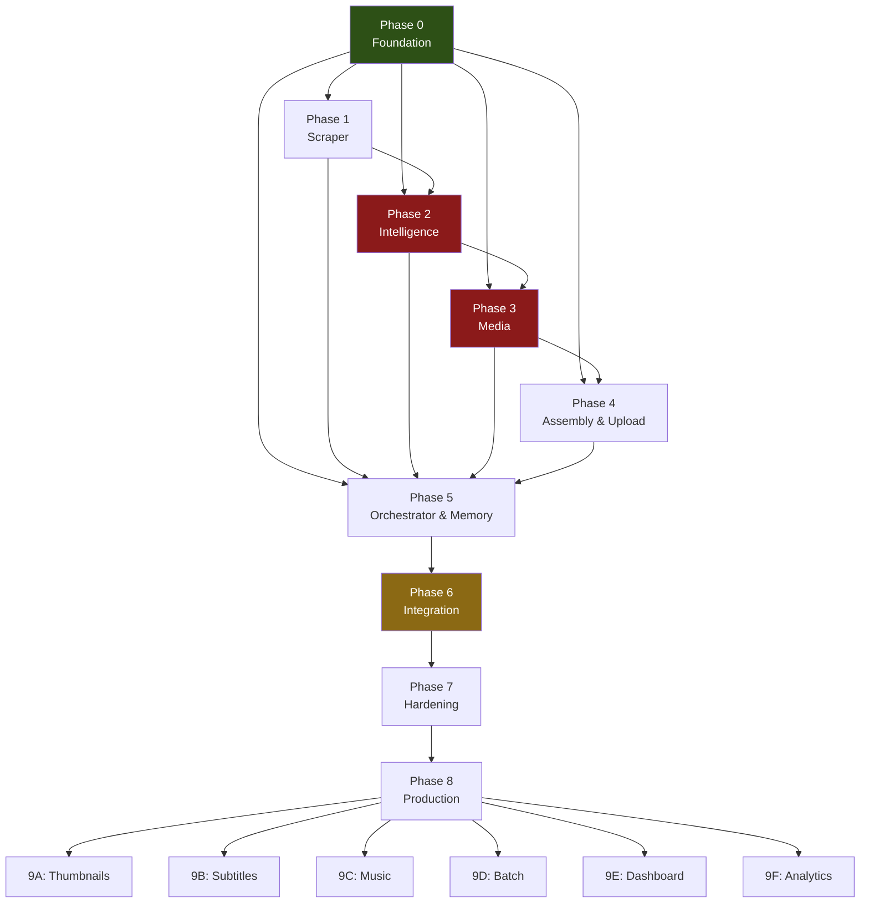

# 05_Project_Roadmap.md — Engineering Roadmap

**Author:** Principal Software Architect  
**Target System:** Automated DSA Educational YouTube Video Pipeline  
**Target Environment:** Intel Core Ultra 7 155H · Ubuntu 25.10 LTS · Python 3.12 · Intel Arc GPU  
**Document Version:** 1.0.0  
**Last Updated:** July 2026  
**Status:** Canonical — All implementation phases MUST follow this roadmap.

---

## Table of Contents

1. [Roadmap Overview](#1-roadmap-overview)
2. [Phase 0 — Foundation & Infrastructure](#2-phase-0--foundation--infrastructure)
3. [Phase 1 — Data Acquisition Pipeline](#3-phase-1--data-acquisition-pipeline)
4. [Phase 2 — Intelligence Layer](#4-phase-2--intelligence-layer)
5. [Phase 3 — Media Generation Pipeline](#5-phase-3--media-generation-pipeline)
6. [Phase 4 — Assembly & Distribution](#6-phase-4--assembly--distribution)
7. [Phase 5 — Orchestration & Memory](#7-phase-5--orchestration--memory)
8. [Phase 6 — End-to-End Integration](#8-phase-6--end-to-end-integration)
9. [Phase 7 — Hardening & Optimization](#9-phase-7--hardening--optimization)
10. [Phase 8 — Production Release](#10-phase-8--production-release)
11. [Phase 9 — Enhancements (Post-Launch)](#11-phase-9--enhancements-post-launch)
12. [Phase Dependency Map](#12-phase-dependency-map)
13. [Critical Path](#13-critical-path)
14. [Risk Register](#14-risk-register)
15. [Milestone Summary](#15-milestone-summary)

---

## 1. Roadmap Overview

### 1.1 Strategy

The project is split into **10 phases** (Phase 0 through Phase 9), each building on the previous. The ordering follows two governing principles:

1. **Dependency order.** No phase begins until the artifacts it depends on are delivered and accepted.
2. **Risk-first.** The highest-risk, most uncertain modules (Voice synthesis on NPU, Manim animation) are scheduled before low-risk integration work so that failures surface early.

### 1.2 Phase Map

```
Phase 0    Foundation & Infrastructure         ████░░░░░░░░░░░░░░░░
Phase 1    Data Acquisition Pipeline           ░░░░████░░░░░░░░░░░░
Phase 2    Intelligence Layer                  ░░░░░░░░████░░░░░░░░
Phase 3    Media Generation Pipeline           ░░░░░░░░░░░░████░░░░
Phase 4    Assembly & Distribution             ░░░░░░░░░░░░░░░░██░░
Phase 5    Orchestration & Memory              ░░░░░░░░░░░░░░░░░██░
Phase 6    End-to-End Integration              ░░░░░░░░░░░░░░░░░░██
Phase 7    Hardening & Optimization            ░░░░░░░░░░░░░░░░░░░█
Phase 8    Production Release                  ░░░░░░░░░░░░░░░░░░░█
Phase 9    Enhancements (Post-Launch)          ░░░░░░░░░░░░░░░░░░░░
```

### 1.3 Module-to-Phase Mapping

| Module | Package | Phase |
|---|---|---|
| Domain Models | `src/models/` | Phase 0 |
| Shared Infrastructure | `src/core/` | Phase 0 |
| Problem Scraper | `src/scraper/` | Phase 1 |
| Tag Explorer | `src/tags/` | Phase 2 |
| RAG Knowledge Engine | `src/rag/` | Phase 2 |
| Script Generator | `src/script/` | Phase 2 |
| Voice Generation | `src/voice/` | Phase 3 |
| Manim Animation Engine | `src/animation/` | Phase 3 |
| Video Assembly | `src/assembly/` | Phase 4 |
| YouTube Upload | `src/youtube/` | Phase 4 |
| Pipeline Orchestrator | `src/orchestrator/` | Phase 5 |
| Memory System | `src/memory/` | Phase 5 |

---

## 2. Phase 0 — Foundation & Infrastructure

### Objective

Establish the complete project skeleton: package structure, domain models, shared infrastructure, configuration system, logging, error hierarchy, and development tooling. After this phase, every subsequent module has a stable foundation to build on.

### Deliverables

| # | Deliverable | Location |
|---|---|---|
| 0.1 | Project skeleton with all directories from `04_Folder_Structure.md` | Project root |
| 0.2 | `pyproject.toml` with all dependencies and tool configuration | Project root |
| 0.3 | All enum definitions | `src/models/enums.py` |
| 0.4 | All inter-module dataclass contracts (frozen, typed, validated) | `src/models/*.py` |
| 0.5 | All Protocol interface definitions | `src/models/protocols.py` |
| 0.6 | Complete exception hierarchy | `src/core/exceptions.py` |
| 0.7 | Configuration loader with YAML + .env + defaults | `src/core/config.py` |
| 0.8 | Structured logging setup (structlog, console + file) | `src/core/logger.py` |
| 0.9 | JSON serialization/deserialization for all dataclasses | `src/core/serialization.py` |
| 0.10 | File-based cache manager | `src/core/cache.py` |
| 0.11 | Retry decorator with exponential backoff | `src/core/retry.py` |
| 0.12 | Path resolution utilities | `src/core/paths.py` |
| 0.13 | `config/pipeline.yaml` with all default values | `config/pipeline.yaml` |
| 0.14 | `.env.example` template | Project root |
| 0.15 | `.gitignore` per specification | Project root |
| 0.16 | Developer scripts (`setup.sh`, `lint.sh`, `test.sh`, `clean.sh`) | `scripts/` |
| 0.17 | Unit tests for all `src/models/` and `src/core/` modules | `tests/test_models/`, `tests/test_core/` |
| 0.18 | Global test fixtures and factories | `tests/conftest.py` |

### Dependencies

None. Phase 0 is the root of the dependency graph.

### Acceptance Criteria

- [ ] `python -m src --help` prints usage without error.
- [ ] `load_config()` returns a valid `PipelineConfig` with defaults when no YAML exists.
- [ ] `load_config()` merges `.env` values into config correctly.
- [ ] Every dataclass in `src/models/` round-trips through `serialize()` → `deserialize()` without data loss.
- [ ] Every enum serializes to its `.value` string and deserializes back.
- [ ] `@retry` retries exactly `max_attempts` times with correct backoff delays.
- [ ] `FileCache.get()` returns `None` on cache miss, valid object on cache hit.
- [ ] `get_logger()` produces structured JSON log entries with `pipeline_run_id` binding.
- [ ] Every custom exception in the hierarchy is instantiable and has a meaningful default message.
- [ ] `mypy --strict` passes with zero errors across all Phase 0 files.
- [ ] `flake8` passes with zero warnings across all Phase 0 files.
- [ ] `pytest` passes with 100% coverage on `src/models/` and ≥95% on `src/core/`.

### Testing

| Test Type | Scope | Key Scenarios |
|---|---|---|
| Unit | `src/models/` | Dataclass creation, frozen immutability, `__post_init__` validation, enum value access |
| Unit | `src/core/config.py` | Missing YAML, missing `.env`, invalid values, precedence ordering |
| Unit | `src/core/serialization.py` | Round-trip for every dataclass, datetime ISO format, Path POSIX format, nested objects |
| Unit | `src/core/cache.py` | Cache miss, cache hit, invalidation, invalidate_all |
| Unit | `src/core/retry.py` | Success on first try, success on retry, all retries exhausted, non-retryable exception passthrough |
| Unit | `src/core/exceptions.py` | Exception chaining, message formatting, hierarchy `isinstance` checks |
| Unit | `src/core/paths.py` | Relative path resolution, ensure_dir creates directories, PROJECT_ROOT discovery |

### Estimated Complexity

| Aspect | Rating |
|---|---|
| Technical difficulty | Low-Medium |
| Scope | Large (many files, but individually simple) |
| Uncertainty | Very Low |
| External dependencies | None |

### Risk Level

🟢 **Low**

The deliverables are well-defined data structures, utility functions, and configuration plumbing. No external API calls, no AI models, no media processing. The only risk is scope creep — defining too many or too few model fields that need revision later.

**Mitigation:** Model fields are derived directly from the architecture specification. Stick to the contracts defined in `02_Project_Architecture.md`, Section 3.

### Output Artifacts

```
src/models/__init__.py, enums.py, problem.py, tags.py, rag.py,
         script.py, voice.py, animation.py, assembly.py,
         youtube.py, memory.py, protocols.py
src/core/__init__.py, config.py, logger.py, serialization.py,
        cache.py, exceptions.py, retry.py, paths.py
src/__init__.py, __main__.py (skeleton)
config/pipeline.yaml
tests/test_models/**, tests/test_core/**
tests/conftest.py
pyproject.toml, .env.example, .gitignore
scripts/setup.sh, lint.sh, test.sh, clean.sh
```

### Review Checklist

- [ ] Every dataclass field matches the architecture specification exactly.
- [ ] Every Protocol method signature matches the architecture specification.
- [ ] Exception hierarchy matches `02_Project_Architecture.md`, Section 10.1.
- [ ] All config defaults match `02_Project_Architecture.md`, Section 8.2.
- [ ] No pipeline module logic exists in Phase 0 deliverables.
- [ ] `src/models/` has zero imports from `src/core/` or pipeline modules.
- [ ] `src/core/` has zero imports from pipeline modules.
- [ ] Naming conventions follow `03_Project_Standards.md`, Section 2.
- [ ] All files have module docstrings.
- [ ] All classes and public methods have Google-style docstrings.
- [ ] No TODO, FIXME, or placeholder comments.

---

## 3. Phase 1 — Data Acquisition Pipeline

### Objective

Build the LeetCode Problem Scraper module — the system's data entry point. After this phase, the pipeline can fetch any LeetCode problem's metadata, description, constraints, examples, and the user's accepted C++ solution.

### Deliverables

| # | Deliverable | Location |
|---|---|---|
| 1.1 | LeetCode GraphQL HTTP client with session cookie auth | `src/scraper/client.py` |
| 1.2 | GraphQL response parser (JSON → `ScrapedProblem`) | `src/scraper/parser.py` |
| 1.3 | `LeetCodeScraper` implementing `ScraperProtocol` | `src/scraper/scraper.py` |
| 1.4 | Rate limiting (configurable delay between requests) | Within `client.py` |
| 1.5 | HTML-to-Markdown description cleaner | Within `parser.py` |
| 1.6 | File-based caching (skip scraping if `data/scraped/{slug}.json` exists) | Within `scraper.py` |
| 1.7 | Complete unit test suite with mocked HTTP responses | `tests/test_scraper/` |
| 1.8 | One verified integration test against live LeetCode (marked `@pytest.mark.slow`) | `tests/test_scraper/` |

### Dependencies

| Dependency | Source Phase | Artifact |
|---|---|---|
| `ScrapedProblem` dataclass | Phase 0 | `src/models/problem.py` |
| `ScraperProtocol` | Phase 0 | `src/models/protocols.py` |
| `ScraperConfig` | Phase 0 | `src/core/config.py` |
| `ScraperError` hierarchy | Phase 0 | `src/core/exceptions.py` |
| `@retry` decorator | Phase 0 | `src/core/retry.py` |
| `FileCache` | Phase 0 | `src/core/cache.py` |
| `serialize()` / `deserialize()` | Phase 0 | `src/core/serialization.py` |

### Acceptance Criteria

- [ ] `scraper.scrape("two-sum")` returns a valid `ScrapedProblem` with all fields populated.
- [ ] `scraper.scrape("two-sum")` a second time returns from cache without making an HTTP request.
- [ ] `scraper.scrape("nonexistent-slug-xyz")` raises `ProblemNotFoundError` with actionable message.
- [ ] Expired `LEETCODE_SESSION` raises `AuthenticationError` with instructions to update `.env`.
- [ ] Rate limiting waits at least `rate_limit_seconds` between consecutive requests.
- [ ] Response parsing correctly extracts: title, number, difficulty, description (Markdown), constraints (list), examples (structured), tags, accepted C++ code.
- [ ] Retry logic retries on `429 Too Many Requests` up to `max_retries` times.
- [ ] All scraped data persists to `data/scraped/{slug}.json`.
- [ ] `mypy --strict` passes. `flake8` passes. Coverage ≥90%.

### Testing

| Test Type | Scope | Key Scenarios |
|---|---|---|
| Unit | `client.py` | Successful fetch, 401 auth failure, 403 forbidden, 404 not found, 429 rate limit, network timeout, malformed JSON response |
| Unit | `parser.py` | Valid GraphQL response parsing, missing fields, HTML entity cleanup, multi-language submission extraction, empty examples list |
| Unit | `scraper.py` | Cache hit path, cache miss → fetch path, force regenerate bypasses cache, slug validation (invalid characters rejected) |
| Integration | `scraper.py` | Live scrape of `two-sum` against real LeetCode API (marked slow, requires valid session cookie) |

### Estimated Complexity

| Aspect | Rating |
|---|---|
| Technical difficulty | Medium |
| Scope | Moderate (3 files) |
| Uncertainty | Medium (LeetCode GraphQL schema is undocumented and may change) |
| External dependencies | LeetCode API (unversioned, undocumented) |

### Risk Level

🟡 **Medium**

LeetCode's GraphQL API is undocumented. The schema is reverse-engineered from browser DevTools. Risks:
- Schema changes without notice.
- Rate limiting or IP blocks for automated scraping.
- Session cookie expiration during batch runs.

**Mitigation:**
- Cache every successful scrape to `data/scraped/` so re-scraping is rarely needed.
- Generous default rate limiting (2 seconds between requests).
- Clear error messages guiding the user to refresh the session cookie.
- Integration test monitors schema stability.

### Output Artifacts

```
src/scraper/__init__.py, scraper.py, client.py, parser.py
tests/test_scraper/__init__.py, conftest.py, test_scraper.py,
                   test_client.py, test_parser.py
data/scraped/two-sum.json  (verification artifact)
```

### Review Checklist

- [ ] `LeetCodeScraper` implements `ScraperProtocol` exactly (method signature match).
- [ ] No import from any other pipeline module (`src/tags/`, `src/rag/`, etc.).
- [ ] All HTTP calls go through `LeetCodeClient`, not directly from `scraper.py`.
- [ ] All GraphQL response parsing is in `parser.py`, not in `client.py` or `scraper.py`.
- [ ] Session cookie is received via `ScraperConfig`, not read from `.env` directly.
- [ ] Every exception raised is from `src/core/exceptions.py` hierarchy, chained with `from`.
- [ ] No hardcoded magic strings (GraphQL URL, query bodies are constants or config).
- [ ] Rate limiting delay is configurable, not hardcoded.

---

## 4. Phase 2 — Intelligence Layer

### Objective

Build the three modules that transform raw problem data into an educational video script: Tag Explorer, RAG Knowledge Engine, and Script Generator. After this phase, the pipeline can take any scraped problem and produce a complete, narration-ready 10-section video script.

### Deliverables

| # | Deliverable | Location |
|---|---|---|
| **Tag Explorer** | | |
| 2.1 | `GeminiTagExplorer` implementing `TagExplorerProtocol` | `src/tags/explorer.py` |
| 2.2 | Pattern family mapping constants | `src/tags/patterns.py` |
| 2.3 | Unit tests for tag exploration | `tests/test_tags/` |
| **RAG Knowledge Engine** | | |
| 2.4 | Topic-aware document chunker | `src/rag/chunker.py` |
| 2.5 | Gemini embedding wrapper with batching | `src/rag/embedder.py` |
| 2.6 | Knowledge base indexer (file discovery → chunk → embed → ChromaDB upsert) | `src/rag/indexer.py` |
| 2.7 | `ChromaRAGEngine` implementing `RAGEngineProtocol` | `src/rag/engine.py` |
| 2.8 | Initial knowledge base documents (minimum 5 topic files) | `data/knowledge_base/` |
| 2.9 | Unit tests for RAG subsystem | `tests/test_rag/` |
| **Script Generator** | | |
| 2.10 | Prompt templates for 10-section video script generation | `src/script/prompts.py` |
| 2.11 | JSON schema validator for generated scripts | `src/script/validator.py` |
| 2.12 | `GeminiScriptGenerator` implementing `ScriptGeneratorProtocol` | `src/script/generator.py` |
| 2.13 | Unit tests for script generation | `tests/test_script/` |
| **Integration** | | |
| 2.14 | Integration test: Scraper → Tags → RAG → Script for `two-sum` | `tests/test_script/` |

### Dependencies

| Dependency | Source Phase | Artifact |
|---|---|---|
| `ScrapedProblem` (populated, verified) | Phase 1 | `data/scraped/two-sum.json` |
| All dataclass contracts (`TagKnowledge`, `RAGContext`, `VideoScript`, etc.) | Phase 0 | `src/models/` |
| All Protocol interfaces | Phase 0 | `src/models/protocols.py` |
| Sub-config dataclasses (`TagsConfig`, `RAGConfig`, `ScriptConfig`) | Phase 0 | `src/core/config.py` |
| Exception hierarchy | Phase 0 | `src/core/exceptions.py` |
| Cache, serialization, logging | Phase 0 | `src/core/` |

### Acceptance Criteria

**Tag Explorer:**
- [ ] `explorer.explore(scraped_problem)` returns a valid `TagKnowledge` with `primary_pattern`, `pattern_family`, `prerequisites`, `related_problems`, and `animation_style` populated.
- [ ] Results are cached to `data/tags/{slug}_tags.json`.
- [ ] Gemini API failure raises `TagExplorationError` with actionable message.

**RAG Engine:**
- [ ] `engine.index_knowledge_base()` processes all Markdown files in `data/knowledge_base/`, returns chunk count.
- [ ] ChromaDB collection persists to `data/vector_store/chroma/` across process restarts.
- [ ] `engine.retrieve(problem, tags)` returns `RAGContext` with ≥1 relevant chunk for array/hash problems.
- [ ] Retrieval completes in under 3 seconds for indexed knowledge base.
- [ ] Re-indexing is idempotent (running twice produces the same vector store state).

**Script Generator:**
- [ ] `generator.generate(problem, tags, rag_context)` returns a `VideoScript` with exactly 10 sections.
- [ ] All 10 `ScriptSection` objects have non-empty `narration`, valid `section_type`, and `visual_params`.
- [ ] `SEOMetadata` contains `youtube_title`, `youtube_description`, `youtube_tags`, and `chapter_timestamps`.
- [ ] Generated script validates against the JSON schema with zero errors.
- [ ] Narration text reads naturally when spoken aloud (subjective review required).
- [ ] Script is cached to `data/scripts/{slug}_script.json`.

**Integration:**
- [ ] Full chain (Scraper → Tags → RAG → Script) executes end-to-end for `two-sum` without error.
- [ ] `mypy --strict` passes. `flake8` passes. Coverage ≥90% per module.

### Testing

| Test Type | Scope | Key Scenarios |
|---|---|---|
| Unit | `explorer.py` | Valid tag enrichment, unknown tag handling, Gemini API timeout, cache hit bypass |
| Unit | `chunker.py` | Markdown heading boundary detection, chunk size limits, overlap correctness, empty document, document with no headings |
| Unit | `embedder.py` | Single text embedding, batch embedding, API rate limit handling, empty input |
| Unit | `indexer.py` | File discovery, incremental indexing, missing knowledge_base directory |
| Unit | `engine.py` | Retrieval with results, retrieval with no results, index not built, composite query construction |
| Unit | `prompts.py` | Prompt template rendering with all fields, missing optional fields |
| Unit | `validator.py` | Valid script passes, missing section fails, wrong section count fails, empty narration fails |
| Unit | `generator.py` | Successful generation, Gemini content filter, malformed JSON response, cache hit |
| Integration | Full chain | Scraper output → Tags → RAG → Script for `two-sum` produces valid `VideoScript` |

### Estimated Complexity

| Aspect | Rating |
|---|---|
| Technical difficulty | High |
| Scope | Large (3 modules, ~12 files) |
| Uncertainty | High (LLM output quality is non-deterministic; RAG retrieval quality depends on knowledge base content) |
| External dependencies | Gemini API (embeddings + generation), ChromaDB |

### Risk Level

🔴 **High**

This phase contains the most uncertain components:
- **LLM output quality** — Gemini may produce scripts that don't match the JSON schema, contain hallucinated code, or have poor narration quality.
- **RAG retrieval relevance** — Without a substantial knowledge base, retrieval may return low-quality or irrelevant chunks.
- **Prompt engineering iteration** — Prompt templates may require significant tuning.

**Mitigation:**
- JSON schema validation catches structural errors in LLM output immediately.
- Script validator rejects and triggers regeneration for malformed scripts.
- Start with 5 high-quality knowledge base documents covering the most common DSA patterns (arrays, linked lists, trees, hash maps, two pointers).
- Log the full prompt and response for every Gemini call to enable rapid debugging.
- Include temperature and model parameters in config for easy tuning.

### Output Artifacts

```
src/tags/__init__.py, explorer.py, patterns.py
src/rag/__init__.py, engine.py, chunker.py, embedder.py, indexer.py
src/script/__init__.py, generator.py, prompts.py, validator.py
data/knowledge_base/arrays.md, linked_lists.md, trees.md,
                    hashing.md, two_pointers.md
tests/test_tags/**, tests/test_rag/**, tests/test_script/**
data/tags/two-sum_tags.json         (verification artifact)
data/rag/two-sum_context.json       (verification artifact)
data/scripts/two-sum_script.json    (verification artifact)
```

### Review Checklist

- [ ] Each module implements its Protocol exactly.
- [ ] No cross-module imports between Tags, RAG, and Script packages.
- [ ] Gemini API key is received via config injection, not read from environment.
- [ ] ChromaDB persistence directory is configurable, not hardcoded.
- [ ] Prompt templates are in `prompts.py`, not embedded in `generator.py`.
- [ ] JSON schema validation is in `validator.py`, not in `generator.py`.
- [ ] Knowledge base documents use proper heading structure for chunker compatibility.
- [ ] All Gemini API calls have explicit timeouts.
- [ ] All Gemini API calls are logged with timing information.
- [ ] Error messages for API failures include the model name, endpoint, and HTTP status.

---

## 5. Phase 3 — Media Generation Pipeline

### Objective

Build the two media-producing modules: Voice Generation (Kokoro-82M via OpenVINO) and Manim Animation Engine. After this phase, the pipeline can convert a video script into synchronized audio and video clips. This is the highest-risk phase — both modules involve complex local inference and rendering.

### Deliverables

| # | Deliverable | Location |
|---|---|---|
| **Voice Generation** | | |
| 3.1 | `KokoroVoiceSynthesizer` implementing `VoiceSynthesizerProtocol` | `src/voice/synthesizer.py` |
| 3.2 | OpenVINO model loading and NPU/CPU device selection | Within `synthesizer.py` |
| 3.3 | Speaker embedding extraction from `voice_samples/reference.wav` | Within `synthesizer.py` |
| 3.4 | Per-section WAV export at 24kHz | Within `synthesizer.py` |
| 3.5 | Timing manifest generation (`manifest.json`) | Within `synthesizer.py` |
| 3.6 | Audio utilities (sample rate validation, silence trimming, duration calc) | `src/voice/audio_utils.py` |
| 3.7 | Unit tests with mocked model inference | `tests/test_voice/` |
| **Manim Animation Engine** | | |
| 3.8 | `DSABaseScene` — dark-themed base scene class | `src/animation/scenes/base_scene.py` |
| 3.9 | Visual theme constants (colors, fonts, sizes) | `src/animation/theme.py` |
| 3.10 | `ArrayScene` — array traversal and pointer animations | `src/animation/scenes/array_scene.py` |
| 3.11 | `CodeScene` — syntax-highlighted code walkthrough | `src/animation/scenes/code_scene.py` |
| 3.12 | `ComplexityScene` — Big-O comparison charts | `src/animation/scenes/complexity_scene.py` |
| 3.13 | `ManimAnimationRenderer` implementing `AnimationRendererProtocol` | `src/animation/renderer.py` |
| 3.14 | Scene registry mapping `AnimationStyle` → scene class | `src/animation/scenes/__init__.py` |
| 3.15 | Duration synchronization (animation length matches audio length) | Within `renderer.py` |
| 3.16 | Unit tests for scenes and renderer | `tests/test_animation/` |
| **Integration** | | |
| 3.17 | Verification: `two-sum` script → 10 WAV files + 10 MP4 clips | Manual verification |

### Dependencies

| Dependency | Source Phase | Artifact |
|---|---|---|
| `VideoScript` (populated, validated) | Phase 2 | `data/scripts/two-sum_script.json` |
| `VoiceResult`, `SectionAudio`, `AnimationResult`, `SectionClip` | Phase 0 | `src/models/` |
| `VoiceConfig`, `AnimationConfig` | Phase 0 | `src/core/config.py` |
| `VoiceSynthesisError`, `AnimationRenderError` hierarchy | Phase 0 | `src/core/exceptions.py` |
| OpenVINO model files | External setup | `models/kokoro-82m-openvino/` |
| Manim Community library | External dependency | `pip install manim` |
| `reference.wav` voice sample | Pre-existing | `voice_samples/reference.wav` |

### Acceptance Criteria

**Voice Generation:**
- [ ] `synthesizer.synthesize(script)` produces 10 WAV files in `data/voice/{slug}/`.
- [ ] Each WAV file is valid audio at 24kHz sample rate, mono channel.
- [ ] Audio is intelligible, natural-sounding speech (subjective human review).
- [ ] Speaker voice matches the reference audio characteristics.
- [ ] `manifest.json` records accurate duration for each section.
- [ ] Total voice synthesis completes in under 3 minutes on Intel Core Ultra 7 155H.
- [ ] `ModelLoadError` raised with clear message if model files are missing.
- [ ] Synthesis falls back to CPU if NPU is unavailable.

**Manim Animation:**
- [ ] `renderer.render(script, voice)` produces 10 MP4 files in `data/animation/{slug}/`.
- [ ] Each MP4 is 1920×1080 at 30fps with dark background.
- [ ] Animation duration of each clip matches the corresponding audio duration (±0.5 seconds tolerance).
- [ ] `ArrayScene` correctly renders array elements, pointer arrows, and highlight animations.
- [ ] `CodeScene` correctly renders syntax-highlighted C++ code with line-by-line execution pointer.
- [ ] `ComplexityScene` correctly renders a Big-O comparison chart.
- [ ] All scenes use consistent visual theme (colors, fonts, spacing).
- [ ] Total rendering completes in under 5 minutes on Intel Core Ultra 7 155H.
- [ ] Invalid `visual_params` raises `SceneConfigError` with the offending parameter name.

### Testing

| Test Type | Scope | Key Scenarios |
|---|---|---|
| Unit | `synthesizer.py` | Model load success (mocked), synthesis of single section (mocked inference), manifest generation accuracy, missing model path error |
| Unit | `audio_utils.py` | Duration calculation correctness, sample rate validation, silence trimming preserves speech |
| Unit | `base_scene.py` | Scene creates without error, dark background applied, text styling consistent |
| Unit | `array_scene.py` | Array elements render, pointer positions correct, highlight colors match theme |
| Unit | `code_scene.py` | Code text renders, line highlighting works, syntax colors applied |
| Unit | `complexity_scene.py` | Bar chart renders with correct labels and heights |
| Unit | `renderer.py` | Scene selection from registry, duration synchronization logic, missing scene type error |
| Integration | Voice + Animation | Script → synthesize → render for single section produces matching-duration audio and video |

### Estimated Complexity

| Aspect | Rating |
|---|---|
| Technical difficulty | **Very High** |
| Scope | Large (2 modules, ~15 files) |
| Uncertainty | **Very High** (OpenVINO NPU compatibility, Manim scene design, voice quality) |
| External dependencies | OpenVINO runtime, Kokoro-82M model, Manim Community, FFmpeg (for Manim rendering) |

### Risk Level

🔴 **Critical**

This is the highest-risk phase in the entire project.

| Risk | Impact | Likelihood | Mitigation |
|---|---|---|---|
| OpenVINO NPU support for Kokoro-82M is incomplete or buggy | Voice module fails | Medium | Fall back to CPU execution; benchmark both paths |
| Kokoro-82M voice quality is insufficient | Videos sound robotic | Medium | Test with multiple reference audio samples; tune speed/pitch parameters |
| Manim scene design requires significant iteration | Animation quality is poor | High | Start with 3 essential scenes (Array, Code, Complexity); defer remaining scenes |
| Animation-audio duration synchronization is imprecise | Audio and visuals are misaligned | Medium | Implement a padding/trimming layer in the renderer |
| Manim rendering is slower than expected | Pipeline exceeds time budget | Low | Use `medium_quality` preset for development; `production_quality` only for final renders |

### Output Artifacts

```
src/voice/__init__.py, synthesizer.py, audio_utils.py
src/animation/__init__.py, renderer.py, theme.py
src/animation/scenes/__init__.py, base_scene.py, array_scene.py,
                     code_scene.py, complexity_scene.py
tests/test_voice/**, tests/test_animation/**
data/voice/two-sum/*.wav, manifest.json     (verification artifacts)
data/animation/two-sum/*.mp4                (verification artifacts)
```

### Review Checklist

- [ ] Each module implements its Protocol exactly.
- [ ] Voice synthesizer receives model path from `VoiceConfig`, not hardcoded.
- [ ] Voice synthesizer handles CPU fallback when NPU is unavailable.
- [ ] Manim scenes inherit from `DSABaseScene` for consistent theming.
- [ ] All color values come from `theme.py`, not hardcoded in scene files.
- [ ] Scene registry in `scenes/__init__.py` maps every `AnimationStyle` to a scene class.
- [ ] Duration synchronization is handled in the renderer, not in individual scenes.
- [ ] Each Manim scene renders in a subprocess to isolate memory.
- [ ] No cross-module imports between `src/voice/` and `src/animation/`.
- [ ] Audio and video artifacts are written to the correct `data/` subdirectories.

---

## 6. Phase 4 — Assembly & Distribution

### Objective

Build the Video Assembly module (FFmpeg) and YouTube Upload module. After this phase, the pipeline can produce a final YouTube-ready video and upload it with full metadata.

### Deliverables

| # | Deliverable | Location |
|---|---|---|
| **Video Assembly** | | |
| 4.1 | FFmpeg command builders (mux, concat, normalize, thumbnail) | `src/assembly/ffmpeg_commands.py` |
| 4.2 | `FFmpegVideoAssembler` implementing `VideoAssemblerProtocol` | `src/assembly/assembler.py` |
| 4.3 | Audio normalization to -14 LUFS | Within `ffmpeg_commands.py` |
| 4.4 | Fade-in/fade-out transitions | Within `ffmpeg_commands.py` |
| 4.5 | Thumbnail extraction from key frame | Within `assembler.py` |
| 4.6 | Unit tests for assembly | `tests/test_assembly/` |
| **YouTube Upload** | | |
| 4.7 | OAuth 2.0 token manager (auth flow, persistence, refresh) | `src/youtube/auth.py` |
| 4.8 | `YouTubeAPIUploader` implementing `YouTubeUploaderProtocol` | `src/youtube/uploader.py` |
| 4.9 | Resumable upload with progress tracking | Within `uploader.py` |
| 4.10 | Metadata setting (title, description, tags, category, privacy) | Within `uploader.py` |
| 4.11 | Thumbnail upload | Within `uploader.py` |
| 4.12 | Unit tests for YouTube upload | `tests/test_youtube/` |

### Dependencies

| Dependency | Source Phase | Artifact |
|---|---|---|
| `VoiceResult` (populated WAV files) | Phase 3 | `data/voice/two-sum/` |
| `AnimationResult` (populated MP4 clips) | Phase 3 | `data/animation/two-sum/` |
| `VideoScript` with `SEOMetadata` | Phase 2 | `data/scripts/two-sum_script.json` |
| `AssembledVideo`, `UploadResult` dataclasses | Phase 0 | `src/models/` |
| `AssemblyConfig`, `YouTubeConfig` | Phase 0 | `src/core/config.py` |
| FFmpeg system binary | External prerequisite | System PATH |
| `config/client_secrets.json` | Pre-existing | `config/` |

### Acceptance Criteria

**Video Assembly:**
- [ ] `assembler.assemble(voice, animation, script)` produces `data/output/{slug}/final.mp4`.
- [ ] Final video plays correctly in VLC/mpv with synchronized audio and video.
- [ ] Audio is normalized to approximately -14 LUFS.
- [ ] Video has brief fade-in at start and fade-out at end.
- [ ] Thumbnail is extracted and saved to `data/output/{slug}/thumbnail.png`.
- [ ] Assembly fails gracefully with `FFmpegNotFoundError` if FFmpeg is not installed.
- [ ] Assembly fails gracefully with `MuxingError` if audio/video files are corrupt.
- [ ] Total assembly completes in under 1 minute.

**YouTube Upload:**
- [ ] `uploader.upload(video, metadata)` successfully uploads a video in `private` mode.
- [ ] Video title, description, tags, and category are set correctly on YouTube.
- [ ] Thumbnail is uploaded and applied to the video.
- [ ] `UploadResult` contains the correct YouTube video ID and URL.
- [ ] OAuth token is persisted to `config/youtube_token.json` and reused across runs.
- [ ] Expired token triggers automatic refresh without user intervention.
- [ ] `QuotaExceededError` raised when daily API quota is exhausted.
- [ ] Upload result persisted to `data/uploads/{slug}_upload.json`.

### Testing

| Test Type | Scope | Key Scenarios |
|---|---|---|
| Unit | `ffmpeg_commands.py` | Mux command correctness, concat filter graph, normalization filter, thumbnail extraction command, invalid input paths |
| Unit | `assembler.py` | Successful assembly (mocked subprocess), FFmpeg not found, mismatched section counts (audio vs. video), corrupt file handling |
| Unit | `auth.py` | Token load from file, token refresh, expired token detection, missing client_secrets, first-time auth flow |
| Unit | `uploader.py` | Successful upload (mocked API), resumable upload continuation, quota exceeded, network failure during upload, metadata validation |
| Integration | Assembly | Real FFmpeg execution with small test audio/video files (1-second duration) |

### Estimated Complexity

| Aspect | Rating |
|---|---|
| Technical difficulty | Medium |
| Scope | Moderate (2 modules, ~6 files) |
| Uncertainty | Low (FFmpeg) / Medium (YouTube API quota, OAuth flow) |
| External dependencies | FFmpeg (stable), YouTube Data API v3 (well-documented), Google OAuth |

### Risk Level

🟡 **Medium**

| Risk | Impact | Likelihood | Mitigation |
|---|---|---|---|
| YouTube API daily quota (10,000 units) limits uploads | Cannot upload more than ~5 videos/day | Low (1-3 videos/day target) | Check quota before upload; queue if exceeded |
| OAuth first-time authorization requires browser interaction | Not fully automated on first run | Certain (one-time) | Document the flow; auto-open browser for consent |
| FFmpeg filter graph errors for edge cases | Assembly produces corrupt video | Low | Validate with `ffprobe` after assembly |

### Output Artifacts

```
src/assembly/__init__.py, assembler.py, ffmpeg_commands.py
src/youtube/__init__.py, uploader.py, auth.py
tests/test_assembly/**, tests/test_youtube/**
data/output/two-sum/final.mp4, thumbnail.png  (verification artifacts)
data/uploads/two-sum_upload.json              (verification artifact)
```

### Review Checklist

- [ ] Each module implements its Protocol exactly.
- [ ] FFmpeg is called via `subprocess.run` with argument list, never `shell=True`.
- [ ] FFmpeg command strings are constructed in `ffmpeg_commands.py`, not in `assembler.py`.
- [ ] YouTube OAuth credentials path comes from `YouTubeConfig`, not hardcoded.
- [ ] OAuth tokens are stored with restricted file permissions.
- [ ] No API keys or tokens are logged.
- [ ] Upload is resumable (handles network interruption mid-upload).
- [ ] Privacy status defaults to `private` (configurable).
- [ ] No cross-module imports between `src/assembly/` and `src/youtube/`.

---

## 7. Phase 5 — Orchestration & Memory

### Objective

Build the Pipeline Orchestrator (the central coordinator) and the Memory System. After this phase, the pipeline can execute end-to-end from a single CLI command, resume from checkpoints after a crash, and maintain a persistent record of all generated videos.

### Deliverables

| # | Deliverable | Location |
|---|---|---|
| **Orchestrator** | | |
| 5.1 | `PipelineOrchestrator` — sequential module dispatch | `src/orchestrator/pipeline.py` |
| 5.2 | `CheckpointManager` — save/load/detect/resume | `src/orchestrator/checkpoint.py` |
| 5.3 | CLI argument parsing in `__main__.py` (slug, `--force-regenerate`, `--skip-upload`) | `src/__main__.py` |
| 5.4 | Composition root — wire all concrete implementations | `src/__main__.py` |
| 5.5 | Non-critical module failure handling (Tags, RAG, YouTube, Memory) | Within `pipeline.py` |
| 5.6 | Timing breakdown report (per-module and total duration) | Within `pipeline.py` |
| 5.7 | Unit tests for orchestrator and checkpoint manager | `tests/test_orchestrator/` |
| **Memory System** | | |
| 5.8 | `JSONMemoryStore` implementing `MemoryStoreProtocol` | `src/memory/store.py` |
| 5.9 | Deduplication check (`has_been_generated`) | Within `store.py` |
| 5.10 | Query methods (`get_record`, `get_all_tags`, `get_problems_by_tag`, `get_failed_runs`) | Within `store.py` |
| 5.11 | Unit tests for memory store | `tests/test_memory/` |

### Dependencies

| Dependency | Source Phase | Artifact |
|---|---|---|
| All 9 Protocol interfaces | Phase 0 | `src/models/protocols.py` |
| All 9 concrete module implementations | Phases 1–4 | `src/{module}/` |
| All output dataclasses | Phase 0 | `src/models/` |
| `PipelineConfig` | Phase 0 | `src/core/config.py` |
| `PipelineError` hierarchy | Phase 0 | `src/core/exceptions.py` |
| Serialization utilities | Phase 0 | `src/core/serialization.py` |

### Acceptance Criteria

**Orchestrator:**
- [ ] `python -m src two-sum` executes the full 9-module pipeline end-to-end.
- [ ] On success, pipeline reports `COMPLETED` with per-module timing.
- [ ] On non-critical module failure (Tags, RAG), pipeline continues with degraded output and reports `PARTIAL_FAILURE`.
- [ ] On critical module failure (Scraper, Script, Voice, Animation, Assembly), pipeline halts and reports `FAILED`.
- [ ] After each module, a checkpoint is written to `data/checkpoints/{slug}/`.
- [ ] Re-running the same slug resumes from the last incomplete checkpoint.
- [ ] `--force-regenerate` deletes all checkpoints and caches, then re-executes from scratch.
- [ ] `--skip-upload` skips the YouTube upload module.
- [ ] Orchestrator depends only on Protocol types, never on concrete implementations.

**Memory System:**
- [ ] `store.save(record)` persists a `MemoryRecord` to `data/memory/memory.json`.
- [ ] `store.has_been_generated("two-sum")` returns `True` after a successful save.
- [ ] `store.get_record("two-sum")` returns the saved `MemoryRecord`.
- [ ] `store.get_all_tags()` returns the union of all tags across all records.
- [ ] `store.get_failed_runs()` returns records with `status == FAILED`.
- [ ] Corrupted `memory.json` raises `CorruptedStoreError` with recovery instructions.
- [ ] Concurrent writes do not corrupt the JSON file (file locking).

### Testing

| Test Type | Scope | Key Scenarios |
|---|---|---|
| Unit | `pipeline.py` | All modules succeed, non-critical failure continues, critical failure halts, checkpoint resume skips completed modules, force regenerate bypasses checkpoints, skip upload flag |
| Unit | `checkpoint.py` | Save checkpoint, load checkpoint, detect resume point, clean up after completion, missing checkpoint directory |
| Unit | `__main__.py` | CLI argument parsing (slug, flags), help text, invalid arguments |
| Unit | `store.py` | Save and retrieve, duplicate slug update, has_been_generated true/false, tag aggregation, failed runs query, empty store, corrupt JSON |
| Integration (E2E) | Full pipeline | All fakes injected, pipeline completes, memory record saved |

### Estimated Complexity

| Aspect | Rating |
|---|---|
| Technical difficulty | Medium |
| Scope | Moderate (2 modules, ~5 files + `__main__.py` update) |
| Uncertainty | Low (orchestration is well-defined; memory is simple CRUD) |
| External dependencies | None (pure orchestration logic) |

### Risk Level

🟢 **Low**

The orchestrator and memory system are pure Python logic with no external dependencies. The design is well-specified in the architecture document. The only complexity is the checkpoint resume logic, which is testable with deterministic inputs.

### Output Artifacts

```
src/orchestrator/__init__.py, pipeline.py, checkpoint.py
src/memory/__init__.py, store.py
src/__main__.py (completed composition root)
tests/test_orchestrator/**, tests/test_memory/**
tests/test_orchestrator/test_pipeline_e2e.py
data/checkpoints/two-sum/**     (verification artifacts)
data/memory/memory.json         (verification artifact)
```

### Review Checklist

- [ ] Orchestrator imports ONLY from `src/models/` and `src/core/`. No direct import of any concrete module class.
- [ ] All 9 concrete module classes are instantiated in `src/__main__.py` and nowhere else.
- [ ] Checkpoint data is serialized via `src/core/serialization.py`.
- [ ] Non-critical vs. critical module classification matches `02_Project_Architecture.md`, Section 10.3.
- [ ] Memory store uses file locking for write safety.
- [ ] `--force-regenerate` and `--skip-upload` are implemented as config overrides, not special-cased logic.
- [ ] Pipeline run ID is generated once and propagated to all loggers.
- [ ] Timing report includes wall-clock time per module and total.

---

## 8. Phase 6 — End-to-End Integration

### Objective

Execute the complete pipeline end-to-end on a real LeetCode problem (`two-sum`) and verify that every module produces correct output. Fix all integration issues. This is a pure validation phase — no new module development.

### Deliverables

| # | Deliverable | Location |
|---|---|---|
| 6.1 | Successful end-to-end run for `two-sum` (private YouTube upload) | Verification output |
| 6.2 | Successful end-to-end run for `reorder-list` (Medium difficulty validation) | Verification output |
| 6.3 | Bug fixes for all integration issues discovered | `src/`, `tests/` |
| 6.4 | Integration test: full pipeline with real modules (marked `@pytest.mark.slow`) | `tests/test_orchestrator/` |
| 6.5 | End-to-end timing benchmark | Documentation |

### Dependencies

All of Phases 0–5 must be complete and passing.

### Acceptance Criteria

- [ ] `python -m src two-sum` runs end-to-end without error and produces a private YouTube video.
- [ ] `python -m src reorder-list` runs end-to-end without error.
- [ ] Both generated videos are watchable with synchronized audio and animation.
- [ ] YouTube metadata (title, description, tags, timestamps) is correct.
- [ ] Thumbnail is set on the YouTube video.
- [ ] Memory records are saved for both problems.
- [ ] Re-running `python -m src two-sum` (without `--force-regenerate`) resumes from cache with zero API calls.
- [ ] `python -m src two-sum --force-regenerate` re-generates everything from scratch.
- [ ] Total end-to-end time is under 15 minutes per problem.
- [ ] Zero `ERROR` or `CRITICAL` log entries during successful runs.
- [ ] All logs are structured JSON with `pipeline_run_id` correlation.

### Testing

| Test Type | Scope | Key Scenarios |
|---|---|---|
| End-to-end | Full pipeline | `two-sum` (Easy, Array + Hash Table) complete run |
| End-to-end | Full pipeline | `reorder-list` (Medium, Linked List) complete run |
| Regression | Cache/checkpoint | Second run uses cache, no API calls |
| Regression | Force regenerate | Third run with `--force-regenerate` re-executes everything |
| Visual review | Output video | Human review of audio clarity, animation quality, sync |

### Estimated Complexity

| Aspect | Rating |
|---|---|
| Technical difficulty | Low (debugging, not building) |
| Scope | Small (fixing, not creating) |
| Uncertainty | Medium (integration bugs are unpredictable) |
| External dependencies | All (full pipeline exercises every external dependency) |

### Risk Level

🟡 **Medium**

Integration always surfaces unexpected issues. Common problems:
- Data format mismatches between modules.
- Timing/synchronization drift between audio and animation.
- FFmpeg filter graph edge cases.
- Gemini API response format changes.

**Mitigation:** This phase has no new deliverables — only fixes. All module contracts are validated against real data.

### Output Artifacts

```
data/output/two-sum/final.mp4         (verified final video)
data/output/reorder-list/final.mp4    (verified final video)
Bug fix commits across src/ and tests/
```

### Review Checklist

- [ ] Both test problems (`two-sum`, `reorder-list`) produce watchable videos.
- [ ] Audio and animation are synchronized within ±0.5 second tolerance.
- [ ] YouTube upload completes without error.
- [ ] No regression in unit or integration tests.
- [ ] All bug fixes include regression tests.
- [ ] Performance is within the 15-minute time budget.

---

## 9. Phase 7 — Hardening & Optimization

### Objective

Harden the pipeline for production reliability and optimize performance. Expand test coverage, add remaining Manim scenes, improve error recovery, and optimize for the Intel Core Ultra 7 155H hardware.

### Deliverables

| # | Deliverable | Location |
|---|---|---|
| **Remaining Manim Scenes** | | |
| 7.1 | `LinkedListScene` | `src/animation/scenes/linkedlist_scene.py` |
| 7.2 | `TreeScene` | `src/animation/scenes/tree_scene.py` |
| 7.3 | `GraphScene` | `src/animation/scenes/graph_scene.py` |
| 7.4 | `HashMapScene` | `src/animation/scenes/hashmap_scene.py` |
| 7.5 | `StackQueueScene` | `src/animation/scenes/stack_queue_scene.py` |
| **Remaining Knowledge Base** | | |
| 7.6 | Complete all 15 knowledge base documents | `data/knowledge_base/` |
| **Performance Optimization** | | |
| 7.7 | OpenVINO NPU optimization (INT8 quantization if applicable) | `src/voice/` |
| 7.8 | Intel QSV hardware-accelerated encoding in FFmpeg | `src/assembly/ffmpeg_commands.py` |
| 7.9 | Parallel Voice + Manim rendering (optional) | `src/orchestrator/pipeline.py` |
| **Hardening** | | |
| 7.10 | Test coverage ≥90% for all modules | `tests/` |
| 7.11 | Validation of 5 additional problems across all difficulty levels | Verification runs |
| 7.12 | Edge case tests (very long descriptions, Unicode, empty examples) | `tests/` |

### Dependencies

All of Phases 0–6 must be complete.

### Acceptance Criteria

- [ ] All 9 scene types in `AnimationStyle` enum have a corresponding scene class.
- [ ] Pipeline handles `Easy`, `Medium`, and `Hard` problems without error.
- [ ] Pipeline produces correct videos for at least 7 total problems (2 from Phase 6 + 5 new).
- [ ] Voice synthesis time is ≤3 minutes per problem on NPU (or ≤5 minutes on CPU fallback).
- [ ] Video assembly uses hardware-accelerated encoding when QSV is available.
- [ ] Test coverage ≥90% across all modules.
- [ ] All 15 knowledge base documents are written and indexed.
- [ ] Pipeline handles edge cases gracefully (Unicode problem descriptions, very long constraints lists, missing accepted code).

### Testing

| Test Type | Scope | Key Scenarios |
|---|---|---|
| Unit | All new scenes | Each scene renders without error for representative inputs |
| End-to-end | 5 new problems | Varied tags: DP, Graph, Tree, Sliding Window, Stack |
| Performance | Voice synthesis | NPU vs. CPU benchmark comparison |
| Performance | Full pipeline | End-to-end timing for 7 problems |
| Edge case | Scraper + Script | Unicode descriptions, extremely long code submissions, 0 examples |

### Estimated Complexity

| Aspect | Rating |
|---|---|
| Technical difficulty | Medium-High (Manim scenes require visual design skill) |
| Scope | Large (6 scenes + 10 docs + optimization + testing) |
| Uncertainty | Medium |
| External dependencies | Manim, OpenVINO, Intel QSV |

### Risk Level

🟡 **Medium**

New Manim scenes may require significant iteration to look professional. Hardware-specific optimizations (NPU, QSV) may not be available or performant on all Intel Core Ultra configurations.

### Output Artifacts

```
src/animation/scenes/linkedlist_scene.py, tree_scene.py,
                     graph_scene.py, hashmap_scene.py,
                     stack_queue_scene.py
data/knowledge_base/ (15 complete topic documents)
tests/ (expanded coverage)
Performance benchmark results
```

### Review Checklist

- [ ] All scene classes inherit from `DSABaseScene`.
- [ ] All scenes use theme constants from `theme.py`.
- [ ] All knowledge base documents follow the heading structure from `04_Folder_Structure.md`, Section 19.
- [ ] NPU optimization degrades gracefully to CPU.
- [ ] QSV encoding degrades gracefully to software encoding.
- [ ] Coverage report shows ≥90% for every module.
- [ ] All 7 test problems produce watchable videos (human review).

---

## 10. Phase 8 — Production Release

### Objective

Final validation, documentation, and the first production run. After this phase, the system is considered production-ready for daily use.

### Deliverables

| # | Deliverable | Location |
|---|---|---|
| 8.1 | `README.md` with prerequisites, setup, usage, and architecture overview | Project root |
| 8.2 | `scripts/setup.sh` fully functional and tested | `scripts/` |
| 8.3 | Production run: 3 new videos generated and uploaded (Private) | YouTube |
| 8.4 | Human review of all 3 production videos for quality | Documentation |
| 8.5 | First public video upload (transition one video to Public) | YouTube |
| 8.6 | All linters, type checks, and tests pass cleanly | CI verification |

### Dependencies

All of Phases 0–7 must be complete.

### Acceptance Criteria

- [ ] `README.md` is comprehensive: prerequisites, installation, configuration, first run, troubleshooting.
- [ ] A new developer can set up the project from scratch following only the README.
- [ ] `scripts/setup.sh` installs all dependencies, downloads model files, creates directories, and validates prerequisites.
- [ ] 3 production videos are generated, uploaded as Private, and human-reviewed.
- [ ] All 3 videos meet quality bar: clear audio, smooth animations, correct content, proper metadata.
- [ ] One video is transitioned to Public mode and is viewable on YouTube.
- [ ] `mypy --strict` passes. `flake8` passes. `pytest` passes with ≥90% coverage. Zero warnings.
- [ ] No TODO, FIXME, or placeholder comments exist anywhere in the codebase.

### Testing

| Test Type | Scope | Key Scenarios |
|---|---|---|
| Full pipeline | 3 new problems | Production-quality generation and upload |
| Human review | Output videos | Audio clarity, animation quality, content accuracy, metadata correctness |
| Setup test | Clean environment | `setup.sh` on a clean Ubuntu 25.10 LTS system |
| Smoke test | `--help` | CLI help text is correct and complete |

### Estimated Complexity

| Aspect | Rating |
|---|---|
| Technical difficulty | Low |
| Scope | Small |
| Uncertainty | Low |
| External dependencies | YouTube (upload) |

### Risk Level

🟢 **Low**

By this point, all technical risks have been resolved. The remaining work is documentation, final validation, and the confidence to go public.

### Output Artifacts

```
README.md (completed)
scripts/setup.sh (validated)
3 YouTube videos (Private → 1 Public)
```

### Review Checklist

- [ ] README covers: prerequisites, installation, configuration, first run, architecture link, troubleshooting.
- [ ] `setup.sh` is idempotent (safe to run multiple times).
- [ ] All 3 production videos pass human quality review.
- [ ] Public video has correct SEO metadata, timestamps, and thumbnail.
- [ ] Codebase has zero TODO/FIXME/HACK comments.
- [ ] All PromptBook documents are up to date with final implementation.

---

## 11. Phase 9 — Enhancements (Post-Launch)

### Objective

Planned enhancements after the initial production release. These are not required for launch but are designed to improve content quality, expand reach, and reduce manual effort. Each enhancement is an independent work package.

---

### Enhancement 9A — Thumbnail Generation

| Attribute | Detail |
|---|---|
| **Objective** | Auto-generate YouTube thumbnails using Gemini's Imagen API. |
| **Deliverables** | `ThumbnailGeneratorProtocol` in `src/models/protocols.py`. `GeminiThumbnailGenerator` in `src/thumbnail/`. Integration with orchestrator. |
| **Dependencies** | Phase 5 (Orchestrator), Gemini Imagen API access. |
| **Acceptance Criteria** | Thumbnail is generated for each video. Thumbnail includes problem title, difficulty badge, and visual element. Thumbnail is uploaded to YouTube automatically. |
| **Estimated Complexity** | Medium |
| **Risk Level** | 🟡 Medium (Imagen API output quality is non-deterministic) |

---

### Enhancement 9B — Subtitle Generation

| Attribute | Detail |
|---|---|
| **Objective** | Generate SRT/VTT subtitle files from the narration text with word-level timestamps. |
| **Deliverables** | `SubtitleGeneratorProtocol`. `SubtitleGenerator` in `src/subtitles/`. FFmpeg subtitle overlay in assembly. |
| **Dependencies** | Phase 3 (Voice — timing manifest), Phase 4 (Assembly). |
| **Acceptance Criteria** | SRT file generated for every video. Subtitles sync with audio within 200ms. Subtitles embedded in final video or uploaded separately to YouTube. |
| **Estimated Complexity** | Medium |
| **Risk Level** | 🟢 Low |

---

### Enhancement 9C — Background Music

| Attribute | Detail |
|---|---|
| **Objective** | Add low-volume background music to videos for professional feel. |
| **Deliverables** | Royalty-free music library in `data/music/`. Music mixing in `src/assembly/ffmpeg_commands.py`. Volume ducking logic. |
| **Dependencies** | Phase 4 (Assembly). |
| **Acceptance Criteria** | Background music plays at -20dB below narration. Music fades in/out at video boundaries. Music does not interfere with speech intelligibility. |
| **Estimated Complexity** | Low |
| **Risk Level** | 🟢 Low |

---

### Enhancement 9D — Batch Processing

| Attribute | Detail |
|---|---|
| **Objective** | Process multiple problems in a single CLI invocation. |
| **Deliverables** | `src/orchestrator/batch.py`. CLI support for `python -m src --batch slugs.txt`. Progress reporting for batch runs. |
| **Dependencies** | Phase 5 (Orchestrator). |
| **Acceptance Criteria** | Batch of 10 problems processes sequentially without manual intervention. Individual problem failure does not halt the batch. Summary report at end. |
| **Estimated Complexity** | Low |
| **Risk Level** | 🟢 Low |

---

### Enhancement 9E — Interactive CLI Dashboard

| Attribute | Detail |
|---|---|
| **Objective** | Rich terminal UI showing real-time pipeline progress (module status, timing, progress bars). |
| **Deliverables** | `src/orchestrator/dashboard.py` using Rich or Textual. Integration as optional `--dashboard` flag. |
| **Dependencies** | Phase 5 (Orchestrator). |
| **Acceptance Criteria** | Dashboard shows current module, elapsed time, and progress percentage. Dashboard updates in real time. Pipeline functions identically with or without `--dashboard`. |
| **Estimated Complexity** | Medium |
| **Risk Level** | 🟢 Low |

---

### Enhancement 9F — Analytics Integration

| Attribute | Detail |
|---|---|
| **Objective** | Pull YouTube Analytics (view count, watch time, CTR) into the Memory System for content strategy feedback. |
| **Deliverables** | YouTube Analytics API integration. `MemoryRecord` extension with analytics fields. Dashboard or report generation. |
| **Dependencies** | Phase 5 (Memory), Phase 4 (YouTube). |
| **Acceptance Criteria** | Analytics data retrieved for all uploaded videos. Memory records updated with 7-day and 30-day metrics. Report shows top-performing tags and difficulty levels. |
| **Estimated Complexity** | Medium |
| **Risk Level** | 🟡 Medium (YouTube Analytics API has separate quota and permissions) |

---

## 12. Phase Dependency Map



### Legend

- 🟢 Green (Phase 0): Low risk
- 🔴 Red (Phases 2, 3): High/Critical risk
- 🟡 Yellow (Phase 6): Medium risk

### Strict Ordering

```
Phase 0 → Phase 1 → Phase 2 → Phase 3 → Phase 4 → Phase 5 → Phase 6 → Phase 7 → Phase 8
```

Phases 1–4 each depend on Phase 0. Phases 1–4 also have sequential data dependencies:
- Phase 2 needs Phase 1's `ScrapedProblem` output.
- Phase 3 needs Phase 2's `VideoScript` output.
- Phase 4 needs Phase 3's `VoiceResult` and `AnimationResult` outputs.
- Phase 5 needs all modules from Phases 1–4 to exist.

---

## 13. Critical Path

The critical path is the longest sequence of dependent tasks that determines the minimum project duration:

```
Phase 0 (Foundation)
  └→ Phase 1 (Scraper)
       └→ Phase 2 (Intelligence)        ← HIGHEST RISK
            └→ Phase 3 (Media)           ← HIGHEST RISK
                 └→ Phase 4 (Assembly)
                      └→ Phase 5 (Orchestrator)
                           └→ Phase 6 (Integration)
                                └→ Phase 7 (Hardening)
                                     └→ Phase 8 (Production)
```

### Critical Path Analysis

| Phase | Critical Because |
|---|---|
| Phase 0 | Everything depends on it — zero parallelism possible before it completes. |
| Phase 2 | Script quality determines downstream video quality. Prompt engineering may require iteration. |
| Phase 3 | Voice and Animation are the highest-risk, highest-uncertainty modules. Hardware dependencies (OpenVINO NPU). |
| Phase 6 | Integration bugs can cascade. Cannot ship without verified end-to-end execution. |

### Acceleration Opportunities

| Opportunity | Potential Savings | Trade-off |
|---|---|---|
| Begin Phase 1 Scraper before Phase 0 test coverage is at 100% | Small | Tests may need revision |
| Build Phase 3 Voice and Phase 3 Manim in parallel (by two developers) | Moderate | Requires two capable developers |
| Defer Phase 7 remaining scenes to Phase 9 | Moderate | Launch with fewer animation types |
| Skip Phase 7 performance optimization | Small | Longer pipeline execution time |

---

## 14. Risk Register

### Active Risks by Phase

| ID | Phase | Risk | Likelihood | Impact | Severity | Mitigation |
|---|---|---|---|---|---|---|
| R01 | 1 | LeetCode GraphQL schema changes without notice | Medium | High | 🟡 | Cache aggressively; monitor schema in integration tests |
| R02 | 1 | Session cookie expiration during batch runs | High | Low | 🟢 | Clear error message; user refreshes cookie |
| R03 | 2 | Gemini API produces scripts that fail JSON schema validation | High | Medium | 🟡 | Retry with temperature=0; validator rejects and triggers regen |
| R04 | 2 | RAG retrieval returns irrelevant chunks | Medium | Medium | 🟡 | Improve knowledge base content; tune chunk size and top-k |
| R05 | 2 | Prompt engineering requires extensive iteration | High | High | 🔴 | Budget extra time; log all prompts/responses for debugging |
| R06 | 3 | OpenVINO NPU support incomplete for Kokoro-82M | Medium | High | 🔴 | CPU fallback; benchmark both paths early |
| R07 | 3 | Kokoro-82M voice quality is insufficient | Medium | Critical | 🔴 | Test multiple reference audio samples; consider alternative TTS |
| R08 | 3 | Manim scenes require extensive visual design iteration | High | Medium | 🟡 | Start with 3 essential scenes; defer remaining to Phase 7 |
| R09 | 3 | Audio-animation sync drift exceeds ±0.5s | Medium | Medium | 🟡 | Add padding/trimming layer in renderer |
| R10 | 4 | YouTube API daily quota limits uploads | Low | Low | 🟢 | Check quota before upload; queue if exceeded |
| R11 | 4 | OAuth first-time flow requires browser interaction | Certain | Low | 🟢 | Document flow; one-time setup |
| R12 | 6 | Integration bugs across module boundaries | High | Medium | 🟡 | Dedicated integration phase; comprehensive logging |
| R13 | 7 | Hardware-specific optimizations (QSV, NPU) not available | Low | Low | 🟢 | Graceful fallback to software paths |

### Risk Severity Matrix

```
              Low Impact    Medium Impact    High Impact     Critical Impact
High Likeli.     🟢 R02       🟡 R03,R05,R08    🔴 R05          ─
                              🟡 R12
Med  Likeli.     ─            🟡 R04,R09        🔴 R06          🔴 R07
                                                🟡 R01
Low  Likeli.     🟢 R10,R13   ─                 ─               ─
Certain          🟢 R11       ─                 ─               ─
```

---

## 15. Milestone Summary

| Milestone | Phase | Gate | Definition of Done |
|---|---|---|---|
| **M0: Skeleton Standing** | Phase 0 | `mypy` + `pytest` pass on models and core | All dataclasses, protocols, config, logging, and exceptions exist and are tested. |
| **M1: First Scrape** | Phase 1 | `scraper.scrape("two-sum")` succeeds | A valid `ScrapedProblem` is persisted to disk from live LeetCode data. |
| **M2: First Script** | Phase 2 | `generator.generate(...)` succeeds | A valid 10-section `VideoScript` is produced for `two-sum` with narration and visual params. |
| **M3: First Voice** | Phase 3 | `synthesizer.synthesize(script)` succeeds | 10 WAV files of intelligible speech are produced locally. |
| **M4: First Animation** | Phase 3 | `renderer.render(script, voice)` succeeds | 10 MP4 clips of synchronized animation are produced locally. |
| **M5: First Video** | Phase 4 | `assembler.assemble(...)` succeeds | A complete, watchable MP4 video exists at `data/output/two-sum/final.mp4`. |
| **M6: First Upload** | Phase 4 | `uploader.upload(...)` succeeds | A private video is live on YouTube with correct metadata. |
| **M7: First Pipeline Run** | Phase 5 | `python -m src two-sum` succeeds | Full end-to-end execution from CLI. |
| **M8: Integration Verified** | Phase 6 | 2 problems pass end-to-end | `two-sum` and `reorder-list` produce verified videos. |
| **M9: Production Hardened** | Phase 7 | 7 problems verified, ≥90% coverage | All scenes built, knowledge base complete, performance optimized. |
| **M10: Production Launch** | Phase 8 | First public YouTube video | System is production-ready for daily use. |

```
M0 ──→ M1 ──→ M2 ──→ M3 ──→ M4 ──→ M5 ──→ M6 ──→ M7 ──→ M8 ──→ M9 ──→ M10
 │      │      │      │      │      │      │      │      │      │      │
 ▼      ▼      ▼      ▼      ▼      ▼      ▼      ▼      ▼      ▼      ▼
P0     P1     P2     P3     P3     P4     P4     P5     P6     P7     P8
```

---

**End of Engineering Roadmap (`05_Project_Roadmap.md`).**
