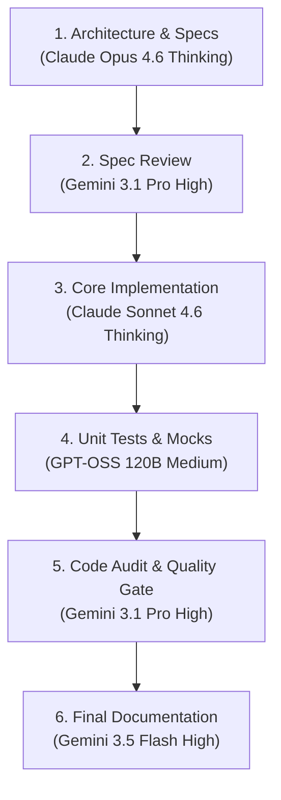
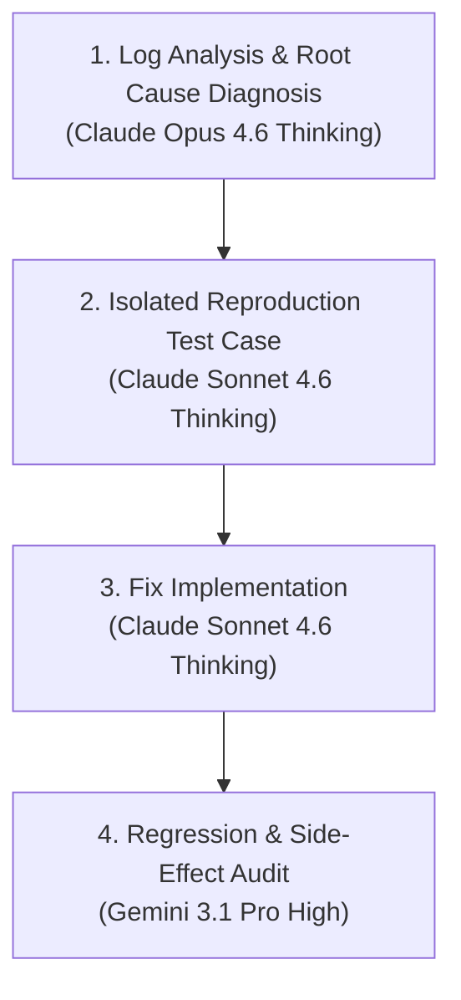
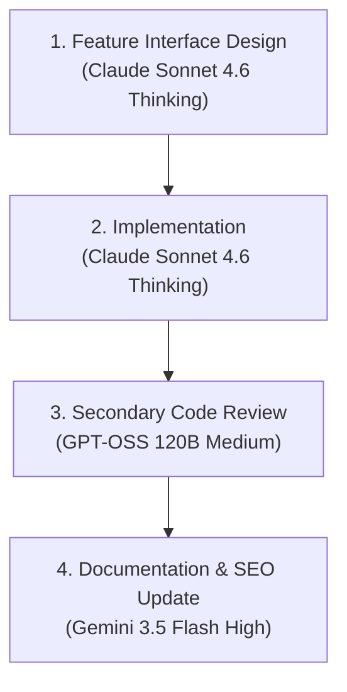
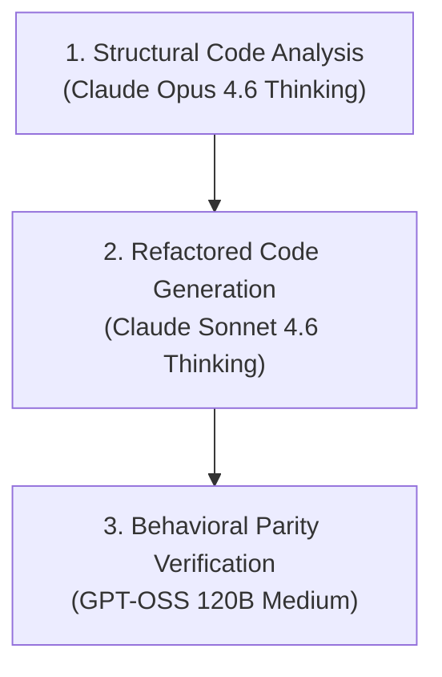
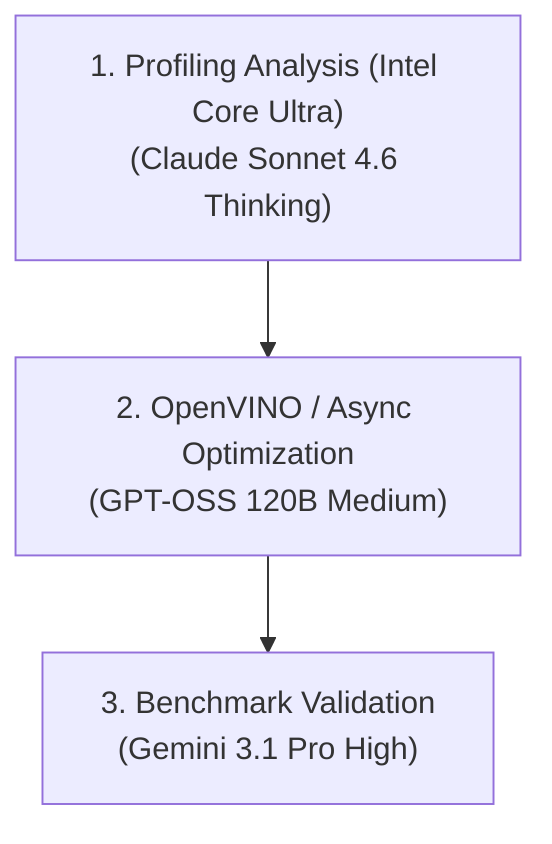
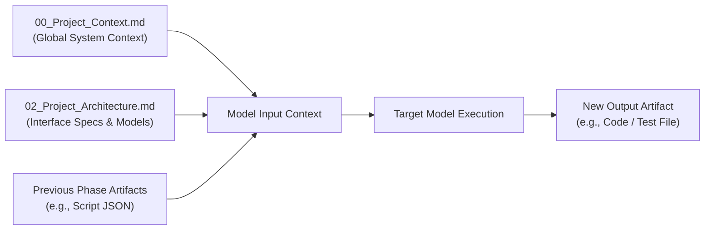
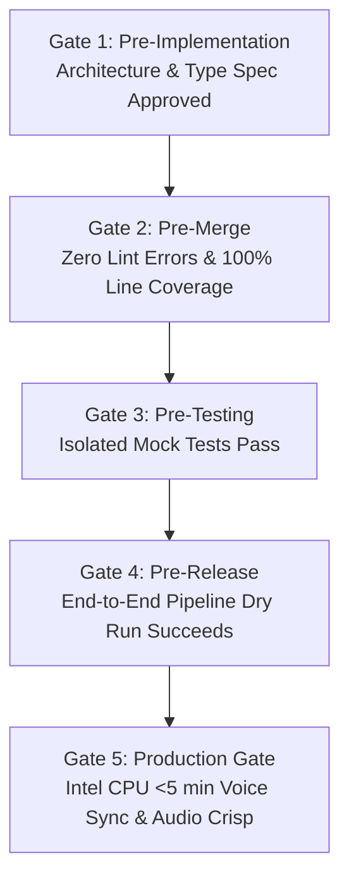
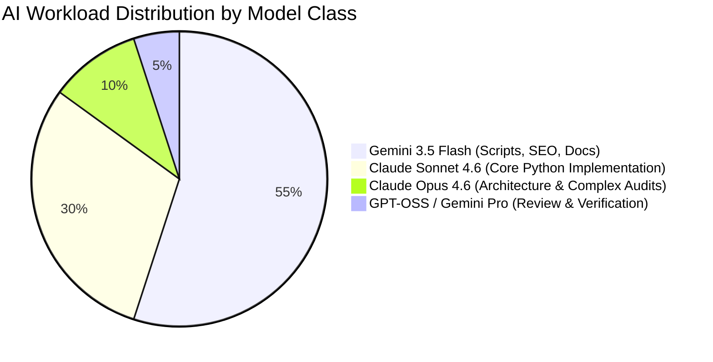
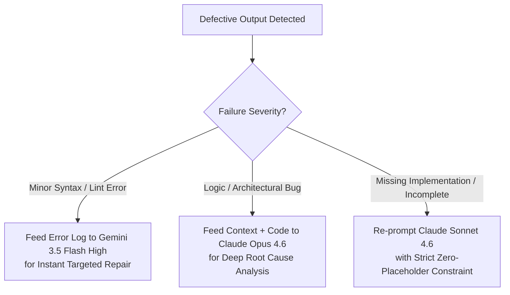

# 06_AI_Development_Guide.md — Official AI Engineering Handbook

**Author:** Staff AI Engineering Manager  
**Target System:** Automated DSA Educational YouTube Pipeline  
**Target Environment:** Intel Core Ultra 7 155H | Ubuntu 25.10 LTS | Python 3.12 | Intel Arc GPU  
**Last Updated:** July 2026  

---

## Executive Summary & Engineering Principles

This document serves as the **official AI Engineering Handbook** for developing, maintaining, and scaling the LeetCode & DSA Educational YouTube Video Automation Pipeline. 

Because this project relies on **manual model switching** across a multi-model environment (Gemini 3.5 Flash family, Gemini 3.1 Pro family, Claude Sonnet 4.6 Thinking, Claude Opus 4.6 Thinking, and GPT-OSS 120B), this handbook establishes strict operational boundaries, task assignments, prompt patterns, and quality gates.

### Core Engineering Directives
1. **Zero Monoliths:** Every component must be built as a modular, independently testable package adhering to SOLID principles.
2. **Deterministic Role Assignment:** Models are tools with specific specializations; never use a fast lightweight model for deep architectural design, and never waste expensive reasoning models on repetitive boilerplate.
3. **Strict Self-Review Prohibition:** No model is permitted to audit or review its own generated code or architectural specifications.
4. **Context Chaining via Markdown Artifacts:** Inter-model handoffs must occur through standardized, version-controlled markdown artifacts in the `PromptBook/` directory.

---

## 1. AI Model Overview & Benchmark Profiles

| Model Identifier | Reasoning | Coding | Architecture | Documentation | Latency | Cost Tier |
|---|---|---|---|---|---|---|
| **Claude Opus 4.6 Thinking** | World-Class (10/10) | Supreme (9.5/10) | Master (10/10) | Superior (9.5/10) | High (Deep Thinking) | Premium |
| **Claude Sonnet 4.6 Thinking** | Superior (9/10) | Master (10/10) | Excellent (9/10) | Superior (9/10) | Moderate-High | High |
| **Gemini 3.1 Pro High** | Excellent (8.5/10) | Strong (8.5/10) | Strong (8.5/10) | Excellent (9/10) | Moderate | Mid-High |
| **Gemini 3.1 Pro Low** | Good (7.5/10) | Strong (8/10) | Good (7.5/10) | Strong (8/10) | Low-Moderate | Mid |
| **Gemini 3.5 Flash High** | Very Good (8/10) | Strong (8.5/10) | Good (7.5/10) | Superior (9/10) | Very Low | Ultra-Low |
| **Gemini 3.5 Flash Medium**| Good (7/10) | Good (7.5/10) | Moderate (6.5/10)| Very Good (8.5/10)| Ultra-Low | Ultra-Low |
| **Gemini 3.5 Flash Low**   | Basic (6/10) | Moderate (7/10)  | Basic (5.5/10)   | Good (7.5/10)     | Near Instant | Ultra-Low |
| **GPT-OSS 120B Medium**   | Strong (8/10) | Very Strong (8.5/10)| Good (7.5/10) | Good (7.5/10)     | Low-Moderate | Local / Open |

---

### Comprehensive Model Dossiers

#### 1. Claude Opus 4.6 Thinking
* **Strengths:** Unrivaled complex system design, deep multi-step algorithmic reasoning, identifying subtle edge cases, cross-module structural refactoring, and root-cause debugging.
* **Weaknesses:** High latency due to extended internal reasoning traces; costly computational resource overhead.
* **Best Uses:** Initial System Architecture, Core Interface Contracts, Complex Algorithm Visual Logic (Manim math), Safety/Security Audits.
* **Avoid Using For:** Simple boilerplate generation, basic unit test generation, fast documentation updates, low-level string formatting.

#### 2. Claude Sonnet 4.6 Thinking
* **Strengths:** Industry-standard Python code generation, pristine adherence to SOLID principles, typing, docstrings, and robust exception handling.
* **Weaknesses:** Can occasionally over-engineer simple utility scripts if not strictly bounded by constraints.
* **Best Uses:** Primary Module Implementation (Scraper, RAG Engine, Manim Renderer, FFmpeg Builder, Memory System), Refactoring, Pytest Test Suite Generation.
* **Avoid Using For:** Trivial configuration edits, high-volume batch text processing.

#### 3. Gemini 3.1 Pro (High & Low)
* **Strengths:** Massive context window handling, deep understanding of Google SDKs (Gemini API, YouTube Data API v3), cross-referencing multi-file documentation packages.
* **Weaknesses:** Slightly less precise with complex multi-file Python class refactoring compared to Claude.
* **Best Uses:** RAG Integration, YouTube API integration, Gemini API schema definitions, Secondary Code Review, Technical Documentation generation.
* **Avoid Using For:** Core mathematical animation logic in Manim without explicit visual constraints.

#### 4. Gemini 3.5 Flash (High, Medium, Low)
* **Strengths:** Sub-second response latency, ultra-cheap operational cost, massive context ingestion, structured JSON synthesis, SEO metadata generation.
* **Weaknesses:** Can hallucinate deep architectural nuance if given unconstrained or ambiguous instructions.
* **Best Uses:**
  * **High:** Educational Script Generation, Tag Exploration, Code Explanations, SEO Metadata, Prompt Engineering.
  * **Medium:** Automated Commit Messages, Inline Code Comments, Documentation Summaries.
  * **Low:** Format Conversions, JSON Syntax Validation, Fast Text Scrubbing.
* **Avoid Using For:** Root-cause bug analysis in complex async code, core architecture design.

#### 5. GPT-OSS 120B Medium
* **Strengths:** Strong open-weights logic execution, fast code transformations, deterministic algorithmic refactoring, independent auditing.
* **Weaknesses:** Medium context window limits compared to Gemini; requires detailed system prompts.
* **Best Uses:** Independent Code Review, Unit Test Suite Expansion, OpenVINO C++ / Python optimization scripts, Code Cleaning.
* **Avoid Using For:** Primary System Architecture design.

---

## 2. Task Assignment Matrix

| Task Category | Task | Primary Model | Secondary Model | Primary Rationale | Confidence |
|---|---|---|---|---|---|
| **Architecture** | System & Pipeline Architecture | Claude Opus 4.6 Thinking | Gemini 3.1 Pro High | Supreme high-level reasoning and zero-monolith enforcement | 99% |
| **Architecture** | Project Planning & Roadmaps | Claude Opus 4.6 Thinking | Gemini 3.1 Pro High | Deep structural planning and dependency ordering | 98% |
| **Architecture** | Module Design & Interface Specs | Claude Sonnet 4.6 Thinking | Gemini 3.1 Pro High | Clean Python class interfaces, typing, and SOLID design | 97% |
| **Backend Code** | Python Base & Dataclasses | Claude Sonnet 4.6 Thinking | GPT-OSS 120B Medium | Pristine Python 3.12 code formatting and typing | 98% |
| **Backend Code** | LlamaIndex RAG Engine | Claude Sonnet 4.6 Thinking | Gemini 3.1 Pro High | Deep retrieval architecture and custom node parser design | 96% |
| **Backend Code** | ChromaDB Vector Store | Claude Sonnet 4.6 Thinking | Gemini 3.5 Flash High | Robust persistent client initialization and collection schemas | 96% |
| **Backend Code** | Gemini API Integration | Gemini 3.1 Pro High | Claude Sonnet 4.6 Thinking | Native alignment with Google GenAI SDK standards | 99% |
| **Backend Code** | OpenVINO Core Ultra Engine | Claude Sonnet 4.6 Thinking | GPT-OSS 120B Medium | Optimized PyTorch to OpenVINO IR conversion and NPU/CPU execution | 95% |
| **Backend Code** | Kokoro-82M TTS Wrapper | Claude Sonnet 4.6 Thinking | Gemini 3.1 Pro High | Efficient local audio synthesis and speaker vector injection | 95% |
| **Backend Code** | Manim Animation Engine | Claude Sonnet 4.6 Thinking | Claude Opus 4.6 Thinking | Complex mathematical positioning and custom dark-mode Mobjects | 97% |
| **Backend Code** | FFmpeg Video Assembler | Claude Sonnet 4.6 Thinking | GPT-OSS 120B Medium | Reliable sub-process audio/video stitching & filter graphs | 96% |
| **Backend Code** | YouTube API v3 Integration | Gemini 3.1 Pro High | Claude Sonnet 4.6 Thinking | Direct Google API client expertise & OAuth token management | 98% |
| **Testing** | Pytest Unit & Integration Tests | Claude Sonnet 4.6 Thinking | GPT-OSS 120B Medium | High coverage assertion logic and mock object creation | 97% |
| **Testing** | Benchmarking & Hardware Profiling | GPT-OSS 120B Medium | Gemini 3.5 Flash High | Fast CPU execution profiling script generation | 93% |
| **Optimization** | Intel Core Ultra CPU/NPU Tuning| Claude Sonnet 4.6 Thinking | GPT-OSS 120B Medium | OpenVINO compilation flags and thread optimization | 94% |
| **Documentation**| API Docs & Project Standards | Gemini 3.5 Flash High | Gemini 3.1 Pro Low | Extremely fast, structured markdown output | 96% |
| **Prompt Engineering**| LLM Prompt Template Library| Gemini 3.5 Flash High | Claude Sonnet 4.6 Thinking | High quality instructional prompt formatting | 95% |
| **Educational** | Script Generator Prompts | Gemini 3.5 Flash High | Gemini 3.1 Pro High | Strong pedagogical phrasing and YouTube audience retention focus | 97% |
| **Educational** | Animation Storyboarding | Claude Sonnet 4.6 Thinking | Gemini 3.5 Flash High | Translates DSA algorithms into step-by-step Manim visual scenes | 96% |
| **SEO & Media** | YouTube Metadata (Title/Desc/Tags)| Gemini 3.5 Flash High | Gemini 3.5 Flash Medium | Exceptional search keyword optimization and CTR formatting | 98% |
| **SEO & Media** | Imagen 3 Thumbnail Prompts | Gemini 3.5 Flash High | Gemini 3.1 Pro Low | High contrast visual prompt creation for Gemini Image API | 96% |
| **Maintenance** | Bug Fixing & Root Cause Analysis| Claude Opus 4.6 Thinking | Claude Sonnet 4.6 Thinking | Unmatched tracing across asynchronous execution logs | 98% |
| **Maintenance** | Code Refactoring | Claude Sonnet 4.6 Thinking | GPT-OSS 120B Medium | Refactoring large files without altering behavioral contracts | 97% |
| **Security & Quality**| Security & Dependency Audit | Claude Opus 4.6 Thinking | Gemini 3.1 Pro High | Rigorous vulnerability scan and credentials leak prevention | 99% |
| **Security & Quality**| Code Review & SOLID Audit | Gemini 3.1 Pro High | GPT-OSS 120B Medium | Strict unbiased cross-model code auditing | 96% |

---

## 3. Model Switching Workflows

### Workflow 1: New Module Creation


### Workflow 2: Bug Fix Protocol


### Workflow 3: Feature Addition


### Workflow 4: Code Refactoring


### Workflow 5: Hardware & Performance Optimization


---

## 4. Prompt Writing Guidelines by Model Family

### 1. Prompts for Claude (Opus & Sonnet 4.6 Thinking)
* **Design Philosophy:** Give deep architectural context, strict constraints, and explicit role definitions. Encourage internal thinking traces for high complexity.
* **Key Directives:** Enforce SOLID principles, no placeholders, full typing, and explicit docstrings.

#### Example Prompt (Claude):
```markdown
You are a Senior Software Engineer specializing in Python 3.12, OpenVINO, and high-performance local AI engines.

CONTEXT:
We are building the Voice Synthesizer module (`src/voice/synthesizer.py`) for an automated DSA YouTube video pipeline running on an Intel Core Ultra 7 155H processor with Ubuntu 25.10 LTS.

OBJECTIVE:
Implement the `VoiceSynthesizer` class using Kokoro-82M and OpenVINO runtime.

CONSTRAINTS:
1. Must support both `--voice cloned` (using a local speaker embedding numpy array) and `--voice record` (manual WAV alignment).
2. Must compile the model using OpenVINO for CPU/NPU execution.
3. No placeholders, no `TODO` comments, no incomplete methods.
4. Follow PEP8, include type annotations for every method, and write comprehensive docstrings.

Provide the COMPLETE implementation of `src/voice/synthesizer.py`.
```

---

### 2. Prompts for Gemini (3.1 Pro & 3.5 Flash)
* **Design Philosophy:** Provide clear structural schemas, JSON templates, or documentation references. Gemini excels when given input-output visual pairs or strict markdown contracts.

#### Example Prompt (Gemini 3.5 Flash High - Educational Script):
```markdown
You are a Senior Computer Science Pedagogy Expert and YouTube Content Strategist.

TASK:
Generate a structured 10-section JSON video script for LeetCode #143 (Reorder List).

INPUT DATA:
- Algorithm: Fast & Slow Pointers + Reverse Second Half + Interleave Merge
- Language: C++
- Audience: Software Engineering Candidates preparing for FAANG interviews

OUTPUT FORMAT:
Return a valid JSON object matching the standard 10-section video schema:
{
  "title": string,
  "difficulty": string,
  "tags": list of strings,
  "sections": [
    {
      "id": string,
      "type": string,
      "narration": string,
      "visual_params": object
    }
  ]
}

REQUIREMENTS:
- Narration must sound natural when spoken aloud.
- Focus heavily on visual intuition before presenting C++ code.
```

---

### 3. Prompts for GPT-OSS (120B Medium)
* **Design Philosophy:** Direct, precise, and instruction-dense. Excellent for code transformations, unit test suites, and strict syntax checking.

#### Example Prompt (GPT-OSS 120B - Unit Testing):
```markdown
ROLE: Senior QA & Automation Engineer
TASK: Write complete pytest unit tests for `src/scraper/leetcode_client.py`.

REQUIREMENTS:
1. Mock all external HTTP requests to `https://leetcode.com/graphql` using `unittest.mock`.
2. Cover success cases, invalid session cookies (401/403), rate limits (429), and network timeouts.
3. Achieve 100% line coverage for the target module.
4. Return ONLY valid executable Python code.
```

---

## 5. Context Management & Artifact Protocol

To maintain complete context fidelity across model switches, **never rely on ephemeral chat history**. All knowledge must be passed through written artifacts in the repository.



### Context Rules
1. **Always Include Global Context:** Start key prompts by referencing `PromptBook/00_Project_Context.md` and `PromptBook/01_Global_Rules.md`.
2. **Phase Dependencies:** 
   - Module 4 (Script Generator) requires Module 1 (Scraper Output) + Module 2 (Tag Knowledge).
   - Module 6 (Animation) requires Module 4 Script JSON.
   - Module 7 (Assembler) requires Module 5 (Voice WAVs) + Module 6 (Rendered MP4s).
3. **No Hidden State:** Every inter-module data transfer MUST use standard schemas stored under `data/` or `config/`.

---

## 6. Review Strategy & Audit Matrix

To eliminate hallucinated bugs and ensure production readiness, strict cross-model auditing is mandatory.

### The Golden Rule of AI Review
> **NO AI MODEL MAY REVIEW OR AUDIT ITS OWN GENERATED CODE OR SPECIFICATION.**

| Author Model | Allowed Reviewer Model | Prohibited Reviewer | Review Focus |
|---|---|---|---|
| Claude Opus 4.6 Thinking | Gemini 3.1 Pro High | Claude Opus 4.6 Thinking | Architectural validity, edge coverage |
| Claude Sonnet 4.6 Thinking | Gemini 3.1 Pro High OR GPT-OSS 120B | Claude Sonnet 4.6 Thinking | Code correctness, SOLID standards, lints |
| Gemini 3.1 Pro High | Claude Sonnet 4.6 Thinking | Gemini 3.1 Pro High | Implementation fidelity, error handling |
| Gemini 3.5 Flash High | Gemini 3.1 Pro Low OR GPT-OSS 120B | Gemini 3.5 Flash | Script accuracy, formatting, JSON schema |

### Review Sequence
1. **Author Phase:** Model A generates code/artifact based on task prompt.
2. **Static Check:** Local linters (`flake8`, `mypy`, `pytest`) run locally.
3. **Audit Phase:** Model B receives output + `PromptBook/01_Global_Rules.md` to perform audit.
4. **Correction Phase:** If Model B identifies defects, Model A rewrites the targeted section.

---

## 7. Quality Gates

Before any component is merged or moved to production, it must clear 5 distinct Quality Gates:



### Detailed Gate Requirements
* **Gate 1 (Pre-Implementation):** Spec document created in `PromptBook/` and reviewed by secondary model.
* **Gate 2 (Pre-Merge):** Code follows PEP8, has complete docstrings, no `TODO`s or placeholders, and passes `pytest`.
* **Gate 3 (Pre-Testing):** Scraper, Voice, and Animation modules operate in isolation with mock data.
* **Gate 4 (Pre-Release):** Full video generated locally (#143 Reorder List test) in under 15 minutes.
* **Gate 5 (Production):** YouTube upload succeeds in `Private` mode with valid metadata, descriptions, and timestamps.

---

## 8. Cost & Resource Optimization Guide

Even with Google AI Pro access, minimizing high-latency and high-compute model calls is essential for rapid development speed.



### Compute Assignment Rules
* **Use Gemini 3.5 Flash for:** High-volume text synthesis, script creation, tag exploration summaries, title/description metadata, JSON validation.
* **Use Claude Sonnet 4.6 for:** Writing Python scripts, creating Manim animation classes, implementing OpenVINO bindings, unit tests.
* **Use Claude Opus 4.6 ONLY for:** System architecture definition, initial project roadmaps, root-cause debugging of multi-module async crashes.

---

## 9. Failure Recovery & Rewriting Protocol

When a model output is incomplete, contains syntax errors, or fails quality gates, execute the following recovery protocol:



---

## 10. Future Model Expansion Guidelines

This handbook is designed to seamlessly incorporate future AI models (e.g., OpenAI GPT-5, DeepSeek R1/V3, Qwen 2.5/3, Mistral Le Chat, Llama 4) without disrupting the core project workflow.

### Integration Procedure for New Models
1. **Profile the Model:** Assess reasoning, coding speed, context window size, and latency.
2. **Assign Slot in Matrix:** Map the new model into Section 2 (Task Assignment Matrix) as a Primary or Secondary worker based on its strengths:
   - **Deep Reasoning Models (e.g., DeepSeek R1, OpenAI o3):** Slot into Architecture, Root Cause Debugging, and Security Review (alongside Claude Opus).
   - **High-Speed Coding Models (e.g., Qwen 2.5 Coder, DeepSeek V3):** Slot into Python Implementation and Test Suite Generation (alongside Claude Sonnet).
   - **Fast Utility Models (e.g., Llama 3.3 70B, Mistral Small):** Slot into SEO generation, documentation, and formatting (alongside Gemini Flash).
3. **Update Prompt Wrappers:** Add prompt templates for the new model family in `PromptBook/07_Prompt_Template_Library.md`.

---

**End of Official AI Engineering Handbook (`06_AI_Development_Guide.md`).**
