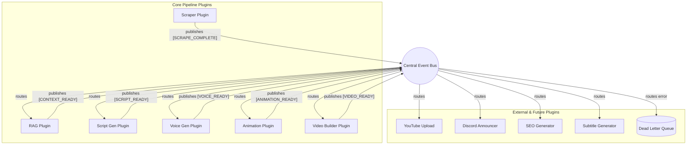
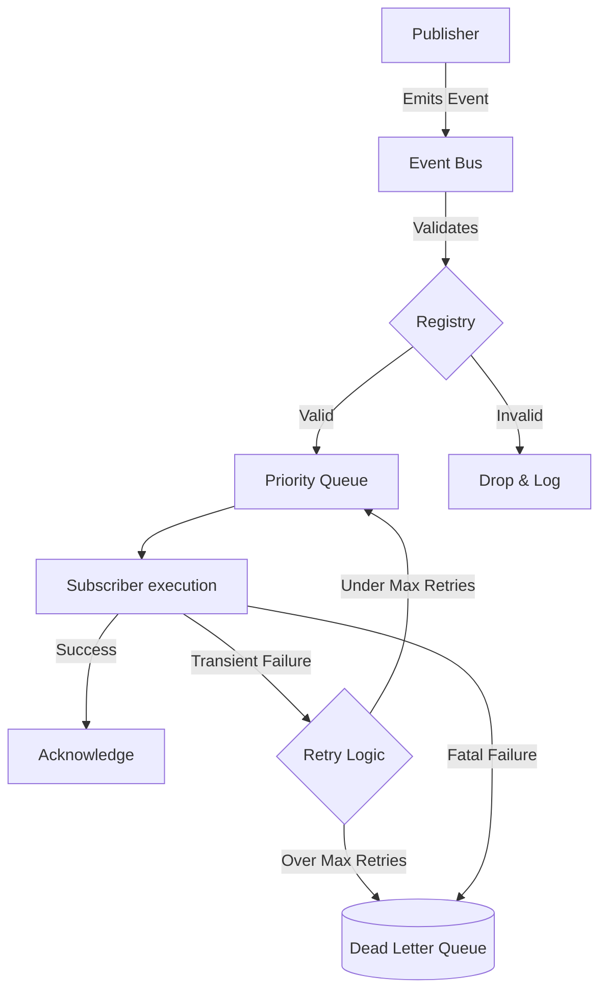
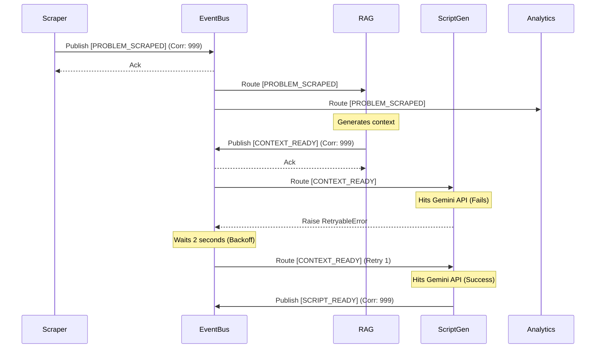

# 10_Event_Driven_Architecture.md

**Author:** Principal Software Architect  
**Target System:** Automated DSA Educational YouTube Video Pipeline  
**Document Version:** 1.0.0  
**Status:** Designed  

---

# Table of Contents
1. [Executive Summary](#1-executive-summary)
2. [Overall Architecture](#2-overall-architecture)
3. [Core Components](#3-core-components)
4. [Event Anatomy & Traceability](#4-event-anatomy--traceability)
5. [Reliability & Resilience](#5-reliability--resilience)
6. [Operations & Security](#6-operations--security)
7. [Example Event Lifecycle](#7-example-event-lifecycle)
8. [Best Practices & Anti-Patterns](#8-best-practices--anti-patterns)

---

# 1. Executive Summary

This document specifies the **Event-Driven Architecture (EDA)** for the educational video generation platform. To support a massive ecosystem of current modules (Scraper, RAG, Script Gen, Voice, Animation, Build, Upload, Memory) and future plugins (Analytics, Discord, Telegram, SEO, Subtitles, OCR, etc.), the system relies entirely on an asynchronous **Event Bus**.

**Golden Rule:** Plugins *never* communicate directly. All inter-plugin communication occurs exclusively by publishing or subscribing to events. This guarantees absolute decoupling, allowing new plugins to be hot-swapped without modifying existing pipeline logic.

---

# 2. Overall Architecture

The architecture implements a Pub-Sub (Publisher-Subscriber) topology managed by a centralized in-memory Event Bus (with future scaling pathways to external brokers like Redis/Kafka).

---

# 3. Core Components

### 3.1 Event Bus
The core mediator. It asynchronously dispatches events to registered subscribers using Python's `asyncio` event loop.

### 3.2 Publisher
Any plugin that generates state changes or data. The Publisher emits an event to the Event Bus and immediately yields execution. It does *not* wait for Subscribers to process the event (Fire and Forget).

### 3.3 Subscriber
A plugin that registers an asynchronous callback (hook) with the Event Bus to listen for specific Event Types.

### 3.4 Event Registry
A centralized schema registry containing the definitions (Pydantic Models) of all allowed events in the system. Ensures that malformed events are rejected before they reach the Event Bus.

### 3.5 Event Routing & Filtering
Subscribers can define filtering rules based on Event Metadata.
*Example:* The `Discord` plugin subscribes to `VIDEO_UPLOADED`, but adds a filter: `payload.difficulty == "Hard"`. The Event Bus evaluates this filter and only routes "Hard" problem events to Discord.

### 3.6 Priorities
Events are routed using priority queues (`asyncio.PriorityQueue`). System events (like `PIPELINE_SHUTDOWN` or `MEMORY_FULL`) carry high priority (0) and bypass standard data events (priority 5).

---

# 4. Event Anatomy & Traceability

Every event is an immutable frozen dataclass.

### 4.1 Event Metadata
Contains contextual data completely separate from the actual business payload.
- `event_id`: UUID
- `event_type`: str
- `timestamp`: UTC ISO8601
- `source_plugin`: str
- `version`: str (e.g., "1.0.0")

### 4.2 Correlation IDs & Tracing
Every event generated in response to another event inherits its `correlation_id`.
If `Scraper` creates event `A` (Correlation ID: `123`), and `RAG` reacts to `A` by generating event `B`, event `B` must also carry Correlation ID `123`. This enables tracing the entire lifecycle of a specific video generation through the logs.

### 4.3 Event Versioning & Backward Compatibility
To prevent breaking changes, event payloads use semantic versioning. If the `SCRIPT_READY` event schema changes, it increments to `v2`. Subscribers specify which version they consume. The Event Registry can apply "Upcasters" to transform `v1` payloads into `v2` on the fly.

---

# 5. Reliability & Resilience

### 5.1 Ordering & Async Processing
Because processing is asynchronous, strict ordering is not guaranteed globally, but causal ordering is maintained via the Correlation ID. If strict serial execution is required, plugins wait for the specific completion event of the preceding plugin.

### 5.2 Retry & Dead Letter Queue (DLQ)
If a Subscriber throws a `RetryableError` (e.g., network timeout hitting Discord API), the Event Bus intercepts it and re-queues the event with exponential backoff. If it exceeds `max_retries`, or throws a `FatalError`, the event is written to persistent storage in the **Dead Letter Queue (DLQ)** for manual debugging.

### 5.3 Persistence & Replay
The Event Bus utilizes an Event Sourcing pattern. Every valid event is appended to a local SQLite/JSON log before dispatching. If the system crashes mid-pipeline, upon restart, it can read the persistent log and **Replay** unacknowledged events.

---

# 6. Operations & Security

### 6.1 Monitoring & Metrics
The Event Bus exposes hooks measuring:
- Processing latency per Subscriber.
- Queue depth (number of pending events).
- DLQ size (number of failed events).
These metrics are exposed for Future Plugins (e.g., Analytics/Grafana).

### 6.2 Security & Sandboxing
Plugins do not have the authorization to instantiate arbitrary events. The `PluginContext` injected into the Plugin validates that a plugin is only allowed to emit events matching its registered metadata profile.

### 6.3 Future Scaling
Currently, the Event Bus is an in-memory `asyncio` bus. The interfaces (`EventBusProtocol`) are designed so that in the future, if the system is distributed across multiple Docker containers, the implementation can be swapped for Redis Pub/Sub, RabbitMQ, or Apache Kafka with *zero* code changes to the Plugins.

---

# 7. Example Event Lifecycle

---

# 8. Best Practices & Anti-Patterns

### ✅ Best Practices
1. **Idempotency:** Subscribers *must* be idempotent. Because of retries, a Subscriber might receive the same event twice. It must handle this gracefully without corrupting state.
2. **Fat Events:** Include all necessary IDs and basic context within the event payload so Subscribers don't have to query the database/cache immediately upon receiving the event.
3. **Correlation IDs:** Always pass the `correlation_id` from the triggering event into the resulting event.

### ❌ Anti-Patterns
1. **Request-Response over Events:** Waiting for an event response (e.g., `event_bus.publish_and_wait(evt)`). This creates tight coupling and negates the benefits of EDA. Use pure Fire-and-Forget.
2. **God Events:** Creating a massive `PIPELINE_UPDATE` event that changes shape depending on the module. Use granular, specific events (e.g., `AUDIO_GENERATED`, `VIDEO_RENDERED`).
3. **Direct Plugin Import:** `from plugins.scraper import ScraperPlugin`. This is strictly forbidden. The only way to interact is via the Event Bus.
