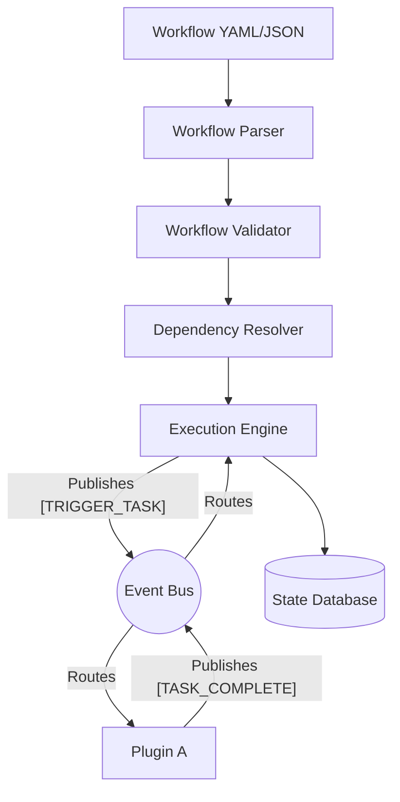
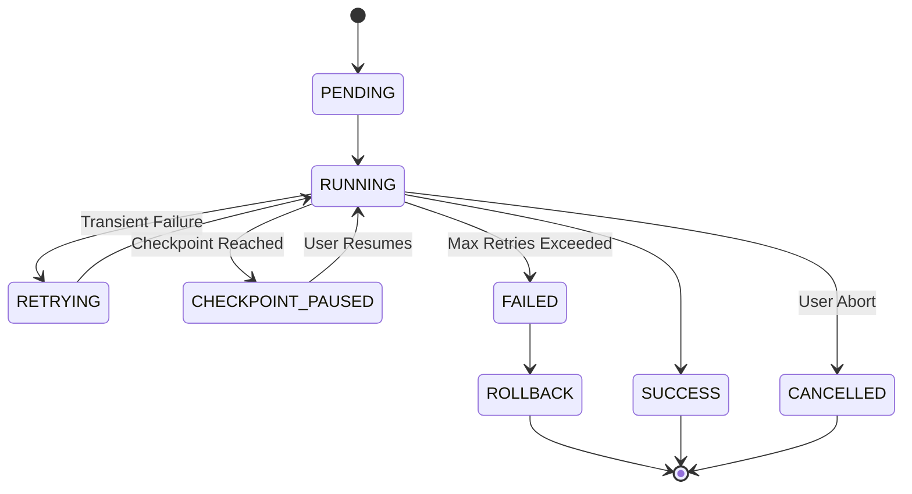
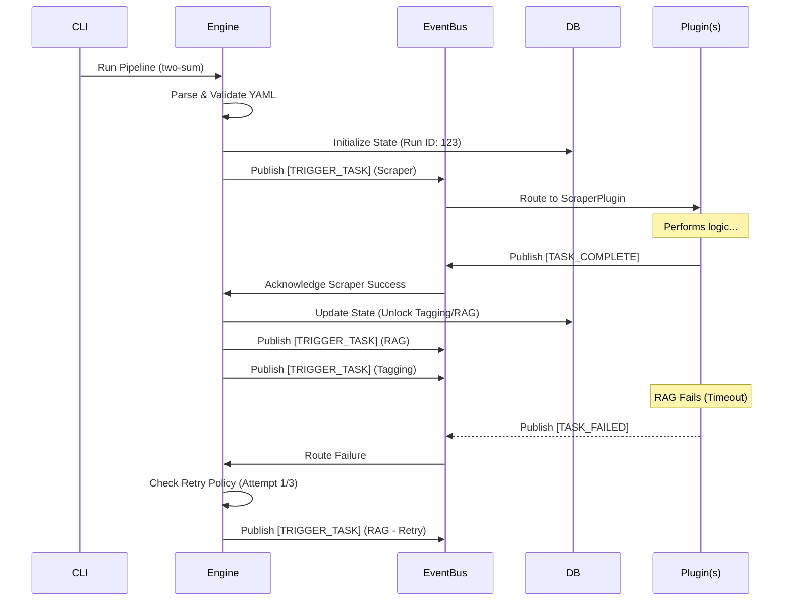

# 11_Workflow_Engine.md

**Author:** Principal Software Architect  
**Target System:** Automated DSA Educational YouTube Video Pipeline  
**Document Version:** 1.0.0  
**Status:** Designed  

---

# Table of Contents
1. [Executive Summary](#1-executive-summary)
2. [Workflow Definition Format](#2-workflow-definition-format)
3. [Architecture & Resolution](#3-architecture--resolution)
4. [Execution Semantics (Parallelism & Conditions)](#4-execution-semantics)
5. [Resilience & State Management](#5-resilience--state-management)
6. [Operations & Observability](#6-operations--observability)
7. [Future Distributed Execution](#7-future-distributed-execution)
8. [Example Workflow Lifecycle](#8-example-workflow-lifecycle)
9. [Best Practices & Anti-Patterns](#9-best-practices--anti-patterns)

---

# 1. Executive Summary

This document specifies the design for a generic, declarative **Workflow Engine**. Operating one layer above the Event Bus, this engine orchestrates the order of operations by parsing declarative blueprints (YAML/JSON). It treats every Plugin as an opaque "Task." 

By relying on the Event-Driven Architecture, the engine orchestrates execution via event triggers without knowing *how* the plugins implement their logic. This design supports DAG (Directed Acyclic Graph) dependency resolution, parallel processing, checkpointing, and graceful rollbacks.

---

# 2. Workflow Definition Format

Workflows are defined declaratively in YAML (preferred for human readability) or JSON (preferred for API generation). They are heavily inspired by GitHub Actions and Apache Airflow.

### Example `pipeline_v1.yaml`
```yaml
version: "1.0.0"
name: "Standard Video Generation Pipeline"
description: "Generates a complete YouTube video from a LeetCode problem."

tasks:
  - id: "scrape_problem"
    plugin: "ScraperPlugin"
    timeout_sec: 120
    retries: 2
    
  - id: "tag_extraction"
    plugin: "TagExplorerPlugin"
    depends_on: ["scrape_problem"]
    # Executes conditionally based on the payload of the dependency
    condition: "payload.difficulty != 'Easy'" 
    
  - id: "rag_context"
    plugin: "RAGPlugin"
    depends_on: ["scrape_problem"]
    
  - id: "script_gen"
    plugin: "ScriptGeneratorPlugin"
    depends_on: ["tag_extraction", "rag_context"]
    checkpoint: true # Pause execution here if manually halted
    
  - id: "media_generation"
    type: "parallel"
    depends_on: ["script_gen"]
    tasks:
      - id: "render_voice"
        plugin: "VoiceGeneratorPlugin"
      - id: "render_animation"
        plugin: "AnimationPlugin"
        
  - id: "assemble_video"
    plugin: "VideoBuilderPlugin"
    depends_on: ["media_generation"]
```

---

# 3. Architecture & Resolution



### 3.1 Workflow Parser & Validator
- **Parser:** Reads YAML/JSON files and deserializes them into Python Pydantic models.
- **Validator:** Analyzes the structure to prevent circular dependencies (ensuring it is a strict DAG), enforces task ID uniqueness, and verifies that the referenced `plugin` exists in the `PluginRegistry`.

### 3.2 Dependency Resolution
Utilizes a Topological Sort algorithm. Tasks with empty `depends_on` arrays are moved to the root execution pool. As tasks succeed, the engine updates a graph matrix to unlock downstream dependents.

---

# 4. Execution Semantics

### 4.1 Conditional Execution
Tasks can define `condition` parameters utilizing simple evaluation languages (e.g., JMESPath or AST-safe python evals) against the state payload of their immediate dependencies. If evaluated to `False`, the task is marked as `SKIPPED`, and downstream dependents treat the skip as a success.

### 4.2 Parallel Execution
Because the engine is event-driven, triggering parallel tasks is trivial. When `script_gen` succeeds, the engine simultaneously publishes `[TRIGGER_TASK]` events for both `render_voice` and `render_animation`. The `EventBus` handles the asynchronous concurrency automatically.

### 4.3 Scheduling
A CRON-like scheduler wrapper sits above the engine. It can emit `[START_WORKFLOW]` events at specific intervals to trigger daily scraping routines autonomously.

---

# 5. Resilience & State Management



### 5.1 Retries & Timeouts
- **Timeouts:** Wrapped via `asyncio.wait_for`. If a plugin takes too long, the Engine cancels the future and marks it as a failure.
- **Retries:** Configurable per task. If an event returns an `Error` state, the engine waits (exponential backoff) and re-emits the `[TRIGGER_TASK]` event.

### 5.2 Checkpointing & Resume
If `checkpoint: true` is set, the engine serializes the entire DAG state matrix and accumulated payloads to a local JSON/SQLite file, then pauses the event loop. The system can be safely restarted, allowing an operator to inspect the script manually before clicking "Resume."

### 5.3 Rollback Strategy
The engine utilizes the **Saga Pattern**. If `assemble_video` fails fatally, the engine traverses backward up the DAG, emitting `[COMPENSATE_TASK]` events. Plugins can listen to this to delete temporary MP4s, preventing disk-space leaks.

---

# 6. Operations & Observability

### 6.1 Progress Tracking & Metrics
Every state change (`PENDING` -> `RUNNING` -> `SUCCESS`) emits a status event. The `Memory` or `Analytics` plugin can subscribe to these to render a real-time progress bar in a UI or calculate total DAG execution time for Prometheus metrics.

### 6.2 Audit Logging
Every workflow run generates an immutable trace JSON containing start times, end times, task resolutions, and skip reasons. This satisfies compliance and debugging requirements.

### 6.3 Resource Management & Cancellation
If a user submits a cancellation request (e.g., via CLI), the engine stops emitting new `[TRIGGER_TASK]` events and broadcasts an `[ABORT_WORKFLOW]` event. Any active plugins respecting the cancellation context will halt immediately.

---

# 7. Future Distributed Execution

While currently operating entirely inside a single Python process utilizing `asyncio`, the engine is strictly declarative. 

In a distributed future, the Engine can be ported to AWS Step Functions, Temporal.io, or Apache Airflow with zero code changes to the underlying logic. The current design effectively mocks a modern distributed orchestrator using our local `EventBus`.

---

# 8. Example Workflow Lifecycle



---

# 9. Best Practices & Anti-Patterns

### ✅ Best Practices
1. **Idempotent Plugins:** Because the Workflow Engine relies heavily on retries and replays, plugins MUST be idempotent (running them twice should safely overwrite or skip rather than crash).
2. **Granular Tasks:** Keep YAML tasks small. Don't create a `do_everything` task; separate `render_voice` and `render_animation` so they can run concurrently.
3. **Declarative State:** Never inject logic into the Workflow Engine core; it should remain a dumb parser routing events based solely on the YAML blueprint.

### ❌ Anti-Patterns
1. **Circular Dependencies:** Task A depends on Task B, which depends on Task A. The Validator must explicitly trap and block this.
2. **Implicit Fallbacks:** Expecting Task C to run if Task A fails without declaring `condition: "payload.status == 'FAILED'"`. The engine will halt the graph on failure by default.
3. **Inline Executions:** Bypassing the Event Bus and manually invoking `plugin.execute()` directly from the engine. This breaks the entire Event-Driven contract.
