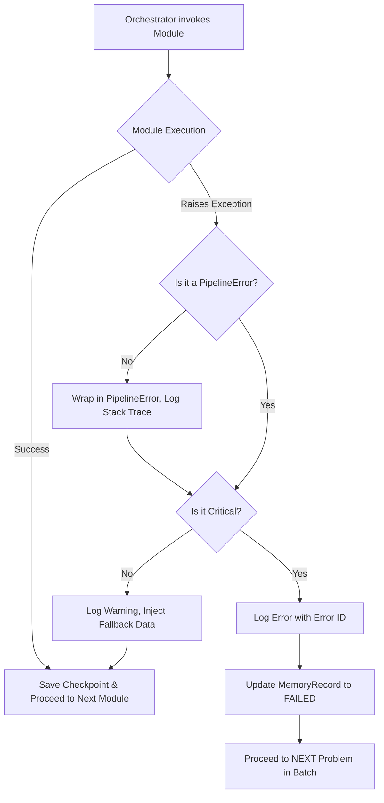
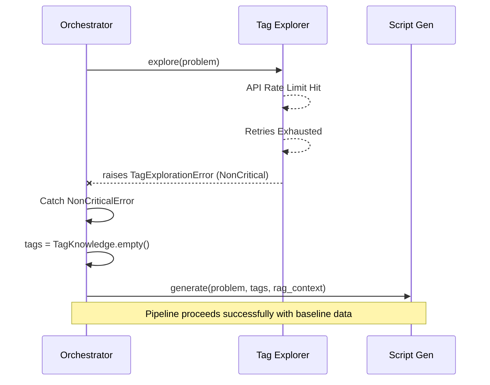

# Phase01/05_Error_Handling.md

**Author:** Principal Software Architect  
**Target System:** Automated DSA Educational YouTube Video Pipeline  
**Document Version:** 1.0.0  
**Status:** Canonical

---

# Table of Contents

1. [Purpose & Core Philosophy](#1-purpose--core-philosophy)
2. [Exception Hierarchy](#2-exception-hierarchy)
3. [Retry & Timeout Policies](#3-retry--timeout-policies)
4. [Graceful Degradation & Fallbacks](#4-graceful-degradation--fallbacks)
5. [Logging, Telemetry & Error IDs](#5-logging-telemetry--error-ids)
6. [Cancellation & Recovery Strategies](#6-cancellation--recovery-strategies)
7. [Module Responsibilities](#7-module-responsibilities)
8. [Flow Diagrams](#8-flow-diagrams)
9. [Examples](#9-examples)

---

# 1. Purpose & Core Philosophy

The pipeline is an automated, long-running batch process. A single run executing overnight must **never crash the entire orchestrator**. 

**Core Tenets:**
1. **Isolate Failures:** A failure in rendering Problem A must not prevent the pipeline from rendering Problem B.
2. **Degrade Gracefully:** A failure in an enrichment module (Tags, RAG) must allow the pipeline to proceed with baseline data.
3. **Fail Fast, Recover Fast:** Critical module failures must immediately halt processing for that specific problem and save a checkpoint for future recovery.
4. **Actionable Telemetry:** Every error must produce a unique Error ID, a user-friendly message, and structured logs for automated monitoring.

---

# 2. Exception Hierarchy

All custom exceptions inherit from a single base class, `PipelineError`. They are further subdivided into `CriticalError` and `NonCriticalError` to dictate the Orchestrator's behavior.

```python
BaseException
 └── Exception
      └── PipelineError (Base for all pipeline exceptions)
           ├── CriticalError (Halts the pipeline for the current problem)
           │    ├── ScraperError
           │    │    ├── AuthenticationError (ERR-SCR-001)
           │    │    └── ProblemNotFoundError (ERR-SCR-002)
           │    ├── ScriptGenerationError
           │    │    └── SchemaValidationError (ERR-SCRP-001)
           │    ├── VoiceSynthesisError (ERR-VOC-001)
           │    ├── AnimationRenderError (ERR-ANI-001)
           │    └── AssemblyError (ERR-ASM-001)
           │
           └── NonCriticalError (Logged, degraded, pipeline continues)
                ├── TagExplorationError (ERR-TAG-001)
                ├── RAGError (ERR-RAG-001)
                └── YouTubeUploadError
                     └── QuotaExceededError (ERR-YTB-001)
```

---

# 3. Retry & Timeout Policies

Network-bound modules and LLM APIs are inherently flaky. We implement robust retry policies at the **module level** (not the orchestrator level).

| Module / Operation | Timeout | Retry Strategy | Max Retries | Condition |
|---|---|---|---|---|
| **LeetCode API** | 30s | Exponential Backoff (base=2) | 3 | HTTP 429, 50x, Timeout |
| **Gemini API (Tags)** | 60s | Constant (5s delay) | 2 | API Error, Rate Limit |
| **Gemini API (Script)**| 120s | Exponential Backoff (base=2) | 3 | API Error, Rate Limit |
| **OpenVINO (Local)** | 300s | No Retry | 0 | Crash implies hardware/OOM |
| **Manim (Local)** | 600s | No Retry | 0 | Crash implies bad script syntax |
| **YouTube Upload** | 120s | Exponential Backoff (resumable) | 5 | Network Drops, 50x |

*Note: Hardware-bound local modules (Voice, Animation) do not automatically retry on failure to prevent continuous thermal throttling or deadlocks.*

---

# 4. Graceful Degradation & Fallbacks

If a `NonCriticalError` is raised, the Orchestrator catches it and provides a "Null Object" or fallback state to downstream modules.

**M2: Tag Explorer Failure**
- **Fallback:** Returns a `TagKnowledge` object with default values: `primary_pattern="General"`, `prerequisites=[]`, `related_problems=[]`, `animation_style=AnimationStyle.TEXT_EXPLANATION`.
- **Result:** Video is generated but lacks deep algorithmic context and uses generic visual animations.

**M3: RAG Engine Failure**
- **Fallback:** Returns a `RAGContext` object with `retrieved_chunks=[]`.
- **Result:** Script Generator relies entirely on the LLM's internal weights to explain the problem.

**Thumbnail Generation (Future)**
- **Fallback:** If AI thumbnail generation fails, fallback to extracting frame `00:00:15` via FFmpeg in the Assembly module.

---

# 5. Logging, Telemetry & Error IDs

### 5.1 Error IDs
Every raised exception is mapped to a standardized Error ID for telemetry aggregation.
Format: `ERR-[MODULE_CODE]-[3_DIGIT_ID]`
- **ERR-SCR-001**: LeetCode Authentication Expired
- **ERR-SCRP-003**: Gemini Output Schema Violation
- **ERR-ANI-002**: Manim Subprocess OOM

### 5.2 Structured Logging
We use `structlog` to emit JSON logs. Every error log must include:
- `timestamp`
- `slug` (the problem being processed)
- `error_id`
- `module`
- `attempt`

### 5.3 User-Friendly Messages
Exceptions must contain two messages:
1. `dev_message`: Full traceback and internal state for logging.
2. `user_message`: A clean, actionable message for the CLI/UI.
*Example:* `User Message: "LeetCode session expired. Please update your cookie in .env and restart."`

---

# 6. Cancellation & Recovery Strategies

### 6.1 Cancellation (SIGINT / KeyboardInterrupt)
- The pipeline listens for `SIGINT` (Ctrl+C).
- When received, it sets a global `CancellationEvent`.
- Modules check this event between heavy loops (e.g., between Manim scenes, between Voice chunks).
- If set, the module gracefully exits, saving intermediate outputs, and the Orchestrator writes a checkpoint indicating `PipelineStatus.PENDING`.

### 6.2 State Recovery (Checkpointing)
- The Orchestrator saves a local JSON checkpoint file (`data/memory/checkpoints/{slug}.json`) after every successful module transition.
- **Recovery Strategy:** On restart, the Orchestrator loads the checkpoint. If a run failed at M6 (Animation), it skips M1-M5 by loading their cached outputs directly from disk, and resumes immediately at M6.

---

# 7. Module Responsibilities

1. **Modules**: Responsible for catching internal library errors (e.g., `httpx.TimeoutException`, `manim.SceneError`), wrapping them in the appropriate `PipelineError` subclass, and applying retries for transient issues.
2. **Orchestrator**: Responsible for catching `PipelineError`, deciding whether to halt (`CriticalError`) or degrade (`NonCriticalError`), logging the telemetry, saving the memory record as `FAILED` or `PARTIAL_FAILURE`, and moving on to the next problem in the batch queue.
3. **Memory System**: Responsible for persisting the exact failure reason and Error ID so the user can query "Which videos failed last night and why?"

---

# 8. Flow Diagrams

### Error Handling Decision Tree



### Graceful Degradation (Tags/RAG)



---

# 9. Examples

### 9.1 Wrapping a Third-Party Error

```python
# Inside src/scraper/client.py
import httpx
from src.core.exceptions import RateLimitError

def fetch_problem(self, slug: str) -> dict:
    try:
        response = self.session.get(f"https://leetcode.com/graphql?query={slug}")
        response.raise_for_status()
        return response.json()
    except httpx.HTTPStatusError as e:
        if e.response.status_code == 429:
            raise RateLimitError(
                error_id="ERR-SCR-429",
                user_message=f"Rate limited by LeetCode while fetching '{slug}'.",
                dev_message=str(e)
            ) from e
        raise  # Will be caught by a broader try/except block
```

### 9.2 Orchestrator Handling a Critical Error

```python
# Inside src/core/orchestrator.py
from src.core.exceptions import CriticalError, NonCriticalError

def process_single_problem(self, slug: str) -> None:
    try:
        # Pipeline Steps
        problem = self.scraper.scrape(slug)
        
        try:
            tags = self.tags.explore(problem)
        except NonCriticalError as e:
            self.logger.warning("Tag exploration failed, degrading gracefully.", error_id=e.error_id)
            tags = TagKnowledge.empty()
            
        # ... RAG and Script ...
        
        script = self.script.generate(problem, tags, rag)
        
    except CriticalError as e:
        self.logger.error("Pipeline halted for problem.", slug=slug, error_id=e.error_id, exc_info=True)
        self.memory.save_failed_run(slug, e.error_id)
        return  # Exit this problem, let outer batch loop continue to next slug
    except Exception as e:
        self.logger.critical("Unexpected crash.", slug=slug, exc_info=True)
        self.memory.save_failed_run(slug, "ERR-SYS-000")
        return
```
