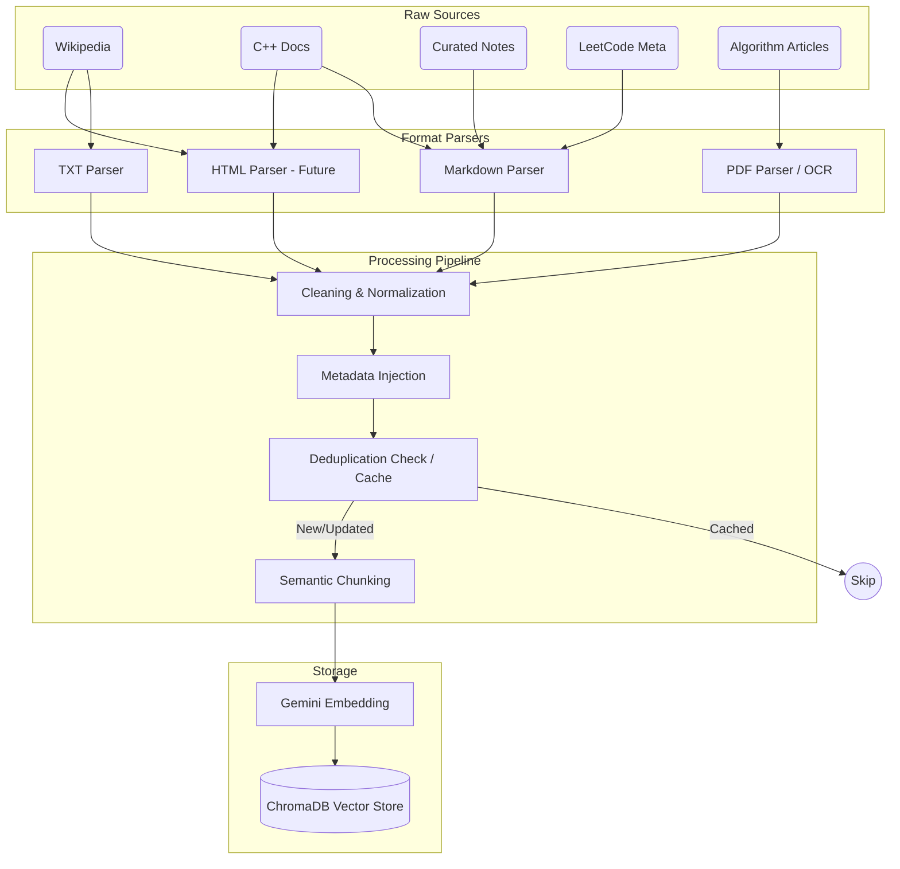
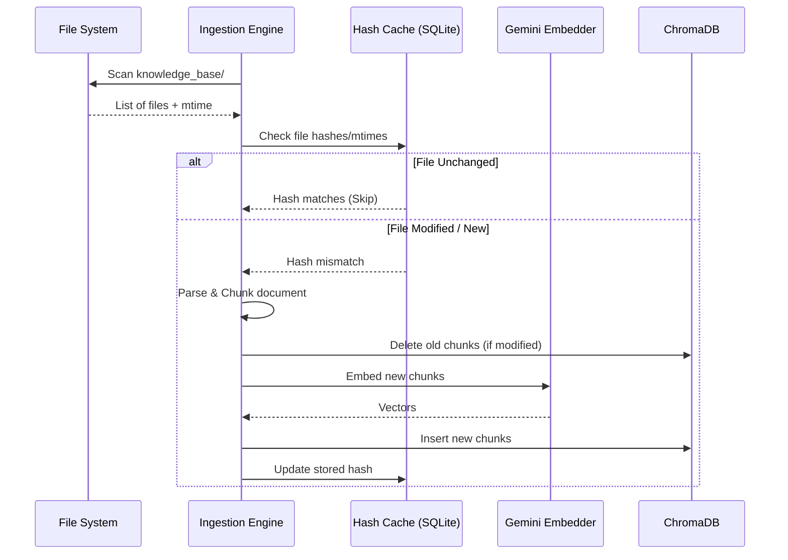

# Phase02/02_Document_Pipeline.md

**Author:** Principal AI Architect  
**Target System:** Automated DSA Educational YouTube Video Pipeline (RAG Ingestion)  
**Document Version:** 1.0.0  
**Status:** Canonical

---

# Table of Contents
1. [Executive Summary](#1-executive-summary)
2. [Ingestion Architecture](#2-ingestion-architecture)
3. [Supported File Formats](#3-supported-file-formats)
4. [Source Processing Strategies](#4-source-processing-strategies)
    - [Wikipedia](#41-wikipedia)
    - [C++ Documentation](#42-c-documentation)
    - [Curated Notes](#43-curated-notes)
    - [LeetCode Metadata](#44-leetcode-metadata)
    - [Algorithm Articles](#45-algorithm-articles)
5. [Deduplication & Versioning](#5-deduplication--versioning)
6. [Updates & Incremental Indexing](#6-updates--incremental-indexing)

---

# 1. Executive Summary

This document specifies the offline Document Ingestion Pipeline for the RAG Knowledge Base. The ingestion pipeline is responsible for taking raw educational materials across various formats (Markdown, PDF, TXT) and sources (Wikipedia, C++ Docs, Personal Notes), cleaning them, and indexing them incrementally into the local ChromaDB vector store. 

This process guarantees that the Script Generator has access to the highest-quality, noise-free algorithmic knowledge without hallucinating syntax or time complexities.

---

# 2. Ingestion Architecture

---

# 3. Supported File Formats

- **Markdown (`.md`)**: The primary format. Parsed semantically using LlamaIndex's `MarkdownNodeParser` (splits on headers).
- **PDF (`.pdf`)**: Used for academic papers and algorithmic textbooks. Parsed via PyMuPDF/LlamaParse. Requires heavy cleaning to remove headers/footers.
- **TXT (`.txt`)**: Fallback for raw text dumps. Parsed using a sliding window chunker with a 15% overlap.
- **HTML (`.html`)**: (Future) Will be routed through a `BeautifulSoup` cleaner to extract the main `<article>` body, discarding navigation and scripts.

---

# 4. Source Processing Strategies

Every source possesses unique noise profiles. The pipeline applies tailored cleaning and normalization strategies based on the source origin.

### 4.1 Wikipedia
*Source of broad algorithmic theory and historical context.*
- **Cleaning:** Strip citation brackets (e.g., `[1]`, `[citation needed]`), remove "See also" and "References" sections entirely.
- **Normalization:** Convert complex LaTeX math blocks into plaintext equivalents (e.g., `O(N \log N)` -> `O(N log N)`) for better LLM comprehension.
- **Metadata:** `{"source": "wikipedia", "url": "<canonical_url>", "topic": "<article_title>"}`

### 4.2 C++ Documentation (e.g., cppreference)
*Source of language-specific syntax, STL container complexities, and edge cases.*
- **Cleaning:** Remove site navigation, ad wrappers, and compiler-specific flags unless directly relevant to algorithmic efficiency.
- **Normalization:** Preserve all code blocks exactly. Ensure standard library namespaces (`std::`) are kept intact.
- **Metadata:** `{"source": "cppreference", "header": "<stl_header>", "cxx_standard": "c++17/20"}`

### 4.3 Curated Notes
*The author's personal insights, custom visual explanation templates, and YouTube script directives.*
- **Cleaning:** None. Assumed to be high-signal, clean Markdown.
- **Normalization:** Ensure hierarchical consistency (H1 for topic, H2 for subtopics).
- **Metadata:** `{"source": "author_notes", "confidence_weight": "high", "topic": "<folder_name>"}`

### 4.4 LeetCode Metadata
*Problem-specific hints, editorial solutions, and standard constraints.*
- **Cleaning:** Remove user comments, upvote/downvote metrics, and HTML formatting from legacy problem descriptions.
- **Normalization:** Map problem numbers to slugs. Standardize constraint formatting into bulleted lists.
- **Metadata:** `{"source": "leetcode_editorial", "problem_slug": "<slug>", "difficulty": "<difficulty>"}`

### 4.5 Algorithm Articles (GeeksForGeeks, CP-Algorithms, Academic Papers)
*Deep dives into advanced data structures (e.g., Segment Trees, Trie).*
- **Cleaning:** For PDFs, remove page numbers, headers, and footers. For web articles, strip promotional content and generic sidebars.
- **Normalization:** Extract and merge fragmented code snippets into continuous blocks where possible.
- **Metadata:** `{"source": "algorithm_article", "author": "<author_name>", "publisher": "<site_name>"}`

---

# 5. Deduplication & Versioning

To prevent ChromaDB from bloating with duplicate vectors (which skews retrieval results via redundant context):

1. **Document Hashing (Deduplication):** 
   - Every incoming file is hashed (SHA-256) at the document level prior to chunking.
   - The hash is stored in a local SQLite index tracking `(filepath, hash, chunk_ids)`.
   - If multiple sources contain identical algorithmic explanations (e.g., two identical code templates), LlamaIndex's insertion logic will deduplicate based on node-level text hashing.
2. **Document Versioning:** 
   - The knowledge base is version-controlled via Git (`data/knowledge_base/`).
   - The ingestion pipeline relies on the Git commit hash or file `mtime` (modified time) to identify the current version of a document.

---

# 6. Updates & Incremental Indexing

Re-embedding 10,000 algorithmic documents takes time and consumes Gemini API quota. The ingestion pipeline must be **incremental**.

### Incremental Strategy Rules:
1. **New Files:** Chunked, embedded, and added to ChromaDB. Hash is saved.
2. **Modified Files:** The previous hash is used to query the local SQLite cache for old `chunk_ids`. Those chunks are deleted from ChromaDB. The new file is parsed, embedded, and inserted.
3. **Deleted Files:** The pipeline detects missing files from the scan, looks up their `chunk_ids` in the cache, deletes them from ChromaDB, and removes the cache entry. 
4. **Execution:** Runs exclusively on demand via a CLI command (e.g., `python -m src.rag.ingest --incremental`) prior to a batch video generation run.
