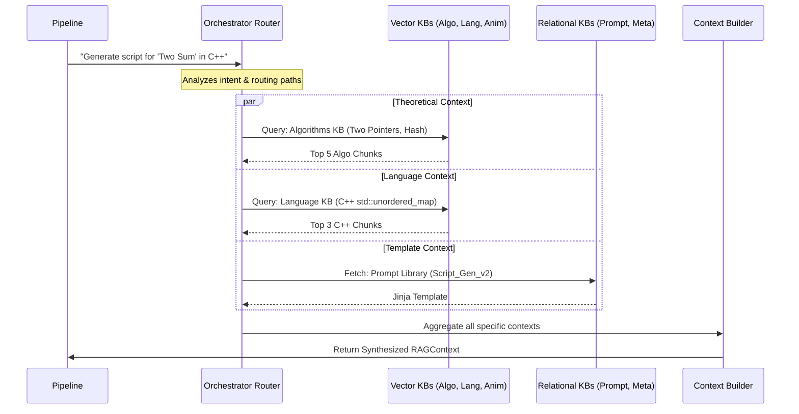
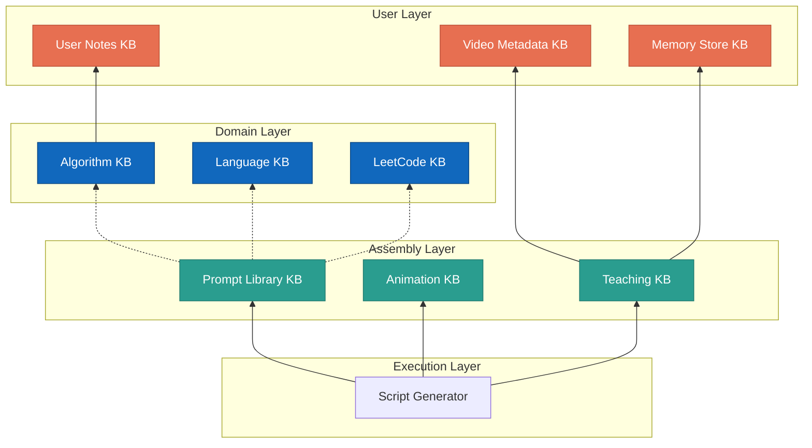

# Phase02/16_Multi_Knowledge_Base_Architecture.md

**Author:** Principal AI Architect  
**Target System:** Automated DSA Educational YouTube Video Pipeline (RAG Subsystem)  
**Document Version:** 1.0.0  
**Status:** Canonical

---

# Table of Contents
1. [Executive Summary](#1-executive-summary)
2. [Macro Architecture & Routing](#2-macro-architecture--routing)
3. [Knowledge Base Specifications](#3-knowledge-base-specifications)
   - [3.1 Algorithm Knowledge Base](#31-algorithm-knowledge-base)
   - [3.2 LeetCode Knowledge Base](#32-leetcode-knowledge-base)
   - [3.3 Programming Language Knowledge Base](#33-programming-language-knowledge-base)
   - [3.4 Animation Knowledge Base](#34-animation-knowledge-base)
   - [3.5 Teaching Knowledge Base](#35-teaching-knowledge-base)
   - [3.6 Prompt Library](#36-prompt-library)
   - [3.7 Memory Store](#37-memory-store)
   - [3.8 User Notes](#38-user-notes)
   - [3.9 Video Metadata](#39-video-metadata)
   - [3.10 Future Expansion](#310-future-expansion)
4. [Retrieval Orchestration](#4-retrieval-orchestration)
5. [Dependency Mapping](#5-dependency-mapping)

---

# 1. Executive Summary

As the RAG system scales to support complex YouTube automation, future interactive chatbots, and web APIs, a single monolithic vector collection becomes a catastrophic bottleneck. Context windows become polluted, retrieval precision plummets, and vector updates cause locking issues. 

This document defines a **Multi-Knowledge-Base Architecture**. By segregating knowledge domains into strictly defined, independent ChromaDB collections and SQL stores, the Retrieval Orchestrator can dynamically route queries only to the relevant domains. This guarantees high precision, infinite horizontal scalability, and strict contextual boundaries.

---

# 2. Macro Architecture & Routing

```mermaid
graph TD
    subgraph Client Requests
        A[YouTube Video Gen] 
        B[Future Chatbot] 
        C[Web API]
    end

    O[Retrieval Orchestrator / Query Router]

    A --> O
    B --> O
    C --> O

    subgraph Core Educational KBs
        K1[(Algorithms KB)]
        K2[(LeetCode KB)]
        K3[(Language KB)]
    end

    subgraph Production KBs
        K4[(Animation KB)]
        K5[(Teaching KB)]
        K6[(Prompt Library)]
    end

    subgraph State & User KBs
        K7[(Memory Store)]
        K8[(User Notes)]
        K9[(Video Metadata)]
    end

    O -->|Semantic Routing| Core Educational KBs
    O -->|Directive Routing| Production KBs
    O -->|State Lookups| State & User KBs
```

---

# 3. Knowledge Base Specifications

## 3.1 Algorithm Knowledge Base
- **Purpose:** Core theoretical CS concepts (Data Structures, Algorithms, Math Proofs).
- **Document Types:** Markdown files (Definitions, Big-O proofs, Pseudo-code).
- **Metadata:** `topic`, `pattern`, `complexity_class`, `prerequisites`.
- **Relationships:** Links to `LeetCode KB` (problems using this pattern) and `Language KB` (implementations).
- **Chunk Strategy:** Semantic chunking by H2/H3 headers.
- **Embedding Strategy:** Dense vector (Gemini `text-embedding-004`).
- **Retrieval Strategy:** Vector similarity + Cross-Encoder reranking.
- **Update Strategy:** Incremental offline updates via HashCache.
- **Versioning:** Git-tracked; strict single-source of truth.
- **Retention:** Permanent.
- **Backup:** Daily SQLite snapshots.
- **Future Growth:** Expansion to system design and advanced competitive programming math.

## 3.2 LeetCode Knowledge Base
- **Purpose:** Historical data of all LeetCode problems, editorial solutions, and constraints.
- **Document Types:** JSON, scraped HTML/Markdown, problem statements.
- **Metadata:** `slug`, `difficulty`, `company_tags`, `acceptance_rate`.
- **Relationships:** Links to `Algorithm KB`.
- **Chunk Strategy:** Problem-level chunking (one chunk = one full problem context).
- **Embedding Strategy:** Vector + Exact Match (SQLite).
- **Retrieval Strategy:** Direct slug lookup or similarity search for "find similar problems".
- **Update Strategy:** Nightly cron scrape via LeetCode API.
- **Versioning:** Collection versioned by schema changes.
- **Retention:** Permanent.
- **Backup:** Weekly snapshots.
- **Future Growth:** Integrating Codeforces and HackerRank datasets.

## 3.3 Programming Language Knowledge Base
- **Purpose:** Idiomatic syntax, standard library nuances, and language-specific "gotchas" (e.g., C++ STL, Python internals).
- **Document Types:** Markdown, raw `.cpp` / `.py` boilerplate files.
- **Metadata:** `language`, `version` (e.g., C++20), `library` (e.g., `<algorithm>`).
- **Relationships:** Depended on by `Algorithm KB`.
- **Chunk Strategy:** AST-aware code chunking (split by function/class).
- **Embedding Strategy:** Dense vector.
- **Retrieval Strategy:** Hard metadata filtering (e.g., `WHERE language="cpp"`).
- **Update Strategy:** Manual curated updates.
- **Versioning:** Tied to language versions (e.g., `cpp_17`, `cpp_20`).
- **Retention:** Permanent.
- **Backup:** Daily snapshots.
- **Future Growth:** Adding Java, Rust, and Go support.

## 3.4 Animation Knowledge Base
- **Purpose:** Manim-specific directives, color palettes, coordinate systems, and visual topology rules.
- **Document Types:** Markdown directives, Python Manim snippets.
- **Metadata:** `visual_concept` (e.g., "tree_traversal"), `color_scheme`, `manim_version`.
- **Relationships:** Used by the Script Generator for Visual Cues.
- **Chunk Strategy:** Fixed-size chunking with overlaps.
- **Embedding Strategy:** Vector.
- **Retrieval Strategy:** Top-K semantic match based on the algorithm being visualized.
- **Update Strategy:** Updated when Manim engine upgrades or channel branding changes.
- **Versioning:** Aggressive semantic versioning (v1, v2) to prevent breaking render pipelines.
- **Retention:** Permanent; old versions archived.
- **Backup:** Daily.
- **Future Growth:** Integration with 3D animation tools (Blender/ManimGL).

## 3.5 Teaching Knowledge Base
- **Purpose:** Pedagogical strategies, pacing, analogies, jokes, and audience engagement hooks.
- **Document Types:** Markdown.
- **Metadata:** `tone` (academic vs casual), `audience_level`, `retention_hook`.
- **Relationships:** Injected during Prompt Assembly.
- **Chunk Strategy:** Parent-Child semantic chunks.
- **Embedding Strategy:** Vector.
- **Retrieval Strategy:** Dynamic filtering based on desired video length and difficulty.
- **Update Strategy:** Modified based on YouTube audience retention analytics.
- **Versioning:** Standard.
- **Retention:** Permanent.
- **Backup:** Daily.
- **Future Growth:** Multilingual translation guides (Spanish, Hindi narration nuances).

## 3.6 Prompt Library
- **Purpose:** Centralized storage of tested LLM prompts.
- **Document Types:** Jinja2 templates (`.jinja`).
- **Metadata:** `agent_role`, `task`, `model_target` (e.g., `gemini-1.5-pro`).
- **Relationships:** Defines how other KBs are assembled.
- **Chunk Strategy:** No chunking; exact retrieval.
- **Embedding Strategy:** None (Relational SQL/Key-Value only).
- **Retrieval Strategy:** Key-based lookup.
- **Update Strategy:** A/B testing updates.
- **Versioning:** Semantic (v1.0, v1.1).
- **Retention:** Permanent.
- **Backup:** Git versioned.
- **Future Growth:** Dynamic prompt optimization via meta-LLMs.

## 3.7 Memory Store
- **Purpose:** Long-term context across multiple executions (e.g., "In the last video, we covered X, so let's reference it here").
- **Document Types:** JSON state graphs.
- **Metadata:** `session_id`, `video_id`, `timestamp`.
- **Relationships:** Links to `Video Metadata`.
- **Chunk Strategy:** JSON object serialization.
- **Embedding Strategy:** None (Graph/SQL based).
- **Retrieval Strategy:** Temporal queries (e.g., "Get last 3 videos made").
- **Update Strategy:** Append-only event sourcing.
- **Versioning:** N/A.
- **Retention:** 365 Days.
- **Backup:** Nightly database dumps.
- **Future Growth:** Personalized chatbot memory for individual users.

## 3.8 User Notes
- **Purpose:** Raw, unstructured observations dropped in by the human developer.
- **Document Types:** `.txt`, `.md`.
- **Metadata:** `author`, `date`, `tags`.
- **Relationships:** Overrides all other KBs if a conflict exists.
- **Chunk Strategy:** Recursive Character Text Splitter.
- **Embedding Strategy:** Vector.
- **Retrieval Strategy:** High-priority RRF boosting.
- **Update Strategy:** Real-time background sync.
- **Versioning:** Git.
- **Retention:** Permanent.
- **Backup:** Daily.
- **Future Growth:** Shared multi-user organizational knowledge.

## 3.9 Video Metadata
- **Purpose:** Historical record of published YouTube videos (Titles, Thumbnails, Retention graphs, CTR).
- **Document Types:** JSON.
- **Metadata:** `youtube_id`, `publish_date`, `views`.
- **Relationships:** Links to `Memory Store`.
- **Chunk Strategy:** Relational SQL rows.
- **Embedding Strategy:** None.
- **Retrieval Strategy:** SQL queries.
- **Update Strategy:** Polled from YouTube Data API weekly.
- **Versioning:** N/A.
- **Retention:** Permanent.
- **Backup:** Nightly.
- **Future Growth:** Predictive analytics for thumbnail success.

## 3.10 Future Expansion KBs
As the ecosystem expands, the architecture will seamlessly integrate:
- **Voice/Audio KB:** Pronunciation guides for niche CS terms for TTS engines.
- **Chatbot Rules KB:** Guardrails and safety instructions for public-facing APIs.
- **Website KB:** Next.js component mappings for auto-generating blog posts alongside videos.

---

# 4. Retrieval Orchestration

A single user request cannot blindly query all 9 databases. The **Retrieval Orchestrator** uses an LLM-based *Router* (or deterministic rules) to direct traffic.

### Data Flow Execution


### Routing Logic
- **Hard Constraints:** If `target_language == "cpp"`, the Router completely skips querying the Java or Python partitions of the Language KB.
- **Dynamic Weighting:** For a "Hard" problem, the Router pulls heavily (70%) from the Algorithm KB. For an "Easy" problem, it pulls more heavily (60%) from the Teaching & Animation KBs to make basic content visually engaging.

---

# 5. Dependency Mapping

Knowledge Bases are not isolated islands; they rely on a strict hierarchy of dependencies to form a cohesive video script.



*Note: The Execution Layer depends on the Assembly Layer, which dynamically pulls from the Domain Layer, which is continuously influenced and overridden by the User Layer.*
