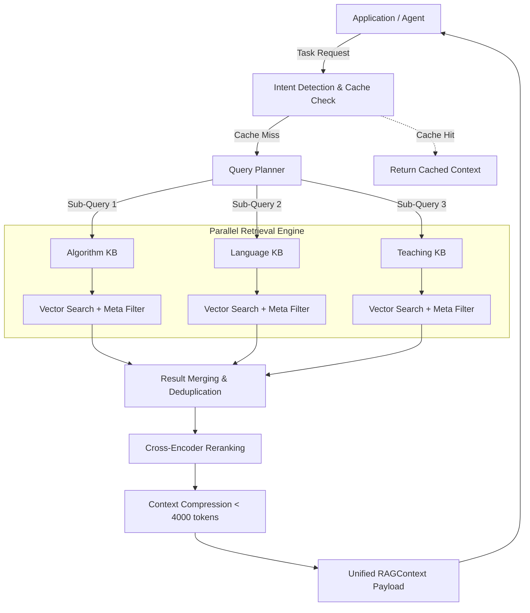

# Phase02/17_Retrieval_Orchestrator.md

**Author:** Principal AI Architect  
**Target System:** Automated DSA Educational YouTube Video Pipeline (RAG Subsystem)  
**Document Version:** 1.0.0  
**Status:** Canonical

---

# Table of Contents
1. [Executive Summary](#1-executive-summary)
2. [Core Responsibilities](#2-core-responsibilities)
3. [Task-Based Routing Logic](#3-task-based-routing-logic)
4. [The Orchestration Pipeline](#4-the-orchestration-pipeline)
5. [Advanced Mechanics (Confidence & Failure)](#5-advanced-mechanics)
6. [Future Extensibility & Plugin Support](#6-future-extensibility)

---

# 1. Executive Summary

The **Retrieval Orchestrator** is the centralized brain of the Multi-Knowledge-Base architecture. Application modules (like the Script Generator or the SEO Generator) do not query ChromaDB directly. Instead, they issue a "Task Intent" to the Orchestrator. The Orchestrator plans the query, selects the appropriate vector and relational databases, executes parallel retrievals, and synthesizes a unified `RAGContext` payload. This decouples the AI generation layer from the complexities of vector math and database management.

---

# 2. Core Responsibilities

The Orchestrator manages the entire lifecycle of a retrieval event:

- **Intent Detection:** Parses the incoming request to determine the goal (e.g., "Is this a request for C++ code, or a request for a YouTube title?").
- **Query Planning:** Breaks a complex intent down into sub-queries.
- **Knowledge Base Selection:** Routes sub-queries to specific KBs (e.g., `Algorithm KB` vs `Prompt Library`).
- **Metadata Filtering:** Constructs exact-match SQLite `WHERE` clauses (e.g., `language == cpp`) before executing vector searches.
- **Hybrid Search:** Combines dense vector similarity with explicit metadata keyword matching.
- **Parallel Retrieval:** Spawns asynchronous tasks to query multiple KBs simultaneously.
- **Result Merging:** Aggregates hits from 5 different KBs into a single raw list.
- **Deduplication:** Uses Parent-Child chunk resolution to remove identical text blocks.
- **Ranking:** Passes the merged list through a local ONNX `int8` Cross-Encoder to guarantee the absolute best chunks bubble to the top.
- **Context Compression:** Strictly enforces the 4,000-token limit by dropping low-scoring chunks.
- **Confidence Scoring:** Calculates an aggregate score representing how "sure" the system is that it found the right context.
- **Caching:** Hits the local SQLite cache before ever invoking the Gemini embedding API.
- **Failure Recovery:** Implements graceful degradation if a specific KB goes offline or the LLM query rewriter fails.
- **Future Plugin Support:** Exposes interfaces for new Retrieval tools (e.g., a Web Search plugin or GitHub API plugin).

---

# 3. Task-Based Routing Logic

When the Orchestrator receives a task, it dynamically selects which KBs to search. 

| Task | Primary KB | Secondary KBs | Ignored KBs |
|---|---|---|---|
| **Generate Script** | `Algorithm KB` | `Language KB`, `Teaching KB`, `LeetCode KB` | `Video Metadata` |
| **Generate Animation** | `Animation KB` | `Algorithm KB` | `Language KB`, `SEO` |
| **Generate Narration** | `Teaching KB` | `Algorithm KB`, `Memory Store` | `Animation KB` |
| **Generate Thumbnail** | `Video Metadata`| `Animation KB` | `Language KB` |
| **Generate SEO / Title**| `Video Metadata`| `User Notes`, `LeetCode KB` | `Language KB`, `Animation` |
| **Generate Description**| `LeetCode KB` | `Memory Store` (for cross-links) | `Language KB` |
| *Future: Chatbot Q&A* | `User Notes` | All Core KBs | N/A |

### Routing Example: "Generate Animation"
If the Video Assembler requests an animation for a "Sliding Window" problem:
1. The Orchestrator routes **Query A** to the `Algorithm KB` to fetch the topological definition of a sliding window.
2. It routes **Query B** to the `Animation KB` to fetch the specific Manim color codes and `UpdateFromFunc` syntax required to animate rectangles.
3. It entirely ignores the `Language KB` because C++ syntax is irrelevant to drawing a rectangle in Manim.

---

# 4. The Orchestration Pipeline

### 4.1 Query Planning & Execution
The Query Planner (powered by an LLM or deterministic regex) splits the intent. 
*Example:* `intent="Generate C++ Script for Dijkstra"` becomes:
- `Query_1 (Algo KB): "Dijkstra shortest path theory"`
- `Query_2 (Lang KB): "C++ priority_queue syntax"`

These are fired asynchronously using `asyncio.gather()` to ensure fetching from 3 databases takes the exact same amount of time as fetching from 1 database (approx `~250ms`).

---

# 5. Advanced Mechanics

### 5.1 Confidence Scoring
The Orchestrator calculates a `ConfidenceScore` (0.0 to 1.0) based on the highest Cross-Encoder score returned from the merged pool. 
- If `Confidence < 0.45`: The Orchestrator flags a `LowConfidenceWarning`. The Script Generator can use this flag to instruct the LLM: *"The retrieved context might be weak; rely on your internal base weights if the context makes no sense."*

### 5.2 Failure Recovery
If the `Animation KB` ChromaDB instance becomes corrupted or inaccessible:
- The Orchestrator catches the connection error.
- It logs a `WARNING` to the central structlog.
- It immediately routes around the failure, returning the context from the `Algorithm KB` and silently dropping the Animation context, allowing the pipeline to generate a video (albeit with slightly more generic animations) rather than crashing entirely.

---

# 6. Future Extensibility & Plugin Support

The Orchestrator is designed using the **Strategy Pattern**, allowing new retrieval endpoints to be plugged in without touching the core routing logic.

### 6.1 Future Chatbot Integration
When a YouTube viewer asks a question in the comments, the future Chatbot will issue a `Task: Q&A` to the Orchestrator. The Orchestrator will route this to the `User Notes` and `Algorithm KB` to construct a reply.

### 6.2 External Plugin Support
Future versions of the Orchestrator will support dynamic tool plugins:
- **Web Search Plugin:** If the `ConfidenceScore` drops below `0.3` (meaning the local KBs don't know the answer), the Orchestrator can seamlessly route a fallback query to a Web Search API (like Tavily or DuckDuckGo), scrape the top 3 results, embed them in-memory, and merge them into the final `RAGContext`.
