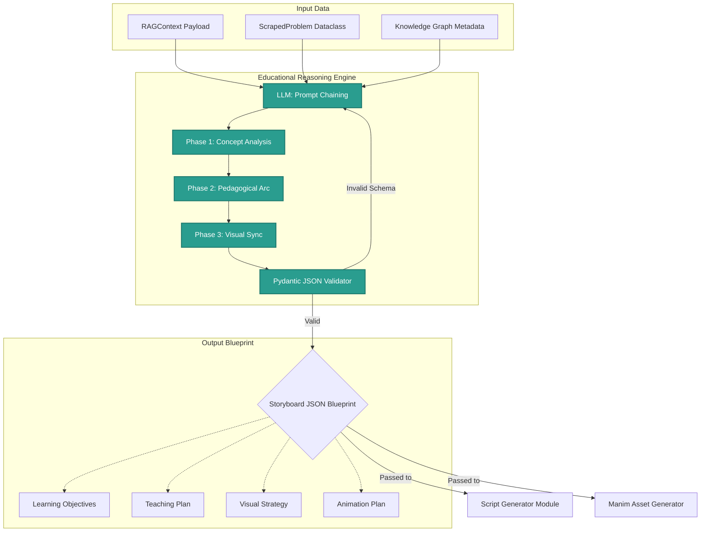

# Phase02/19_Educational_Reasoning.md

**Author:** Principal AI Architect  
**Target System:** Automated DSA Educational YouTube Video Pipeline (Reasoning Subsystem)  
**Document Version:** 1.0.0  
**Status:** Canonical

---

# Table of Contents
1. [Executive Summary](#1-executive-summary)
2. [Core Responsibilities](#2-core-responsibilities)
3. [The Reasoning Pipeline (Chain-of-Thought)](#3-the-reasoning-pipeline-chain-of-thought)
4. [Structured Outputs](#4-structured-outputs)
5. [Architecture & Data Flow Diagrams](#5-architecture--data-flow-diagrams)

---

# 1. Executive Summary

While the Retrieval Orchestrator (Module 17) is excellent at fetching data, dumping raw context directly into a Script Generation LLM often results in a disjointed, Wikipedia-style lecture. 

To bridge this gap, the pipeline introduces the **Educational Reasoning Engine**. Sitting squarely between the Retrieval Orchestrator and the Script Generator, this LLM-powered engine acts as a "Master Teacher" and "Director." It analyzes the retrieved facts, the LeetCode problem, and the Knowledge Graph, and deliberately *reasons* about how to teach the concept to a human. It outputs a highly structured Storyboard JSON that dictates the exact pedagogical flow, pacing, and visual strategy the Script Generator must follow.

---

# 2. Core Responsibilities

The Reasoning Engine shifts the system from *information retrieval* to *instructional design*. Its responsibilities include:

1. **Determine Learning Objectives:** What are the 3 core takeaways the viewer must master by the end of the video?
2. **Determine Prerequisite Concepts:** Based on the graph, what must be quickly reviewed (e.g., "Before we talk about topological sort, let's remember what a directed edge is")?
3. **Determine Explanation Order:** Should the theory come first, or should we jump straight into a brute-force example to show why the theory is needed?
4. **Determine Pacing:** For a "Hard" problem, allocate 40% of the video to the theoretical proof. For an "Easy" problem, allocate 10% to theory and 70% to coding.
5. **Determine Analogies:** Select the most impactful real-world analogy from the retrieved context.
6. **Determine Examples:** Pick a specific array/graph trace example (e.g., `[2, 7, 11, 15]`) to animate.
7. **Determine Animation Ideas:** Decide when the screen needs a Manim diagram vs. when it just needs syntax highlighting.
8. **Determine Misconceptions:** Identify the most common interview pitfalls to explicitly warn the viewer about.
9. **Determine Emphasis:** Highlight exactly which lines of code (e.g., the `while` loop condition) are the crux of the algorithm.
10. **Determine Recap:** Synthesize a 15-second outro summarizing the complexities and linking to the successor concept.

---

# 3. The Reasoning Pipeline (Chain-of-Thought)

The Engine executes a sequential, prompt-chained reasoning process. It forces the LLM to "think out loud" before finalizing the instructional design.

### Phase 1: Audience & Concept Analysis
The LLM ingests the `RAGContext` and the `ScrapedProblem`. It analyzes the target audience (e.g., "Beginners struggling with Dynamic Programming"). It identifies the cognitive load required to understand the state-transition formula.

### Phase 2: Structural Planning
The Engine decides the narrative arc. If the problem is an optimization problem (like Knapsack), the Engine explicitly decides to start by visualizing the brute-force exponential recursion tree, point out the overlapping subproblems, and *then* introduce memoization. This "Problem -> Agony -> Solution" narrative is planned here.

### Phase 3: Visual-Pedagogical Sync
The Engine maps out *how* the Manim visual engine will support the narrative. It reasons: *"When I explain the left pointer moving, the animation must highlight the pointer in RED and fade the discarded array elements to GREY."*

---

# 4. Structured Outputs

The Reasoning Engine terminates by generating a massive, strictly typed JSON payload (validated via Pydantic). This payload becomes the blueprint for the rest of the pipeline.

### 4.1 The Blueprint Object
- **`Learning Objectives`**: Array of 3 string goals.
- **`Teaching Plan`**: The narrative arc (e.g., Hook -> Brute Force -> Intuition -> Optimal -> Code -> Complexity).
- **`Visual Strategy`**: A global theme for the Manim generator (e.g., "Use a 2D grid representation with active cells in BLUE").
- **`Animation Plan`**: Specific triggers mapped to script sections.
- **`Storyboard JSON`**: The primary sequence array.

### 4.2 Example Storyboard JSON Snippet
```json
{
  "section": "INTUITION_BUILDING",
  "pacing_weight": 0.35,
  "explanation_order": ["Analogy", "Visual_Trace", "Formula"],
  "analogy_to_use": "Sliding a physical window frame over a row of numbered blocks.",
  "emphasis_point": "The window only shrinks when the sum exceeds the target.",
  "misconception_to_address": "Do not reset the left pointer to zero; it only moves forward.",
  "animation_directive": "Create an array [2,3,1,2,4,3]. Draw a bounding box from index L to R."
}
```
*Note: The Script Generator (Module 4) takes this exact JSON block and writes the actual spoken words to fulfill these directives.*

---

# 5. Architecture & Data Flow Diagrams


