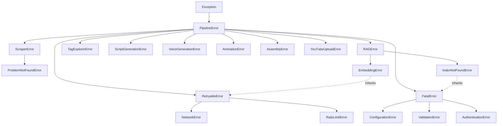

# Phase03/06_Exception_Framework.md

**Author:** Principal Software Architect  
**Target System:** Automated DSA Educational YouTube Video Pipeline  
**Document Version:** 1.0.0  
**Status:** Implemented

---

# Table of Contents
1. [Executive Summary](#1-executive-summary)
2. [Inheritance Diagram](#2-inheritance-diagram)
3. [Source Code: `src/core/exceptions.py`](#3-source-code-srccoreexceptionspy)
4. [Design Decisions](#4-design-decisions)
5. [Usage Examples](#5-usage-examples)

---

# 1. Executive Summary

This document establishes the centralized Exception Framework for the pipeline. Instead of relying on generic Python built-ins like `ValueError` or `RuntimeError`, this system defines a strict, semantic taxonomy of errors. 

Crucially, the hierarchy introduces operational behavior via inheritance (e.g., `RetryableError` vs `FatalError`). This allows the Pipeline Orchestrator and the upcoming `@retry` decorator to automatically determine whether to retry an operation, gracefully degrade, or halt execution entirely, simply by catching the correct base class.

---

# 2. Inheritance Diagram



---

# 3. Source Code: `src/core/exceptions.py`

```python
"""
Centralized Exception Hierarchy for the Pipeline.

All custom exceptions inherit from PipelineError. They are further classified
by their operational impact (RetryableError vs FatalError) and their originating
module (ScraperError, RAGError, etc.).
"""

# ==========================================
# 1. Base Exception
# ==========================================

class PipelineError(Exception):
    """Base exception for all pipeline errors."""
    pass


# ==========================================
# 2. Operational Classifications
# ==========================================

class RetryableError(PipelineError):
    """
    Indicates a transient error (e.g., network timeout) that may succeed 
    if the operation is retried after a delay.
    """
    pass


class FatalError(PipelineError):
    """
    Indicates an unrecoverable error (e.g., bad credentials) that must 
    halt the pipeline immediately. Do not retry.
    """
    pass


# ==========================================
# 3. Infrastructure & Core Errors
# ==========================================

class ConfigurationError(FatalError):
    """Raised when environment variables or config files are missing/invalid."""
    pass


class ValidationError(FatalError):
    """Raised when data fails strict schema validation (e.g., bad LLM JSON output)."""
    pass


class NetworkError(RetryableError):
    """Raised for timeouts or transient TCP/HTTP connection issues."""
    pass


class AuthenticationError(FatalError):
    """Raised when API keys, OAuth tokens, or session cookies are rejected."""
    pass


class RateLimitError(RetryableError):
    """Raised when a 429 Too Many Requests response is encountered."""
    pass


# ==========================================
# 4. Module-Specific Exceptions
# ==========================================

# -- Module 1: Scraper --
class ScraperError(PipelineError):
    """Base exception for the LeetCode Scraper module."""
    pass

class ProblemNotFoundError(ScraperError, FatalError):
    """Raised when the requested LeetCode slug does not exist (404)."""
    pass

# -- Module 2: Tag Explorer --
class TagExplorerError(PipelineError):
    """Base exception for the Tag Explorer module."""
    pass

# -- Module 3: RAG Engine --
class RAGError(PipelineError):
    """Base exception for the RAG Knowledge Engine."""
    pass

class IndexNotFoundError(RAGError, FatalError):
    """Raised when the ChromaDB index is missing and cannot be built automatically."""
    pass

class EmbeddingError(RAGError, RetryableError):
    """Raised when the vector embedding API fails transiently."""
    pass

class KnowledgeConflictError(RAGError, FatalError):
    """Raised when the KB Linter detects contradictory facts in the Markdown files."""
    pass

# -- Module 4: Script Generator --
class ScriptGenerationError(PipelineError):
    """Base exception for the Script Generator module."""
    pass

# -- Module 5: Voice Generation --
class VoiceGenerationError(PipelineError):
    """Base exception for the Voice module (Kokoro TTS)."""
    pass

# -- Module 6: Animation Engine --
class AnimationError(PipelineError):
    """Base exception for the Manim Animation module."""
    pass

# -- Module 7: Video Assembly --
class AssemblyError(PipelineError):
    """Base exception for the FFmpeg Video Assembly module."""
    pass

# -- Module 8: YouTube Upload --
class YouTubeUploadError(PipelineError):
    """Base exception for the YouTube Uploader module."""
    pass
```

---

# 4. Design Decisions

1. **Semantic Broad Catching:** Because everything inherits from `PipelineError`, the `__main__.py` entry point can wrap the entire execution block in a `except PipelineError as e:` block. This guarantees we catch our own controlled errors while allowing actual Python bugs (`TypeError`, `KeyError`) to blow up with a full stack trace.
2. **Multiple Inheritance for Behavior:** Notice how `EmbeddingError` inherits from both `RAGError` (identifying *where* it failed) and `RetryableError` (identifying *how* to handle it). This is incredibly powerful. The Retry Decorator only needs to check `if isinstance(e, RetryableError):` without needing to maintain a massive list of every specific network exception in the codebase.
3. **No Magic Strings:** Instead of checking `if "404" in str(e):`, developers can now use explicit `try/except ProblemNotFoundError` blocks.

---

# 5. Usage Examples

### Example A: The Retry Decorator (Preview)
```python
def execute_with_retry(func):
    try:
        return func()
    except RetryableError as e:
        logger.warning("Transient failure, retrying...", error=str(e))
        # trigger retry logic
    except FatalError as e:
        logger.error("Unrecoverable error. Halting.", error=str(e))
        sys.exit(1)
```

### Example B: Throwing Semantic Errors
```python
from src.core.exceptions import AuthenticationError, RateLimitError

def fetch_leetcode_data(slug: str):
    response = requests.get(url)
    
    if response.status_code == 403:
        raise AuthenticationError("LeetCode session cookie expired.")
        
    if response.status_code == 429:
        raise RateLimitError("Hit LeetCode rate limit. Backing off.")
```
