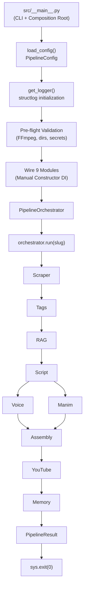
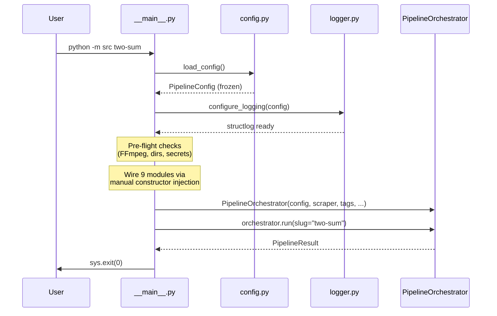
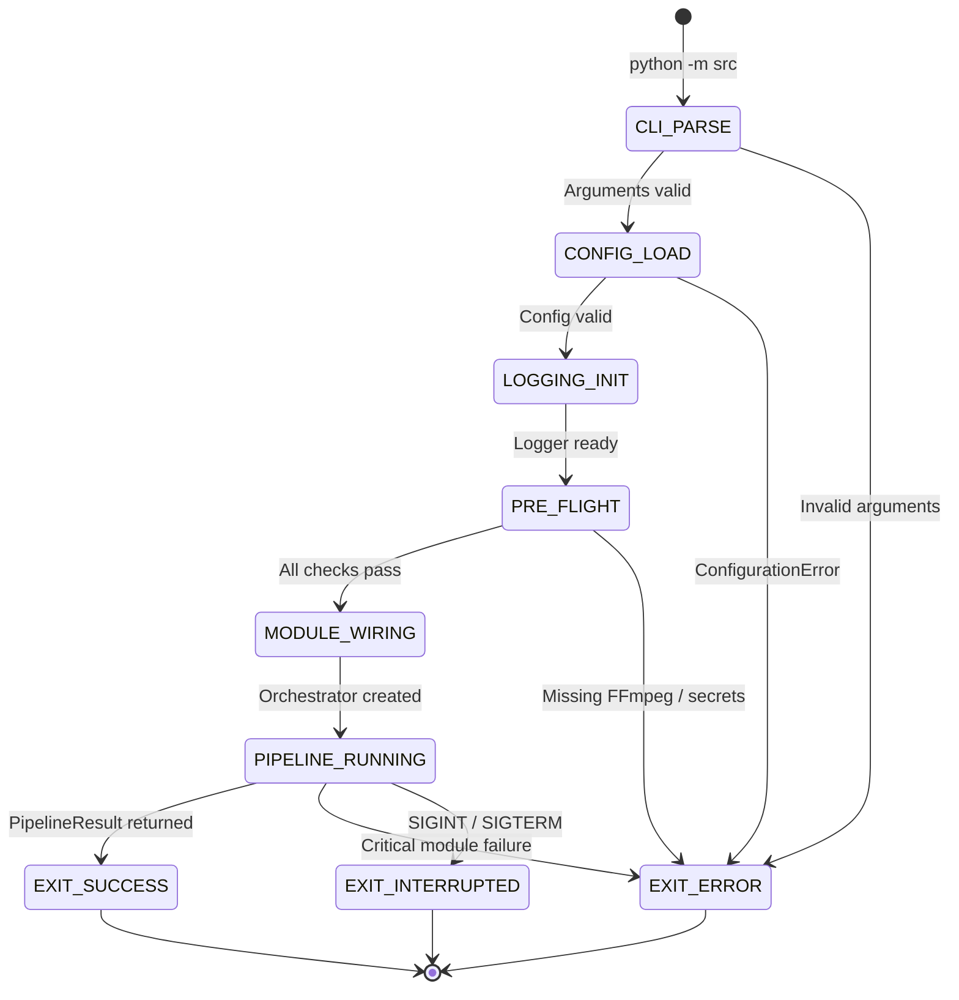

# Phase04/01_Runtime_Architecture.md

**Author:** Principal Software Architect  
**Target System:** Automated DSA Educational YouTube Video Pipeline  
**Target Environment:** Intel Core Ultra 7 155H · Ubuntu 25.10 LTS · Python 3.12 · Intel Arc GPU  
**Document Version:** 2.0.0  
**Last Updated:** July 2026  
**Status:** Canonical — Supersedes v1.0.0 after architectural audit.

---

# Table of Contents
1. [Executive Summary](#1-executive-summary)
2. [Architectural Alignment Statement](#2-architectural-alignment-statement)
3. [What the Runtime Is — And Is Not](#3-what-the-runtime-is--and-is-not)
4. [Runtime Responsibilities](#4-runtime-responsibilities)
5. [Architecture & Component Design](#5-architecture--component-design)
6. [Startup Sequence](#6-startup-sequence)
7. [Shutdown Sequence](#7-shutdown-sequence)
8. [Error Handling](#8-error-handling)
9. [Visualizations](#9-visualizations)
10. [Appendix A: v1.0 → v2.0 Change Log](#appendix-a-v10--v20-change-log)

---

# 1. Executive Summary

This document specifies the design of the **Application Runtime** — the master entry point that bootstraps all foundational systems, wires dependencies, executes the pipeline, and performs graceful teardown.

The Runtime is a **thin, synchronous orchestration shell**. It contains zero business logic. It exists to:
1. Load configuration from `.env` and `config/pipeline.yaml`.
2. Initialize structured logging with a unique `pipeline_run_id`.
3. Wire all 9 pipeline modules into the `PipelineOrchestrator` via manual constructor injection.
4. Run the orchestrator for a given LeetCode slug.
5. Handle OS signals (`SIGINT`, `SIGTERM`) for graceful interruption.
6. Flush logs and exit with the correct exit code.

> [!IMPORTANT]
> This document has been rewritten from v1.0.0 to v2.0.0 to correct systemic architectural violations. See [Appendix A](#appendix-a-v10--v20-change-log) for the complete change log.

---

# 2. Architectural Alignment Statement

This document is governed by the following canonical decisions from `02_Project_Architecture.md`:

| Canonical Decision | Architecture Section | This Document's Compliance |
|---|---|---|
| **Sequential batch pipeline, not event-driven** | §2.2 | ✅ No Event Bus, no pub/sub, no message queues |
| **Manual DI with single composition root** | Decision 4 (§15), §11.2–§11.3 | ✅ `src/__main__.py` is the only composition root |
| **No DI framework** | §11.3 Rule 1 | ✅ No `Container`, `Scope`, or `ResolverProtocol` classes |
| **Frozen dataclasses, not Pydantic** | Decision 5 (§15), §17.6 | ✅ All config/models use `@dataclass(frozen=True)` |
| **No plugin discovery / dynamic loading** | §17.8 | ✅ No `PluginManager`, no `src/plugins/` directory |
| **No async/await throughout** | §17.2 | ✅ Synchronous execution; individual pipeline modules are strictly synchronous. Step parallelism (such as parallel Voice ∥ Manim execution in Vector 2) is handled via thread-based execution (`concurrent.futures.ThreadPoolExecutor` or `ThreadPool`) inside `PipelineOrchestrator`. `asyncio` is NOT used anywhere in the runtime or orchestrator shell. |
| **No task queues / message brokers** | §17.4 | ✅ No DLQ, no priority queues, no event routing |
| **Orchestrator drives the pipeline** | §1, §2.2 | ✅ `PipelineOrchestrator.run()` is the master control flow |
| **structlog for logging** | Decision 6 (§15), §9 | ✅ `get_logger(__name__)` from `src/core/logger.py` |
| **`src/core/` has 7 files only** | §6, `04_Folder_Structure.md` §5 | ✅ No new files added to `src/core/` |

---

# 3. What the Runtime Is — And Is Not

### ✅ What It Is

- The **composition root** — the single place where concrete classes are imported and wired.
- The **CLI entry point** — parses command-line arguments (slug, flags like `--force-regenerate`).
- The **signal handler** — catches `SIGINT`/`SIGTERM` and triggers graceful shutdown.
- The **log bootstrapper** — initializes `structlog` with `pipeline_run_id` context before any module runs.
- The **config loader** — calls `load_config()` exactly once and passes the result downstream.

### ❌ What It Is NOT

| Concept | Why It's Excluded | Canonical Reference |
|---|---|---|
| DI Container class with `register()` / `resolve()` | Manual injection is explicit and sufficient for 9 modules | Architecture §11.3 |
| Event Bus / Dead Letter Queue | System is a batch pipeline, not an event-driven system | Architecture §2.2, §17.4 |
| Plugin Manager / Plugin SDK | Dynamic loading is explicitly avoided; modules are hardcoded in the composition root | Architecture §17.8 |
| Workflow Engine / YAML pipeline parser | The pipeline sequence is hardcoded in `PipelineOrchestrator`; there is no declarative workflow DSL | Architecture §2.2 |
| `asyncio` event loop | Individual pipeline modules are strictly synchronous. Step parallelism (Voice ∥ Manim) is handled via thread-based execution (`ThreadPoolExecutor` or `ThreadPool`) inside `PipelineOrchestrator`. `asyncio` is NOT used anywhere in the runtime or orchestrator shell. | Architecture §17.2 |
| Pydantic `BaseModel` / `.model_dump()` | All models are frozen dataclasses with manual JSON serialization | Architecture §17.6 |
| Hot-reload / `ConfigManager` with profiles | Config is loaded once at startup, immutable thereafter | Architecture §8.4 Rule 1 |
| `psutil` / Prometheus / Grafana metrics | Not in the technology stack; observability is via `structlog` JSON logs | Architecture Appendix A |
| Health Monitor / `HealthStatus` | Pre-flight checks are implemented as a standalone synchronous helper function `run_preflight_checks(config: PipelineConfig)` called directly in `src/__main__.py` right after logger configuration and before module instantiation | Architecture §8.4 Rule 5 |

---

# 4. Runtime Responsibilities

### 4.1 Responsibility Breakdown

| # | Responsibility | Owner | Implementation |
|---|---|---|---|
| 1 | Parse CLI arguments | `src/__main__.py` | `argparse` or simple arg parsing |
| 2 | Load configuration | `src/core/config.py` | `load_config()` → `PipelineConfig` |
| 3 | Initialize structured logging | `src/core/logger.py` | `get_logger()` with `pipeline_run_id` context |
| 4 | Wire concrete implementations | `src/__main__.py` | Manual constructor injection |
| 5 | Run the pipeline | `src/orchestrator/pipeline.py` | `PipelineOrchestrator.run(slug)` |
| 6 | Handle OS signals | `src/__main__.py` | `signal.signal(SIGINT, handler)` |
| 7 | Exit with correct code | `src/__main__.py` | POSIX exit codes: 0 (success), 1 (fatal error), 130 (SIGINT interruption) |

### 4.2 Ownership Boundaries

The Runtime **does NOT own**:
- Module lifecycle (modules are stateless callables; the orchestrator manages sequencing).
- Retry logic (`src/core/retry.py` decorator, applied within modules).
- Checkpointing (`src/orchestrator/checkpoint.py`).
- Caching (`src/core/cache.py`, used by individual modules).
- Error recovery (the orchestrator decides whether to continue or halt based on module criticality).

### 4.3 Observability & Structured Metric Logging

The runtime avoids custom metric registries, Prometheus collectors, or background telemetry agents. Observability is achieved entirely through structured `structlog` log events with context bindings:

1. **Execution Timing**: Step and total execution timings are measured using standard Python `time.perf_counter()` inside `PipelineOrchestrator`.
2. **Structured Log Key Conventions**: Stage completion events emit structured JSON key-value pairs:
   ```python
   logger.info(
       "stage_completed",
       stage="voice",
       duration_sec=round(elapsed, 3),
       run_id=context.pipeline_run_id,
   )
   ```
3. **Retry Logging**: Transient error retries managed by the `@retry` decorator emit `warning` log events containing structured diagnostic fields:
   ```python
   logger.warning(
       "stage_retry",
       stage="scraper",
       attempt=attempt_number,
       delay=delay_seconds,
       exception=str(exc),
   )
   ```

---

# 5. Architecture & Component Design

The Runtime aligns with the canonical 4-layer architecture:

```
┌─────────────────────────────────────────────────────┐
│  Layer 4: ENTRY POINTS                              │
│  src/__main__.py (Composition Root + CLI)            │
│  src/orchestrator/pipeline.py (Pipeline Coordinator) │
├─────────────────────────────────────────────────────┤
│  Layer 3: PIPELINE MODULES                          │
│  Scraper · Tags · RAG · Script · Voice ·            │
│  Manim · Assembly · YouTube · Memory                │
├─────────────────────────────────────────────────────┤
│  Layer 2: SHARED SERVICES                           │
│  config.py · logger.py · cache.py · retry.py ·      │
│  serialization.py · exceptions.py · paths.py        │
├─────────────────────────────────────────────────────┤
│  Layer 1: DOMAIN MODELS                             │
│  Dataclasses · Enums · Protocols                    │
└─────────────────────────────────────────────────────┘
```

### Component Inventory

| Component | File | Canonical Source |
|---|---|---|
| CLI + Composition Root | `src/__main__.py` | Architecture §11.2 |
| Pipeline Orchestrator | `src/orchestrator/pipeline.py` | Architecture §2.1, §3.10 |
| Checkpoint Manager | `src/orchestrator/checkpoint.py` | Architecture §5.2 |
| Configuration | `src/core/config.py` | Architecture §8 |
| Logging | `src/core/logger.py` | Architecture §9 |
| File Cache | `src/core/cache.py` | Architecture §5.1 |
| Retry Decorator | `src/core/retry.py` | Architecture §10.2 Rule 4 |
| Serialization | `src/core/serialization.py` | Architecture §5.3 |
| Exception Hierarchy | `src/core/exceptions.py` | Architecture §10.1 |
| Path Utilities | `src/core/paths.py` | Architecture §6 |

No additional files in `src/core/` are introduced by this Runtime specification.

---

# 6. Startup Sequence

The startup sequence is **strictly sequential** and **synchronous**:

```
1. Parse CLI arguments (slug, --force-regenerate, --dry-run)
         │
         ▼
2. load_config() → PipelineConfig (frozen dataclass)
   ├── Read .env (secrets: API keys, session cookies)
   ├── Read config/pipeline.yaml (runtime parameters)
   ├── Validate all fields (raise ConfigurationError on invalid)
   └── Return immutable PipelineConfig
         │
         ▼
3. Initialize structlog (bind pipeline_run_id, log_level from config)
         │
         ▼
4. Pre-flight validation (`run_preflight_checks(config: PipelineConfig)`)
   ├── Standalone synchronous helper function executed directly in `src/__main__.py` right after logger configuration and before module instantiation
   ├── Binary availability check on OS `PATH`: `shutil.which("ffmpeg")` (raises `ConfigurationError` immediately on failure)
   ├── Data directory existence/writeability check: `ensure_dir()` for all required paths (raises `ConfigurationError` immediately on failure)
   └── Essential API secret presence check in `config` (raises `ConfigurationError` immediately on failure to enforce fail-fast behavior)
         │
         ▼
5. Wire all 9 module implementations in `src/__main__.py` (manual constructor injection)
   All 9 concrete components implement discrete layer protocols and are explicitly instantiated with their sub-configuration object and logger:
   ├── `LeetCodeScraper(config.scraper, logger)` — Scraper protocol
   ├── `GeminiTagExplorer(config.tags, logger)` — Tag knowledge protocol
   ├── `ChromaRAGEngine(config.rag, logger)` — RAG engine protocol
   ├── `GeminiScriptGenerator(config.script, logger)` — Script generator protocol
   ├── `KokoroVoiceSynthesizer(config.voice, logger)` — Voice synthesizer protocol
   ├── `ManimAnimationRenderer(config.animation, logger)` — Animation renderer protocol
   ├── `FFmpegVideoAssembler(config.assembly, logger)` — Video assembler protocol
   ├── `YouTubeAPIUploader(config.youtube, logger)` — Video uploader protocol
   └── `JSONMemoryStore(config.memory, logger)` — Memory store protocol
         │
         ▼
6. Inject all modules into PipelineOrchestrator
         │
         ▼
7. orchestrator.run(slug=args.slug)
```

### Startup Invariants

- **Config is loaded once.** No hot-reload. No runtime overrides. (`02_Project_Architecture.md` §8.4 Rule 1)
- **Fail fast on configuration errors.** `ConfigurationError` halts startup immediately. (`02_Project_Architecture.md` §10.2 Rule 3)
- **No lazy loading.** All modules are instantiated at startup, not on first use.
- **No service locator.** Modules receive their dependencies via constructor, not by resolving from a container.

---

# 7. Shutdown Sequence

### 7.1 Normal Completion

When `orchestrator.run()` completes successfully:

```
orchestrator.run() returns PipelineResult
         │
         ▼
Log final summary (slug, status, total_time, output_path)
         │
         ▼
sys.exit(0)
```

### 7.2 Signal-Triggered Shutdown (SIGINT / SIGTERM)

```
Signal received (Ctrl+C or kill)
         │
         ▼
Set shutdown flag (threading.Event or simple bool)
         │
         ▼
Orchestrator checks flag between module executions
   ├── If between modules → Log "Pipeline interrupted", save checkpoint, exit(130)
   └── If during module execution → Module completes current operation, 
       then orchestrator checks flag and exits
         │
         ▼
Log "Shutdown complete. Pipeline can resume from checkpoint."
         │
         ▼
sys.exit(130)
```

### 7.3 Fatal Error Shutdown

```
Unrecoverable PipelineError raised
         │
         ▼
Exception propagates to __main__.py try/except
         │
         ▼
Log CRITICAL error with full traceback and actionable message
         │
         ▼
sys.exit(1)
```

### 7.4 Standardized POSIX CLI Exit Codes

`src/__main__.py` strictly adheres to standardized POSIX exit code conventions:

| Exit Code | Condition | Description |
|---|---|---|
| `0` | Success | Pipeline execution completed successfully (`PipelineResult.success == True`). |
| `1` | Fatal Error | Uncaught `PipelineError`, `ConfigurationError`, or unrecoverable critical module failure. |
| `130` | User Interruption | Interrupted by user OS signal (`SIGINT` / `Ctrl+C`, matching standard Unix 128 + 2). |

### Shutdown Invariants

- **No timeout wrappers.** Modules are synchronous; there are no hanging async tasks.
- **Checkpoint preservation.** The orchestrator saves its checkpoint before any exit, enabling resume.
- **Log flush.** `structlog` is configured with synchronous file handlers; no explicit flush needed.
- **No DLQ.** There are no in-flight events to drain.

---

# 8. Error Handling

The Runtime error handling follows the canonical exception hierarchy (`02_Project_Architecture.md` §10):

### 8.1 Startup Errors

| Error | Source | Action |
|---|---|---|
| `ConfigurationError` | `load_config()` | Log CRITICAL, exit(1) immediately. Not retryable. |
| `FileNotFoundError` | Missing `.env` or `pipeline.yaml` | Caught and wrapped as `ConfigurationError`. |
| `ImportError` | Missing dependency (e.g., `chromadb`) | Log CRITICAL with installation instructions, exit(1). |

### 8.2 Runtime Errors

Runtime errors are handled by the `PipelineOrchestrator`, not by the composition root. The orchestrator applies the criticality rules from Architecture §10.3:

| Module | Critical? | Orchestrator Action on Failure |
|---|---|---|
| Scraper | Yes | Halt pipeline |
| Tags | No | Continue with empty `TagKnowledge` |
| RAG | No | Continue with `RAGContext.empty()` |
| Script | Yes | Halt pipeline |
| Voice | Yes | Halt pipeline |
| Manim | Conditional | Section-level: skip; Module-level: halt |
| Assembly | Yes | Halt pipeline |
| YouTube | No | Save video locally, log warning |
| Memory | No | Log warning, continue |

### 8.3 Error Handling Rules (from Architecture §10.2)

1. Catch specific, raise specific. Never `except Exception` in module code.
2. Preserve exception chains with `raise XError("msg") from original`.
3. Retry transient errors with `@retry` decorator (exponential backoff, max 3 attempts).
4. Log all exceptions at `ERROR` or `WARNING` level.
5. Actionable error messages: what failed, why, how to fix.

---

# 9. Visualizations

### 9.1 Runtime Flow Diagram



### 9.2 Startup Sequence Diagram



### 9.3 State Lifecycle Diagram



---

# Appendix A: v1.0 → v2.0 Change Log

> [!CAUTION]
> Version 1.0.0 of this document introduced multiple concepts that directly contradict the canonical architecture. This appendix documents every violation that was corrected.

| v1.0 Concept | Canonical Violation | v2.0 Correction |
|---|---|---|
| **Typer CLI** | Not in tech stack (Appendix A). CLI is `src/__main__.py` with `argparse`. | Removed Typer. CLI uses standard `argparse`. |
| **DI Container class** (`Container`, `Scope`, `ResolverProtocol`) | Architecture §11.3: "No DI framework." Decision 4: "Manual constructor injection." | Removed entirely. DI is manual wiring in `__main__.py`. |
| **Event Bus** (pub/sub, priority queues, DLQ) | Architecture §2.2: "NOT event-driven." §17.4: "No task queues." | Removed entirely. Pipeline is sequential. |
| **Plugin Manager** / Plugin SDK / Plugin discovery | Architecture §17.8: "Plugin Discovery / Dynamic Loading — Avoided." | Removed entirely. Modules are hardcoded in composition root. |
| **Workflow Engine** / YAML pipeline parser | Nonexistent in canonical architecture. Pipeline sequence is in `PipelineOrchestrator`. | Removed entirely. |
| **`asyncio` event loop** as primary runtime | Architecture §17.2: "Avoided: Async/Await Throughout." | Removed. Runtime is synchronous. |
| **Pydantic settings** (`.model_dump()`) | Architecture Decision 5, §17.6: "Frozen Dataclasses Over Pydantic." | All models use `@dataclass(frozen=True)`. |
| **Hot-reload / ConfigManager with profiles** | Architecture §8.4 Rule 1: "Loaded once, immutable thereafter." | Config loaded once at startup, never mutated. |
| **`psutil`**, Prometheus hooks, `MetricsRegistry` | Not in tech stack. Observability is via `structlog` JSON logs. | Removed. Observability through structured logging. |
| **`StateManager`** with active pipelines, queue depths | Nonexistent in canonical architecture. Single-pipeline batch system. | Removed. Pipeline state is tracked by the orchestrator. |
| **`HealthMonitor`** with `HEALTHY`/`DEGRADED`/`UNHEALTHY` | Not specified in architecture. Pre-flight checks are config validation. | Replaced with simple pre-flight validation in startup sequence. |
| **`ModuleLifecycle`** state machine (10 states: DISCOVERED → LOADED → INITIALIZED → ...) | Modules are stateless callables. No lifecycle state machine in architecture. | Removed entirely. Modules are instantiated and called. |
| **`RuntimeContext`** with proxy protocols | Not in canonical architecture. Modules receive config + logger via constructor injection. | Removed. Modules receive `config` and `logger` directly. |
| **`SubsystemProtocol`** with `async start()` / `async stop()` | No async subsystem lifecycle in architecture. | Removed. |
| **Thread pools** (`ThreadPoolExecutor` via `PluginContext`) | No thread pool management in architecture. Future parallelism is orchestrator-internal. | Removed. |
| **Dead Letter Queue** | Architecture §17.4: No task queues / message brokers. | Removed. |
| **Saga pattern** for workflow failure handling | Not in canonical architecture. Error recovery is per-module criticality rules. | Removed. |
| **`CancellationToken`** (async cancellation) | No async cancellation model in architecture. SIGINT handling is simple signal handler. | Replaced with simple `signal.signal()` handler. |
| **`src/core/runtime.py`** | Not in `04_Folder_Structure.md` §5 (`src/core/` file list). | File not created. Runtime logic lives in `src/__main__.py`. |
| **`src/core/container.py`** | Not in `04_Folder_Structure.md` §5. | File not created. |
| **`src/core/context.py`** | Not in `04_Folder_Structure.md` §5. | File not created. |
| **`src/core/state.py`** | Not in `04_Folder_Structure.md` §5. | File not created. |
| **`src/core/health.py`** | Not in `04_Folder_Structure.md` §5. | File not created. |
| **`src/core/metrics.py`** | Not in `04_Folder_Structure.md` §5. | File not created. |
| **`src/core/config_manager.py`** | Not in `04_Folder_Structure.md` §5. | File not created. |
| **`src/core/module_lifecycle.py`** | Not in `04_Folder_Structure.md` §5. | File not created. |

**Root Cause Analysis:** The v1.0.0 documents were designed for a **long-running, event-driven, plugin-based application server** — not for the **single-invocation, synchronous, batch processing pipeline** that the canonical architecture specifies. Every Phase04 document was affected by this fundamental paradigm mismatch.

---

**End of Document.**
