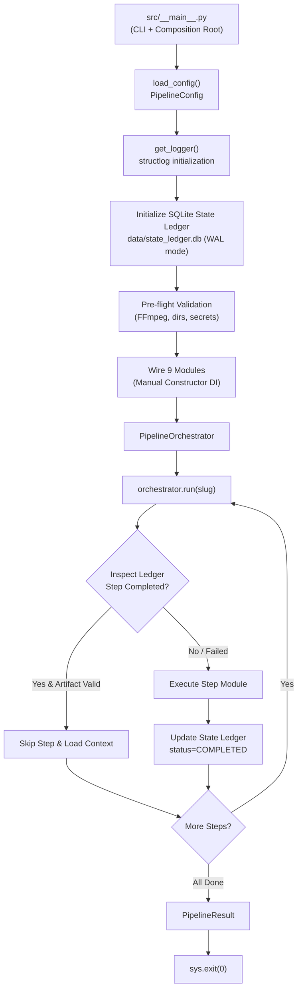
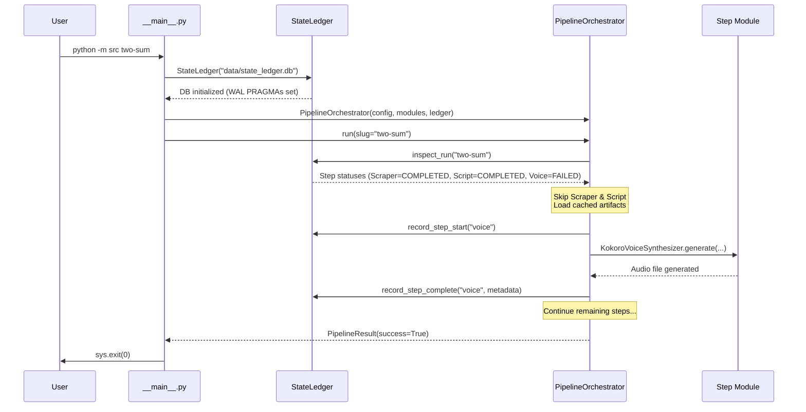

# Phase04/01_Runtime_Architecture.md

**Author:** Principal Software Architect  
**Target System:** Automated DSA Educational YouTube Video Pipeline  
**Target Environment:** Intel Core Ultra 7 155H · Ubuntu 25.10 LTS · Python 3.12 · Intel Arc GPU  
**Document Version:** 2.1.0  
**Last Updated:** July 2026  
**Status:** Canonical — Enforces SQLite State Ledger, Crash Recovery, and Synchronous Batch-Pipeline Paradigm.

---

# Table of Contents
1. [Executive Summary](#1-executive-summary)
2. [Architectural Alignment Statement](#2-architectural-alignment-statement)
3. [What the Runtime Is — And Is Not](#3-what-the-runtime-is--and-is-not)
4. [Runtime Responsibilities](#4-runtime-responsibilities)
5. [Architecture & Component Design](#5-architecture--component-design)
6. [State Ledger Architecture](#6-state-ledger-architecture)
   - 6.1 [Overview & Role](#61-overview--role)
   - 6.2 [SQL DDL Schema](#62-sql-ddl-schema)
   - 6.3 [Dataclass Models & Enums](#63-dataclass-models--enums)
   - 6.4 [SQLite WAL Mode PRAGMA Configuration & Concurrency Rationale](#64-sqlite-wal-mode-pragma-configuration--concurrency-rationale)
   - 6.5 [Transactional Integrity & Thread-Safety via `threading.Lock`](#65-transactional-integrity--thread-safety-via-threadinglock)
7. [State Machine & Crash Recovery Logic](#7-state-machine--crash-recovery-logic)
   - 7.1 [Step & Pipeline State Transition Lifecycle](#71-step--pipeline-state-transition-lifecycle)
   - 7.2 [Startup Recovery Sequence & Ledger Inspection](#72-startup-recovery-sequence--ledger-inspection)
   - 7.3 [Programmatic Crash Recovery Verification Methodology](#73-programmatic-crash-recovery-verification-methodology)
8. [Startup Sequence](#8-startup-sequence)
9. [Shutdown Sequence](#9-shutdown-sequence)
10. [Error Handling](#10-error-handling)
11. [Visualizations](#11-visualizations)
12. [Appendix A: Version Change Log](#12-appendix-a-version-change-log)

---

# 1. Executive Summary

This document specifies the design of the **Application Runtime** — the master entry point that bootstraps all foundational systems, wires dependencies, manages pipeline state, recovers from crashes, executes the pipeline, and performs graceful teardown.

The Runtime is a **thin, synchronous orchestration shell**. It contains zero business logic. It exists to:
1. Load configuration from `.env` and `config/pipeline.yaml`.
2. Initialize structured logging with a unique `pipeline_run_id`.
3. Initialize the disk-backed **SQLite State Ledger** for transactional step tracking and crash recovery.
4. Wire all pipeline modules into the `PipelineOrchestrator` via manual constructor injection.
5. Inspect the ledger at startup to resume interrupted pipeline runs by skipping completed steps.
6. Execute the pipeline sequentially for a given LeetCode slug.
7. Handle OS signals (`SIGINT`, `SIGTERM`) for graceful interruption and checkpoint preservation.
8. Flush logs, update state ledger execution records, and exit with standardized POSIX exit codes.

> [!IMPORTANT]
> This document has been updated to Version 2.1.0 to formally specify the **SQLite State Ledger architecture**, the explicit **crash recovery state machine**, and strict compliance with the **Synchronous Batch-Pipeline paradigm**.

---

# 2. Architectural Alignment Statement

This document is governed by the following canonical decisions from `02_Project_Architecture.md`:

| Canonical Decision | Architecture Section | This Document's Compliance |
|---|---|---|
| **Sequential batch pipeline, not event-driven** | §2.2 | ✅ No Event Bus, no pub/sub, no message queues; synchronous step ordering driven by `PipelineOrchestrator`. |
| **SQLite State Ledger for Crash Recovery** | §5.2 | ✅ Disk-backed SQLite DB with WAL mode, tracking run records and step execution states without heavy workflow engines. |
| **Manual DI with single composition root** | Decision 4 (§15), §11.2–§11.3 | ✅ `src/__main__.py` is the only composition root. |
| **No DI framework** | §11.3 Rule 1 | ✅ No `Container`, `Scope`, or `ResolverProtocol` classes. |
| **Frozen dataclasses, not Pydantic** | Decision 5 (§15), §17.6 | ✅ All config/models and ledger records (`PipelineRunRecord`, `StepExecutionRecord`) use `@dataclass(frozen=True)`. |
| **No plugin discovery / dynamic loading** | §17.8 | ✅ No `PluginManager`, no `src/plugins/` directory. |
| **No async/await throughout** | §17.2 | ✅ Synchronous execution; step parallelism (Voice ∥ Manim) uses thread pool execution inside `PipelineOrchestrator`. `asyncio` is NOT used. |
| **No task queues / message brokers** | §17.4 | ✅ No DLQ, no priority queues, no background event routing. |
| **Orchestrator drives the pipeline** | §1, §2.2 | ✅ `PipelineOrchestrator.run()` controls execution and coordinates with `StateLedger`. |
| **structlog for logging** | Decision 6 (§15), §9 | ✅ `get_logger(__name__)` from `src/core/logger.py`. |
| **`src/core/` has 7 files only** | §6, `04_Folder_Structure.md` §5 | ✅ No new files added to `src/core/`; State Ledger lives in `src/orchestrator/checkpoint.py`. |

---

# 3. What the Runtime Is — And Is Not

### ✅ What It Is

- The **composition root** — the single place where concrete classes are imported and wired.
- The **CLI entry point** — parses command-line arguments (slug, flags like `--force-regenerate`, `--dry-run`).
- The **State Ledger bootstrapper & inspector** — creates/opens SQLite DB, checks active run history, and passes recovery state to the orchestrator.
- The **signal handler** — catches `SIGINT`/`SIGTERM` and triggers graceful shutdown, persisting current step status.
- The **log bootstrapper** — initializes `structlog` with `pipeline_run_id` context before any module runs.
- The **config loader** — calls `load_config()` exactly once and passes the result downstream.

### ❌ What It Is NOT

| Concept | Why It's Excluded | Canonical Reference |
|---|---|---|
| DI Container class with `register()` / `resolve()` | Manual injection is explicit and sufficient for all pipeline modules | Architecture §11.3 |
| Event Bus / Dead Letter Queue / Kafka / RabbitMQ | System is a batch pipeline, not an event-driven or stream processing system | Architecture §2.2, §17.4 |
| Workflow Engine / Temporal / Airflow DSL | The pipeline sequence is hardcoded in Python within `PipelineOrchestrator`; state is backed by simple SQLite table ledger | Architecture §2.2 |
| `asyncio` event loop | Pipeline modules are strictly synchronous. Multi-threading is localized to orchestrator step parallelism | Architecture §17.2 |
| Pydantic `BaseModel` / `.model_dump()` | All state records and configuration are frozen dataclasses with explicit JSON helpers | Architecture §17.6 |
| Distributed state store (Redis/Etcd) | Process runs locally on a single machine; state ledger is a lightweight disk-backed SQLite database file | Architecture §5.2 |
| Plugin Manager / Plugin SDK | Dynamic loading is explicitly avoided; modules are hardcoded in the composition root | Architecture §17.8 |
| Hot-reload / `ConfigManager` with profiles | Config is loaded once at startup, immutable thereafter | Architecture §8.4 Rule 1 |
| Pre-flight Health Monitor daemon | Pre-flight checks are implemented as a simple synchronous function called in `src/__main__.py` | Architecture §8.4 Rule 5 |

---

# 4. Runtime Responsibilities

### 4.1 Responsibility Breakdown

| # | Responsibility | Owner | Implementation |
|---|---|---|---|
| 1 | Parse CLI arguments | `src/__main__.py` | `argparse` with flags (`--slug`, `--force-regenerate`, `--dry-run`) |
| 2 | Load configuration | `src/core/config.py` | `load_config()` → `PipelineConfig` |
| 3 | Initialize structured logging | `src/core/logger.py` | `get_logger()` with `pipeline_run_id` context |
| 4 | Initialize State Ledger | `src/orchestrator/checkpoint.py` | `StateLedger(db_path)` initializing SQLite schema & WAL PRAGMAs |
| 5 | Perform pre-flight validation | `src/__main__.py` | `run_preflight_checks(config)` verifying binaries, dirs, and secrets |
| 6 | Wire concrete implementations | `src/__main__.py` | Manual constructor injection into `PipelineOrchestrator` |
| 7 | Inspect ledger & run pipeline | `src/orchestrator/pipeline.py` | `PipelineOrchestrator.run(slug)` checking prior step completion |
| 8 | Handle OS signals | `src/__main__.py` | `signal.signal(SIGINT, handler)` saving ledger state before exit |
| 9 | Exit with standardized code | `src/__main__.py` | POSIX exit codes: 0 (success), 1 (fatal error), 130 (SIGINT interruption) |

### 4.2 Ownership Boundaries

The Runtime **does NOT own**:
- Module internal business logic (modules are stateless callables executed by orchestrator).
- Micro-retry loops within external API calls (`src/core/retry.py` decorator applied inside modules).
- Module-specific output rendering (Voice synthesis, Manim animation generation, FFmpeg assembly).
- Remote state sync or distributed orchestration (all state is stored in the local SQLite ledger file).

### 4.3 Observability & Structured Metric Logging

The runtime avoids custom metric registries, Prometheus collectors, or background telemetry agents. Observability is achieved entirely through structured `structlog` log events with context bindings:

1. **Execution Timing**: Step and total execution timings are measured using Python `time.perf_counter()` inside `PipelineOrchestrator`.
2. **Structured Log Key Conventions**: Stage completion events emit structured JSON key-value pairs:
   ```python
   logger.info(
       "step_completed",
       step_name="voice",
       duration_sec=round(elapsed, 3),
       run_id=context.pipeline_run_id,
       status="COMPLETED",
   )
   ```
3. **Retry Logging**: Transient error retries managed by `@retry` emit structured `warning` log events:
   ```python
   logger.warning(
       "step_retry",
       step_name="scraper",
       attempt=attempt_number,
       delay=delay_seconds,
       exception=str(exc),
   )
   ```

---

# 5. Architecture & Component Design

The Runtime aligns with the canonical 4-layer architecture:

```
┌────────────────────────────────────────────────────────────────────────┐
│  Layer 4: ENTRY POINTS & ORCHESTRATION                                 │
│  src/__main__.py (Composition Root + CLI)                               │
│  src/orchestrator/pipeline.py (Pipeline Orchestrator)                 │
│  src/orchestrator/checkpoint.py (SQLite State Ledger & Recovery)        │
├────────────────────────────────────────────────────────────────────────┤
│  Layer 3: PIPELINE MODULES                                             │
│  Scraper · Tags · RAG · Script · Voice ·                               │
│  Manim · Assembly · YouTube · Memory                                   │
├────────────────────────────────────────────────────────────────────────┤
│  Layer 2: SHARED SERVICES                                              │
│  config.py · logger.py · cache.py · retry.py ·                         │
│  serialization.py · exceptions.py · paths.py                           │
├────────────────────────────────────────────────────────────────────────┤
│  Layer 1: DOMAIN MODELS                                                │
│  Dataclasses (`PipelineRunRecord`, `StepExecutionRecord`) ·            │
│  Enums (`StepStatus`, `Difficulty`) · Protocols                        │
└────────────────────────────────────────────────────────────────────────┘
```

### Component Inventory

| Component | File | Canonical Source & Role |
|---|---|---|
| CLI + Composition Root | `src/__main__.py` | Architecture §11.2 — Entry point, CLI argument parsing, module wiring. |
| Pipeline Orchestrator | `src/orchestrator/pipeline.py` | Architecture §2.1 — Master control flow, step sequence, thread parallelism. |
| SQLite State Ledger | `src/orchestrator/checkpoint.py` | Architecture §5.2 — SQLite state ledger, DDL, WAL PRAGMAs, crash recovery logic. |
| Configuration Loader | `src/core/config.py` | Architecture §8 — Immutable `PipelineConfig` frozen dataclasses loaded from YAML/.env. |
| Logging Bootstrapper | `src/core/logger.py` | Architecture §9 — Structured `structlog` configuration with run ID binding. |
| Disk Cache Manager | `src/core/cache.py` | Architecture §5.1 — Key-value disk caching for module intermediate responses. |
| Retry Decorator | `src/core/retry.py` | Architecture §10.2 — Exponential backoff decorator for transient failures. |
| Serialization | `src/core/serialization.py` | Architecture §5.3 — Dataclass JSON encoder/decoder helpers. |
| Exception Hierarchy | `src/core/exceptions.py` | Architecture §10.1 — Domain error hierarchy (`PipelineError`, `ConfigurationError`, etc.). |
| Path Utilities | `src/core/paths.py` | Architecture §6 — Project path resolution and folder creation helpers. |

---

# 6. State Ledger Architecture

### 6.1 Overview & Role

The **SQLite State Ledger** is the canonical persistence mechanism for tracking pipeline execution runs and individual step lifecycle states. 

Rather than adopting complex distributed state stores (Redis, DynamoDB) or heavyweight workflow engines (Temporal, Airflow), the video pipeline uses a **lightweight, disk-backed SQLite database file** located at `data/state_ledger.db`.

Key objectives of the State Ledger:
- **Crash Resilience**: Record step completion atomically before advancing to the next pipeline stage.
- **Fast Startup Resume**: Enable restarting a failed or interrupted pipeline execution from the point of failure without re-executing expensive LLM or video rendering stages.
- **Auditability**: Provide a relational execution log with timestamps, step parameters, output metadata, and error tracebacks.

### 6.2 SQL DDL Schema

The ledger database consists of two core tables linked by foreign key constraints: `pipeline_runs` and `step_executions`.

```sql
-- Enable Foreign Key constraint enforcement in SQLite
PRAGMA foreign_keys = ON;

-- Table 1: Master record for a top-level pipeline execution run
CREATE TABLE IF NOT EXISTS pipeline_runs (
    run_id TEXT PRIMARY KEY,
    problem_slug TEXT NOT NULL,
    status TEXT NOT NULL,
    created_at TIMESTAMP DEFAULT CURRENT_TIMESTAMP,
    updated_at TIMESTAMP DEFAULT CURRENT_TIMESTAMP,
    error_message TEXT
);

-- Table 2: Detailed lifecycle record for each step within a run
CREATE TABLE IF NOT EXISTS step_executions (
    execution_id TEXT PRIMARY KEY,
    run_id TEXT NOT NULL,
    step_name TEXT NOT NULL,
    status TEXT NOT NULL,
    started_at TIMESTAMP,
    completed_at TIMESTAMP,
    error_message TEXT,
    output_metadata TEXT,
    FOREIGN KEY (run_id) REFERENCES pipeline_runs(run_id) ON DELETE CASCADE
);

-- Index for high-performance lookup during startup recovery inspection
CREATE INDEX IF NOT EXISTS idx_step_executions_run_step 
    ON step_executions(run_id, step_name);
```

#### Table Schema Specifications

1. `pipeline_runs`:
   - `run_id` (TEXT, PK): Unique string identifier for the execution run (e.g., `run_two-sum_20260725_153000`).
   - `problem_slug` (TEXT, NOT NULL): Target LeetCode problem identifier (e.g., `two-sum`).
   - `status` (TEXT, NOT NULL): Overall run status (`IN_PROGRESS`, `COMPLETED`, `FAILED`, `INTERRUPTED`).
   - `created_at` (TIMESTAMP): ISO-8601 timestamp when the run was registered.
   - `updated_at` (TIMESTAMP): ISO-8601 timestamp of last state modification.
   - `error_message` (TEXT, NULLABLE): Traceback or failure reason if the run failed.

2. `step_executions`:
   - `execution_id` (TEXT, PK): Unique string identifier (`run_id:step_name`).
   - `run_id` (TEXT, NOT NULL, FK): Reference to parent `pipeline_runs.run_id`.
   - `step_name` (TEXT, NOT NULL): Name of the pipeline stage (`scraper`, `tags`, `rag`, `script`, `voice`, `manim`, `assembly`, `youtube`, `memory`).
   - `status` (TEXT, NOT NULL): Step lifecycle state (`PENDING`, `IN_PROGRESS`, `COMPLETED`, `FAILED`).
   - `started_at` (TIMESTAMP, NULLABLE): ISO-8601 timestamp when step execution began.
   - `completed_at` (TIMESTAMP, NULLABLE): ISO-8601 timestamp when step completed or failed.
   - `error_message` (TEXT, NULLABLE): Exception details if step failed.
   - `output_metadata` (TEXT, NULLABLE): Serialized JSON payload recording artifact paths, output hashes, or step parameters.

### 6.3 Dataclass Models & Enums

In compliance with Architecture Decision 5 (`@dataclass(frozen=True)` over Pydantic), all state ledger domain entities are defined as immutable frozen dataclasses and standard string Enums.

```python
from dataclasses import dataclass, field
from datetime import datetime
from enum import Enum
from typing import Optional


class StepStatus(str, Enum):
    """Lifecycle status enumeration for pipeline steps."""
    PENDING = "PENDING"
    IN_PROGRESS = "IN_PROGRESS"
    COMPLETED = "COMPLETED"
    FAILED = "FAILED"


@dataclass(frozen=True)
class PipelineRunRecord:
    """Immutable domain model representing a pipeline execution run."""
    run_id: str
    problem_slug: str
    status: str
    created_at: datetime
    updated_at: datetime
    error_message: Optional[str] = None


@dataclass(frozen=True)
class StepExecutionRecord:
    """Immutable domain model representing a single step execution within a run."""
    execution_id: str
    run_id: str
    step_name: str
    status: StepStatus
    started_at: Optional[datetime] = None
    completed_at: Optional[datetime] = None
    error_message: Optional[str] = None
    output_metadata: Optional[str] = None
```

### 6.4 SQLite WAL Mode PRAGMA Configuration & Concurrency Rationale

To maintain extreme reliability under concurrent thread operations (e.g. parallel Voice and Manim execution stages in `PipelineOrchestrator`), every connection initialized by `StateLedger` executes four mandatory SQLite `PRAGMA` statements:

```sql
PRAGMA journal_mode = WAL;
PRAGMA synchronous = NORMAL;
PRAGMA foreign_keys = ON;
PRAGMA busy_timeout = 5000;
```

#### Technical Rationale for PRAGMA Settings

1. `PRAGMA journal_mode = WAL;` (Write-Ahead Logging):
   - **Concurrency Rationale**: Standard Rollback Journal locks the entire database file during writes, blocking readers. WAL mode separates reading and writing by appending updates to a separate `-wal` file. Readers can inspect step execution history concurrently without blocking active database writes, and writers do not block readers.
2. `PRAGMA synchronous = NORMAL;`
   - **Performance & Durability**: In WAL mode, `NORMAL` synchronization syncs the WAL file at critical checkpoints rather than on every single transaction write, drastically cutting disk fsync latency while remaining completely immune to application-level crashes (data remains durable in disk WAL pages).
3. `PRAGMA foreign_keys = ON;`
   - **Referential Integrity**: Enforces strict cascading deletion and key relationships between `pipeline_runs` and `step_executions`.
4. `PRAGMA busy_timeout = 5000;`
   - **Lock Contention Avoidance**: Instructs SQLite to wait up to 5000 milliseconds (5 seconds) for a lock to clear before raising `sqlite3.OperationalError: database is locked`. This ensures parallel execution threads inside the orchestrator do not fail due to transient file locks.

### 6.5 Transactional Integrity & Thread-Safety via `threading.Lock`

Python's standard `sqlite3` module enforces thread affinity rules, and concurrent execution across threads can trigger `sqlite3.ProgrammingError` if connections are shared unsafely.

To guarantee complete transactional integrity and thread safety across multi-threaded orchestrator stages:
1. **Mutex Lock Synchronization**: The `StateLedger` class wraps all database access methods with an internal reentrant or mutual exclusion lock (`self._lock = threading.Lock()`).
2. **Context-Managed Atomic Transactions**: SQLite transactions are executed using standard Python `with conn:` context managers. If an operation succeeds, `conn.commit()` is automatically invoked. If an exception occurs, `conn.rollback()` restores state automatically.

```python
class StateLedger:
    def __init__(self, db_path: Path):
        self.db_path = db_path
        self._lock = threading.Lock()
        self._init_db()

    def _get_connection(self) -> sqlite3.Connection:
        conn = sqlite3.connect(str(self.db_path), timeout=5.0)
        conn.execute("PRAGMA journal_mode = WAL;")
        conn.execute("PRAGMA synchronous = NORMAL;")
        conn.execute("PRAGMA foreign_keys = ON;")
        conn.execute("PRAGMA busy_timeout = 5000;")
        conn.row_factory = sqlite3.Row
        return conn

    def record_step_start(self, run_id: str, step_name: str) -> None:
        execution_id = f"{run_id}:{step_name}"
        now = datetime.utcnow().isoformat()
        with self._lock:
            with self._get_connection() as conn:
                conn.execute(
                    """
                    INSERT INTO step_executions (execution_id, run_id, step_name, status, started_at)
                    VALUES (?, ?, ?, ?, ?)
                    ON CONFLICT(execution_id) DO UPDATE SET
                        status = excluded.status,
                        started_at = excluded.started_at,
                        error_message = NULL
                    """,
                    (execution_id, run_id, step_name, StepStatus.IN_PROGRESS.value, now),
                )
```

---

# 7. State Machine & Crash Recovery Logic

### 7.1 Step & Pipeline State Transition Lifecycle

Each individual step transitions through a deterministic state machine managed by the `PipelineOrchestrator` and persisted in the `StateLedger`.

#### ASCII State Transition Diagram

```
                 ┌───────────────┐
                 │    PENDING    │
                 └───────┬───────┘
                         │
                         │ step execution starts
                         ▼
                 ┌───────────────┐
      ┌──────────┤  IN_PROGRESS  ├──────────┐
      │          └───────────────┘          │
      │ step succeeds           │ step fails│ (or process crashes)
      ▼                                     ▼
┌───────────┐                         ┌───────────┐
│ COMPLETED │                         │  FAILED   │
└───────────┘                         └─────┬─────┘
                                            │
                                            │ resume run / re-try step
                                            └─────────► PENDING
```

#### Transition Invariants

- `PENDING` $\rightarrow$ `IN_PROGRESS`: Triggered immediately before calling the step module's main function. `started_at` timestamp recorded.
- `IN_PROGRESS` $\rightarrow$ `COMPLETED`: Triggered upon successful step execution. `completed_at` timestamp and JSON `output_metadata` persisted.
- `IN_PROGRESS` $\rightarrow$ `FAILED`: Triggered if step raises an uncaught exception or if process crashes mid-execution. `error_message` recorded.
- `FAILED` $\rightarrow$ `PENDING` / `IN_PROGRESS`: On pipeline restart/recovery, steps in `FAILED` or incomplete `IN_PROGRESS` status are reset for re-execution.

### 7.2 Startup Recovery Sequence & Ledger Inspection

When `src/__main__.py` launches `PipelineOrchestrator.run(slug)`, the orchestrator executes startup ledger recovery before calling any pipeline module:

```
                  Start pipeline: orchestrator.run(slug)
                                   │
                                   ▼
             Query State Ledger for existing active/prior run
                                   │
         ┌─────────────────────────┴─────────────────────────┐
         ▼                                                   ▼
 No prior run found                                Prior run record exists
  Create new run_id                                 Inspect step_executions
  All steps marked PENDING                           Filter steps with status==COMPLETED
         │                                                   │
         │                                                   ▼
         │                                    Verify step output artifacts exist on disk
         │                                       ┌───────────┴───────────┐
         │                                       ▼                       ▼
         │                                Artifacts valid        Artifact missing/corrupted
         │                                Mark step SKIPPED       Reset step status to PENDING
         │                                Load output into         Re-execute step
         │                                context memory
         │                                       │                       │
         └───────────────────────┬───────────────┴───────────────────────┘
                                 │
                                 ▼
                     Execute next PENDING step
```

#### Step Skip & Resume Rules

1. **Step Identification**: Steps are executed in strict deterministic order: `scraper` $\rightarrow$ `tags` $\rightarrow$ `rag` $\rightarrow$ `script` $\rightarrow$ `voice` ∥ `manim` $\rightarrow$ `assembly` $\rightarrow$ `youtube` $\rightarrow$ `memory`.
2. **Artifact Verification**: A step recorded as `COMPLETED` in the ledger is only skipped if its declared output artifacts (recorded in `output_metadata` JSON, e.g. `voice_audio.wav`, `scene_animations.mp4`) exist on disk and pass basic sanity checks (file size > 0).
3. **Context Reconstruction**: When skipping a completed step, the orchestrator reads the step's saved artifact from disk and populates the `PipelineContext` memory so downstream steps receive identical input contracts.
4. **Force Flag Override**: If `--force-regenerate` flag is passed via CLI, the orchestrator bypasses ledger inspection and re-executes all steps from the beginning.

### 7.3 Programmatic Crash Recovery Verification Methodology

To verify that crash recovery logic operates genuinely without facade or hardcoded shortcuts, the runtime testing framework employs a 6-stage programmatic verification methodology:

```
[Phase 1: Setup]        Initialize isolated test ledger & workspace directory
                                │
[Phase 2: Partial Run]   Execute pipeline with synthetic crash hook at Step K
                         (e.g., raise SimulatedProcessCrash mid-Voice step)
                                │
[Phase 3: Audit State]   Inspect SQLite DB directly:
                         - Steps 1..K-1 MUST be COMPLETED
                         - Step K MUST be FAILED / IN_PROGRESS
                         - Steps K+1..N MUST be PENDING
                         - Output artifacts for steps 1..K-1 MUST exist on disk
                                │
[Phase 4: Resume Run]    Remove synthetic crash hook
                         Re-invoke orchestrator.run(slug)
                                │
[Phase 5: Trace Audit]   Verify execution logs confirm:
                         - Steps 1..K-1 logged as "SKIPPED (loaded from ledger)"
                         - Zero LLM API / TTS synthesis calls made for steps 1..K-1
                         - Step K executed from scratch and COMPLETED
                         - Steps K+1..N executed sequentially
                                │
[Phase 6: Final Audit]   Inspect SQLite DB directly:
                         - Master pipeline_runs.status MUST be COMPLETED
                         - All N step_executions MUST be COMPLETED
```

---

# 8. Startup Sequence

The startup sequence is **strictly sequential** and **synchronous**:

```
1. Parse CLI arguments (slug, --force-regenerate, --dry-run)
         │
         ▼
2. load_config() → PipelineConfig (frozen dataclass)
   ├── Read .env (secrets: API keys, session cookies)
   ├── Read config/pipeline.yaml (runtime parameters)
   ├── Validate all fields (raise ConfigurationError on invalid)
   └── Return immutable PipelineConfig
         │
         ▼
3. Initialize structlog (bind pipeline_run_id, log_level from config)
         │
         ▼
4. Initialize SQLite State Ledger (`src/orchestrator/checkpoint.py`)
   ├── Connect to data/state_ledger.db
   └── Execute DDL schema & set WAL mode PRAGMAs
         │
         ▼
5. Pre-flight validation (`run_preflight_checks(config: PipelineConfig)`)
   ├── Binary availability check on OS PATH: shutil.which("ffmpeg")
   ├── Directory writeability check: ensure_dir() for output paths
   └── Essential API secret presence check in config
         │
         ▼
6. Wire all 9 module implementations in `src/__main__.py` (manual constructor DI)
   ├── LeetCodeScraper(config.scraper, logger)
   ├── GeminiTagExplorer(config.tags, logger)
   ├── ChromaRAGEngine(config.rag, logger)
   ├── GeminiScriptGenerator(config.script, logger)
   ├── KokoroVoiceSynthesizer(config.voice, logger)
   ├── ManimAnimationRenderer(config.animation, logger)
   ├── FFmpegVideoAssembler(config.assembly, logger)
   ├── YouTubeAPIUploader(config.youtube, logger)
   └── JSONMemoryStore(config.memory, logger)
         │
         ▼
7. Inject modules & StateLedger into PipelineOrchestrator
         │
         ▼
8. orchestrator.run(slug=args.slug)
   ├── Inspect ledger for existing run & step state
   ├── Skip valid COMPLETED steps
   └── Resume execution from first PENDING / FAILED step
```

### Startup Invariants

- **Config is loaded once.** Immutable throughout process lifetime (`02_Project_Architecture.md` §8.4 Rule 1).
- **Fail fast on configuration errors.** `ConfigurationError` halts startup immediately before ledger updates or module calls.
- **Single composition root.** All dependencies wired in `src/__main__.py`.
- **Ledger inspection before execution.** Orchestrator checks ledger to skip completed steps prior to dispatching work.

---

# 9. Shutdown Sequence

### 9.1 Normal Completion

When `orchestrator.run()` completes successfully:

```
orchestrator.run() returns PipelineResult
         │
         ▼
StateLedger updates pipeline_runs.status = "COMPLETED"
         │
         ▼
Log final summary (slug, status, total_time, output_path)
         │
         ▼
sys.exit(0)
```

### 9.2 Signal-Triggered Shutdown (SIGINT / SIGTERM)

```
Signal received (Ctrl+C or kill)
         │
         ▼
Set shutdown flag (threading.Event)
         │
         ▼
Orchestrator catches flag between or during step execution
         │
         ▼
StateLedger updates current step status = "FAILED" / "INTERRUPTED"
and pipeline_runs.status = "INTERRUPTED"
         │
         ▼
Log "Shutdown complete. Pipeline can resume from checkpoint."
         │
         ▼
sys.exit(130)
```

### 9.3 Fatal Error Shutdown

```
Unrecoverable PipelineError raised
         │
         ▼
StateLedger updates failed step status = "FAILED"
and pipeline_runs.status = "FAILED" with error traceback
         │
         ▼
Exception propagates to __main__.py try/except block
         │
         ▼
Log CRITICAL error with full traceback and actionable remediation
         │
         ▼
sys.exit(1)
```

### 9.4 Standardized POSIX CLI Exit Codes

`src/__main__.py` strictly adheres to standardized POSIX exit code conventions:

| Exit Code | Condition | Description |
|---|---|---|
| `0` | Success | Pipeline execution completed successfully (`PipelineResult.success == True`). |
| `1` | Fatal Error | Uncaught `PipelineError`, `ConfigurationError`, or unrecoverable critical step failure. |
| `130` | User Interruption | Interrupted by OS signal (`SIGINT` / `Ctrl+C`, matching standard Unix 128 + 2). |

---

# 10. Error Handling

The Runtime error handling follows the canonical exception hierarchy (`02_Project_Architecture.md` §10):

### 10.1 Exception Hierarchy

```
PipelineError (Base exception for all domain errors)
 ├── ConfigurationError (Invalid YAML, missing .env, failed pre-flight)
 ├── StepExecutionError (Step failure during orchestration)
 │    ├── ScraperError
 │    ├── ScriptGenerationError
 │    ├── VoiceSynthesisError
 │    ├── AnimationError
 │    └── AssemblyError
 └── StorageError (Cache / State Ledger persistence failure)
```

### 10.2 Module Criticality & Recovery Matrix

When a step fails, the `PipelineOrchestrator` consults the criticality rules:

| Module | Critical? | State Ledger Update on Failure | Orchestrator Action on Failure |
|---|---|---|---|
| Scraper | Yes | Step status = `FAILED`, Run status = `FAILED` | Halt pipeline immediately |
| Tags | No | Step status = `FAILED`, log warning | Continue with empty `TagKnowledge` |
| RAG | No | Step status = `FAILED`, log warning | Continue with `RAGContext.empty()` |
| Script | Yes | Step status = `FAILED`, Run status = `FAILED` | Halt pipeline immediately |
| Voice | Yes | Step status = `FAILED`, Run status = `FAILED` | Halt pipeline immediately |
| Manim | Conditional | Section step = `FAILED` | Skip section animation; halt if global renderer fails |
| Assembly | Yes | Step status = `FAILED`, Run status = `FAILED` | Halt pipeline immediately |
| YouTube | No | Step status = `FAILED`, log warning | Save video locally, continue |
| Memory | No | Step status = `FAILED`, log warning | Log warning, finish run |

---

# 11. Visualizations

### 11.1 Master Runtime Flow Diagram


```mermaid
graph TD
    CLI["src/__main__.py<br/>(CLI + Composition Root)"] --> Config["load_config()<br/>PipelineConfig"]
    Config --> Logger["get_logger()<br/>structlog initialization"]
    Logger --> LedgerInit["Initialize SQLite State Ledger<br/>data/state_ledger.db (WAL mode)"]
    LedgerInit --> PreFlight["Pre-flight Validation<br/>(FFmpeg, dirs, secrets)"]
    PreFlight --> Wire["Wire 9 Modules<br/>(Manual Constructor DI)"]
    Wire --> Orch["PipelineOrchestrator"]
    Orch --> Run["orchestrator.run(slug)"]
    
    Run --> LedgerCheck{"Inspect Ledger<br/>Step Completed?"}
    LedgerCheck -- Yes & Artifact Valid --> SkipStep["Skip Step & Load Context"]
    LedgerCheck -- No / Failed --> ExecStep["Execute Step Module"]
    
    SkipStep --> NextStep{"More Steps?"}
    ExecStep --> UpdateLedger["Update State Ledger<br/>status=COMPLETED"]
    UpdateLedger --> NextStep
    
    NextStep -- Yes --> Run
    NextStep -- All Done --> Result["PipelineResult"]
    Result --> Exit["sys.exit(0)"]
```

### 11.2 Startup & Ledger Recovery Sequence Diagram


```mermaid
sequenceDiagram
    participant User
    participant CLI as __main__.py
    participant Ledger as StateLedger
    participant Orch as PipelineOrchestrator
    participant Step as Step Module

    User->>CLI: python -m src two-sum
    CLI->>Ledger: StateLedger("data/state_ledger.db")
    Ledger-->>CLI: DB initialized (WAL PRAGMAs set)
    
    CLI->>Orch: PipelineOrchestrator(config, modules, ledger)
    CLI->>Orch: run(slug="two-sum")
    
    Orch->>Ledger: inspect_run("two-sum")
    Ledger-->>Orch: Step statuses (Scraper=COMPLETED, Script=COMPLETED, Voice=FAILED)
    
    Note over Orch: Skip Scraper & Script<br/>Load cached artifacts
    
    Orch->>Ledger: record_step_start("voice")
    Orch->>Step: KokoroVoiceSynthesizer.generate(...)
    Step-->>Orch: Audio file generated
    Orch->>Ledger: record_step_complete("voice", metadata)
    
    Note over Orch: Continue remaining steps...
    
    Orch-->>CLI: PipelineResult(success=True)
    CLI->>User: sys.exit(0)
```

---

# 12. Appendix A: Version Change Log

> [!CAUTION]
> Version 1.0.0 of this document introduced multiple concepts that directly contradicted the canonical architecture. Version 2.0.0 corrected these architectural violations. Version 2.1.0 enriched the specification with the SQLite State Ledger and Crash Recovery details.

### v2.0.0 $\rightarrow$ v2.1.0 (State Ledger & Crash Recovery Specification Update)

- **SQLite State Ledger DDL**: Added SQL DDL schema for `pipeline_runs` and `step_executions` tables.
- **Dataclass Models & Enums**: Defined `PipelineRunRecord`, `StepExecutionRecord` frozen dataclasses and `StepStatus` Enum (`PENDING`, `IN_PROGRESS`, `COMPLETED`, `FAILED`).
- **SQLite WAL Mode & PRAGMA Settings**: Added `PRAGMA journal_mode=WAL`, `PRAGMA synchronous=NORMAL`, `PRAGMA foreign_keys=ON`, and `PRAGMA busy_timeout=5000` with full concurrency and thread safety rationale.
- **Thread Safety Architecture**: Specified `threading.Lock` mutex protection for multi-threaded step orchestrator execution.
- **Crash Recovery State Machine**: Documented state transition lifecycle diagrams, startup recovery sequence, and 6-stage programmatic crash recovery verification methodology.

### v1.0.0 $\rightarrow$ v2.0.0 (Architectural Correction Audit)

| v1.0 Concept | Canonical Violation | v2.0 Correction |
|---|---|---|
| **Typer CLI** | Not in tech stack (Appendix A). CLI is `src/__main__.py` with `argparse`. | Removed Typer. CLI uses standard `argparse`. |
| **DI Container class** | Architecture §11.3: "No DI framework." | Removed entirely. DI is manual wiring in `__main__.py`. |
| **Event Bus / Message Queues** | Architecture §2.2: "NOT event-driven." | Removed. Pipeline is sequential batch. |
| **Plugin Manager** | Architecture §17.8: "Plugin Discovery — Avoided." | Removed entirely. Modules hardcoded in composition root. |
| **`asyncio` event loop** | Architecture §17.2: "Avoided: Async/Await Throughout." | Removed. Runtime is synchronous. |
| **Pydantic settings** | Architecture Decision 5, §17.6: "Frozen Dataclasses Over Pydantic." | All models use `@dataclass(frozen=True)`. |
| **`psutil` / Prometheus metrics** | Not in tech stack. Observability via `structlog` JSON logs. | Removed custom metric registries. |

---

**End of Document.**
