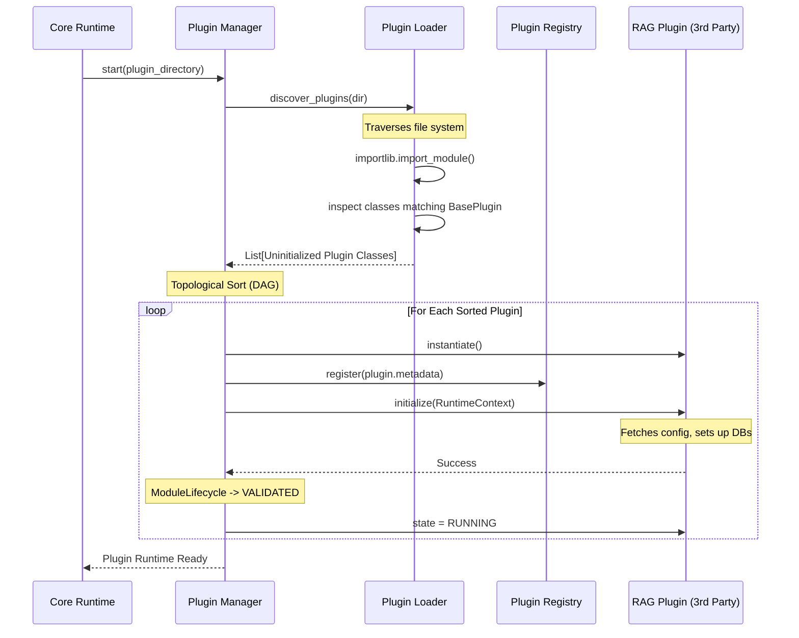

# Phase05/01_Plugin_Runtime.md

**Author:** Principal Software Architect  
**Target System:** Automated DSA Educational YouTube Video Pipeline  
**Document Version:** 1.0.0  
**Status:** Designed  

---

# Table of Contents
1. [Executive Summary](#1-executive-summary)
2. [Architectural Integration](#2-architectural-integration)
3. [Core Components & Responsibilities](#3-core-components--responsibilities)
4. [Implementation Guidance](#4-implementation-guidance)
5. [Visualizations](#5-visualizations)

---

# 1. Executive Summary

This document specifies the design for the **Plugin Runtime** (also known as the Plugin Manager). While the **Plugin SDK** (defined in Phase 03/04) dictates how a developer *writes* a plugin, the Plugin Runtime is the internal engine that physically discovers, loads, validates, and supervises those plugins.

The Plugin Runtime acts as the strict supervisor for all 3rd-party code, isolating the Core Runtime from potential plugin crashes, blocking loops, or malformed metadata.

---

# 2. Architectural Integration

The Plugin Runtime sits between the Core Application Runtime and the active Plugins. 

- **Core Runtime:** Hands the Plugin Runtime a path to scan (e.g., `src/plugins/`) during the master startup sequence.
- **Service Container:** The Plugin Runtime uses the DI Container to retrieve the active `RuntimeContext` which it injects into each plugin upon initialization.
- **Event Bus:** The Plugin Runtime automatically subscribes plugins to their requested Event topics immediately after they transition to the `VALIDATED` state.
- **Workflow Engine:** The Workflow Engine queries the Plugin Runtime's Registry to ensure that all plugins required by a `pipeline.yaml` are actually loaded and healthy before starting a job.

---

# 3. Core Components & Responsibilities

### 3.1 Plugin Discovery & Loading
The Runtime uses Python's `importlib` and `inspect` modules to dynamically traverse the `src/plugins/` directory. It looks for classes that structurally implement the `BasePlugin` protocol. It securely imports the module, catching any `SyntaxError` or `ImportError` instantly without crashing the host application.

### 3.2 Registration & Dependency Resolution (DAG)
Before initializing plugins, the Runtime reads their `metadata.dependencies`. It builds a Directed Acyclic Graph (DAG) and performs a Topological Sort. 
- If `Plugin A` requires `Plugin B (v2.0)`, `Plugin B` will be loaded and initialized first.
- If a circular dependency is detected (A needs B, B needs A), the Runtime traps it and fails the load sequence.

### 3.3 Lifecycle Management
The Plugin Runtime wraps every discovered plugin inside the `ModuleLifecycle` state machine (designed in Phase 04). 
It explicitly commands the transitions: `DISCOVERED -> LOADED -> INITIALIZED -> VALIDATED -> RUNNING`.

### 3.4 Configuration Injection
During the `INITIALIZED` step, the Plugin Runtime injects the immutable `RuntimeContext` into the plugin. This grants the plugin safe, read-only access to its specific configuration dictionary (`context.config.plugin_configs.get(plugin.name)`).

### 3.5 Health Monitoring & Thread Safety
The Plugin Runtime exposes a `.get_health()` snapshot to the master `HealthMonitor`. Since plugins are async, the Plugin Runtime uses `asyncio.Lock()` to prevent race conditions during bulk startup or teardown events. 

---

# 4. Implementation Guidance

When implementing this in Python, adhere to these constraints:
1. **Never use `eval()` or `exec()`:** Always use `importlib.import_module()` combined with `inspect.getmembers(module, inspect.isclass)` to safely extract plugin classes.
2. **Structural Subtyping:** Use the Service Container's `_validate_implementation` to verify the class implements `BasePlugin` before attempting to call `.initialize()` on it.
3. **Timeout Protection:** Use the `execute_with_timeout` wrapper from `ModuleLifecycle` when calling a plugin's `.initialize()` or `.shutdown()` methods. Treat all 3rd-party code as potentially hostile or blocking.
4. **Sandboxing:** Do not pass the raw DI Container to the plugins. Only pass the strictly typed `RuntimeContext`.

---

# 5. Visualizations

### 5.1 Architecture Component Diagram

```mermaid
graph TD
    subgraph Core Runtime
        DI[Service Container]
        EB[Event Bus]
        WE[Workflow Engine]
        Ctx[Runtime Context]
    end

    subgraph Plugin Runtime
        PL[Plugin Loader]
        PR[Plugin Registry]
        DAG[Dependency Resolver]
        Supervisor[Lifecycle Supervisor]
        
        PL --> PR
        DAG --> Supervisor
    end
    
    subgraph Filesystem
        P1(src/plugins/scraper)
        P2(src/plugins/rag)
    end

    PL -.-> |importlib scans| P1
    PL -.-> |importlib scans| P2
    
    DI --> |Provides| Ctx
    Supervisor --> |Injects| Ctx
    Supervisor --> |Binds to| EB
    PR <-- |Queries| WE
```

### 5.2 Discovery & Loading Sequence Diagram


