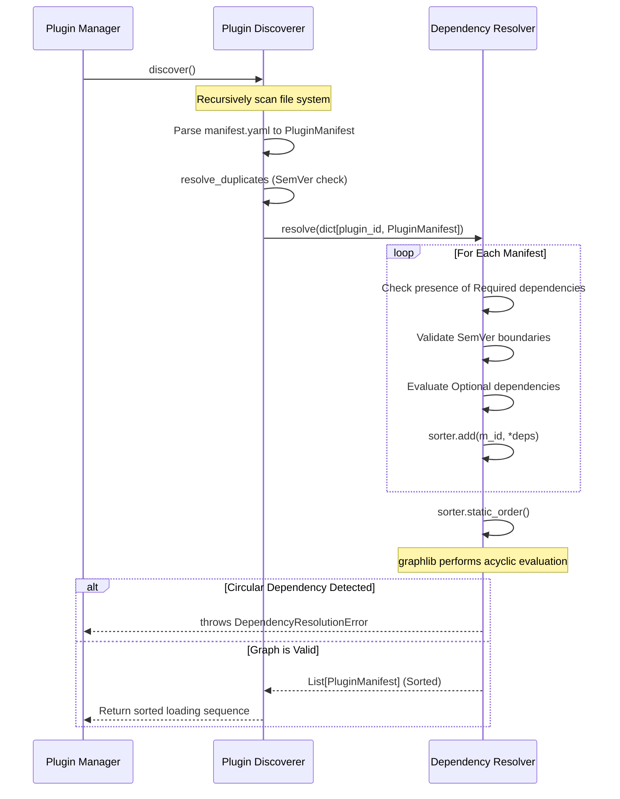

# Phase05/09_DependencyResolver.md

**Author:** Principal Software Architect  
**Target System:** Automated DSA Educational YouTube Video Pipeline  
**Document Version:** 1.0.0  
**Status:** Implemented

---

# Table of Contents
1. [Executive Summary](#1-executive-summary)
2. [Source Code: `src/plugins/resolver.py`](#2-source-code-srcpluginsresolverpy)
3. [Source Code Update: `src/plugins/discovery.py`](#3-source-code-update-srcpluginsdiscoverypy)
4. [Visualizations](#4-visualizations)

---

# 1. Executive Summary

This document specifies the **Plugin Dependency Resolver**. To strictly enforce the Single Responsibility Principle (SRP), the mathematical Directed Acyclic Graph (DAG) sorting and Semantic Version (SemVer) validation logic has been extracted from the `PluginDiscoverer` into a dedicated `PluginDependencyResolver` engine.

The Resolver validates both strict and optional dependencies, compares SemVer limits mathematically, and traps infinite circular dependencies using Python's C-optimized `graphlib`.

---

# 2. Source Code: `src/plugins/resolver.py`

```python
"""
Plugin Dependency Resolver.

Extracts Directed Acyclic Graph (DAG) sorting and SemVer validation logic
into a standalone, highly testable module.
"""

import logging
from graphlib import CycleError, TopologicalSorter

from src.core.exceptions import PipelineError
from src.plugins.manifest import PluginManifest


class DependencyResolutionError(PipelineError):
    """Raised when plugins have circular dependencies or missing requirements."""
    pass


def parse_semver(version: str) -> tuple[int, int, int]:
    """
    Parses a strict SemVer string into a comparable tuple.
    (e.g., '1.2.14' -> (1, 2, 14)). 
    Safe to use because PluginManifest regex guarantees strict formatting.
    """
    return tuple(map(int, version.split(".")))


class PluginDependencyResolver:
    """
    Mathematically sorts plugins via a DAG to guarantee safe initialization orders.
    Enforces SemVer contracts.
    """

    def __init__(self) -> None:
        self._logger = logging.getLogger(__name__)

    def resolve(self, manifest_dict: dict[str, PluginManifest]) -> list[PluginManifest]:
        """
        Takes a dictionary of discovered manifests and returns them as a 
        list sorted in the exact order they must be initialized.
        """
        sorter = TopologicalSorter()
        
        for m_id, m in manifest_dict.items():
            deps = []
            
            # Combine strict and optional dependencies for processing
            all_dependencies = m.dependencies + m.optional_dependencies
            
            for dep in all_dependencies:
                is_optional = getattr(dep, "optional", False)
                
                # 1. Missing Dependency Check
                if dep.plugin_id not in manifest_dict:
                    if is_optional:
                        self._logger.debug(f"[{m_id}] Optional dep '{dep.plugin_id}' not found. Skipping.")
                        continue
                    else:
                        raise DependencyResolutionError(f"[{m_id}] Missing required dependency: '{dep.plugin_id}'")
                
                target = manifest_dict[dep.plugin_id]
                
                # 2. Version Conflict Check
                if parse_semver(target.version) < parse_semver(dep.min_version):
                    if is_optional:
                        self._logger.warning(
                            f"[{m_id}] Optional dep '{dep.plugin_id}' is v{target.version}, "
                            f"but requires >={dep.min_version}. Skipping."
                        )
                        continue
                    else:
                        raise DependencyResolutionError(
                            f"[{m_id}] Version conflict! Requires '{dep.plugin_id}' >= {dep.min_version}, "
                            f"but found v{target.version}"
                        )
                    
                deps.append(dep.plugin_id)
                
            # Add node to DAG: target node, followed by predecessors it depends on
            sorter.add(m_id, *deps)
            
        try:
            # Returns the exact order they must be initialized in
            order = list(sorter.static_order())
        except CycleError as e:
            raise DependencyResolutionError(f"Fatal circular dependency detected in plugins: {e}")
            
        return [manifest_dict[pid] for pid in order]
```

---

# 3. Source Code Update: `src/plugins/discovery.py`

*(The `PluginDiscoverer` has been refactored to delegate DAG resolution to the new `PluginDependencyResolver`)*

```python
# Updated snippet for src/plugins/discovery.py

from src.plugins.resolver import PluginDependencyResolver, parse_semver

class PluginDiscoverer:
    def __init__(self, plugin_dir: Path) -> None:
        # ...
        self.resolver = PluginDependencyResolver()

    def discover(self, force_rescan: bool = False) -> list[PluginManifest]:
        # ...
        raw_manifests = self._scan_filesystem()
        valid_manifests = self._resolve_duplicates(raw_manifests)
        
        # Delegate DAG resolution entirely to the Resolver
        sorted_manifests = self.resolver.resolve(valid_manifests)
        
        self._cache = valid_manifests
        return sorted_manifests
        
    # _build_dag() has been removed entirely.
```

---

# 4. Visualizations

### Topological Resolution Workflow


