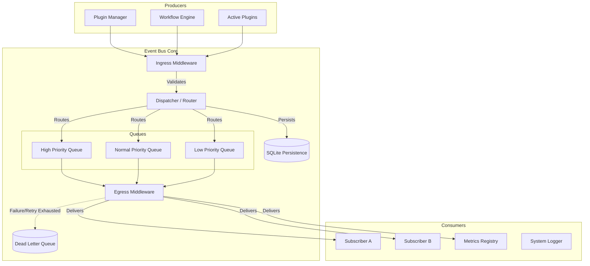
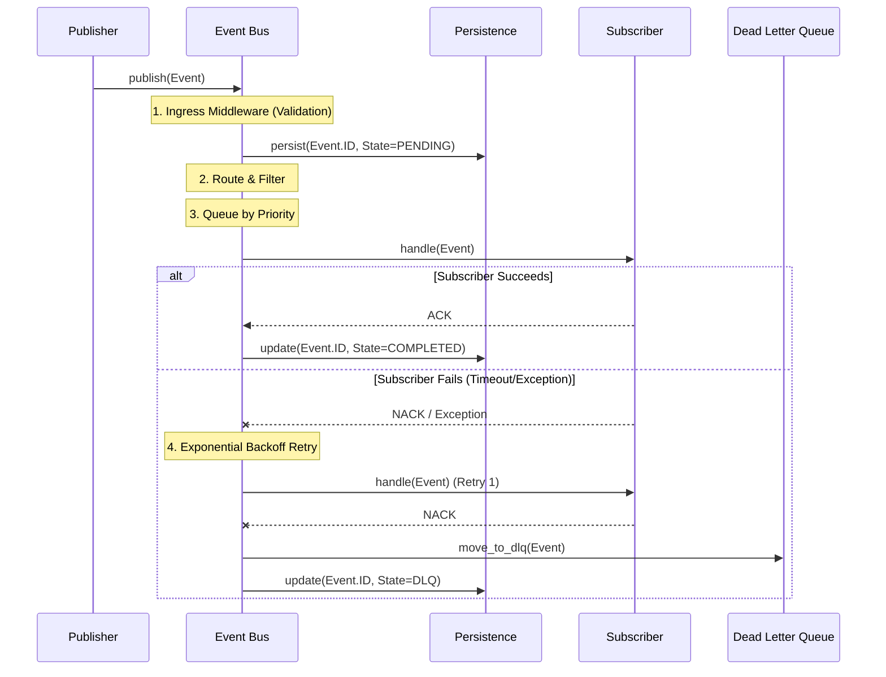

# Phase06/01_EventBus_Architecture.md

**Author:** Principal Software Architect  
**Target System:** Automated DSA Educational YouTube Video Pipeline  
**Document Version:** 1.0.0  
**Status:** Designed

---

# Table of Contents
1. [Executive Summary](#1-executive-summary)
2. [High-Level Architecture (Component Diagram)](#2-high-level-architecture-component-diagram)
3. [The Event Lifecycle (Sequence Diagram)](#3-the-event-lifecycle-sequence-diagram)
4. [Core Components](#4-core-components)
    * [Publisher & Subscriber](#publisher--subscriber)
    * [Dispatcher & Routing](#dispatcher--routing)
    * [Priority Queues & Filtering](#priority-queues--filtering)
    * [Middleware & Metrics](#middleware--metrics)
5. [Reliability & Fault Tolerance](#5-reliability--fault-tolerance)
    * [Persistence & Replay](#persistence--replay)
    * [Dead Letter Queue (DLQ) & Retry](#dead-letter-queue-dlq--retry)
6. [Scalability & Thread Safety](#6-scalability--thread-safety)

---

# 1. Executive Summary

The **Event Bus** acts as the central nervous system of the Application Runtime. It strictly enforces Decoupling. 

When the `Scraper` finishes pulling LeetCode data, it does **not** call the `WorkflowEngine` directly. Instead, it publishes an `ExtractCompletedEvent` to the Event Bus. The Event Bus takes responsibility for routing, prioritizing, and delivering this event to all interested subscribers (e.g., the `WorkflowEngine`, `MetricsRegistry`, and `Logger`), retrying if a subscriber fails, and persisting the event to disk if the system crashes midway.

This design guarantees that Plugins remain mathematically isolated and totally unaware of each other's existence.

---

# 2. High-Level Architecture (Component Diagram)

---

# 3. The Event Lifecycle (Sequence Diagram)

---

# 4. Core Components

### Publisher & Subscriber
- **Publishers** fire and forget. They construct a frozen `@dataclass` event (e.g., `PluginFailedEvent`) and pass it to `event_bus.publish()`.
- **Subscribers** register callback functions via `event_bus.subscribe(Topic, Callback)`. A single topic can have multiple subscribers.

### Dispatcher & Routing
The Dispatcher manages a routing table: `dict[Topic, list[Subscriber]]`. It supports exact matches (`plugin.started`) and wildcard routing (`plugin.*`).

### Priority Queues & Filtering
Events are pushed into `asyncio.PriorityQueue` instances based on a declared priority integer.
- `Priority.CRITICAL`: Handled immediately (e.g., `SystemShutdownEvent`).
- `Priority.NORMAL`: Standard business logic (e.g., `VideoRenderedEvent`).
- **Filtering**: Subscribers can provide a `filter_func(event) -> bool` during registration. The Dispatcher evaluates this before queueing; if false, the subscriber is skipped.

### Middleware & Metrics
The Event Bus executes an array of Middlewares:
- **Ingress Middleware**: Injects timestamps, generates correlation IDs (for trace logging), and validates schemas.
- **Egress Middleware**: Tracks `MetricsRegistry` delivery times (e.g., measuring the exact milliseconds between an event being queued and the subscriber finishing execution).

---

# 5. Reliability & Fault Tolerance

### Persistence & Replay
If the master Python process receives a `SIGKILL` mid-render, memory is lost. To prevent data loss, the Dispatcher writes incoming events to a local `SQLite` cache (or `FileCache`) with a state of `PENDING`. On the next application boot, the Event Bus boots in **Recovery Mode**, queries the database for all `PENDING` events, and replays them into the Queues.

### Dead Letter Queue (DLQ) & Retry
If a Subscriber's callback throws an exception, the Dispatcher catches it. It attempts an **Exponential Backoff Retry** (e.g., wait 1s, 2s, 4s). If max retries (e.g., 3) are exhausted, the event is moved to the **Dead Letter Queue (DLQ)**. Administrators can query the DLQ via CLI to manually inspect or replay the poisoned message later.

---

# 6. Scalability & Thread Safety

- **Thread Safety**: Because plugins might execute heavy synchronous code in `asyncio.to_thread()`, the Event Bus must be thread-safe. `asyncio.Queue` is NOT thread-safe by default if called from outside the event loop. The `publish()` method will utilize `loop.call_soon_threadsafe()` to guarantee events fired from background threads are safely injected into the master async queue.
- **Ordering**: Strict FIFO ordering is guaranteed *within* a specific Priority tier. Furthermore, all events possess a `timestamp` generated at instantiation, allowing Subscribers to easily implement deduplication or out-of-order rejection.
- **Versioning**: All payloads carry an `event_version` string (e.g., `"1.0.0"`). This guarantees that rolling upgrades to the system do not crash legacy subscribers attempting to parse modified dataclasses.
