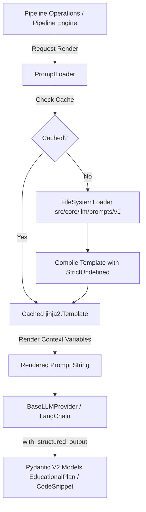
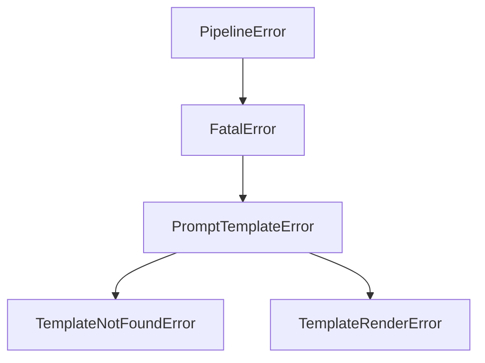

# Phase 07: Prompt Library & Management System Architecture

## 1. Executive Summary & Architecture Overview

Phase 07 introduces a centralized, version-controlled **Prompt Library & Management System** for the Automated Data Structures and Algorithms (DSA) Educational YouTube Video Pipeline. 

Prior to Phase 07, system prompts were frequently embedded directly within Python source code as multi-line string literals. This coupled prompt engineering iterations with code deployments, hindered prompt versioning, and complicated prompt rendering with dynamic runtime variables.

The Phase 07 architecture completely decouples prompt engineering logic from Python codebase execution using **Jinja2** templates (`.j2` files). System prompts are stored in a dedicated version-controlled file hierarchy (`src/core/llm/prompts/{version}/{template_name}.j2`) and managed by a high-performance, caching loader engine (`src/core/llm/prompt_loader.py`).

### Key Architectural Objectives:
1. **Decoupled Prompt Maintenance**: Prompt engineers can update, refine, and optimize Jinja2 prompt templates independently without touching core Python logic.
2. **Strict Variable Enforcement**: The rendering engine utilizes Jinja2's `StrictUndefined` mode to prevent silent variable omissions or rendering undefined variables as empty strings.
3. **Structured Output Guarantee**: Prompts explicitly instruct LLMs on Chain-of-Thought (CoT) reasoning while enforcing JSON output constraints that map 1-to-1 with Phase 05 Pydantic V2 models (`EducationalPlan`, `CodeSnippet`, `PlanSection`, `VisualCue`).
4. **Seamless Integration**: Rendered prompts integrate directly with Phase 06 LLM Provider Abstractions (`BaseLLMProvider`, `OpenAIClient`, `AnthropicClient`) using LangChain's `with_structured_output`.



---

## 2. Prompt Loading Engine Architecture

The prompt loading engine is implemented in `src/core/llm/prompt_loader.py` via the `PromptLoader` class.

### 2.1 PromptLoader Class API

```python
class PromptLoader:
    def __init__(
        self,
        template_dir: Path | str | None = None,
        default_version: str = "v1",
        cache_templates: bool = True,
        enable_cache: bool | None = None,
    ) -> None: ...

    def load_template(
        self, template_name: str, version: str | None = None
    ) -> jinja2.Template: ...

    def get_template(
        self, template_name: str, version: str | None = None
    ) -> jinja2.Template: ...

    def render(
        self,
        template_name: str,
        context: dict[str, Any] | None = None,
        version: str | None = None,
        **kwargs: Any,
    ) -> str: ...

    def list_templates(self, version: str | None = None) -> list[str]: ...

    def list_versions(self) -> list[str]: ...
```

### 2.2 Jinja2 Environment Configuration

The `PromptLoader` initializes a dedicated `jinja2.Environment` configured as follows:
- **`loader = jinja2.FileSystemLoader`**: Resolves templates from `src/core/llm/prompts` (or custom directory specified in `PromptConfig`).
- **`undefined = jinja2.StrictUndefined`**: Any access to an unsupplied context variable raises a `jinja2.UndefinedError`, which `PromptLoader` intercepts and translates to a `TemplateRenderError`.
- **`trim_blocks = True` & `lstrip_blocks = True`**: Automatically trims leading whitespace and newline characters from block tags (``), preserving clean prompt formatting.
- **`autoescape = False`**: Disables HTML auto-escaping since system prompts are plain text/markdown.
- **In-Memory Caching (`_template_cache`)**: Compiled `jinja2.Template` instances are cached in a dictionary keyed by `{version}/{template_name}.j2` for instantaneous subsequent lookups.

### 2.3 Exception Hierarchy & Mapping

All errors encountered during template loading or rendering inherit from `PromptTemplateError`, which subclasses `FatalError` (and `PipelineError`):



| Exception Class | Trigger Condition | Operational Action |
|---|---|---|
| `PromptTemplateError` | Base class for prompt template issues | Logged and handled by pipeline exception router |
| `TemplateNotFoundError` | Specified `.j2` template file does not exist under template directory | Immediately fails run; missing template requires code/asset fix |
| `TemplateRenderError` | Missing required context variable, Jinja2 syntax error, or rendering to empty string | Logs missing variable / syntax line; fails execution |

---

## 3. Template Storage & Versioning Strategy

### 3.1 Directory Hierarchy

Templates are organized hierarchically by semantic version folders under `src/core/llm/prompts/`:

```
src/core/llm/prompts/
├── v1/
│   ├── educational_plan.j2
│   └── code_explanation.j2
└── v2/ (future versions)
```

### 3.2 Versioning & Backward Compatibility Rules

1. **Immutable Versions**: Once a version directory (e.g. `v1/`) is in production, existing `.j2` template files must not undergo breaking interface changes (e.g. adding new required variables without default fallbacks).
2. **Adding New Versions**: Major prompt architecture overhauls (e.g., restructuring CoT prompts for a new major LLM family like GPT-5) must be created in a new version directory (e.g. `v2/`).
3. **Default Version Fallback**: If no version parameter is provided to `loader.render()`, `PromptLoader` defaults to `default_version` configured in `PromptConfig` (default `"v1"`).
4. **Resolution Strategy**: When `loader.render("educational_plan", version="v1")` is called, `_resolve_template_path` resolves the relative template path `v1/educational_plan.j2`.

---

## 4. Prompt Engineering & Deep Reasoning Guidelines

### 4.1 Persona & Role Calibration
Every system prompt must establish an explicit expert persona at the top of the prompt:
- **`educational_plan.j2` Persona**: `"World-Class Computer Science Educator and Senior Software Architect specializing in Data Structures and Algorithms (DSA)."`
- **`code_explanation.j2` Persona**: `"Expert Visual Educator and Technical Writer for Data Structures and Algorithms."`

Setting clear, domain-specific roles triggers specialized parametric knowledge and maintains high pedagogical quality.

### 4.2 Chain-of-Thought (CoT) Reasoning Blocks
Prompts must instruct the LLM to execute step-by-step reasoning *before* generating the final structured output:
1. **Pedagogical Intuition**: Identify the core "Aha!" moment required to understand the algorithm.
2. **Naive vs. Optimal Analysis**: Contrast brute-force space/time complexities with optimal bounds.
3. **Audience Calibration**:
   - **Beginner**: Relatable real-world analogies (e.g., hash maps as physical labeled lockers), plain English, zero unexplained jargon.
   - **Intermediate**: Clear data structure state transitions, visual pointer movements, standard Big-O notation.
   - **Advanced**: Cache locality, bitwise optimizations, formal proofs, memory alignment.
4. **Visual & State Synchronizations**: Explicit mapping from algorithm steps to visual cues (e.g., pointer moves, node colorings).

### 4.3 Structured Output Enforcement with Pydantic V2
System prompt templates include explicit instructions detailing the required JSON schema structure matching Phase 05 Pydantic V2 models (`EducationalPlan`, `CodeSnippet`, `PlanSection`, `VisualCue`). Crucial schema invariants (e.g., unique `section_id`, matching total duration within ±0.1s, regex-validated `slug`) are listed as strict constraints in the prompt text.

---

## 5. Jinja2 Usage Standards & Conventions

To maintain consistency and avoid rendering runtime errors under `StrictUndefined`, template authors must adhere to the following conventions:

### 5.1 Safe Handling of Optional Variables
Under Jinja2 `StrictUndefined`, checking `` raises `jinja2.UndefinedError` if `var` is not passed in the context dictionary.
**Mandatory Standard**:
- For optional lists/dicts/strings, use ``.
- Alternatively, use Jinja2's default filter with `none` or empty structures: `{{ (line_highlights if line_highlights is defined else []) | tojson }}`.

### 5.2 Control Flow & Whitespace Trimming
- Always use `` and `` for conditional blocks and lists.
- Avoid trailing white space at line ends.
- Use explicit Jinja2 whitespace stripping `` when precise spacing around block tags is required.

---

## 6. Foundational Template Catalog

### 6.1 `educational_plan.j2`

#### Purpose:
System prompt for generating comprehensive educational lesson plans (`EducationalPlan`) optimized for deep LLM reasoning and video content generation.

#### Input Variable Contract:
| Variable Name | Type | Required? | Description |
|---|---|---|---|
| `topic` | `str` | Yes | DSA topic name (e.g. "Two Sum - Hash Map Approach") |
| `slug` | `str` | Yes | URL slug matching `^[a-z0-9-]+$` |
| `difficulty` | `str` | Yes | Difficulty level ("Easy", "Medium", "Hard") |
| `target_audience` | `str` | Yes | Target audience ("Beginner", "Intermediate", "Advanced") |
| `problem_description` | `str` | Yes | Complete DSA problem statement |
| `target_duration_seconds` | `float` | Yes | Target total video duration in seconds (e.g. `180.0`) |
| `constraints` | `list[str]` | Optional | Constraints list (e.g. `["1 <= nums.length <= 10^4"]`) |
| `learning_objectives` | `list[str]` | Optional | Custom target learning objectives |
| `rag_context` | `list[str]` | Optional | Retrieved knowledge base chunks |
| `code_implementations` | `dict[str, str]` | Optional | Reference implementations keyed by language |

#### Sample Rendered Output Excerpt:
```
You are a World-Class Computer Science Educator and Senior Software Architect...
Your mission is to construct a detailed, highly engaging educational lesson plan for... "Two Sum".

=== TOPIC SPECIFICATIONS ===
- Topic Name: Two Sum
- URL Slug: two-sum
- Target Audience: Beginner
- Problem Difficulty: Easy
- Target Video Duration: 180.0 seconds
...
```

---

### 6.2 `code_explanation.j2`

#### Purpose:
System prompt for generating line-by-line animated code walkthroughs and state tracking cues.

#### Input Variable Contract:
| Variable Name | Type | Required? | Description |
|---|---|---|---|
| `topic` | `str` | Yes | DSA topic name |
| `language` | `str` | Yes | Programming language (e.g. "python", "cpp", "java") |
| `code` | `str` | Yes | Complete solution code block |
| `time_complexity` | `str` | Yes | Asymptotic time complexity (e.g. "O(N)") |
| `space_complexity` | `str` | Yes | Asymptotic space complexity (e.g. "O(N)") |
| `line_highlights` | `list[int]` | Optional | 1-based line numbers to emphasize |
| `pitfalls` / `common_pitfalls` | `list[str]` | Optional | Common bug patterns and pitfalls |

#### Sample Rendered Output Excerpt:
```
You are an Expert Visual Educator and Technical Writer for Data Structures and Algorithms.
Your goal is to produce an in-depth, line-by-line animated code walkthrough...

=== CODE SPECIFICATION ===
Language: python
Source Code:
```python
def two_sum(nums, target):
    seen = {}
    for i, num in enumerate(nums):
        diff = target - num
        if diff in seen:
            return [seen[diff], i]
        seen[num] = i
```
...
```

---

## 7. Verification & Testing Strategy

### 7.1 Python PromptLoader Verification Command
Verification of template loading in Python environment:
```bash
./.venv/bin/python -c "from src.core.llm.prompt_loader import PromptLoader; loader = PromptLoader(); print(loader.list_templates('v1'))"
```

Expected Output:
```python
['code_explanation.j2', 'educational_plan.j2']
```

### 7.2 Pytest Test Suite Strategy (`tests/llm/test_prompt_loader.py`)

The test suite validates:
1. **Template Discovery**: `list_templates("v1")` returns `['code_explanation.j2', 'educational_plan.j2']`.
2. **Template Loading & Caching**: Second retrieval of a template returns the identical object from `_template_cache`.
3. **Exact String Match Assertions**: Rendering templates with mock context variables produces non-empty output containing expected sub-strings.
4. **Strict Undefined Exception Handling**: Omitting required variables (e.g. `topic`) raises `TemplateRenderError`.
5. **Missing Template Exception Handling**: Requesting non-existent template raises `TemplateNotFoundError`.
