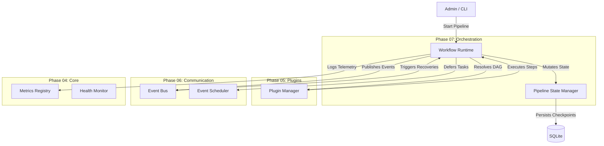
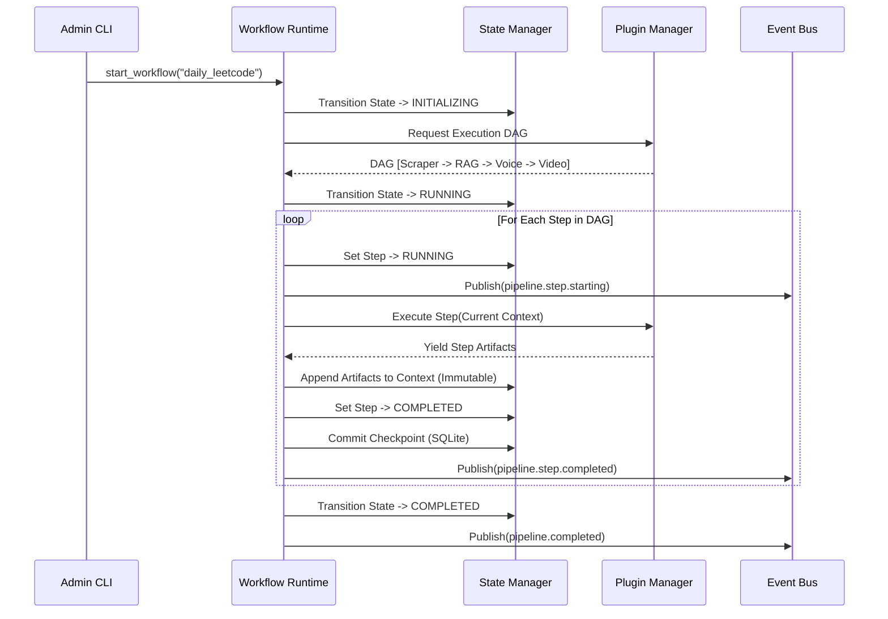
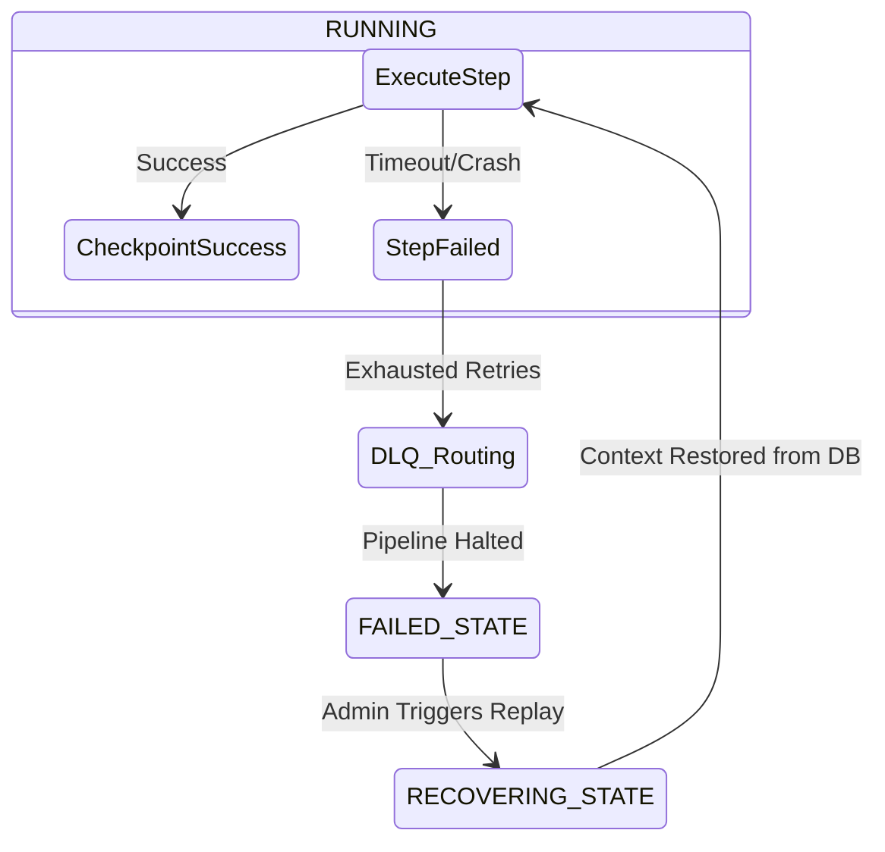

# Phase 07 / 01: Workflow Runtime Architecture

**Author:** Principal Software Architect  
**Target System:** Automated DSA Educational YouTube Video Pipeline  
**Document Version:** 1.0.0  
**Status:** Approved for Implementation

---

## 1. Executive Summary

This document introduces the **Workflow Runtime** (Pipeline Orchestrator). 

While Phase 04 built the Core dependencies, Phase 05 built the Plugin Engine, and Phase 06 built the Event Bus, **Phase 07** stitches them all together. The Workflow Runtime acts as the central brain. It takes abstract Workflow Definitions (e.g., `"leetcode-daily-video"`), resolves the necessary plugins into a Directed Acyclic Graph (DAG) via the Plugin Manager, maintains the execution loop via the Pipeline State Manager, and dispatches pub/sub communications via the Event Bus.

---

## 2. High-Level Component Architecture



---

## 3. Core Responsibilities

1. **Workflow Loading & Planning:** Parses static Workflow definitions, identifies the required plugins, and uses the `PluginDependencyResolver` to mathematically sort the execution steps into a topological DAG (Directed Acyclic Graph).
2. **Execution & Concurrency:** Iterates through the DAG. If two steps do not depend on each other (e.g., Generating Video Thumbnails vs Generating TTS Audio), it wraps them in `asyncio.gather()` for blazing-fast parallel execution.
3. **Checkpointing & Recovery:** After every successfully completed step, it halts the DAG momentarily to serialize the `PipelineContext` into the SQLite database. If the server crashes, it queries the DB on boot and resumes from the exact DAG node where it died.
4. **Cancellation & Pause:** Intercepts Admin CLI signals to cleanly pause the execution loop at the next safe Checkpoint boundary, avoiding corrupted file I/O operations.

---

## 4. Execution Sequence Diagram



---

## 5. State Diagrams & Thread Safety

### 5.1 Concurrency and Thread Safety
Because the Workflow Runtime uses `asyncio`, we avoid traditional OS-level thread deadlocks. However, to guarantee absolute State Safety:
1. **The Orchestrator Lock:** A strict `asyncio.Lock()` wraps the `PipelineContext` mutation function. If two parallel steps (Thumbnail Generation & Audio Generation) finish at the exact same millisecond, they will serialize sequentially into the Context array rather than overwriting each other in RAM.
2. **Idempotent Retries:** If a step fails, the Workflow Runtime relies on the Event Bus DLQ. When the DLQ re-injects the event, the Runtime checks the `StateManager` to see if the artifacts already exist. If they do, it skips the execution, proving Idempotency.

### 5.2 Failure & Recovery State Flow



---

## 6. Implementation Guidance

### 6.1 The Interface
When implementing the code, construct a `WorkflowRuntime` class that receives the dependencies via Constructor Injection. 

```python
class WorkflowRuntime:
    def __init__(
        self, 
        plugin_manager: PluginManager, 
        event_bus: EventBus, 
        state_manager: PipelineStateManager,
        metrics: MetricsRegistry
    ): ...
```

### 6.2 Anti-Patterns to Avoid
1. **Hardcoding Workflows:** Do not write `if workflow == "leetcode": execute_scraper()`. The Runtime must be completely agnostic. It should simply iterate over whatever DAG the `PluginManager` hands it.
2. **Blocking Operations:** Never use `time.sleep()` to wait for a plugin. The entire execution loop must use `await plugin.execute()`, deferring thread blocking to the Plugin's internal architecture.
3. **Partial Checkpoints:** Never commit a SQLite checkpoint *during* a step execution. Checkpoints must be absolutely atomic. They are only written the millisecond a step successfully transitions to `COMPLETED`.
