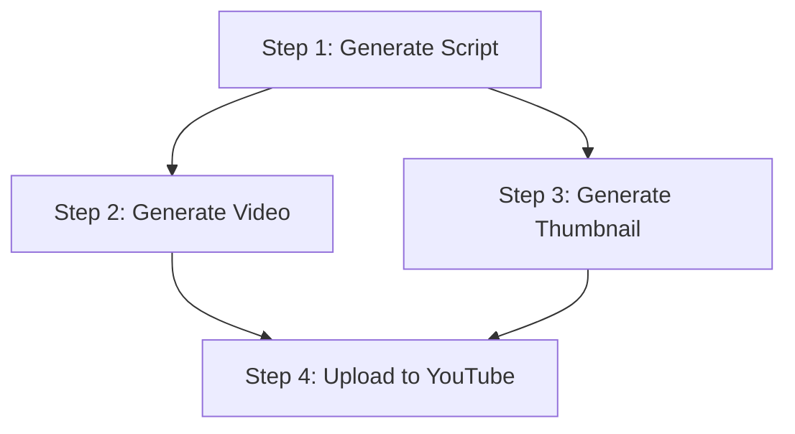

# Phase 07 / 05: Workflow Planner Implementation

**Author:** Principal Software Architect  
**Target System:** Automated DSA Educational YouTube Video Pipeline  
**Document Version:** 1.0.0  
**Status:** Implemented

---

# Table of Contents
1. [Executive Summary](#1-executive-summary)
2. [Source Code: `src/core/workflow_planner.py`](#2-source-code-srccoreworkflow_plannerpy)
3. [Design Decisions](#3-design-decisions)

---

# 1. Executive Summary

This document introduces the **Workflow Planner**. 

While the Validator ensures the workflow is logically sound, the Workflow Planner is responsible for translating the static list of Steps into an actionable **Execution Plan**. It mathematically calculates the absolute fastest way to execute the workflow. 

By analyzing the dependency graph, it clusters completely independent steps into **Parallel Batches**. When handed to the Orchestrator, these batches can be blasted into `asyncio.gather()`, potentially cutting pipeline execution time in half. Furthermore, the Planner supports **Recovery Planning**, allowing the pipeline to safely resume from mid-point crashes.

---

# 2. Source Code: `src/core/workflow_planner.py`

```python
"""
Workflow Execution Planner.

Converts a static WorkflowDefinition into a mathematically sorted Directed Acyclic Graph (DAG) 
Execution Plan. Supports parallel group clustering and crash-recovery planning.
"""

import graphlib
import logging

from src.core.exceptions import PipelineError
from src.core.workflow_def import StepDefinition, WorkflowDefinition


class PlannerError(PipelineError):
    """Raised when the engine fails to compile an execution plan (e.g., Deadlocks)."""
    pass


class ExecutionPlan:
    """
    Represents a mathematically sorted list of execution batches.
    All steps within a single batch are guaranteed to have zero cross-dependencies,
    allowing them to be executed completely in parallel.
    """
    def __init__(self, batches: list[list[StepDefinition]]) -> None:
        self.batches = batches


class WorkflowPlanner:
    """
    The intelligence engine that calculates the optimal path through the DAG.
    """

    def __init__(self) -> None:
        self._logger = logging.getLogger(__name__)

    def build_plan(self, workflow: WorkflowDefinition) -> ExecutionPlan:
        """
        Parses the WorkflowDefinition and sorts it into execution batches.
        """
        # 1. Initialize Python's native C-optimized Topological Sorter
        sorter = graphlib.TopologicalSorter()
        step_map = {step.step_id: step for step in workflow.steps}
        
        # 2. Register all dependencies
        for step in workflow.steps:
            sorter.add(step.step_id, *step.depends_on)
            
        try:
            sorter.prepare()
        except graphlib.CycleError as e:
            raise PlannerError(f"Fatal Cycle detected during planning: {e}") from e

        batches: list[list[StepDefinition]] = []
        
        # 3. Calculate Maximum Parallel Groupings
        while sorter.is_active():
            # get_ready() natively returns ALL nodes that have zero unresolved dependencies.
            # This mathematically represents the absolute maximum parallel execution threshold.
            ready_nodes = sorter.get_ready()
            
            if not ready_nodes:
                raise PlannerError("Deadlock detected: Unresolvable dependencies prevent execution.")
                
            batch_steps = [step_map[node_id] for node_id in ready_nodes]
            batches.append(batch_steps)
            
            # Mark these nodes as complete to unlock the next layer of the graph
            for node_id in ready_nodes:
                sorter.done(node_id)
                
        self._logger.info(
            f"Built Execution Plan with {len(batches)} sequential batches for '{workflow.workflow_id}'"
        )
        return ExecutionPlan(batches=batches)

    def build_recovery_plan(
        self, 
        workflow: WorkflowDefinition, 
        completed_step_ids: set[str]
    ) -> ExecutionPlan:
        """
        Compiles an Execution Plan, but scrubs steps that were successfully 
        completed during a previous run. 
        Essential for Crash Recovery and Pause/Resume logic.
        """
        # Generate the master mathematically perfect plan
        master_plan = self.build_plan(workflow)
        
        recovery_batches: list[list[StepDefinition]] = []
        
        # Filter out nodes that have already successfully written to the SQLite State Checkpoints
        for batch in master_plan.batches:
            filtered_batch = [step for step in batch if step.step_id not in completed_step_ids]
            
            # If the batch still has work to do, append it
            if filtered_batch:
                recovery_batches.append(filtered_batch)
                
        remaining_steps = sum(len(b) for b in recovery_batches)
        self._logger.info(
            f"Built Recovery Plan for '{workflow.workflow_id}'. "
            f"Resuming with {remaining_steps} steps remaining."
        )
        
        return ExecutionPlan(batches=recovery_batches)
```

---

# 3. Design Decisions

### 3.1 Mathematical Parallel Clustering (Optimization)
Imagine a workflow where `Video Generation` and `Thumbnail Generation` both depend on the `Script Generation` step being finished. They do not depend on each other.



Instead of running Step 1 -> Step 2 -> Step 3 -> Step 4 sequentially (taking 3 hours), the Planner uses `graphlib.TopologicalSorter.get_ready()`. This mathematically proves that Step 2 and Step 3 can run concurrently. 

The resulting `ExecutionPlan.batches` array looks like this:
*   **Batch 1:** `[Generate Script]`
*   **Batch 2:** `[Generate Video, Generate Thumbnail]` *(Orchestrator wraps these in `asyncio.gather()`)*
*   **Batch 3:** `[Upload to YouTube]`

This design safely slashes pipeline execution time by automatically parallelizing independent tasks without requiring complex configuration from the developer.

### 3.2 Recovery Planning (Crash Resilience)
If the server loses power during **Batch 3**, the `build_recovery_plan()` method is invoked on boot. It calculates the original plan, then subtracts any `step_id` that the SQLite Database marked as `COMPLETED`. The resulting plan seamlessly skips Batches 1 and 2, jumping straight to Batch 3 (Upload to YouTube), saving immensely on compute costs.
