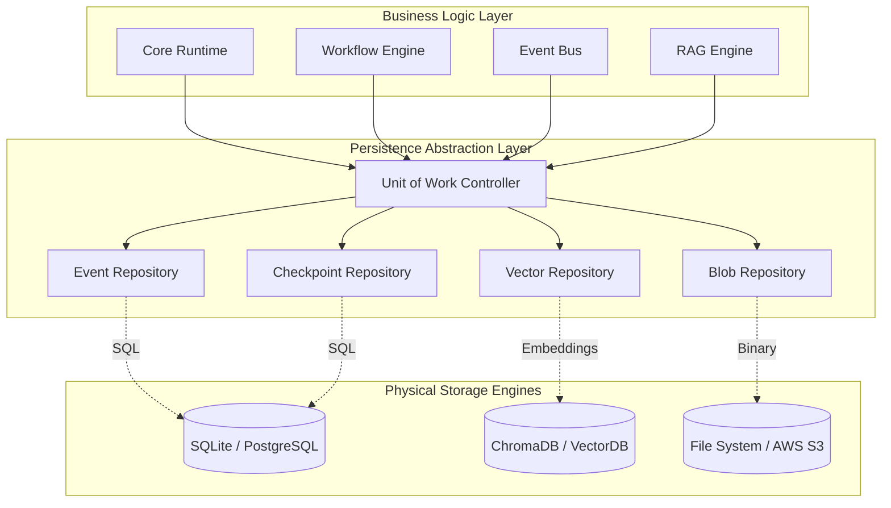
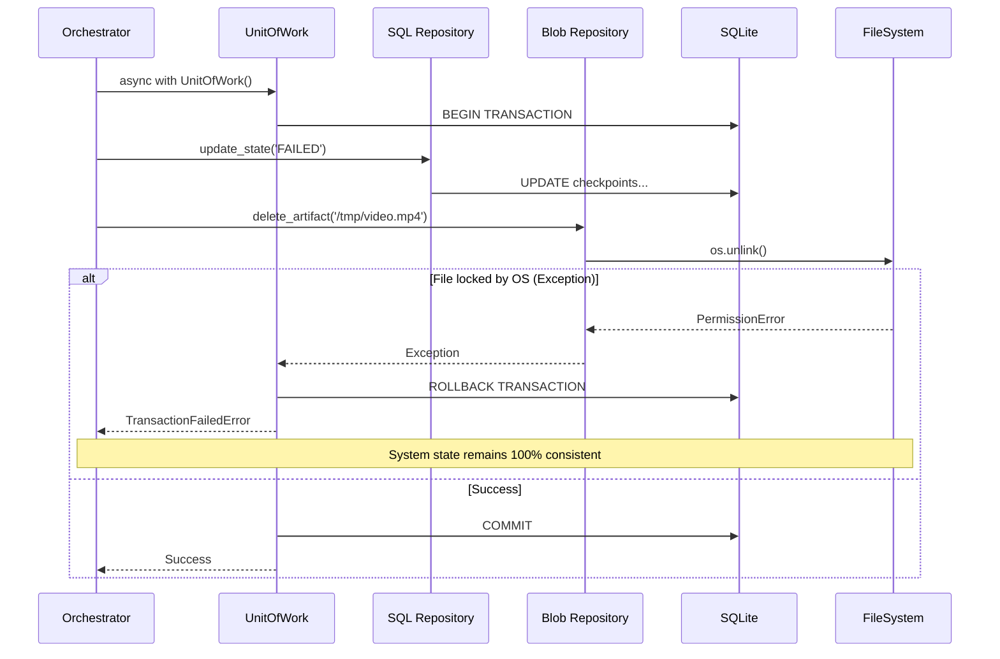
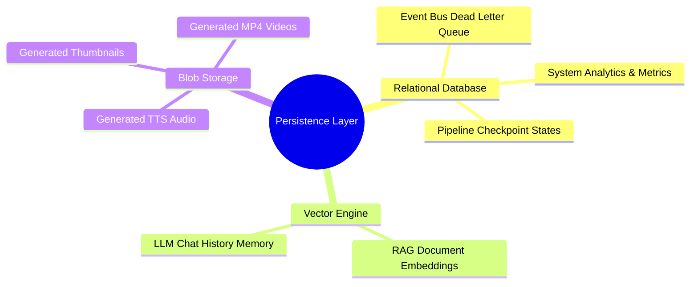

# Phase 08 / 01: Persistence Architecture Design

**Author:** Principal Software Architect  
**Target System:** Automated DSA Educational YouTube Video Pipeline  
**Document Version:** 1.0.0  
**Status:** Designed

---

# Table of Contents
1. [Executive Summary](#1-executive-summary)
2. [Storage Abstraction Layer](#2-storage-abstraction-layer)
3. [Transactions & Concurrency](#3-transactions--concurrency)
4. [Architecture & Sequence Diagrams](#4-architecture--sequence-diagrams)
5. [Integrity, Backups & Recovery](#5-integrity-backups--recovery)
6. [Migration Strategy](#6-migration-strategy)

---

# 1. Executive Summary

As the platform evolves to support RAG (Retrieval-Augmented Generation), long-term Agentic Memory, and advanced Video Analytics, the underlying data architecture can no longer rely on ad-hoc SQLite connections scattered across different modules. 

This document outlines a **Unified Persistence Architecture**. By implementing the **Repository Pattern** and the **Unit of Work Pattern**, the core business logic will be completely decoupled from the physical storage engines. This allows the system to seamlessly transition from lightweight local development (SQLite + JSON files) to enterprise distributed deployments (PostgreSQL + ChromaDB + AWS S3) with absolute zero changes to the core execution engine.

---

# 2. Storage Abstraction Layer

To future-proof the application, all storage access is brokered through strict Python `Protocol` interfaces.

### 2.1 The Repository Pattern
Every domain entity (e.g., `WorkflowCheckpoint`, `EventLog`, `VectorDocument`) will have a dedicated Repository Interface.
*   **Decoupling:** The `WorkflowExecutor` will call `IStateRepository.save()`. It does not know—and does not care—if that data is written to SQLite, PostgreSQL, or a cloud API.
*   **Testability:** Mocking database connections for Unit Tests becomes a trivial dependency injection of a `DictRepository`.

### 2.2 Future Database Mapping
*   **Relational Data (SQLite / Future PostgreSQL):** Used for strict ACID guarantees. Handles Event Logs, Workflow Checkpoints, Metric Analytics, and User Configuration.
*   **Vector Data (Future ChromaDB / Pinecone):** Stores highly-dimensional embeddings for the Educational RAG system (e.g., LeetCode problem contexts, Agent memories).
*   **Blob Data (Local Filesystem / Future AWS S3):** Stores massive binary artifacts (MP4 Video renders, raw Audio files, generated Thumbnail images).

---

# 3. Transactions & Concurrency

### 3.1 Unit of Work (UoW) Pattern
When a workflow fails, we must purge the OS files *and* update the SQLite database. If the DB updates but the OS file purge crashes halfway through, the system enters a physically corrupted state. 

The **Unit of Work** guarantees Atomicity. It groups multiple repository operations into a single logical transaction. If *any* operation fails, the UoW intercepts the Exception and triggers a synchronized Rollback across all underlying databases.

### 3.2 Locking & Concurrency
*   **Pessimistic Locking:** Used for critical path transitions (e.g., moving a Workflow from `RUNNING` to `COMPLETED`).
*   **Optimistic Locking (Versioning):** Entities will include a `version` integer. When a UoW attempts to commit, it checks `WHERE id = ? AND version = ?`. If another thread has modified the row, the commit throws a `ConcurrencyCollisionError`, protecting against lost updates without locking the entire table.

---

# 4. Architecture & Sequence Diagrams

### 4.1 System Architecture Diagram
This illustrates the strict boundary between Business Logic and Physical Storage.

### 4.2 Unit of Work Transaction Sequence
This demonstrates how the system guarantees data consistency if a multi-step storage process fails.

### 4.3 Storage Topology Diagram
Mapping domain entities to their optimal physical engines.

---

# 5. Integrity, Backups & Recovery

### 5.1 Snapshots and Backups
To protect years of orchestration telemetry and Agentic memory, the persistence layer will expose a generic `IRestoreAdmin` interface.
*   **Hot Backups:** SQLite provides native `.backup()` capabilities that can clone the database to a secondary disk while the application is live, without acquiring table locks that would freeze active Video Pipelines.

### 5.2 Artifact Retention Policies
Blob storage (Videos) grows exponentially. The architecture incorporates active TTL (Time-To-Live) garbage collection. When a pipeline hits `COMPLETED`, the JSON Context is saved to DB, but intermediate OS files (like temporary audio clips or intermediate render layers) are immediately purged by a background `MaintenanceWorker`.

---

# 6. Migration Strategy

Database schemas evolve. A new Plugin might require a new Checkpoint field.
The Persistence layer will enforce an internal **Schema Migration Engine** (similar to Alembic).
*   On application boot, the Engine reads a `migrations/` folder.
*   It compares the folder's highest version number against the `schema_version` table in SQLite.
*   If the DB is outdated, it sequentially applies the missing `UP` transactions before yielding the boot lock, ensuring the codebase never interacts with an incompatible database structure.
