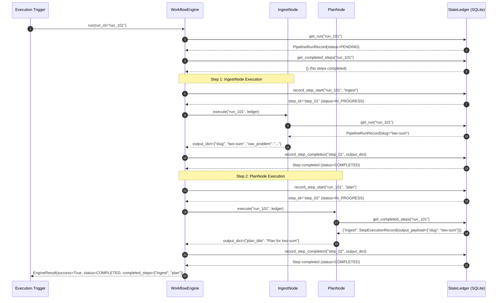
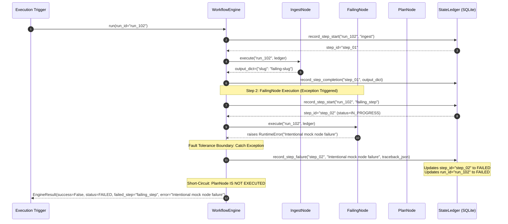
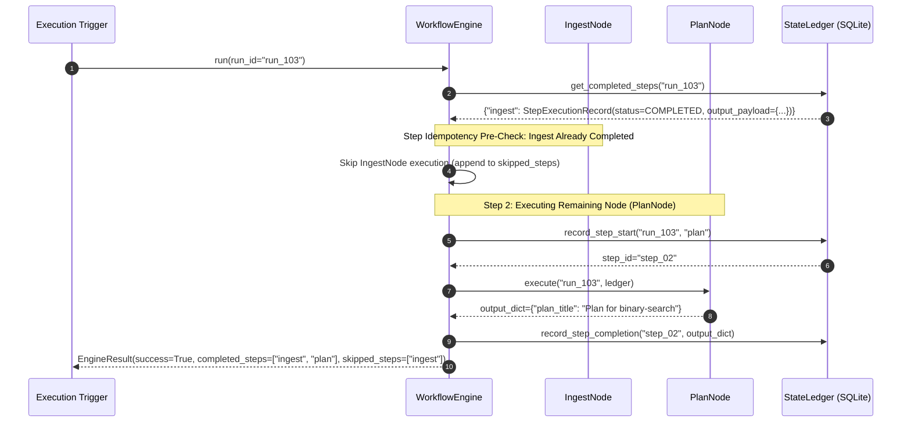

# Phase 08: Workflow Engine Architecture

## 1. Executive Summary & Architectural Overview

The Phase 08 Workflow Engine forms the execution core of the Automated DSA Educational YouTube Video Pipeline. Operating strictly under the **Synchronous Batch-Pipeline** paradigm, the Workflow Engine orchestrates sequential pipeline stages (e.g., Ingest, Plan, Script, Render) with full crash recovery, state persistence, and execution idempotency.

```
+-----------------------------------------------------------------------------------+
|                                Workflow Engine                                   |
|                                                                                   |
|  +--------------------+    +--------------------+    +--------------------+       |
|  |     IngestNode     | -> |      PlanNode      | -> |     ScriptNode     | -> ...|
|  +---------+----------+    +---------+----------+    +---------+----------+       |
|            |                         |                         |                  |
+------------|-------------------------|-------------------------|------------------+
             | Write Output            | Write Output            | Write Output
             v                         v                         v
+-----------------------------------------------------------------------------------+
|                        SQLite State Ledger (WAL Mode)                             |
|  - pipeline_runs                                                                  |
|  - step_executions                                                                |
+-----------------------------------------------------------------------------------+
```

### Core Architectural Guarantees

1. **Synchronous Execution Model**: The pipeline runs strictly sequentially without asynchronous event loops, reactive callbacks, or dynamic dependency injection containers.
2. **State-Ledger-Only Data Passing**: Nodes do not accept, store, or pass in-memory state objects or intermediate data structures to subsequent nodes. All stage inputs and outputs are read from and written to the SQLite `StateLedger` indexed by a unique `run_id`.
3. **True Step Idempotency**: Before invoking any node execution, the engine inspects completed step records in the `StateLedger`. Completed nodes (`StepStatus.COMPLETED`) are automatically skipped, enabling instant resumption of interrupted or partially executed pipeline runs without repeating expensive LLM generation or video rendering.
4. **Crash-Safe Fault Tolerance**: Every node invocation is enclosed within a try/except error boundary. If a node raises an unhandled exception (e.g., network failure, malformed output, render crash), the engine catches the error, updates the SQLite step and pipeline run records to `FAILED`, and halts downstream execution gracefully without crashing the parent process.

---

## 2. Node Abstraction & Idempotency Strategy

The abstract node contract defined in `src/core/workflow/node.py` specifies the base interface for all processing steps in the video generation pipeline.

### 2.1 Interface Definition (`Node(ABC)`)

```python
from abc import ABC, abstractmethod
from typing import Any
from src.core.orchestrator.state_ledger import PipelineRunRecord, StateLedger

class Node(ABC):
    """
    Abstract Base Class for all workflow nodes in the execution pipeline.
    """

    @property
    @abstractmethod
    def name(self) -> str:
        """Unique name identifier for the workflow node step."""
        pass

    @abstractmethod
    def execute(self, run_id: str, ledger: StateLedger) -> dict[str, Any]:
        """Execute node processing logic for the specified run_id."""
        pass
```

### 2.2 Built-in State Ledger Helper Methods

`Node` provides thread-safe helper methods for subclass nodes to safely query pipeline state from SQLite:

*   `get_run_record(run_id: str, ledger: StateLedger) -> PipelineRunRecord`:
    Retrieves the `PipelineRunRecord` matching `run_id`. Raises `PipelineStageError` if the `run_id` is missing from `StateLedger`.
*   `get_completed_step_outputs(run_id: str, ledger: StateLedger) -> dict[str, dict[str, Any]]`:
    Queries all completed steps for the `run_id` and returns a dictionary mapping `step_name` to its output payload dictionary.
*   `get_step_output(run_id: str, ledger: StateLedger, step_name: str) -> dict[str, Any]`:
    Retrieves the output payload dictionary of a specific prior step. Raises `PipelineStageError` if the step is missing or not recorded as `COMPLETED`.

### 2.3 Idempotency & In-Memory Isolation Rules

To maintain absolute decoupling and deterministic execution, node instances are strictly prohibited from storing or accepting in-memory state objects across step boundaries:

```
[INCORRECT / FORBIDDEN PATTERN]
ingest_node = IngestNode()
data = ingest_node.execute()
plan_node = PlanNode(input_data=data) # Prohibited in-memory object passing

[CORRECT PATTERN]
# Engine passes run_id and ledger reference only
output = node.execute(run_id=run_id, ledger=ledger)
# Node reads prior step data explicitly from StateLedger:
ingest_output = self.get_step_output(run_id, ledger, "ingest")
```

---

## 3. Fault-Tolerant Engine Mechanics

The `WorkflowEngine` class (`src/core/workflow/engine.py`) orchestrates sequence execution, step skipping, error handling, and ledger persistence.

### 3.1 Class Blueprint & Signature

```python
class WorkflowEngine:
    def __init__(
        self,
        nodes: Sequence[Node],
        ledger: Optional[StateLedger] = None,
    ) -> None:
        ...

    def run(self, run_id: str) -> EngineResult:
        ...

    # Convenient method aliases matching interface contracts
    def execute(self, run_id: str) -> EngineResult: ...
    def run_pipeline(self, run_id: str) -> EngineResult: ...
```

### 3.2 Execution Loop & Step Lifecycle Mechanics

When `run(run_id)` is invoked, `WorkflowEngine` performs the following steps:

1.  **Run Validation**: Queries `StateLedger.get_run(run_id)`. If the record does not exist, raises `PipelineError`.
2.  **Idempotency Pre-Check**: Retrieves all completed steps for `run_id` via `ledger.get_completed_steps(run_id)`.
3.  **Sequential Node Loop**:
    *   **Skip Check**: If `node.name` exists in `completed_steps_map` with status `COMPLETED`, the engine logs skipping, appends `node.name` to `skipped_steps` and `completed_steps`, extracts stored `output_payload`, and advances to the next node.
    *   **Step Start Recording**: Calls `ledger.record_step_start(run_id, node.name)`, transitioning the step state to `IN_PROGRESS` and generating a unique `step_id`.
    *   **Try/Except Execution Wrapper**:
        *   Invokes `node.execute(run_id, ledger)`.
        *   On Success: Calls `ledger.record_step_completion(step_id, node_output)`, transitioning the step status to `COMPLETED`. Appends `node.name` to `completed_steps` and records output.
        *   On Failure (`except Exception as e`):
            1.  Extracts error message string and formats stack trace into `error_details`.
            2.  Invokes `ledger.record_step_failure(step_id, error_message, error_details)`.
            3.  SQLite ledger updates step status to `FAILED` and marks the overall `pipeline_runs` record status as `FAILED`.
            4.  Short-circuits the pipeline loop immediately, returning an `EngineResult` with `success=False` and `status=StepStatus.FAILED`.

### 3.3 EngineResult & Conversion Contract

`EngineResult` encapsulates the outcome of pipeline execution:

```python
@dataclass
class EngineResult:
    success: bool
    run_id: str
    completed_steps: list[str] = field(default_factory=list)
    failed_step: Optional[str] = None
    error: Optional[str] = None
    execution_time_ms: float = 0.0
    status: StepStatus = StepStatus.COMPLETED
    skipped_steps: list[str] = field(default_factory=list)
    outputs: dict[str, Any] = field(default_factory=dict)

    def to_base_result(self, data: Any = None) -> BasePipelineResult[Any]:
        """Adapts EngineResult into a standard BasePipelineResult."""
        ...
```

---

## 4. SQLite State Ledger Integration & Status Lifecycle

The engine communicates with SQLite through `StateLedger` (`src/core/orchestrator/state_ledger.py`), configured with Write-Ahead Logging (WAL) mode for concurrency and crash resilience.

### 4.1 Step & Pipeline Status Enum (`StepStatus`)

The step and run lifecycles are governed by `StepStatus`:

| Status Enum Value | Description | Trigger Method |
| :--- | :--- | :--- |
| `PENDING` | Run initialized, steps awaiting execution | `ledger.create_run(slug)` |
| `IN_PROGRESS` | Node actively executing processing logic | `ledger.record_step_start(run_id, step_name)` |
| `COMPLETED` | Node execution succeeded, outputs persisted | `ledger.record_step_completion(step_id, output_payload)` |
| `FAILED` | Node execution threw an exception | `ledger.record_step_failure(step_id, error_msg, details)` |

### 4.2 SQLite Schema Mapping

```
                       +-------------------------+
                       |      pipeline_runs      |
                       +-------------------------+
                       | pipeline_run_id (PK)    |
                       | slug                    |
                       | status (StepStatus)     |
                       | created_at / updated_at |
                       +------------+------------+
                                    | 1
                                    |
                                    | N
                       +------------v------------+
                       |     step_executions     |
                       +-------------------------+
                       | step_execution_id (PK)  |
                       | pipeline_run_id (FK)    |
                       | step_name               |
                       | status (StepStatus)     |
                       | input_payload (JSON)    |
                       | output_payload (JSON)   |
                       | error_message           |
                       | error_details (JSON)    |
                       +-------------------------+
```

---

## 5. Mermaid Sequence Diagrams

### 5.1 Diagram 1: Happy Path Execution

The following sequence illustrates end-to-end execution across nodes (`IngestNode` -> `PlanNode`), updating SQLite StateLedger at each lifecycle boundary.



### 5.2 Diagram 2: Exception Recovery / Fault-Tolerant Execution

The following sequence illustrates exception capturing when a node fails (`FailingNode`), updating SQLite StateLedger to `FAILED`, and returning a failure result without crashing the application.



### 5.3 Diagram 3: Pipeline Resumption & Step Skipping Flow

The following sequence illustrates step skipping when re-running an engine on a previously partially completed pipeline run.



---

## 6. Exception Failure Matrix & Error Mapping

The following operational failure matrix maps runtime exception types to SQLite State Ledger updates and engine recovery behavior.

| Exception Class | Trigger Cause / Scenario | Operational Category | State Ledger Action | Engine Action & Recovery Strategy |
| :--- | :--- | :--- | :--- | :--- |
| `PipelineStageError` | Missing run record or required prior step output | `FatalError` | Records step status `FAILED`, updates run status `FAILED` | Halts execution, records missing dependency error, returns `EngineResult(success=False)`. |
| `PipelineError` | Invalid `run_id` or SQLite database connection error | `FatalError` | N/A (Run record not accessible or DB down) | Raises exception directly before loop or returns failure result. |
| `RuntimeError` | Unexpected runtime node crash (LLM timeout, render failure) | `FatalError` / `RetryableError` | Records step status `FAILED` with traceback string | Catches exception via try/except wrapper, updates ledger, halts pipeline gracefully without process crash. |
| `ValueError` | Engine initialized with empty nodes list (`nodes=[]`) | Configuration Error | N/A (Occurs during initialization) | Raises `ValueError` immediately on instantiation. |
| `KeyError` | Node attempts to access missing key in prior step payload | Development Error | Records step status `FAILED` with traceback details | Catches exception, records failure details in ledger, halts pipeline. |
| `ValidationError` (Pydantic) | Node output schema validation failure | Data Contract Error | Records step status `FAILED` with validation details | Catches Pydantic validation exception, records validation error details, halts pipeline. |

---

## 7. Pytest Verification Guide & Test Suite Summary

The workflow engine implementation is verified by the unit test suite located in `tests/workflow/test_engine.py`.

### 7.1 Test Suite Verification Command

Run pytest targeting the workflow test suite:

```bash
pytest tests/workflow/test_engine.py -v
```

### 7.2 Test Case Summary

| Test Function Name | Tested Functionality | Expected Result |
| :--- | :--- | :--- |
| `test_node_abstract_instantiation_raises` | Direct instantiation of abstract `Node` or incomplete subclass | Raises `TypeError` |
| `test_workflow_engine_empty_nodes_raises` | `WorkflowEngine([], ledger)` instantiation | Raises `ValueError` with `"requires a non-empty sequence"` |
| `test_workflow_engine_invalid_run_id_raises` | Executing `engine.run("invalid_run")` | Raises `PipelineError` with `"not found in StateLedger"` |
| `test_workflow_engine_successful_pipeline_execution` | End-to-end execution of `MockIngestNode` and `MockPlanNode` | Returns `EngineResult` with `success=True`, `status=COMPLETED`, and correct step outputs |
| `test_workflow_engine_idempotency_skipping` | Sequential double execution of pipeline on same `run_id` | Second run returns `success=True` with `skipped_steps=["ingest", "plan"]` |
| `test_workflow_engine_node_failure_handling` | Execution with `FailingNode` raising `RuntimeError` | Catches error, updates SQLite run status to `FAILED`, returns `EngineResult` with `success=False` and `failed_step="failing_step"` |
| `test_workflow_engine_missing_prior_step_error` | Execution of node requiring output from non-existent step | Node raises `PipelineStageError`, engine captures it and returns failure result |
| `test_workflow_engine_aliases` | Verification of `.execute()` and `.run_pipeline()` aliases | Method calls behave identically to `.run(run_id)` |

---
