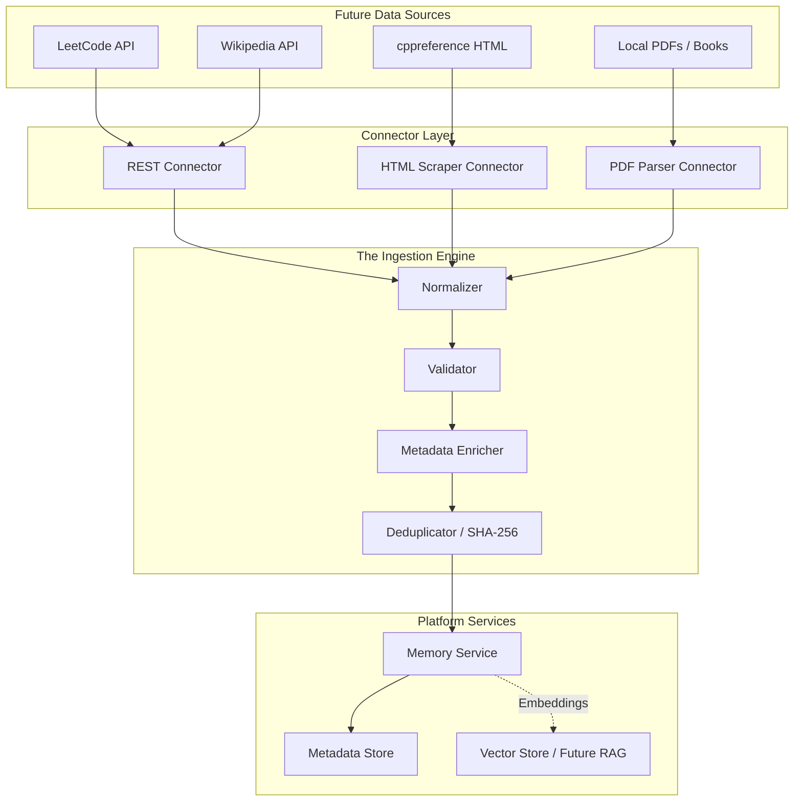
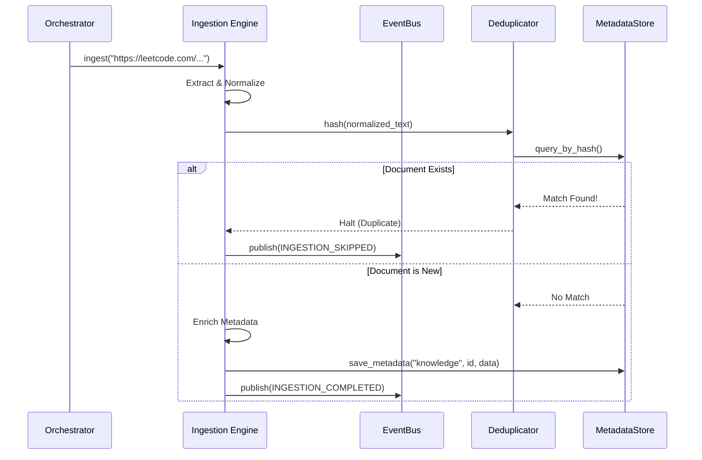

# Phase 09 / 01: Knowledge Ingestion Architecture Design

**Author:** Principal Software Architect  
**Target System:** Automated DSA Educational YouTube Video Pipeline  
**Document Version:** 1.0.0  
**Status:** Designed

---

# Table of Contents
1. [Executive Summary](#1-executive-summary)
2. [Core Abstractions & Connectors](#2-core-abstractions--connectors)
3. [The Ingestion Pipeline Workflow](#3-the-ingestion-pipeline-workflow)
4. [Architecture Diagrams](#4-architecture-diagrams)
5. [Integration with Core Systems](#5-integration-with-core-systems)
6. [Implementation Guidance](#6-implementation-guidance)

---

# 1. Executive Summary

As we transition into Phase 09 (The Plugin Ecosystem), the first critical capability of the AI Educational Pipeline is **Knowledge Ingestion**. To dynamically generate a YouTube video explaining "Dijkstra's Algorithm in C++," the system must first ingest the raw algorithm description, C++ syntax references, and perhaps a related LeetCode problem.

This document outlines a generalized, highly extensible **Ingestion Architecture**. It rigorously decouples the retrieval logic (Scraping/API parsing) from the persistence logic (Chunking/Vector Storage), ensuring that the system can seamlessly ingest data from unstructured PDFs, structured JSON REST APIs, or HTML web pages using identical underlying data models.

---

# 2. Core Abstractions & Connectors

To prevent spaghetti code where a LeetCode scraper is hardcoded to a Vector Database, we introduce the `ISourceConnector` protocol.

### 2.1 Source Connectors
Every data source (Wikipedia, LeetCode, PDF, cppreference) will implement this exact Protocol:
*   `async def extract(self, uri: str) -> RawContent`

### 2.2 The Document Model
Once extracted, all data is immediately mapped into a universal `NormalizedDocument` Python Dataclass. It strips away source-specific idiosyncrasies (like HTML tags or PDF page breaks) and standardizes the data into raw Markdown text paired with searchable `tags` (e.g., `["cpp", "graph", "hard"]`).

---

# 3. The Ingestion Pipeline Workflow

Knowledge Ingestion is not a single function call; it is a rigid 6-step Finite State Machine executed by the Orchestrator.

1.  **Extraction:** The `ISourceConnector` pulls raw bytes/strings from the URI.
2.  **Normalization:** The data is transformed into a standard Markdown `NormalizedDocument`.
3.  **Validation:** The payload is checked for minimum length, valid UTF-8 encoding, and non-empty metadata fields.
4.  **Metadata Enrichment:** The LLM or Rule-Engine analyzes the text and injects semantic tags (e.g., tagging a string with `"Data Structure: Tree"`).
5.  **Deduplication:** The Engine calculates a SHA-256 hash of the normalized text. It checks the `MetadataStore` to verify if this exact document was already ingested. If true, the pipeline halts to save tokens/storage.
6.  **Persistence:** The final document is pushed to the `MemoryService` (which routes it to the `MetadataStore` and future `VectorStore`).

---

# 4. Architecture Diagrams

### 4.1 System Topology
This diagram illustrates how diverse sources funnel into the unified Ingestion Engine before hitting the Persistence layer.

### 4.2 Deduplication & Persistence Sequence
This demonstrates the interaction with the `EventBus` and `StorageManager` during ingestion.

---

# 5. Integration with Core Systems

The Ingestion Architecture leverages everything we built in Phases 06-08:
*   **Runtime:** Triggers the Ingestion Engine within strict `asyncio.wait_for` timeouts to prevent hanging network requests.
*   **Event Bus:** Publishes telemetry (`INGEST_STARTED`, `INGEST_FAILED`, `INGEST_COMPLETED`). If a Wikipedia scrape fails due to a 503 error, the Event Bus routes it to the Dead Letter Queue for auto-replay later.
*   **Workflow Engine:** Allows "Ingestion" to be represented as an explicit DAG Node in a massive Video Generation Pipeline. (Step 1: Ingest LeetCode. Step 2: Generate Script).
*   **Persistence Layer:** Utilizes the `StorageManager`'s Unit of Work. If saving the parsed document to the `MetadataStore` succeeds, but pushing to the `VectorStore` fails, the UoW natively rolls back both to prevent fragmented Agent memory.

---

# 6. Implementation Guidance

When constructing the actual Python implementation in the next step, adhere to the following rules:
1.  **Do not write scraping code yet.** The objective is to build the *Engine* and the `Protocol` interfaces. The actual `BeautifulSoup` or `requests` code for LeetCode will be built as independent plugins later.
2.  **Define `IngestionResult` explicitly.** The engine must return a strict Dataclass containing the normalized text, the generated metadata, the deduplication status, and the persistence ID.
3.  **Use Fault-Tolerant Retries.** Network I/O is notoriously unstable. Wrap the `Connector.extract()` call in a backoff-retry loop utilizing the Phase 07 execution limits.
