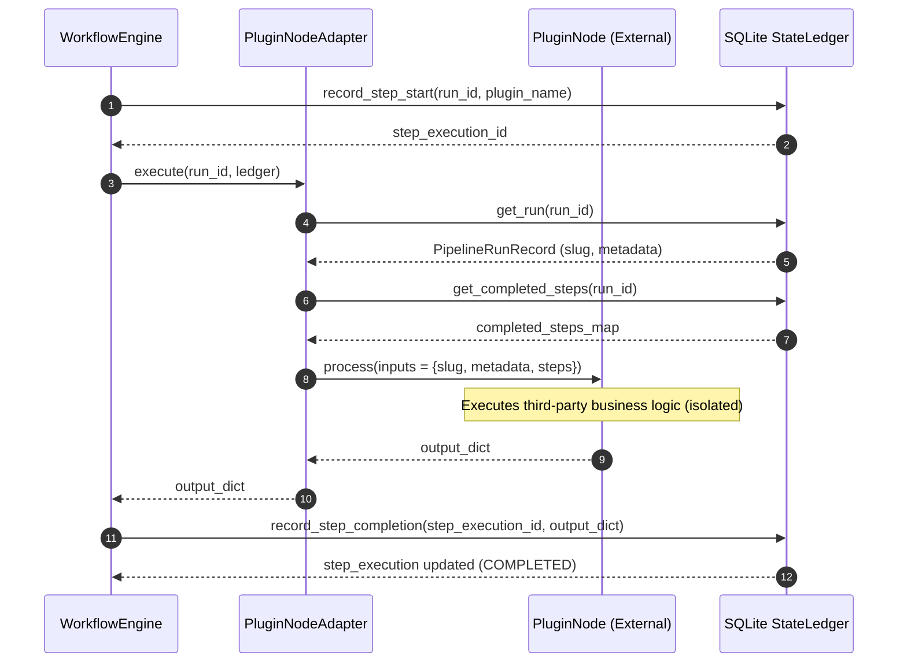

# Phase 09: Plugin SDK Architecture & Development Manual

## 1. Executive Summary & Architectural Overview

The **Phase 09 Plugin SDK** provides an extensible, secure framework for third-party developers to inject custom processing nodes into the Automated DSA Educational YouTube Video Pipeline. Utilizing Python's native `importlib.metadata` `entry_points` mechanism, external developers can distribute standalone Python packages containing custom plugin nodes that are dynamically discovered and integrated into the `WorkflowEngine` without modifying core pipeline source code.

### 1.1 Security Isolation Principle

In core pipeline nodes, `Node.execute(run_id, ledger)` receives the SQLite `StateLedger` directly. However, allowing third-party plugins direct access to `StateLedger` introduces severe security risks, including arbitrary SQL execution, table tampering, state corruption, or unauthorized data access.

To enforce strict security isolation, Phase 09 establishes a **Sandbox Boundary**:
1. **Restricted Interface**: Third-party plugins inherit from `PluginNode` (`src/sdk/plugin_base.py`), which exposes only `@property name` and `process(self, inputs: dict[str, Any]) -> dict[str, Any]`.
2. **No Direct Ledger Access**: Third-party plugins are explicitly denied access to `run_id` parameters or `StateLedger` database connections.
3. **Core Adapter Layer**: The pipeline uses `PluginNodeAdapter` (`src/core/workflow/plugin_loader.py`) to query `StateLedger` for run metadata and prior step outputs on behalf of the plugin, package a safe `inputs` dictionary, invoke `plugin.process(inputs)`, and record the returned output dictionary into `StateLedger`.

### 1.2 Sequence Diagram



---

## 2. Package Structure & Entry Points Configuration

Third-party plugin packages must register their plugin classes under the standard entry point group `"dsa.plugins"`.

### 2.1 Standard Package Layout

```
dsa-plugin-custom/
├── pyproject.toml
├── README.md
└── dsa_plugin_custom/
    ├── __init__.py
    └── nodes.py
```

### 2.2 Modern Configuration (`pyproject.toml`)

Using PEP 621 packaging standards, plugins register their node classes in `pyproject.toml` under `[project.entry-points."dsa.plugins"]`:

```toml
[build-system]
requires = ["setuptools>=61.0", "wheel"]
build-backend = "setuptools.build_meta"

[project]
name = "dsa-plugin-custom"
version = "0.1.0"
description = "Custom educational analysis node for DSA video pipeline"
dependencies = [
    "dsa-video-pipeline-sdk",  # Provides src.sdk.plugin_base.PluginNode
]

[project.entry-points."dsa.plugins"]
custom_metrics = "dsa_plugin_custom.nodes:CustomMetricsNode"
notion_exporter = "dsa_plugin_custom.nodes:NotionExporterNode"
```

### 2.3 Legacy Configuration (`setup.py`)

For legacy `setup.py` configurations:

```python
from setuptools import setup, find_packages

setup(
    name="dsa-plugin-custom",
    version="0.1.0",
    packages=find_packages(),
    entry_points={
        "dsa.plugins": [
            "custom_metrics = dsa_plugin_custom.nodes:CustomMetricsNode",
        ],
    },
)
```

---

## 3. Restricted Plugin Lifecycle (`PluginNode`)

All external plugins must inherit from `PluginNode` defined in `src/sdk/plugin_base.py`.

### 3.1 Class Contract

```python
from abc import ABC, abstractmethod
from typing import Any

class PluginNode(ABC):
    @property
    @abstractmethod
    def name(self) -> str:
        """Unique identifier string for the plugin step."""
        pass

    @abstractmethod
    def process(self, inputs: dict[str, Any]) -> dict[str, Any]:
        """Execute isolated plugin logic accepting inputs and returning output dict."""
        pass
```

### 3.2 Inputs Payload Structure

The `inputs` dictionary passed to `process(inputs)` contains:

| Key | Type | Description |
| :--- | :--- | :--- |
| `"run_id"` | `str` | Current pipeline run identifier string |
| `"slug"` | `str` | Problem title slug (e.g., `'two-sum'`, `'binary-search'`) |
| `"metadata"` | `dict[str, Any]` | Execution run metadata key-value dictionary |
| `"steps"` | `dict[str, dict[str, Any]]` | Mapping of prior completed step names to output dictionaries |
| `"prior_outputs"` | `dict[str, dict[str, Any]]` | Alias mapping of prior completed step outputs |

### 3.3 Output Payload Guarantee

- `process()` **must return a Python dictionary** (`dict[str, Any]`).
- Returning `None` or non-dictionary types triggers a `PluginValidationError` in `PluginNodeAdapter`.
- If an unhandled exception occurs inside `process()`, `WorkflowEngine` catches it, updates the step and run status in `StateLedger` to `FAILED`, and records traceback details without crashing the host process.

---

## 4. Dynamic Discovery & Adapter Architecture (`PluginLoader`)

The `PluginLoader` class in `src/core/workflow/plugin_loader.py` manages dynamic discovery, type validation, instantiation, and adaptation.

### 4.1 Discovery Mechanism

`PluginLoader` queries `importlib.metadata.entry_points(group="dsa.plugins")`. It safely adapts across Python standard library versions (Python 3.10+ `EntryPoints` selection, Python 3.9 dicts, and tuple lists).

### 4.2 Strict Inheritance Validation

For each discovered entry point:
1. Calls `ep.load()` to import the target module and retrieve the class object. If loading fails, `PluginLoadError` is raised.
2. Asserts `isinstance(loaded_cls, type) and issubclass(loaded_cls, PluginNode) and loaded_cls is not PluginNode`. If validation fails, `PluginValidationError` is raised.
3. Instantiates `plugin_instance = loaded_cls()`. If instantiation fails, `PluginLoadError` is raised.
4. Wraps `plugin_instance` in `PluginNodeAdapter(plugin_instance)`.

### 4.3 Custom Exception Hierarchy

- `PipelineError` (from `src.core.exceptions`)
  - `PluginError` (Base plugin exception)
    - `PluginLoadError` (Import or instantiation failures)
    - `PluginValidationError` (Class hierarchy or return type violations)

---

## 5. Step-by-Step Developer Tutorial

Follow this step-by-step guide to create and register a custom plugin.

### Step 1: Define Custom Plugin Node

Create `dsa_plugin_custom/nodes.py`:

```python
from typing import Any
from src.sdk.plugin_base import PluginNode

class ComplexityAnalyzerNode(PluginNode):
    @property
    def name(self) -> str:
        return "complexity_analyzer"

    def process(self, inputs: dict[str, Any]) -> dict[str, Any]:
        slug = inputs.get("slug", "unknown")
        steps = inputs.get("steps", {})
        ingest_data = steps.get("ingest", {})

        problem_text = ingest_data.get("raw_problem", "")
        # Perform custom complexity analysis
        estimated_time = "O(N)" if "array" in problem_text.lower() else "O(N log N)"

        return {
            "slug": slug,
            "estimated_time_complexity": estimated_time,
            "analysis_status": "COMPLETED",
        }
```

### Step 2: Register in `pyproject.toml`

```toml
[project.entry-points."dsa.plugins"]
complexity_analyzer = "dsa_plugin_custom.nodes:ComplexityAnalyzerNode"
```

### Step 3: Install Package in Environment

```bash
pip install -e .
```

### Step 4: Execute in Core Pipeline Workflow

```python
from src.core.orchestrator.state_ledger import StateLedger
from src.core.workflow import WorkflowEngine
from src.core.workflow.plugin_loader import PluginLoader

# Initialize StateLedger and create run
ledger = StateLedger("data/state_ledger.db")
run_id = ledger.create_run("two-sum")

# Dynamically discover and load third-party plugin nodes
plugin_nodes = PluginLoader(group="dsa.plugins").load_plugins()

# Instantiate WorkflowEngine with core and plugin nodes
engine = WorkflowEngine(nodes=plugin_nodes, ledger=ledger)
result = engine.run(run_id)

print(f"Workflow Success: {result.success}")
print(f"Outputs: {result.outputs}")
```

---

## 6. Testing & Verification Strategy

The test suite in `tests/workflow/test_plugin_loader.py` validates the entire plugin subsystem using in-memory mocks without writing files to disk.

### 6.1 Key Test Scenarios

1. **Valid Discovery & Execution**: Uses `unittest.mock.patch` on `importlib.metadata.entry_points` to return a mock `EntryPoint` referencing a valid `PluginNode` subclass.
2. **Invalid Class Rejection**: Mocks an entry point pointing to a standard class or function not inheriting from `PluginNode`, asserting `PluginValidationError` is raised.
3. **Load Failure Handling**: Mocks `ep.load.side_effect = ImportError(...)`, asserting `PluginLoadError` is raised.
4. **Empty Entry Points**: Mocks `entry_points` returning `[]`, asserting `load_plugins()` returns `[]` cleanly.
5. **WorkflowEngine Integration**: Executes `PluginNodeAdapter` inside `WorkflowEngine` with an in-memory SQLite `StateLedger`, verifying input mapping, state persistence, step completion, and exception handling.

Run the test suite with:

```bash
pytest tests/workflow/test_plugin_loader.py
pytest tests/
```
