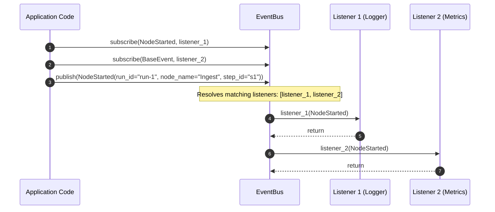
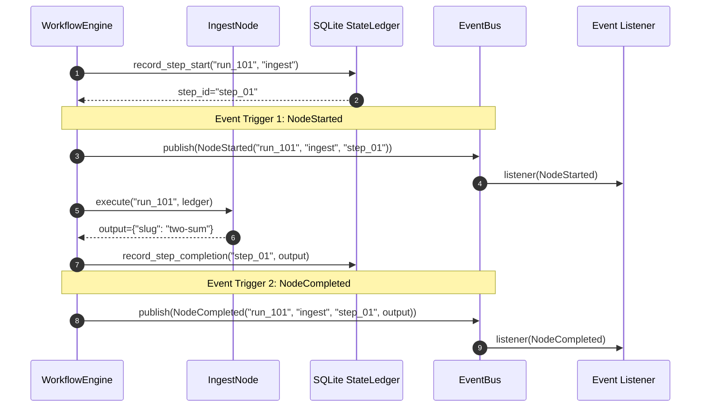
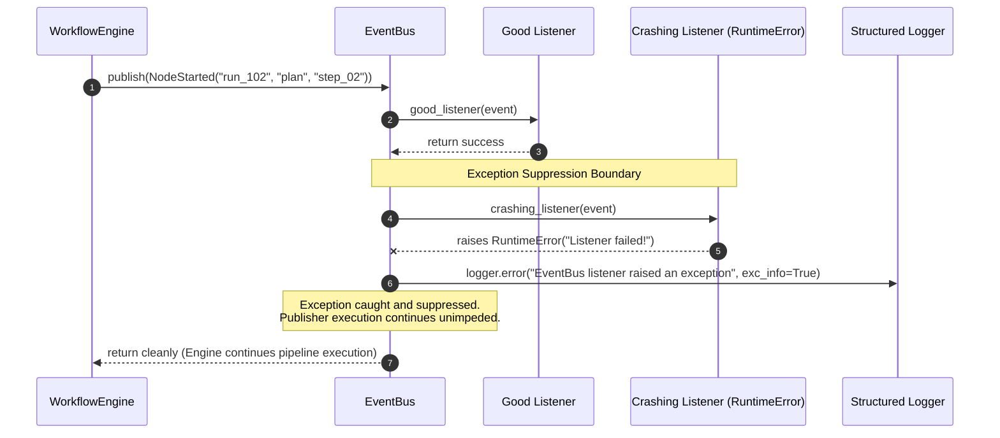

# Phase 10: Event Bus Architecture & Integration Manual

## 1. Executive Summary & Architectural Overview

The **Phase 10 Event Bus** introduces an in-memory, publish/subscribe (Pub/Sub) event-driven communication framework for the Automated DSA Educational YouTube Video Pipeline. Running alongside the synchronous `WorkflowEngine`, the Event Bus provides real-time lifecycle visibility across processing stages (`NodeStarted`, `NodeCompleted`, `NodeFailed`) while strictly maintaining core execution stability.

```
+-----------------------------------------------------------------------------------+
|                                Workflow Engine                                    |
|                                                                                   |
|  +--------------------+       +--------------------+       +--------------------+ |
|  |     IngestNode     |  -->  |      PlanNode      |  -->  |     ScriptNode     | |
|  +---------+----------+       +---------+----------+       +---------+----------+ |
|            |                            |                            |            |
+------------|----------------------------|----------------------------|------------+
             | Emits                      | Emits                      | Emits
             v                            v                            v
+-----------------------------------------------------------------------------------+
|                            In-Memory EventBus                                     |
|  - NodeStarted(run_id, node_name, step_id, timestamp)                             |
|  - NodeCompleted(run_id, node_name, step_id, output, timestamp)                   |
|  - NodeFailed(run_id, node_name, step_id, error_msg, details, timestamp)          |
+---------------------+-------------------------------+-----------------------------+
                      | Dispatch                      | Dispatch
                      v                               v
         +------------------------+       +------------------------+
         |   Logging Subscriber   |       |   Metrics Subscriber   |
         |  (Non-blocking audit)  |       |   (Telemetry monitor)  |
         +------------------------+       +------------------------+
```

### Core Architectural Principles

1. **In-Memory Pub/Sub Decoupling**: Lifecycle consumers (logging, telemetry, monitoring, UI notifications) subscribe to strongly typed event models without direct coupling to node logic or `WorkflowEngine` internals.
2. **Strict Exception Suppression Boundary**: Listener callables are executed inside isolated `try...except Exception:` blocks within `EventBus.publish()`. A listener failure or intentional crash (e.g., `RuntimeError`) is caught and logged, completely preventing listener errors from corrupting caller execution or halting the video pipeline.
3. **Synchronous Non-Blocking Delivery**: Events are dispatched synchronously upon lifecycle state transitions without complex async event loops, preserving the pipeline's deterministic synchronous batch-execution model.
4. **Polymorphic Type-Based Routing**: Subscribers can listen to specific node lifecycle events (`NodeStarted`, `NodeCompleted`, `NodeFailed`), the root `BaseEvent` class for global telemetry, or wildcard `typing.Any` subscriptions.

---

## 2. Event Models & Data Contracts

All pipeline events are defined in `src/core/events/bus.py` using standard Python dataclasses.

### 2.1 BaseEvent Model (`BaseEvent`)

`BaseEvent` serves as the abstract root for all event models in the pipeline, automatically assigning an ISO 8601 UTC timestamp upon instantiation.

```python
from dataclasses import dataclass, field
from datetime import datetime, timezone

@dataclass
class BaseEvent:
    """Base event model containing an ISO 8601 UTC timestamp."""

    timestamp: str = field(
        default_factory=lambda: datetime.now(timezone.utc).isoformat(),
        kw_only=True,
    )
```

### 2.2 Lifecycle Event Models

The pipeline defines three specific lifecycle events corresponding to key execution phases in `WorkflowEngine`:

#### `NodeStarted`
Emitted immediately when a workflow node begins execution (after `record_step_start` is recorded in `StateLedger`).

```python
@dataclass
class NodeStarted(BaseEvent):
    """Event emitted when a workflow node execution starts."""

    run_id: str
    node_name: str
    step_id: str
```

#### `NodeCompleted`
Emitted when a node successfully completes execution and outputs are recorded in `StateLedger`.

```python
@dataclass
class NodeCompleted(BaseEvent):
    """Event emitted when a workflow node completes successfully."""

    run_id: str
    node_name: str
    step_id: str
    output: Any
```

#### `NodeFailed`
Emitted when a node execution fails due to an unhandled exception before pipeline short-circuiting.

```python
@dataclass
class NodeFailed(BaseEvent):
    """Event emitted when a workflow node execution fails."""

    run_id: str
    node_name: str
    step_id: str
    error_message: str
    error_details: Any = None
```

### 2.3 Event Schema Mapping

| Event Model | Inherits From | Key Fields | Trigger Description |
| :--- | :--- | :--- | :--- |
| `BaseEvent` | N/A | `timestamp` (ISO 8601 UTC) | Abstract root class for all event types. |
| `NodeStarted` | `BaseEvent` | `run_id`, `node_name`, `step_id`, `timestamp` | Triggered when `WorkflowEngine` starts executing a node step. |
| `NodeCompleted` | `BaseEvent` | `run_id`, `node_name`, `step_id`, `output`, `timestamp` | Triggered when a node finishes successfully with output payload. |
| `NodeFailed` | `BaseEvent` | `run_id`, `node_name`, `step_id`, `error_message`, `error_details`, `timestamp` | Triggered when a node raises an unhandled exception during execution. |

---

## 3. Fault-Tolerant Pub/Sub Engine Mechanics

The `EventBus` class (`src/core/events/bus.py`) maintains subscriber mappings and dispatches events with strict fault tolerance.

### 3.1 Class Blueprint

```python
from collections import defaultdict
from typing import Any, Callable, Dict, List, Type
from src.core.logger import get_logger

logger = get_logger(__name__)

class EventBus:
    """In-memory Publish/Subscribe Event Bus."""

    def __init__(self) -> None:
        self._subscribers: Dict[Type[Any], List[Callable[[Any], None]]] = defaultdict(list)
```

### 3.2 Key Methods & Behavior

#### `subscribe(event_type, listener)`
Registers a listener callable for a target event class. Duplicate registration of the exact same listener callable for the same event type is automatically prevented.

```python
def subscribe(self, event_type: Type[Any], listener: Callable[[Any], None]) -> None:
    if listener not in self._subscribers[event_type]:
        self._subscribers[event_type].append(listener)
```

#### `unsubscribe(event_type, listener)`
Removes a registered listener from an event type. Cleans up empty event type keys in `_subscribers`.

```python
def unsubscribe(self, event_type: Type[Any], listener: Callable[[Any], None]) -> None:
    if event_type in self._subscribers:
        if listener in self._subscribers[event_type]:
            self._subscribers[event_type].remove(listener)
        if not self._subscribers[event_type]:
            del self._subscribers[event_type]
```

#### `publish(event)`
Dispatches an event instance to all registered matching listeners.

```python
def publish(self, event: Any) -> None:
    listeners_to_call: List[Callable[[Any], None]] = []
    for sub_type, listeners in list(self._subscribers.items()):
        try:
            if isinstance(event, sub_type):
                listeners_to_call.extend(listeners)
        except TypeError:
            if sub_type == type(event) or sub_type is Any:
                listeners_to_call.extend(listeners)

    for listener in listeners_to_call:
        try:
            listener(event)
        except Exception as e:
            logger.error(
                "EventBus listener raised an exception",
                event_type=type(event).__name__,
                listener=getattr(listener, "__qualname__", str(listener)),
                error=str(e),
                exc_info=True,
            )
```

#### `clear()`
Removes all registered subscribers, resetting internal state.

```python
def clear(self) -> None:
    self._subscribers.clear()
```

---

## 4. Workflow Engine Integration

The `WorkflowEngine` (`src/core/workflow/engine.py`) accepts an optional `EventBus` instance in its constructor and publishes lifecycle events at key step execution phases.

### 4.1 Constructor Signature

```python
class WorkflowEngine:
    def __init__(
        self,
        nodes: Sequence[Node],
        ledger: Optional[StateLedger] = None,
        event_bus: Optional[EventBus] = None,
    ) -> None:
        ...
        self.event_bus: Optional[EventBus] = event_bus
```

### 4.2 Lifecycle Emission Points

1.  **Step Execution Start**:
    After recording step start in `StateLedger` and acquiring `step_id`:
    ```python
    step_id = self.ledger.record_step_start(run_id, node.name)
    if self.event_bus is not None:
        self.event_bus.publish(
            NodeStarted(run_id=run_id, node_name=node.name, step_id=step_id)
        )
    ```

2.  **Step Execution Completion**:
    After recording step completion in `StateLedger`:
    ```python
    self.ledger.record_step_completion(step_id, node_output)
    if self.event_bus is not None:
        self.event_bus.publish(
            NodeCompleted(
                run_id=run_id,
                node_name=node.name,
                step_id=step_id,
                output=node_output,
            )
        )
    ```

3.  **Step Execution Failure**:
    After recording step failure in `StateLedger` during exception handling:
    ```python
    self.ledger.record_step_failure(
        step_id,
        error_message=error_msg,
        error_details=error_details,
    )
    if self.event_bus is not None:
        self.event_bus.publish(
            NodeFailed(
                run_id=run_id,
                node_name=node.name,
                step_id=step_id,
                error_message=error_msg,
                error_details=error_details,
            )
        )
    ```

---

## 5. Mermaid Sequence Diagrams

### 5.1 EventBus Subscription & Event Dispatch



### 5.2 WorkflowEngine Lifecycle Event Emission



### 5.3 Fault-Tolerance Boundary & Exception Suppression



---

## 6. Exception Failure Matrix & Operational Rules

The following operational matrix specifies how exception types within event listeners are handled by `EventBus`.

| Exception Class | Trigger Cause in Listener | Operational Category | EventBus Suppression Action | Pipeline & Workflow Impact |
| :--- | :--- | :--- | :--- | :--- |
| `RuntimeError` | Listener network call timeout, unhandled assertion | Listener Defect | Catches error, logs via `logger.error`, continues | None. Engine completes node step normally. |
| `ValueError` / `TypeError` | Malformed listener data parsing | Data Handling Error | Catches error, logs via `logger.error`, continues | None. Remaining listeners for event are invoked. |
| `KeyError` / `AttributeError` | Accessing non-existent attribute on event | Development Error | Catches error, logs via `logger.error`, continues | None. Pipeline run remains unaffected. |
| `Exception` (Any Subclass) | Unhandled custom listener exception | General Exception | Catches error, logs via `logger.error`, continues | None. Zero impact on core video rendering/ingestion. |

### Structured Logging Format

When a listener raises an exception, `EventBus` emits a structured log entry:

```json
{
  "event": "EventBus listener raised an exception",
  "event_type": "NodeStarted",
  "listener": "my_crashing_listener",
  "error": "Intentional listener crash!",
  "exc_info": true
}
```

---

## 7. Step-by-Step Developer Walkthrough & Code Examples

### Example 1: Basic Event Subscription & Publishing

```python
from src.core.events.bus import EventBus, NodeCompleted

def on_node_completed(event: NodeCompleted) -> None:
    print(f"[AUDIT] Node '{event.node_name}' completed for run {event.run_id}")

bus = EventBus()
bus.subscribe(NodeCompleted, on_node_completed)

# Publishing event manually
bus.publish(NodeCompleted(
    run_id="run-100",
    node_name="IngestNode",
    step_id="step-1",
    output={"slug": "two-sum"}
))
```

### Example 2: Polymorphic Subscription for Global Telemetry

```python
from src.core.events.bus import BaseEvent, EventBus, NodeStarted, NodeCompleted

def global_telemetry_listener(event: BaseEvent) -> None:
    print(f"[METRICS] Timestamp: {event.timestamp} | Event: {type(event).__name__}")

bus = EventBus()

# Subscribing to BaseEvent receives ALL event subclasses automatically
bus.subscribe(BaseEvent, global_telemetry_listener)

bus.publish(NodeStarted(run_id="r1", node_name="PlanNode", step_id="s2"))
bus.publish(NodeCompleted(run_id="r1", node_name="PlanNode", step_id="s2", output={}))
```

### Example 3: Fault-Tolerant Exception Suppression

```python
from src.core.events.bus import EventBus, NodeStarted

def crashing_listener(event: NodeStarted) -> None:
    raise RuntimeError("Database connection lost in notification service!")

def safe_listener(event: NodeStarted) -> None:
    print(f"[SAFE] Processed event for node {event.node_name}")

bus = EventBus()
bus.subscribe(NodeStarted, crashing_listener)
bus.subscribe(NodeStarted, safe_listener)

# Publishing will NOT crash despite crashing_listener throwing RuntimeError
bus.publish(NodeStarted(run_id="run-999", node_name="RenderNode", step_id="step-9"))
# Result: Logged exception for crashing_listener, safe_listener executed successfully.
```

### Example 4: Integrating EventBus with WorkflowEngine

```python
from src.core.events.bus import EventBus, NodeStarted, NodeCompleted, NodeFailed
from src.core.orchestrator.state_ledger import StateLedger
from src.core.workflow import WorkflowEngine

# Initialize EventBus and register listeners
event_bus = EventBus()
event_bus.subscribe(NodeStarted, lambda e: print(f"STARTED: {e.node_name}"))
event_bus.subscribe(NodeCompleted, lambda e: print(f"COMPLETED: {e.node_name}"))
event_bus.subscribe(NodeFailed, lambda e: print(f"FAILED: {e.node_name} - {e.error_message}"))

# Initialize StateLedger and create pipeline run
ledger = StateLedger("data/state_ledger.db")
run_id = ledger.create_run("two-sum")

# Pass event_bus into WorkflowEngine
engine = WorkflowEngine(nodes=[...], ledger=ledger, event_bus=event_bus)
result = engine.run(run_id)
```

---

## 8. Pytest Verification Guide & Test Suite Summary

The event bus and its integration with `WorkflowEngine` are tested in `tests/events/test_bus.py` and `tests/workflow/test_engine.py`.

### 8.1 Verification Command

Run pytest targeting event bus and engine test suites:

```bash
pytest tests/events/test_bus.py tests/workflow/test_engine.py -v
```

### 8.2 Test Suite Matrix

| Test Function Name | Tested Module | Description & Verified Behavior |
| :--- | :--- | :--- |
| `test_event_models_initialization` | `test_bus.py` | Verifies `NodeStarted`, `NodeCompleted`, `NodeFailed` dataclasses assign attributes correctly and default `timestamp` to ISO 8601 UTC string. |
| `test_subscribe_and_publish` | `test_bus.py` | Verifies `subscribe` registers listener and `publish` dispatches event to `MagicMock` listener. |
| `test_unsubscribe` | `test_bus.py` | Verifies unsubscribed listener receives zero event calls on subsequent publish. |
| `test_inheritance_dispatch` | `test_bus.py` | Verifies subscribing to `BaseEvent` dispatches all subclasses (`NodeStarted`, `NodeCompleted`, `NodeFailed`). |
| `test_fault_tolerant_exception_suppression` | `test_bus.py` | Explicitly injects `RuntimeError` into a mock listener during publish, verifying exception suppression and successful execution of remaining listeners. |
| `test_subscribe_any_type` | `test_bus.py` | Verifies subscribing to `typing.Any` correctly captures events. |
| `test_clear_subscribers` | `test_bus.py` | Verifies `clear()` removes all subscribers from internal dict. |
| `test_workflow_engine_successful_pipeline_execution` | `test_engine.py` | Verifies workflow execution emitting events across node execution steps. |
| `test_workflow_engine_node_failure_handling` | `test_engine.py` | Verifies engine captures node exception and emits `NodeFailed` event to `EventBus`. |
