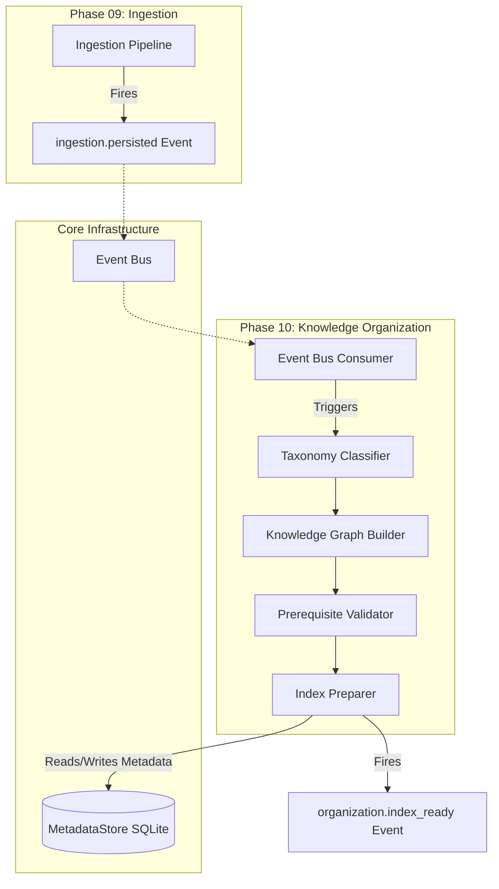
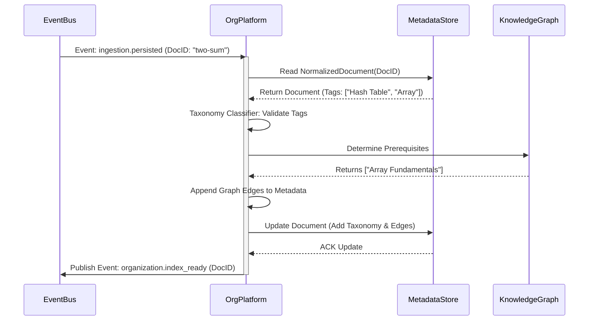

# Phase 10 / 01: Knowledge Organization Architecture

**Author:** Principal Software Architect  
**Target System:** Automated DSA Educational YouTube Video Pipeline  
**Document Version:** 1.0.0  
**Status:** Designed

---

# Table of Contents
1. [Executive Summary](#1-executive-summary)
2. [Component Architecture Diagram](#2-component-architecture-diagram)
3. [Taxonomy & Classification System](#3-taxonomy--classification-system)
4. [Knowledge Graph & Prerequisites](#4-knowledge-graph--prerequisites)
5. [Learning Paths](#5-learning-paths)
6. [Sequence Logic: Index Preparation](#6-sequence-logic-index-preparation)
7. [Future Expansion](#7-future-expansion)

---

# 1. Executive Summary

While Phase 09 successfully extracted raw LeetCode problems and persisted them into SQLite as `NormalizedDocuments`, an AI cannot intuitively deduce how "Two Sum" relates to "Hash Tables" or why "Recursion" must be learned before "Dynamic Programming" simply by reading flat text. 

The **Knowledge Organization Platform** acts as the crucial analytical middleware. It transforms isolated SQLite rows into a deeply connected **Knowledge Graph**. By imposing a strict hierarchical taxonomy, defining prerequisite Directed Acyclic Graphs (DAGs), and orchestrating Index Preparation, this layer mathematically structures the data, setting the perfect stage for the Phase 10 Vector Embeddings and RAG engines.

*Note: As per the architectural directive, physical LLM embedding and semantic retrieval are explicitly deferred from this layer.*

---

# 2. Component Architecture Diagram

The Organization Platform sits directly between Ingestion and Vector Retrieval.

---

# 3. Taxonomy & Classification System

To prevent chaotic tagging (e.g., tagging a problem as both `graph`, `Graph`, and `graphs`), the platform enforces a strict, hierarchical ontology.

### Core Domains
1. **Data Structures:** Physical memory arrangements (Array, Hash Table, Linked List, Tree, Graph, Stack, Queue, Heap).
2. **Algorithms:** Step-by-step resolution methods (Binary Search, DFS, BFS, Merge Sort).
3. **Algorithmic Patterns:** High-level paradigms (Two Pointers, Sliding Window, DP, Greedy).

### Classification Engine
When the `Taxonomy Classifier` receives a document, it validates the heuristic tags generated in Phase 09 against the strict Core Domains. 
*   If a heuristic tag is `bst`, it is strictly mapped to `Taxonomy.DataStructure.Tree.BinarySearchTree`.
*   If an unknown tag appears (e.g., `Meta Interview`), it is gracefully relegated to an `Unclassified` secondary array to prevent corrupting the core ontology.

---

# 4. Knowledge Graph & Prerequisites

To allow the downstream AI to script a cohesive curriculum, problems and concepts are modeled as nodes in a **Directed Acyclic Graph (DAG)**.

### Relationship Definitions
*   `REQUIRES`: Node A must be understood before Node B. (e.g., *Recursion* `REQUIRES` *Call Stack*).
*   `IMPLEMENTS`: Node A utilizes Node B. (e.g., *BFS* `IMPLEMENTS` *Queue*).
*   `SIMILAR_TO`: Node A shares structural parallels with Node B. (e.g., *Two Sum* `SIMILAR_TO` *Three Sum*).

### Prerequisite Validation
If a user requests a video on "Dijkstra's Algorithm," the AI must know what to briefly recap. The Knowledge Graph allows the system to traverse the DAG backwards:
`Dijkstra` -> `REQUIRES` -> `BFS` -> `REQUIRES` -> `Graph Theory` -> `REQUIRES` -> `Hash Maps` & `Queues`.

---

# 5. Learning Paths

A **Learning Path** is a linear traversal of the Knowledge Graph tailored for a specific educational objective.

*   **Path: Zero-to-Hero Arrays:** `Array Fundamentals` -> `Two Pointers` -> `Sliding Window` -> `Prefix Sum`.
*   **Path: FAANG Dynamic Programming:** `Recursion` -> `Memoization` -> `1D DP (Climbing Stairs)` -> `2D DP (Knapsack)`.

The platform exposes endpoints to generate these linear paths by running Topological Sorts across the DAG, guaranteeing that no script is generated that references a concept the "student" hasn't learned yet in that specific path.

---

# 6. Sequence Logic: Index Preparation

Before a document can be embedded into a Vector Database, it must be thoroughly cleansed, taxonomized, and linked.

---

# 7. Future Expansion

1. **Self-Healing Ontology:** As new tags emerge organically from LeetCode, the system will eventually flag unrecognized tags to an Administrator dashboard for manual integration into the core Taxonomy.
2. **Multi-Modal Edges:** The Knowledge Graph can eventually link outside of LeetCode, associating a specific Python algorithm directly with a Wikipedia page or a C++ documentation reference, bridging cross-platform concepts together.
3. **Difficulty Curve Optimization:** By tracking viewer engagement metrics on YouTube, the Knowledge Graph edges could dynamically re-weight themselves to adjust Learning Paths (e.g., If viewers drop off heavily during "Graphs", insert an easier bridging problem into the Path automatically).
