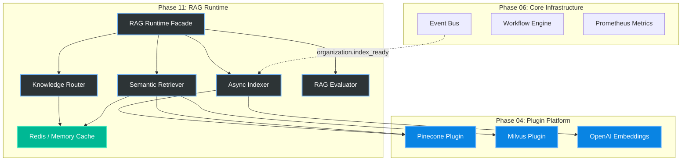
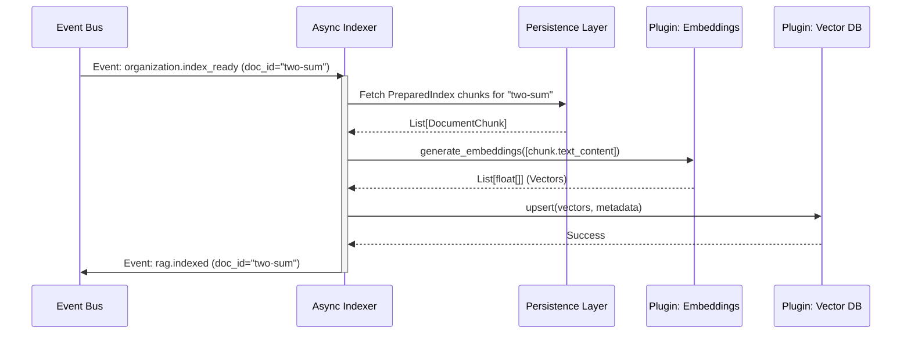
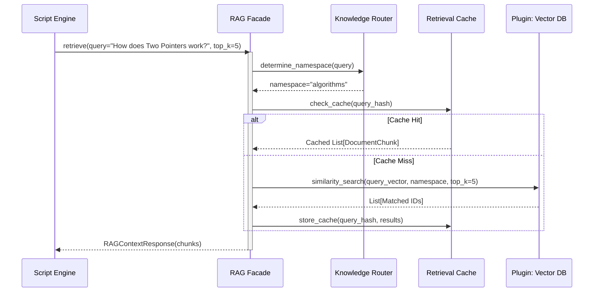

# Phase 11 / 01: Production RAG Runtime Architecture

**Author:** Principal Software Architect  
**Target System:** Automated DSA Educational YouTube Video Pipeline  
**Document Version:** 1.0.0  
**Status:** Designed

---

# Table of Contents
1. [Executive Summary](#1-executive-summary)
2. [Component Architecture](#2-component-architecture)
3. [Integration Strategy](#3-integration-strategy)
4. [Sequence Diagrams](#4-sequence-diagrams)
5. [Implementation Guidance](#5-implementation-guidance)

---

# 1. Executive Summary

Phase 11 introduces the **Production RAG (Retrieval-Augmented Generation) Runtime**. Up until now, Phase 09 has scraped data, and Phase 10 has mathematically organized that data into acyclic graphs and deterministic chunks.

The RAG Runtime is the physical **Execution Engine** that takes those prepared chunks, routes them to the appropriate multi-tenant Knowledge Bases (e.g., Pinecone/Milvus), and manages the high-throughput, concurrent retrieval of context when the downstream Script Generation engines request it.

**Core Directives:**
*   **Multi-Knowledge-Base Architecture:** The system must route queries based on domain (e.g., `kb_algorithms` vs `kb_leetcode_problems`).
*   **Decoupling:** The RAG Runtime must operate purely via the `EventBus` and `WorkflowEngine`, remaining entirely ignorant of how scripts are generated.
*   **High Availability:** It must support aggressive caching, health checks, and exponential backoff retries when external LLM Embedding APIs throttle requests.

---

# 2. Component Architecture

The RAG Runtime is composed of several strictly typed, isolated managers operating under a unified Facade.

### Component Responsibilities:
1.  **RAG Runtime Facade:** The single entry point for all operations. Ensures strict transactional boundaries.
2.  **Async Indexer:** Subscribes to `organization.index_ready`. Reaches out to the LLM Plugin to generate physical `float[]` embeddings, then upserts them into the Vector DB.
3.  **Knowledge Router:** Determines *which* Knowledge Base a query should hit (e.g., routing a query about "Dijkstra" to the `Algorithms` namespace, but "Two Sum" to the `LeetCode` namespace).
4.  **Semantic Retriever:** Executes the physical top-K similarity search. Implements cross-encoder re-ranking for maximum precision.
5.  **RAG Evaluator:** Native observability loop. Computes MRR (Mean Reciprocal Rank) and context relevance scores on live queries.

---

# 3. Integration Strategy

The RAG Runtime relies heavily on the previously built infrastructure.

*   **Plugin Platform:** The RAG Runtime contains zero logic for calling `api.openai.com`. It relies entirely on the `PluginManager` (Phase 04) to load the appropriate Embedding provider (OpenAI, HuggingFace, etc.).
*   **Workflow Engine:** Retrieval requests are modeled as discrete `WorkflowSteps` within the Phase 07 Workflow Engine, allowing them to fail gracefully and be retried by the state machine.
*   **Persistence Layer:** Raw chunks are stored in SQLite/Postgres (Phase 08). Only the mathematical embeddings and IDs live in the external Vector Database, keeping query speeds blazing fast.

---

# 4. Sequence Diagrams

### 4.1 Asynchronous Indexing (Write Path)
This sequence occurs completely in the background after Phase 10 finishes its mathematical sorting.

### 4.2 Semantic Retrieval (Read Path)
This sequence occurs when a downstream Script Generator needs historical context to write a video.

---

# 5. Implementation Guidance

### 5.1 Concurrency & Scalability
*   **Batch Processing:** The `AsyncIndexer` MUST process chunks in batches of 100 to avoid exhausting rate limits on the Embedding API.
*   **Semaphore Locking:** Implement `asyncio.Semaphore(10)` limits on outgoing API calls to prevent the RAG runtime from DDOSing external API providers during massive ingestion bursts.

### 5.2 Health & Monitoring
*   **Vector DB Liveness:** The RAG Runtime must register a `HealthCheck` with the system. If the Vector Database plugin fails to respond in 3 seconds, the Runtime must mark itself as `DEGRADED`.
*   **Latency Metrics:** Wrap the retrieval logic in the `MetricsRegistry.time_execution` context manager. If P99 retrieval latency exceeds 800ms, Prometheus should trigger an alert.

### 5.3 Multi-Knowledge-Base Structure
To support rapid filtering, Vector DB namespacing must map directly to the domains established in Phase 10:
*   `Namespace: ALGORITHMS`
*   `Namespace: DATA_STRUCTURES`
*   `Namespace: PATTERNS`
*   `Namespace: PROBLEMS` 

This ensures that if the system needs to generate a video specifically about a *Concept*, it doesn't accidentally retrieve code solutions from *LeetCode Problems*.
