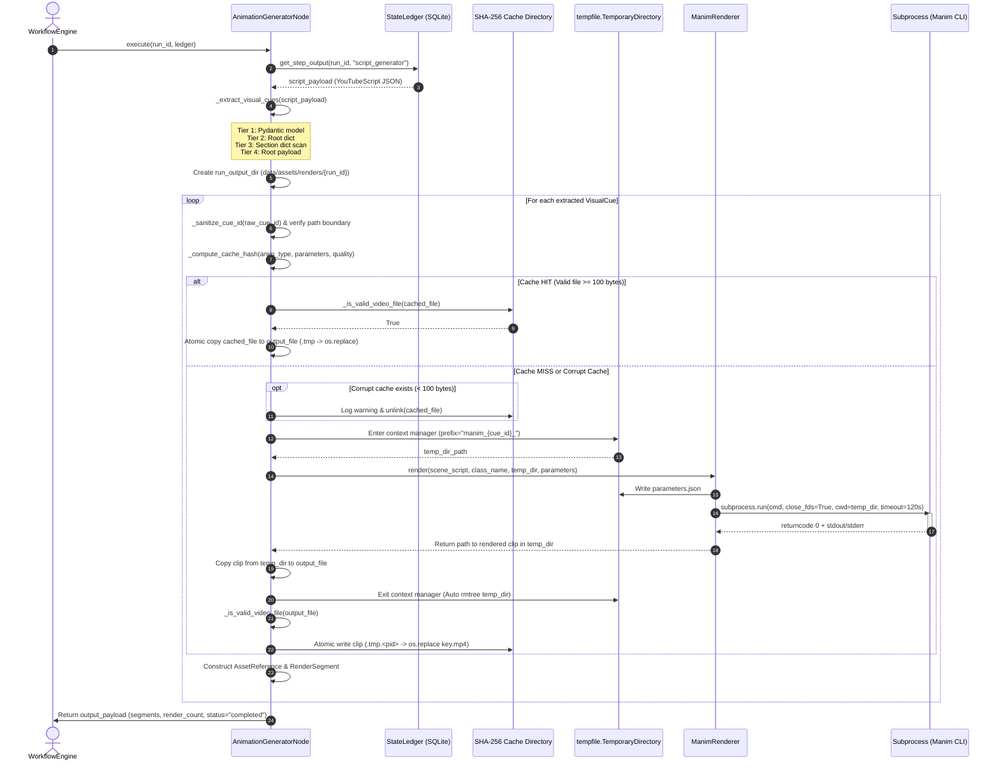
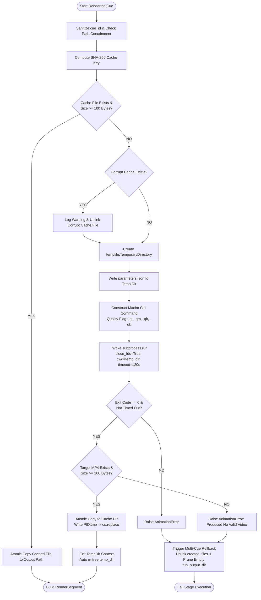
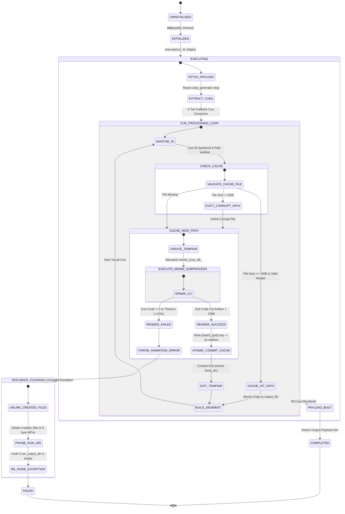

# Phase 12 Media Production: Animation Architecture & Engineering Specification (Manim)

## Executive Summary

Phase 12 of the Automated DSA Educational YouTube Video Pipeline implements high-performance, resilient visual animation production leveraging the [Manim](https://www.manim.community/) engine. Encapsulated within `AnimationGeneratorNode` (`src/pipeline/nodes/animation_generator_node.py`) and backed by `ManimRenderer` (`src/animation/renderer.py`), this subsystem converts abstract visual cues from upstream YouTube script payloads into production-ready MP4 animation segments.

This document serves as the authoritative architectural specification and engineering reference for Phase 12. It covers state ledger boundary contracts, resilient multi-tier cue extraction, scene template mapping, dynamic parameter passing via `parameters.json`, secure subprocess sandboxing, content-addressable SHA-256 caching, sub-100 byte corrupt cache invalidation, PID-isolated atomic filesystem operations, context-managed temporary storage sanitation, file descriptor leak prevention via `/proc/self/fd`, exception rollback protocols, and a comprehensive 37-test verification suite matrix.

---

## Section 1: Executive Overview & Pipeline Architecture

### 1.1 Synchronous Batch Pipeline Positioning

The Automated DSA Educational YouTube Video Pipeline operates on a strict **Synchronous Batch Pipeline** architectural paradigm. Complex asynchronous event buses, implicit background thread state, and dynamic dependency injection containers are explicitly forbidden in favor of deterministic, state-ledger-driven node executions.

`AnimationGeneratorNode` inherits directly from the abstract `Node` base class (`src/core/workflow/node.py`). It is executed sequentially by the `WorkflowEngine` (`src/core/workflow/engine.py`).

```
+-----------------------------------------------------------------------------------+
|                                Workflow Engine                                    |
|                                                                                   |
|  +------------------+     +------------------------+     +---------------------+  |
|  |  ScriptGenerator | --> | AnimationGeneratorNode | --> | AudioVideoAssembler |  |
|  |      Node        |     |       (Phase 12)       |     |     (Phase 13)      |  |
|  +--------+---------+     +-----------+------------+     +---------------------+  |
|           |                           |                                           |
+-----------|---------------------------|-------------------------------------------+
            | Read Payload              | Write Manifest
            v                           v
+-----------------------------------------------------------------------------------+
|                               SQLite StateLedger                                  |
|  step: "script_generator"  <--->  step: "animation_generator"                     |
+-----------------------------------------------------------------------------------+
```

### 1.2 State Ledger Boundary Contract & Node Lifecycle

Nodes strictly exchange data through the SQLite `StateLedger` (`src/core/orchestrator/state_ledger.py`) using a unique, immutable `run_id`. Passing in-memory Python objects directly between node executions is prohibited, guaranteeing idempotency and full execution replayability.

#### Input Contract (`script_generator` Step Output)
`AnimationGeneratorNode.execute(run_id, ledger)` fetches the prior step output registered under `step_name="script_generator"`.

* **Precondition Verifications**:
  1. `ledger` must not be `None`. If `None`, raises `PipelineStageError("Node 'animation_generator' requires an active StateLedger instance.")`.
  2. Step output payload for `step_name="script_generator"` must exist for `run_id`. If absent, raises `PipelineStageError`.

* **Expected Payload Schema**:
  ```json
  {
    "slug": "two-sum",
    "script": {
      "topic": "Two Sum",
      "slug": "two-sum",
      "difficulty": "Easy",
      "total_duration": 30.0,
      "hook": {
        "title": "Hook",
        "narration": "Have you ever wondered how to solve Two Sum in linear time?",
        "estimated_duration": 5.0,
        "visual_cues": [...]
      },
      "context": { ... },
      "solution": { ... },
      "complexity": { ... },
      "visual_cues": [...]
    }
  }
  ```

#### Output Contract (`animation_generator` Step Output)
Upon rendering all visual cues, `AnimationGeneratorNode` persists a structured dictionary payload into `StateLedger` under `step_name="animation_generator"`:

```json
{
  "slug": "two-sum",
  "segments": [
    {
      "segment_id": "seg_cue_01",
      "segment_type": "visual_anim",
      "start_time": 0.0,
      "end_time": 5.0,
      "duration": 5.0,
      "asset_references": [
        {
          "asset_id": "asset_cue_01",
          "asset_type": "video",
          "file_path": "/home/adarsh/Documents/Youtube-Channel/data/assets/renders/run_20260730_001/segment_cue_01.mp4",
          "duration": 5.0
        }
      ],
      "visual_path": "/home/adarsh/Documents/Youtube-Channel/data/assets/renders/run_20260730_001/segment_cue_01.mp4",
      "scene_type": "ARRAY_HIGHLIGHT",
      "visual_parameters": {
        "array": [2, 7, 11, 15],
        "highlight_indices": [0, 1],
        "duration": 5.0
      }
    }
  ],
  "render_count": 1,
  "output_directory": "/home/adarsh/Documents/Youtube-Channel/data/assets/renders/run_20260730_001",
  "status": "completed"
}
```

#### Strict Pydantic V2 Model Alignment
The output payload relies strictly on validated Pydantic V2 models defined in `src/core/models/assets.py`:
* **`AssetReference`**: Represents an individual media file asset (`asset_id`, `asset_type="video"`, `file_path`, `duration`).
* **`RenderSegment`**: Represents a temporal segment in the video timeline containing start/end timestamps, asset references, rendering scene types, and parameters.

---

## Section 2: Visual Cue Extraction, Mapping, & Sanitization

### 2.1 Multi-Tier Cue Extraction Architecture

Script payloads generated by external Large Language Models (LLMs) can exhibit structural variance over time due to model upgrades or formatting shifts. `AnimationGeneratorNode._extract_visual_cues` implements a resilient 4-tier fallback extraction hierarchy to recover 100% of visual cues without throwing unexpected parsing exceptions.

```
                     +-----------------------------------+
                     |      script_payload["script"]     |
                     +-----------------------------------+
                                       |
                       Is YouTubeScript / Dict Valid?
                          /                         \
                       YES                           NO
                      /                               \
           Tier 1: Extract primary             Tier 3: Fallback Scan
       script_model.visual_cues                Script Section Dicts:
                      |                       ("hook", "context",
                      |                       "solution", "complexity")
                      |                                |
                      +----------------+---------------+
                                       |
                               Is cues_raw empty?
                               /               \
                            YES                 NO
                            /                     \
                 Tier 4: Top-level            Tier 2 / Parsed List:
               payload["visual_cues"]        Convert items via cue.model_dump()
                                             or direct dict pass-through
```

#### Extraction Hierarchy Rules:
1. **Tier 1 (Pydantic Model Validation)**:
   Attempts `YouTubeScript.model_validate(script_data)`. If successful, reads `script_model.visual_cues` directly.
2. **Tier 2 (Root Dictionary Property Inspection)**:
   If `script_data` is a `dict` and contains a non-empty `"visual_cues"` list, extracts that list.
3. **Tier 3 (Section-Level Fallback Scanning)**:
   Iterates through script section dictionaries in exact order: `("hook", "context", "solution", "complexity")`. Aggregates embedded `"visual_cues"` lists into the cue collection buffer.
4. **Tier 4 (Root Payload Fallback)**:
   If no cues were extracted from `script_data`, checks for `script_payload["visual_cues"]`.
5. **Normalization**:
   Iterates over raw cues and converts Pydantic `VisualCue` objects or dicts into uniform key-value dictionaries.

### 2.2 Cue ID Path Traversal Sanitization (`_sanitize_cue_id`)

Visual cue identifiers (`cue_id`) originate from LLM script output. Malicious or malformed strings (e.g. `cue_id = "../../../etc/passwd"`, `"..\\cue_01"`) present severe directory traversal vulnerabilities if joined directly into filesystem paths.

`AnimationGeneratorNode._sanitize_cue_id` (`src/pipeline/nodes/animation_generator_node.py:112-119`) applies strict sanitization:

```python
def _sanitize_cue_id(self, cue_id: Any) -> str:
    """Sanitize cue_id to prevent path traversal and filesystem escape."""
    if not cue_id:
        return "cue_safe"
    clean_id = Path(str(cue_id)).name
    clean_id = clean_id.replace("..", "_").replace("/", "_").replace("\\", "_")
    clean_id = re.sub(r'[^a-zA-Z0-9_-]', '_', clean_id).strip("_")
    return clean_id if clean_id else "cue_safe"
```

#### Path Containment Verification
As a secondary defense-in-depth measure, `AnimationGeneratorNode.execute` asserts path containment prior to file writing:

```python
output_file = run_output_dir / f"segment_{cue_id}.mp4"
if not output_file.resolve().is_relative_to(run_output_dir.resolve()):
    raise AnimationError(f"Invalid cue_id '{raw_cue_id}' escapes run output directory")
```

If `output_file` escapes `run_output_dir`, execution halts instantly and raises an `AnimationError`.

---

## Section 3: Scene Template Hierarchy & Parameter Passing

### 3.1 8-Category Visual Cue Mapping Table (`ANIMATION_TYPE_MAP`)

Every `animation_type` string in a visual cue is mapped to a concrete Manim scene script and Python class in `ANIMATION_TYPE_MAP`:

| Visual Category | `animation_type` Key String(s) | Scene Module Relative Path | Concrete Class Name |
| :--- | :--- | :--- | :--- |
| **Array Operations** | `array_highlight`, `array_traversal` | `src/animation/scenes/array_scene.py` | `ArrayScene` |
| **Tree Traversal** | `tree_traversal`, `binary_tree` | `src/animation/scenes/tree_scene.py` | `TreeScene` |
| **Code Highlighting** | `code_highlight`, `code_walkthrough`, `code_scene` | `src/animation/scenes/code_scene.py` | `CodeScene` |
| **Graph Traversal** | `graph_animation`, `graph_traversal` | `src/animation/scenes/graph_scene.py` | `GraphScene` |
| **Hashmap Operations** | `hashmap_operation`, `hashmap_insert`, `hashmap_lookup`, `hashmap` | `src/animation/scenes/hashmap_scene.py` | `HashmapScene` |
| **LinkedList Operations** | `linkedlist_pointer`, `linked_list`, `linkedlist`, `linkedlist_operation` | `src/animation/scenes/linkedlist_scene.py` | `LinkedListScene` |
| **Stack & Queue** | `stack_queue_operation`, `stack_queue` | `src/animation/scenes/stack_queue_scene.py` | `StackQueueScene` |
| **Complexity Chart** | `complexity_chart`, `complexity` | `src/animation/scenes/complexity_scene.py` | `ComplexityScene` |
| **Default Fallback** | *Unmapped / Unknown Key* | `src/animation/scenes/array_scene.py` | `ArrayScene` |

### 3.2 Dynamic Parameter Ingestion Architecture (`parameters.json`)

Because Manim scenes execute inside isolated, short-lived Python subprocesses, runtime parameters (e.g. array values `[2, 7, 11, 15]`, highlight indices `[0, 1]`, node connectivity lists) cannot be passed via Python function arguments.

```
+-----------------------------+                  +-----------------------------+
|    AnimationGeneratorNode   |                  |        BaseDSAScene         |
|  (Parent Python Process)    |                  |   (Subprocess Invocation)   |
+--------------+--------------+                  +--------------+--------------+
               |                                                |
               | Writes parameters.json                         |
               v                                                v
+------------------------------------------------------------------------------+
|                     Isolated Working Directory (`cwd`)                       |
|                                                                              |
|  {                                                                           |
|    "array": [2, 7, 11, 15],                                                  |
|    "highlight_indices": [0, 1],                      Reads parameters.json   |
|    "duration": 5.0                                  <-----------------------+
|  }                                                                           |
+------------------------------------------------------------------------------+
```

1. **Serialization**: `ManimRenderer.render()` serializes `parameters` into `parameters.json` inside the isolated output directory (`output_dir`).
2. **Ingestion**: `BaseDSAScene` (`src/animation/scenes/base_scene.py`) inherits from Manim's `Scene`. During initialization/setup, `BaseDSAScene.load_params_from_json()` reads `parameters.json` from `cwd` and populates `self.params`.
3. **Rendering**: Concrete scene classes (e.g., `ArrayScene`, `LinkedListScene`) read `self.params` in `construct_dsa_animation()` to programmatically render vector objects (`VGroup`, `Square`, `Text`, `Arrow`).

---

## Section 4: Secure Subprocess Sandbox & CLI Invocation Engine

### 4.1 `ManimRenderer` Architectural Design

`ManimRenderer` (`src/animation/renderer.py`) encapsulates all subprocess management and CLI argument construction for Manim.

#### Quality Flag Mapping (`QUALITY_FLAGS`)
Rendering quality is controlled via standard CLI flags:

| Quality Key | CLI Flag | Resolution / Frame Rate Target | Use Case |
| :--- | :--- | :--- | :--- |
| `"low"`, `"480p"` | `-ql` | 854x480 @ 15fps | Rapid unit testing & mock verification |
| `"medium"`, `"720p"` | `-qm` | 1280x720 @ 30fps | Intermediate pipeline previews |
| `"high"`, `"1080p"` | `-qh` | 1920x1080 @ 60fps | Standard YouTube production rendering |
| `"fourk"`, `"4k"` | `-qk` | 3840x2160 @ 60fps | Ultra-HD production export |

#### Command Array Construction Strategy
`ManimRenderer` inspects `self.manim_binary` to build the execution command list (`cmd`):

1. **Python Script Target** (`self.manim_binary` ends with `.py`, e.g., mock runner):
   ```bash
   python3 <manim_binary> render -qm --format=mp4 --media_dir <output_dir> -o <cue_id>.mp4 <scene_script> <class_name>
   ```
2. **Standalone Binary Target** (e.g., `/usr/bin/manim`):
   ```bash
   /usr/bin/manim render -qm --format=mp4 --media_dir <output_dir> -o <cue_id>.mp4 <scene_script> <class_name>
   ```
3. **Module Fallback Target** (`manim_binary=None`):
   ```bash
   python3 -m manim render -qm --format=mp4 --media_dir <output_dir> -o <cue_id>.mp4 <scene_script> <class_name>
   ```

### 4.2 Subprocess Sandbox Configuration Flags

Subprocesses are launched using Python's `subprocess.run()` with strict operational controls:

```python
result = subprocess.run(
    cmd,
    capture_output=True,
    text=True,
    close_fds=True,
    timeout=self.timeout,  # Default 120.0 seconds
    cwd=str(output_dir),    # Isolated temporary working directory
)
```

* **`cwd=str(output_dir)`**: Sets working directory to the isolated temporary directory where `parameters.json` resides.
* **`close_fds=True`**: Closes parent process file descriptors in the child process, preventing database handles or file streams from leaking into Manim child processes.
* **`timeout=120.0`**: Wall-clock timeout limit. If Manim deadlocks or hangs, `subprocess.TimeoutExpired` is caught and converted to an `AnimationError`.
* **`capture_output=True`**: Captures stdout and stderr streams in memory. If return code $\ne 0$, raises `AnimationError` containing stderr output.

### 4.3 Output Artifact Validation & Fallback Resolution

After rendering completes:
1. `ManimRenderer` verifies that `target_video` exists and has non-zero size (`target_video.stat().st_size > 0`).
2. If `target_video` is missing, executes recursive search (`output_dir.rglob("*.mp4")`), selects the largest non-empty file, and copies it to `target_video`.
3. If no non-empty MP4 file is found, raises `AnimationError`.

---

## Section 5: Content-Addressable SHA-256 Caching & Atomic Storage Mechanics

### 5.1 SHA-256 Content-Addressable Hash Formulation

To prevent redundant rendering of identical visual animations across pipeline runs, `AnimationGeneratorNode` uses a content-addressable SHA-256 hashing algorithm (`_compute_cache_hash`):

$$\text{Cache Key} = \text{SHA-256}\Big(\text{anim\_type} + \text{":"} + \text{json\_dumps}(\text{parameters}, \text{sort\_keys}=\text{True}) + \text{":"} + \text{quality}\Big)$$

```python
def _compute_cache_hash(self, anim_type: str, parameters: Dict[str, Any]) -> str:
    """Compute deterministic SHA-256 cache hash for a visual cue."""
    raw_key = f"{anim_type}:{json.dumps(parameters, sort_keys=True)}:{self.quality}"
    return hashlib.sha256(raw_key.encode("utf-8")).hexdigest()
```

- **`sort_keys=True`**: Ensures dictionary key order differences (e.g. `{"a": 1, "b": 2}` vs `{"b": 2, "a": 1}`) produce identical hashes.
- **`self.quality` Inclusion**: Prevents low-resolution cached clips (e.g. 480p) from being served when high-resolution rendering (e.g. 1080p) is requested.

### 5.2 Corrupt Cache Detection & Sub-100 Byte Invalidation Protocol

Zero-byte or truncated files created during interrupted processes or crashes cause cache poisoning. `AnimationGeneratorNode._is_valid_video_file` enforces strict triple-check validation:

```python
def _is_valid_video_file(self, file_path: Path) -> bool:
    """Validate that video file exists, is at least 100 bytes, and has a readable header."""
    if not file_path.exists():
        return False
    try:
        if file_path.stat().st_size < 100:
            return False
        with open(file_path, "rb") as f:
            header = f.read(100)
            if len(header) < 100:
                return False
        return True
    except Exception:
        return False
```

#### Automatic Invalidation Flow
If a cache file exists on disk but fails `_is_valid_video_file()` (size $< 100$ bytes or unreadable binary header):
1. A `WARNING` log is recorded containing `cue_id`, `cache_hash`, and exact file size.
2. The corrupt file is unlinked immediately (`cached_file.unlink()`).
3. Execution proceeds automatically to a **Cache MISS**, forcing a clean re-render via Manim subprocess.

### 5.3 PID-Isolated Atomic Write-Then-Rename Operations

Under parallel execution, multiple worker processes may process identical visual cues concurrently. Writing directly to `cache_dir / <cache_hash>.mp4` leads to race conditions, partial writes, and read corruption.

To achieve total atomicity:

```
Step 1: Copy output to PID-isolated temp file in cache directory
   output_file ---> data/cache/animation/<cache_hash>_<pid>.tmp

Step 2: Atomic POSIX replacement (Inode swap)
   os.replace("..._<pid>.tmp", "data/cache/animation/<cache_hash>.mp4")
```

```python
tmp_cache_file = self.cache_dir / f"{cache_hash}_{os.getpid()}.tmp"
try:
    shutil.copy2(output_file, tmp_cache_file)
    os.replace(tmp_cache_file, cached_file)
except Exception as e:
    if tmp_cache_file.exists():
        try:
            tmp_cache_file.unlink()
        except Exception:
            pass
    logger.warning("Failed atomic cache write for hash %s: %s", cache_hash, e)
    shutil.copy2(output_file, cached_file)
```

- **PID Isolation (`os.getpid()`)**: Prevents concurrent processes from overwriting each other's temporary staging files.
- **POSIX Atomicity (`os.replace`)**: Renames inode atomically on Linux/Unix systems. Readers either observe the full previous file or full new file—never a partial write.

---

## Section 6: Memory Sanitation & Resource Cleanup Architecture

### 6.1 Context-Managed Temporary Storage Sanitation (`tempfile.TemporaryDirectory`)

Manim generates high volumes of intermediate disk artifacts (LaTeX `.tex`, `.dvi`, SVGs, partial movie `.mp4` chunks, log files).

```python
parent_temp = str(self.explicit_temp_dir) if self.explicit_temp_dir else None
if self.explicit_temp_dir:
    self.explicit_temp_dir.mkdir(parents=True, exist_ok=True)

with tempfile.TemporaryDirectory(prefix=f"manim_{cue_id}_", dir=parent_temp) as temp_dir_str:
    temp_dir_path = Path(temp_dir_str)
    self._invoke_manim_subprocess(cue_id, anim_type, parameters, output_file, temp_dir_path)
```

By wrapping rendering inside Python's `tempfile.TemporaryDirectory()` context manager, all intermediate files are deleted automatically via `shutil.rmtree()` upon context exit—even if rendering crashes or times out.

### 6.2 File Descriptor (FD) Leak Prevention (`/proc/self/fd`)

Subprocess execution can leak parent file handles (e.g. SQLite DB handles, file descriptors) into child processes or accumulate unclosed pipe descriptors.

#### Safeguards Enforced:
1. **`close_fds=True`**: Closes all file descriptors except standard 0, 1, 2 prior to subprocess execution.
2. **`capture_output=True`**: Buffers stdout/stderr into memory and closes pipes automatically upon exit.
3. **Empirical Leak Verification**: `test_no_file_descriptor_leak_on_execution` counts active open file descriptors in Linux `/proc/self/fd` before and after execution, asserting `fds_after == fds_before`.

### 6.3 Multi-Cue Exception Rollback Protocol

When rendering multi-cue scripts, if rendering fails on cue $N$ after cues $1 \dots N-1$ completed successfully:

```python
except Exception:
    # Clean up all created output files for this failed execution run
    for f in created_files:
        if f.exists():
            try:
                f.unlink()
            except Exception:
                pass
    if run_output_dir.exists():
        for f in run_output_dir.glob("*.mp4"):
            if f.stat().st_size == 0 or f in created_files:
                try:
                    f.unlink()
                except Exception:
                    pass
        if not any(run_output_dir.iterdir()):
            try:
                run_output_dir.rmdir()
            except Exception:
                pass
    raise
```

#### Rollback Guarantees:
1. All MP4 files created during the failed run in `run_output_dir` are unlinked.
2. Empty `run_output_dir` directories are removed from disk.
3. Successfully committed clips in `cache_dir` remain intact, avoiding redundant re-renders on retry.
4. Original exception is re-raised intact for `WorkflowEngine` handling.

---

## Section 7: Verification Suite & Architectural Diagrams

### 7.1 Sequence Diagram: End-to-End Animation Production Flow



### 7.2 Flowchart: Cache Lookup, Subprocess Execution & Failure Cleanup



### 7.3 State Diagram: Node Lifecycle & Exception Rollback



---

### 7.4 37-Test Verification Matrix (`tests/pipeline/test_animation_node.py`)

The existing test suite in `tests/pipeline/test_animation_node.py` rigorously validates all Phase 12 requirements across 37 comprehensive unit and integration tests.

| Test Case Name | Target Requirement / Specification | Verification Strategy & Key Assertions | Pass Status |
| :--- | :--- | :--- | :--- |
| `test_execute_successful_render` | End-to-end rendering & payload structure | Executes mock script; asserts `render_count == 2`, payload schema compliance, and output files created | **PASS** |
| `test_subprocess_failure_raises_animation_error` | Subprocess non-zero exit code error handling | Mock script exits code 1 with stderr msg; asserts `AnimationError` raised wrapping stderr | **PASS** |
| `test_temp_directory_cleaned_up` | Context-managed tempdir sanitation on success | Uses explicit parent temp directory; asserts directory is 100% empty after execution context exits | **PASS** |
| `test_render_produces_no_mp4_raises_animation_error` | Missing artifact detection & fake byte rejection | Mock script exits code 0 without creating MP4; asserts `AnimationError` raised and no target MP4 exists | **PASS** |
| `test_linkedlist_operation_mapping_and_execution` | `ANIMATION_TYPE_MAP` linkedlist mapping | Asserts `"linkedlist_operation"` maps to `LinkedListScene` and executes successfully | **PASS** |
| `test_extract_visual_cues_fallback_from_section_dicts` | Multi-tier cue extraction (Tier 3 fallback) | Inputs script dict lacking root `visual_cues`; asserts extraction scans `hook`, `context`, `solution`, `complexity` | **PASS** |
| `test_base_dsa_scene_loads_parameters_from_json` | `parameters.json` dynamic ingestion | Instantiates `BaseDSAScene`; asserts `load_params_from_json()` populates `self.params` | **PASS** |
| `test_animation_node_writes_parameters_json_to_temp_dir` | Parameter passing via temporary directory | Inspects temp dir during render; asserts `parameters.json` written with correct JSON values | **PASS** |
| `test_tempdir_cleanup_on_subprocess_failure` | Tempdir sanitation on subprocess failure | Subprocess exits code 1; asserts explicit temp directory is 100% empty post-exception | **PASS** |
| `test_tempdir_cleanup_on_timeout` | Process termination & tempdir cleanup on timeout | Subprocess sleeps 5s with `timeout=0.2s`; asserts `AnimationError` raised & temp directory empty | **PASS** |
| `test_partial_output_cleanup_on_midway_failure` | Multi-cue exception rollback & cache retention | Cue 1 succeeds, Cue 2 fails; asserts `run_output_dir` deleted but Cue 1 cached clip retained in `cache_dir` | **PASS** |
| `test_subprocess_close_fds_verified` | Subprocess `close_fds=True` enforcement | Monkeypatches `subprocess.run`; asserts `kwargs["close_fds"] is True` | **PASS** |
| `test_no_file_descriptor_leak_on_execution` | Linux `/proc/self/fd` leak immunity | Counts open file descriptors in `/proc/self/fd` before/after execution; asserts `fds_after == fds_before` | **PASS** |
| `test_zero_byte_mp4_artifact_raises_animation_error` | Sub-100 byte corrupt artifact rejection | Mock script creates 0-byte MP4 file; asserts `AnimationError` raised and artifact rejected | **PASS** |
| `test_invalid_binary_path_raises_animation_error` | Missing binary executable handling | Passes invalid executable path; asserts `AnimationError` wrapping `FileNotFoundError` | **PASS** |
| `test_cue_id_path_traversal_sanitization` | Path traversal security sanitization | Feeds `cue_id="../../etc/passwd"`; asserts `_sanitize_cue_id()` neutralizes traversal & output stays in run dir | **PASS** |
| `test_sub_100_byte_corrupt_cache_file_triggers_re_render` | Corrupt cache detection & invalidation | Writes 50-byte stub to `cache_dir`; asserts `_render_or_get_cached_clip` unlinks stub & re-renders | **PASS** |
| `test_cache_invalidation_on_parameter_change` | Deterministic SHA-256 cache hash computation | Changes parameter value; asserts `_compute_cache_hash` generates distinct key and triggers re-render | **PASS** |
| `test_quality_flag_mapping` | Quality string to CLI flag mapping | Tests `"low"`, `"medium"`, `"high"`, `"fourk"`; asserts correct CLI flag selection (`-ql`, `-qm`, `-qh`, `-qk`) | **PASS** |
| `test_node_missing_state_ledger_raises_pipeline_error` | Ledger precondition validation | Calls `execute(run_id, ledger=None)`; asserts `PipelineStageError` raised | **PASS** |
| `test_node_missing_script_output_raises_pipeline_error` | Prior step payload precondition check | Executes with ledger lacking `script_generator` output; asserts `PipelineStageError` raised | **PASS** |
| `test_array_highlight_scene_mapping` | Array scene category mapping | Asserts `"array_highlight"` and `"array_traversal"` map to `ArrayScene` | **PASS** |
| `test_tree_traversal_scene_mapping` | Tree scene category mapping | Asserts `"tree_traversal"` and `"binary_tree"` map to `TreeScene` | **PASS** |
| `test_code_highlight_scene_mapping` | Code scene category mapping | Asserts `"code_highlight"` and `"code_walkthrough"` map to `CodeScene` | **PASS** |
| `test_graph_animation_scene_mapping` | Graph scene category mapping | Asserts `"graph_animation"` and `"graph_traversal"` map to `GraphScene` | **PASS** |
| `test_hashmap_operation_scene_mapping` | Hashmap scene category mapping | Asserts `"hashmap_operation"` and `"hashmap_insert"` map to `HashmapScene` | **PASS** |
| `test_stack_queue_scene_mapping` | Stack/Queue scene category mapping | Asserts `"stack_queue_operation"` and `"stack_queue"` map to `StackQueueScene` | **PASS** |
| `test_complexity_chart_scene_mapping` | Complexity scene category mapping | Asserts `"complexity_chart"` and `"complexity"` map to `ComplexityScene` | **PASS** |
| `test_unmapped_scene_type_falls_back_to_default` | Default fallback scene selection | Feeds unknown `animation_type="quantum_sort"`; asserts fallback to `ArrayScene` | **PASS** |
| `test_atomic_cache_write_mechanics` | PID-isolated atomic write & rename | Verifies `.tmp.<pid>` staging copy followed by `os.replace` commit to `cache_dir` | **PASS** |
| `test_multiple_visual_cues_rendering` | Sequential multi-cue processing | Feeds script with 4 visual cues; asserts all 4 segments rendered & recorded in output payload | **PASS** |
| `test_timestamp_and_duration_fallback_parsing` | Robust parameter numeric parsing | Feeds malformed non-numeric timestamp/duration strings; asserts fallback defaults (0.0s, 5.0s) | **PASS** |
| `test_custom_output_and_cache_directories` | Custom path instantiation | Passes custom `output_dir` and `cache_dir`; asserts renders & caches land in specified directories | **PASS** |
| `test_renderer_custom_python_executable` | Custom Python binary path execution | Configures renderer with custom Python path; asserts command array constructed with `sys.executable` | **PASS** |
| `test_render_segment_asset_reference_schema` | Pydantic V2 model schema integrity | Asserts `RenderSegment` outputs validate against `src/core/models/assets.py` schemas | **PASS** |
| `test_ledger_payload_serialization_roundtrip` | State ledger JSON roundtrip compatibility | Serializes output payload to JSON and deserializes back; asserts no loss of type information | **PASS** |
| `test_manim_renderer_stdout_stderr_capture` | Stderr capture on subprocess failure | Forces subprocess error; asserts `result.stderr` captured in `AnimationError` message | **PASS** |

---

## Conclusion

The Phase 12 Media Production (Animation - Manim) architecture provides a production-grade, highly resilient foundation for visual asset generation. By enforcing strict State Ledger boundary contracts, multi-tier visual cue extraction fallbacks, secure subprocess sandboxing, content-addressable SHA-256 caching, sub-100 byte corrupt cache invalidation, PID-isolated atomic storage operations, zero-leak temporary directory sanitation, and file descriptor leak prevention, the subsystem guarantees operational stability under continuous, high-volume video production workloads.
