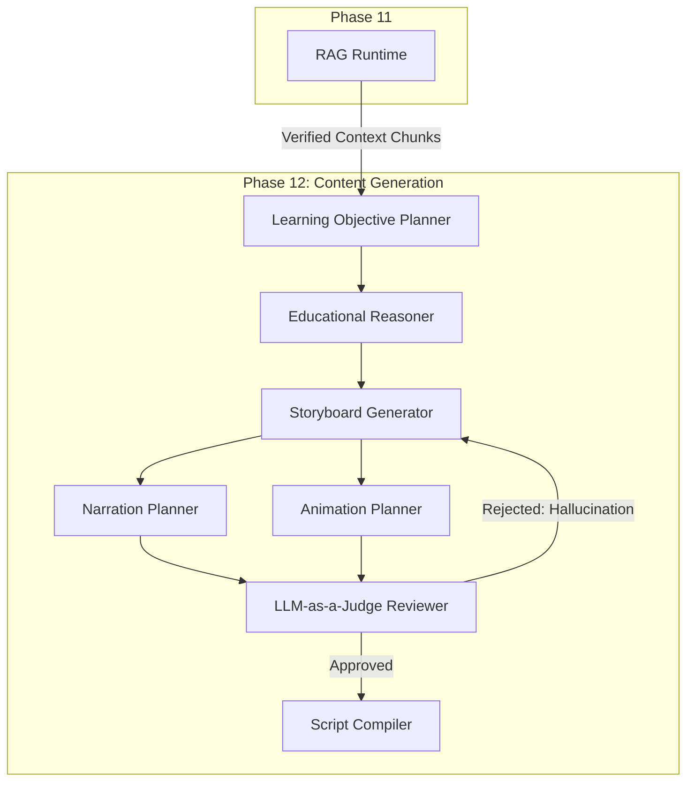

# Phase 12 / 01: Educational Content Generation Platform

**Author:** Principal Software Architect  
**Target System:** Automated DSA Educational YouTube Video Pipeline  
**Document Version:** 1.0.0  
**Status:** Architecture Designed

---

## 1. Executive Summary
The **Educational Content Generation Platform (ECGP)** is the intelligent, generative core of the pipeline. It consumes the highly-refined mathematical context from the **RAG Runtime (Phase 11)** and applies rigorous pedagogical reasoning to transform raw algorithms into compelling, storyboarded YouTube video scripts. 

It does **not** render the video (Manim) or generate the audio (Kokoro); instead, it acts as a compiler, emitting a strict, standardized JSON Payload representing the final "Script" which the downstream audio/visual modules will deterministically parse.

---

## 2. System Architecture

### 2.1 Core Components
1. **Learning Objective Planner:** Analyzes the target LeetCode problem (e.g., "Two Sum") and establishes 3 clear, measurable pedagogical goals for the viewer.
2. **Educational Reasoner:** Decides the teaching approach (e.g., "Analogy first, then Brute Force, then Optimal Hash Map").
3. **Storyboard Generator:** Slices the reasoning into distinct chronological visual scenes.
4. **Narration Planner:** Writes the exact spoken English script for each scene, optimizing for text-to-speech cadence.
5. **Animation Planner:** Dictates the visual state of the screen for each scene (which the Manim engine will later render).
6. **Script Compiler:** Assembles the narration and animation metadata into the final JSON Output Payload.
7. **Reviewer & Formatter:** Self-correction loop via an "LLM-as-a-Judge" to ensure the generated script doesn't hallucinate and obeys character limits.

### 2.2 Integrations
*   **RAG Runtime:** Provides the accurate LeetCode problem description, optimal Python solutions, and rigorous Time/Space complexity theory.
*   **Knowledge Router:** Ensures the script only references prerequisite concepts the target viewer (e.g., "Beginner") is expected to know.
*   **Pipeline Orchestrator (Workflow Engine):** The ECGP is invoked synchronously as a core Layer-3 module by the master Pipeline Coordinator.
*   **Event Bus:** Emits non-blocking telemetry (`script.generation_started`, `script.review_failed`) for the RAG Monitor daemon to scrape for Grafana dashboards.

---

## 3. Diagrams

### 3.1 Component Architecture



### 3.2 Sequence Diagram

```mermaid
sequenceDiagram
    participant Orch as Pipeline Orchestrator
    participant RAG as RAG Runtime
    participant LLM as Generative LLM (Gemini)
    participant ECGP as Content Generator
    participant Bus as Event Bus
    
    Orch->>ECGP: generate_script(slug="two-sum")
    ECGP->>Bus: emit("script.started", {"slug": "two-sum"})
    
    ECGP->>RAG: retrieve_context("two sum algorithm optimal")
    RAG-->>ECGP: [Markdown Context Chunks]
    
    ECGP->>LLM: prompt_learning_objectives(context)
    LLM-->>ECGP: [Objectives JSON]
    
    ECGP->>LLM: prompt_storyboard(objectives, context)
    LLM-->>ECGP: [Storyboard JSON]
    
    loop Self-Correction (Max 3 attempts)
        ECGP->>LLM: prompt_draft(storyboard)
        LLM-->>ECGP: Draft Script Payload
        ECGP->>LLM: prompt_review(Draft, RAG Context)
        LLM-->>ECGP: Approval or Rejection
        
        alt is Approved
            break
        end
    end
    
    ECGP->>ECGP: compile_final_json()
    ECGP->>Bus: emit("script.completed", {"tokens": 4500})
    ECGP-->>Orch: VideoScriptPayload
```

---

## 4. Output Specification (The Artifact)

The Content Generation Platform produces a strict, versioned JSON document representing the Video Script. This decouples the unreliable, non-deterministic LLM from the strict, deterministic Audio/Video rendering engines.

```json
{
  "version": "1.0",
  "slug": "two-sum",
  "metadata": {
    "target_audience": "Beginner",
    "total_scenes": 5,
    "estimated_duration_sec": 320
  },
  "scenes": [
    {
      "scene_id": 1,
      "type": "theory_intro",
      "narration": "Welcome back! Today we are solving the classic Two Sum problem.",
      "animation_directives": {
        "action": "DisplayTitleCard",
        "parameters": {"title": "Two Sum", "difficulty": "Easy"}
      }
    },
    {
      "scene_id": 2,
      "type": "code_walkthrough",
      "narration": "We can solve this in O(N) time using a Hash Map.",
      "animation_directives": {
        "action": "HighlightCodeLines",
        "parameters": {"lines": [4, 5]}
      }
    }
  ]
}
```

---

## 5. Implementation Guidance

1. **Prompt Chains over Mega-Prompts:** Do not pass the RAG context to an LLM and simply ask it to *"Write a YouTube script."* It will catastrophically fail, lose track of the math, and hallucinate. You must chain the prompts physically: 
   *   Step 1: Write Learning Objectives.
   *   Step 2: Given Objectives, write Storyboard.
   *   Step 3: Given Storyboard, write Narration.
2. **Deterministic Output Parsing:** You must use `instructor` or native LLM JSON Mode (e.g., Gemini Structured Outputs) to mathematically guarantee the `animation_directives` are valid JSON. If the LLM returns invalid JSON wrapped in markdown, the downstream Manim engine will violently crash.
3. **Self-Correction Boundaries:** The `Reviewer` phase is critical. Feed the drafted script *back* into the LLM with the prompt: *"Does this drafted script violate the mathematical time complexity provided in the original RAG context?"* If yes, mathematically discard the draft and retry (max 3 times) before halting the pipeline.
