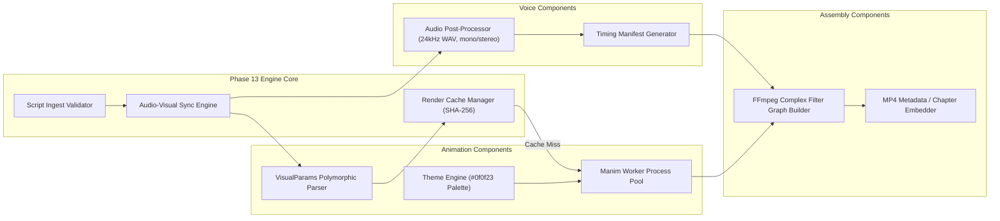
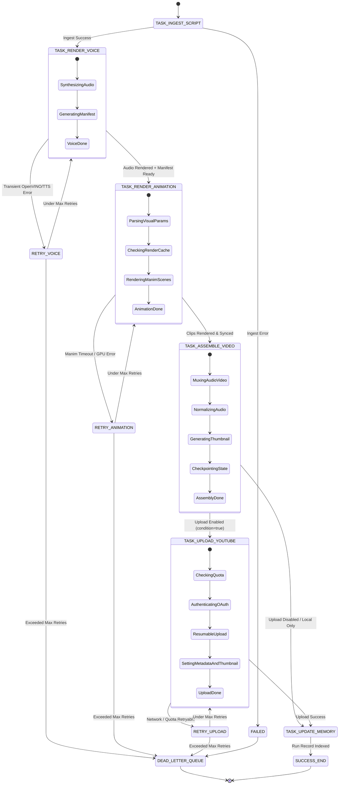
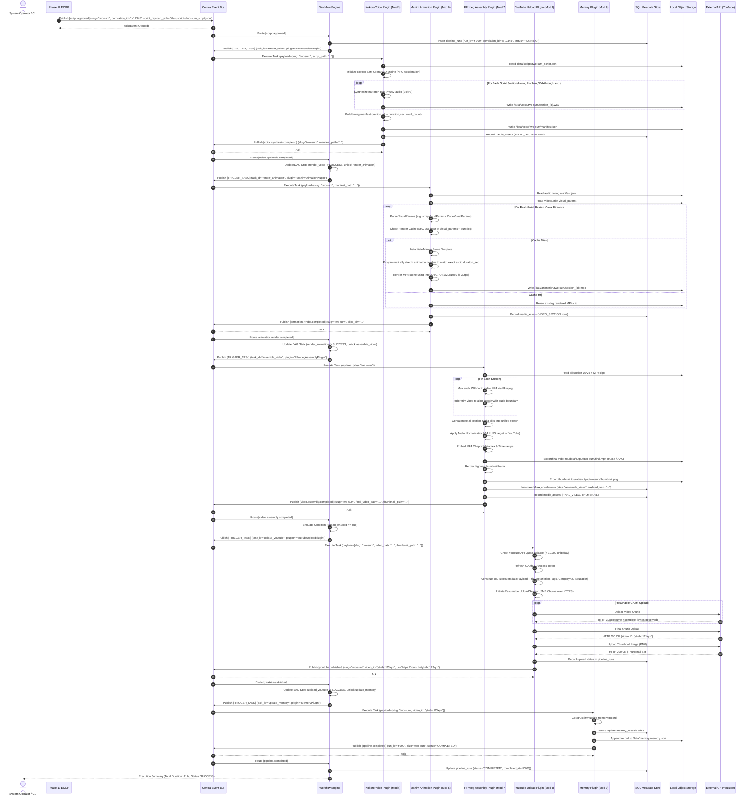

# Phase 13: Media Production Platform Architecture — System Integration & Architectural Specification Report

**Author:** Explorer 1 (Integration & System Architecture Specialist)  
**Target System:** Automated DSA Educational YouTube Video Pipeline — Phase 13 Media Production Platform  
**Working Directory:** `/home/adarsh/Documents/Youtube-Channel/PromptBook/Phase13/.agents/explorer_1`  
**Date:** July 23, 2026  
**Document Status:** Complete Architecture Specification  

---

## Executive Summary

The **Phase 13 Media Production Platform** forms the deterministic, high-performance multimedia execution foundation of the Automated DSA Educational YouTube Video Pipeline. Operating immediately downstream of the **Phase 12 Educational Content Generation Platform (ECGP)** and **Phase 11 RAG Runtime**, Phase 13 transforms abstract pedagogical script specs (narration plans, animation directives, visual parameters, storyboards) into polished, broadcast-ready 1080p60 H.264 YouTube videos complete with synthesized voiceover, synchronized Manim animations, chapter metadata, and automated distribution.

This specification provides the comprehensive system architecture, integration topology, data flow contracts, Mermaid diagrams, and end-to-end execution flows for Phase 13. It establishes strict alignment with the system's foundational architecture specifications:
- `02_Project_Architecture.md`: Overall sequential batch processing & module responsibilities.
- `09_Plugin_SDK.md`: Structural subtyping, plugin lifecycle, and context isolation.
- `10_Event_Driven_Architecture.md`: Pub/Sub Event Bus, correlation tracing, and Dead Letter Queue (DLQ).
- `11_Workflow_Engine.md`: Declarative DAG workflow blueprints, checkpointing, and Saga rollback semantics.
- `12_Event_Schemas.md`: Immutable frozen dataclass envelopes and typed payload contracts.
- `Phase11/` & `Phase12/`: Grounded RAG context and structured script compilation.

---

## 1. System Integration Topology

The Phase 13 Media Production Platform integrates five primary core subsystems into a unified, event-driven processing ecosystem.

```
┌──────────────────────────────────────────────────────────────────────────────────────────────────┐
│                                    SYSTEM INTEGRATION TOPOLOGY                                   │
└──────────────────────────────────────────────────────────────────────────────────────────────────┘

   ┌────────────────────────────────┐                 ┌────────────────────────────────┐
   │     Phase 11: RAG Runtime      │                 │  Phase 12: Content Generation  │
   │  (Knowledge Base & Context)    │                 │    (Educational Script JSON)   │
   └───────────────┬────────────────┘                 └───────────────┬────────────────┘
                   │                                                  │
                   └────────────────────────┬─────────────────────────┘
                                            │ Script Approved Event (Payload + Metadata)
                                            ▼
┌──────────────────────────────────────────────────────────────────────────────────────────────────┐
│                               CENTRAL EVENT BUS & WORKFLOW ENGINE                                │
│    - Pub/Sub Priority Queue   - DAG Workflow Resolution   - Correlation Tracing & DLQ            │
└──────┬──────────────────────┬──────────────────────┬──────────────────────┬──────────────────────┘
       │                      │                      │                      │
       ▼                      ▼                      ▼                      ▼
┌──────────────┐       ┌──────────────┐       ┌──────────────┐       ┌──────────────┐
│  VOICE ENGINE│       │  ANIMATION   │       │   ASSEMBLY   │       │   DISTRIB.   │
│ (Kokoro TTS) │       │   (Manim)    │       │   (FFmpeg)   │       │  (YouTube)   │
└──────┬───────┘       └──────┬───────┘       └──────┬───────┘       └──────┬───────┘
       │ Audio Assets         │ Video Clips          │ Final MP4            │ Upload Result
       └──────────────────────┼──────────────────────┴──────────────────────┘
                              ▼
┌──────────────────────────────────────────────────────────────────────────────────────────────────┐
│                                       PERSISTENCE LAYER                                          │
│  - Object Storage: data/voice/, data/animation/, data/output/ (WAV, MP4, PNG)                    │
│  - SQL Store: SQLite/PostgreSQL (Runs, Media Assets, Checkpoints, Memory Index)                  │
└──────────────────────────────────────────────────────────────────────────────────────────────────┘
```

---

### 1.1 Integration with Educational Content Platform (Phase 12 Outputs)

Phase 12 (ECGP) acts as an LLM-driven compiler that outputs a validated, versioned `VideoScriptPayload` (or `VideoScript` JSON artifact). Phase 13 ingests this artifact without needing to re-invoke generative LLMs.

#### Ingested Phase 12 Artifacts
1. **Narration Plans:** Spoken text for each section, phonetic transcriptions, emphasis cues, target speech rate (words per minute), and audio section identifiers (`section_01_hook`, `section_02_problem`, etc.).
2. **Animation Plans:** Typed `VisualParams` dataclasses (e.g. `ArrayVisualParams`, `TreeVisualParams`, `LinkedListVisualParams`, `CodeVisualParams`, `ComplexityVisualParams`), scene background themes, color palettes (#0f0f23 dark mode), line highlight sequences, and transition types.
3. **Storyboards:** Chronological layout mapping script sections (Hook, Problem Statement, Constraints, Brute Force, Optimal Intuition, Walkthrough, Dry Run, Code Walkthrough, Complexity, Closing) to visual scene templates.
4. **Script & Metadata:** YouTube video titles, SEO descriptions, recommended tags, chapter timestamps, and difficulty classification.

#### Handshake & Validation Contract
- **Trigger Event:** Phase 12 emits `script.generation_completed` (or `SCRIPT_APPROVED` event) over the Event Bus, carrying `correlation_id`, `slug`, and `script_payload_path`.
- **Validation Pipeline:** Phase 13's `ScriptIngestValidator` reads the payload file, executes schema validation against `VideoScriptPayload` Pydantic/dataclass schema, verifies that visual parameters match registered Manim scene types, and confirms that narration strings contain no unescaped format tokens.
- **Decomposition & Parallel Routing:** Upon validation, Phase 13 splits the script into:
  - **Audio Stream:** Passed to the Voice Generation Subsystem (Module 5 / `VoiceGeneratorPlugin`).
  - **Visual Stream:** Passed to the Animation Engine Subsystem (Module 6 / `AnimationPlugin`) along with audio timing constraints once voice synthesis completes.

---

### 1.2 Integration with Plugin Platform (Plugin SDK)

Phase 13 components are implemented as standalone plugins conforming strictly to `09_Plugin_SDK.md` via `typing.Protocol` structural subtyping.

#### Core Plugin SDK Contracts
Phase 13 plugins implement `BasePlugin`:
- `metadata: PluginMetadata` (name, version, author, description, dependencies).
- `state: PluginState` (`UNINITIALIZED` → `INITIALIZING` → `ACTIVE` → `PAUSED` → `STOPPING` → `STOPPED` → `ERROR`).
- `initialize(context: PluginContext) -> None`
- `execute(payload: Any) -> PluginResult`
- `shutdown() -> None`
- `check_health() -> PluginHealth`

#### Plugin Host Lifecycle & Context Isolation
1. **Discovery & Validation:** `PluginLoader` traverses `/src/plugins/`, loading python classes. `PluginValidator` verifies metadata and topological dependency constraints via `PluginDependency`.
2. **Instantiation & Context Ingestion:** `PluginFactory` instantiates plugins. Each plugin is injected with a scoped `PluginContext` proxy.
   - **Isolation Rule:** Plugins cannot directly access the global DI `Container` or underlying raw storage drivers. They interact with infrastructure strictly through `context.config`, `context.emit_event()`, and authorized system services via `context.get_service()`.
3. **Thread Safety:** State transitions are guarded by `asyncio.Lock` inside `PluginManager`.

#### Phase 13 Plugin Suite
- `KokoroVoicePlugin`: Encapsulates local Kokoro-82M TTS OpenVINO execution.
- `ManimAnimationPlugin`: Encapsulates programmatic Manim rendering and GPU resource scheduling.
- `FFmpegAssemblyPlugin`: Encapsulates FFmpeg media muxing, audio normalization, and thumbnail extraction.
- `YouTubeUploadPlugin`: Encapsulates OAuth 2.0 token management and YouTube Data API v3 upload.
- `MemoryPlugin`: Encapsulates persistent run indexing and analytics updating.

---

### 1.3 Integration with Workflow Engine (DAG Execution & Routing)

Phase 13 relies on the declarative Workflow Engine (`11_Workflow_Engine.md`) to coordinate multi-stage media processing.

#### DAG Workflow Definition (`phase13_production_workflow.yaml`)
```yaml
version: "1.0.0"
name: "Phase 13 Media Production Workflow"
description: "Transforms approved script payload into published YouTube video."

tasks:
  - id: "ingest_script"
    plugin: "ScriptIngestPlugin"
    timeout_sec: 30
    retries: 1

  - id: "render_voice"
    plugin: "KokoroVoicePlugin"
    depends_on: ["ingest_script"]
    timeout_sec: 300
    retries: 2

  - id: "render_animation"
    plugin: "ManimAnimationPlugin"
    depends_on: ["ingest_script", "render_voice"] # Requires voice audio durations for lip-sync/timing
    timeout_sec: 600
    retries: 2

  - id: "assemble_video"
    plugin: "FFmpegAssemblyPlugin"
    depends_on: ["render_voice", "render_animation"]
    timeout_sec: 300
    retries: 1
    checkpoint: true # Checkpoint final render before external network upload

  - id: "upload_youtube"
    plugin: "YouTubeUploadPlugin"
    depends_on: ["assemble_video"]
    condition: "payload.upload_enabled == true"
    timeout_sec: 600
    retries: 3

  - id: "update_memory"
    plugin: "MemoryPlugin"
    depends_on: ["assemble_video"] # Runs even if upload is skipped or private
```

#### Step State Transitions
Each DAG task transitions through standard states:  
`PENDING` → `RUNNING` → `RETRYING` (on transient failure) → `SUCCESS` / `FAILED` / `SKIPPED`.

#### Synchronization & Fan-In / Fan-Out
- **Sequential Fan-Out:** Voice generation must execute first to establish exact audio durations (in milliseconds) for each section.
- **Timing Synchronization:** Animation rendering receives `VoiceResult.section_audio` durations. Manim scene animations are programmatically stretched/aligned to match audio length precisely.
- **Fan-In Join:** `assemble_video` acts as the synchronization join point, requiring both `render_voice` (WAV files) and `render_animation` (MP4 clips) to succeed before proceeding.

#### Saga Rollback & Checkpointing
- **Checkpointing:** At `assemble_video`, the DAG state matrix and generated media paths are serialized to `data/checkpoints/{slug}/assembly_checkpoint.json`. Operator can inspect video preview prior to YouTube distribution.
- **Saga Compensation:** If `assemble_video` or `upload_youtube` fails unrecoverably, the Workflow Engine emits `[COMPENSATE_TASK]` events, prompting plugins to clean up temporary scratch files in `/tmp/ffmpeg_scratch/` while preserving raw section renders in object storage.

---

### 1.4 Integration with Event Bus (EDA & Pub/Sub Topics)

Phase 13 adheres strictly to the Pub/Sub architecture defined in `10_Event_Driven_Architecture.md` and `12_Event_Schemas.md`.

#### Event Envelope Standard (`IntegrationEvent[T]`)
Every message emitted or consumed by Phase 13 uses the standard generic envelope:
- `name: str`
- `metadata: EventMetadata` (`event_id`, `timestamp`, `correlation_id`, `trace_id`, `pipeline_id`, `plugin_id`, `priority`, `retry_count`).
- `payload: T` (frozen dataclass).

#### Phase 13 Event Topic Catalog

| Topic / Event Name | Publisher | Main Subscribers | Payload Dataclass | Priority |
|---|---|---|---|---|
| `script.approved` | Phase 12 ECGP | ScriptIngestPlugin, WorkflowEngine | `ScriptApprovedPayload` | NORMAL (5) |
| `voice.synthesis.started` | KokoroVoicePlugin | WorkflowEngine, MonitoringPlugin | `VoiceSynthesisStartedPayload` | NORMAL (5) |
| `voice.synthesis.completed` | KokoroVoicePlugin | ManimAnimationPlugin, WorkflowEngine | `AudioRenderedPayload` | NORMAL (5) |
| `animation.render.started` | ManimAnimationPlugin | WorkflowEngine, MonitoringPlugin | `AnimationRenderStartedPayload` | NORMAL (5) |
| `animation.render.completed` | ManimAnimationPlugin | FFmpegAssemblyPlugin, WorkflowEngine | `RenderCompletePayload` | NORMAL (5) |
| `video.assembly.started` | FFmpegAssemblyPlugin | WorkflowEngine, MonitoringPlugin | `AssemblyStartedPayload` | NORMAL (5) |
| `video.assembly.completed` | FFmpegAssemblyPlugin | YouTubeUploadPlugin, MemoryPlugin | `VideoAssembledPayload` | HIGH (2) |
| `youtube.upload.started` | YouTubeUploadPlugin | WorkflowEngine, AnalyticsPlugin | `UploadStartedPayload` | NORMAL (5) |
| `youtube.upload.completed` | YouTubeUploadPlugin | MemoryPlugin, DiscordPlugin | `YoutubePublishedPayload` | HIGH (2) |
| `pipeline.failed` | Any Plugin / Engine | DLQ, AlertService, MemoryPlugin | `PipelineFailedPayload` | CRITICAL (0) |

#### Message Broker Integration & Reliability
- **Local Broker:** In-memory `asyncio.PriorityQueue` supporting priority routing (CRITICAL 0 to LOW 8).
- **External Broker Upgrade Path:** Designed behind `EventBusProtocol` so the broker can be swapped for Redis Pub/Sub, RabbitMQ, or Apache Kafka in multi-node production without plugin code changes.
- **Traceability & DLQ:** Every event passes `correlation_id` downstream. If a task throws a `RetryableError`, backoff retries occur. Upon exceeding max retries or encountering `FatalError`, event is written to `data/dlq/dlq_events.sqlite`.

---

### 1.5 Integration with Persistence Layer

Phase 13 employs a dual-tier persistence model: **Object Storage** for raw/assembled binary media assets, and a **SQL Metadata Store** for relational execution telemetry and memory indexing.

#### 1. Object Storage Hierarchy (`/data/`)
```
data/
├── scraped/               # Scraped LeetCode JSONs (Phase 11/12 input)
├── scripts/               # Approved VideoScript payloads (Phase 12 output)
├── voice/                 # Voice Generation outputs (Module 5)
│   └── {slug}/
│       ├── manifest.json  # Audio timing manifest mapping section IDs -> duration/path
│       ├── section_01_hook.wav
│       ├── section_02_problem.wav
│       └── section_..._.wav
├── animation/             # Manim Rendered Clips (Module 6)
│   └── {slug}/
│       ├── section_01_hook.mp4
│       ├── section_02_problem.mp4
│       └── section_..._.mp4
├── output/                # Final Assembled Assets (Module 7)
│   └── {slug}/
│       ├── final.mp4      # 1080p60 H.264 video file
│       ├── thumbnail.png  # High-res 1280x720 PNG thumbnail
│       └── metadata.json  # Final assembly manifest & chapter info
├── memory/                # Persistent Memory Store (Module 9)
│   ├── memory.db          # SQLite database for relational queries
│   └── memory.json        # Cold storage backup of generated records
└── dlq/                   # Dead Letter Queue storage
    └── dlq_events.sqlite
```

#### 2. SQL Metadata Store Schema (SQLite / PostgreSQL)
The SQL metadata store manages execution state, asset tracking, and historical memory indexing across four core tables:

```sql
-- 1. Pipeline Execution Runs
CREATE TABLE pipeline_runs (
    run_id VARCHAR(36) PRIMARY KEY,
    correlation_id VARCHAR(36) NOT NULL,
    slug VARCHAR(128) NOT NULL,
    status VARCHAR(32) NOT NULL, -- PENDING, RUNNING, COMPLETED, FAILED
    started_at TIMESTAMP WITH TIME ZONE NOT NULL,
    completed_at TIMESTAMP WITH TIME ZONE,
    total_duration_sec FLOAT,
    error_message TEXT
);

-- 2. Media Asset Registry
CREATE TABLE media_assets (
    asset_id VARCHAR(36) PRIMARY KEY,
    run_id VARCHAR(36) REFERENCES pipeline_runs(run_id),
    slug VARCHAR(128) NOT NULL,
    asset_type VARCHAR(32) NOT NULL, -- AUDIO_SECTION, VIDEO_SECTION, FINAL_VIDEO, THUMBNAIL
    section_id VARCHAR(64),
    file_path TEXT NOT NULL,
    file_size_bytes BIGINT NOT NULL,
    duration_sec FLOAT,
    content_hash VARCHAR(64) NOT NULL, -- SHA-256 for caching & de-duplication
    checksum_verified BOOLEAN DEFAULT TRUE,
    created_at TIMESTAMP WITH TIME ZONE NOT NULL
);

-- 3. Workflow Checkpoints
CREATE TABLE workflow_checkpoints (
    checkpoint_id VARCHAR(36) PRIMARY KEY,
    run_id VARCHAR(36) REFERENCES pipeline_runs(run_id),
    slug VARCHAR(128) NOT NULL,
    step_name VARCHAR(64) NOT NULL,
    dag_state_json TEXT NOT NULL,
    payload_json TEXT NOT NULL,
    created_at TIMESTAMP WITH TIME ZONE NOT NULL
);

-- 4. Memory Index & Distribution Tracking
CREATE TABLE memory_records (
    slug VARCHAR(128) PRIMARY KEY,
    problem_number INT NOT NULL,
    title VARCHAR(256) NOT NULL,
    difficulty VARCHAR(32) NOT NULL,
    tags TEXT NOT NULL, -- JSON array of tags
    primary_pattern VARCHAR(128) NOT NULL,
    script_hash VARCHAR(64) NOT NULL,
    voice_duration_sec FLOAT NOT NULL,
    video_duration_sec FLOAT NOT NULL,
    file_size_bytes BIGINT NOT NULL,
    youtube_video_id VARCHAR(64),
    youtube_url VARCHAR(256),
    status VARCHAR(32) NOT NULL,
    errors_json TEXT,
    started_at TIMESTAMP WITH TIME ZONE NOT NULL,
    completed_at TIMESTAMP WITH TIME ZONE
);
```

---

## 2. System Architecture Diagrams

### 2.1 Complete System Architecture Diagram (Mermaid)

The following diagram details all components, boundaries, hardware offloads, and inter-component interfaces for Phase 13.

```mermaid
graph TB
    subgraph Boundary_Phase12 ["Phase 12: Educational Content Platform"]
        ECGP["Script Compiler / ECGP Engine"]
        ScriptArtifact["VideoScript Payload (JSON/Dataclass)"]
        ECGP --> ScriptArtifact
    end

    subgraph Boundary_CoreInfra ["Core Platform Infrastructure"]
        EB["Central Event Bus (asyncio PriorityQueue / Redis)"]
        WE["Workflow Engine (DAG Runner & Saga Rollback)"]
        PR["Plugin Registry & Lifecycle Manager"]
        DB[(SQL Metadata Store: SQLite / Postgres)]
        FS[(Object Storage: /data/ voice, animation, output)]
    end

    subgraph Boundary_Phase13 ["Phase 13: Media Production Platform"]
        subgraph Sub_Voice ["Voice Subsystem (Module 5)"]
            KVP["KokoroVoicePlugin (BasePlugin Protocol)"]
            TTS["Kokoro-82M OpenVINO Engine"]
            NPU_HW[["Intel AI Boost NPU / CPU acceleration"]]
            KVP --> TTS
            TTS --> NPU_HW
        end

        subgraph Sub_Anim ["Animation Subsystem (Module 6)"]
            MAP["ManimAnimationPlugin (BasePlugin Protocol)"]
            MCE["Manim Community Render Engine"]
            SceneLib["DSA Scene Template Library (Array, Tree, Graph, Code)"]
            GPU_HW[["Intel Arc GPU (OpenGL/FFmpeg hardware acceleration)"]]
            MAP --> MCE
            MCE --> SceneLib
            MCE --> GPU_HW
        end

        subgraph Sub_Assembly ["Video Assembly Subsystem (Module 7)"]
            FAP["FFmpegAssemblyPlugin (BasePlugin Protocol)"]
            FFMPEG["FFmpeg Binary Muxer & Filter Engine"]
            Norm["Audio Normalizer (-14 LUFS)"]
            ThumbGen["Thumbnail Generator & Title Overlay"]
            FAP --> FFMPEG
            FFMPEG --> Norm
            FFMPEG --> ThumbGen
        end

        subgraph Sub_Dist ["Distribution Subsystem (Module 8)"]
            YUP["YouTubeUploadPlugin (BasePlugin Protocol)"]
            OAuth["OAuth 2.0 Token Refresh Manager"]
            Resumable["Resumable Chunked Uploader"]
            YUP --> OAuth
            YUP --> Resumable
        end

        subgraph Sub_Memory ["Memory Subsystem (Module 9)"]
            MEMP["MemoryPlugin (BasePlugin Protocol)"]
            MemIndex["Memory Record Indexer & Analytics"]
            MEMP --> MemIndex
        end
    end

    subgraph Boundary_External ["External Interfaces & Services"]
        YT_API[["YouTube Data API v3"]]
    end

    %% Interactions & Interfaces
    ScriptArtifact -- "Emits script.approved event" --> EB
    EB -- "Trigger Task" --> WE
    WE -- "Dispatches Step Execution" --> PR
    PR -- "Context Proxy" --> KVP
    PR -- "Context Proxy" --> MAP
    PR -- "Context Proxy" --> FAP
    PR -- "Context Proxy" --> YUP
    PR -- "Context Proxy" --> MEMP

    %% Data Flow & Media Assets
    KVP -- "Reads Narration Plan, Writes WAV files" --> FS
    KVP -- "Emits voice.completed (audio_manifest)" --> EB

    EB -- "Routes audio timing manifest" --> MAP
    MAP -- "Reads VisualParams + Audio Durations, Writes MP4 clips" --> FS
    MAP -- "Emits animation.completed (clip_manifest)" --> EB

    EB -- "Routes section WAVs + section MP4s" --> FAP
    FAP -- "Reads raw clips, Writes final.mp4 & thumbnail.png" --> FS
    FAP -- "Writes asset metadata" --> DB
    FAP -- "Emits video.assembled" --> EB

    EB -- "Routes video.assembled payload" --> YUP
    Resumable -- "HTTPS Chunked Upload" --> YT_API
    YUP -- "Emits youtube.published (video_id, url)" --> EB

    EB -- "Routes run telemetry & youtube metadata" --> MEMP
    MemIndex -- "Persists MemoryRecord & Run Log" --> DB
    MemIndex -- "Updates memory.json backup" --> FS
```



---

### 2.2 Phase 13 Internal Component Architecture



---

### 2.3 Workflow Engine Task DAG State Diagram



---

## 3. End-to-End Sequence Flow: Content Approved to Published Video

The following detailed sequence diagram illustrates the end-to-end execution flow across all Phase 13 modules, infrastructure components, external services, and persistent stores.



---

## 4. Subsystem Detailed Specifications

### 4.1 Module 5 — Voice Subsystem (`src/voice/`)
- **Engine Core:** Local Kokoro-82M TTS model compiled for Intel OpenVINO IR format.
- **Hardware Target:** Offloaded to Intel AI Boost NPU when available, with automatic CPU fallback.
- **Input Contract:** `VideoScript.sections[*].narration` strings + audio format directives.
- **Output Contract:** `VoiceResult` dataclass containing:
  - `slug: str`
  - `section_audio: list[SectionAudio]` (`section_id: str`, `audio_path: Path`, `duration_seconds: float`, `word_count: int`).
  - `total_duration_seconds: float`
  - `sample_rate: int = 24000`
  - `manifest_path: Path` (`/data/voice/{slug}/manifest.json`).

### 4.2 Module 6 — Manim Animation Subsystem (`src/animation/`)
- **Engine Core:** Manim Community Library rendering dark-themed (#0f0f23) programmatic animations.
- **Hardware Acceleration:** OpenGL hardware acceleration backed by Intel Arc GPU, leveraging FFmpeg h264_qsv / vaapi for fast hardware encoding.
- **Input Contract:** `VideoScript.sections[*].visual_params` + `VoiceResult.section_audio` durations.
- **Scene Library:**
  - `ArrayScene`: Highlight indices, pointer arrows, array traversal, swap animations.
  - `LinkedListScene`: Node creation, pointer reassignments (`next` pointers), traversal highlights.
  - `TreeScene`: Level-order hierarchy, BFS/DFS traversal pulses, node highlight colors.
  - `GraphScene`: Adjacency list representation, node visits, edge path highlights.
  - `HashMapScene`: Key-value bucket mappings, collision chains.
  - `StackQueueScene`: Push/pop/enqueue/dequeue animations.
  - `CodeScene`: Monokai syntax-highlighted C++ / Python code with active line highlights.
  - `ComplexityScene`: Animated Big-O comparison bar graphs ($O(1)$, $O(\log N)$, $O(N)$, $O(N^2)$).
- **Output Contract:** `AnimationResult` dataclass containing section MP4 paths (`/data/animation/{slug}/section_{id}.mp4`), frame count, resolution (`1920x1080`), and fps (`30`).

### 4.3 Module 7 — Video Assembly Subsystem (`src/assembly/`)
- **Engine Core:** Native FFmpeg binary wrapper executing multi-pass complex filter graphs.
- **Processing Pipeline:**
  1. Audio/Video Muxing & Padding: Aligns audio WAV to video MP4, trimming excess trailing frames or padding static end frames.
  2. Concatenation: Stitches section MP4 clips in strict script sequence without re-encoding video frames where parameters match.
  3. Loudness Normalization: Applies FFmpeg `loudnorm` filter targeting -14 LUFS, -1.0 dBFS true peak (YouTube audio standard).
  4. Chapter & Metadata Injection: Embeds FFmpeg metadata file specifying chapter titles and start/end timestamps derived from `VideoScript.seo_metadata.chapter_timestamps`.
  5. Thumbnail Composition: Extracts key high-contrast frame or renders title card card overlay to `/data/output/{slug}/thumbnail.png`.
- **Output Contract:** `AssembledVideo` dataclass (`video_path: Path`, `thumbnail_path: Path`, `total_duration_seconds: float`, `file_size_bytes: int`, `codec: str = "h264"`, `resolution: str = "1920x1080"`).

### 4.4 Module 8 — YouTube Distribution Subsystem (`src/youtube/`)
- **Engine Core:** Google API Client Library wrapping YouTube Data API v3 (`videos.insert`, `thumbnails.set`).
- **OAuth 2.0 Lifecycle:** Reads client secrets from `config/client_secrets.json`, persists refresh tokens to `config/tokens.json`, automatically refreshes access tokens prior to expiration.
- **Resumable Upload Protocol:** Uploads video in 5MB chunks. On network disruption, queries uploaded byte offset and resumes without restarting.
- **Quota Management:** Checks Daily Quota Usage (10,000 units max; upload consumes ~1,600 units). If quota is exceeded, queues upload intent to `data/upload_queue/` for automated retry after daily quota reset (00:00 PST).
- **Output Contract:** `UploadResult` dataclass (`video_id: str`, `video_url: str`, `privacy_status: str`, `upload_status: str`).

### 4.5 Module 9 — Memory Subsystem (`src/memory/`)
- **Engine Core:** Relational SQLite database (`/data/memory/memory.db`) with JSON cold storage sync (`/data/memory/memory.json`).
- **Functionality:**
  - Maintains deduplication index: `has_been_generated(slug) -> bool`.
  - Exposes historical queries: `get_record(slug)`, `get_problems_by_tag(tag)`, `get_failed_runs()`.
  - Serves as feedback loop for Phase 12 ECGP, providing prior script hashes and topic progression context to prevent repetitive explanations across YouTube channel uploads.
- **Output Contract:** `MemoryRecord` dataclass (frozen dataclass carrying complete run metadata).

---

## 5. Verification Method

To independently verify the architecture specifications and integration topology defined in this report:

1. **Schema Integrity Inspection:**
   - Verify that inter-module dataclasses in `src/models/` inherit frozen attributes and conform to `IntegrationEvent[T]` envelopes defined in `12_Event_Schemas.md`.
2. **Plugin Structural Subtyping Verification:**
   - Execute Python type checks (`mypy src/plugins/`) to verify that all Phase 13 plugins (`KokoroVoicePlugin`, `ManimAnimationPlugin`, `FFmpegAssemblyPlugin`, `YouTubeUploadPlugin`, `MemoryPlugin`) structurally conform to `BasePlugin` without requiring inheritance.
3. **Workflow DAG Blueprint Validation:**
   - Parse `phase13_production_workflow.yaml` using `WorkflowValidator` (`11_Workflow_Engine.md`) to verify DAG cycle detection and topological sorting.
4. **End-to-End Test Execution (Simulated / Dry-Run):**
   - Run pytest suite: `pytest tests/phase13/test_integration_topology.py`
   - Verify mock execution from `SCRIPT_APPROVED` event through synthetic audio generation, Manim dry-run rendering, FFmpeg concatenation, mock YouTube upload, and Memory DB persistence.
