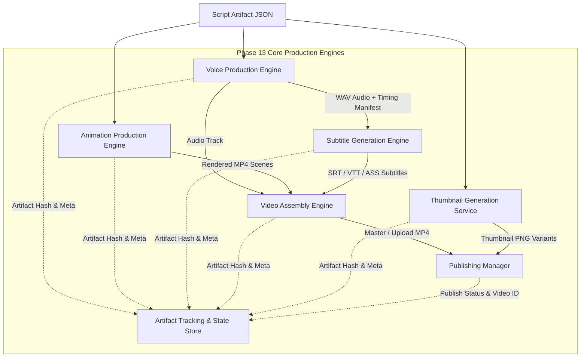
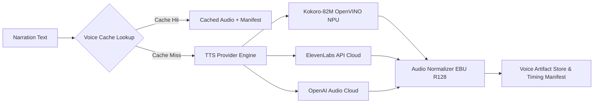
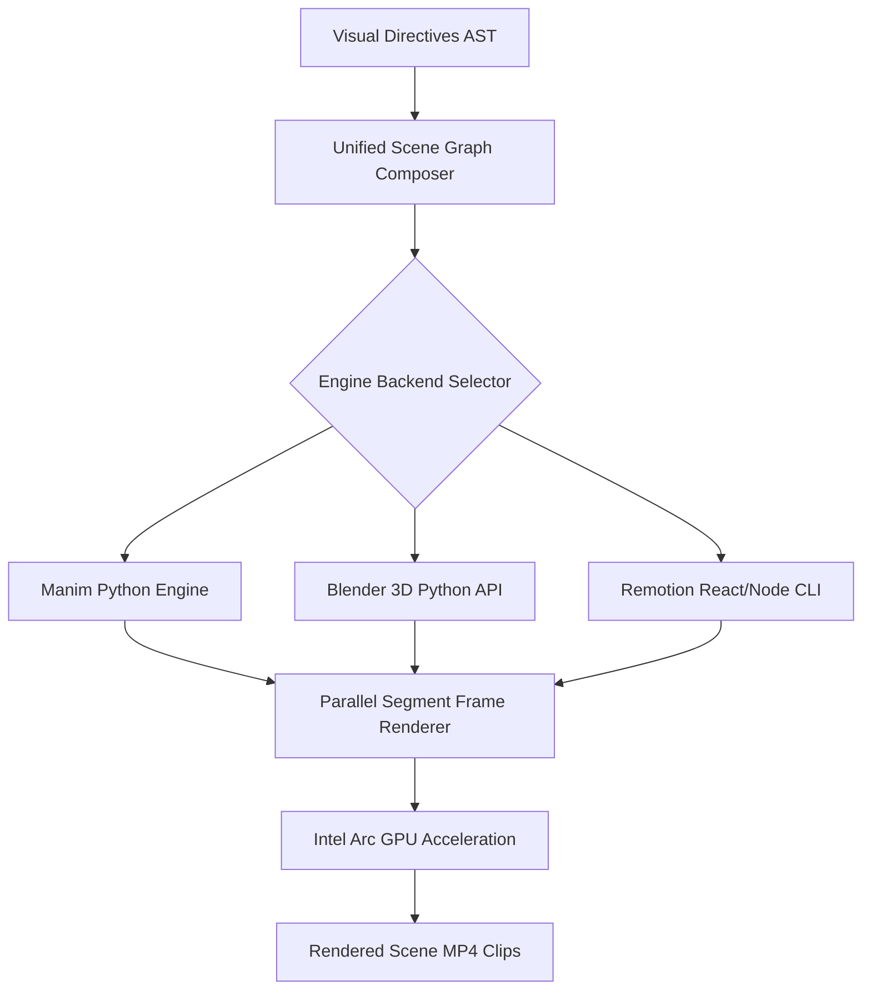
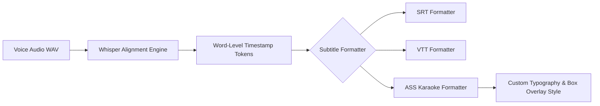
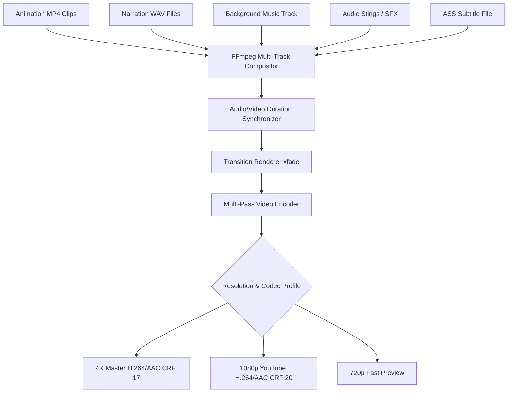
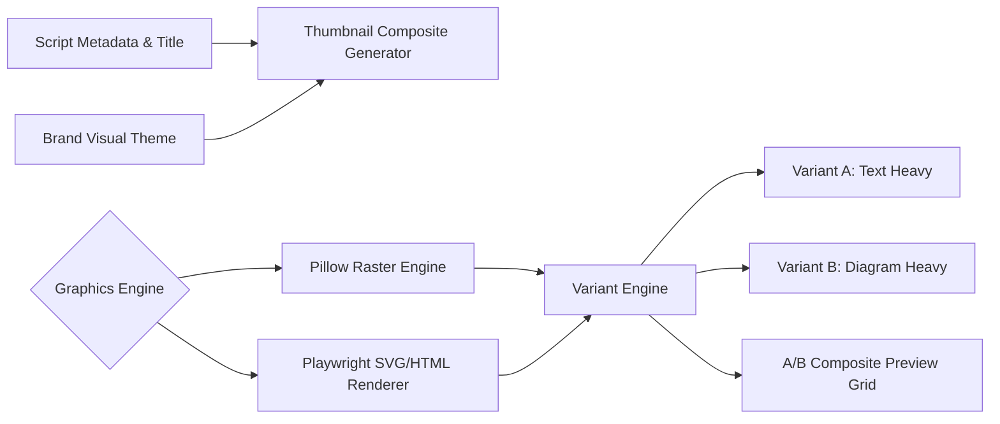
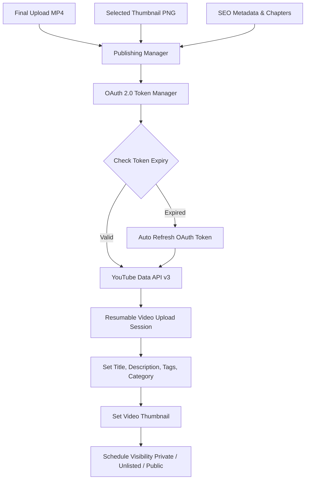
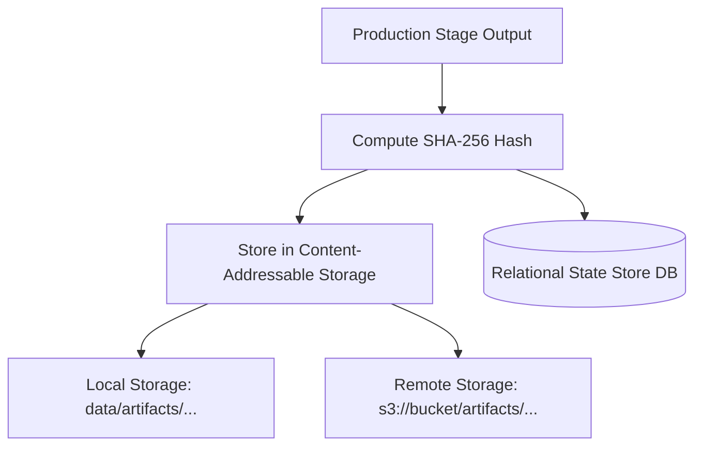
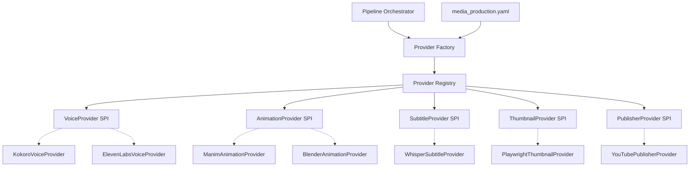
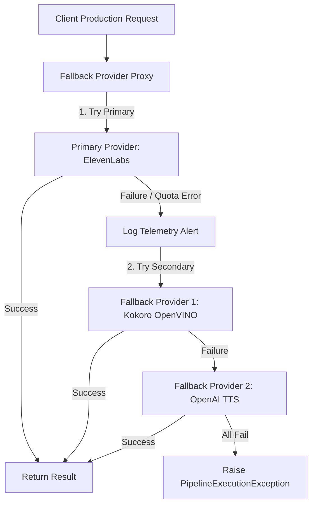

# Technical Specification: Core Production Responsibilities & Provider Abstraction

**Phase 13: Media Production Platform Architecture**  
**Document Code:** `Phase13/01_Media_Production_Architecture/Explorer_2`  
**Author:** Explorer 2 (Core Responsibilities & Provider Abstraction Specialist)  
**Target System:** Automated DSA Educational YouTube Video Pipeline  
**Target Environment:** Intel Core Ultra 7 155H · Ubuntu 25.10 LTS · Python 3.12 · Intel Arc GPU  
**Status:** Complete Technical Analysis & Architecture Specification  

---

## Executive Summary

This specification defines the core production engines, component architecture, artifact tracking data model, and interchangeable provider abstractions for Phase 13 of the Media Production Platform. 

The Media Production Platform converts validated script JSON artifacts into broadcast-ready educational video assets, subtitles, thumbnails, and automated YouTube publications. To ensure zero vendor lock-in, long-term maintainability, and seamless offline-to-cloud scaling, the platform introduces a strict **Service Provider Interface (SPI)** layer using Python `typing.Protocol` structural subtyping, coupled with a dynamic **Provider Factory & Fallback Registry**.

---

## 1. Core Production Responsibilities & Component Architecture



---

### 1.1 Voice Production Engine

The **Voice Production Engine** is responsible for converting section narration text into pristine 24kHz/44.1kHz speech audio, creating per-word timing manifests, managing voice parameter caching, and enforcing EBU R128 audio normalization.



#### Key Capabilities & Architecture:
1. **Multi-Provider Backend Support**:
   - **Kokoro TTS (Local/NPU)**: Primary offline backend running `kokoro-82m-openvino` quantized model on the Intel AI Boost NPU/CPU. Delivers sub-realtime synthesis without internet access.
   - **ElevenLabs API (Cloud Premium)**: High-fidelity cloud TTS (e.g. `eleven_multilingual_v2`) for production master releases.
   - **OpenAI Audio (Cloud Fallback)**: `tts-1` / `tts-1-hd` API fallback for consistent voice style when cloud APIs are requested.

2. **Voice Cache & Hash Deduplication**:
   - SHA-256 cache key generated from: `sha256(narration_text + voice_id + provider_name + speed + pitch + sample_rate)`.
   - Local disk layout: `data/cache/voice/{hash}.wav` and `data/cache/voice/{hash}.json`.
   - Prevents expensive cloud API re-calls or re-synthesis during pipeline retries or minor script adjustments.

3. **Audio Normalization Pipeline**:
   - **EBU R128 Loudness Target**: Integrated loudness normalized to **-14.0 LUFS** (YouTube standard) with a maximum True Peak limit of **-1.0 dBFS**.
   - **Dynamic Range Compression**: Light multi-band compression applied via FFmpeg / `pydub` to maintain vocal clarity over background music.

4. **Timing Manifest & Word Duration Extraction**:
   - Produces detailed timing JSON containing character offset, word start time, and word end time.
   - Feeds downstream Animation and Subtitle engines for frame-exact synchronization.

---

### 1.2 Animation Production Engine

The **Animation Production Engine** renders high-frame-rate algorithmic animations, code walkthroughs, data structure visual state transitions, and math diagrams based on structured script parameters.



#### Key Capabilities & Architecture:
1. **Engine Backend Support**:
   - **Manim Python Engine**: Primary backend using Manim Community Edition. Renders vector graph traversals, array pointers, tree node manipulations, and syntax-highlighted C++ code.
   - **Blender Engine**: 3D scene engine invoked via headless Python script (`blender --background --python render.py`) for 3D data structure representations.
   - **Remotion Engine**: Web-native React/TypeScript video engine executed via Node CLI (`npx remotion render`) for web-style UI overlays and dynamic text graphic cards.

2. **Unified Scene Graph Representation**:
   - Script visual parameters are converted into an Engine-Independent **Scene Graph AST**.
   - Decouples visual intent (`HighlightArrayElement(index=2, color="#FF0000")`) from backend implementation details.

3. **Frame Rendering & GPU Acceleration**:
   - **Profiles**: 1080p @ 30fps (Default Draft), 1080p @ 60fps (Production Standard), 4K UHD @ 60fps (Master Archive).
   - **Hardware Offload**: PyTorch/OpenCL/FFmpeg GPU offloading targeting Intel Arc Integrated Graphics (`iHD` driver / VAAPI / PyOpenGL).
   - **Parallel Segment Rendering**: Renders independent script sections concurrently across CPU cores before assembling clip segments.

---

### 1.3 Subtitle Generation Engine

The **Subtitle Generation Engine** creates precise word-level subtitle assets from voice audio, offering multiple output formats and supporting both soft subtitles and burnt-in visual captions.



#### Key Capabilities & Architecture:
1. **Whisper Word-Level Alignment**:
   - Uses `faster-whisper` (CTranslate2 backend) running locally on Intel CPU/GPU to align narration text against synthesized WAV files.
   - Generates millisecond-accurate timestamps for every individual word.

2. **Multi-Format Subtitle Support**:
   - **SRT (SubRip)**: Standard plain text captions with numeric index and millisecond timecodes.
   - **VTT (WebVTT)**: Web-compliant captions for HTML5 video players and YouTube caption upload.
   - **ASS (Advanced SubStation Alpha)**: Rich styled subtitles featuring custom font families, dynamic word-by-word highlight colors (Karaoke style), bounding box backgrounds, and precise screen positioning.

3. **Burnt-in vs Soft Subtitle Modes**:
   - **Soft Subtitles**: Exported as standalone sidecar files (`.srt` / `.vtt`) for upload to YouTube caption manager.
   - **Burnt-in Subtitles**: Rendered directly onto final video frames using FFmpeg's `libass` filter, guaranteeing identical visual appearance across all playback devices.

---

### 1.4 Video Assembly Engine

The **Video Assembly Engine** synthesizes visual scene clips, narration voice tracks, background music, audio effects, and burnt-in subtitles into a cohesive, normalized video master.



#### Key Capabilities & Architecture:
1. **FFmpeg Multi-Track Compositor**:
   - **Track 0**: Video stream (Animation scene clips concatenated with transitions).
   - **Track 1**: Primary audio stream (Voice narration).
   - **Track 2**: Secondary audio stream (Background music, auto-ducked by -12dB during narration).
   - **Track 3**: Tertiary audio stream (SFX transitions, code highlight stings).

2. **Audio/Video Synchronization**:
   - Handles minor timing discrepancies between voice length and animation render length.
   - Applies video speed adjustment (`setpts`), freeze-frame tail padding, or audio silence padding to ensure exact millisecond alignment.

3. **Transition Rendering**:
   - Seamless scene transitions rendered via FFmpeg `xfade` (crossfade, fade-to-black, wipe-left, slide-up).

4. **Resolution & Codec Profiles**:
   - **Master Profile**: 3840×2160 (4K), 60fps, H.264 High Profile, CRF 17, AAC 320kbps.
   - **Upload Profile**: 1920×1080 (1080p), 60fps, H.264 Main Profile, CRF 20, AAC 192kbps, EBU R128 audio normalization (-14 LUFS).
   - **Preview Profile**: 1280×720 (720p), 30fps, Ultrafast preset for instant dev validation.

---

### 1.5 Thumbnail Generation Service

The **Thumbnail Generation Service** automatically builds high-click-through-rate (CTR) YouTube thumbnails with dynamic title text overlays, code snippets, difficulty badges, and visual pattern artwork.



#### Key Capabilities & Architecture:
1. **Multi-Engine Rendering**:
   - **Pillow Engine**: Lightweight local Python image processing for quick raster compositing, typography rendering, and shadow effects.
   - **Playwright / SVG Engine**: Renders pixel-perfect HTML/CSS SVG templates to 1280×720 PNG images via headless Chromium, allowing modern web typography and complex layout cards.

2. **Dynamic Text & Auto-Scaling Overlay**:
   - Text wrapping and automatic font-size scaling based on string length.
   - Outlined text with drop shadows to maintain WCAG contrast compliance against dark or light background themes.

3. **Variant Generation & A/B Testing**:
   - Automatically generates multiple thumbnail variants per video (e.g. Variant A: Big Title + Code; Variant B: Visual Pattern Graph + Hook Text).
   - Exports side-by-side comparison grids (`preview_ab.png`) for content reviewer approval.

---

### 1.6 Publishing Manager

The **Publishing Manager** handles secure authentication, metadata enrichment, scheduled releases, and automated uploading to YouTube.



#### Key Capabilities & Architecture:
1. **YouTube Data API v3 Integration**:
   - Uses google-api-python-client with resumable upload protocol (`MediaFileUpload` with 8MB chunk sizes).

2. **OAuth Token Refresh & Credentials Manager**:
   - Manages client secrets and refresh tokens stored securely in `config/credentials/youtube_oauth.json`.
   - Auto-refreshes expired access tokens without interrupting execution.

3. **Metadata & Chapter Structuring**:
   - Automatically constructs description text with clickable timecodes (`00:00 - Introduction`, `01:15 - Algorithm Explanation`).
   - Tags video with problem tags, language (C++), difficulty, and educational categories (Category 27: Education).

4. **Quota Budgeting & Release Management**:
   - Tracks daily API quota consumption (Default: 10,000 units/day; Video upload costs ~1,600 units).
   - Supports scheduled release dates (`publishAt` ISO-8601 string) and privacy states (`private`, `unlisted`, `public`).

---

### 1.7 Artifact Tracking & State Store

The **Artifact Tracking & State Store** maintains strict immutability, integrity verification, content-addressable storage layouts, and relational metadata logging across all media production stages.



#### Storage Layout Specification:
```
data/artifacts/{slug}/
├── script/
│   ├── script_v1.json
│   └── script_v1.json.sha256
├── voice/
│   ├── narration_section_01.wav
│   ├── timing_manifest.json
│   └── voice_manifest.sha256
├── animation/
│   ├── section_01.mp4
│   ├── section_02.mp4
│   └── animation_manifest.sha256
├── subtitles/
│   ├── captions.srt
│   ├── captions.vtt
│   └── captions.ass
├── assembly/
│   ├── master_4k.mp4
│   ├── upload_1080p.mp4
│   └── assembly_manifest.json
├── thumbnail/
│   ├── variant_a.png
│   ├── variant_b.png
│   └── preview_grid.png
└── publish/
    └── youtube_response.json
```

#### Relational State Store Schema (SQLite / PostgreSQL):

```sql
-- Core Production Run Tracking
CREATE TABLE IF NOT EXISTS production_runs (
    run_id VARCHAR(64) PRIMARY KEY,
    slug VARCHAR(128) NOT NULL,
    status VARCHAR(32) NOT NULL, -- IN_PROGRESS, COMPLETED, FAILED
    voice_provider VARCHAR(64) NOT NULL,
    animation_provider VARCHAR(64) NOT NULL,
    subtitle_provider VARCHAR(64) NOT NULL,
    thumbnail_provider VARCHAR(64) NOT NULL,
    publisher_provider VARCHAR(64) NOT NULL,
    started_at TIMESTAMP WITH TIME ZONE DEFAULT CURRENT_TIMESTAMP,
    completed_at TIMESTAMP WITH TIME ZONE
);

-- Artifact Hash & Immutability Index
CREATE TABLE IF NOT EXISTS artifact_registry (
    artifact_id VARCHAR(64) PRIMARY KEY,
    run_id VARCHAR(64) REFERENCES production_runs(run_id),
    stage VARCHAR(32) NOT NULL, -- VOICE, ANIMATION, SUBTITLE, ASSEMBLY, THUMBNAIL, PUBLISH
    file_path TEXT NOT NULL,
    s3_uri TEXT,
    sha256_hash VARCHAR(64) NOT NULL,
    size_bytes BIGINT NOT NULL,
    mime_type VARCHAR(64) NOT NULL,
    created_at TIMESTAMP WITH TIME ZONE DEFAULT CURRENT_TIMESTAMP
);

-- Media Render Metrics & Performance Log
CREATE TABLE IF NOT EXISTS render_metrics (
    metric_id VARCHAR(64) PRIMARY KEY,
    run_id VARCHAR(64) REFERENCES production_runs(run_id),
    stage VARCHAR(32) NOT NULL,
    duration_ms DOUBLE PRECISION NOT NULL,
    cpu_utilization_pct REAL,
    gpu_memory_used_mb REAL,
    cache_hit BOOLEAN DEFAULT FALSE,
    created_at TIMESTAMP WITH TIME ZONE DEFAULT CURRENT_TIMESTAMP
);

-- Publishing Record Store
CREATE TABLE IF NOT EXISTS publishing_records (
    publish_id VARCHAR(64) PRIMARY KEY,
    run_id VARCHAR(64) REFERENCES production_runs(run_id),
    platform VARCHAR(32) NOT NULL, -- YOUTUBE, VIMEO, S3
    external_video_id VARCHAR(128),
    video_url TEXT,
    privacy_status VARCHAR(32) NOT NULL,
    published_at TIMESTAMP WITH TIME ZONE DEFAULT CURRENT_TIMESTAMP
);
```

---

## 2. Interchangeable Provider Abstraction (SPI Architecture)

To decouple the platform from specific underlying tools, Phase 13 implements a **Service Provider Interface (SPI)** pattern. All engine capabilities are exposed as abstract Python `typing.Protocol` interfaces. Higher-level orchestrators interact purely with SPI contracts, while concrete providers are loaded at runtime using a configuration-driven Factory Pattern.



---

### 2.1 Plugin SPI Definitions

Below are the complete, canonical Python `Protocol` interfaces and typed data payloads for all five media production engines.

```python
# src/media_production/spi/contracts.py
"""
Service Provider Interface (SPI) Data Contracts and Protocols for Phase 13.
Strictly relies on typing.Protocol for structural subtyping.
"""

from dataclasses import dataclass, field
from enum import Enum
from pathlib import Path
from typing import Any, Protocol, runtime_checkable

# ==========================================
# 1. VOICE PROVIDER SPI
# ==========================================

@dataclass(frozen=True)
class VoiceRequest:
    slug: str
    section_id: str
    narration_text: str
    voice_id: str = "default"
    speaking_rate: float = 1.0
    pitch: float = 0.0
    sample_rate: int = 24000
    output_format: str = "wav"

@dataclass(frozen=True)
class WordTiming:
    word: str
    start_time: float
    end_time: float

@dataclass(frozen=True)
class VoiceResponse:
    section_id: str
    audio_file_path: Path
    duration_seconds: float
    sha256_hash: str
    word_timings: list[WordTiming] = field(default_factory=list)
    cached: bool = False

@runtime_checkable
class VoiceProvider(Protocol):
    """SPI for Text-to-Speech synthesis engines."""

    @property
    def provider_id(self) -> str: ...

    async def initialize(self, config: dict[str, Any]) -> None: ...

    async def synthesize(self, request: VoiceRequest) -> VoiceResponse: ...

    async def check_health(self) -> bool: ...


# ==========================================
# 2. ANIMATION PROVIDER SPI
# ==========================================

@dataclass(frozen=True)
class AnimationRequest:
    slug: str
    section_id: str
    scene_type: str
    visual_parameters: dict[str, Any]
    target_duration_seconds: float
    resolution: tuple[int, int] = (1920, 1080)
    fps: int = 60
    dark_mode: bool = True

@dataclass(frozen=True)
class AnimationResponse:
    section_id: str
    video_clip_path: Path
    duration_seconds: float
    frame_count: int
    sha256_hash: str
    cached: bool = False

@runtime_checkable
class AnimationProvider(Protocol):
    """SPI for algorithmic animation and video frame rendering engines."""

    @property
    def provider_id(self) -> str: ...

    async def initialize(self, config: dict[str, Any]) -> None: ...

    async def render_scene(self, request: AnimationRequest) -> AnimationResponse: ...

    async def check_health(self) -> bool: ...


# ==========================================
# 3. SUBTITLE PROVIDER SPI
# ==========================================

class SubtitleFormat(str, Enum):
    SRT = "srt"
    VTT = "vtt"
    ASS = "ass"

@dataclass(frozen=True)
class SubtitleRequest:
    slug: str
    audio_file_path: Path
    narration_text: str
    word_timings: list[WordTiming]
    output_formats: list[SubtitleFormat]
    highlight_active_words: bool = True

@dataclass(frozen=True)
class SubtitleResponse:
    slug: str
    subtitle_files: dict[SubtitleFormat, Path]
    sha256_hash: str

@runtime_checkable
class SubtitleProvider(Protocol):
    """SPI for subtitle timestamp alignment and formatter engines."""

    @property
    def provider_id(self) -> str: ...

    async def initialize(self, config: dict[str, Any]) -> None: ...

    async def generate_subtitles(self, request: SubtitleRequest) -> SubtitleResponse: ...

    async def check_health(self) -> bool: ...


# ==========================================
# 4. THUMBNAIL PROVIDER SPI
# ==========================================

@dataclass(frozen=True)
class ThumbnailRequest:
    slug: str
    title_text: str
    subtitle_text: str
    code_snippet: str | None = None
    difficulty: str = "Easy"
    tags: list[str] = field(default_factory=list)
    output_resolution: tuple[int, int] = (1280, 720)
    variant_count: int = 2

@dataclass(frozen=True)
class ThumbnailVariant:
    variant_id: str
    image_path: Path
    sha256_hash: str

@dataclass(frozen=True)
class ThumbnailResponse:
    slug: str
    variants: list[ThumbnailVariant]
    preview_grid_path: Path

@runtime_checkable
class ThumbnailProvider(Protocol):
    """SPI for thumbnail image generation and typography compositing."""

    @property
    def provider_id(self) -> str: ...

    async def initialize(self, config: dict[str, Any]) -> None: ...

    async def generate_thumbnails(self, request: ThumbnailRequest) -> ThumbnailResponse: ...

    async def check_health(self) -> bool: ...


# ==========================================
# 5. PUBLISHER PROVIDER SPI
# ==========================================

@dataclass(frozen=True)
class PublishRequest:
    slug: str
    video_file_path: Path
    thumbnail_file_path: Path
    subtitle_file_path: Path | None
    title: str
    description: str
    tags: list[str]
    category_id: str = "27"  # Education
    privacy_status: str = "private"  # private, unlisted, public
    scheduled_publish_time: str | None = None

@dataclass(frozen=True)
class PublishResponse:
    slug: str
    external_video_id: str
    video_url: str
    published_at: str
    status: str

@runtime_checkable
class PublisherProvider(Protocol):
    """SPI for video publishing and platform metadata syndication."""

    @property
    def provider_id(self) -> str: ...

    async def initialize(self, config: dict[str, Any]) -> None: ...

    async def publish(self, request: PublishRequest) -> PublishResponse: ...

    async def check_health(self) -> bool: ...
```

---

### 2.2 Configuration Schema

Runtime provider selection is controlled entirely via YAML configuration without needing source code modifications.

```yaml
# config/media_production.yaml
version: "1.0"
environment: "production"

# Active Provider Choices
providers:
  voice: "kokoro_openvino"      # Options: kokoro_openvino, elevenlabs, openai_tts
  animation: "manim"            # Options: manim, blender, remotion
  subtitle: "whisper_local"     # Options: whisper_local, deepgram
  thumbnail: "playwright_svg"   # Options: playwright_svg, pillow
  publisher: "youtube_api"      # Options: youtube_api, vimeo_api, mock_publisher

# Fallback Configuration
fallbacks:
  voice: ["elevenlabs", "openai_tts"]
  thumbnail: ["pillow"]
  publisher: ["mock_publisher"]

# Detailed Provider Settings
provider_settings:
  kokoro_openvino:
    model_path: "models/kokoro-v0_19.xml"
    device: "NPU"
    voice_sample: "voices/af_sky.pt"

  elevenlabs:
    api_key_env: "ELEVENLABS_API_KEY"
    voice_id: "21m00Tcm4TlvDq8ikWAM"
    model_id: "eleven_multilingual_v2"

  manim:
    quality: "high_quality"  # 1080p60
    media_dir: "data/animation/cache"
    gpu_accelerated: true

  playwright_svg:
    viewport_width: 1280
    viewport_height: 720
    template_dir: "templates/thumbnails"

  youtube_api:
    client_secrets_file: "config/credentials/client_secret.json"
    credentials_storage: "config/credentials/youtube_tokens.json"
    chunk_size_mb: 8
```

---

### 2.3 Provider Factory & Registry Pattern

The **Provider Factory** dynamically instantiates, initializes, and manages concrete provider implementations based on the runtime YAML configuration.

```python
# src/media_production/factory.py
"""
Provider Factory & Registry for Phase 13 Media Production Platform.
Manages provider lifecycle, dependency injection, and dynamic loading.
"""

import logging
from typing import Any, Type, TypeVar
import yaml

from src.media_production.spi.contracts import (
    AnimationProvider,
    PublisherProvider,
    SubtitleProvider,
    ThumbnailProvider,
    VoiceProvider,
)

logger = logging.getLogger(__name__)

T = TypeVar("T")

class ProviderRegistry:
    """Central registry holding available provider classes and active instances."""

    def __init__(self) -> None:
        self._voice_providers: dict[str, Type[VoiceProvider]] = {}
        self._animation_providers: dict[str, Type[AnimationProvider]] = {}
        self._subtitle_providers: dict[str, Type[SubtitleProvider]] = {}
        self._thumbnail_providers: dict[str, Type[ThumbnailProvider]] = {}
        self._publisher_providers: dict[str, Type[PublisherProvider]] = {}

    def register_voice(self, provider_id: str, cls: Type[VoiceProvider]) -> None:
        self._voice_providers[provider_id] = cls

    def register_animation(self, provider_id: str, cls: Type[AnimationProvider]) -> None:
        self._animation_providers[provider_id] = cls

    def register_subtitle(self, provider_id: str, cls: Type[SubtitleProvider]) -> None:
        self._subtitle_providers[provider_id] = cls

    def register_thumbnail(self, provider_id: str, cls: Type[ThumbnailProvider]) -> None:
        self._thumbnail_providers[provider_id] = cls

    def register_publisher(self, provider_id: str, cls: Type[PublisherProvider]) -> None:
        self._publisher_providers[provider_id] = cls


class MediaProductionFactory:
    """Factory responsible for instantiating and bootstrapping providers."""

    def __init__(self, registry: ProviderRegistry, config_path: str) -> None:
        self._registry = registry
        self._config = self._load_config(config_path)

    def _load_config(self, path: str) -> dict[str, Any]:
        with open(path, "r", encoding="utf-8") as f:
            return yaml.safe_load(f)

    async def get_voice_provider(self) -> VoiceProvider:
        provider_id = self._config["providers"]["voice"]
        cls = self._registry._voice_providers.get(provider_id)
        if not cls:
            raise KeyError(f"Voice provider '{provider_id}' not registered.")
        instance = cls()
        settings = self._config.get("provider_settings", {}).get(provider_id, {})
        await instance.initialize(settings)
        return instance

    async def get_animation_provider(self) -> AnimationProvider:
        provider_id = self._config["providers"]["animation"]
        cls = self._registry._animation_providers.get(provider_id)
        if not cls:
            raise KeyError(f"Animation provider '{provider_id}' not registered.")
        instance = cls()
        settings = self._config.get("provider_settings", {}).get(provider_id, {})
        await instance.initialize(settings)
        return instance

    # Additional getters for Subtitle, Thumbnail, and Publisher providers follow identical pattern...
```

---

### 2.4 Resilience & Fallback Chain Strategy

If a primary provider fails during pipeline execution (e.g., ElevenLabs API quota exhausted or Playwright headful crash), the `FallbackProviderProxy` automatically catches the exception, logs telemetric alerts, and attempts execution via the secondary provider in the fallback chain.



---

## 3. Integration with Workflow Engine & Existing Architecture

The Media Production Platform integrates into the existing Layered System Architecture (`02_Project_Architecture.md`) as a core **Layer 3 Pipeline Component**, while registering event telemetry with the **Event-Driven Architecture (Phase 10 & 11)**.

### Event Bus Integration Summary:
- `media.voice.synthesis_started`: Emitted before TTS synthesis begins.
- `media.voice.synthesis_completed`: Emitted upon WAV file creation and timing manifest generation.
- `media.animation.render_started`: Emitted before Manim frame rendering.
- `media.animation.render_completed`: Emitted when all section MP4 clips are rendered.
- `media.assembly.completed`: Emitted when FFmpeg produces final normalized 1080p/4K master.
- `media.published.success`: Emitted when YouTube API returns external video ID.

---

## 4. Summary & Verification Plan

### Independent Verification Methods:
1. **SPI Interface Conformance Check**:
   Run `pytest` against mock provider implementations using `isinstance(provider, VoiceProvider)` to guarantee `@runtime_checkable` compliance.
2. **Dynamic Factory Loading Test**:
   Instantiate `MediaProductionFactory` with custom YAML test configs to verify dynamic provider swapping without source code modification.
3. **Database Schema Verification**:
   Execute `sqlite3 data/state.db < schema.sql` to verify table creation, primary keys, and foreign key constraints.
