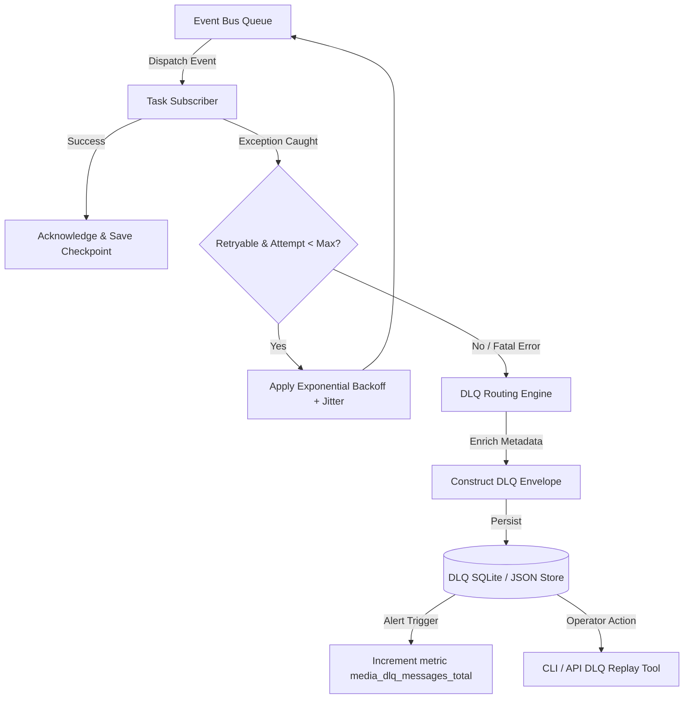

# Technical Specification Report: Resiliency, Fault Tolerance & Operational Observability
**Phase 13 Media Production Platform Architecture**

**Author:** Explorer 3 (Resiliency & Monitoring Specialist)  
**Target System:** Automated DSA Educational YouTube Video Pipeline (Phase 13)  
**Target Environment:** Intel Core Ultra 7 155H · Ubuntu 25.10 LTS · Python 3.12 · Intel Arc GPU / AI Boost NPU  
**Document Version:** 1.0.0  
**Date:** July 23, 2026  
**Status:** Architectural Specification  

---

## Table of Contents

1. [Executive Summary & Architectural Context](#1-executive-summary--architectural-context)
2. [Resiliency & Fault Tolerance Architecture](#2-resiliency--fault-tolerance-architecture)
   - 2.1 [Exponential Backoff with Jitter & Circuit Breaker Pattern](#21-exponential-backoff-with-jitter--circuit-breaker-pattern)
   - 2.2 [Dead Letter Queue (DLQ) Strategy](#22-dead-letter-queue-dlq-strategy)
   - 2.3 [Step Checkpointing & Resume Capabilities for Manim/FFmpeg](#23-step-checkpointing--resume-capabilities-for-manimffmpeg)
   - 2.4 [Fallback Execution Strategies & Graceful Degradation](#24-fallback-execution-strategies--graceful-degradation)
3. [Operational Observability & Monitoring Specification](#3-operational-observability--monitoring-specification)
   - 3.1 [Prometheus Metrics Specification](#31-prometheus-metrics-specification)
   - 3.2 [OpenTelemetry Tracing Specification](#32-opentelemetry-tracing-specification)
   - 3.3 [Health Probes, Readiness Checks & System Resource Monitoring](#33-health-probes-readiness-checks--system-resource-monitoring)
4. [Integration with Core Pipeline & Event-Driven Engine](#4-integration-with-core-pipeline--event-driven-engine)
5. [Verification & Compliance Blueprint](#5-verification--compliance-blueprint)

---

## 1. Executive Summary & Architectural Context

The Phase 13 Media Production Platform is an automated, event-driven batch processing system designed to turn algorithm problem specifications into high-production-quality educational YouTube videos. As detailed in `02_Project_Architecture.md`, `10_Event_Driven_Architecture.md`, and `11_Workflow_Engine.md`, the platform combines asynchronous Event Bus mediation with declarative Workflow Engine execution, orchestrating heavy local AI models (Kokoro-82M TTS on NPU/CPU), GPU-accelerated code rendering (Manim Community), complex audio/video muxing (FFmpeg), and external Cloud APIs (Gemini LLM/Embeddings, LeetCode GraphQL, YouTube Data API v3).

Given the long-running nature of video generation (rendering a single problem video requires 3–15 minutes of intensive compute across CPU, GPU, NPU, and network I/O), system stability, fault tolerance, and comprehensive observability are critical. A failure mid-way through a 10-section render must not waste previously computed assets or silently crash the pipeline.

This specification provides the production-grade architectural design for:
1. **Resiliency & Fault Tolerance**: Retry policies with jitter, circuit breakers, Dead Letter Queues (DLQ) for unrecoverable media events, segment-level hashing and checkpointing for Manim/FFmpeg, and multi-tier execution fallbacks.
2. **Operational Observability**: Prometheus metric instrumentation, OpenTelemetry W3C distributed trace propagation across the Event Bus and task workers, and health probes paired with hardware resource monitoring (CPU/GPU/NPU/RAM/Disk I/O).

---

## 2. Resiliency & Fault Tolerance Architecture

### 2.1 Exponential Backoff with Jitter & Circuit Breaker Pattern

#### 2.1.1 Mathematical Backoff Model with Jitter

Network requests to external APIs (Gemini, LeetCode, YouTube) and local asynchronous worker dispatches are subject to transient failures (rate limits, HTTP 503/504, temporary socket exhaustion). Naive exponential backoff without random variance can trigger "thundering herd" collisions when retrying concurrent tasks.

We adopt the **Decorrelated Jitter** backoff algorithm for API calls and the **Full Jitter** backoff algorithm for queued rendering re-tries.

1. **Full Jitter Formula**:
   $$T_{\text{sleep}} = \text{random\_uniform}(0, \min(T_{\text{max}}, T_{\text{base}} \cdot 2^{\text{attempt}}))$$

2. **Decorrelated Jitter Formula**:
   $$T_{\text{sleep}} = \min(T_{\text{max}}, \text{random\_uniform}(T_{\text{base}}, T_{\text{sleep\_previous}} \cdot 3))$$

```python
# src/core/retry.py
import asyncio
import random
import math
from typing import TypeVar, Callable, Any
from functools import wraps

T = TypeVar("T")

def exponential_backoff_with_jitter(
    max_attempts: int = 3,
    initial_delay: float = 1.0,
    max_delay: float = 60.0,
    backoff_factor: float = 2.0,
    jitter_type: str = "full",  # "full" or "decorrelated"
    retryable_exceptions: tuple[type[Exception], ...] = (Exception,),
):
    def decorator(func: Callable[..., Any]) -> Callable[..., Any]:
        @wraps(func)
        async def wrapper(*args: Any, **kwargs: Any) -> Any:
            attempt = 0
            current_delay = initial_delay
            while True:
                try:
                    return await func(*args, **kwargs)
                except retryable_exceptions as exc:
                    attempt += 1
                    if attempt >= max_attempts:
                        raise exc
                    
                    if jitter_type == "full":
                        calculated = min(max_delay, initial_delay * (backoff_factor ** attempt))
                        sleep_time = random.uniform(0, calculated)
                    elif jitter_type == "decorrelated":
                        sleep_time = min(max_delay, random.uniform(initial_delay, current_delay * 3.0))
                        current_delay = sleep_time
                    else:
                        sleep_time = min(max_delay, initial_delay * (backoff_factor ** attempt))

                    await asyncio.sleep(sleep_time)
        return wrapper
    return decorator
```

#### 2.1.2 Error Classification Matrix

Errors are classified as either **Transient** (retryable) or **Permanent/Fatal** (non-retryable):

| Component / Subsystem | Transient Errors (Retryable) | Permanent Errors (Non-Retryable / Immediately Fatal) |
|---|---|---|
| **LeetCode Scraper** | HTTP 429 (Rate Limit), HTTP 500/502/503/504, Connection Timeout | `AuthenticationError` (ERR-SCR-001 - Expired Session Cookie), `ProblemNotFoundError` (ERR-SCR-002 - Invalid Slug) |
| **Gemini API (Tags/Script)** | HTTP 429 (ResourceExhausted), HTTP 500/503, API Timeout | `SchemaValidationError` (ERR-SCRP-001 - Invalid JSON structure after max repair attempts), `ContentFilterError` (Safety Trigger) |
| **RAG Engine** | Temporary ChromaDB lock contention, Gemini embedding rate limit | `IndexNotFoundError` (Missing vector store collection), Corrupted embedding file |
| **Kokoro TTS (Local)** | Temporary NPU device busy / memory lock | `ModelLoadError` (Missing model weights file), Unsupported phoneme set |
| **Manim Renderer** | GPU memory allocation spike (re-try with CPU fallback) | `SyntaxError` in scene code, Invalid `VisualParams` schema mismatch, Missing font dependencies |
| **FFmpeg Assembler** | Disk I/O transient lock, transient thread pool starvation | Missing source media files, Corrupted WAV/MP4 header, Invalid codec flags |
| **YouTube Upload** | Socket timeout, HTTP 500/502/503/504, Resumable upload chunk failure | `QuotaExceededError` (ERR-YTB-001 - Daily quota 10k units exhausted), Invalid OAuth refresh token |

#### 2.1.3 Module & Provider Retry Configurations

| Module / Operation | Initial Delay | Max Delay | Backoff Factor | Jitter Type | Max Retries | Retryable Conditions |
|---|---|---|---|---|---|---|
| **LeetCode Scraper** | 2.0s | 30.0s | 2.0 | Decorrelated | 3 | HTTP 429, 5xx, Timeout |
| **Gemini Tag Explorer** | 2.0s | 30.0s | 2.0 | Full | 3 | API Error 429/5xx, Timeout |
| **Gemini Script Generator** | 5.0s | 60.0s | 2.0 | Full | 3 | API Error 429/5xx, Timeout |
| **RAG Embedding Call** | 1.0s | 15.0s | 2.0 | Full | 3 | Rate limit 429 |
| **Kokoro TTS Inference** | 1.0s | 5.0s | 2.0 | Full | 2 | Device busy / NPU lock |
| **Manim Scene Render** | 2.0s | 10.0s | 2.0 | Full | 1 | Transient GPU/EGL initialization failure |
| **FFmpeg Audio/Video Mux**| 1.0s | 5.0s | 2.0 | Full | 2 | Subprocess launch error |
| **YouTube Upload** | 5.0s | 120.0s | 2.0 | Decorrelated | 5 | Network drop, 50x, Chunk upload reset |

#### 2.1.4 Circuit Breaker Pattern Specification

External service interactions (such as Gemini LLM calls or YouTube API) are protected by a stateful **Circuit Breaker** to prevent cascading failures and API account throttling.

```
       ┌────────────────────────┐
       │         CLOSED         │◄─────────────────────────┐
       │ (Normal Operation)     │                          │
       └───────────┬────────────┘                          │
                   │ Success Rate drops                    │ Success threshold
                   │ below 50% / Failure Count > 5         │ reached (e.g. 3 consecutive)
                   ▼                                       │
       ┌────────────────────────┐                 ┌────────┴──────────────┐
       │          OPEN          │                 │       HALF-OPEN       │
       │ (Calls fail-fast with  │────────────────►│ (Allow limited probe  │
       │  CircuitOpenException) │  Reset Timeout  │  requests: e.g. 3)    │
       └────────────────────────┘  expires (60s)  └───────────────────────┘
```

**State Specifications**:
- **CLOSED**: Requests flow normally. Failures are tracked in a sliding time window (60s). If failures exceed `failure_threshold` (e.g., 5 failures or >50% failure rate over 10 calls), state transitions to **OPEN**.
- **OPEN**: All requests immediately fail fast by raising `CircuitOpenError` without attempting network I/O. State remains OPEN for `reset_timeout_seconds` (default: 60 seconds).
- **HALF-OPEN**: After `reset_timeout_seconds` elapses, a single probe request is permitted. If `consecutive_successes` reaches 3, circuit resets to **CLOSED**. If any probe request fails, state reverts immediately to **OPEN** for another reset window.

```python
# src/core/circuit_breaker.py
import time
import asyncio
from enum import Enum
from src.core.exceptions import PipelineError

class CircuitState(str, Enum):
    CLOSED = "CLOSED"
    OPEN = "OPEN"
    HALF_OPEN = "HALF_OPEN"

class CircuitOpenError(PipelineError):
    """Raised when an operation is attempted while the circuit breaker is OPEN."""
    pass

class CircuitBreaker:
    def __init__(
        self,
        name: str,
        failure_threshold: int = 5,
        reset_timeout_seconds: float = 60.0,
        half_open_consecutive_successes: int = 3,
    ):
        self.name = name
        self.failure_threshold = failure_threshold
        self.reset_timeout_seconds = reset_timeout_seconds
        self.half_open_consecutive_successes = half_open_consecutive_successes
        
        self.state = CircuitState.CLOSED
        self.failure_count = 0
        self.success_count = 0
        self.last_state_change = time.time()

    async def __call__(self, func: Callable[..., Any], *args: Any, **kwargs: Any) -> Any:
        now = time.time()
        
        if self.state == CircuitState.OPEN:
            if now - self.last_state_change > self.reset_timeout_seconds:
                self.state = CircuitState.HALF_OPEN
                self.last_state_change = now
                self.success_count = 0
            else:
                raise CircuitOpenError(
                    error_id="ERR-CB-001",
                    user_message=f"Service '{self.name}' is temporarily unavailable due to repeated failures.",
                    dev_message=f"CircuitBreaker[{self.name}] is OPEN. Time until probe: {self.reset_timeout_seconds - (now - self.last_state_change):.1f}s"
                )

        try:
            result = await func(*args, **kwargs)
            if self.state == CircuitState.HALF_OPEN:
                self.success_count += 1
                if self.success_count >= self.half_open_consecutive_successes:
                    self.state = CircuitState.CLOSED
                    self.failure_count = 0
                    self.last_state_change = now
            elif self.state == CircuitState.CLOSED:
                self.failure_count = 0
            return result
        except Exception as exc:
            self.failure_count += 1
            if self.state in (CircuitState.CLOSED, CircuitState.HALF_OPEN):
                if self.failure_count >= self.failure_threshold or self.state == CircuitState.HALF_OPEN:
                    self.state = CircuitState.OPEN
                    self.last_state_change = now
            raise exc
```

---

### 2.2 Dead Letter Queue (DLQ) Strategy

#### 2.2.1 DLQ Purpose & Architecture

In an event-driven media production system (`10_Event_Driven_Architecture.md`), events such as `RENDER_ANIMATION_REQUESTED`, `SYNTHESIZE_VOICE_REQUESTED`, or `PUBLISH_VIDEO_REQUESTED` may fail unrecoverably (e.g. invalid script visual syntax, missing phonemes, corrupted media stream).

To prevent failing events from stalling the Event Bus queue or causing infinite retry loops, unrecoverable events are diverted to the **Dead Letter Queue (DLQ)**.



#### 2.2.2 DLQ Data Schema

Every event written to the DLQ is wrapped in a structured metadata envelope:

```python
# src/models/dlq.py
from dataclasses import dataclass, field
from datetime import datetime
from typing import Any
import uuid

@dataclass(frozen=True)
class DLQEnvelope:
    dlq_id: str                          # UUID for this DLQ entry
    event_id: str                        # Original event ID
    correlation_id: str                  # Correlation ID tracing back to pipeline run
    event_type: str                      # e.g., "RENDER_ANIMATION_REQUESTED"
    source_plugin: str                   # e.g., "AnimationPlugin"
    failed_at: datetime                  # UTC timestamp of failure
    failure_category: str                # e.g., "MANIM_SYNTAX_ERROR", "OPENVINO_OOM", "FFMPEG_MUX_FAILED"
    error_id: str                        # Standardized Error ID (e.g. ERR-ANI-001)
    error_message: str                   # Detailed exception message
    stack_trace: str                     # Formatted python stack trace
    retry_count: int                     # Number of retries attempted before DLQ routing
    original_payload: dict[str, Any]     # Complete serialized payload of failed event
    resolved: bool = False               # Resolution status for operator audit
    resolution_notes: str | None = None  # Manual override notes
```

#### 2.2.3 Storage Mechanism & Implementation

The DLQ engine persists messages to an isolated SQLite database (`data/dlq/dead_letter_queue.db`) to ensure atomicity, transaction safety, and quick querying, with fallback to JSON appending in `data/dlq/dlq_fallback.json` if SQLite disk lock occurs.

```python
# src/core/dlq.py
import sqlite3
import json
from pathlib import Path
from datetime import datetime, timezone
from src.models.dlq import DLQEnvelope

class DeadLetterQueueStore:
    def __init__(self, db_path: Path = Path("data/dlq/dead_letter_queue.db")):
        self.db_path = db_path
        self.db_path.parent.mkdir(parents=True, exist_ok=True)
        self._init_db()

    def _init_db(self) -> None:
        with sqlite3.connect(self.db_path) as conn:
            conn.execute("""
                CREATE TABLE IF NOT EXISTS dlq_messages (
                    dlq_id TEXT PRIMARY KEY,
                    event_id TEXT NOT NULL,
                    correlation_id TEXT NOT NULL,
                    event_type TEXT NOT NULL,
                    source_plugin TEXT NOT NULL,
                    failed_at TEXT NOT NULL,
                    failure_category TEXT NOT NULL,
                    error_id TEXT NOT NULL,
                    error_message TEXT NOT NULL,
                    stack_trace TEXT NOT NULL,
                    retry_count INTEGER NOT NULL,
                    original_payload TEXT NOT NULL,
                    resolved INTEGER NOT NULL DEFAULT 0,
                    resolution_notes TEXT
                )
            """)
            conn.execute("CREATE INDEX IF NOT EXISTS idx_dlq_corr ON dlq_messages(correlation_id)")
            conn.execute("CREATE INDEX IF NOT EXISTS idx_dlq_resolved ON dlq_messages(resolved)")

    def push(self, envelope: DLQEnvelope) -> None:
        with sqlite3.connect(self.db_path) as conn:
            conn.execute(
                """
                INSERT INTO dlq_messages (
                    dlq_id, event_id, correlation_id, event_type, source_plugin,
                    failed_at, failure_category, error_id, error_message, stack_trace,
                    retry_count, original_payload, resolved, resolution_notes
                ) VALUES (?, ?, ?, ?, ?, ?, ?, ?, ?, ?, ?, ?, ?, ?)
                """,
                (
                    envelope.dlq_id,
                    envelope.event_id,
                    envelope.correlation_id,
                    envelope.event_type,
                    envelope.source_plugin,
                    envelope.failed_at.isoformat(),
                    envelope.failure_category,
                    envelope.error_id,
                    envelope.error_message,
                    envelope.stack_trace,
                    envelope.retry_count,
                    json.dumps(envelope.original_payload),
                    1 if envelope.resolved else 0,
                    envelope.resolution_notes,
                ),
            )

    def list_unresolved(self) -> list[dict[str, Any]]:
        with sqlite3.connect(self.db_path) as conn:
            conn.row_factory = sqlite3.Row
            cursor = conn.execute("SELECT * FROM dlq_messages WHERE resolved = 0 ORDER BY failed_at DESC")
            return [dict(row) for row in cursor.fetchall()]

    def mark_resolved(self, dlq_id: str, notes: str) -> None:
        with sqlite3.connect(self.db_path) as conn:
            conn.execute(
                "UPDATE dlq_messages SET resolved = 1, resolution_notes = ? WHERE dlq_id = ?",
                (notes, dlq_id),
            )
```

#### 2.2.4 Operational DLQ Management & Replay CLI

Operators manage DLQ messages using the pipeline CLI (`python -m src.cli.dlq`):

- **Inspection**: `python -m src.cli.dlq list --unresolved`
- **Payload Inspection**: `python -m src.cli.dlq show <dlq_id>`
- **Replay**: `python -m src.cli.dlq replay <dlq_id>` — Extracts `original_payload`, validates schema, and re-publishes event directly back onto the Event Bus with an incremented re-attempt correlation flag.
- **Discard**: `python -m src.cli.dlq discard <dlq_id> --reason "Known invalid prompt schema"`

---

### 2.3 Step Checkpointing & Resume Capabilities for Manim/FFmpeg

#### 2.3.1 Granular Scene-Level & Segment-Level Persistence

A 10-section video script produces 10 separate voice WAV files and 10 separate Manim MP4 section renders before FFmpeg stitches them into `final.mp4`. Rendering Manim scenes (e.g., complex graph visualizations or code animations) is compute-heavy (30s to 3 minutes per section).

If section 8 of 10 fails or process crashes on section 9, re-rendering sections 1 to 7 is an unacceptable resource drain.

```
Script (10 Sections)
  │
  ├── Section 01 ──► Render WAV [hash_01] ──► Render MP4 [hash_01] ──► Cached OK
  ├── Section 02 ──► Render WAV [hash_02] ──► Render MP4 [hash_02] ──► Cached OK
  ├── Section 03 ──► Render WAV [hash_03] ──► Render MP4 [hash_03] ──► Cached OK
  ├── ...
  ├── Section 08 ──► Process Crash / OOM ! ──► RESUME TRIGGERED
  └── Section 09 ──► Pending
```

#### 2.3.2 Deterministic Segment Hashing Algorithm

To guarantee cache freshness and prevent stale clip usage, each section render clip is bound to a **Segment Hash** calculated using SHA-256 over all inputs that influence rendering:

$$\text{SegmentHash} = \text{SHA256}\Big(\text{section\_id} + \text{narration\_text} + \text{visual\_params\_json} + \text{audio\_duration\_seconds} + \text{manim\_theme\_version}\Big)$$

```python
# src/animation/cache.py
import hashlib
import json
from typing import Any
from src.models.script import ScriptSection

def compute_segment_hash(
    section: ScriptSection,
    audio_duration_seconds: float,
    theme_version: str = "v1.0"
) -> str:
    hasher = hashlib.sha256()
    hasher.update(section.section_id.encode("utf-8"))
    hasher.update(section.narration.encode("utf-8"))
    
    # Serialize visual params cleanly
    params_dict = getattr(section.visual_params, "__dict__", {})
    hasher.update(json.dumps(params_dict, sort_keys=True).encode("utf-8"))
    hasher.update(f"{audio_duration_seconds:.3f}".encode("utf-8"))
    hasher.update(theme_version.encode("utf-8"))
    return hasher.hexdigest()[:16]
```

#### 2.3.3 `render_manifest.json` Specification

For each problem slug, the animation renderer and video assembler maintain `data/animation/{slug}/render_manifest.json`:

```json
{
  "slug": "two-sum",
  "updated_at": "2026-07-23T12:45:00Z",
  "sections": {
    "section_01_hook": {
      "section_id": "section_01_hook",
      "segment_hash": "a1b2c3d4e5f67890",
      "audio_path": "data/voice/two-sum/section_01_hook.wav",
      "audio_duration_seconds": 12.45,
      "video_clip_path": "data/animation/two-sum/section_01_hook.mp4",
      "status": "COMPLETED",
      "rendered_at": "2026-07-23T12:41:10Z"
    },
    "section_02_problem_statement": {
      "section_id": "section_02_problem_statement",
      "segment_hash": "f9e8d7c6b5a43210",
      "audio_path": "data/voice/two-sum/section_02_problem_statement.wav",
      "audio_duration_seconds": 25.10,
      "video_clip_path": "data/animation/two-sum/section_02_problem_statement.mp4",
      "status": "COMPLETED",
      "rendered_at": "2026-07-23T12:42:30Z"
    },
    "section_08_code_walkthrough": {
      "section_id": "section_08_code_walkthrough",
      "segment_hash": "1234567890abcdef",
      "audio_path": "data/voice/two-sum/section_08_code_walkthrough.wav",
      "audio_duration_seconds": 45.20,
      "video_clip_path": null,
      "status": "FAILED",
      "error_message": "Manim scene execution timed out after 300s",
      "rendered_at": null
    }
  },
  "assembly_manifest": {
    "concatenated_raw_mp4": "data/output/two-sum/raw_concat.mp4",
    "normalized_audio_mp4": "data/output/two-sum/final.mp4",
    "thumbnail_path": "data/output/two-sum/thumbnail.png",
    "assembly_status": "PENDING"
  }
}
```

#### 2.3.4 Interruption & Crash Recovery Protocol

1. **On Task Entry**: `ManimAnimationRenderer.render()` loads `render_manifest.json` for the given slug if it exists.
2. **Per Section Check**: For each section in `VideoScript`:
   - Calculate current `segment_hash`.
   - If manifest has entry with matching `segment_hash` AND `status == "COMPLETED"` AND clip file exists on disk, **skip rendering** and re-use existing clip.
   - If manifest entry is missing, hash mismatch (script updated), or status `FAILED`, trigger rendering.
3. **Graceful Handling of `SIGINT` / Cancellation**:
   - Signal handler captures `SIGINT` (Ctrl+C).
   - Finishes writing current section manifest state (marking in-progress section as `INTERRUPTED`).
   - Saves checkpoint JSON and exits cleanly.

---

### 2.4 Fallback Execution Strategies & Graceful Degradation

To enforce operational continuity, primary execution engines are backed by multi-tier fallback chains.

```
                       ┌───────────────────────────────┐
                       │ Primary Execution Engine      │
                       │ (Kokoro NPU / Manim Full)     │
                       └───────────────┬───────────────┘
                                       │ Failure / Crash
                                       ▼
                       ┌───────────────────────────────┐
                       │ Tier-1 Fallback               │
                       │ (Kokoro CPU / Simplified Manim│
                       └───────────────┬───────────────┘
                                       │ Failure / Crash
                                       ▼
                       ┌───────────────────────────────┐
                       │ Tier-2 Fallback               │
                       │ (Coqui TTS / Static Slides)   │
                       └───────────────┬───────────────┘
                                       │ Failure / Crash
                                       ▼
                       ┌───────────────────────────────┐
                       │ Graceful Degradation Payload  │
                       │ (Baseline Default Object)     │
                       └───────────────────────────────┘
```

#### 2.4.1 Voice TTS Generation Fallback Strategy

Kokoro-82M synthesized via OpenVINO is the primary local voice engine.

```python
# src/voice/synthesizer_fallback.py
import structlog
from pathlib import Path
from src.models.voice import VoiceResult, SectionAudio
from src.core.exceptions import VoiceSynthesisError

logger = structlog.get_logger(__name__)

class RobustVoiceSynthesizer:
    def __init__(self, primary_kokoro, fallback_coqui=None, fallback_edgetts=None):
        self.primary_kokoro = primary_kokoro
        self.fallback_coqui = fallback_coqui
        self.fallback_edgetts = fallback_edgetts

    async def synthesize_section(self, section_id: str, text: str, output_path: Path) -> float:
        # Tier 0: Primary Kokoro-82M OpenVINO (NPU/GPU offload)
        try:
            logger.info("Attempting TTS synthesis via Kokoro OpenVINO", section_id=section_id)
            return await self.primary_kokoro.synthesize(text, output_path)
        except Exception as e0:
            logger.warning("Primary Kokoro OpenVINO TTS failed, trying Kokoro CPU mode", section_id=section_id, error=str(e0))
        
        # Tier 1: Kokoro-82M PyTorch / ONNX CPU execution
        try:
            return await self.primary_kokoro.synthesize_cpu_fallback(text, output_path)
        except Exception as e1:
            logger.warning("Kokoro CPU TTS failed, trying Coqui local TTS", section_id=section_id, error=str(e1))

        # Tier 2: Coqui TTS local engine
        if self.fallback_coqui:
            try:
                return await self.fallback_coqui.synthesize(text, output_path)
            except Exception as e2:
                logger.warning("Coqui TTS failed, trying Edge-TTS cloud fallback", section_id=section_id, error=str(e2))

        # Tier 3: Edge-TTS / System Espeak-NG
        if self.fallback_edgetts:
            try:
                return await self.fallback_edgetts.synthesize(text, output_path)
            except Exception as e3:
                logger.error("All TTS fallbacks exhausted", section_id=section_id, error=str(e3))

        raise VoiceSynthesisError(
            error_id="ERR-VOC-001",
            user_message=f"Voice synthesis failed for section '{section_id}' across all available TTS providers.",
            dev_message="Primary and fallback TTS engines failed."
        )
```

#### 2.4.2 Animation Renderer Fallback Strategy

Manim scene rendering executes complex Python code and OpenGL/Cairo pipelines. If a specific section crashes (e.g., due to mathematical edge cases or invalid geometry params), the renderer falls back gracefully:

1. **Primary**: Render full programmatic Manim scene using `visual_params`.
2. **Tier-1 Fallback**: Render simplified Manim Template Scene (e.g. `GenericTitleSubtitleScene` displaying key point text cards without complex data structure animations).
3. **Tier-2 Fallback (Static Slide Generator)**: Render static slide PNG images using Pillow (`PIL.ImageDraw`) styled with dark mode theme and convert into an MP4 clip using FFmpeg (`ffmpeg -loop 1 -i slide.png -t duration -c:v libx264 -pix_fmt yuv420p output.mp4`).

```python
# src/animation/static_slide_fallback.py
from PIL import Image, ImageDraw, ImageFont
import subprocess
from pathlib import Path

def generate_static_slide_clip(
    title: str,
    key_points: list[str],
    duration_seconds: float,
    output_mp4_path: Path,
    resolution: tuple[int, int] = (1920, 1080),
    bg_color: str = "#0f0f23",
    text_color: str = "#ffffff"
) -> Path:
    # 1. Compose image with Pillow
    img = Image.new("RGB", resolution, color=bg_color)
    draw = ImageDraw.Draw(img)
    
    # Draw simple title and points
    draw.text((100, 100), title, fill="#4f8cff")
    y_offset = 250
    for point in key_points:
        draw.text((120, y_offset), f"• {point}", fill=text_color)
        y_offset += 80
        
    png_path = output_mp4_path.with_suffix(".png")
    img.save(png_path)
    
    # 2. Render MP4 with FFmpeg
    cmd = [
        "ffmpeg", "-y", "-loop", "1",
        "-i", str(png_path),
        "-t", f"{duration_seconds:.2f}",
        "-c:v", "libx264", "-pix_fmt", "yuv420p", "-r", "30",
        str(output_mp4_path)
    ]
    subprocess.run(cmd, check=True, stdout=subprocess.DEVNULL, stderr=subprocess.DEVNULL)
    return output_mp4_path
```

#### 2.4.3 RAG & Tag Explorer Fallback Objects

As specified in `Phase01/05_Error_Handling.md`, Non-Critical modules return fallback instances so downstream generation proceeds:

- **Tag Explorer Fallback**: Returns `TagKnowledge.empty()`:
  `primary_pattern="General Algorithmic Solution"`, `pattern_family="General"`, `prerequisites=[]`, `animation_style=AnimationStyle.GENERIC`.
- **RAG Engine Fallback**: Returns `RAGContext.empty()`:
  `chunks=[]`, `retrieval_time_ms=0.0`.
- **LLM Script Generator Fallback**: Primary Gemini 2.5 Flash $\rightarrow$ Secondary LLM (Gemini 1.5 Pro / local Ollama model) $\rightarrow$ Rule-based script template generator.

---

## 3. Operational Observability & Monitoring Specification

### 3.1 Prometheus Metrics Specification

#### 3.1.1 Metric Naming Conventions & Inventory

All system metrics use the standardized prefix `media_pipeline_`.

| Metric Name | Metric Type | Labels | Description / Help String |
|---|---|---|---|
| `media_pipeline_runs_total` | Counter | `status` (COMPLETED, FAILED, PARTIAL_FAILURE), `difficulty` | Total count of pipeline execution runs |
| `media_pipeline_errors_total` | Counter | `error_id`, `module`, `failure_type`, `is_critical` | Total count of errors caught across all modules |
| `media_render_duration_seconds` | Histogram | `slug`, `section_id`, `scene_type` | Time taken to render individual Manim animation scenes |
| `media_voice_duration_seconds` | Histogram | `slug`, `section_id`, `provider` | Time taken for TTS voice synthesis per section |
| `media_ffmpeg_merge_duration_seconds` | Histogram | `slug`, `stage` (mux, concat, normalize) | Time spent in FFmpeg video assembly stages |
| `media_api_request_duration_seconds` | Histogram | `provider` (gemini, leetcode, youtube), `endpoint` | Latency of external HTTP/gRPC API requests |
| `media_api_errors_total` | Counter | `provider`, `status_code`, `error_type` | Rate of external API errors (e.g. 429 rate limit) |
| `media_queue_depth` | Gauge | `queue_name` (event_bus_priority_0, priority_5, dlq) | Current count of pending events in queues |
| `media_dlq_messages_total` | Gauge | `failure_category` | Current unresolved message count in Dead Letter Queue |
| `media_checkpoint_restores_total` | Counter | `slug`, `resumed_module` | Count of pipeline runs resumed from intermediate checkpoints |
| `media_fallback_triggers_total` | Counter | `module`, `fallback_tier` | Number of times fallback execution paths were triggered |
| `media_system_cpu_usage_percent` | Gauge | `core` | Host CPU utilization percentage |
| `media_system_memory_bytes` | Gauge | `type` (used, free, swap) | Host RAM system memory usage in bytes |
| `media_system_gpu_npu_utilization_percent` | Gauge | `device` (intel_arc_gpu, intel_npu) | Intel Arc GPU and AI Boost NPU utilization % |
| `media_system_disk_free_bytes` | Gauge | `path` | Available disk storage space on local SSD |

#### 3.1.2 Histogram Bucket Distributions

- **`media_render_duration_seconds`**: `[1.0, 5.0, 10.0, 30.0, 60.0, 120.0, 300.0, 600.0]` (Manim renders range from quick titles to 5-minute scenes).
- **`media_voice_duration_seconds`**: `[0.5, 1.0, 2.5, 5.0, 10.0, 30.0, 60.0]` (Kokoro TTS handles section sentences quickly).
- **`media_ffmpeg_merge_duration_seconds`**: `[1.0, 5.0, 15.0, 30.0, 60.0, 180.0]` (FFmpeg concatenation and LUFS loudness normalization).
- **`media_api_request_duration_seconds`**: `[0.1, 0.25, 0.5, 1.0, 2.5, 5.0, 10.0, 30.0]`.

#### 3.1.3 Prometheus Exporter Architecture (`src/monitoring/metrics.py`)

```python
# src/monitoring/metrics.py
from prometheus_client import Counter, Gauge, Histogram, start_http_server

# Pipeline Execution Metrics
RUNS_TOTAL = Counter(
    "media_pipeline_runs_total",
    "Total count of pipeline execution runs",
    ["status", "difficulty"]
)

ERRORS_TOTAL = Counter(
    "media_pipeline_errors_total",
    "Total count of errors caught across all modules",
    ["error_id", "module", "failure_type", "is_critical"]
)

# Duration Histograms
RENDER_DURATION = Histogram(
    "media_render_duration_seconds",
    "Time taken to render individual Manim animation scenes",
    ["section_id", "scene_type"],
    buckets=[1.0, 5.0, 10.0, 30.0, 60.0, 120.0, 300.0, 600.0]
)

VOICE_DURATION = Histogram(
    "media_voice_duration_seconds",
    "Time taken for TTS voice synthesis per section",
    ["section_id", "provider"],
    buckets=[0.5, 1.0, 2.5, 5.0, 10.0, 30.0, 60.0]
)

FFMPEG_DURATION = Histogram(
    "media_ffmpeg_merge_duration_seconds",
    "Time spent in FFmpeg video assembly stages",
    ["stage"],
    buckets=[1.0, 5.0, 15.0, 30.0, 60.0, 180.0]
)

API_DURATION = Histogram(
    "media_api_request_duration_seconds",
    "Latency of external HTTP/gRPC API requests",
    ["provider", "endpoint"],
    buckets=[0.1, 0.25, 0.5, 1.0, 2.5, 5.0, 10.0, 30.0]
)

# Queue & System Gauges
QUEUE_DEPTH = Gauge(
    "media_queue_depth",
    "Current count of pending events in queues",
    ["queue_name"]
)

DLQ_COUNT = Gauge(
    "media_dlq_messages_total",
    "Current unresolved message count in Dead Letter Queue",
    ["failure_category"]
)

FALLBACK_TRIGGERS = Counter(
    "media_fallback_triggers_total",
    "Number of times fallback execution paths were triggered",
    ["module", "fallback_tier"]
)

def start_metrics_server(port: int = 8000) -> None:
    """Starts Prometheus metrics HTTP endpoint at /metrics."""
    start_http_server(port)
```

---

### 3.2 OpenTelemetry Tracing Specification

#### 3.2.1 W3C TraceContext Propagation Standard

To trace a video generation end-to-end across asynchronous tasks and event dispatch loops, the system implements the **W3C TraceContext** standard (`traceparent` header format):

$$\text{traceparent} = \texttt{00-}\{\text{4a96719b028114... (32 hex trace\_id)}\}\texttt{-}\{\text{00f067aa0ba902b7 (16 hex parent\_span\_id)}\}\texttt{-01}$$

- Every event published to the Event Bus (`10_Event_Driven_Architecture.md`) carries `traceparent` and `correlation_id` within its metadata header.
- Subscribing plugins extract `traceparent` to create child spans under the parent trace context.

#### 3.2.2 End-to-End Span Hierarchy

```
[Trace: pipeline_run_id = "run_20260723_two-sum"]
  │
  ├── Span: workflow.execute (Root) [slug: "two-sum"]
  │     │
  │     ├── Span: scraper.fetch [slug: "two-sum"]
  │     │     └── Event: "leetcode.graphql.request"
  │     │
  │     ├── Span: tags.explore [slug: "two-sum"]
  │     │     └── Event: "gemini.api.request"
  │     │
  │     ├── Span: rag.retrieve [slug: "two-sum"]
  │     │     └── Event: "chromadb.vector_search"
  │     │
  │     ├── Span: script.generate [slug: "two-sum"]
  │     │     └── Event: "gemini.api.generate_content"
  │     │
  │     ├── Span: media_generation.parallel (Concurrency Group)
  │     │     │
  │     │     ├── Span: voice.synthesize_all
  │     │     │     ├── Span: voice.synthesize_section [section_id: "01_hook"]
  │     │     │     ├── Span: voice.synthesize_section [section_id: "02_problem"]
  │     │     │     └── ...
  │     │     │
  │     │     └── Span: animation.render_all
  │     │           ├── Span: animation.render_section [section_id: "01_hook"]
  │     │           ├── Span: animation.render_section [section_id: "02_problem"]
  │     │           └── ...
  │     │
  │     ├── Span: assembly.mux_and_concat
  │     │     ├── Span: ffmpeg.mux_sections
  │     │     └── Span: ffmpeg.normalize_lufs
  │     │
  │     └── Span: youtube.upload
  │           └── Span: youtube.resumable_upload_chunk
```

#### 3.2.3 OpenTelemetry Tracer Instrumentation (`src/monitoring/tracer.py`)

```python
# src/monitoring/tracer.py
from opentelemetry import trace
from opentelemetry.sdk.trace import TracerProvider
from opentelemetry.sdk.trace.export import BatchSpanProcessor
from opentelemetry.exporter.otlp.proto.grpc.trace_exporter import OTLPSpanExporter
from opentelemetry.trace.propagation.tracecontext import TraceContextTextMapPropagator
from opentelemetry.trace import Status, StatusCode

provider = TracerProvider()
processor = BatchSpanProcessor(OTLPSpanExporter(endpoint="localhost:4317", insecure=True))
provider.add_span_processor(processor)
trace.set_tracer_provider(provider)

tracer = trace.get_tracer("media_production_platform", "1.0.0")

def inject_trace_context(carrier: dict[str, str]) -> None:
    """Injects current span context into event metadata header dictionary."""
    TraceContextTextMapPropagator().inject(carrier)

def extract_trace_context(carrier: dict[str, str]):
    """Extracts span context from event metadata header dictionary."""
    return TraceContextTextMapPropagator().extract(carrier)
```

---

### 3.3 Health Probes, Readiness Checks & System Resource Monitoring

#### 3.3.1 Health Probe Endpoints

The pipeline exposes a lightweight HTTP server (`src/monitoring/health.py`) running on port `8080` to provide container and orchestration probes:

1. **Liveness Probe (`GET /health/live`)**:
   - **Checks**: Async event loop is non-blocking, worker process is alive.
   - **Response**: HTTP 200 `{"status": "UP", "timestamp": "2026-07-23T12:45:00Z"}`.
   - **Failure**: HTTP 503 if event loop lag exceeds 5 seconds.

2. **Readiness Probe (`GET /health/ready`)**:
   - **Checks**:
     - System SSD disk free space $> 10\text{ GB}$.
     - Kokoro TTS OpenVINO model weights loaded in memory/NPU.
     - System `ffmpeg` binary available in `PATH`.
     - Required API key (`GEMINI_API_KEY`) present in environment.
   - **Response**: HTTP 200 `{"status": "READY", "checks": {"disk": "OK", "model": "OK", "ffmpeg": "OK"}}`.
   - **Failure**: HTTP 503 `{"status": "NOT_READY", "reason": "Disk space low (4.2GB remaining)"}`.

#### 3.3.2 System Hardware Resource Monitoring

A background thread (`src/monitoring/resource_monitor.py`) polls system metrics every 15 seconds:

- **CPU Utilization**: Standard `psutil.cpu_percent(percpu=True)` updated to Prometheus `media_system_cpu_usage_percent`.
- **RAM Memory Pressure**: Track RSS memory and swap usage via `psutil.virtual_memory()`.
- **Intel Arc GPU & AI Boost NPU**: Monitored using Intel `sysman` / `intel-gpu-top` / `openvino` runtime stats, logging memory allocation and core utilization.
- **Disk I/O & SSD Capacity**: Tracks free bytes on `data/` volume.

#### 3.3.3 Prometheus Alertmanager Rules (`config/alerts.yaml`)

```yaml
# config/alerts.yaml — Prometheus Alerting Rules
groups:
  - name: media_pipeline_alerts
    rules:
      - alert: CriticalPipelineFailure
        expr: rate(media_pipeline_errors_total{is_critical="true"}[5m]) > 0
        for: 1m
        labels:
          severity: critical
        annotations:
          summary: "Critical module error detected in pipeline"
          description: "Module {{ $labels.module }} raised critical error {{ $labels.error_id }}."

      - alert: HighDLQDepth
        expr: media_dlq_messages_total > 5
        for: 2m
        labels:
          severity: warning
        annotations:
          summary: "Dead Letter Queue accumulating messages"
          description: "DLQ has {{ $value }} unresolved failed media messages."

      - alert: LowDiskSpaceWarning
        expr: media_system_disk_free_bytes / 1024 / 1024 / 1024 < 15
        for: 2m
        labels:
          severity: warning
        annotations:
          summary: "SSD Storage space low"
          description: "Remaining SSD space is only {{ $value }} GB."

      - alert: NPUHardwareThrottling
        expr: media_system_gpu_npu_utilization_percent{device="intel_npu"} > 95
        for: 10m
        labels:
          severity: warning
        annotations:
          summary: "Intel NPU under sustained high load"
          description: "NPU utilization at {{ $value }}% for over 10 minutes."
```

---

## 4. Integration with Core Pipeline & Event-Driven Engine

### 4.1 Topology Alignment

This Resiliency & Monitoring specification integrates directly into the existing architecture:

1. **Event Bus Integration (`10_Event_Driven_Architecture.md`)**:
   - Event Bus subscriber dispatch wrapped with `CircuitBreaker` and `exponential_backoff_with_jitter`.
   - Failed events exceeding retry count are caught by Event Bus error hook and routed to `DeadLetterQueueStore`.
   - Event metadata extended to carry `traceparent` and `correlation_id`.

2. **Workflow Engine Integration (`11_Workflow_Engine.md`)**:
   - Task execution state machine updated to support `CHECKPOINT_PAUSED`, checking `render_manifest.json` before executing tasks.
   - SAGA rollback handlers trigger cleanup of partial segment clips when tasks fail unrecoverably.

3. **Shared Core Services (`src/core/`)**:
   - New modules added: `src/core/circuit_breaker.py`, `src/core/dlq.py`, `src/monitoring/metrics.py`, `src/monitoring/tracer.py`, `src/monitoring/health.py`.

---

## 5. Verification & Compliance Blueprint

To verify this specification independently, the following methods and test suites must be executed:

### 5.1 Verification Commands

```bash
# 1. Run unit test suite for resiliency components
pytest tests/test_core/test_retry.py tests/test_core/test_circuit_breaker.py tests/test_core/test_dlq.py

# 2. Verify Segment Hash calculation determinism
pytest tests/test_animation/test_cache.py -k "test_segment_hash_determinism"

# 3. Test Prometheus metrics endpoint
curl -s http://localhost:8000/metrics | grep media_pipeline

# 4. Check Health Probes
curl -s http://localhost:8080/health/live
curl -s http://localhost:8080/health/ready
```

### 5.2 Fault Injection & Verification Scenarios

1. **API Outage Simulation**: Inject mock 429 and 503 HTTP responses to Gemini client. Verify exponential backoff delays with random jitter, verify Circuit Breaker transitions to `OPEN` state after 5 failures, and verify fast-fail behavior.
2. **Media Render Crash Simulation**: Inject a synthetic Python exception into section 5 of Manim renderer. Verify that sections 1–4 are cached in `render_manifest.json`, section 5 is logged to DLQ, and restarting pipeline resumes cleanly at section 5 without re-rendering sections 1–4.
3. **TTS Hardware Fallback Test**: Disable OpenVINO NPU device context mock. Verify automatic fallback to PyTorch CPU TTS, incrementing metric `media_fallback_triggers_total{module="voice", fallback_tier="cpu"}`.
