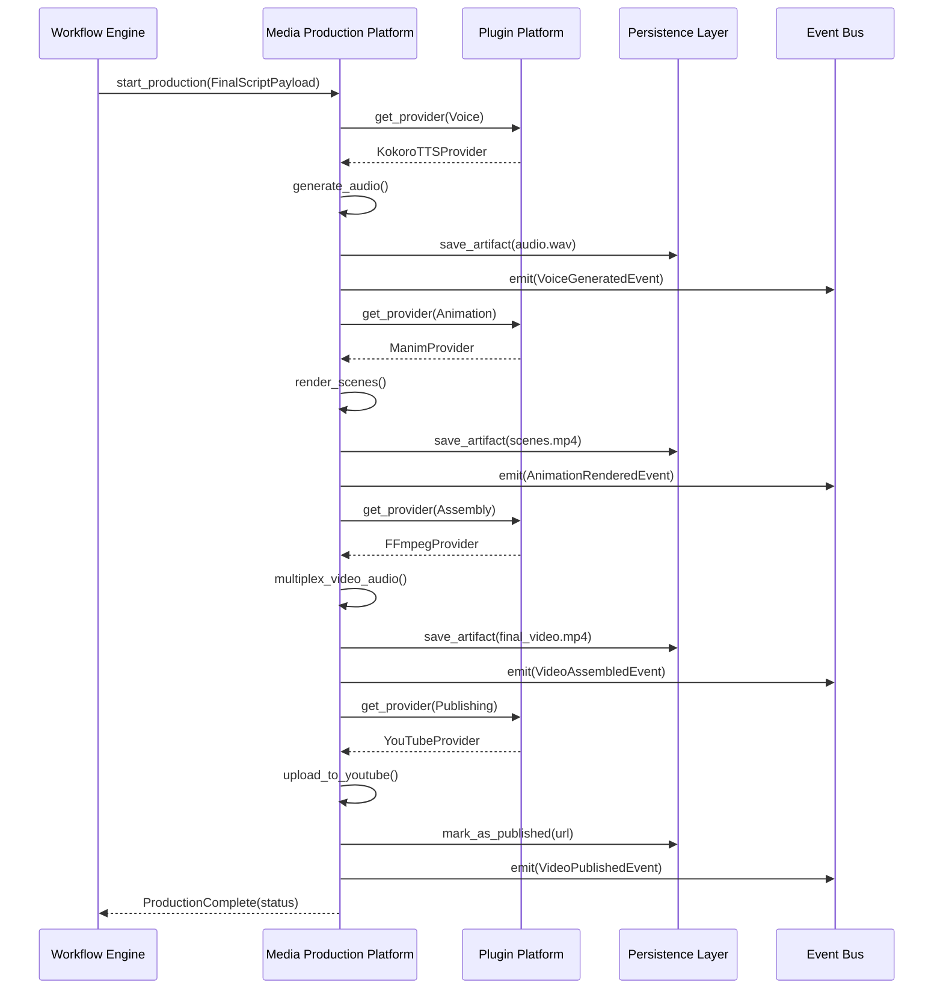

# Phase 13: Media Production Platform Architecture

**Author:** Principal Software Architect  
**Target System:** Automated DSA Educational YouTube Video Pipeline  
**Document Version:** 1.0.0  
**Status:** Design Phase

---

## 1. Executive Summary

Phase 13 introduces the **Media Production Platform**, the physical rendering engine of the DSA YouTube Pipeline. While Phase 12 generated the mathematical JSON blueprints (the "Script"), Phase 13 executes those blueprints, turning them into tangible `.mp4` files, `.srt` subtitles, and `.wav` audio tracks. 

The Media Production Platform adheres strictly to the canonical v2.0 synchronous batch-pipeline architecture. It integrates seamlessly with the Educational Content Platform (for payloads), the Plugin Platform (for dynamic media provider swapping), the Workflow Engine (for process orchestration), the Event Bus (for telemetry), and the Persistence Layer (for tracking artifacts).

---

## 2. Core Responsibilities

1.  **Voice Production:** Converts SSML-tagged narration plans into physical audio files using TTS engines (e.g., Kokoro, ElevenLabs).
2.  **Animation Production:** Converts semantic animation actions into rendered vector animations (e.g., via Manim).
3.  **Subtitle Generation:** Aligns generated audio with text to produce accurate `.srt` or `.vtt` subtitles.
4.  **Video Assembly:** Splices and multiplexes audio, video, and subtitles into the final `.mp4` deliverable using FFmpeg.
5.  **Thumbnail Generation:** Renders eye-catching, high-CTR YouTube thumbnails based on the educational blueprint.
6.  **Publishing:** Uploads the final packaged assets to YouTube via the Data API, applying titles, tags, and descriptions.
7.  **Artifact Tracking:** Registers all generated massive binaries (`.mp4`, `.wav`) in the Persistence Layer to ensure traceability and idempotency.

---

## 3. Architecture Diagrams

### 3.1 High-Level Component Diagram
```mermaid
graph TD
    %% External Platforms
    WP[Workflow Engine] --> |Orchestrates| MPP
    ECP[Educational Content Platform] --> |FinalScriptPayload| MPP
    PL[Persistence Layer] --> |Tracks Binary URIs| MPP
    EB[Event Bus] <-- |Telemetry/Metrics| MPP

    %% Media Production Platform
    subgraph MPP [Media Production Platform]
        direction TB
        OM[Orchestrator Module]
        
        %% Sub-Modules
        subgraph Providers [Plugin-Managed Providers]
            VP[Voice Provider <br/> e.g., Kokoro]
            AP[Animation Provider <br/> e.g., Manim]
            TP[Thumbnail Provider <br/> e.g., Pillow/StableDiffusion]
            VA[Video Assembly <br/> e.g., FFmpeg]
            SG[Subtitle Generator <br/> e.g., WhisperX]
            PUB[Publishing Provider <br/> e.g., YouTube API]
        end
        
        OM --> VP
        OM --> AP
        OM --> TP
        VP --> SG
        
        VP --> VA
        AP --> VA
        SG --> VA
        VA --> PUB
    end
```

### 3.2 Sequence Diagram: End-to-End Rendering


---

## 4. Resiliency, Extensibility, and Implementation Guidance

### 4.1 Interchangeable Providers (Extensibility)
The Media Production Platform relies heavily on the **Plugin Platform**. Generative AI moves incredibly fast; today's best TTS (Kokoro) might be obsolete tomorrow. 
*   **Implementation Guidance:** Define strict Python `typing.Protocol` interfaces for every domain (e.g., `VoiceProviderProtocol`, `AnimationProviderProtocol`). The main `MediaOrchestrator` must never import `Kokoro` directly. It asks the Plugin Platform for the registered `VoiceProviderProtocol` implementation. This allows zero-downtime swapping of media engines.

### 4.2 Retry & Recovery Mechanisms
Rendering video and synthesizing voice are computationally heavy and highly susceptible to Out-Of-Memory (OOM) kills or API timeouts.
*   **Idempotent Checkpoints:** Before rendering Scene 4, the platform queries the Persistence Layer. If `scene_4.mp4` already exists with the correct SHA-256 hash, it skips rendering. 
*   **Circuit Breakers:** If the YouTube API rate-limits the Publisher, the module raises a specific `RateLimitException`. The overarching Workflow Engine catches this and implements an exponential backoff retry queue.

### 4.3 Metrics and Monitoring
Because rendering costs GPU time, telemetry is vital for FinOps.
*   **Emitted Events:** `MediaRenderStarted`, `MediaRenderCompleted`, `MediaRenderFailed`.
*   **Tracked Metrics:** GPU utilization (if local), render time per scene (latency), API cost (if using external TTS like ElevenLabs).
*   **Implementation:** All telemetry is fire-and-forget to the Phase 04 `EventBus`. The daemon `MediaMonitor` listens to these events and accumulates metrics for Grafana.
