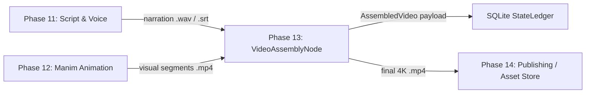
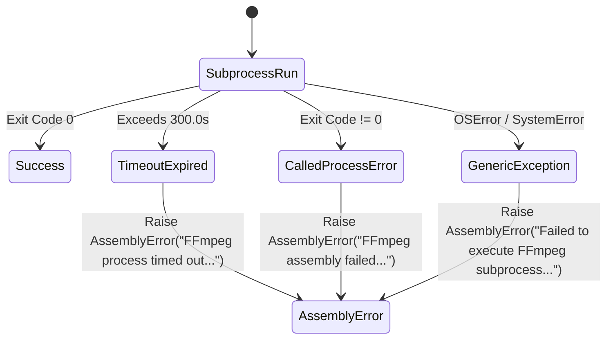
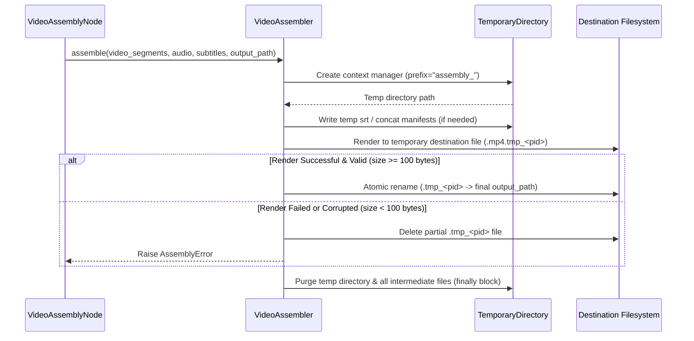

# Phase 13 Media Production: Video Assembly Architecture & Engineering Specification

## Executive Summary

Phase 13 (Media Production: Video Assembly) is responsible for taking intermediate media artifacts generated in upstream pipeline steps—specifically `.mp4` visual animation clips rendered by Manim in Phase 12 (`animation_generator`) and `.wav` narration audio / `.srt` subtitle files generated in Phase 11 (`voice_generator` / `script_generator`)—and compiling them into a final high-resolution 4K UHD YouTube video with hard-coded (burned-in) subtitles.

The subsystem consists of three core components:
1. `src/assembly/ffmpeg_commands.py`: Pure helper functions for constructing FFmpeg command argument arrays and filter graphs.
2. `src/assembly/assembler.py`: `VideoAssembler`, which executes FFmpeg securely via non-shell `subprocess.run()`, handles timeouts, prevents file descriptor leaks, and manages temporary file cleanup.
3. `src/pipeline/nodes/video_assembly_node.py`: `VideoAssemblyNode`, a subclass of `Node` (`src/core/workflow/node.py`), which orchestrates state ledger I/O, validates payloads against the `AssembledVideo` schema, and registers step completion.

---

## 1. Pipeline Position & State Ledger Contracts

### 1.1 Synchronous Batch Pipeline Positioning

`VideoAssemblyNode` operates as a synchronous node within the batch execution pipeline. It depends directly on prior step completions recorded in the SQLite `StateLedger`.



### 1.2 Input Ledger Contracts

`VideoAssemblyNode` queries the `StateLedger` for prior step outputs using `run_id`:

1. **`animation_generator` Step Output (Mandatory)**:
   - Must contain a `segments` list where each segment provides either `visual_path` or an `asset_references` item with `asset_type == "video"`.
   - Also provides `slug` (sanitized for file naming) and timing metadata (`duration`, `start_time`, `end_time`).

2. **`voice_generator` Step Output (Primary Audio Source)**:
   - `audio_path`: Path to combined spoken narration `.wav` file.
   - `subtitle_path`: Path to generated `.srt` or `.ass` subtitle file.

3. **`script_generator` Step Output (Fallback Audio/Subtitle Source)**:
   - If `voice_generator` is absent, reads `audio_path`, `subtitle_path`, or raw `srt_content` / `script.srt_content` from `script_generator`.

### 1.3 Output Ledger Contract (`AssembledVideo`)

Upon successful assembly, the node constructs and registers an `AssembledVideo` Pydantic model (`src/core/models/assets.py`) under step name `"video_assembly"`:

| Field Name | Type | Description |
|---|---|---|
| `slug` | `str` | Sanitized problem identifier (regex pattern: `^[a-z0-9-]+$`). |
| `final_video_path` | `str` | Absolute filesystem path to assembled 4K `.mp4` video artifact. |
| `total_duration_seconds` | `float` | Cumulative runtime of the assembled video in seconds (must be > 0). |
| `file_size_bytes` | `int` | Size of the final video file in bytes (validated `>= 100` bytes). |
| `segments` | `List[RenderSegment]` | List of segment manifests detailing video clips and asset references. |
| `assembled_at` | `str` | UTC ISO-8601 timestamp string of completion. |

---

## 2. FFmpeg Encoding Architecture & Parameters

### 2.1 4K Video Encoding Parameters

To ensure optimal playback quality and compatibility on YouTube across all devices, FFmpeg is configured with strict rendering flags:

| Parameter | Command Flag | Value / Specification | Engineering Rationale |
|---|---|---|---|
| **Target Resolution** | `-vf scale=...` | `3840x2160` (4K UHD) | YouTube recommended 4K standard (16:9 aspect ratio). |
| **Frame Rate** | `-r` | `30` FPS | Standard framerate for educational code walkthroughs. |
| **Video Codec** | `-c:v` | `libx264` | H.264 High Profile Level 5.1 for universal platform compatibility. |
| **Pixel Format** | `-pix_fmt` | `yuv420p` | Standard 8-bit 4:2:0 subsampling required for HTML5 browser rendering. |
| **Rate Control (CRF)** | `-crf` | `18` | Constant Rate Factor 18 yields visually lossless quality for 4K. |
| **Encoder Preset** | `-preset` | `medium` | Optimal balance between encoding speed and file compression. |
| **Overwrite Output** | `-y` | N/A | Automatically overwrites temporary destination files without prompting stdin. |

### 2.2 Audio Encoding Parameters

Audio streams are processed and multiplexed alongside the video track:

| Parameter | Command Flag | Value / Specification | Engineering Rationale |
|---|---|---|---|
| **Audio Codec** | `-c:a` | `aac` | Advanced Audio Coding standard for MP4 containers. |
| **Audio Bitrate** | `-b:a` | `384k` | High-fidelity stereo audio bitrate recommended by YouTube. |
| **Sample Rate** | `-ar` | `48000` Hz (48 kHz) | Standard audio sampling rate for video production. |
| **Channels** | `-ac` | `2` | Stereo 2-channel audio output. |

---

## 3. Filter Graphs & Complex Transformations

FFmpeg complex filter graphs (`-filter_complex`) handle multi-input scaling, aspect ratio padding, stream concatenation, audio resampling, and subtitle overlay in a single processing pass.

### 3.1 4K Scaling & Padding Filter

Input video clips generated by Manim or external sources may vary in initial resolution (e.g. 1080p vs 4K). Every input video stream `[i:v]` is normalized to 3840x2160 with pillarbox/letterbox padding and fixed sample aspect ratio (`setsar=1`):

```ini
[0:v]scale=3840:2160:force_original_aspect_ratio=decrease,pad=3840:2160:(ow-iw)/2:(oh-ih)/2,setsar=1[v0]
```

### 3.2 Segment Concatenation & Audio Resampling

Multiple visual clips are joined sequentially using the `concat` filter:
- **Video Streams**: `[v0][v1]...[vN-1]concat=n=N:v=1:a=0[v_concat]`
- **Audio Streams**: `[A:a][A+1:a]...concat=n=M:v=0:a=1,aresample=48000[a_out]` (where `A` is the starting audio input index).

### 3.3 Subtitle Burn-In Syntax & Path Escaping

Subtitles are burned directly into the video stream using the `subtitles` filter clause:

```ini
[v_concat]subtitles='<ESCAPED_PATH>':force_style='FontName=Sans,FontSize=28,PrimaryColour=&H00FFFFFF,OutlineColour=&H00000000,BorderStyle=1,Outline=2,Shadow=1,Alignment=2'[v_out]
```

#### Path Escaping Rules
FFmpeg's filter graph parser uses colons (`:`), single quotes (`'`), backslashes (`\`), and square brackets (`[` / `]`) as syntax delimiters. To prevent parsing errors, paths passed to filters must be escaped via `escape_ffmpeg_filter_path()`:

1. Backslash: `\` $\rightarrow$ `\\\\`
2. Colon: `:` $\rightarrow$ `\\:`
3. Single Quote: `'` $\rightarrow$ `\\'`
4. Open Bracket: `[` $\rightarrow$ `\\[`
5. Close Bracket: `]` $\rightarrow$ `\\]`

#### Subtitle Typography Style Specs

| Attribute | Value | Description |
|---|---|---|
| `FontName` | `Sans` | Clean sans-serif font for readability on high-res displays. |
| `FontSize` | `28` | Proportional font size optimized for 4K video rendering. |
| `PrimaryColour` | `&H00FFFFFF` | High-contrast white text color (ASS/SSA format). |
| `OutlineColour` | `&H00000000` | Black text outline. |
| `BorderStyle` | `1` | Outline + drop shadow style. |
| `Outline` | `2` | 2-pixel outline stroke width. |
| `Shadow` | `1` | 1-pixel drop shadow depth. |
| `Alignment` | `2` | Bottom-center text alignment. |

---

## 4. Secure Subprocess Execution & Resource Management

### 4.1 Secure Subprocess Isolation Guidelines

All FFmpeg process invocations in `VideoAssembler.run_command()` strictly adhere to security sandboxing guidelines:

1. **Non-Shell Execution (`shell=False`)**: Invocations pass explicit argument arrays (`List[str]`), eliminating shell command injection vulnerabilities.
2. **File Descriptor Control (`close_fds=True`)**: Child processes close all inherited file descriptors except standard streams, preventing file descriptor leaks across pipeline runs.
3. **Execution Timeout (`timeout=300.0`s)**: Subprocesses are subject to a strict 300-second wall-clock timeout limit. If exceeded, `subprocess.TimeoutExpired` is caught, the child process is terminated, and an `AssemblyError` is raised.
4. **Output Capture (`capture_output=True`, `text=True`)**: Standard output and standard error are captured as text strings without buffer overflow risks.

### 4.2 Error Mapping Matrix

Subprocess failures are mapped cleanly to domain exceptions:



### 4.3 Temporary Directory & File Cleanup Lifecycle

To prevent disk space exhaustion in high-throughput video rendering environments, intermediate assets follow a strict cleanup lifecycle:



1. **Context-Managed Temporary Directory**: Intermediate files (concat manifests, temporary `.srt` files) are written inside a `tempfile.TemporaryDirectory()`.
2. **Atomic Destination File Writing**: FFmpeg renders to an intermediate file named `{destination_path}.tmp_{os.getpid()}`.
3. **Output File Validation**: Before finalizing, `_is_valid_video()` verifies that the output file exists and is at least 100 bytes (`st_size >= 100`).
4. **Atomic Swap & Cleanup**: If valid, `os.replace()` atomically moves the temporary file to the final destination. On failure, the temporary file is unlinked in an `except` block and the working directory is purged by the `TemporaryDirectory` context manager.

---

## 5. Codebase Module Architecture

```
src/
├── assembly/
│   ├── __init__.py
│   ├── assembler.py          # VideoAssembler core execution engine
│   └── ffmpeg_commands.py    # Pure FFmpeg CLI command list builders
└── pipeline/
    └── nodes/
        └── video_assembly_node.py # VideoAssemblyNode workflow integration
```

### Component Responsibilities

1. `src/assembly/ffmpeg_commands.py`:
   - `escape_ffmpeg_filter_path()`: Escapes path string special characters.
   - `write_concat_file()`: Writes text manifest files for concat demuxing.
   - `build_4k_scale_filter()`: Generates 4K scale + pad filter string.
   - `build_subtitle_filter()`: Generates subtitle burn-in filter clause with typography parameters.
   - `build_concat_filter_graph()`: Constructs full complex filter graph string.
   - `build_assembly_command()`: Assembles full argument list `List[str]`.
   - `build_demuxer_assembly_command()`: Assembles argument list using demuxer manifests.

2. `src/assembly/assembler.py`:
   - `VideoAssembler`: Manages non-shell `subprocess.run()`, timeout handling, mock binary script support, output validation, and atomic temporary file cleanup.

3. `src/pipeline/nodes/video_assembly_node.py`:
   - `VideoAssemblyNode`: Subclass of `Node`. Interacts with `StateLedger` to extract upstream artifacts, executes `VideoAssembler`, validates output payload against `AssembledVideo` schema, and handles fallback segment repair.

---

## 6. Verification Test Matrix & Execution Instructions

### 6.1 Test Suite Breakdown (`tests/pipeline/test_assembly_node.py`)

The test suite contains 53 automated unit and integration tests organized into 4 logical sections:

| Category | Target Component | Coverage Focus | Test Count |
|---|---|---|---|
| **1. FFmpeg Command Builders** | `ffmpeg_commands.py` | Command list construction, 4K scale/pad filters, subtitle escaping, concat demuxer manifests, resolution strings, default values. | 13 |
| **2. Subprocess Execution & Core Assembler** | `assembler.py` | Non-shell subprocess execution, mock binary scripts, timeout handling, non-zero exit codes, output validation, empty paths. | 11 |
| **3. State Ledger Node Integration** | `video_assembly_node.py` | Step name property, missing ledger error, prior step outputs retrieval (`animation_generator`, `voice_generator`, `script_generator` fallback), payload validation against `AssembledVideo` Pydantic model. | 14 |
| **4. Extended Security & Sanitation** | All Modules | Security flags (`close_fds=True`, `shell=False`), file descriptor leak prevention (`/proc/self/fd`), temporary directory cleanup lifecycle on success/failure, top-level SRT string fallback. | 15 |

### 6.2 Running Verification Tests

To execute the full Phase 13 test suite and output test results and coverage metrics:

```bash
# Execute Phase 13 unit tests
pytest tests/pipeline/test_assembly_node.py -v

# Execute Phase 13 tests with strict coverage assertion on assembly modules
pytest tests/pipeline/test_assembly_node.py --cov=src/assembly --cov=src/pipeline/nodes/video_assembly_node
```

---

## 7. Operational & Security Compliance Checklist

- [x] **Non-Shell Execution**: `subprocess.run()` called with `shell=False` and argument array `List[str]`.
- [x] **File Descriptor Leak Prevention**: `close_fds=True` passed to `subprocess.run()`.
- [x] **Wall-Clock Timeout**: Default `timeout=300.0` seconds enforced on process execution.
- [x] **Resource Cleanup**: Intermediate files and working directories cleaned up via `tempfile.TemporaryDirectory()` in `finally` blocks.
- [x] **Output Artifact Validation**: Verification of output file existence and minimum size check (`>= 100` bytes).
- [x] **Pydantic V2 Contract Compliance**: Output payload validated against `AssembledVideo` schema before ledger persistence.
- [x] **Pure Unit Testing**: Mock binary python script capability (`ffmpeg_binary`) enables unit test execution without system `ffmpeg` binary dependencies.
