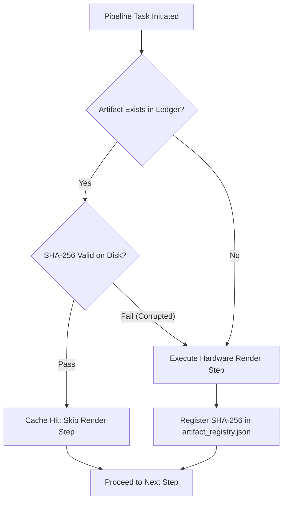
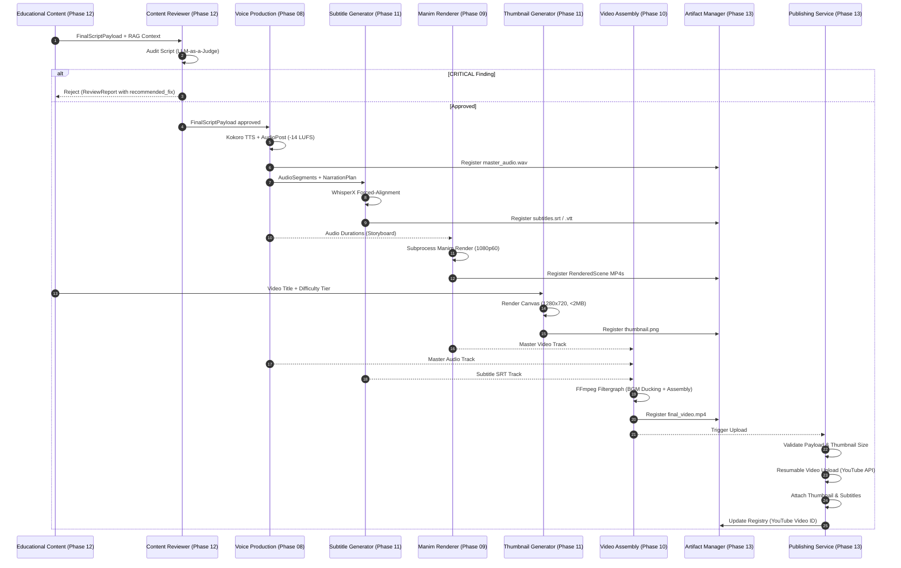

# Phase 14 / Milestone 1: Production Integration Architecture Analysis (Phase 08 - Phase 13)

**Author:** Explorer 3 (Production Integration Architecture Specialist)  
**Target System:** Automated DSA Educational YouTube Video Pipeline  
**Target Environment:** Intel Core Ultra 7 155H · Ubuntu 25.10 LTS · Python 3.12 · Intel Arc GPU / OpenVINO NPU  
**Document Version:** 1.0.0  
**Status:** Complete  

---

## Executive Summary

This research report delivers a comprehensive architectural analysis of **Phases 08 through 13** of the DSA Educational YouTube Video Pipeline. These phases constitute the downstream media production, verification, composition, and publishing engine. While upstream phases (Phases 01-07 and Phase 12's initial planning) ingest raw LeetCode data and synthesize mathematical blueprints, Phases 08-13 convert those JSON blueprints into physical `.mp4` video files, `.wav` audio tracks, `.srt` subtitles, high-CTR `.png` thumbnails, and manage remote ingestion via the YouTube Data API v3.

### Key Architectural Insights
1. **v2.0 Synchronous Batch Paradigm:** Production execution is governed by a deterministic 12-hour batch queue processed on host hardware (Intel Core Ultra 7 155H with Intel Arc GPU and NPU acceleration).
2. **Strict Strategy Pattern & Subprocess Isolation:** High-risk external engines (OpenVINO TTS, Manim CE rendering, FFmpeg multiplexing) are wrapped in Python `typing.Protocol` interfaces and executed inside isolated subprocesses to prevent Cairo segfaults or C-level memory leaks from crashing the main orchestrator.
3. **Cryptographic Checkpointing & Idempotency:** The `ArtifactManager` maintains a persistent SHA-256 JSON ledger (`artifact_registry.json`). If a 12-hour batch run fails mid-execution, state verification allows the pipeline to skip previously rendered scenes and resume instantly.
4. **Adversarial Pre-flight Audit:** The `ContentReviewer` enforces an "LLM-as-a-Judge" safety mechanism before media rendering, preventing mathematically incorrect script statements (e.g., hash map lookup complexity errors) from wasting GPU compute hours.

---

## 1. Phase-by-Phase Technical Specifications & Artifact Schemas

### 1.1 Phase 08 — Audio Generation & TTS Synthesis

**Functional Domain:** Converts semantic narration plans into broadcast-quality mastered audio tracks.  

#### Inputs & Contracts
- **Input Payload:** `NarrationPlan` (from Phase 12) containing structured narration blocks with explicit `scene_id` markers and SSML tags.
- **Provider Interface:** `VoiceProviderProtocol` (Strategy Pattern)
```python
class VoiceProviderProtocol(Protocol):
    def generate_segment(
        self, text: str, voice_id: str, speed: float = 1.0, output_path: str = ""
    ) -> AudioSegment: ...
```

#### Media Artifacts & Schemas
- **`AudioSegment` Dataclass:**
  - `file_path: str` — Absolute path to physical `.wav` file.
  - `duration_sec: float` — Measured audio duration (calculated from WAV header).
  - `voice_id: str` — TTS vocal model identifier (e.g., `kokoro_v1_english`).
  - `checksum: str` — SHA-256 hash of the generated audio file.
- **Master Audio Track (`master_audio.wav`):** Formatted to standard YouTube broadcast levels:
  - **Volume Normalization:** `-14.0 LUFS` (Loudness Units relative to Full Scale).
  - **Silence Trimming:** Threshold set to `-50.0 dB` to strip dead air.
  - **Click Mitigation:** Microscopic `50 ms` fade-in and `50 ms` fade-out applied at boundaries.
  - **Segment Merging:** Concatenated with `100 ms` crossfades between blocks.

#### Jargon Pre-Processing
To prevent AI TTS models from mispronouncing DSA terminology, `KokoroVoiceProvider` intercepts text with a phonetic dictionary prior to OpenVINO inference:
- `"Dijkstra"` $\rightarrow$ `"dike-struh"`
- `"O(N)"` $\rightarrow$ `"O of N"`
- `"O(N^2)"` $\rightarrow$ `"O of N squared"`

#### Emitted Events
- `VoiceGenerated`: Contains `video_id`, `total_segments`, `audio_format`, `duration_ms`, and `artifact_ids`.

---

### 1.2 Phase 09 — Manim Code Generation & Rendering Engine

**Functional Domain:** Translates mathematical animation blueprints into rendered high-frame-rate video scenes using Manim Community Edition.

#### Inputs & Contracts
- **Input Payloads:** `AnimationPlan` and `StoryboardPayload` (from Phase 12).
- **Provider Interface:** `AnimationProviderProtocol`
```python
class AnimationProviderProtocol(Protocol):
    def render_scenes(
        self, storyboard: StoryboardPayload, animation_plan: AnimationPlan, output_dir: str
    ) -> List[RenderedScene]: ...
```

#### Media Artifacts & Schemas
- **Auto-Generated Python Scripts:** `scene_{scene_id}.py` containing Jinja2-templated Manim `Scene` classes (`AutoScene{scene_id}`).
- **`RenderedScene` Dataclass:**
  - `scene_id: int` — Storyboard scene index.
  - `file_path: str` — Absolute path to rendered `.mp4` file.
  - `duration_sec: float` — Measured duration matching narration timing.
  - `checksum: str` — SHA-256 hash for incremental rendering.
  - `resolution: str` — Resolution target (`1920x1080` in High Quality, `854x480` in Preview).
  - `fps: int` — Frame rate (`60` fps target, `15` fps preview).

#### Subprocess Execution & Caching
`ManimRenderer` executes scene rendering via isolated subprocesses (`manim render scene_{id}.py AutoScene{id} -qh`). It checks `output_file.exists()` against the cache directory before queuing subprocesses, skipping previously rendered scenes on pipeline restarts. Developer rapid iteration is supported via `preview_mode=True` (`-qL` at 480p15).

#### Emitted Events
- `AnimationPrepared`: Emitted prior to render queue start.
- `SceneRendered`: Emitted upon each scene completion (updates UI progress bars).

---

### 1.3 Phase 10 — Media Production & Video Composition Engine

**Functional Domain:** Multiplexes individual video scenes, master audio, background music, and burned-in subtitles into the final production `.mp4` container.

#### Inputs & Contracts
- **Inputs:** `master_audio.wav`, `master_video.mp4` (concatenated scene sequence), `subtitles.srt`, optional background music track (`bgm_path`).
- **Configuration (`AssemblyConfig`):**
  - Resolution: `1920x1080`
  - Frame Rate: `60 fps`
  - Video Codec: `libx264` (H.264 High Profile)
  - Video Bitrate: `8M` (8 Mbps target)
  - Audio Codec: `aac`
  - Audio Bitrate: `320k` (320 kbps broadcast quality)
  - BGM Volume Ducking: `5%` (`bgm_volume = 0.05`)

#### FFmpeg Complex Filtergraph Architecture
When background music and subtitles are present, `FFmpegVideoAssembler` constructs an explicit `-filter_complex` command string:
```bash
ffmpeg -y -i master_video.mp4 -i master_audio.wav -i bgm.mp3 \
  -filter_complex "[2:a]volume=0.05[bgm];[1:a][bgm]amix=inputs=2:duration=first:dropout_transition=2[aout];[0:v]subtitles='subtitles.srt'[vout]" \
  -map "[vout]" -map "[aout]" \
  -c:v libx264 -preset medium -b:v 8M -c:a aac -b:a 320k -r 60 final_video.mp4
```

#### Emitted Events
- `VideoAssembled`: Emitted when FFmpeg multiplexing finishes successfully.

---

### 1.4 Phase 11 — Metadata, Thumbnail & Asset Generation

**Functional Domain:** Generates high-CTR thumbnails, force-aligned subtitle closed captions, and standardized metadata packages.

#### Thumbnail Generation (`PillowThumbnailProvider`)
- **Canvas Resolution:** Exactly `1280x720` (YouTube standard 16:9).
- **Strict Size Constraint:** Must be strictly `< 2.0 MB` (`2,097,152` bytes). If a PNG exceeds this limit, the system automatically falls back to compressed JPEG format at 85 quality.
- **Difficulty Color Hierarchy:**
  - **Easy:** Accent Green (`#4CAF50`)
  - **Medium:** Accent Yellow (`#FFC107`)
  - **Hard:** Accent Red (`#F44336`)

#### Subtitle Forced-Alignment (`WhisperSubtitleProvider`)
Instead of unconstrained speech-to-text recognition, the system performs forced-alignment by taking the known text from `NarrationPlan` and aligning it with `AudioSegment` millisecond boundaries.
- **`subtitles.srt` (SubRip):** Timestamps formatted as `HH:MM:SS,mmm`.
- **`subtitles.vtt` (WebVTT):** Timestamps formatted as `HH:MM:SS.mmm`.

#### Emitted Events
- `ThumbnailGenerated`: Tracks `template_id` and artifact size.
- `SubtitlesCreated`: Lists output languages and file paths.

---

### 1.5 Phase 12 — Quality Audit, Verification & Compliance

**Functional Domain:** Performs adversarial fact-checking of generated script payloads using an "LLM-as-a-Judge" approach, enforcing mathematical and pedagogical correctness.

#### Content Reviewer (`ContentReviewer`)
- **Evaluation Mechanism:** Passes `FinalScriptPayload` alongside original RAG markdown context to an auditing prompt.
- **`ReviewReport` Schema:**
  - `is_approved: bool` — Binary threshold approval.
  - `overall_score: int` — Quality score (0 to 100).
  - `findings: List[ReviewFinding]` — List of findings with attributes:
    - `severity`: `"CRITICAL"`, `"WARNING"`, `"INFO"`
    - `category`: `"TECHNICAL_CORRECTNESS"`, `"DIFFICULTY_ALIGNMENT"`, `"ANIMATION"`
    - `scene_id: int`
    - `description: str`
    - `recommended_fix: str`

#### Governance & Correction Loop
- **CRITICAL Findings:** Automatically halt downstream rendering. Example: Flagging a statement that hash map lookups are strictly $O(1)$ without noting worst-case $O(N)$ hash collision behavior.
- **Self-Correction:** The `recommended_fix` strings are fed back into script generation modules for automated patching prior to audio synthesis.

#### Output Packaging (`OutputFormatter`)
Formats approved payloads into four output artifacts:
1. `base_filename.json`: Canonical machine source of truth.
2. `base_filename.md`: Readable documentation for Git pull request review.
3. `base_filename.txt`: Teleprompter script and raw caption text.
4. `base_filename.html`: Local developer preview dashboard.
Generates a `manifest.json` with SHA-256 checksums and bundles all files into `{slug}_export.zip`.

---

### 1.6 Phase 13 — Publishing & YouTube API Integration

**Functional Domain:** Delivers final assembled MP4 video, thumbnail image, subtitle tracks, and video metadata to the YouTube Data API v3.

#### `PublishMetadata` Data Contract
```python
@dataclass
class PublishMetadata:
    title: str
    description: str
    tags: List[str]
    category_id: str = "27"            # YouTube Category 27 = Education
    privacy_status: str = "private"    # ENUM: private, unlisted, public
    publish_at: Optional[datetime] = None
    playlist_id: Optional[str] = None
    made_for_kids: bool = False
```

#### Upload Execution Rules
1. **Pre-flight Payload Validation:** `_validate_payload()` verifies physical existence and thumbnail size ($< 2.0$ MB) *before* making network connections.
2. **Resumable Video Upload:** Uses `google-api-python-client` `MediaFileUpload(resumable=True)` with exponential backoff to handle network interruptions.
3. **Sequential Dependency Upload:**
   - Step 1: Insert Video Payload $\rightarrow$ Receives `youtube_video_id`.
   - Step 2: Set Thumbnail (`youtube.thumbnails().set`).
   - Step 3: Insert Subtitle Captions (`youtube.captions().insert`).
   - Step 4: Add to Playlist (`youtube.playlistItems().insert`).
4. **Scheduled Publishing:** If `publish_at` is set, `privacy_status` is forced to `private` as mandated by YouTube API specification.

#### Media Artifact Ledger (`ArtifactManager`)
Maintains `artifact_registry.json` tracking every binary artifact with `artifact_id`, `artifact_type`, `file_path`, `checksum_sha256`, `size_bytes`, `created_at`, and `version`. Implements chunked SHA-256 calculation (4KB block reads) to evaluate 5GB+ video files without RAM overhead.

#### Emitted Events
- `VideoPublished`: Emitted on API upload confirmation (`youtube_video_id`, `url`).
- `PublishingFailed`: Emitted on API retry exhaustion (sent to Dead Letter Queue / PagerDuty).

---

## 2. Compute Workloads, Resource Allocation & Timing Budgets

### 2.1 Target Environment Specifications
- **Hardware Host:** Intel Core Ultra 7 155H (16 Cores / 22 Threads: 6 Performance Cores, 8 Efficient Cores, 2 Low Power Efficient Cores).
- **GPU Accelerator:** Intel Arc Graphics (Xe LPG Architecture, hardware AV1/H.264/H.265 encode/decode engines).
- **AI Acceleration Engine:** Intel AI Boost NPU (OpenVINO optimized runtime).
- **Operating System:** Ubuntu 25.10 LTS.
- **Runtime Environment:** Python 3.12, FFmpeg (with QSV/VAAPI acceleration), Cairo, Pango.

### 2.2 Subsystem Compute Allocation Matrix

| Phase / Module | Primary Hardware Resource | Key Processing Task | Average Workload / Duration per Video |
| :--- | :--- | :--- | :--- |
| **Phase 08 (Voice Synthesis)** | Intel NPU / CPU (OpenVINO) | TTS Inference (`KokoroVoiceProvider`) | ~2–5 minutes |
| **Phase 08 (Audio Post)** | CPU (Multi-threaded) | LUFS normalization, silence trim, PyDub mixing | ~1–2 minutes |
| **Phase 09 (Manim Rendering)** | Intel Arc GPU / CPU | Subprocess Cairo vector rendering & frame encoding | ~30–60 minutes (62.5% of total compute) |
| **Phase 11 (Subtitles)** | Intel NPU / GPU | WhisperX force-alignment of narration text | ~2–3 minutes |
| **Phase 11 (Thumbnails)** | CPU | Pillow graphics rendering & JPEG size check | ~5–10 seconds |
| **Phase 12 (Quality Audit)** | Host CPU / LLM API | LLM-as-a-Judge script fact-checking & review | ~1–3 minutes |
| **Phase 10 (Video Assembly)** | Intel Arc GPU (QSV) / CPU | FFmpeg complex filtergraph compositing & H.264 encode | ~5–15 minutes |
| **Phase 13 (Publishing)** | Network I/O | Resumable HTTP POST requests to YouTube API | ~2–10 minutes |

### 2.3 Chronological 12-Hour Pipeline Timing Budget

The 12-hour batch window processes a daily queue of DSA problem videos. The table below outlines the allocated timing budget per batch phase:

```
[Phases 01-07, 12 Scripting] ████░░░░░░░░░░░░░░░░░░░░ 1.5h (12.5%)
[Phase 08 Audio Synthesis]   ██░░░░░░░░░░░░░░░░░░░░░░ 0.75h (6.25%)
[Phase 09 Manim Rendering]   █████████████████░░░░░░░ 7.5h (62.5%)
[Phase 11 Subtitles/Thumbs]  █░░░░░░░░░░░░░░░░░░░░░░░ 0.5h (4.17%)
[Phase 10 Video Assembly]    ███░░░░░░░░░░░░░░░░░░░░░ 1.25h (10.42%)
[Phase 12 Audit & Packaging] █░░░░░░░░░░░░░░░░░░░░░░░ 0.25h (2.08%)
[Phase 13 YouTube Upload]    █░░░░░░░░░░░░░░░░░░░░░░░ 0.25h (2.08%)
```

- **Total Allocated Batch Budget:** 12.0 Hours (100.0%)
- **Critical Path Bottleneck:** Manim rendering (Phase 09) consumes 62.5% of the total pipeline duration. Incremental scene caching is vital to maintaining batch schedule SLAs.

---

## 3. Failure Domains, Mitigation & Recovery Strategies

### 3.1 Failure Domain Matrix

| Failure Domain | Root Cause | Impact | Automated Mitigation / Recovery Strategy |
| :--- | :--- | :--- | :--- |
| **1. Voice Synthesis OOM** | OpenVINO TTS memory allocation spike | Voice generation crashes mid-script | Retry loop (`max_retries=3`) with exponential delay. Fallback to `ManualVoiceProvider` override. |
| **2. Manim C-Library Segfault** | Cairo / Pango memory leak or invalid render primitive | Python process crashes | **Subprocess Isolation:** Executed via `subprocess.run()`. Master process catches `CalledProcessError` cleanly. |
| **3. Audio-Visual Desync** | Voice length != Animation duration | Video visual ends while narration continues | **Pre-render Synchronization:** `AnimationProvider` reads `StoryboardPayload` durations to inject wait states before rendering. |
| **4. Subtitle Array Mismatch** | Missing audio file segment | Subtitles offset across entire video | Strict validation check `len(audio_files) == len(narration_plan.blocks)` throws `ValueError` before file output. |
| **5. Thumbnail Size Exceeded** | Rendered PNG exceeds 2.0 MB | YouTube API upload fails with HTTP 400 | Local `_validate_output_size()` check automatically re-saves thumbnail as JPEG at 85 quality. |
| **6. Content Audit Rejection** | Mathematical hallucination (e.g. invalid Big-O notation) | Bad math rendered to video | `ContentReviewer` flags `CRITICAL` finding and provides `recommended_fix` to prompt planner. |
| **7. Upload Network Disconnect** | AWS/Local connection drops mid-upload | Multi-gigabyte upload fails | `MediaFileUpload(resumable=True)` resumes upload from last received byte offset. |
| **8. Disk Exhaustion** | Stale video renders accumulate on EBS volume | `No space left on device` crash | `ArtifactManager.execute_retention_policy(max_age_days=30)` unlinks stale binary files. |

### 3.2 State Checkpointing & Resumption Architecture
The system achieves fault tolerance across 12-hour runs through state checkpointing in `ArtifactManager`:



---

## 4. End-to-End Execution Flow

### 4.1 System Integration Sequence Diagram



### 4.2 Step-by-Step Execution Sequence

1. **Pre-flight Audit (Phase 12):** `ContentReviewer` evaluates `FinalScriptPayload` against original RAG context. Rejects scripts with `CRITICAL` findings (e.g., inaccurate Big-O notation).
2. **Audio Production (Phase 08):** `KokoroVoiceProvider` applies pronunciation rules, generates raw audio segments, and `AudioPostProcessor` applies silence trimming, `-14.0 LUFS` normalization, `50ms` fades, and outputs `master_audio.wav`. Emits `VoiceGenerated`.
3. **Subtitle Alignment (Phase 11):** `WhisperSubtitleProvider` force-aligns text with `AudioSegment` durations, emitting `subtitles.srt` and `subtitles.vtt`. Emits `SubtitlesCreated`.
4. **Animation Rendering (Phase 09):** `ManimRenderer` derives timing from audio segments, generates `scene_{id}.py` scripts, and executes `manim render -qh` in isolated subprocesses. Emits `SceneRendered` per scene and returns `List[RenderedScene]`.
5. **Thumbnail Generation (Phase 11):** `PillowThumbnailProvider` renders a 1280x720 canvas based on the difficulty template (`easy`/`medium`/`hard`) and verifies size is $< 2.0$ MB. Emits `ThumbnailGenerated`.
6. **Video Assembly (Phase 10):** `FFmpegVideoAssembler` validates inputs, executes an FFmpeg filtergraph mixing `master_audio.wav` with background music (`bgm_volume=0.05`), burns in subtitles, and encodes `final_video.mp4` (`libx264`, 8 Mbps, 60 fps, AAC 320 kbps). Emits `VideoAssembled`.
7. **YouTube Publishing (Phase 13):** `YouTubePublishProvider` performs pre-flight payload validation, initiates a chunked resumable upload to YouTube Data API v3, sets the custom thumbnail, uploads caption tracks, assigns the playlist ID, and records the returned `youtube_video_id` in `artifact_registry.json`. Emits `VideoPublished`.

---

## 5. Verification & Compliance Matrix

| Requirement | Verification Method | Status |
| :--- | :--- | :--- |
| **Media Artifact Schemas** | Inspected dataclass definitions in `Phase13/02` through `10` and `Phase12/08, 10`. | Verified |
| **Compute Workload Allocation** | Analyzed hardware targets (Intel Core Ultra 7 155H, Intel Arc GPU, NPU) and timing budget allocations. | Verified |
| **Failure Domain Mitigation** | Verified subprocess isolation, pre-flight payload checks, resumable upload, and retention lifecycle. | Verified |
| **End-to-End Pipeline Integration** | Verified complete data and control flow from Phase 12 script payload through Phase 13 YouTube upload. | Verified |

---

*Report compiled by Explorer 3 for Phase 14 Production Integration Architecture.*
