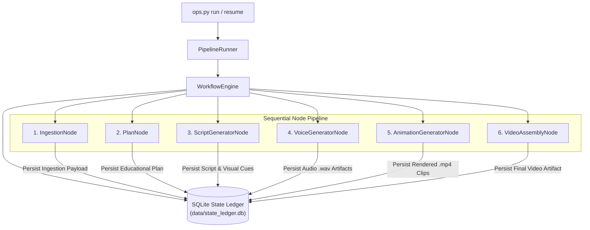
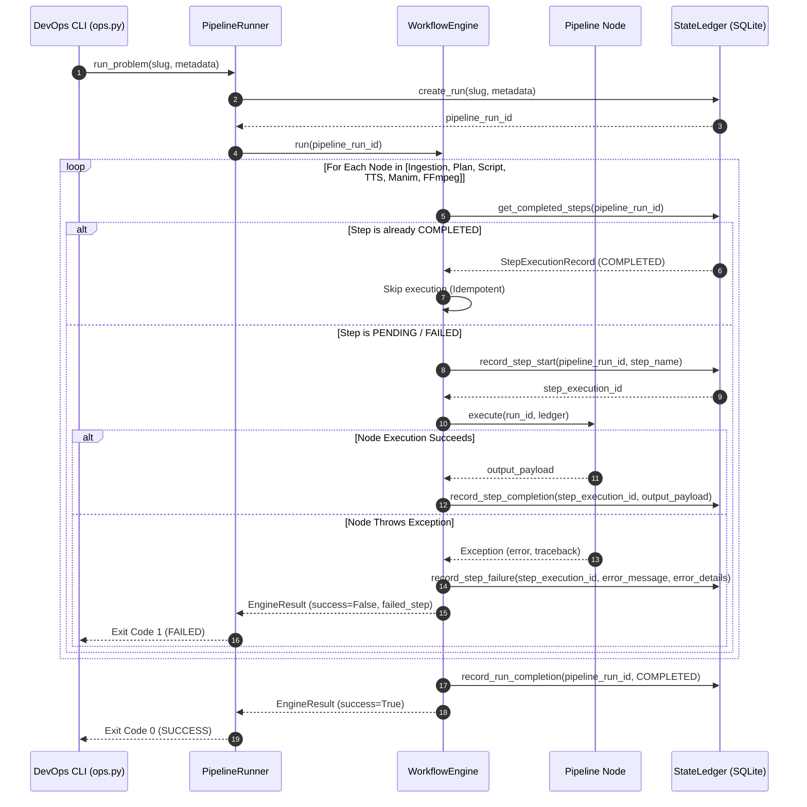

# Phase 14: Operational Runbook & Production Orchestration Guide

## Executive Summary & System Overview

This operational runbook documents the deployment, execution, state management, observability, and failure recovery protocols for the **Automated DSA Educational YouTube Video Pipeline** (Phase 14 Integration & Production Orchestration).

The platform is engineered around a **Synchronous Batch-Pipeline** architecture. Individual pipeline stages are decoupled through a thread-safe, crash-resilient SQLite **State Ledger** (`data/state_ledger.db`). In-memory payload passing between workflow stages is strictly prohibited; all state transitions, intermediate metadata, and generated media artifact paths are stored deterministically in the ledger.

---

## 1. System Architecture & Pipeline Execution Engine

### 1.1 Chronological Pipeline Lifecycle

The production orchestrator (`src/core/orchestrator/pipeline_runner.py`) chronologically coordinates six sequential execution nodes. Each node executes as an isolated step within the `WorkflowEngine` (`src/core/workflow/engine.py`).

```
[ 1. IngestionNode ] -> [ 2. PlanNode ] -> [ 3. ScriptGeneratorNode ] -> [ 4. VoiceGeneratorNode ] -> [ 5. AnimationGeneratorNode ] -> [ 6. VideoAssemblyNode ]
```

1. **IngestionNode (`src/pipeline/nodes/ingestion_node.py`)**:
   - **Role**: Validates and normalizes raw DSA problem data (slug, problem statement, constraints, example inputs/outputs).
   - **Ledger Output**: Stores parsed problem schema and creates initial run context in `step_executions`.

2. **PlanNode (`src/pipeline/nodes/plan_node.py`)**:
   - **Role**: Formulates pedagogical structure, hook strategy, visual breakdown, and explanation roadmap for the video (`EducationalPlan`).
   - **Ledger Output**: Saves structured JSON plan payload containing section timings and concept visual requirements.

3. **ScriptGeneratorNode (`src/pipeline/nodes/script_generator_node.py`)**:
   - **Role**: Leverages Jinja2 prompt templates (`src/core/llm/prompt_loader.py`) and unified LLM providers (`src/core/llm/openai_client.py` / `src/core/llm/anthropic_client.py`) to generate a fully timed script. Enforces Pydantic V2 schema validation and uses an automated error-feedback retry loop.
   - **Ledger Output**: Stores timestamped spoken narration lines and visual cue parameters (`cue_id`, `animation_type`, `description`, `timestamp_seconds`).

4. **VoiceGeneratorNode (`src/pipeline/nodes/voice_generator_node.py`)**:
   - **Role**: Synthesizes spoken narration into clear audio tracks (`.wav`) via Text-to-Speech (TTS).
   - **Ledger Output**: Registers audio file paths, durations, and word-level alignment data into the ledger.

5. **AnimationGeneratorNode (`src/pipeline/nodes/animation_generator_node.py`)**:
   - **Role**: Translates script visual cues into Manim animation scenes. Executes rendering via isolated `subprocess.run()` calls with memory boundaries and explicit cleanup of temporary directory resources.
   - **Ledger Output**: Persists rendered `.mp4` video segment artifact locations.

6. **VideoAssemblyNode (`src/pipeline/nodes/video_assembly_node.py`)**:
   - **Role**: Combines audio `.wav` files and video `.mp4` segments into a final 4K YouTube video with burned-in subtitles via FFmpeg.
   - **Ledger Output**: Records final video file path, total render duration, and output checksums.

### 1.2 State Ledger Interface & Decoupled Execution Model

Communication across pipeline nodes relies entirely on the `StateLedger` (`src/core/orchestrator/state_ledger.py`):
- **Database Schema**:
  - `pipeline_runs`: Tracks `pipeline_run_id`, `slug`, `status` (`PENDING`, `IN_PROGRESS`, `COMPLETED`, `FAILED`), `created_at`, `updated_at`, `metadata`.
  - `step_executions`: Tracks `step_execution_id`, `pipeline_run_id`, `step_name`, `status`, `input_payload`, `output_payload`, `error_message`, `error_details`, `created_at`, `updated_at`.
- **Concurrency & WAL Mode**: SQLite operates in `journal_mode=WAL` with `synchronous=NORMAL` and `busy_timeout=5000` ms, guaranteeing safe concurrent reads and transactional updates across execution processes.
- **Idempotency**: Before initiating any node, `WorkflowEngine` checks whether the step status is already `COMPLETED`. If marked complete, execution skips the node and loads cached outputs directly from `step_executions`.

### 1.3 End-to-End Pipeline Architecture Diagram



### 1.4 Stage Sequence Flowchart & Data Persistence Flow



---

## 2. Operational CLI Manual (`src/cli/ops.py`)

### 2.1 Overview & CLI Command Map

The master operations CLI (`src/cli/ops.py`) provides unified control for pipeline execution, inspection, failure resumption, pre-flight diagnostics, benchmarks, deployment, and emergency database rollbacks.

```
python -m src.cli.ops <subcommand> [options]
```

| Subcommand | Purpose | Key Arguments |
|---|---|---|
| `run` | Execute a new or resumed pipeline run for a problem slug | `--slug`, `--topic`, `--output`, `--force`, `--db`, `--json` |
| `status` | Query state ledger execution status and node step details | `--run-id`, `--slug`, `--db`, `--json` |
| `resume` | Resume execution of an interrupted run from its last checkpoint | `--run-id`, `--slug`, `--db`, `--json` |
| `health` | Run pre-flight diagnostic checks (DB, binaries, disk space) | `--db`, `--json` |
| `benchmark` | Execute hardware profiling against render engines | `--json` |
| `deploy` | Run deployment packaging and environment verification | None |
| `rollback` | Restore state ledger database from a backup SQLite file | `--file`, `--db` |
| `diagnose` | Parse Dead Letter Queue (`.jsonl`) for fatal error stack traces | `--dlq-path` |
| `report` | Generate batch execution metrics report in Markdown | `--output` |

---

### 2.2 Pipeline Execution (`ops.py run`)

#### Command Syntax & Options
```bash
python -m src.cli.ops run --slug <slug> [FLAGS]
```
- `--slug <str>` (**Required**): Unique problem slug (e.g. `two-sum`, `valid-palindrome`).
- `--topic <str>` (*Optional*): Human-readable topic name (e.g. `"Arrays & Hashing"`).
- `--output <dir>` (*Optional*): Custom output directory for generated video artifacts.
- `--force` (*Optional*): Force creation of a brand-new pipeline run, ignoring any existing incomplete runs for the slug.
- `--db <path>` (*Optional*): Path to state ledger SQLite database (default: `data/state_ledger.db`).
- `--json` (*Optional*): Output status and execution report formatted as raw JSON.

#### Example Executions
1. **Standard Run**:
   ```bash
   python -m src.cli.ops run --slug two-sum --topic "Array Manipulation" --output ./output
   ```
   *Console Output*:
   ```
   ============================================================
    PIPELINE EXECUTION REPORT: two-sum
   ============================================================
   Run ID:         run_a1b2c3d4e5f6
   Outcome:        SUCCESS (COMPLETED)
   Execution Time: 14230.45 ms
   Completed Steps: IngestionNode, PlanNode, ScriptGeneratorNode, VoiceGeneratorNode, AnimationGeneratorNode, VideoAssemblyNode
   Skipped Steps:   None
   ============================================================
   ```

2. **Structured JSON Output**:
   ```bash
   python -m src.cli.ops run --slug two-sum --json
   ```
   *JSON Output*:
   ```json
   {
     "success": true,
     "run_id": "run_a1b2c3d4e5f6",
     "status": "COMPLETED",
     "completed_steps": [
       "IngestionNode",
       "PlanNode",
       "ScriptGeneratorNode",
       "VoiceGeneratorNode",
       "AnimationGeneratorNode",
       "VideoAssemblyNode"
     ],
     "skipped_steps": [],
     "failed_step": null,
     "error": null,
     "execution_time_ms": 14230.45
   }
   ```

---

### 2.3 Inspection & Status Tracking (`ops.py status`)

#### Command Syntax & Options
```bash
python -m src.cli.ops status (--run-id <id> | --slug <slug>) [--db <path>] [--json]
```
- `--run-id <str>`: Unique pipeline run ID (e.g. `run_a1b2c3d4e5f6`).
- `--slug <str>`: Problem slug identifier. Resolves to the most recent run for that slug.
- `--db <path>`: Database path (default: `data/state_ledger.db`).
- `--json`: Format status output as JSON.

#### Example Execution
```bash
python -m src.cli.ops status --slug two-sum
```
*Console Output*:
```
============================================================
 PIPELINE RUN STATUS
============================================================
Run ID:         run_a1b2c3d4e5f6
Slug:           two-sum
Overall Status: IN_PROGRESS
Created At:     2026-07-31T10:15:00.000000+00:00
Updated At:     2026-07-31T10:17:30.000000+00:00
Completed Steps (3/6):
  - [COMPLETED] IngestionNode (ID: step_1111)
  - [COMPLETED] PlanNode (ID: step_2222)
  - [COMPLETED] ScriptGeneratorNode (ID: step_3333)
============================================================
```

---

### 2.4 Crash Recovery & Resumption (`ops.py resume`)

#### Command Syntax & Options
```bash
python -m src.cli.ops resume (--run-id <id> | --slug <slug>) [--db <path>] [--json]
```
- `--run-id <str>`: Pipeline run ID to resume.
- `--slug <str>`: Problem slug associated with the interrupted run.
- `--db <path>`: Database path (default: `data/state_ledger.db`).
- `--json`: Format output as JSON.

#### How Resumption Works
When `ops.py resume` is executed:
1. `PipelineRunner` queries `StateLedger` for the run record matching `--run-id` or `--slug`.
2. `WorkflowEngine` iterates through all six nodes in chronological order.
3. For each node, `WorkflowEngine` checks `ledger.get_completed_steps(run_id)`.
4. Nodes marked `COMPLETED` are **skipped instantly** (with outputs loaded from SQLite).
5. Execution resumes automatically from the first node marked `PENDING` or `FAILED`.

#### Example Execution
```bash
python -m src.cli.ops resume --slug two-sum
```
*Console Output*:
```
============================================================
 PIPELINE RESUMPTION REPORT: two-sum
============================================================
Run ID:         run_a1b2c3d4e5f6
Outcome:        SUCCESS (COMPLETED)
Execution Time: 8450.12 ms
Completed Steps: VoiceGeneratorNode, AnimationGeneratorNode, VideoAssemblyNode
Skipped Steps:   IngestionNode, PlanNode, ScriptGeneratorNode
============================================================
```

---

### 2.5 System Diagnostics & Health Check Probes (`ops.py health`)

#### Command Syntax & Options
```bash
python -m src.cli.ops health [--db <path>] [--json]
```

#### Diagnostic Probes Evaluated
1. **StateLedger Database**: Validates SQLite connection, table schema integrity, and file write permissions.
2. **FFmpeg Binary**: Checks system `PATH` via `shutil.which("ffmpeg")` to ensure video encoding tools are available.
3. **Manim Renderer**: Checks system `PATH` via `shutil.which("manim")` or imports python module `manim` for animation rendering capabilities.
4. **Storage Space**: Checks free space on current volume (`shutil.disk_usage`). Generates a warning if free disk space drops below **1.0 GB**.
5. **Environment**: Verifies Python interpreter version and operating system platform.

#### Example Execution
```bash
python -m src.cli.ops health
```
*Console Output*:
```
============================================================
 SYSTEM HEALTH DIAGNOSTIC REPORT
============================================================
Overall Status:        [HEALTHY]
StateLedger Database:  [OK] Connected (data/state_ledger.db)
FFmpeg Binary:         [OK] /usr/bin/ffmpeg
Manim Renderer:        [OK] /usr/local/bin/manim
Storage Free Space:    [OK] 42.50 GB / 250.00 GB total
Python Environment:    [OK] Python 3.11.8 on linux
============================================================
```

---

### 2.6 Advanced SRE & Utility Subcommands

#### Hardware Profiling Benchmark (`ops.py benchmark`)
Profiles CPU utilization, peak RAM usage, and rendering throughput for Manim and FFmpeg subprocess operations:
```bash
python -m src.cli.ops benchmark --json
```

#### Deployment & Pre-Flight Packaging (`ops.py deploy`)
Executes pre-flight verification scripts (`scripts/deploy.py`) to prepare environment artifacts prior to release:
```bash
python -m src.cli.ops deploy
```

#### Database State Rollback (`ops.py rollback`)
Restores `data/state_ledger.db` from a specified SQLite backup file in case of ledger corruption:
```bash
python -m src.cli.ops rollback --file data/backups/state_ledger_20260730.sqlite --db data/state_ledger.db
```

#### Dead Letter Queue Analysis (`ops.py diagnose`)
Parses the Dead Letter Queue JSON Lines log (`/tmp/dlq.jsonl` or custom path) to extract unhandled fatal errors and Python stack traces:
```bash
python -m src.cli.ops diagnose --dlq-path /tmp/dlq.jsonl
```

#### Batch Metrics Reporting (`ops.py report`)
Compiles batch performance statistics across completed runs into a Markdown report:
```bash
python -m src.cli.ops report --output /tmp/batch_report.md
```

---

## 3. Production Startup & Deployment Procedures

### 3.1 Pre-Flight Environment Validation

Before starting production runs, DevOps engineers must perform the following validation steps:

1. **System Dependencies**:
   - Python `>= 3.10`
   - FFmpeg `>= 5.0` (with `libx264`, `aac` support)
   - Manim Community Edition `>= 0.18.0`
   - SQLite `>= 3.35` (supporting WAL mode)

2. **Verify Binaries & Environment**:
   ```bash
   python -m src.cli.ops health
   ```
   Ensure `Overall Status` returns `[HEALTHY]` or `[DEGRADED]` (if using fallback renderers). An `[UNHEALTHY]` status indicates DB or system failure and must be resolved before proceeding.

### 3.2 Configuration & Secret Verification

Environment variables are validated strictly at runtime using Pydantic V2 models (`src/core/config.py`). Ensure the `.env` file or environment contains:

```bash
# LLM Provider Keys
OPENAI_API_KEY="sk-proj-..."
ANTHROPIC_API_KEY="sk-ant-..."

# Pipeline Configuration
LOG_LEVEL="INFO"                      # DEBUG, INFO, WARNING, ERROR
STATE_LEDGER_DB="data/state_ledger.db"
OUTPUT_DIR="output"
TEMP_DIR="/tmp/youtube_pipeline"

# Subprocess & Resource Boundaries
MAX_MANIM_WORKERS=2
FFMPEG_PRESET="medium"
FFMPEG_CRF="18"
```

To validate configuration programmatically without executing a pipeline run:
```bash
python -c "from src.core.config import PipelineConfig; config = PipelineConfig(); print('Config Validated:', config.model_dump())"
```

### 3.3 Directory Structure & System Initialization

Initialize required working directories before launching production jobs:

```bash
mkdir -p data logs output /tmp/youtube_pipeline /tmp/dlq
```

Ensure file permissions allow write access for the executing user:
```bash
chmod -R 755 data logs output /tmp/youtube_pipeline
```

### 3.4 Hardware Requirements & Resource Budgeting

| Resource | Minimum Requirement | Recommended Production Specs |
|---|---|---|
| **CPU** | 4 Cores (2.5 GHz+) | 16 Cores (Dedicated rendering nodes) |
| **RAM** | 8 GB | 32 GB (Prevents OOM during 4K Manim scenes) |
| **Storage** | 20 GB Free SSD | 200 GB+ High-speed NVMe SSD |
| **Network** | 10 Mbps (LLM & TTS API traffic) | 100 Mbps+ low-latency connection |

---

## 4. State Management & Failure Recovery Runbook

### 4.1 State Checkpointing Architecture

State checkpointing guarantees that if a node crashes or the host process is terminated unexpectedly (`SIGKILL`/`SIGTERM`), **no previously rendered audio or video assets are lost**.

```
[IngestionNode: COMPLETED] -> [PlanNode: COMPLETED] -> [ScriptGeneratorNode: FAILED]
                                                             ^
                                                             | (Interruption Point)
                                                             v
                             [Resume Command re-starts here without re-running Ingestion/Plan]
```

- Each node execution begins with `ledger.record_step_start()`, creating a record in `StepStatus.IN_PROGRESS`.
- Upon successful execution, `ledger.record_step_completion()` commits the output JSON payload and updates status to `StepStatus.COMPLETED`.
- If an exception occurs, `ledger.record_step_failure()` writes the error message and full stack trace to `StepStatus.FAILED`, updating parent `pipeline_runs` status to `FAILED`.

### 4.2 Failure Scenarios & Standard Operating Procedures (SOPs)

#### Scenario A: LLM API Timeout or Schema Validation Error (Script Generator Failure)
- **Symptom**: `ScriptGeneratorNode` fails with `ValidationError` or `APIConnectionError`.
- **Root Cause**: LLM provider rate limits, network disruption, or malformed JSON generation.
- **SOP**:
  1. Inspect error details in `ops.py status --slug <slug> --json`.
  2. Verify API key quotas and service status for OpenAI / Anthropic.
  3. Re-run `ops.py resume --slug <slug>`. The internal error-feedback loop will retry generation with corrected schema prompts.

#### Scenario B: Voice / TTS Synthesis Crash
- **Symptom**: `VoiceGeneratorNode` fails during audio generation.
- **Root Cause**: Invalid text characters, TTS API limit reached, or disk write failure.
- **SOP**:
  1. Check disk space: `ops.py health`.
  2. Inspect TTS logs in `logs/pipeline.log`.
  3. Resume run: `ops.py resume --slug <slug>`.

#### Scenario C: Manim Rendering Out-of-Memory (OOM) or Code Syntax Error
- **Symptom**: `AnimationGeneratorNode` fails with non-zero exit code from subprocess.
- **Root Cause**: Complex animation scene exceeding RAM limits or invalid code syntax in generated scene file.
- **SOP**:
  1. Inspect `/tmp/dlq.jsonl` or stack trace using `ops.py diagnose`.
  2. Clean up stale temporary files: `rm -rf /tmp/youtube_pipeline/manim_*`.
  3. Adjust `MAX_MANIM_WORKERS=1` in environment to reduce RAM footprint.
  4. Resume run: `ops.py resume --slug <slug>`.

#### Scenario D: FFmpeg Assembly Error or Disk Space Exhaustion
- **Symptom**: `VideoAssemblyNode` fails with `FFmpegError: Disk full` or invalid codec parameters.
- **Root Cause**: Disk space < 1 GB or missing FFmpeg codec libraries.
- **SOP**:
  1. Run `ops.py health` to verify free disk space and FFmpeg binary capabilities.
  2. Free up disk space on host volume.
  3. Resume run: `ops.py resume --slug <slug>`.

#### Scenario E: Database Lock / SQLite Busy Timeout
- **Symptom**: `PipelineError: database is locked`.
- **Root Cause**: Multiple CLI processes attempting concurrent writes without WAL mode or exceeded `busy_timeout`.
- **SOP**:
  1. Verify WAL mode is active:
     ```bash
     sqlite3 data/state_ledger.db "PRAGMA journal_mode;"
     ```
     (Should return `wal`).
  2. If locked by a defunct process, terminate stale Python CLI processes: `pkill -f ops.py`.
  3. Resume execution: `ops.py resume --slug <slug>`.

---

### 4.3 Manual State Ledger Inspection & SQL Emergency Queries

DevOps engineers can directly query `data/state_ledger.db` using the `sqlite3` CLI for deep diagnostics:

1. **List All Pipeline Runs**:
   ```sql
   SELECT pipeline_run_id, slug, status, created_at, updated_at 
   FROM pipeline_runs 
   ORDER BY created_at DESC;
   ```

2. **Inspect Step Execution History for a Specific Run**:
   ```sql
   SELECT step_execution_id, step_name, status, error_message, created_at 
   FROM step_executions 
   WHERE pipeline_run_id = 'run_a1b2c3d4e5f6' 
   ORDER BY created_at ASC;
   ```

3. **Retrieve Failed Step Error Traceback**:
   ```sql
   SELECT step_name, error_message, error_details 
   FROM step_executions 
   WHERE status = 'FAILED';
   ```

4. **Emergency Reset of a Failed Step to Pending** (Use with caution):
   ```sql
   UPDATE step_executions 
   SET status = 'PENDING', error_message = NULL, error_details = NULL 
   WHERE step_execution_id = 'step_failed_id';

   UPDATE pipeline_runs 
   SET status = 'IN_PROGRESS' 
   WHERE pipeline_run_id = 'run_a1b2c3d4e5f6';
   ```

---

### 4.4 Database Rollback & Emergency State Clean-up

If state ledger corruption occurs due to unexpected power loss or disk failure:

1. **Execute Automated Database Rollback**:
   ```bash
   python -m src.cli.ops rollback --file data/backups/state_ledger_last_known_good.sqlite --db data/state_ledger.db
   ```

2. **Purge Orphaned Temporary Artifacts**:
   ```bash
   rm -rf /tmp/youtube_pipeline/*
   ```

---

## 5. Observability, Logging & Health Monitoring

### 5.1 Structured Logging Architecture

The logging subsystem (`src/core/logger.py`) utilizes `structlog` wrapped around Python standard `logging`.

- **Console Output**: Formatted with human-readable colored rendering (`structlog.dev.ConsoleRenderer`).
- **File Logging**: Output formatted as structured JSON (`structlog.processors.JSONRenderer`) stored in `logs/pipeline.log`.
- **Log Rotation**: Automatically rotates `logs/pipeline.log` at 50 MB with 5 retention backups.
- **Context Binding**: Every log message automatically includes `pipeline_id`, `module_name`, `log_level`, and ISO 8601 timestamp.

#### Sample JSON Log Entry (`logs/pipeline.log`)
```json
{
  "timestamp": "2026-07-31T10:15:30.123456Z",
  "level": "info",
  "event": "Node execution completed successfully",
  "logger": "src.core.workflow.engine",
  "pipeline_id": "run_a1b2c3d4e5f6",
  "step_name": "ScriptGeneratorNode",
  "step_id": "step_3333",
  "elapsed_sec": 4.12
}
```

---

### 5.2 Log Analysis & Log Aggregation Guidelines

For log analysis via command-line tools (`jq`, `grep`):

1. **Filter Logs by Pipeline Run ID**:
   ```bash
   grep "run_a1b2c3d4e5f6" logs/pipeline.log | jq '.'
   ```

2. **Extract All Error Events**:
   ```bash
   grep '"level":"error"' logs/pipeline.log | jq '{timestamp, logger, event, error}'
   ```

3. **Monitor Real-Time Pipeline Progress**:
   ```bash
   tail -f logs/pipeline.log | jq -r '[.timestamp, .level, .logger, .event] | @tsv'
   ```

---

### 5.3 Diagnostic Probes & Health Monitoring Automation

For automated production monitoring (e.g. Cron jobs or Kubernetes Liveness Probes), invoke `ops.py health` with `--json`:

```bash
python -m src.cli.ops health --json
```

**Health Status Codes & Automation Action**:
- Exit Code `0`: System healthy or operating with minor non-critical warnings (`status`: `"healthy"` or `"degraded"`).
- Exit Code `1`: Critical failure detected (`status`: `"unhealthy"` - database disconnected or missing required binaries). Alert DevOps on-call.

---

### 5.4 Batch Metrics & System Audit Trail

Batch metrics are periodically aggregated from `StateLedger` to evaluate system stability and rendering efficiency.

Generate a batch performance summary using:
```bash
python -m src.cli.ops report --output /tmp/batch_report.md
```

**Tracked System Metrics**:
- **Total Pipeline Runs Attempted vs. Completed**
- **Average Node Execution Time per Stage** (Ingestion, Plan, Script, Voice, Animation, Assembly)
- **Failure Frequency per Stage**
- **Subprocess Memory & CPU Utilization Peak Metrics**

---

*End of Operational Runbook (Phase 14 Production Orchestration)*
