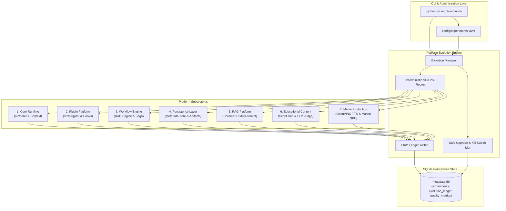
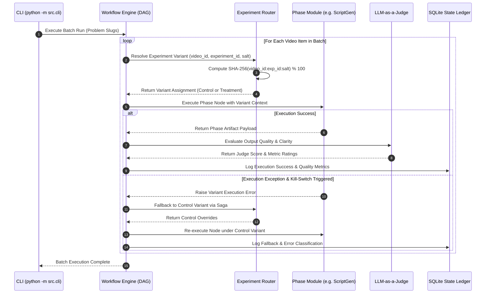
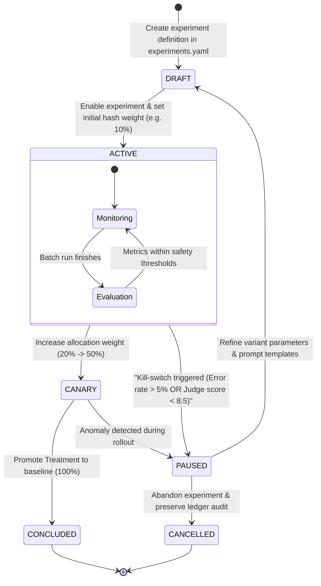
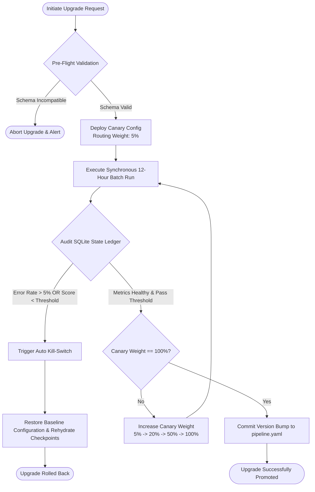

# Phase 15: Platform Evolution Architecture Specification

**Target System:** Automated Data Structures & Algorithms (DSA) Educational YouTube Video Generation Pipeline  
**Target Environment:** Intel Core Ultra 7 155H · Intel Arc GPU · Intel AI Boost NPU · Ubuntu 25.10 LTS · Python 3.12  
**Document Version:** 2.0.0  
**Status:** Canonical Architectural Specification  

---

## Section 1: Executive Summary & Evolution Philosophy

### 1.1 Core Mission & Operational Paradigm
The Automated DSA Educational YouTube Video Pipeline has achieved production maturity across 14 phases. Phase 15 introduces **Platform Evolution Architecture**—a systematic framework for controlled A/B experimentation, data-driven optimization, zero-downtime component upgrades, prompt engineering iteration, model drift monitoring, and schema evolution.

Unlike web services handling concurrent real-time user requests, this system operates strictly under the **Synchronous 12-Hour Batch Pipeline Paradigm**. A scheduled batch run ingests 50–60 LeetCode problem specifications and processes each item sequentially through 13 functional execution phases. Processing each video payload requires intensive CPU compute, Intel Arc Xe GPU rendering (Manim CE 1080p60/4K scenes), and Intel AI Boost NPU execution (Kokoro-82M speech synthesis via OpenVINO). 

Consequently, Platform Evolution must achieve experimentation, dynamic variant routing, and continuous upgrades *without* introducing dynamic request-time race conditions, non-deterministic side effects, or resource contention on hardware accelerators.

```
┌────────────────────────────────────────────────────────────────────────────────────────┐
│                        SYNCHRONOUS 12-HOUR BATCH PIPELINE ENGINE                       │
│  Sequential Dispatch · Hardware Lock Management · Deterministic Checkpoint Retention   │
└──────┬──────────┬──────────┬──────────┬──────────┬──────────┬──────────┬──────────┬──────┘
       │          │          │          │          │          │          │          │
       ▼          ▼          ▼          ▼          ▼          ▼          ▼          ▼
   ┌───────┐  ┌───────┐  ┌───────┐  ┌───────┐  ┌───────┐  ┌───────┐  ┌───────┐  ┌───────┐
   │Scraper│  │ Tags  │  │ RAG   │  │Script │  │ Voice │  │ Manim │  │ Assem │  │YouTube│
   └───────┘  └───────┘  └───────┘  └───────┘  └───────┘  └───────┘  └───────┘  └───────┘
```

### 1.2 Core Architectural Principles
1. **Deterministic Batch Routing:** Pure, stateless routing of video items to experimental treatment variants using SHA-256 content hashes of Video ID, Experiment ID, and Salt.
2. **Single Composition Root:** Explicit manual constructor injection in `src/__main__.py`. Interfaces are bound via PEP 544 `@runtime_checkable` `typing.Protocol` classes without indirect dynamic service discovery.
3. **Stateless Single-Run Execution:** Modules are instantiated once with immutable configuration objects. Output data transfers between pipeline stages exclusively using frozen dataclasses (`@dataclass(frozen=True)`).
4. **Hardware Resource Lock Management:** Exclusive lock files (`/var/lock/openvino_npu.lock` and `/dev/dri/renderD128`) prevent concurrent NPU/GPU access, ensuring experimental variants execute without compute driver contention.
5. **Saga Transaction Rollback:** Database savepoints (`SAVEPOINT saga_stage;`) and scene-level checkpoint retention guarantee mathematical idempotency and instant recovery during batch resumes.

### 1.3 Strict Architectural Compliance & Rejections
The master specification (`02_Project_Architecture.md`) establishes a pure synchronous batch architecture. Platform Evolution explicitly rejects non-blocking concurrency, message-bus, and dynamic discovery indirection paradigms:

| Architectural Domain | Master Specification (v2.0 Synchronous Batch) | Rejected Legacy Pattern | Evolution Implementation Strategy |
|---|---|---|---|
| **Execution Flow** | Synchronous step-by-step function calls | Non-blocking execution loops | Direct, blocking method execution per stage |
| **Component Routing** | Centralized `PipelineOrchestrator` dispatch | Pub/Sub messaging buses | Explicit protocol method invocation |
| **Plugin Wiring** | Explicit wiring in `src/__main__.py` | Dynamic plugin registry discovery | Static protocol assignment & experiment overrides |
| **Dependency Injection**| Manual constructor injection | Framework DI context providers | Direct `__init__` argument passing |
| **System Diagnostics** | Fail-fast protocol assertion & diagnostic checks | Polling background status loops | Pre-flight environment probes & exception traps |
| **Failure Handling** | File checkpoints (`data/checkpoints/`) & retry decorators | Queued message failure brokers | SQLite State Ledger transaction rollbacks |

---

## Section 2: Evolution Integration Architecture Across 7 Subsystems (R1)

Platform Evolution acts as an overarching governance, routing, and telemetry layer across all 7 platform subsystems.

```
┌──────────────────────────────────────────────────────────────────────────────────────────────────┐
│                                PLATFORM EVOLUTION GOVERNANCE ENGINE                              │
│  EvolutionConfig · ExperimentRouter · DynamicVariantInjector · StateLedger · UpgradeManager       │
└────────────────────────────────────────────────┬─────────────────────────────────────────────────┘
                                                 │
  ┌──────────────────┬───────────────────┬───────┴───────────┬───────────────────┬─────────────────┐
  ▼                  ▼                   ▼                   ▼                   ▼                 ▼
┌──────────────┐   ┌──────────────┐   ┌──────────────┐    ┌──────────────┐    ┌──────────────┐  ┌──────────────┐
│  1. RUNTIME  │   │  2. PLUGINS  │   │ 3. WORKFLOW  │    │4. PERSISTENCE│    │   5. RAG     │  │6. EDUCATIONAL│
│  `src/core/` │   │`src/plugins` │   │ `src/wf/`    │    │`metadata.db` │    │ `src/rag/`   │  │`src/script/` │
└──────────────┘   └──────────────┘   └──────────────┘    └──────────────┘    └──────────────┘  └──────────────┘
                                                                                                    │
                                                                                                    ▼
                                                                                               ┌──────────────┐
                                                                                               │  7. MEDIA    │
                                                                                               │ `src/media/` │
                                                                                               └──────────────┘
```

### 2.1 Subsystem 1: Runtime & Core Infrastructure (`src/core/`)
- **Modules & Scope:** Configuration management (`src/core/config.py`), central logging (`src/core/logger.py`), path resolution (`src/core/paths.py`), and domain exception definitions (`src/core/exceptions.py`).
- **Integration Contract:** `EvolutionConfig` merges static system defaults (`config/pipeline.yaml`) with active experiment definitions (`config/experiments.yaml`).
- **Context Binding:** Injects `ExperimentContext(experiment_id, variant_id, hash_bucket, feature_flags)` into `structlog` context bindings. Every log line emitted includes `experiment_id` and `variant_id`.

### 2.2 Subsystem 2: Plugin Platform (`src/plugins/`, `src/models/protocols.py`)
- **Modules & Scope:** Protocol definitions (`ScraperProtocol`, `TagExplorerProtocol`, `RAGEngineProtocol`, `ScriptGeneratorProtocol`, `VoiceSynthesizerProtocol`, `AnimationRendererProtocol`, `VideoAssemblerProtocol`, `YouTubeUploaderProtocol`, `MemoryStoreProtocol`).
- **Integration Contract:** When the orchestrator requests a module instance, `ExperimentRouter` evaluates if an active experiment overrides the baseline protocol implementation for the current video slug.
- **Isolation Sandbox:** Experimental plugin implementations execute in isolated Python namespaces with strict timeout boundaries, falling back to control implementations upon exception.

### 2.3 Subsystem 3: Workflow Engine (`src/orchestrator/`)
- **Modules & Scope:** `PipelineOrchestrator` (`src/orchestrator/pipeline.py`) and `CheckpointManager` (`src/orchestrator/checkpoint.py`).
- **Integration Contract:** Controls stage dispatch order (`Scraper` $\to$ `Tags` $\to$ `RAG` $\to$ `Script` $\to$ `Voice` $\to$ `Manim` $\to$ `Assembly` $\to$ `YouTube` $\to$ `Memory`).
- **Saga Fallback Compensation:** If an experimental variant fails during a stage (e.g. Phase 05 Script Generation), `PipelineOrchestrator` catches the exception, logs a `VARIANT_EXECUTION_FAILURE` in `metadata.db`, re-executes the stage using the Control variant, and resumes the batch without terminating execution.

### 2.4 Subsystem 4: Persistence Layer (`src/persistence/`, `data/metadata.db`)
- **Modules & Scope:** SQLite State Ledger (`metadata.db`), file cache (`FileCache`), checkpoint files (`data/checkpoints/`), and `ArtifactRegistry`.
- **Integration Contract:** Expands `metadata.db` schema with evolution tables (`experiments`, `experiment_allocations`, `evolution_ledger`, `quality_metrics`, `model_drift_ledger`, `prompt_decay_ledger`).
- **Artifact Registry Signatures:** Media assets generated under experimentation are registered with immutable SHA-256 metadata tags: `variant_signature = SHA-256(video_id + variant_id + asset_hash)`.

### 2.5 Subsystem 5: RAG Platform (`src/rag/`)
- **Modules & Scope:** Document chunking (`chunker.py`), Gemini text embeddings (`text-embedding-004`), vector store (`ChromaDB`), and semantic re-ranking.
- **Integration Contract:** Enables A/B testing of embedding models, chunk size strategies (500 tokens vs 1000 tokens), top-K retrieval parameters, and re-ranking algorithms.
- **Multi-Tenant Index Isolation:** ChromaDB vector collections are namespaced by variant (e.g., `dsa_kb_control` vs `dsa_kb_exp_v3`) to prevent cross-contamination during retrieval evaluation.

### 2.6 Subsystem 6: Educational Content Platform (`src/script/`, `src/tags/`, `src/scraper/`)
- **Modules & Scope:** Problem scraping, pattern tagging, LLM prompt engineering, and visual parameter structuring (`VideoScript`, `VisualParams`).
- **Integration Contract:** Facilitates experimentation on prompt templates (`PromptTemplateLibrary`), LLM providers (Gemini 1.5 Pro vs Gemini 2.0 Flash vs Ollama local models), sampling temperature, and judge rubrics.
- **LLM-as-a-Judge Evaluation:** Every generated script is automatically scored by an evaluation node for pedagogical clarity, code correctness, storytelling flow, and timing accuracy, persisting scores to `quality_metrics`.

### 2.7 Subsystem 7: Media Production Platform (`src/voice/`, `src/animation/`, `src/assembly/`, `src/youtube/`)
- **Modules & Scope:** OpenVINO Kokoro TTS voice synthesis, GPU Manim animation rendering, FFmpeg video assembly, and YouTube Data API v3 publishing.
- **Integration Contract:** Supports A/B testing of TTS models (Kokoro-82M on NPU vs XTTS v2 on Arc GPU), visual dark-theme styling parameters, and FFmpeg encoding profiles (QSV H.265 vs AV1).
- **Sequential Accelerator Locking:** NPU and GPU resource lock files are held sequentially per video item regardless of variant, preventing accelerator driver lockups.

### 2.8 Subsystem Integration Matrix

| Subsystem | Target Module Directory | Evolution Integration Hook | Interface Contract Protocol | Default Fallback Behavior |
|---|---|---|---|---|
| **1. Runtime** | `src/core/` | `load_config()` & `structlog` | `EvolutionConfigProtocol` | Load `config/pipeline.yaml` defaults |
| **2. Plugins** | `src/plugins/` | `src/__main__.py` Composition Root | `typing.Protocol` abstractions | Instantiated baseline protocol class |
| **3. Workflow** | `src/orchestrator/` | `PipelineOrchestrator.run()` | `OrchestratorProtocol` | Re-run stage with Control variant |
| **4. Persistence**| `data/metadata.db` | `MetadataStore` & `FileCache` | `MetadataStoreProtocol` | Write to baseline SQLite tables |
| **5. RAG** | `src/rag/` | `ChromaRAGEngine.retrieve()` | `RAGEngineProtocol` | Default collection `dsa_knowledge_base` |
| **6. Educational**| `src/script/` | `ScriptGenerator.generate()` | `ScriptGeneratorProtocol` | Baseline Jinja2 prompt `script_v2.j2` |
| **7. Media** | `src/voice/` / `src/animation/` | `VoiceSynthesizer` / `AnimationRenderer` | `VoiceSynthesizerProtocol` | Kokoro-82M NPU & Manim 1080p30 |

---

## Section 3: Experimentation Lifecycle & Deterministic Routing (R2)

### 3.1 Synchronous Batch Pipeline A/B Testing Routing Logic
In a synchronous batch execution environment, routing decisions must be 100% deterministic, stateless, and repeatable. Random number generators or stateful routing tables introduce non-determinism during job retries and crash recovery.

```
                  ┌─────────────────────────────────────────┐
                  │       INCOMING BATCH VIDEO ITEM         │
                  │   Video ID: "leetcode_0001_two_sum"     │
                  └────────────────────┬────────────────────┘
                                       │
                                       ▼
                  ┌─────────────────────────────────────────┐
                  │      DETERMINISTIC SHA-256 ROUTER       │
                  │  Compute Hash Bucket B(V, E, S) ∈ [0,99] │
                  └────────────────────┬────────────────────┘
                                       │
                     ┌─────────────────┴─────────────────┐
                     ▼                                   ▼
        Bucket B < Weight(Control)           Bucket B >= Weight(Control)
                     │                                   │
                     ▼                                   ▼
        ┌─────────────────────────┐         ┌─────────────────────────┐
        │     CONTROL VARIANT     │         │    TREATMENT VARIANT    │
        │   (Baseline Script V2)  │         │   (Socratic Prompt V3)  │
        └─────────────────────────┘         └─────────────────────────┘
```

### 3.2 Deterministic SHA-256 Hash Routing Equation
Let $V$ be the Video ID string (e.g. `leetcode_0001_two_sum`), $E$ be the Experiment ID string (e.g. `exp_2026_script_prompt_v3`), and $S$ be the Experiment Salt string (e.g. `salt_8f93a902`).

The **Hash Bucket Value** $B(V, E, S) \in [0, 99]$ is defined as:

$$B(V, E, S) = \text{SHA-256}(V \mathbin{\Vert} \text{":"} \mathbin{\Vert} E \mathbin{\Vert} \text{":"} \mathbin{\Vert} S) \pmod{100}$$

Where:
- $\mathbin{\Vert}$ denotes UTF-8 string concatenation.
- $\text{SHA-256}(\cdot)$ computes the 256-bit cryptographic SHA-256 digest, converted to a big-endian unsigned 256-bit integer.
- $\pmod{100}$ extracts the integer remainder, mapping every payload to a bucket index between $0$ and $99$.

### 3.3 Multi-Arm Variant Weight Allocation
For an experiment defining a Control variant weight $W_{\text{control}}$ and Treatment variant weights $W_{v_1}, W_{v_2}, \dots, W_{v_k}$ where $\sum W = 100$:

$$\text{Assigned Variant}(V) = \begin{cases} 
\text{Control} & \text{if } 0 \le B(V, E, S) < W_{\text{control}} \\
\text{Variant}_1 & \text{if } W_{\text{control}} \le B(V, E, S) < W_{\text{control}} + W_{v_1} \\
\text{Variant}_2 & \text{if } W_{\text{control}} + W_{v_1} \le B(V, E, S) < W_{\text{control}} + W_{v_1} + W_{v_2} \\
\dots & \dots
\end{cases}$$

#### Key Properties:
1. **Determinism:** Given the same Video ID, Experiment ID, and Salt, the equation produces the exact same variant assignment across retries and reboots.
2. **Uniformity:** Cryptographic SHA-256 ensures an even distribution across the range $[0, 99]$.
3. **Orthogonality:** Unique salt values ($S$) guarantee independent bucket allocations across multiple active experiments.

### 3.4 Experiment Configuration Schema (`config/experiments.yaml`)

```yaml
version: "1.0.0"
active_experiments:
  - experiment_id: "exp_phase05_socratic_v3"
    name: "Educational Script Generation - Socratic Reasoning V3"
    description: "Evaluates multi-turn Socratic code explanation against baseline control prompt."
    status: "ACTIVE"  # ENUM: DRAFT, ACTIVE, CANARY, PAUSED, CONCLUDED
    created_at: "2026-07-23T12:00:00Z"
    target_phases:
      - "Phase05_ScriptGen"
    salt: "socratic_prompt_v3_salt_9021"
    allocation_strategy: "DETERMINISTIC_HASH"
    variants:
      - variant_id: "control"
        name: "Baseline Script Prompt V2"
        weight: 80
        overrides:
          prompt_template: "templates/script/script_generation_v2.j2"
          llm_model: "gemini-1.5-pro"
          temperature: 0.2
      - variant_id: "treatment_socratic"
        name: "Experimental Socratic Prompt V3"
        weight: 20
        overrides:
          prompt_template: "templates/script/script_generation_v3_socratic.j2"
          llm_model: "gemini-1.5-pro"
          temperature: 0.4
    safety:
      max_allowed_error_rate: 0.05
      min_judge_score_threshold: 8.5
      auto_kill_switch: true
      fallback_variant: "control"
```

---

## Section 4: Safe Upgrade Strategies & Backward Compatibility (R2)

### 4.1 SemVer Schema Contracts & Data Compatibility
All serialized payloads, DTOs, and State Ledger entries contain a Semantic Version header (`schema_version: "2.0.0"`).
- **Major Version Bumps ($X.0.0$):** Breaking changes to frozen dataclass signatures or storage schemas. Requires explicit payload adapters.
- **Minor Version Bumps ($2.Y.0$):** Backward-compatible feature additions (e.g., adding optional metadata fields).
- **Patch Version Bumps ($2.0.Z$):** Internal bug fixes with zero field schema changes.

### 4.2 Payload Adapter Strategy (`PayloadAdapter`)
When an experimental variant alters payload structure (e.g. adding detailed audio timestamp arrays in Phase 08), a versioned adapter transforms data structures:

```python
class PayloadAdapter:
    """Provides forward and backward payload transformations between schema versions."""
    
    @staticmethod
    def upgrade_v1_to_v2(payload_v1: dict) -> dict:
        payload_v2 = dict(payload_v1)
        payload_v2["schema_version"] = "2.0.0"
        payload_v2["audio_timestamps"] = payload_v1.get("timestamps", [])
        return payload_v2

    @staticmethod
    def downgrade_v2_to_v1(payload_v2: dict) -> dict:
        payload_v1 = dict(payload_v2)
        payload_v1["schema_version"] = "1.0.0"
        payload_v1.pop("audio_timestamps", None)
        return payload_v1
```

### 4.3 State Rehydration Safety & Checkpoint Recovery
During batch job resumption after execution interruption, `CheckpointManager` reads stored state files (`data/checkpoints/{slug}/{module}.json`).
1. Compares the stored `variant_signature` against current `config/experiments.yaml`.
2. If an experiment was disabled or paused while the checkpoint was held, `CheckpointManager` invokes `PayloadAdapter.downgrade_v2_to_v1()` to safely rehydrate state under the control variant.

### 4.4 Four Safe Upgrade Strategies

```
┌─────────────────────────────────────────────────────────────────────────────────────────┐
│                                 SAFE UPGRADE LIFECYCLE                                  │
└────────────────────────────────────────────┬────────────────────────────────────────────┘
                                             │
   ┌─────────────────────────────────────────┼─────────────────────────────────────────┐
   ▼                                         ▼                                         ▼
┌───────────────────────┐         ┌───────────────────────┐         ┌───────────────────────┐
│   CANARY PHASE ROUTE  │         │   BLUE / GREEN PIPELINE│         │  ROLLING PHASE UPGRADE│
│  5% ──► 20% ──► 100%  │         │ Pipeline A vs B swap  │         │ Phase 05 -> Phase 08  │
└───────────┬───────────┘         └───────────┬───────────┘         └───────────┬───────────┘
            │                                 │                                 │
            └─────────────────────────────────┼─────────────────────────────────┘
                                              ▼
                                ┌───────────────────────────┐
                                │   HEALTH LEDGER MONITOR   │
                                │ ErrRate <=5%, Score >=8.5 │
                                └─────────────┬─────────────┘
                                              │
                    ┌─────────────────────────┴─────────────────────────┐
                    ▼                                                   ▼
         [ PASS: Promote Variant ]                          [ FAIL: Auto-Kill Switch ]
         Upgrade committed to baseline                      Fallback to Control variant
```

#### 1. Canary Phase Routing
Increases the deterministic hash bucket weight of a treatment variant incrementally across successive 12-hour batch runs ($5\% \to 20\% \to 50\% \to 100\%$). Metrics are evaluated after each batch run before stepping up allocation weight.

#### 2. Blue/Green Pipeline Execution
Maintains two complete execution packages (`src_v1` Green vs `src_v2` Blue). A global CLI flag (`python -m src.cli --pipeline-target blue`) toggles execution roots while sharing underlying SQLite State Ledger (`metadata.db`) and ChromaDB indexes.

#### 3. Rolling Phase Upgrades
Phase-by-phase sequential upgrade strategy. Upgrades Phase 05 Script Generation first, verifies State Ledger performance across 3 batch runs, then rolls out updates to downstream phases (Phase 06 TTS Voice $\to$ Phase 07 Manim Animation).

#### 4. Automated Kill-Switch & Fallback
The `UpgradeManager` audits execution during batch runs. If a treatment variant triggers execution errors exceeding `max_allowed_error_rate` (5%) or judge ratings drop below `min_judge_score_threshold` (8.5), the kill-switch updates experiment status to `PAUSED` in `metadata.db` and redirects all remaining items to `fallback_variant`.

---

## Section 5: Analytics Strategy & SQLite State Ledger (R3)

### 5.1 Periodic Batch Reporting Architecture
At the conclusion of each 12-hour batch run, `EvolutionAnalyticsWorker` queries `metadata.db` to compile analytical reports covering execution accuracy, error trends, model drift, and prompt template quality decay.

### 5.2 Key Metric Definitions

#### 1. Success Rate ($SR$)
The percentage of phase executions completed without exception:
$$SR_{\text{variant}} = \left( \frac{N_{\text{success}}}{N_{\text{total}}} \right) \times 100\%$$

#### 2. Error Trend Taxonomy
Categorized into four distinct failure domains:
- `TRANSIENT_NETWORK`: External API rate limits (HTTP 429), connection timeouts.
- `COMPUTE_RESOURCE`: NPU Out-of-Memory, Arc GPU memory allocation error, FFmpeg segfault.
- `QUALITY_REJECT`: LLM-as-a-Judge overall score below threshold (< 8.5).
- `SCHEMA_VALIDATION`: Payload contract validation exception or dataclass parsing error.

#### 3. Model Drift Vector ($MDV$)
Quantifies statistical output divergence from LLM and embedding providers over a 30-day window:
$$MDV = \Delta \bar{L} + \alpha (\Delta \bar{T}) + \beta (\Delta \bar{S})$$

Where $\Delta \bar{L}$ is latency shift (ms), $\Delta \bar{T}$ is mean token count shift, $\Delta \bar{S}$ is evaluation score variance shift, and $\alpha, \beta$ are scaling weights.

#### 4. Prompt Quality Decay ($PQD$)
Measures rolling quality regression for a specific prompt template version:
$$PQD = \left( \frac{\bar{Q}_{\text{baseline}} - \bar{Q}_{\text{current}}}{\bar{Q}_{\text{baseline}}} \right) \times 100\%$$

Where $\bar{Q}_{\text{baseline}}$ is the initial 50-sample mean judge rating, and $\bar{Q}_{\text{current}}$ is the current 7-day rolling mean rating.

### 5.3 Complete SQLite DDL Schema Statements (`metadata.db`)

```sql
-- 1. Experiments Table
CREATE TABLE IF NOT EXISTS experiments (
    experiment_id TEXT PRIMARY KEY,
    name TEXT NOT NULL,
    description TEXT,
    status TEXT NOT NULL CHECK (status IN ('DRAFT', 'ACTIVE', 'CANARY', 'PAUSED', 'CONCLUDED')),
    target_phases TEXT NOT NULL, -- Serialized JSON array of phase identifiers
    salt TEXT NOT NULL,
    allocation_strategy TEXT NOT NULL DEFAULT 'DETERMINISTIC_HASH',
    created_at TIMESTAMP DEFAULT CURRENT_TIMESTAMP,
    updated_at TIMESTAMP DEFAULT CURRENT_TIMESTAMP
);

-- 2. Experiment Allocations Table
CREATE TABLE IF NOT EXISTS experiment_allocations (
    allocation_id TEXT PRIMARY KEY,
    experiment_id TEXT NOT NULL,
    video_id TEXT NOT NULL,
    batch_run_id TEXT NOT NULL,
    hash_bucket INTEGER NOT NULL,
    variant_id TEXT NOT NULL,
    allocated_at TIMESTAMP DEFAULT CURRENT_TIMESTAMP,
    FOREIGN KEY (experiment_id) REFERENCES experiments(experiment_id),
    UNIQUE(experiment_id, video_id, batch_run_id)
);

-- 3. Evolution Ledger Table (Execution Log per Phase/Item)
CREATE TABLE IF NOT EXISTS evolution_ledger (
    ledger_id TEXT PRIMARY KEY,
    batch_run_id TEXT NOT NULL,
    video_id TEXT NOT NULL,
    phase_id TEXT NOT NULL,
    experiment_id TEXT,
    variant_id TEXT NOT NULL DEFAULT 'control',
    execution_status TEXT NOT NULL CHECK (execution_status IN ('SUCCESS', 'FAILURE', 'FALLBACK_EXECUTED')),
    error_type TEXT, -- ENUM: TRANSIENT_NETWORK, COMPUTE_RESOURCE, QUALITY_REJECT, SCHEMA_VALIDATION
    error_message TEXT,
    latency_ms REAL NOT NULL,
    input_tokens INTEGER DEFAULT 0,
    output_tokens INTEGER DEFAULT 0,
    compute_device TEXT, -- ENUM: CPU, GPU, NPU
    created_at TIMESTAMP DEFAULT CURRENT_TIMESTAMP,
    FOREIGN KEY (experiment_id) REFERENCES experiments(experiment_id)
);

-- 4. Quality Metrics Table (LLM Judge Ratings)
CREATE TABLE IF NOT EXISTS quality_metrics (
    metric_id TEXT PRIMARY KEY,
    ledger_id TEXT NOT NULL,
    video_id TEXT NOT NULL,
    variant_id TEXT NOT NULL,
    overall_judge_score REAL NOT NULL,
    pedagogical_clarity REAL NOT NULL,
    code_correctness REAL NOT NULL,
    visual_engagement REAL NOT NULL,
    hallucination_flag INTEGER NOT NULL DEFAULT 0, -- 0 = false, 1 = true
    judge_model TEXT NOT NULL,
    evaluated_at TIMESTAMP DEFAULT CURRENT_TIMESTAMP,
    FOREIGN KEY (ledger_id) REFERENCES evolution_ledger(ledger_id)
);

-- 5. Model Drift Ledger Table
CREATE TABLE IF NOT EXISTS model_drift_ledger (
    drift_id TEXT PRIMARY KEY,
    model_identifier TEXT NOT NULL,
    evaluation_window_start TIMESTAMP NOT NULL,
    evaluation_window_end TIMESTAMP NOT NULL,
    avg_latency_ms REAL NOT NULL,
    latency_p95_ms REAL NOT NULL,
    avg_output_tokens REAL NOT NULL,
    score_variance REAL NOT NULL,
    drift_detected INTEGER NOT NULL DEFAULT 0, -- 0 = false, 1 = true
    created_at TIMESTAMP DEFAULT CURRENT_TIMESTAMP
);

-- 6. Prompt Decay Ledger Table
CREATE TABLE IF NOT EXISTS prompt_decay_ledger (
    decay_id TEXT PRIMARY KEY,
    prompt_template_id TEXT NOT NULL,
    template_version TEXT NOT NULL,
    batch_run_id TEXT NOT NULL,
    sample_size INTEGER NOT NULL,
    avg_quality_score REAL NOT NULL,
    decay_percentage REAL NOT NULL DEFAULT 0.0,
    created_at TIMESTAMP DEFAULT CURRENT_TIMESTAMP
);

-- Index Definitions for Analytical Acceleration
CREATE INDEX IF NOT EXISTS idx_evo_ledger_exp_var ON evolution_ledger(experiment_id, variant_id);
CREATE INDEX IF NOT EXISTS idx_evo_ledger_batch ON evolution_ledger(batch_run_id);
CREATE INDEX IF NOT EXISTS idx_quality_variant ON quality_metrics(variant_id);
CREATE INDEX IF NOT EXISTS idx_allocations_video ON experiment_allocations(video_id);
```

---

## Section 6: Production SQL Query Specifications (R3)

### 6.1 Query 1: Variant Performance Comparison Report
Evaluates execution efficiency, latency, token consumption, and judge quality ratings across experiment variants.

```sql
SELECT 
    l.experiment_id,
    l.variant_id,
    COUNT(DISTINCT l.video_id) AS total_videos,
    ROUND(SUM(CASE WHEN l.execution_status = 'SUCCESS' THEN 1 ELSE 0 END) * 100.0 / COUNT(*), 2) AS success_rate_pct,
    ROUND(AVG(l.latency_ms), 2) AS avg_latency_ms,
    ROUND(AVG(l.input_tokens + l.output_tokens), 2) AS avg_total_tokens,
    ROUND(AVG(q.overall_judge_score), 2) AS avg_judge_score,
    ROUND(AVG(q.pedagogical_clarity), 2) AS avg_clarity_score,
    ROUND(AVG(q.code_correctness), 2) AS avg_code_accuracy,
    COALESCE(SUM(q.hallucination_flag), 0) AS total_hallucinations
FROM evolution_ledger l
LEFT JOIN quality_metrics q ON l.ledger_id = q.ledger_id
WHERE l.experiment_id = :experiment_id
GROUP BY l.experiment_id, l.variant_id;
```

### 6.2 Query 2: Error Trend & Classification Analysis
Aggregates and categorizes failures by phase, variant, and error domain over a 7-day rolling window.

```sql
SELECT 
    l.phase_id,
    l.variant_id,
    l.error_type,
    COUNT(*) AS error_count,
    ROUND(COUNT(*) * 100.0 / SUM(COUNT(*)) OVER (PARTITION BY l.phase_id), 2) AS error_share_pct,
    MAX(l.created_at) AS last_error_timestamp
FROM evolution_ledger l
WHERE l.execution_status != 'SUCCESS'
  AND l.created_at >= datetime('now', '-7 days')
GROUP BY l.phase_id, l.variant_id, l.error_type
ORDER BY error_count DESC;
```

### 6.3 Query 3: Model Drift Detection over Moving Windows
Tracks daily latency shifts, token volume changes, mean quality ratings, and score variance over a 30-day window.

```sql
SELECT 
    l.phase_id,
    l.variant_id,
    DATE(l.created_at) AS execution_date,
    COUNT(*) AS sample_count,
    ROUND(AVG(l.latency_ms), 2) AS mean_latency,
    ROUND(AVG(l.output_tokens), 2) AS mean_tokens,
    ROUND(AVG(q.overall_judge_score), 2) AS mean_score,
    ROUND(
        AVG(q.overall_judge_score * q.overall_judge_score) - (AVG(q.overall_judge_score) * AVG(q.overall_judge_score)), 
        4
    ) AS score_variance
FROM evolution_ledger l
JOIN quality_metrics q ON l.ledger_id = q.ledger_id
WHERE l.created_at >= datetime('now', '-30 days')
GROUP BY l.phase_id, l.variant_id, DATE(l.created_at)
ORDER BY execution_date ASC;
```

### 6.4 Query 4: Prompt Quality Decay Detection
Identifies quality degradation for prompt templates by comparing initial baseline averages to current rolling ratings.

```sql
WITH RollingScores AS (
    SELECT 
        q.judge_model,
        l.phase_id,
        q.evaluated_at,
        q.overall_judge_score,
        AVG(q.overall_judge_score) OVER (
            PARTITION BY l.phase_id, l.variant_id 
            ORDER BY q.evaluated_at 
            ROWS BETWEEN 50 PRECEDING AND CURRENT ROW
        ) AS rolling_avg_score
    FROM quality_metrics q
    JOIN evolution_ledger l ON q.ledger_id = l.ledger_id
),
DecayMetrics AS (
    SELECT 
        phase_id,
        FIRST_VALUE(rolling_avg_score) OVER (
            PARTITION BY phase_id ORDER BY evaluated_at ASC
        ) AS initial_baseline_score,
        LAST_VALUE(rolling_avg_score) OVER (
            PARTITION BY phase_id ORDER BY evaluated_at ASC 
            RANGE BETWEEN UNBOUNDED PRECEDING AND UNBOUNDED FOLLOWING
        ) AS current_rolling_score
    FROM RollingScores
)
SELECT DISTINCT
    phase_id,
    ROUND(initial_baseline_score, 2) AS initial_baseline_score,
    ROUND(current_rolling_score, 2) AS current_rolling_score,
    ROUND(
        (initial_baseline_score - current_rolling_score) * 100.0 / initial_baseline_score, 
        2
    ) AS prompt_decay_pct
FROM DecayMetrics;
```

---

## Section 7: Mermaid Architecture & Flow Diagrams (R4)

### 7.1 Diagram 1: Evolution Integration Architecture Topology



### 7.2 Diagram 2: Sequence Flow for Experiment Routing & Synchronous Execution



### 7.3 Diagram 3: Experimentation Lifecycle Flow State Machine



### 7.4 Diagram 4: Safe Upgrade Lifecycle Flowchart



---

## Section 8: Operational CLI Guidance & Administration (R4)

All platform evolution management, A/B experiment toggling, analytical reporting, and upgrade rollbacks are administered via standard CLI command syntax (`python -m src.cli evolution`).

### 8.1 Experiment Management Subcommands

```bash
# List all registered experiments and their current status
python -m src.cli evolution experiment list

# Show detailed configuration and live ledger metrics for a specific experiment
python -m src.cli evolution experiment show --id exp_phase05_socratic_v3

# Enable an experiment or adjust hash bucket allocation percentage
python -m src.cli evolution experiment enable \
    --id exp_phase05_socratic_v3 \
    --percent 20

# Instantly pause/disable an active experiment (Manual Kill-Switch)
python -m src.cli evolution experiment disable \
    --id exp_phase05_socratic_v3 \
    --reason "Judge score dropped below minimum threshold (8.2 < 8.5)"
```

### 8.2 Analytics & Reporting Subcommands

```bash
# Generate batch evolution report for a completed 12-hour batch run
python -m src.cli evolution analytics report \
    --batch-id BATCH_20260723_01 \
    --format text

# Export experiment variant evaluation comparison matrix to JSON
python -m src.cli evolution analytics compare \
    --id exp_phase05_socratic_v3 \
    --output artifacts/reports/exp_socratic_v3_report.json

# Audit model drift metrics across a rolling 30-day window
python -m src.cli evolution analytics drift \
    --window-days 30 \
    --threshold-stddev 2.0

# Detect prompt template quality decay across active templates
python -m src.cli evolution analytics prompt-decay \
    --min-sample-size 50
```

### 8.3 Upgrade & Rollback Subcommands

```bash
# Perform dry-run pre-flight validation check for a proposed system upgrade
python -m src.cli evolution upgrade dry-run \
    --config config/upgrades/v2_0_upgrade.yaml

# Execute canary phase rollout upgrade with initial allocation
python -m src.cli evolution upgrade execute \
    --config config/upgrades/v2_0_upgrade.yaml \
    --canary-percent 10

# Perform emergency rollback to target baseline release version
python -m src.cli evolution upgrade rollback \
    --target-version v1.4.0 \
    --force
```

### 8.4 Disaster Recovery & Incident Response Playbook
1. **Automated Incident Trigger:** When `evolution_ledger` records consecutive failures exceeding 5% or judge scores collapse, the automated kill-switch sets experiment `status = 'PAUSED'`.
2. **Immediate Mitigation:** Run `python -m src.cli evolution experiment disable --id <exp_id>` to guarantee all subsequent items fall back to Control.
3. **State Rehydration:** Re-run the batch command `python -m src.cli batch-run --resume-from-checkpoint`. The system validates checkpoints, applies `PayloadAdapter.downgrade_v2_to_v1()`, and resumes execution under baseline control without data loss.
